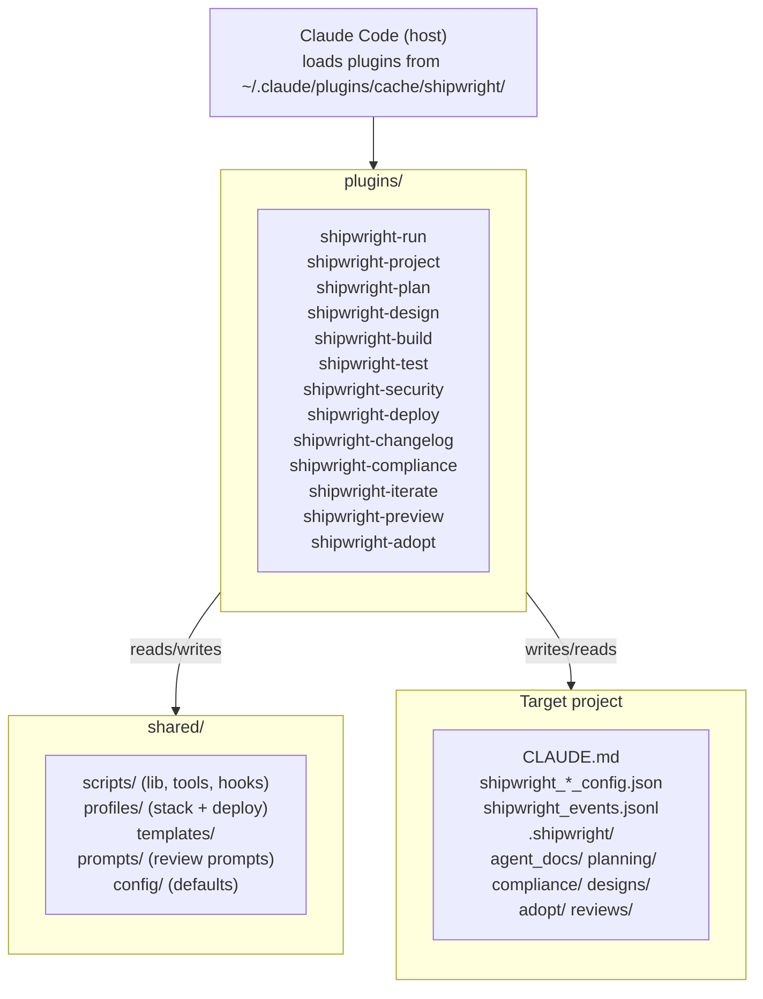

# Architecture — shipwright
<!-- shipwright:architecture v=2 last-sync=932e0d221ea1 -->

## System Overview

## Stack

| Layer | Technology | Notes |
|-------|-----------|-------|
| Frontend | — | — |
| Backend | — | — |
| Database | — | — |
| Auth | — | — |
| Runtime | python | — |

## Layers Detected

- **docs**: `docs`
- **infrastructure**: `scripts`
- **tests**: `Spec`, `integration-tests`

## Key Architecture Decisions

See `decision_log.md` for detailed ADRs. Profile-level decisions (stack, auth pattern, DB strategy, folder structure) are defined by the stack profile (`python-plugin-monorepo`).

## Data Flow

Each SDLC phase is its own Claude Code plugin under plugins/<phase>/, with the standard Claude Code plugin layout: .claude-plugin/plugin.json, hooks/hooks.json, skills/<phase>/SKILL.md, scripts/ (checks, hooks, lib, tools), tests/, and pyproject.toml. Cross-plugin code lives under shared/ (scripts, profiles, templates, prompts, config). Plugins communicate via a unified session id (SHIPWRIGHT_SESSION_ID), shared shipwright_*_config.json files written into the target project, and an append-only shipwright_events.jsonl event log. Hooks defined in hooks.json are the single source of truth for between-phase actions and quality gates; behavior is documented in docs/hooks-and-pipeline.md. Memory and decision history is captured in .shipwright/agent_docs/decision_log.md (canonical H3 ADR format) and per-iterate or per-phase artifacts under .shipwright/planning/ and .shipwright/compliance/. A separate plugin cache at ~/.claude/plugins/cache/shipwright/ is used by Claude Code at runtime; updates require running scripts/update-marketplace.sh after pushing plugin-side changes.

Secrets live exclusively in `<project_root>/.env.local`, scaffolded by `/shipwright-adopt` (Step E.5, ADR-021) and read at runtime by `shared/scripts/lib/env.py::load_shipwright_env`. Every adopted repo carries the framework-level external-review keys (OPENROUTER_API_KEY, GEMINI_API_KEY, OPENAI_API_KEY) plus the active profile's `required_env_vars`. The file is git-ignored before write — a `.gitignore` enforcement failure aborts the scaffold rather than risking a tracked secrets file.

**Triage Inbox** (iterate-2026-05-11-triage-inbox-1a, ADR-046): pre-backlog intake JSONL store under `<project_root>/.shipwright/triage.jsonl`, gitignored, append-only with history events. Producers (Phase-Quality Stop-hook + Compliance audit_detector) emit findings via `shared/scripts/triage.py::append_triage_item_idempotent` with dedup-keys (`{phase}:{code}` for Phase-Quality with 24h window, `check_id` for Compliance with cross-session window=None). Consumer (`aggregate_triage_on_stop.py`, last Stop-hook in the iterate plugin's chain) regenerates `.shipwright/agent_docs/triage_inbox.md`. Promote bridge: manual CLI `shared/scripts/tools/triage_promote.py` (Iterate 1a) → future WebUI Triage tab (Iterate 3) creating an `ExternalTask` in shipwright-webui's `sdk-sessions.json` with `promotedFromTriageId` back-reference. Triage and Backlog are intentionally separate stores; see `docs/guide.md` § 4.11.

**GitHub findings producer** (iterate-2026-05-19-github-triage-importer): a throttled SessionStart hook `shared/scripts/hooks/import_github_findings.py` — registered once, only in the shipwright-iterate plugin's `hooks.json` — pulls GitHub code-scanning / Dependabot / secret-scanning alerts and the latest failed default-branch CI run per workflow via the `gh` CLI and emits them as `source="github"` triage items. Logic is split across two shared modules: `shared/scripts/github_api.py` (thin `gh api` client; returns `None` on any failure so callers can tell a failed fetch from an empty one) and `shared/scripts/github_triage.py` (alert→item mapping, throttle, orchestrator). New write surface: `<project_root>/.shipwright/github_import_state.json` (throttle timestamp, gitignored by the `.shipwright/*` rule). New read surface: the GitHub REST API via `gh`. Throttle interval resolves run-config `triage.github_import_throttle_hours` → env `SHIPWRIGHT_GITHUB_IMPORT_THROTTLE_HOURS` → 6h default. Dedup keys are stable and namespaced (`github:{code-scanning,dependabot,secret-scanning}:<number>`, `github-ci:<workflow>:<sha>`); auto-resolve is key-shape-scoped (ADR-052) and fires only for sources whose fetch succeeded — a failed fetch never mass-resolves. The hook is fail-soft (always exit 0). Un-defers the CI producer deferred under ADR-047 — pull-based, not the webhook receiver originally ruled out of scope.

**GitHub security-artifact ingestion path** (iterate-2026-05-21-security-artifact-producer): the same SessionStart hook gains a parallel third source for the `gh-security:{owner}/{repo}` action-unit. When `cs_alerts is None` (GHAS Code Scanning unavailable — typical on private repos without GHAS), `github_api.latest_security_workflow_run()` finds the most recent successful run of `.github/workflows/security.yml` on the default branch (gated by a `SHIPWRIGHT_GITHUB_ARTIFACT_MAX_AGE_DAYS` freshness window, default 14d), then `github_api.download_security_findings(run_id)` pulls the `security-scan-results` artifact via `gh run download`, parses `findings.json`, and returns the validated `findings` list. The orchestrator routes the result to a sibling mapper `github_triage.security_action_unit_from_artifact` that produces an action-unit with the same `gh-security:{owner}/{repo}` dedup key and `launchPayload` contract. The artifact path is skipped when `cs_alerts` succeeds (no double-counting against GHAS-uploaded SARIF). `by_source["gh-security:artifact"]` distinguishes the ingestion path for telemetry. Severity counts are derived from iterating `findings[]` rather than trusting the redundant `by_severity` aggregate; raw scanner-controlled strings (`rule` / `description` / `affected_file`) are never rendered into the persisted `detail` or `launchPayload`. See `docs/security-ci-setup.md` for the Path A vs Path B operator choice and `docs/guide.md` § 4.11.1 for the user-facing action-unit description.

**Worktree isolation** (iterate-2026-05-15-iterate-worktree-isolation): every `/shipwright-iterate` run executes in its own git worktree under `<project_root>/.worktrees/<slug>/` on branch `iterate/<slug>`, cut from freshly-fetched `origin/<default>`. `setup_iterate_worktree.py` (skill step B1a) creates it and writes two gitignored main-repo surfaces: a per-run main-tree snapshot at `.shipwright/runs/<run-id>/main_tree_snapshot.json` and a per-session run pointer at `.shipwright/iterate_active/<session-id>.json`. The F0/F11 leak-guard `check_iterate_isolation.py` diffs the main tree against that snapshot and fails closed on any leak — except the repo-scoped `shipwright_events.jsonl`(`.lock`), which F7 records into the main log post-commit by design (iterate-2026-05-16-fix-events-worktree-aware). Iterate ADRs are written run-id-keyed to `.shipwright/agent_docs/decision-drops/` (`write_decision_drop.py`) and folded into `decision_log.md` with sequential `ADR-NNN` at release time by `aggregate_decisions.py`. The former canonical/secondary session-role machinery is removed — isolation is structural, not detected.

## See also

_Existing user-facing documentation discovered by /shipwright-adopt._

- [`README.md`](../../README.md)
- [`docs/guide.md`](../../docs/guide.md)

## Architecture Updates

- **ADR-021** (2026-05-03): Adopt scaffolds .env.local with profile + framework keys (Layer-3 SSoT)
- **ADR-024** (2026-05-03): Boundary Tests Foundation — `touches_io_boundary` risk flag + Boundary Probe sub-step in iterate Build TDD (Sub-Iterate A of campaign iterate-skill-hardening). New helper `is_io_boundary_change(changed_files)` in `plugins/shipwright-iterate/scripts/lib/classify_complexity.py`; new reference docs `references/boundary-probes.md` (8 edge-case categories) and `references/round-trip-tests.md` (producer→file→consumer test pattern). 7th Self-Review item ("Affected Boundaries") added.
- **ADR-030** (2026-05-05): suggest_iterate UserPromptSubmit hook is plugin-owned, not project-installed. Convention shift: `${CLAUDE_PLUGIN_ROOT}` is reserved for plugin-context hooks (the variable does not expand in project-level `.claude/settings.json`); any hook command that references it MUST be registered in a plugin's own `hooks/hooks.json`. Retired `plugins/shipwright-adopt/scripts/lib/hook_installer.py` + `check_a6_hook_installed` verifier + `validate_adoption._validate_hook` + the per-project-install snippets in `shipwright-{run,project}` SKILL.md and the auto-install stanzas in seven phase-plugin SKILL.md files. New canonical registration lives in `plugins/shipwright-iterate/hooks/hooks.json` under `UserPromptSubmit`. ADRs 019 and 020 (Shape B carrier + quoted path + `--no-project`) survive verbatim inside the plugin registration.

- **ADR-032** (2026-05-05): Adopt writes shipwright_iterate_config.json with documented opt-out schema

- **ADR-034** (2026-05-06): load_review_config deep-merges per-project override; cascade helper added

- **ADR-043** (2026-05-11): Adopt scaffolds profile-aware CI + Claude-Review workflows with cross-platform OS matrix as default. New convention: every CI template that adopt writes carries `strategy.matrix.os: [ubuntu-latest, windows-latest]` + `fail-fast: false`. New write surfaces in adopted target repos: `.github/workflows/ci.yml` (profile-mapped via `shared/scripts/lib/ci_workflow.py::TEMPLATE_BY_PROFILE`) + `.github/workflows/claude-review.yml`. Three profile-specific templates ship: `ci-supabase-nextjs.yml.template`, `ci-vite-hono.yml.template`, `ci-python-plugin-monorepo.yml.template`. Steps E.14 + E.15 in `generate_adoption_artifacts.py`, analogous to E.13 (security scaffold). Shared `workflow_scaffold_helper.copy_template_if_absent()` extracted (security scaffolder NOT migrated to it in this iterate, separate diff). New opt-in Tier-2 template `shared/templates/path-helpers.ts.template` codifies the `pickPathModule(input)` heuristic — origin: shipwright-webui v0.8.5 cross-platform path regression that motivated this iterate.

- **iterate-2026-05-16-fix-events-worktree-aware** (2026-05-16): Worktree-aware event-log resolution. New shared SSoT helper `shared/scripts/lib/events_log.py::resolve_events_path` resolves `shipwright_events.jsonl` via `git rev-parse --git-common-dir` — under `/shipwright-iterate` worktree isolation the log is read/written at the MAIN repo, not the ephemeral worktree copy that `git worktree remove` discards. New convention: every worktree-reachable event-log accessor (`record_event.py` F7, `verifiers/iterate_checks.py` F11, `config.read_events` F5b dashboard) MUST resolve via the helper; the drift meta-test `shared/tests/test_events_log_ssot.py` enforces it (forward + reverse) with a documented `_MAIN_REPO_ONLY` allowlist. The F0/F11 leak-guard exempts `shipwright_events.jsonl`(`.lock`) as a designed main-tree write. F5b also embeds the iterate `run_id` in the `build_dashboard.md` header so the F11 verifier has a deterministic, timing-independent marker.

- **iterate-2026-05-19-github-triage-importer** (2026-05-19): GitHub findings triage producer. New throttled SessionStart hook `shared/scripts/hooks/import_github_findings.py` (registered once, in the shipwright-iterate plugin) + two shared modules `shared/scripts/github_api.py` (gh-CLI client) and `shared/scripts/github_triage.py` (mapping/throttle/orchestrator). New write surface `<project_root>/.shipwright/github_import_state.json` (throttle timestamp); new read surface the GitHub REST API via `gh`. Imports code-scanning / Dependabot / secret-scanning alerts + failed default-branch CI runs as `source="github"` triage items with key-shape-scoped auto-resolve. Un-defers the ADR-047 CI producer (pull-based `gh api`, not a webhook receiver).

- **iterate-2026-05-20-escape-md-cells** (2026-05-20): Markdown table cell escaping. New cross-cutting helper `shared/scripts/markdown_table.py::escape_cell` lives at the top-level of `shared/scripts/` (NOT under `lib/`, per ADR-045) so it can be imported from both `shared/scripts/tools/` and `plugins/shipwright-compliance/scripts/lib/` without the regular-vs-namespace-package collision. New convention: every event-derived cell in a markdown table rendered by the framework (build dashboard's Recent-Changes / Build-History rows, compliance lib's RTM verification timeline, test-evidence test progression, change-history commits, compliance dashboard's external-review-evidence row) MUST be wrapped in `escape_cell()`. The helper applies the minimal `\\` / `|` / newline substitutions needed to keep `| {...} | ... |` row layout intact when a field contains a literal pipe or newline. Drift-protection lives in `shared/tests/test_markdown_table.py` (8 boundary categories) + `shared/tests/test_build_dashboard_md_escaping.py` (real-renderer round-trip via `re.split(r"(?<!\\)\|", row)`). Origin: empirically broken Recent-Changes row in shipwright-webui repo when an event description contained `(local|tailscale|open)`.

- **iterate-2026-05-20-triage-launch-surface** (2026-05-20): Triage Inbox as launch-surface (not finding-mirror). Supersedes #39's per-finding GitHub mapping with **action-units** — one operator-actionable item per repo (security / secrets) or per failing workflow (CI). New convention: every triage item carries an optional `launchPayload` field (camelCase wire, frozen at first append) — a ready-to-paste block with the slash command + GitHub URL. New action-unit dedup-key prefixes `gh-security:{owner}/{repo}`, `gh-secrets:{owner}/{repo}`, `gh-ci:{workflow_id}` (sha dropped). One-shot per-source-gated legacy-item migration (`reason="schemaMigration"`) sweeps pre-iterate items as their feed succeeds — preserves the ADR-052 fail-soft invariant. **New CLI surface** `shared/scripts/tools/triage_cli.py` (positional `<id>`, subcommands `list` / `promote` / `dismiss`) — first-class operation interface parallel to the future WebUI Triage tab; both surfaces delegate to the same `triage_promote.promote` / `triage_promote.dismiss` library helpers so audit-trail events are byte-identical. New helper `github_api.owner_repo()` — local-first (parses `git remote get-url origin`, NEVER calls `gh api`), returns `None` on missing/non-GitHub remotes so the producer skips emission rather than emitting malformed keys. Aggregator renders `launchPayload` in a fenced markdown code block under each open item; control characters stripped in both CLI and markdown render paths. Secret-scanning action-unit payload is whitelist-only — no alert content, no per-alert URLs, no secret values.
