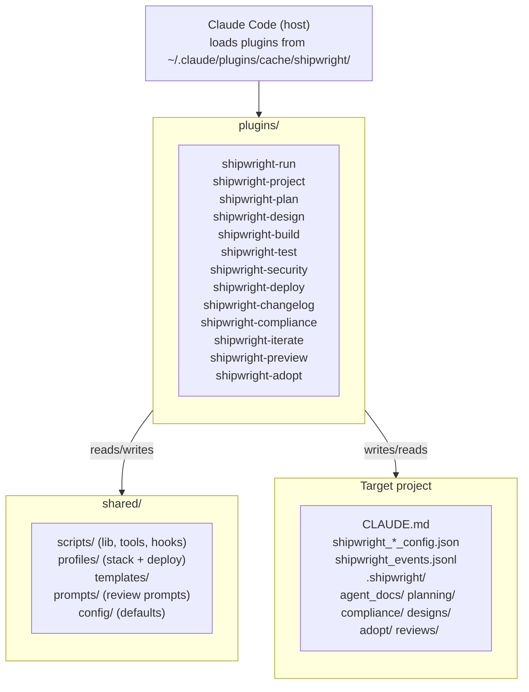

# Architecture — shipwright
<!-- shipwright:architecture v=2 last-sync=932e0d221ea1 -->

## System Overview

## Stack

| Layer | Technology | Notes |
|-------|-----------|-------|
| Frontend | — | — |
| Backend | — | — |
| Database | — | — |
| Auth | — | — |
| Runtime | python | — |

## Layers Detected

- **docs**: `docs`
- **infrastructure**: `scripts`
- **tests**: `Spec`, `integration-tests`

## Key Architecture Decisions

See `decision_log.md` for detailed ADRs. Profile-level decisions (stack, auth pattern, DB strategy, folder structure) are defined by the stack profile (`python-plugin-monorepo`).

## Data Flow

Each SDLC phase is its own Claude Code plugin under plugins/<phase>/, with the standard Claude Code plugin layout: .claude-plugin/plugin.json, hooks/hooks.json, skills/<phase>/SKILL.md, scripts/ (checks, hooks, lib, tools), tests/, and pyproject.toml. Cross-plugin code lives under shared/ (scripts, profiles, templates, prompts, config). Plugins communicate via a unified session id (SHIPWRIGHT_SESSION_ID), shared shipwright_*_config.json files written into the target project, and an append-only shipwright_events.jsonl event log. Hooks defined in hooks.json are the single source of truth for between-phase actions and quality gates; behavior is documented in docs/hooks-and-pipeline.md. Memory and decision history is captured in .shipwright/agent_docs/decision_log.md (canonical H3 ADR format) and per-iterate or per-phase artifacts under .shipwright/planning/ and .shipwright/compliance/. A separate plugin cache at ~/.claude/plugins/cache/shipwright/ is used by Claude Code at runtime; updates require running scripts/update-marketplace.sh after pushing plugin-side changes.

Secrets live exclusively in `<project_root>/.env.local`, scaffolded by `/shipwright-adopt` (Step E.5, ADR-021) and read at runtime by `shared/scripts/lib/env.py::load_shipwright_env`. Every adopted repo carries the framework-level external-review keys (OPENROUTER_API_KEY, GEMINI_API_KEY, OPENAI_API_KEY) plus the active profile's `required_env_vars`. The file is git-ignored before write — a `.gitignore` enforcement failure aborts the scaffold rather than risking a tracked secrets file.

**Triage Inbox** (iterate-2026-05-11-triage-inbox-1a, ADR-046): pre-backlog intake JSONL store under `<project_root>/.shipwright/triage.jsonl`, gitignored, append-only with history events. Producers (Phase-Quality Stop-hook + Compliance audit_detector) emit findings via `shared/scripts/triage.py::append_triage_item_idempotent` with dedup-keys (`{phase}:{code}` for Phase-Quality with 24h window, `check_id` for Compliance with cross-session window=None). Consumer (`aggregate_triage_on_stop.py`, last Stop-hook in the iterate plugin's chain) regenerates `.shipwright/agent_docs/triage_inbox.md`. Promote bridge: manual CLI `shared/scripts/tools/triage_promote.py` (Iterate 1a) → future WebUI Triage tab (Iterate 3) creating an `ExternalTask` in shipwright-webui's `sdk-sessions.json` with `promotedFromTriageId` back-reference. Triage and Backlog are intentionally separate stores; see `docs/guide.md` § 4.11.

**GitHub findings producer** (iterate-2026-05-19-github-triage-importer): a throttled SessionStart hook `shared/scripts/hooks/import_github_findings.py` — registered once, only in the shipwright-iterate plugin's `hooks.json` — pulls GitHub code-scanning / Dependabot / secret-scanning alerts and the latest failed default-branch CI run per workflow via the `gh` CLI and emits them as `source="github"` triage items. Logic is split across two shared modules: `shared/scripts/github_api.py` (thin `gh api` client; returns `None` on any failure so callers can tell a failed fetch from an empty one) and `shared/scripts/github_triage.py` (alert→item mapping, throttle, orchestrator). New write surface: `<project_root>/.shipwright/github_import_state.json` (throttle timestamp, gitignored by the `.shipwright/*` rule). New read surface: the GitHub REST API via `gh`. Throttle interval resolves run-config `triage.github_import_throttle_hours` → env `SHIPWRIGHT_GITHUB_IMPORT_THROTTLE_HOURS` → 6h default. Dedup keys are stable and namespaced (`github:{code-scanning,dependabot,secret-scanning}:<number>`, `github-ci:<workflow>:<sha>`); auto-resolve is key-shape-scoped (ADR-052) and fires only for sources whose fetch succeeded — a failed fetch never mass-resolves. The hook is fail-soft (always exit 0). Un-defers the CI producer deferred under ADR-047 — pull-based, not the webhook receiver originally ruled out of scope.

**GitHub security-artifact ingestion path** (iterate-2026-05-21-security-artifact-producer): the same SessionStart hook gains a parallel third source for the `gh-security:{owner}/{repo}` action-unit. When `cs_alerts is None` (GHAS Code Scanning unavailable — typical on private repos without GHAS), `github_api.latest_security_workflow_run()` finds the most recent successful run of `.github/workflows/security.yml` on the default branch (gated by a `SHIPWRIGHT_GITHUB_ARTIFACT_MAX_AGE_DAYS` freshness window, default 14d), then `github_api.download_security_findings(run_id)` pulls the `security-scan-results` artifact via `gh run download`, parses `findings.json`, and returns the validated `findings` list. The orchestrator routes the result to a sibling mapper `github_triage.security_action_unit_from_artifact` that produces an action-unit with the same `gh-security:{owner}/{repo}` dedup key and `launchPayload` contract. The artifact path is skipped when `cs_alerts` succeeds (no double-counting against GHAS-uploaded SARIF). `by_source["gh-security:artifact"]` distinguishes the ingestion path for telemetry. Severity counts are derived from iterating `findings[]` rather than trusting the redundant `by_severity` aggregate; raw scanner-controlled strings (`rule` / `description` / `affected_file`) are never rendered into the persisted `detail` or `launchPayload`. See `docs/security-ci-setup.md` for the Path A vs Path B operator choice and `docs/guide.md` § 4.11.1 for the user-facing action-unit description.

**Worktree isolation** (iterate-2026-05-15-iterate-worktree-isolation): every `/shipwright-iterate` run executes in its own git worktree under `<project_root>/.worktrees/<slug>/` on branch `iterate/<slug>`, cut from freshly-fetched `origin/<default>`. `setup_iterate_worktree.py` (skill step B1a) creates it and writes two gitignored main-repo surfaces: a per-run main-tree snapshot at `.shipwright/runs/<run-id>/main_tree_snapshot.json` and a per-session run pointer at `.shipwright/iterate_active/<session-id>.json`. The F0/F11 leak-guard `check_iterate_isolation.py` diffs the main tree against that snapshot and fails closed on any leak — except the repo-scoped `shipwright_events.jsonl`(`.lock`), which F7 records into the main log post-commit by design (iterate-2026-05-16-fix-events-worktree-aware). Iterate ADRs are written run-id-keyed to `.shipwright/agent_docs/decision-drops/` (`write_decision_drop.py`) and folded into `decision_log.md` with sequential `ADR-NNN` at release time by `aggregate_decisions.py`. The former canonical/secondary session-role machinery is removed — isolation is structural, not detected.

## See also

_Existing user-facing documentation discovered by /shipwright-adopt._

- [`README.md`](../../README.md)
- [`docs/guide.md`](../../docs/guide.md)

## Architecture Updates

- **ADR-021** (2026-05-03): Adopt scaffolds .env.local with profile + framework keys (Layer-3 SSoT)
- **ADR-024** (2026-05-03): Boundary Tests Foundation — `touches_io_boundary` risk flag + Boundary Probe sub-step in iterate Build TDD (Sub-Iterate A of campaign iterate-skill-hardening). New helper `is_io_boundary_change(changed_files)` in `plugins/shipwright-iterate/scripts/lib/classify_complexity.py`; new reference docs `references/boundary-probes.md` (8 edge-case categories) and `references/round-trip-tests.md` (producer→file→consumer test pattern). 7th Self-Review item ("Affected Boundaries") added.
- **ADR-030** (2026-05-05): suggest_iterate UserPromptSubmit hook is plugin-owned, not project-installed. Convention shift: `${CLAUDE_PLUGIN_ROOT}` is reserved for plugin-context hooks (the variable does not expand in project-level `.claude/settings.json`); any hook command that references it MUST be registered in a plugin's own `hooks/hooks.json`. Retired `plugins/shipwright-adopt/scripts/lib/hook_installer.py` + `check_a6_hook_installed` verifier + `validate_adoption._validate_hook` + the per-project-install snippets in `shipwright-{run,project}` SKILL.md and the auto-install stanzas in seven phase-plugin SKILL.md files. New canonical registration lives in `plugins/shipwright-iterate/hooks/hooks.json` under `UserPromptSubmit`. ADRs 019 and 020 (Shape B carrier + quoted path + `--no-project`) survive verbatim inside the plugin registration.

- **ADR-032** (2026-05-05): Adopt writes shipwright_iterate_config.json with documented opt-out schema

- **ADR-034** (2026-05-06): load_review_config deep-merges per-project override; cascade helper added

- **ADR-043** (2026-05-11): Adopt scaffolds profile-aware CI + Claude-Review workflows with cross-platform OS matrix as default. New convention: every CI template that adopt writes carries `strategy.matrix.os: [ubuntu-latest, windows-latest]` + `fail-fast: false`. New write surfaces in adopted target repos: `.github/workflows/ci.yml` (profile-mapped via `shared/scripts/lib/ci_workflow.py::TEMPLATE_BY_PROFILE`) + `.github/workflows/claude-review.yml`. Three profile-specific templates ship: `ci-supabase-nextjs.yml.template`, `ci-vite-hono.yml.template`, `ci-python-plugin-monorepo.yml.template`. Steps E.14 + E.15 in `generate_adoption_artifacts.py`, analogous to E.13 (security scaffold). Shared `workflow_scaffold_helper.copy_template_if_absent()` extracted (security scaffolder NOT migrated to it in this iterate, separate diff). New opt-in Tier-2 template `shared/templates/path-helpers.ts.template` codifies the `pickPathModule(input)` heuristic — origin: shipwright-webui v0.8.5 cross-platform path regression that motivated this iterate.

- **iterate-2026-05-16-fix-events-worktree-aware** (2026-05-16): Worktree-aware event-log resolution. New shared SSoT helper `shared/scripts/lib/events_log.py::resolve_events_path` resolves `shipwright_events.jsonl` via `git rev-parse --git-common-dir` — under `/shipwright-iterate` worktree isolation the log is read/written at the MAIN repo, not the ephemeral worktree copy that `git worktree remove` discards. New convention: every worktree-reachable event-log accessor (`record_event.py` F7, `verifiers/iterate_checks.py` F11, `config.read_events` F5b dashboard) MUST resolve via the helper; the drift meta-test `shared/tests/test_events_log_ssot.py` enforces it (forward + reverse) with a documented `_MAIN_REPO_ONLY` allowlist. The F0/F11 leak-guard exempts `shipwright_events.jsonl`(`.lock`) as a designed main-tree write. F5b also embeds the iterate `run_id` in the `build_dashboard.md` header so the F11 verifier has a deterministic, timing-independent marker.

- **iterate-2026-05-19-github-triage-importer** (2026-05-19): GitHub findings triage producer. New throttled SessionStart hook `shared/scripts/hooks/import_github_findings.py` (registered once, in the shipwright-iterate plugin) + two shared modules `shared/scripts/github_api.py` (gh-CLI client) and `shared/scripts/github_triage.py` (mapping/throttle/orchestrator). New write surface `<project_root>/.shipwright/github_import_state.json` (throttle timestamp); new read surface the GitHub REST API via `gh`. Imports code-scanning / Dependabot / secret-scanning alerts + failed default-branch CI runs as `source="github"` triage items with key-shape-scoped auto-resolve. Un-defers the ADR-047 CI producer (pull-based `gh api`, not a webhook receiver).

- **iterate-2026-05-20-escape-md-cells** (2026-05-20): Markdown table cell escaping. New cross-cutting helper `shared/scripts/markdown_table.py::escape_cell` lives at the top-level of `shared/scripts/` (NOT under `lib/`, per ADR-045) so it can be imported from both `shared/scripts/tools/` and `plugins/shipwright-compliance/scripts/lib/` without the regular-vs-namespace-package collision. New convention: every event-derived cell in a markdown table rendered by the framework (build dashboard's Recent-Changes / Build-History rows, compliance lib's RTM verification timeline, test-evidence test progression, change-history commits, compliance dashboard's external-review-evidence row) MUST be wrapped in `escape_cell()`. The helper applies the minimal `\\` / `|` / newline substitutions needed to keep `| {...} | ... |` row layout intact when a field contains a literal pipe or newline. Drift-protection lives in `shared/tests/test_markdown_table.py` (8 boundary categories) + `shared/tests/test_build_dashboard_md_escaping.py` (real-renderer round-trip via `re.split(r"(?<!\\)\|", row)`). Origin: empirically broken Recent-Changes row in shipwright-webui repo when an event description contained `(local|tailscale|open)`.

- **iterate-2026-05-23-security-adopt-compliance-snapshots** (2026-05-23): Extends the snapshot-producer set (follow-up to compliance-md-single-producer). Three additional paths now contribute `Run-ID:` snapshot commits the audit recognises: (1) `shipwright-adopt` Step H — single brownfield-onboarding commit body now carries `Run-ID: adopt-<YYYY-MM-DD>-<repo>` trailer; message built by the SSoT helper `plugins/shipwright-adopt/scripts/lib/adopt_commit_template.py` (regex-enforced `^adopt-\d{4}-\d{2}-\d{2}-[a-z0-9][a-z0-9-]*$`; date-deterministic via `_utc_today` test seam). (2) `shipwright-security` Step 7.5 (pipeline mode only) — new helper `plugins/shipwright-security/scripts/tools/finalize_security_compliance.py` regenerates compliance MDs via `update_compliance.py --phase security`, stages + commits as `chore(compliance): refresh after security scan` with `Run-ID: security-<scan_id>` trailer. Idempotent (no commit when no diff). Skipped in standalone mode (Step 8 hands off to iterate), CI (`CI` env truthy), and non-interactive (`SHIPWRIGHT_NON_INTERACTIVE` truthy). (3) `update_compliance.py` `PHASE_REPORTS` gains `adopt` (full 5-doc set — initial baseline) and `security` (4-doc set excluding RTM — security doesn't change FR coverage). `find_snapshot_commit`'s `Run-ID:` filter is preserved per Codex sanity-check — producer-provenance protection stays. Pipeline phase commits (project/design/plan/build/test/changelog/deploy) still lack `Run-ID:` trailers and aren't yet snapshot-recognised; deferred to a separate iterate. Greenfield-pipeline users hit `snapshot_unavailable=true` until first iterate — acceptable degraded-but-correct state. New convention: when extending snapshot producers, add the explicit `Run-ID: <producer>-<id>` trailer in the producing plugin's commit message AND a matching `PHASE_REPORTS[<producer>]` entry. Test seam for cross-plugin imports: use `importlib.util` + sentinel module name (mirrors `audit_adapters.load_shared_lib`) to avoid `tools` / `lib` namespace-package collisions across plugins in mixed test runs. (Lands as PR #79 stacked on this iterate's PR #78.)

- **iterate-2026-05-23-compliance-md-single-producer** (2026-05-23): Single-producer + snapshot-provenance audit for compliance MDs. Tracked `.shipwright/compliance/{rtm,test-evidence,change-history,sbom,dashboard}.md` are produced EXCLUSIVELY by iterate-finalize (via `finalize_iterate.py` F5b) and per-phase `update_compliance.py` calls. The Stop-hook auto-regen block in `generate_handoff_on_stop.py` (lines 283-310) is DELETED: it fired on out-of-band commits using the local-only `shipwright_events.jsonl` and produced dirty MDs that didn't match HEAD's events log (cross-machine divergence). `audit_staleness.py` rewrites Group E from "fresh re-render byte-compare" to **snapshot-provenance** — finds the latest commit that BOTH has a `Run-ID:` trailer AND modified `.shipwright/compliance/`, then `git show <sha>:<file>` vs on-disk. Non-iterate commits don't touch `.shipwright/compliance/` → snapshot baseline stays stable → zero E1-E5 false positives between iterates. New write surface: events.jsonl in-place line replacement via `record_event.attach_commit_to_event(event_id, sha)`. New finalize ordering (iterate-finalize is now the sole producer): F5b records `work_completed` with `commit=""` placeholder + full F11 metadata via `--event-extras-json`, regenerates compliance + dashboard + handoff; F6 commits; F6.5 patches the gitignored events.jsonl line in place. `finalize_iterate._record_event` is idempotent per `run_id` (matched on `adr_id`). The legacy F7 `record_event.py --deduplicate-by-commit` path remains for out-of-band cases. New convention: any test referencing `audit_staleness.default_renderers` must migrate — the function is removed; tests should use the synthetic-git-repo snapshot fixture pattern (see `plugins/shipwright-compliance/tests/test_audit_snapshot.py`). Codex consult shaped this design — earlier options (auto-regen on Stop, per-phase plugin regen, release-only regen) all leaked false positives or required ~9 plugin edits.

- **iterate-2026-05-20-triage-launch-surface** (2026-05-20): Triage Inbox as launch-surface (not finding-mirror). Supersedes #39's per-finding GitHub mapping with **action-units** — one operator-actionable item per repo (security / secrets) or per failing workflow (CI). New convention: every triage item carries an optional `launchPayload` field (camelCase wire, frozen at first append) — a ready-to-paste block with the slash command + GitHub URL. New action-unit dedup-key prefixes `gh-security:{owner}/{repo}`, `gh-secrets:{owner}/{repo}`, `gh-ci:{workflow_id}` (sha dropped). One-shot per-source-gated legacy-item migration (`reason="schemaMigration"`) sweeps pre-iterate items as their feed succeeds — preserves the ADR-052 fail-soft invariant. **New CLI surface** `shared/scripts/tools/triage_cli.py` (positional `<id>`, subcommands `list` / `promote` / `dismiss`) — first-class operation interface parallel to the future WebUI Triage tab; both surfaces delegate to the same `triage_promote.promote` / `triage_promote.dismiss` library helpers so audit-trail events are byte-identical. New helper `github_api.owner_repo()` — local-first (parses `git remote get-url origin`, NEVER calls `gh api`), returns `None` on missing/non-GitHub remotes so the producer skips emission rather than emitting malformed keys. Aggregator renders `launchPayload` in a fenced markdown code block under each open item; control characters stripped in both CLI and markdown render paths. Secret-scanning action-unit payload is whitelist-only — no alert content, no per-alert URLs, no secret values.

- **iterate-2026-05-21-b1-compliance-dashboard-mode-aware** (2026-05-21): Mode-aware compliance dashboard. Detect adopted runs via `run_config.adoption` (corrects the plan's scope-based check). Adopted projects render pipeline phases as `n/a (adopted) INFO`; hide build-section and sections-reviewed rows for adopted. Add Why-warn 4th column to the compliance dashboard. Triage-open indicator surfaces open triage cards inline. See decision-drop `iterate-2026-05-21-b1-compliance-dashboard-mode-aware_001.json`.

- **iterate-2026-05-21-b2-sbom-polish** (2026-05-21): SBOM undeclared-license triage producer (per workspace). `emit_undeclared_triage()` in `sbom_generator.py` emits one `source='sbom'`, `kind='compliance'`, `severity='low'` item per manifest with undeclared packages; dedup-key `sbom:undeclared:<manifest-rel-path>`. See decision-drop `iterate-2026-05-21-b2-sbom-polish_001.json`.

- **iterate-2026-05-21-b3-test-evidence-layer-and-triage** (2026-05-21): Per-layer FAIL triage + Layer column + `record_event` layers schema. `emit_test_failure_triage()` emits one `source='test-evidence'` item per failing layer from the latest `test_run` event; dedup `test-fail:<layer>`; severity high for e2e/integration/pgtap, low for unit. New convention: `test_run` events carry first-class `integration` and `pgtap` keys alongside `unit` / `e2e` with optional `failed` counts. See decision-drop `iterate-2026-05-21-b3-test-evidence-layer-and-triage_001.json`.

- **iterate-2026-05-21-b4-rtm-deep-link-and-coverage** (2026-05-21): RTM consumes `frId` cross-link + actionable Coverage subsections. Requirements-coverage Status cell renders `FAIL → [trg-XXX](...#trg-XXX)` per open triage item with matching `frId` (overrides COVERED). Coverage Summary section gains three actionable subsections. See decision-drop `iterate-2026-05-21-b4-rtm-deep-link-and-coverage_001.json`.

- **iterate-2026-05-21-c1-fr-gate-finalize** (2026-05-21): Hard-enforce FR-or-change-type at iterate finalize (forward-only). New gate `_fr_or_change_type_gate_error` in `record_event.py` fires for every `work_completed`+`source=iterate` event. Pass conditions: `affected_frs`/`new_frs` non-empty OR `change_type ∈ {docs, tooling, compliance, infra}`. Convention: every iterate event must link to an FR or declare why it doesn't. See decision-drop `iterate-2026-05-21-c1-fr-gate-finalize_001.json` (ADR-059).

- **iterate-2026-05-21-c2-architecture-and-adr-drift-detector** (2026-05-21): F4–F7 detective-only documentation hygiene checks. Added F4 (ADR > 60 lines without `spec_ref`), F5 (architecture marker vs arch-impact drops via `git log`), F6 (`CLAUDE.md` > 200 lines), F7 (`CLAUDE.md` Iterate-annotation count > 5) to `group_f.py`. All four are detective-only — Phase-Quality can't see them, only a holistic scan can. See decision-drop `iterate-2026-05-21-c2-architecture-and-adr-drift-detector_001.json`.

- **iterate-2026-05-21-c3-plugin-cache-sync-check** (2026-05-21): Detective-only plugin-cache vs repo drift check. New standalone Python script `scripts/check_plugin_cache_sync.py` walks `plugins/shipwright-*` in the repo and compares each against the lexically-latest version dir under `~/.claude/plugins/cache/shipwright/`. Convention: after every plugin-side edit + `git push`, operators MUST run `bash scripts/update-marketplace.sh`; this script is the drift detector. See decision-drop `iterate-2026-05-21-c3-plugin-cache-sync-check_001.json`.

- **iterate-2026-05-21-triage-producer-contract** (2026-05-21): Triage producer contract — schema + RTM-link fields + inbox polish. New wire SSoT `shared/schemas/triage_item.schema.json`; optional `frId`/`suiteId`/`eventId` append-event keys for RTM deep-link; `aggregate_triage.py` emits HTML anchors per card. New convention: every producer that appends a triage item must validate against the schema. See decision-drop `iterate-2026-05-21-triage-producer-contract_001.json`.

- **iterate-2026-05-22-deterministic-render-timestamps** (2026-05-22): Deterministic render timestamps via events.jsonl max-ts. New helper `shared/scripts/lib/events_log.latest_event_dt()` returns `max(event.ts)` from `shipwright_events.jsonl` as a UTC datetime. Convention: every framework-rendered markdown banner (build dashboard, triage inbox, session handoff, compliance reports) consumes `latest_event_dt()` instead of `datetime.now()`, so two re-runs against the same event log produce byte-identical output (the audit-trail's "wann ist was passiert" lives in the events; the banner just summarises "data as of which event"). See decision-drop `iterate-2026-05-22-deterministic-render-timestamps_001.json`.

- **iterate-2026-05-23-iterate-f7-tracked-event-log-commit** (2026-05-23): F7b — event-log follow-up commit for self-tracking repos. Convention shift: when `shipwright_events.jsonl` is tracked at repo scope (the shipwright dev repo's configuration, via `.gitignore` line 70 `!/shipwright_events.jsonl` negation), the iterate skill's F7 step (`record_event.py` post-F6) leaves a tracked-dirty file that a subsequent `git reset --hard` silently wipes. New step F7b runs `shared/scripts/tools/commit_event_followup.py` after F7. The tool is worktree-aware (mirrors `record_event.py`'s `resolve_events_path`): resolves to the MAIN repo, checks tracked+dirty, and produces a small `chore(events): record {event_id} for {run_id}` commit on the main repo's current branch. Idempotent — gitignored / tracked-clean / untracked / dry-run all noop. Documented in SKILL.md F7+F7b with the 2026-05-22 incident reference (9 events wiped; PR #70 recovered; PR #71 added F7b structurally; PR #73 dogfooded the new mechanism).

- **iterate-2026-05-23-verifier-multi-commit-aware** (2026-05-23): F11 verifier resolves the F7 event by `run_id`, not HEAD commit. Convention shift: `run_id` is the iterate's stable identity; `commit_hash` can drift across multi-commit iterates (F6 + F6.5 fix follow-up) and rebases. New helper `_find_work_event_by_run_id` in `shared/scripts/tools/verifiers/iterate_checks.py` looks up the F7 event by `adr_id == run_id`. `check_events_has_commit(project_root, commit_hash, run_id="")` and `check_spec_impact_recorded` use this as the primary path; the commit_hash substring search is a back-compat fallback. The spec.md path check now uses the F7 event's commit, not HEAD. 70 tests (60 existing unchanged + 10 new multi-commit-aware cases) pin every branch. See decision-drop `iterate-2026-05-23-verifier-multi-commit-aware_001.json` + PRs #74 + #75.

- **iterate-2026-05-23-verifier-drift-remediation** (2026-05-23): Architecture-impact drift protection. New test `shared/tests/test_architecture_md_reflects_arch_impact.py` enforces the convention: every decision-drop with `architecture_impact ∈ {component, data-flow, convention}` must have a matching entry (by `run_id` substring) under `## Architecture Updates` in this file. RED→GREEN cycle backfilled 11 missing entries (this iterate's two own arch-impact drops plus 9 historical drift entries from the b/c bloat-cleanup campaign). The test also catches the next iterate that flags `--architecture-impact` but forgets the markdown update. Convention: F2's "update architecture.md AND flag the drop" is now structurally enforced, not advisory.
