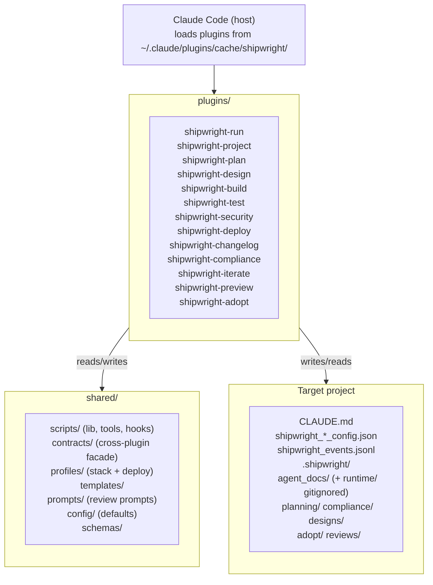

# Architecture — shipwright
<!-- shipwright:architecture v=2 last-sync=932e0d221ea1 -->

## System Overview

## Stack

| Layer | Technology | Notes |
|-------|-----------|-------|
| Frontend | — | — |
| Backend | — | — |
| Database | — | — |
| Auth | — | — |
| Runtime | python | — |

## Layers Detected

- **docs**: `docs`
- **infrastructure**: `scripts`
- **tests**: `Spec`, `integration-tests`

## Key Architecture Decisions

See `decision_log.md` for detailed ADRs. Profile-level decisions (stack, auth pattern, DB strategy, folder structure) are defined by the stack profile (`python-plugin-monorepo`).

## Data Flow

Each SDLC phase is its own Claude Code plugin under plugins/<phase>/, with the standard Claude Code plugin layout: .claude-plugin/plugin.json, hooks/hooks.json, skills/<phase>/SKILL.md, scripts/ (checks, hooks, lib, tools), tests/, and pyproject.toml. Cross-plugin code lives under shared/ (scripts, contracts, profiles, templates, prompts, config, schemas). `shared/contracts/` (ADR-088) is the supported entry point for cross-plugin imports — re-export facades (`shared.contracts.compliance`, `shared.contracts.iterate`) shield consumers from refactors of the underlying plugin internals. Plugins communicate via a unified session id (SHIPWRIGHT_SESSION_ID), shared shipwright_*_config.json files written into the target project, and an append-only shipwright_events.jsonl event log. Hooks defined in hooks.json are the single source of truth for between-phase actions and quality gates; behavior is documented in docs/hooks-and-pipeline.md. Memory and decision history is captured in .shipwright/agent_docs/decision_log.md (canonical H3 ADR format) and per-iterate or per-phase artifacts under .shipwright/planning/ and .shipwright/compliance/. A separate plugin cache at ~/.claude/plugins/cache/shipwright/ is used by Claude Code at runtime; updates require running scripts/update-marketplace.sh after pushing plugin-side changes.

Secrets live exclusively in `<project_root>/.env.local`, scaffolded by `/shipwright-adopt` (Step E.5, ADR-021) and read at runtime by `shared/scripts/lib/env.py::load_shipwright_env`. Every adopted repo carries the framework-level external-review keys (OPENROUTER_API_KEY, GEMINI_API_KEY, OPENAI_API_KEY) plus the active profile's `required_env_vars`. The file is git-ignored before write — a `.gitignore` enforcement failure aborts the scaffold rather than risking a tracked secrets file.

**Triage Inbox** (iterate-2026-05-11-triage-inbox-1a, ADR-046): pre-backlog intake JSONL store under `<project_root>/.shipwright/triage.jsonl`, git-tracked (the SSoT backlog, per-tree like `shipwright_events.jsonl`; see the C1 convention entry below — campaign 2026-06-05-track-triage-jsonl), append-only with history events. Producers (Phase-Quality Stop-hook + Compliance audit_detector) emit findings via `shared/scripts/triage.py::append_triage_item_idempotent` with dedup-keys (`{phase}:{code}` for Phase-Quality with 24h window, `check_id` for Compliance with cross-session window=None). Consumer (`aggregate_triage_on_stop.py`, last Stop-hook in the iterate plugin's chain) regenerates `.shipwright/agent_docs/triage_inbox.md`. Promote bridge: manual CLI `shared/scripts/tools/triage_promote.py` (Iterate 1a) → future WebUI Triage tab (Iterate 3) creating an `ExternalTask` in shipwright-webui's `sdk-sessions.json` with `promotedFromTriageId` back-reference. Triage and Backlog are intentionally separate stores; see `docs/guide.md` § 4.11.

**GitHub findings producer** (iterate-2026-05-19-github-triage-importer): a throttled SessionStart hook `shared/scripts/hooks/import_github_findings.py` — registered once, only in the shipwright-iterate plugin's `hooks.json` — pulls GitHub code-scanning / Dependabot / secret-scanning alerts and the latest failed default-branch CI run per workflow via the `gh` CLI and emits them as `source="github"` triage items. Logic is split across two shared modules: `shared/scripts/github_api.py` (thin `gh api` client; returns `None` on any failure so callers can tell a failed fetch from an empty one) and `shared/scripts/github_triage.py` (alert→item mapping, throttle, orchestrator). New write surface: `<project_root>/.shipwright/github_import_state.json` (throttle timestamp, gitignored by the `.shipwright/*` rule). New read surface: the GitHub REST API via `gh`. Throttle interval resolves run-config `triage.github_import_throttle_hours` → env `SHIPWRIGHT_GITHUB_IMPORT_THROTTLE_HOURS` → 6h default. Dedup keys are stable and namespaced (`github:{code-scanning,dependabot,secret-scanning}:<number>`, `github-ci:<workflow>:<sha>`); auto-resolve is key-shape-scoped (ADR-052) and fires only for sources whose fetch succeeded — a failed fetch never mass-resolves. The hook is fail-soft (always exit 0). Un-defers the CI producer deferred under ADR-047 — pull-based, not the webhook receiver originally ruled out of scope.

**GitHub security-artifact ingestion path** (iterate-2026-05-21-security-artifact-producer): the same SessionStart hook gains a parallel third source for the `gh-security:{owner}/{repo}` action-unit. When `cs_alerts is None` (GHAS Code Scanning unavailable — typical on private repos without GHAS), `github_api.latest_security_workflow_run()` finds the most recent successful run of `.github/workflows/security.yml` on the default branch (gated by a `SHIPWRIGHT_GITHUB_ARTIFACT_MAX_AGE_DAYS` freshness window, default 14d), then `github_api.download_security_findings(run_id)` pulls the `security-scan-results` artifact via `gh run download`, parses `findings.json`, and returns the validated `findings` list. The orchestrator routes the result to a sibling mapper `github_triage.security_action_unit_from_artifact` that produces an action-unit with the same `gh-security:{owner}/{repo}` dedup key and `launchPayload` contract. The artifact path is skipped when `cs_alerts` succeeds (no double-counting against GHAS-uploaded SARIF). `by_source["gh-security:artifact"]` distinguishes the ingestion path for telemetry. Severity counts are derived from iterating `findings[]` rather than trusting the redundant `by_severity` aggregate; raw scanner-controlled strings (`rule` / `description` / `affected_file`) are never rendered into the persisted `detail` or `launchPayload`. See `docs/security-ci-setup.md` for the Path A vs Path B operator choice and `docs/guide.md` § 4.11.1 for the user-facing action-unit description.

**Bloat Loop-Gate** (iterate-2026-05-25-bloat-foundation, Campaign A.foundation = A1 + A2 + A3): two-hook structural prevention against file-size regrowth. The shared classification + schema library `shared/scripts/lib/bloat_baseline.py` is the single producer for the bloat-allowlist format and the `runtime-prompt` (SKILL.md / CLAUDE.md / `plugins/*/agents/*.md` / `shared/prompts/*.md` → 400 LOC) vs source/test (300 LOC) classification — consumed by every other piece. **PostToolUse hook** `shared/scripts/hooks/check_file_size.py` (extended this iterate) writes a per-session marker `<project_root>/.shipwright/locks/bloat_pending.<SHIPWRIGHT_SESSION_ID>.json` (atomic tmp+rename, read-modify-write upsert by path, TTL 1h enforced by the reader) carrying every crossing or anti-ratchet event. **Stop hook** `shared/scripts/hooks/bloat_gate_on_stop.py` (new) reads only the current session's marker (no cross-session aggregation — protects parallel worktrees from each other), re-measures every entry at decision time (so a fixed file isn't punished), and emits top-level `{"decision":"block","reason":"..."}` per Stop-schema ADR-042 for anti-ratchet entries or new crossings outside `shipwright_bloat_baseline.json`. Block-reason body adapts the Iron-Law / Red-Flags / Rationalization-Prevention text from `obra/superpowers` `verification-before-completion` (MIT, © Jesse Vincent). New convention: both hooks are registered in every `plugins/*/hooks/hooks.json` (12 plugins) and the registry is drift-protected by a reverse-direction meta-test in `shared/tests/test_hook_registry_bloat.py`. New write surfaces: the per-session marker JSON and the project-root baseline JSON. Adopt sequence: `plugins/shipwright-adopt/scripts/lib/baseline_generator.py` wraps `bloat_baseline.scan` and runs as Step A.0 (before any other artifact write) so the gate has something to compare against on the first Stop event. Fail-open: missing or malformed baseline / marker → pass silently with a stderr diagnostic.

**Worktree isolation** (iterate-2026-05-15-iterate-worktree-isolation): every `/shipwright-iterate` run executes in its own git worktree under `<project_root>/.worktrees/<slug>/` on branch `iterate/<slug>`, cut from freshly-fetched `origin/<default>`. `setup_iterate_worktree.py` (skill step B1a) creates it and writes two gitignored main-repo surfaces: a per-run main-tree snapshot at `.shipwright/runs/<run-id>/main_tree_snapshot.json` and a per-session run pointer at `.shipwright/iterate_active/<session-id>.json`. The F0/F11 leak-guard `check_iterate_isolation.py` diffs the main tree against that snapshot and fails closed on any leak. `shipwright_events.jsonl` is a **per-tree, PR-committed artifact** (iterate-2026-05-29-events-jsonl-worktree-commit, superseding the 2026-05-16 main-redirect): the iterate's `work_completed` event is recorded into the worktree's OWN log at F5b and committed by F6, so it ships in the PR and the main tree is never written; the leak-guard's `shipwright_events.jsonl`(`.lock`) exemption is retained only as defense-in-depth for the legacy out-of-band F7/F7b path. Iterate ADRs are written run-id-keyed to `.shipwright/agent_docs/decision-drops/` (`write_decision_drop.py`) and folded into `decision_log.md` with sequential `ADR-NNN` at release time by `aggregate_decisions.py`. The former canonical/secondary session-role machinery is removed — isolation is structural, not detected.

## See also

_Existing user-facing documentation discovered by /shipwright-adopt._

- [`README.md`](../../README.md)
- [`docs/guide.md`](../../docs/guide.md)

## Architecture Updates

- **iterate-2026-06-07-adopt-gitleaks-allowlist** (2026-06-07): Convention — /shipwright-adopt now scaffolds a companion `.gitleaks.toml` allowlist alongside `security.yml` (Step E.13b), via a new `gitleaks_config_scaffolder` mirroring the scaffolder-per-artifact pattern of `security_workflow_scaffolder`. The deployed-file path + template are declared as new SSoT constants `GITLEAKS_CONFIG_PATH` / `GITLEAKS_CONFIG_TEMPLATE_PATH` in the `shared/scripts/lib/security_workflow.py` convention lock (extending the existing `TEMPLATE_PATH` / `WORKFLOW_PATH` registry), pinned by a new drift test `shared/tests/test_gitleaks_config_convention.py`. Closes the gap where every adopted repo's first Security Scan false-reds on the `cafebabe:deadbeef` gitleaks `sidekiq-secret` placeholder (`security.yml` runs `gitleaks detect --no-git` with no `--config`, auto-loading a root `.gitleaks.toml`). Also folds the monorepo's own supply-chain hardening (SHA256-verified gitleaks install + peter-evans commit-SHA pin) into `security.yml.template`. (PR #163)
- **iterate-2026-06-06-arch-drift-detector** (2026-06-06): Convention — the architecture-drift contract is now enforced by **content reconciliation** instead of prose/marker heuristics. Both the compliance Group F **F5** detective and a new **canon F11 finalize gate** `check_architecture_documented` require every decision-drop with `architecture_impact ∈ {component, data-flow, convention}` to have its `run_id` documented under `## Architecture Updates`, sharing one oracle via `shared/scripts/lib/architecture_doc.py` (word-boundary run_id match; gitignored drops resolved to the main repo via `resolve_main_repo_root`; case-insensitive impact; unknown/corrupt impact fails). Replaces F5's prior `git log <marker>..HEAD` oracle — which could never fire because decision-drops are gitignored (never committed → empty diff → permanent green) — and the dead, mtime-only `check_architecture_reviewed` (removed with the dead `run_cross_artifact_checks` wrapper). F5 `skip`s in a clean CI checkout (drops absent); the blocking F11 gate is the authoritative prevention layer. (PR pending)
- **iterate-2026-06-05-scanner-degraded-marker** (2026-06-05): Data-flow — a degraded scanner leg (fatal/empty/truncated `_run_tool` None-branch) now propagates via an OSSBackend `scan_errors` control-plane side-channel → `findings.json.degraded` → `scan.py` exit 2 → the monorepo `security.yml` critical-gate fails closed, instead of returning `[]` that was indistinguishable from a clean scan and passed green. The findings list stays pure (no synthetic critical finding; control-plane signal kept off the data-plane). (PR #157)
- **iterate-2026-06-05-fr-linkage-lifecycle** (2026-06-05): Convention — the FR-gate is enforced on the finalize write-path: `finalize_iterate._record_event` now calls the same `record_event._fr_or_change_type_gate_error` before `append_event` (after the idempotency early-return), fail-closed via `FinalizeGateError`; and Group-D **D3** counts a same-event `new_frs`+`affected_frs` as delivered (`ts >= promised_ts`, was strictly `>`). (commit 2b0fb66c, campaign C3)
- **iterate-2026-06-05-bloat-marker-worktree-aware** (2026-06-05): Convention — `bloat_baseline.strip_worktree_prefix()` lets `check_file_size` and the Stop-hook bloat gate strip the `.worktrees/<slug>/` prefix for the baseline membership/ceiling lookup, so a worktree iterate that bumped a baseline is no longer falsely blocked; the stored marker path keeps the prefix so the Stop gate can still re-measure the actual worktree file. (PR #150)
- **iterate-2026-06-05-b7-exclude-nonfunctional** (2026-06-05): Convention — `git_log_scan` Rule E excludes commits whose Conventional-Commit type is non-functional (`build`/`chore`/`ci`/`docs`/`style`/`test`) from the B7 "every commit has a matching event" detective; functional types (`feat`/`fix`/`perf`/`refactor`) are never excluded. Configurable via `b7_exclusions.exclude_nonfunctional_types` (default true) + `nonfunctional_types`. Supersedes the narrower Rule D. (PR #151)
- **iterate-2026-06-05-a5-gate-behavioral-probe** (2026-06-05): Component — compliance check **A5.8** extracts the deployed security gate's `run:` body and EXECUTES it against fixture scan output, asserting the ratified policy (critical→block, empty/invalid→fail-closed, clean→pass). Flavor-agnostic: each scenario stages BOTH `sarif/*.sarif` AND `findings.json`, so the probe is correct whether the gate reads SARIF (adopted repos) or `findings.json` (this monorepo). (PR #152)
- **Campaign `2026-06-05-track-triage-jsonl`** — git-track `.shipwright/triage.jsonl` (the triage backlog SSoT), mirroring `shipwright_events.jsonl` (anchor `trg-2fb7d3bc`):
  - **iterate-2026-06-05-sbom-cluster-stable-identity** (2026-06-05): Convention — the SBOM undeclared-license **cluster** triage dedup-key is now `(signature, manifest_type)`-only (`_cluster_dedup_key` in `plugins/shipwright-compliance/scripts/lib/sbom_generator.py`), dropping the member list. Cluster identity is stable under workspace-membership drift → no fresh-id-per-run churn, the dismissed pile stops growing. Supersedes the membership-encoding decision (external-review OpenAI #2/#3) of the cluster-collapse iterate; faithful body re-render under drift deferred to `trg-9403a648`. Prereq A for the tracking flip. (PR #153)
  - **iterate-2026-06-05-triage-dismissed-gc** (2026-06-05): Component — new maintenance tool `shared/scripts/tools/triage_gc.py` compacts the dismissed triage pile before it enters tracked history, dropping ONLY pure machine-churn auto-resolves (producer `statusBy` AND exact machine `statusReason`) and preserving all human-curated dismissals + promoted + open. Dry-run default; `--apply` backs up + revalidates (header intact, no orphan `status` event). Prereq B. (PR #154)
  - **iterate-2026-06-05-triage-track-c1-gitignore** (2026-06-05): Convention — `.shipwright/triage.jsonl` is now git-tracked. The canonical `!/.shipwright/triage.jsonl` negation is added to `shared/templates/shipwright-gitignore.template` + the framework `.gitignore` (kept ordered-list congruent by `test_gitignore_template_congruent.py`); `scaffold_triage_inbox.py` stops managing the bare ignore line (keeps `.lock`) and self-heals a stale bare/`/`-variant line so already-adopted repos track it on re-scaffold. `.lock` + the GC `.bak` stay ignored by the `/.shipwright/*` wildcard. Scope note (Codex-reviewed): the systemic per-tree producer reroute was de-scoped as over-engineering — `events.jsonl` itself exempts background main-writes from the leak-guard rather than rerouting, so C2 mirrors that (`_MAIN_TREE_WRITE_EXEMPT`) + the churn-resolver; E commits the migrated backlog. (sub-iterate C1)
- **iterate-2026-06-03-campaign-status-field** (2026-06-03): Data-flow — producer-owned campaign lifecycle status. An iterate campaign's `status.json` (and the `campaign.md` frontmatter) gains a top-level `status` field with the lifecycle `draft` → `active` → `complete`: `draft` = planned (triage-only, hidden), `active` = started (shown on the board), `complete` = done (hidden). `campaign_init.py` writes `draft` at init; `campaign_progress.py start` flips it to `active`; `update-status` auto-sets `complete` once every sub-iterate is complete (and leaves a halted campaign `active`, so it stays visible); `summary` prints it. The autonomous campaign loop (`references/campaign-mode.md`) calls `start` right after loop init. The field is **optional**: a campaign whose `status.json` predates it is "legacy" and every consumer falls back to the prior derived `done < total` behavior, so the producer change ships independently of the consumer. Canonical lowercase `draft|active|complete` declared once in `campaign_progress.LIFECYCLE_STATUSES`; the consumer side is shipwright-webui PR #96 (`campaign-status-json.ts::pickLifecycle` — status.json wins over frontmatter, `selectActiveCampaigns` shows iff `active`). New write surface: the `status` key of `<campaign-dir>/status.json`. Triage anchor `trg-f06f04e3`.
- **iterate-2026-06-02-sessionstart-dedup-guard** (2026-06-02): Convention — once-per-event hook dedup. New shared primitive `shared/scripts/lib/event_once.py::claim_once` (atomic `O_CREAT|O_EXCL` first-wins claim, TTL-armed, fail-open) lets exactly one of the N per-plugin invocations of a SessionStart hook perform an expensive once-per-event action; the rest skip. Applied to the Phase-Quality Tier-1 FAIL injection in `capture_session_id.py`, which was emitting the identical block ~12× per SessionStart (one per registered plugin, since Claude Code fires every hook with no active-plugin filter). Fail-open invariant: any guard error emits, so a real FAIL is never dropped. Interim fix; the broader Start/Stop/Prompt/PostTool fan-out is collapsed to phase-aware dispatchers by campaign `2026-06-02-hook-consolidation`. Documented in `docs/hooks-and-pipeline.md` (SessionStart-Injection flow).
- **ADR-021** (2026-05-03): Adopt scaffolds .env.local with profile + framework keys (Layer-3 SSoT)
- **iterate-2026-05-30-gitignore-canon-propagation** (2026-05-30): Convention — the canonical `.shipwright/` artifact-ignore block now has a single source of truth, `shared/templates/shipwright-gitignore.template` (marker-delimited), propagated to every consuming project. New shared module `shared/scripts/lib/gitignore_canon.py` parses the template's marked rules and idempotently line-merges the missing ones into a target `.gitignore` (adds-only, managed BEGIN/END block, never duplicates; self-heals on re-run). `/shipwright-adopt` invokes it as Step E.6 (standalone CLI — kept out of the grandfathered `generate_adoption_artifacts.py` to respect the bloat baseline); `/shipwright-project` calls it in-code from `write-project-config.py` on the `--status complete` path. Drift between the template and the framework's own `.gitignore` block is structurally enforced by `shared/tests/test_gitignore_template_congruent.py`, so a future ADR adding a gitignored `.shipwright/` dir must edit the template and it auto-propagates everywhere. Closes the gap that left shipwright-webui with untracked `runtime/` clutter (manual symptom-fix f6e34a6).
- **ADR-024** (2026-05-03): Boundary Tests Foundation — `touches_io_boundary` risk flag + Boundary Probe sub-step in iterate Build TDD (Sub-Iterate A of campaign iterate-skill-hardening). New helper `is_io_boundary_change(changed_files)` in `plugins/shipwright-iterate/scripts/lib/classify_complexity.py`; new reference docs `references/boundary-probes.md` (8 edge-case categories) and `references/round-trip-tests.md` (producer→file→consumer test pattern). 7th Self-Review item ("Affected Boundaries") added.
- **ADR-030** (2026-05-05): suggest_iterate UserPromptSubmit hook is plugin-owned, not project-installed. Convention shift: `${CLAUDE_PLUGIN_ROOT}` is reserved for plugin-context hooks (the variable does not expand in project-level `.claude/settings.json`); any hook command that references it MUST be registered in a plugin's own `hooks/hooks.json`. Retired `plugins/shipwright-adopt/scripts/lib/hook_installer.py` + `check_a6_hook_installed` verifier + `validate_adoption._validate_hook` + the per-project-install snippets in `shipwright-{run,project}` SKILL.md and the auto-install stanzas in seven phase-plugin SKILL.md files. New canonical registration lives in `plugins/shipwright-iterate/hooks/hooks.json` under `UserPromptSubmit`. ADRs 019 and 020 (Shape B carrier + quoted path + `--no-project`) survive verbatim inside the plugin registration.

- **ADR-032** (2026-05-05): Adopt writes shipwright_iterate_config.json with documented opt-out schema

- **ADR-034** (2026-05-06): load_review_config deep-merges per-project override; cascade helper added

- **ADR-043** (2026-05-11): Adopt scaffolds profile-aware CI + Claude-Review workflows with cross-platform OS matrix as default. New convention: every CI template that adopt writes carries `strategy.matrix.os: [ubuntu-latest, windows-latest]` + `fail-fast: false`. New write surfaces in adopted target repos: `.github/workflows/ci.yml` (profile-mapped via `shared/scripts/lib/ci_workflow.py::TEMPLATE_BY_PROFILE`) + `.github/workflows/claude-review.yml`. Three profile-specific templates ship: `ci-supabase-nextjs.yml.template`, `ci-vite-hono.yml.template`, `ci-python-plugin-monorepo.yml.template`. Steps E.14 + E.15 in `generate_adoption_artifacts.py`, analogous to E.13 (security scaffold). Shared `workflow_scaffold_helper.copy_template_if_absent()` extracted (security scaffolder NOT migrated to it in this iterate, separate diff). New opt-in Tier-2 template `shared/templates/path-helpers.ts.template` codifies the `pickPathModule(input)` heuristic — origin: shipwright-webui v0.8.5 cross-platform path regression that motivated this iterate.

- **iterate-2026-05-16-fix-events-worktree-aware** (2026-05-16): Worktree-aware event-log resolution. New shared SSoT helper `shared/scripts/lib/events_log.py::resolve_events_path` resolves `shipwright_events.jsonl` via `git rev-parse --git-common-dir` — under `/shipwright-iterate` worktree isolation the log is read/written at the MAIN repo, not the ephemeral worktree copy that `git worktree remove` discards. New convention: every worktree-reachable event-log accessor (`record_event.py` F7, `verifiers/iterate_checks.py` F11, `config.read_events` F5b dashboard) MUST resolve via the helper; the drift meta-test `shared/tests/test_events_log_ssot.py` enforces it (forward + reverse) with a documented `_MAIN_REPO_ONLY` allowlist. The F0/F11 leak-guard exempts `shipwright_events.jsonl`(`.lock`) as a designed main-tree write. F5b also embeds the iterate `run_id` in the `build_dashboard.md` header so the F11 verifier has a deterministic, timing-independent marker.

- **iterate-2026-05-19-github-triage-importer** (2026-05-19): GitHub findings triage producer. New throttled SessionStart hook `shared/scripts/hooks/import_github_findings.py` (registered once, in the shipwright-iterate plugin) + two shared modules `shared/scripts/github_api.py` (gh-CLI client) and `shared/scripts/github_triage.py` (mapping/throttle/orchestrator). New write surface `<project_root>/.shipwright/github_import_state.json` (throttle timestamp); new read surface the GitHub REST API via `gh`. Imports code-scanning / Dependabot / secret-scanning alerts + failed default-branch CI runs as `source="github"` triage items with key-shape-scoped auto-resolve. Un-defers the ADR-047 CI producer (pull-based `gh api`, not a webhook receiver).

- **iterate-2026-05-20-escape-md-cells** (2026-05-20): Markdown table cell escaping. New cross-cutting helper `shared/scripts/markdown_table.py::escape_cell` lives at the top-level of `shared/scripts/` (NOT under `lib/`, per ADR-045) so it can be imported from both `shared/scripts/tools/` and `plugins/shipwright-compliance/scripts/lib/` without the regular-vs-namespace-package collision. New convention: every event-derived cell in a markdown table rendered by the framework (build dashboard's Recent-Changes / Build-History rows, compliance lib's RTM verification timeline, test-evidence test progression, change-history commits, compliance dashboard's external-review-evidence row) MUST be wrapped in `escape_cell()`. The helper applies the minimal `\\` / `|` / newline substitutions needed to keep `| {...} | ... |` row layout intact when a field contains a literal pipe or newline. Drift-protection lives in `shared/tests/test_markdown_table.py` (8 boundary categories) + `shared/tests/test_build_dashboard_md_escaping.py` (real-renderer round-trip via `re.split(r"(?<!\\)\|", row)`). Origin: empirically broken Recent-Changes row in shipwright-webui repo when an event description contained `(local|tailscale|open)`.

- **iterate-2026-05-23-security-adopt-compliance-snapshots** (2026-05-23): Extends the snapshot-producer set (follow-up to compliance-md-single-producer). Three additional paths now contribute `Run-ID:` snapshot commits the audit recognises: (1) `shipwright-adopt` Step H — single brownfield-onboarding commit body now carries `Run-ID: adopt-<YYYY-MM-DD>-<repo>` trailer; message built by the SSoT helper `plugins/shipwright-adopt/scripts/lib/adopt_commit_template.py` (regex-enforced `^adopt-\d{4}-\d{2}-\d{2}-[a-z0-9][a-z0-9-]*$`; date-deterministic via `_utc_today` test seam). (2) `shipwright-security` Step 7.5 (pipeline mode only) — new helper `plugins/shipwright-security/scripts/tools/finalize_security_compliance.py` regenerates compliance MDs via `update_compliance.py --phase security`, stages + commits as `chore(compliance): refresh after security scan` with `Run-ID: security-<scan_id>` trailer. Idempotent (no commit when no diff). Skipped in standalone mode (Step 8 hands off to iterate), CI (`CI` env truthy), and non-interactive (`SHIPWRIGHT_NON_INTERACTIVE` truthy). (3) `update_compliance.py` `PHASE_REPORTS` gains `adopt` (full 5-doc set — initial baseline) and `security` (4-doc set excluding RTM — security doesn't change FR coverage). `find_snapshot_commit`'s `Run-ID:` filter is preserved per Codex sanity-check — producer-provenance protection stays. Pipeline phase commits (project/design/plan/build/test/changelog/deploy) still lack `Run-ID:` trailers and aren't yet snapshot-recognised; deferred to a separate iterate. Greenfield-pipeline users hit `snapshot_unavailable=true` until first iterate — acceptable degraded-but-correct state. New convention: when extending snapshot producers, add the explicit `Run-ID: <producer>-<id>` trailer in the producing plugin's commit message AND a matching `PHASE_REPORTS[<producer>]` entry. Test seam for cross-plugin imports: use `importlib.util` + sentinel module name (mirrors `audit_adapters.load_shared_lib`) to avoid `tools` / `lib` namespace-package collisions across plugins in mixed test runs.

- **iterate-2026-05-23-compliance-md-single-producer** (2026-05-23): Single-producer + snapshot-provenance audit for compliance MDs. Tracked `.shipwright/compliance/{rtm,test-evidence,change-history,sbom,dashboard}.md` are produced EXCLUSIVELY by iterate-finalize (via `finalize_iterate.py` F5b) and per-phase `update_compliance.py` calls. The Stop-hook auto-regen block in `generate_handoff_on_stop.py` (lines 283-310) is DELETED: it fired on out-of-band commits using the local-only `shipwright_events.jsonl` and produced dirty MDs that didn't match HEAD's events log (cross-machine divergence). `audit_staleness.py` rewrites Group E from "fresh re-render byte-compare" to **snapshot-provenance** — finds the latest commit that BOTH has a `Run-ID:` trailer AND modified `.shipwright/compliance/`, then `git show <sha>:<file>` vs on-disk. Non-iterate commits don't touch `.shipwright/compliance/` → snapshot baseline stays stable → zero E1-E5 false positives between iterates. New write surface: events.jsonl in-place line replacement via `record_event.attach_commit_to_event(event_id, sha)`. New finalize ordering (iterate-finalize is now the sole producer): F5b records `work_completed` with `commit=""` placeholder + full F11 metadata via `--event-extras-json`, regenerates compliance + dashboard + handoff; F6 commits; F6.5 patches the gitignored events.jsonl line in place. `finalize_iterate._record_event` is idempotent per `run_id` (matched on `adr_id`). The legacy F7 `record_event.py --deduplicate-by-commit` path remains for out-of-band cases. New convention: any test referencing `audit_staleness.default_renderers` must migrate — the function is removed; tests should use the synthetic-git-repo snapshot fixture pattern (see `plugins/shipwright-compliance/tests/test_audit_snapshot.py`). Codex consult shaped this design — earlier options (auto-regen on Stop, per-phase plugin regen, release-only regen) all leaked false positives or required ~9 plugin edits.

- **iterate-2026-05-20-triage-launch-surface** (2026-05-20): Triage Inbox as launch-surface (not finding-mirror). Supersedes #39's per-finding GitHub mapping with **action-units** — one operator-actionable item per repo (security / secrets) or per failing workflow (CI). New convention: every triage item carries an optional `launchPayload` field (camelCase wire, frozen at first append) — a ready-to-paste block with the slash command + GitHub URL. New action-unit dedup-key prefixes `gh-security:{owner}/{repo}`, `gh-secrets:{owner}/{repo}`, `gh-ci:{workflow_id}` (sha dropped). One-shot per-source-gated legacy-item migration (`reason="schemaMigration"`) sweeps pre-iterate items as their feed succeeds — preserves the ADR-052 fail-soft invariant. **New CLI surface** `shared/scripts/tools/triage_cli.py` (positional `<id>`, subcommands `list` / `promote` / `dismiss`) — first-class operation interface parallel to the future WebUI Triage tab; both surfaces delegate to the same `triage_promote.promote` / `triage_promote.dismiss` library helpers so audit-trail events are byte-identical. New helper `github_api.owner_repo()` — local-first (parses `git remote get-url origin`, NEVER calls `gh api`), returns `None` on missing/non-GitHub remotes so the producer skips emission rather than emitting malformed keys. Aggregator renders `launchPayload` in a fenced markdown code block under each open item; control characters stripped in both CLI and markdown render paths. Secret-scanning action-unit payload is whitelist-only — no alert content, no per-alert URLs, no secret values.

- **iterate-2026-05-21-b1-compliance-dashboard-mode-aware** (2026-05-21): Mode-aware compliance dashboard. Detect adopted runs via `run_config.adoption` (corrects the plan's scope-based check). Adopted projects render pipeline phases as `n/a (adopted) INFO`; hide build-section and sections-reviewed rows for adopted. Add Why-warn 4th column to the compliance dashboard. Triage-open indicator surfaces open triage cards inline. See decision-drop `iterate-2026-05-21-b1-compliance-dashboard-mode-aware_001.json`.

- **iterate-2026-05-21-b2-sbom-polish** (2026-05-21): SBOM undeclared-license triage producer (per workspace). `emit_undeclared_triage()` in `sbom_generator.py` emits one `source='sbom'`, `kind='compliance'`, `severity='low'` item per manifest with undeclared packages; dedup-key `sbom:undeclared:<manifest-rel-path>`. See decision-drop `iterate-2026-05-21-b2-sbom-polish_001.json`.

- **iterate-2026-05-21-b3-test-evidence-layer-and-triage** (2026-05-21): Per-layer FAIL triage + Layer column + `record_event` layers schema. `emit_test_failure_triage()` emits one `source='test-evidence'` item per failing layer from the latest `test_run` event; dedup `test-fail:<layer>`; severity high for e2e/integration/pgtap, low for unit. New convention: `test_run` events carry first-class `integration` and `pgtap` keys alongside `unit` / `e2e` with optional `failed` counts. See decision-drop `iterate-2026-05-21-b3-test-evidence-layer-and-triage_001.json`.

- **iterate-2026-05-21-b4-rtm-deep-link-and-coverage** (2026-05-21): RTM consumes `frId` cross-link + actionable Coverage subsections. Requirements-coverage Status cell renders `FAIL → [trg-XXX](...#trg-XXX)` per open triage item with matching `frId` (overrides COVERED). Coverage Summary section gains three actionable subsections. See decision-drop `iterate-2026-05-21-b4-rtm-deep-link-and-coverage_001.json`.

- **iterate-2026-05-21-c1-fr-gate-finalize** (2026-05-21): Hard-enforce FR-or-change-type at iterate finalize (forward-only). New gate `_fr_or_change_type_gate_error` in `record_event.py` fires for every `work_completed`+`source=iterate` event. Pass conditions: `affected_frs`/`new_frs` non-empty OR `change_type ∈ {docs, tooling, compliance, infra}`. Convention: every iterate event must link to an FR or declare why it doesn't. See decision-drop `iterate-2026-05-21-c1-fr-gate-finalize_001.json` (ADR-059).

- **iterate-2026-05-21-c2-architecture-and-adr-drift-detector** (2026-05-21): F4–F7 detective-only documentation hygiene checks. Added F4 (ADR > 60 lines without `spec_ref`), F5 (architecture marker vs arch-impact drops via `git log`), F6 (`CLAUDE.md` > 200 lines), F7 (`CLAUDE.md` Iterate-annotation count > 5) to `group_f.py`. All four are detective-only — Phase-Quality can't see them, only a holistic scan can. See decision-drop `iterate-2026-05-21-c2-architecture-and-adr-drift-detector_001.json`.

- **iterate-2026-05-21-c3-plugin-cache-sync-check** (2026-05-21): Detective-only plugin-cache vs repo drift check. New standalone Python script `scripts/check_plugin_cache_sync.py` walks `plugins/shipwright-*` in the repo and compares each against the lexically-latest version dir under `~/.claude/plugins/cache/shipwright/`. Convention: after every plugin-side edit + `git push`, operators MUST run `bash scripts/update-marketplace.sh`; this script is the drift detector. See decision-drop `iterate-2026-05-21-c3-plugin-cache-sync-check_001.json`.

- **iterate-2026-05-21-triage-producer-contract** (2026-05-21): Triage producer contract — schema + RTM-link fields + inbox polish. New wire SSoT `shared/schemas/triage_item.schema.json`; optional `frId`/`suiteId`/`eventId` append-event keys for RTM deep-link; `aggregate_triage.py` emits HTML anchors per card. New convention: every producer that appends a triage item must validate against the schema. See decision-drop `iterate-2026-05-21-triage-producer-contract_001.json`.

- **iterate-2026-05-22-deterministic-render-timestamps** (2026-05-22): Deterministic render timestamps via events.jsonl max-ts. New helper `shared/scripts/lib/events_log.latest_event_dt()` returns `max(event.ts)` from `shipwright_events.jsonl` as a UTC datetime. Convention: every framework-rendered markdown banner (build dashboard, triage inbox, session handoff, compliance reports) consumes `latest_event_dt()` instead of `datetime.now()`, so two re-runs against the same event log produce byte-identical output (the audit-trail's "wann ist was passiert" lives in the events; the banner just summarises "data as of which event"). See decision-drop `iterate-2026-05-22-deterministic-render-timestamps_001.json`.

- **iterate-2026-05-23-iterate-f7-tracked-event-log-commit** (2026-05-23): F7b — event-log follow-up commit for self-tracking repos. Convention shift: when `shipwright_events.jsonl` is tracked at repo scope (the shipwright dev repo's configuration, via `.gitignore` line 70 `!/shipwright_events.jsonl` negation), the iterate skill's F7 step (`record_event.py` post-F6) leaves a tracked-dirty file that a subsequent `git reset --hard` silently wipes. New step F7b runs `shared/scripts/tools/commit_event_followup.py` after F7. The tool is worktree-aware (mirrors `record_event.py`'s `resolve_events_path`): resolves to the MAIN repo, checks tracked+dirty, and produces a small `chore(events): record {event_id} for {run_id}` commit on the main repo's current branch. Idempotent — gitignored / tracked-clean / untracked / dry-run all noop. Documented in SKILL.md F7+F7b with the 2026-05-22 incident reference (9 events wiped; PR #70 recovered; PR #71 added F7b structurally; PR #73 dogfooded the new mechanism).

- **iterate-2026-05-23-verifier-multi-commit-aware** (2026-05-23): F11 verifier resolves the F7 event by `run_id`, not HEAD commit. Convention shift: `run_id` is the iterate's stable identity; `commit_hash` can drift across multi-commit iterates (F6 + F6.5 fix follow-up) and rebases. New helper `_find_work_event_by_run_id` in `shared/scripts/tools/verifiers/iterate_checks.py` looks up the F7 event by `adr_id == run_id`. `check_events_has_commit(project_root, commit_hash, run_id="")` and `check_spec_impact_recorded` use this as the primary path; the commit_hash substring search is a back-compat fallback. The spec.md path check now uses the F7 event's commit, not HEAD. 70 tests (60 existing unchanged + 10 new multi-commit-aware cases) pin every branch. See decision-drop `iterate-2026-05-23-verifier-multi-commit-aware_001.json` + PRs #74 + #75.

- **iterate-2026-05-23-verifier-drift-remediation** (2026-05-23): Architecture-impact drift protection. New test `shared/tests/test_architecture_md_reflects_arch_impact.py` enforces the convention: every decision-drop with `architecture_impact ∈ {component, data-flow, convention}` must have a matching entry (by `run_id` substring) under `## Architecture Updates` in this file. RED→GREEN cycle backfilled 11 missing entries (this iterate's two own arch-impact drops plus 9 historical drift entries from the b/c bloat-cleanup campaign). The test also catches the next iterate that flags `--architecture-impact` but forgets the markdown update. Convention: F2's "update architecture.md AND flag the drop" is now structurally enforced, not advisory.

- **sub_iterate-20260525-211635-B8** (2026-05-26): New component `shared/contracts/` — cross-plugin contract surface. Two re-export facades published as the supported entry point between plugins: `shared.contracts.compliance` (exposes `collect_all`, `ComplianceData`, supporting dataclasses, `PHASE_REPORTS`, `GENERATORS`, `run_report`) and `shared.contracts.iterate` (exposes `is_io_boundary_change`, `touches_build_files`, `RISK_TAXONOMY`, pattern lists). Each contract bootstraps `sys.path` once at module load (idempotent + reload-test pinned). Adopt's `compliance_bridge.py` and the test plugin's `boundary_coverage_report.py` now consume the contracts directly — eliminates the legacy subprocess-spawn + ancestor-walk + `_ITERATE_LIB` path constant patterns. Future iterates (B2 splits compliance data_collector; B6 splits github_triage) MUST keep the re-exported names importable from the source plugin so the contract's facade remains valid. Tests: 26 new integration tests in two files (consumers + behavior), 1104 total empirical across 4 trees, identity-pinning between contract's `PHASE_REPORTS` and `update_compliance.PHASE_REPORTS` so drift is caught at test time.

- **iterate-2026-05-24-sbom-triage-cluster-collapse** (2026-05-24): Convention change in the SBOM triage producer (`plugins/shipwright-compliance/scripts/lib/sbom_generator.py::emit_undeclared_triage`). When N≥2 workspaces share the same `(sorted_undeclared_dep_names, manifest_type)` signature, the producer emits ONE cluster action-unit (`sbom:undeclared-cluster:<sha256-12>`) instead of N per-workspace items. The cluster dedup key encodes BOTH signature AND member-list so membership changes (grow/shrink) auto-dismiss the old key and emit a new one. Per-workspace shape (`sbom:undeclared:<path>`) preserved for N=1 buckets and as a shadow-key in `current_keys` to shield legacy items from auto-dismiss when a workspace joins a cluster. Generalizes ADR-057's launch-surface principle to the SBOM producer: the inbox surfaces one action-unit per root cause, not N findings for the same decision. Tests: 15 new in `TestEmitUndeclaredTriageClusters` + 1 ValueError-fallback probe. Plugin suite: 514 tests.

- **ADR-055** (2026-05-19): GitHub findings triage producer (un-defers the CI producer)

- **ADR-068** (2026-05-21): Artifact-based GitHub security producer for Triage Inbox

- **ADR-078** (2026-05-26): Split dev_server.py 997 LOC into 10-file package; preserve shim for uv run callers

- **ADR-088** (2026-05-26): shared/contracts/* — cross-plugin contract surface introduced for compliance + iterate

- **iterate-2026-05-25-bloat-defense** (2026-05-25, ADR-083): Defense-in-depth around the Stop-gate from `iterate-2026-05-25-bloat-foundation`. Three new coordinated artifacts: (1) `scripts/hooks/pre-commit` + `scripts/install-hooks.{sh,ps1}` — local pre-commit anti-ratchet block (state-agnostic — any baseline entry with `measured > current` blocks, regardless of `state`); installed once per clone via `git config core.hooksPath scripts/hooks`. (2) `.github/workflows/bloat-check.yml` — PR-time idempotent comment with allowlist diff + selective block (anti-ratchet only — new crossings are reported, not blocked, and handed off to Group H detective audit post-merge). (3) `shared/scripts/hooks/anti_ratchet_check.py` + `shared/scripts/lib/anti_ratchet.py` — shared check consumed by both the hook (`--staged`, default) and the CI workflow (`--worktree`); plus `shared/scripts/hooks/build_bloat_diff.py` for the PR-comment markdown body. New canonical ADR template `.shipwright/planning/adr/_template-bloat-exception.md` with five mandatory fields (Ousterhout / YAGNI / Chesterton-Fence / Re-Review-Date / Incident-Reference). New cross-cutting vocabulary registry `shared/glossary.md` (Allowlist / Ratchet / Anti-Ratchet / Producer / Action-Unit / Canon-Gate + 25 more terms) with MIT-attribution footer (Karpathy multica-ai / Osmani addyosmani / Superpowers obra). Constitution §21 extended with the anti-ratchet CI rule + exception-ADR path. New convention: every clone runs `bash scripts/install-hooks.sh` (or `.ps1`) once before its first contribution.

- **iterate-2026-05-25-bloat-review** (2026-05-25, ADR-085): Reviewer-prompt + detective-audit closure of Campaign A. Verbatim-cited Bloat Checklist section appended to both reviewer subagent prompts (`shared/prompts/code-reviewer.md`, `plugins/shipwright-iterate/agents/sub-iterate-runner.md`): Karpathy 4 principles + Osmani Five-Axis Review header / Change-Sizing 100/300/1000 / "Separate refactoring from feature work" / Dead-Code-Artifact check + Shipwright Allowlist / Anti-Ratchet / no-bypass rules. Byte-parity drift protection lives in `shared/tests/test_reviewer_bloat_checklist_parity.py`. New compliance audit Group H (Bloat-policy detective) at `plugins/shipwright-compliance/scripts/audit/group_h.py` with 7 checks: H0 meta, H1 Drift (oversize file not in baseline = hook bypass, HIGH), H2 Ratchet-Suggestion, H3 Anti-Ratchet (`state=anti-ratchet` visible = committed bypass, HIGH), H4 Exception-no-ADR, H5 Deferred-no-Plan, H6 Stale-Entry. H1/H2 reuse the producer-side `bloat_baseline.scan` + `_file_newlines` so audit semantics can't drift from the writer's. Letter `G` was already taken — `audit_detector` letter-set widened to `A-H`.

- **iterate-2026-05-30-reviewer-stack** (2026-05-30, P3.1 = SP1 + OS3): Two NEW reviewer subagents added to `/shipwright-build` Step 6, forming a three-stage cascade `spec-reviewer` (Stage 1, HARD-GATE spec-compliance) → `code-reviewer` (Stage 2, 5-axis quality) → `doubt-reviewer` (Stage 3, conditional, advisory). `plugins/shipwright-build/agents/spec-reviewer.md` (NEW, Superpowers two-stage pattern, MIT © Jesse Vincent) blocks Stage 2 until a spec PASS and cites the exact spec line on REJECT; it runs whenever the 6b full review runs (shared trigger, so Stage 1 always precedes Stage 2). `plugins/shipwright-build/agents/doubt-reviewer.md` (NEW, Osmani doubt-driven, MIT © Addy Osmani) is a fresh-context, disprove-biased pass that fires only for non-trivial touches (migrations, async/concurrency, cross-plugin imports, irreversible ops) and is advisory-must-address (a reasoned rebuttal may proceed; only Stage 1 hard-blocks). Orchestration detail lives in `plugins/shipwright-build/skills/build/references/code-review.md`; the Kern Step 6 carries only a pointer (≤300 LOC). Autonomous path: `plugins/shipwright-iterate/agents/sub-iterate-runner.md` Step 3.7 reworded net-zero (anti-ratchet — frozen at 479 LOC) to delegate the full cascade to the orchestrator/SKILL, with substantive detail in `plugins/shipwright-iterate/skills/iterate/references/iteration-reviews.md`. Decision: the new reviewers stay **internal** (the 6c external cascade remains a generic code-quality second opinion, not extended to spec/doubt). Drift protection: `plugins/shipwright-build/tests/test_reviewer_orchestration.py`. New convention: spec-compliance is a distinct HARD-GATE stage that precedes quality review.

- **Campaign B1 — SKILL.md modular references** (2026-05-25/26, ADR-074 / linked B1.iterate..B1.plan sub-iterates): seven SKILL.md files were oversize on the runtime-prompt 400-LOC budget and got split into a ≤300-LOC Kern + per-topic / per-phase `references/*.md` sidecars. Sub-iterate breakdown (final LOC counts, references):
  - `plugins/shipwright-iterate/skills/iterate/SKILL.md` — 1709 → 295 LOC + 26 references (16 per-phase F0..F12 + 10 topical: context-loading, path-{a,b,c}, campaign-mode, mid-flight-escalation, escape-hatch, artifact-ownership, degraded-mode, error-handling).
  - `plugins/shipwright-build/skills/build/SKILL.md` — 1162 → 291 LOC + 8 references.
  - `plugins/shipwright-test/skills/test/SKILL.md` — 986 → 253 LOC + 20 references.
  - `plugins/shipwright-adopt/skills/adopt/SKILL.md` — 848 → 264 LOC + 14 references.
  - `plugins/shipwright-design/skills/design/SKILL.md` — 695 → 297 LOC + 12 references.
  - `plugins/shipwright-project/skills/project/SKILL.md` — 612 → 229 LOC + 9 references.
  - `plugins/shipwright-plan/skills/plan/SKILL.md` — 581 → 300 LOC + 5 references.
  New convention: SKILL.md Kern stays ≤300 LOC (runtime-prompt allowlist permits ≤400) and offloads phase-specific or topic-specific deep dives into `skills/<phase>/references/<topic>.md`. Test-locked anchors (Canonical Risk Taxonomy, Override Classes, Phase Matrix by Complexity, named Step / Path / Self-Review entries) STAY inline in Kern — drift tests assert their presence at fixed headings.

- **Campaign B2 — collectors/ package** (2026-05-26): `plugins/shipwright-compliance/scripts/lib/data_collector.py` (1559 LOC monolith) split into per-domain `collectors/` modules — `dashboard.py`, `rtm.py`, `test_evidence.py`, `change_history.py`, `sbom.py` + private `_types.py` (12 dataclasses including `ComplianceData`), `_common.py` (CONFIG_FILES + `collect_configs`), `_npm_license.py` (lockfile-first npm resolver), `_python_license.py` (per-manifest `.venv/.../site-packages/<pkg>-*.dist-info/METADATA` resolver — pinned by ADR-081). The original path becomes a 41-LOC re-export shim that preserves the pre-split public + private import surface so `shared.contracts.compliance` and every `tests/test_data_collector*.py` keep working unchanged. All 5 compliance MDs regenerate byte-identical against the pre-split baseline.

- **Campaign B3 — phase_quality/ package + bloat dashboard column** (2026-05-26): `shared/scripts/lib/phase_quality.py` (1108 LOC) split into 9 thematic submodules: `_constants.py` (phase maps, category sets, paths), `_flags.py` (`SHIPWRIGHT_*` env-flag readers), `_resolution.py` (project/phase/run_id resolution), `_findings.py` (finding schema + atomic writer), `_runners.py` (canon/workflow/infra/trace/quality/spec dispatch), `_aggregates.py` (loaders + locked aggregate driver), `_dashboard_render.py` (skill-compliance MD renderers), `_bloat_findings.py` (Group H glue), `__init__.py` (re-exports the pre-split surface). Thematic-not-per-phase rationale: per-phase behaviour lives in `tools/verifiers/*_compliance.py`; `phase_quality.py` held the dispatch + finding-schema + aggregate-render plumbing only. Sibling diff added a bloat-findings column to the Compliance Dashboard via `plugins/shipwright-compliance/scripts/lib/_bloat_dashboard_rows.py` and three new rows in `compliance_report.py` so Group H findings become operator-visible.

- **Campaign B5 — orchestrator_pkg/** (2026-05-26): `plugins/shipwright-run/scripts/lib/orchestrator.py` (983 LOC) split into `orchestrator_pkg/` with 12 submodules — `constants` (schema, paths, allowlists), `events` (`record_event` wrappers), `config_io` (load/save/migrate), `legacy_migration` (drop compliance/security from old configs), `config_factory` (`build_pipeline` + `create_config`), `compliance_runner` (`run_compliance_update` subprocess wrapper), `critical_gates` (Phase-Quality W5/W6/W7), `step_planning` (`get_next_step` + `update_step`), `build_progress` (`get_build_progress`), `router` (F2 lifecycle subcommand dispatcher), `cli` (argparse + `main`), `__init__.py` (public re-exports). The original path becomes a 41-LOC re-export shim that BIND the patched-via-`orchestrator.*` names so `mocker.patch("orchestrator.run_compliance_update")` etc. keep targeting the same module object; the CLI surface (`python orchestrator.py write-config|get-next-step|update-step`) is preserved via the shim's `__main__` block routing to `orchestrator_pkg.cli.main`.

- **Campaign B6 — github_triage/ package** (2026-05-26): `shared/scripts/github_triage.py` (929 LOC) deleted and replaced by the package `shared/scripts/github_triage/`: `state.py` (throttle state + `DEFAULT_THROTTLE_HOURS`), `severity.py` (severity vocab + per-feed extractors + URL helpers), `producer.py` (security action-unit mappers + owned prefix constants `PREFIX_SECURITY` / `_SECRETS` / `_CI`), `mappers.py` (secrets + CI mappers + `latest_failed_ci_runs`), `resolve.py` (auto-resolve + legacy-migration sweeps), `consumer.py` (`import_findings` orchestrator — the side-effectful entry), `__init__.py` (re-exports the public surface — 12 names + `SOURCE`). Every submodule ≤300 LOC. Public surface preserved exactly: `import github_triage` still works for the SessionStart hook (`shared/scripts/hooks/import_github_findings.py`) and for all three `shared/tests/test_github_triage*.py` test suites that patch `github_triage.is_due` / `.import_findings` / `.write_last_import` via monkeypatch — same module-object semantics as pre-split.

- **iterate-2026-05-27-tracked-artifacts-single-producer-and-finalize-sandbox** (2026-05-27, ADR-089 + bloat-exception ADR-090): Runtime/snapshot split for the agent-doc trio + hard-gated finalize repair pass. Extends PR #78's single-producer pattern (5 compliance MDs) to the 3 agent-doc MDs that are *live mid-session state* — `session_handoff.md`, `build_dashboard.md`, `triage_inbox.md`. New gitignored write surface `<project_root>/.shipwright/agent_docs/runtime/` (re-excluded inside the `.shipwright/agent_docs/` whitelist block of `.gitignore` line 134). Stop hooks in all 12 plugins now write live state to `runtime/`; iterate-finalize is the sole producer of the tracked variants. Per-file decision in finalize avoids the "always generate then overwrite" double-producer anti-pattern: `session_handoff.md` and `build_dashboard.md` are direct-written (they need iterate-specific context — canon marker / `run_id` — that the runtime variant lacks), `triage_inbox.md` is copied from runtime via atomic `os.replace` + unlink (pure aggregation, no iterate context). Single SSoT for the split lives at `shared/scripts/lib/artifact_paths.py` (`TRACKED_AGENT_DOC_NAMES`, `runtime_dir`, `tracked_path`, `read_runtime_or_tracked`). Second escape closed: `iterate_stop_finalize.py` is now hard-gated when the session→worktree pointer is `None` (no fallback to cwd — that's how PR #78's source-level single-producer guarantee was being bypassed at the *target* level); the resolved worktree pointer must exist AND live under `main_repo_root` AND carry a `.git` marker. Branch-integration convention: Run-ID-bearing branches MUST be integrated via `git merge` (or `gh pr merge --merge` / `--squash`), NEVER via `git rebase` — rebase rewrites Run-ID commit SHAs and depending on strategy drops the trailers entirely, breaking `audit_staleness.find_snapshot_commit`'s `git log --grep=Run-ID:` lookup. Convention codified in `docs/hooks-and-pipeline.md` § "Branch integration (Run-ID-bearing branches)" with drift protection in `shared/tests/test_branch_integration_doc.py`. Audit-coverage extension: `audit_staleness.DOC_REGISTRY` widened from 5 to 8 docs to include the agent-doc trio; new `not-in-snapshot` semantic returns `stale=False, error="not-in-snapshot"` for docs added AFTER the last snapshot commit (so adding a doc to the registry doesn't false-positive every audit until the next finalize lands). Bloat-exception (ADR-090, re-evaluated 2026-05-27 as permanent) covers 6 files growing past their baselines: `finalize_iterate.py` (+123 — 4 new helpers: `_atomic_replace`, `_refuse_symlink`, `_unlink_runtime_artifacts`, `_snapshot_triage_runtime`), `test_generate_handoff_on_stop.py` (+65), `audit_staleness.py` (+39), `aggregate_triage.py` (+27), `generate_handoff_on_stop.py` (+18), `test_audit_snapshot.py` (+14). 17 new tests + 8 updated tests pin the contract.

- **iterate-2026-05-27-guide-readme-refresh** (2026-05-27): Documentation-only refresh of the user-facing docs to reflect the post-v0.22.0 state — `docs/guide.md` §4.10 (all 8 audit groups A–H + bloat dashboard column), §7.5 (300/400-LOC budgets + anti-ratchet), §8 (F7b event-log sealing + runtime/snapshot split + merge-not-rebase), §9 (bloat hook + `artifact-path-canon: legacy` / bloat suppression syntax + plugin-cache sync), §10 (`.shipwright/agent_docs/runtime/` + ADR spec folder); `README.md` gains the `shared/contracts/` mention. No new convention is introduced by this iterate — it documents conventions established by Campaign A (foundation/review/defense) + Campaign B (SKILL.md splits, `shared/contracts`, B3 bloat column, B4–B7 module splits) + ADR-089/090. Recorded here because its decision-drop flagged `architecture_impact: convention`; the architecture state itself was unchanged.

- **iterate-2026-05-29-events-jsonl-worktree-commit** (2026-05-29): `shipwright_events.jsonl` is now a **per-tree, PR-committed artifact** — superseding iterate-2026-05-16-fix-events-worktree-aware's main-repo redirect. Convention change: `shared/scripts/lib/events_log.py::resolve_events_path` (and its parity twin `plugins/shipwright-compliance/scripts/lib/collectors/change_history.py::_resolve_events_path`) now return `project_root / EVENT_FILE` **literally** — no `git --git-common-dir` redirect. Under `/shipwright-iterate` worktree isolation the `work_completed` event is recorded into the worktree's OWN log at F5b, **staged by F6**, and ships in the iterate PR (merging to `main` like every other artifact); the main tree is never written. Root cause fixed: the old redirect orphaned the event as an uncommitted line in the main tree, outside the PR, requiring a manual `chore(events)` backfill. `resolve_main_repo_root` (git-common-dir) is **retained unchanged** but now serves ONLY the decision-drop resolvers (`write_decision_drop.py`, `aggregate_decisions.py`) — gitignored staging consumed on `main`. F6.5 SHA-patch + F7/F7b seal are SKIPPED in the worktree flow (event ships with `commit=""`; linkage via the `Run-ID:` footer + `adr_id`); they remain for legacy/out-of-band/non-worktree event recording. New AC4 guard: `verifiers/iterate_checks.py::check_events_has_commit` asserts a *tracked* log's event is in the committed HEAD blob (`git show`), not merely the working copy — fail-closed if F6 forgot to stage it. The leak-guard `_MAIN_TREE_WRITE_EXEMPT` is retained (comment-corrected) as defense-in-depth for the legacy path. Known tradeoff: events.jsonl is now the one per-branch append-only file → concurrent iterate PRs can conflict at EOF (corrupt-line-tolerant readers degrade gracefully; recover via `validate_event_log.py`). Drift-protected by the inverted `test_events_log_ssot.py` (single-resolver invariant retained) + `test_events_log_parity.py`.

- **iterate-2026-05-29-skill-bootstrap-pack** (2026-05-29, P4.1 / external-frameworks SP2 + SP4): Skill Bootstrap Pack. Three new shared hooks registered across all 12 hooks-bearing plugins' `hooks.json` (`shipwright-preview` excluded — no hooks dir). **SP2** — `shared/scripts/hooks/session_start_using_shipwright.py` (SessionStart) injects `shared/prompts/using-shipwright.md` (NEW) as `additionalContext` when `shipwright_run_config.json` is present, so any session self-orients (route changes → `/shipwright-iterate`, compliance → `/shipwright-compliance`); silent off-Shipwright; once-per-session via an atomic O_EXCL sentinel keyed off the stdin-payload `session_id` (env `SHIPWRIGHT_SESSION_ID` is unset in sibling SessionStart processes). **SP4** — a PostToolUse→Stop wave analogous to the bloat gate: `shared/scripts/hooks/mark_plugin_edit.py` (PostToolUse `Write|Edit`) records plugin-side edits to `.shipwright/locks/plugin_edit_pending.<sid>.json`, and `shared/scripts/hooks/plugin_sync_reminder_on_stop.py` (Stop) surfaces a block-once reminder to run `scripts/update-marketplace.sh` + `scripts/check_plugin_cache_sync.py --strict`. New triage producer: `source="plugin-sync"` (dedup `plugin-sync:cache-drift`, window=None — one durable item until resolved). SP4 is monorepo-scoped (no-ops unless `scripts/update-marketplace.sh` exists) so end-user projects never see it; SP2 fires everywhere. New read surface: the bootstrap prompt files; new write surfaces: the two session markers + the reminded sentinel + the `plugin-sync` triage source. New convention: a hook registered in one plugin is registered in all 12 hooks-bearing plugins with a forward/reverse meta-test (`shared/tests/test_using_shipwright_hook.py`) and made idempotent for N×-per-event firing. Adapted from obra/superpowers `using-superpowers` (SessionStart bootstrap) + `writing-skills` (meta-skill) patterns (MIT, © Jesse Vincent); new `shared/prompts/writing-plugin.md` is the plugin-maintenance guide.

- **iterate-2026-05-31-ci-gate-guard** (2026-05-31): CI gate-coverage guard. New shared tool `shared/scripts/tools/check_ci_gate_coverage.py` (policy) + `shared/scripts/lib/ci_gate_scan.py` (filesystem/workflow-YAML I/O) + `shared/scripts/lib/ci_gate_allowlist.py` (SSoT). Wired as a gating `ci.yml` step ("Run CI-gate guard"). It fails when (a) a test dir under `plugins/*/tests` / `shared/**/tests` / `integration-tests/` is not referenced by a CI pytest invocation, (b) a quality-gate step (test/lint/type/scan/analyze) carries `|| true` / `continue-on-error: true` / `|| exit 0` outside the documented `LOOSE_GATE_ALLOWLIST`, or (c) the `security.yml` critical-gate lacks a fail-closed missing-`findings.json` guard. The allowlist has both-direction drift protection (forward `stale_allowlist_entries` + reverse check (b)) and a `launch_gate` flag tracking the CodeQL `analyze` + security `upload-sarif` `continue-on-error` that MUST be removed at public launch. Workflow hardening: `ci.yml` integration-tests step de-loosened (removed `|| true`, now gating) and a per-dir **Run shared tests** step added for the previously-uncovered `shared/tests` / `shared/scripts/tests` / `shared/scripts/tools/tests`; `security.yml` critical-gate now fails closed on absent/invalid `findings.json` (was `2>/dev/null || echo 0` → silent green). Two loose gates stay non-gating as explicit `tracked-debt` allowlist entries (not silent `|| true`): `ruff` lint (261 baseline violations) and the shared-tests step — `shared/**/tests` carries Linux-portability debt from Windows-only development (leaked `os.name='nt'` monkeypatches crash pytest's reporter on the ubuntu-only runner; some tests assume gitignored main-tree staging), so it runs non-gating for visibility until a follow-up iterate makes it Linux-CI-clean. The dirs stay referenced so guard check (a) still catches a NEW uncovered shared dir, and the stale-entry check forces removal of each `|| true` once the debt clears. New convention: **every loose CI quality gate must be justified in the allowlist, and every test directory must be referenced by a CI pytest invocation** — enforced in CI so the "dormant ci.yml" loosening cannot silently recur.

- **ADR-115** (2026-05-31): plugin-sync Stop-hook triage item targets the durable main-repo log

- **ADR-121** (2026-06-03): Producer-owned campaign lifecycle status (draft -> active -> complete)

- **ADR-124** (2026-06-05): A5.8 behaviorally probes the deployed critical-gate

- **ADR-131** (2026-06-05): Degraded scanner legs propagate via a scan_errors side-channel, not synthetic findings

- **ADR-133** (2026-06-05): Machine-churn-only triage GC tool
