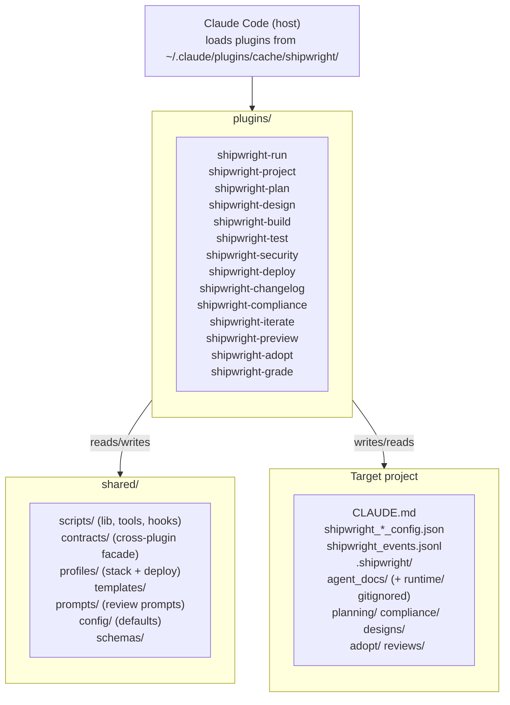

# Architecture — shipwright
<!-- shipwright:architecture v=2 last-sync=932e0d221ea1 -->

## System Overview

## Stack

| Layer | Technology | Notes |
|-------|-----------|-------|
| Frontend | — | — |
| Backend | — | — |
| Database | — | — |
| Auth | — | — |
| Runtime | python | — |

## Layers Detected

- **docs**: `docs`
- **infrastructure**: `scripts`
- **tests**: `Spec`, `integration-tests`

## Key Architecture Decisions

See `decision_log.md` for detailed ADRs. Profile-level decisions (stack, auth pattern, DB strategy, folder structure) are defined by the stack profile (`python-plugin-monorepo`).

## Data Flow

Each SDLC phase is its own Claude Code plugin under plugins/<phase>/, with the standard Claude Code plugin layout: .claude-plugin/plugin.json, hooks/hooks.json, skills/<phase>/SKILL.md, scripts/ (checks, hooks, lib, tools), tests/, and pyproject.toml. Cross-plugin code lives under shared/ (scripts, contracts, profiles, templates, prompts, config, schemas). `shared/contracts/` (ADR-088) is the supported entry point for cross-plugin imports — re-export facades (`shared.contracts.compliance`, `shared.contracts.iterate`) shield consumers from refactors of the underlying plugin internals. Plugins communicate via a unified session id (SHIPWRIGHT_SESSION_ID), shared shipwright_*_config.json files written into the target project, and an append-only shipwright_events.jsonl event log. Hooks defined in hooks.json are the single source of truth for between-phase actions and quality gates; behavior is documented in docs/hooks-and-pipeline.md. Memory and decision history is captured in .shipwright/agent_docs/decision_log.md (canonical H3 ADR format) and per-iterate or per-phase artifacts under .shipwright/planning/ and .shipwright/compliance/. A separate plugin cache at ~/.claude/plugins/cache/shipwright/ is used by Claude Code at runtime; updates require running scripts/update-marketplace.sh after pushing plugin-side changes.

Secrets live exclusively in `<project_root>/.env.local`, scaffolded by `/shipwright-adopt` (Step E.5, ADR-021) and read at runtime by `shared/scripts/lib/env.py::load_shipwright_env`. Every adopted repo carries the framework-level external-review keys (OPENROUTER_API_KEY, GEMINI_API_KEY, OPENAI_API_KEY) plus the active profile's `required_env_vars`. The file is git-ignored before write — a `.gitignore` enforcement failure aborts the scaffold rather than risking a tracked secrets file.

**Triage Inbox** (iterate-2026-05-11-triage-inbox-1a, ADR-046): pre-backlog intake JSONL store under `<project_root>/.shipwright/triage.jsonl`, git-tracked (the SSoT backlog, per-tree like `shipwright_events.jsonl`; see the C1 convention entry below — campaign 2026-06-05-track-triage-jsonl), append-only with history events. Producers (Phase-Quality Stop-hook + Compliance audit_detector) emit findings via `shared/scripts/triage.py::append_triage_item_idempotent` with dedup-keys (`{phase}:{code}` for Phase-Quality with 24h window, `check_id` for Compliance with cross-session window=None). Consumer (`aggregate_triage_on_stop.py`, last Stop-hook in the iterate plugin's chain) regenerates `.shipwright/agent_docs/triage_inbox.md`. Promote bridge: manual CLI `shared/scripts/tools/triage_promote.py` (Iterate 1a) → future WebUI Triage tab (Iterate 3) creating an `ExternalTask` in shipwright-webui's `sdk-sessions.json` with `promotedFromTriageId` back-reference. Triage and Backlog are intentionally separate stores; see `docs/guide.md` § 4.11.

**GitHub findings producer** (iterate-2026-05-19-github-triage-importer): a throttled SessionStart hook `shared/scripts/hooks/import_github_findings.py` — registered once, only in the shipwright-iterate plugin's `hooks.json` — pulls GitHub code-scanning / Dependabot / secret-scanning alerts and the latest failed default-branch CI run per workflow via the `gh` CLI and emits them as `source="github"` triage items. Logic is split across two shared modules: `shared/scripts/github_api.py` (thin `gh api` client; returns `None` on any failure so callers can tell a failed fetch from an empty one) and `shared/scripts/github_triage.py` (alert→item mapping, throttle, orchestrator). New write surface: `<project_root>/.shipwright/github_import_state.json` (throttle timestamp, gitignored by the `.shipwright/*` rule). New read surface: the GitHub REST API via `gh`. Throttle interval resolves run-config `triage.github_import_throttle_hours` → env `SHIPWRIGHT_GITHUB_IMPORT_THROTTLE_HOURS` → 6h default. Dedup keys are stable and namespaced (`github:{code-scanning,dependabot,secret-scanning}:<number>`, `github-ci:<workflow>:<sha>`); auto-resolve is key-shape-scoped (ADR-052) and fires only for sources whose fetch succeeded — a failed fetch never mass-resolves. The hook is fail-soft (always exit 0). Un-defers the CI producer deferred under ADR-047 — pull-based, not the webhook receiver originally ruled out of scope.

**GitHub security-artifact ingestion path** (iterate-2026-05-21-security-artifact-producer): the same SessionStart hook gains a parallel third source for the `gh-security:{owner}/{repo}` action-unit. When `cs_alerts is None` (GHAS Code Scanning unavailable — typical on private repos without GHAS), `github_api.latest_security_workflow_run()` finds the most recent successful run of `.github/workflows/security.yml` on the default branch (gated by a `SHIPWRIGHT_GITHUB_ARTIFACT_MAX_AGE_DAYS` freshness window, default 14d), then `github_api.download_security_findings(run_id)` pulls the `security-scan-results` artifact via `gh run download`, parses `findings.json`, and returns the validated `findings` list. The orchestrator routes the result to a sibling mapper `github_triage.security_action_unit_from_artifact` that produces an action-unit with the same `gh-security:{owner}/{repo}` dedup key and `launchPayload` contract. The artifact path is skipped when `cs_alerts` succeeds (no double-counting against GHAS-uploaded SARIF). `by_source["gh-security:artifact"]` distinguishes the ingestion path for telemetry. Severity counts are derived from iterating `findings[]` rather than trusting the redundant `by_severity` aggregate; raw scanner-controlled strings (`rule` / `description` / `affected_file`) are never rendered into the persisted `detail` or `launchPayload`. See `docs/security-ci-setup.md` for the Path A vs Path B operator choice and `docs/guide.md` § 4.11.1 for the user-facing action-unit description.

**GitHub PR-CI loop-closing producer** (iterate-2026-06-11-automerge-gh-pr-ci-producer, B4.5 Phase 1): the same SessionStart hook gains the `gh-pr-ci:{pr_number}` action-unit so failed hard-gates on an **open PR** surface in triage — without it, GitHub-native auto-merge (a later B4.5 step) could sit armed-but-waiting on a red PR with no visibility. New module `shared/scripts/github_pr_api.py` (PR-scoped `gh` client, split from the LOC-capped `github_api.py`; reuses `github_api._gh_api` for identical None-on-failure semantics): `fetch_open_prs()` (`pulls?state=open`, paginated → complete open set), `fetch_pr_check_runs(head_sha)` (`commits/{sha}/check-runs?filter=latest`; returns `None` when `len(check_runs) < total_count` so a >100-check truncation can't be misread as all-green), `fetch_pr_state(pr_number)` (resolve-only merged/closed distinction), and the reduce `open_prs_with_failed_checks()` (excludes draft PRs; returns `None` if ANY per-PR fetch failed — the MED-#1 symmetry rule). New mapper `github_triage.mappers.pr_ci_action_unit` (severity `high`, dedup `gh-pr-ci:{n}` with no head_sha; check names sanitised + sorted). New consumer-side submodule `github_triage/pr_ci.py` (`import_pr_ci_findings`, keeps `consumer.py` ≤300 LOC). Auto-resolve is **differentiated** via `github_triage.resolve.resolve_pr_ci` (`prChecksResolved` / `prMerged` / `prClosed`; unfetchable state keeps the item open rather than guessing) — deliberately routed OUTSIDE the generic `resolve_stale` sweep (PREFIX_PR_CI is in `_OWNED_PREFIXES` but kept out of `resolvable_prefixes`). `by_source["gh-pr-ci:"]` carries the emit count, or `None` when the source's fetch failed. New read surface: the GitHub PRs + check-runs REST endpoints via `gh` (throttled with the existing 6h import clock). No new write surface (reuses `triage.jsonl`); no message-contract change (existing action-unit schema, so the WebUI renders it unchanged). See `docs/guide.md` § 4.11.1.

**GitHub Tier-3 PR review** (iterate-2026-06-11-automerge-pr-review, B4.5 Phase 2): a new CI workflow `.github/workflows/pr-review.yml` gates external-contributor, sensitive-path (`plugins/*/{hooks,skills,agents}/`, `.github/workflows/`), and `needs-review`-labelled PRs through an OpenRouter LLM review before auto-merge — Tier 1 (iterate-branch) and Tier 2 (maintainer `svroch`) PRs are NOT reviewed at the PR stage (already covered locally at `/shipwright-iterate` Step 8), so the gate is proportional-to-risk (`$0` for Tier 1/2). The thin workflow has two jobs: `decide` (fork-guarded via `head.repo.full_name == github.repository`; hoists all `${{ github.* }}` into `env:` to satisfy the `run-shell-injection` rule; tier logic in bash/jq with `skip-pr-review` / `needs-review` label overrides) and `review` (required-check job named exactly `PR Review`, gated on `needs.decide.outputs.needs_review == 'true'`; a `needs:`-skipped job stays green so Tier 1/2 still pass the required check). Review logic lives in a new shipwright-security tool `scripts/tools/pr_review.py` + pure-helper lib `scripts/lib/pr_review_lib.py` (split to keep both ≤300 LOC): a stdlib-`urllib` POST to OpenRouter `/chat/completions` with `response_format: json_object`, a strict-JSON `{decision, summary, blocking, comments}` → exit-code merge gate (approve/comment=0, block=1, error=2), a 200k-char diff truncation that downgrades a partial review to comment-state (exit 0 + ⚠️ warning, never auto-block), and API-key log redaction. New prompt directory `shared/prompts/pr_reviewer/{system,user}` (directory form per PR #119) tuned for external-contributor review with an untrusted-diff prompt-injection inoculation. New read surface: the OpenRouter chat-completions API + the GitHub PR diff/comment endpoints via `gh`. Model switchable via `SHIPWRIGHT_PR_REVIEW_MODEL` (default `anthropic/claude-sonnet-4.6`). Snapshot-tested by `plugins/shipwright-security/tests/test_pr_review_workflow_shape.py`. Activation (the `OPENROUTER_API_KEY` secret, the branch-protection required-check, repo auto-merge, and the iterate F11 `gh pr merge --auto` patch) are separate B4.5 Phase 2/3 follow-ups. See `Spec/early-access-readiness-plan.md` § B4.5.

**Bloat Loop-Gate** (iterate-2026-05-25-bloat-foundation, Campaign A.foundation = A1 + A2 + A3): two-hook structural prevention against file-size regrowth. The shared classification + schema library `shared/scripts/lib/bloat_baseline.py` is the single producer for the bloat-allowlist format and the `runtime-prompt` (SKILL.md / CLAUDE.md / `plugins/*/agents/*.md` / `shared/prompts/*.md` → 400 LOC) vs source/test (300 LOC) classification — consumed by every other piece. **PostToolUse hook** `shared/scripts/hooks/check_file_size.py` (extended this iterate) writes a per-session marker `<project_root>/.shipwright/locks/bloat_pending.<SHIPWRIGHT_SESSION_ID>.json` (atomic tmp+rename, read-modify-write upsert by path, TTL 1h enforced by the reader) carrying every crossing or anti-ratchet event. **Stop hook** `shared/scripts/hooks/bloat_gate_on_stop.py` (new) reads only the current session's marker (no cross-session aggregation — protects parallel worktrees from each other), re-measures every entry at decision time (so a fixed file isn't punished), and emits top-level `{"decision":"block","reason":"..."}` per Stop-schema ADR-042 for anti-ratchet entries or new crossings outside `shipwright_bloat_baseline.json`. Block-reason body adapts the Iron-Law / Red-Flags / Rationalization-Prevention text from `obra/superpowers` `verification-before-completion` (MIT, © Jesse Vincent). New convention: both hooks are registered in every `plugins/*/hooks/hooks.json` (12 plugins) and the registry is drift-protected by a reverse-direction meta-test in `shared/tests/test_hook_registry_bloat.py`. New write surfaces: the per-session marker JSON and the project-root baseline JSON. Adopt sequence: `plugins/shipwright-adopt/scripts/lib/baseline_generator.py` wraps `bloat_baseline.scan` and runs as Step A.0 (before any other artifact write) so the gate has something to compare against on the first Stop event. Fail-open: missing or malformed baseline / marker → pass silently with a stderr diagnostic.

**Worktree isolation** (iterate-2026-05-15-iterate-worktree-isolation): every `/shipwright-iterate` run executes in its own git worktree under `<project_root>/.worktrees/<slug>/` on branch `iterate/<slug>`, cut from freshly-fetched `origin/<default>`. `setup_iterate_worktree.py` (skill step B1a) creates it and writes two gitignored main-repo surfaces: a per-run main-tree snapshot at `.shipwright/runs/<run-id>/main_tree_snapshot.json` and a per-session run pointer at `.shipwright/iterate_active/<session-id>.json`. The F0/F11 leak-guard `check_iterate_isolation.py` diffs the main tree against that snapshot and fails closed on any leak. `shipwright_events.jsonl` is a **per-tree, PR-committed artifact** (iterate-2026-05-29-events-jsonl-worktree-commit, superseding the 2026-05-16 main-redirect): the iterate's `work_completed` event is recorded into the worktree's OWN log at F5b and committed by F6, so it ships in the PR and the main tree is never written; the leak-guard's `shipwright_events.jsonl`(`.lock`) exemption is retained only as defense-in-depth for the legacy out-of-band F7/F7b path. Iterate ADRs are written run-id-keyed to `.shipwright/agent_docs/decision-drops/` (`write_decision_drop.py`) and folded into `decision_log.md` with sequential `ADR-NNN` at release time by `aggregate_decisions.py`. The former canonical/secondary session-role machinery is removed — isolation is structural, not detected.

## See also

_Existing user-facing documentation discovered by /shipwright-adopt._

- [`README.md`](../../README.md)
- [`docs/guide.md`](../../docs/guide.md)

## Architecture Updates
> **One line per change** — always-loaded Layer-1 context, so every line costs tokens on every future iterate. Format: `- **<run_id|ADR-NNN>** (YYYY-MM-DD): <Impact> — <one sentence: what + key surface>. → decision_log (Run-ID/ADR)`. **Budget ≤ 600 chars; detail goes in the ADR / `.shipwright/planning/adr/`, not here.** Enforced repo-agnostically (incl. adopted repos) by the F11 verifier + `shared/scripts/tools/check_agent_doc_budget.py` (SSoT `lib.agent_doc_budget`); see `references/F2.md`. Full verbatim prose for compacted entries lives in [`../planning/adr/_archive-agent-doc-updates.md`](../planning/adr/_archive-agent-doc-updates.md). Routing (`lib.architecture_doc.IMPACT_TARGETS`): `convention`-impact → [`conventions.md`](conventions.md) `## Convention Updates`; only `component` / `data-flow` live here.
- **iterate-2026-07-04-grade-report-audience-copy** (2026-07-04): Component — shipwright-grade HTML report reworked into a plain-language marketing instrument for non-experts: new render-only `lib/report_copy.py` (per-dimension plain question + concrete-scenario expandable + honest 'With Shipwright' upside, engine untouched); escape seam extracted to `lib/_html_dom.py`; cards show 'In your repo'/n-a reframe with the open-standard anchor + provenance moved into the expandable `
`; two-CTA funnel (Masterclass + adopt); honesty hedges pinned by tests. → decision_log (Run-ID).
- **iterate-2026-07-04-diff-coverage-rollout-combine** (2026-07-04): Data-flow — diff-coverage Phase 2: per-tier coverage (each plugin `scripts/` + `shared` + `integration`) is folded into one repo-relative `coverage.xml` by new `combine_coverage.py` (per-plugin `[paths]` remap). `record_coverage_total.py` writes the tracked repo-wide `coverage.total`=80.2%, lighting the dormant **W4** verifier green vs a new `shipwright_test_config.json.coverage.min`=70 anti-ratchet baseline. Non-gating (Phases 3–4). → decision_log (Run-ID).
- **iterate-2026-07-04-grade-g4-plugin-polish** (2026-07-04): Component — shipwright-grade G4: authoritative wiring (a healthy `.shipwright/` grades via `collect_all`→`build_grade_inputs`→the same `compute_grade` so grader-grade == dashboard-grade; corrupt/partial/stale/oversize → heuristic) + URL clone-and-grade behind `open_target()` on the `resolve_target` seam (scheme allowlist, shallow/no-submodule, ext/file transports off, non-interactive git, crash-safe tempdir; new read-surface: a cloned remote) + plugin registration at v0.29.1. → decision_log (Run-ID).
- **iterate-2026-07-04-grade-g3-html-report** (2026-07-04): Component — shipwright-grade G3: self-contained HTML report renderer (`lib/html_report.py` + `lib/_html_styles.py`) off the typed `report_model`, wired as `--format html`. Escape-by-default `el`/`_Raw` element builder + restrictive meta CSP + zero inline-JS/external-request surface + control/bidi stripping render UNTRUSTED repo strings inert; deterministic (timestamp-only footer), snapshot + parser-inertness tested. → decision_log (Run-ID).
- **iterate-2026-07-04-pr-review-exclude-generated-diff** (2026-07-04): Component — the Tier-3 PR-review gate (`plugins/shipwright-security/scripts/tools/pr_review.py`) now filters producer-generated file-sections out of the `gh pr diff` BEFORE the truncation check via new `scripts/lib/pr_review_diff_filter.py` (`filter_generated_paths`); a section is dropped only when EVERY path it touches is generated (rename-safe), and the excluded list is disclosed in the PR meta + comment. Stops medium+ iterates from tripping the size cap and losing their review. → decision_log (Run-ID).
- **iterate-2026-07-04-grade-g2-signals** (2026-07-04): Component — shipwright-grade G2 (campaign 2026-07-03-shipwright-grade): new signal modules light the maintainability, dependency, security + 3-tier test-health dims; the compliance engine gains one additive `GradeInputs.oversize_file_ratio` field + a dim-6 branch, byte-identical for existing inputs. Network enrichment (code-scanning SARIF / CI JUnit / Scorecard rollup) is behind `--allow-network`; untrusted CI JUnit XML is `defusedxml`-hardened. → decision_log (Run-ID).
- **iterate-2026-07-03-diff-coverage-measure-one-tier** (2026-07-03): Component — diff-coverage Phase 1: new `shared/scripts/tools/measure_diff_coverage.py` + a non-gating CI `diff-cover` step write % of CHANGED lines covered (vs origin/main, shared tier) to a gitignored transient `.shipwright/coverage/diff_coverage.json`; new read-surface consumed by `plugins/shipwright-compliance/scripts/lib/_diff_coverage_block.py` → a grade-neutral Test-Health INFO line. Tracked `coverage.total` + W4 deferred to Phase 2. → decision_log (Run-ID).
- **iterate-2026-07-03-grade-g1-projector** (2026-07-03): Component — new read-only plugin `plugins/shipwright-grade/` (campaign 2026-07-03-shipwright-grade, G1): projects a LOCAL git repo into `GradeInputs` and reuses `compute_grade` UNCHANGED (cross-plugin via `engine_bridge`, ADR-045-safe) to emit a deterministic A–F card; underivable dims render honest n/a. Reuses adopt detectors (audited read-only); hardened `git_exec` git seam; local-only, untrusted-input hardened. New read surface: a target repo's history + files. → decision_log (Run-ID).
- **iterate-2026-07-01-grade-composition-neutral** (2026-07-01): Component — Control Grade made composition-neutral: removed the self-relative FR-tag-decline penalty + verdict cap from `lib/_grade_gate.py` (and the now-dead `fr_tag_*` `GradeInputs` fields) so the feature-vs-maintenance work mix no longer caps or lowers the grade; the verdict caps only on dark-expected or broken pillars, and the `Recent changes traced to an FR` row is informational (INFO, never WARN). Traceability control = coverage + reconciliation + the write-time FR-gate. → decision_log (Run-ID).
- **iterate-2026-06-30-control-grade-honesty** (2026-06-30): Component — Goodhart-resistant Control Grade: new `lib/_grade_gate.py` (honesty layer) applies a self-relative FR-tag-decline penalty + a weakest-link verdict gate (decline / dark-expected-control / F-collapse caps) so the headline can't read "A — full control" while a load-bearing pillar decays; value model split to `lib/_grade_types.py`; anchors pivoted off DO-178C/IEC 62304 to single open SE/NIST standards (29148/12207/SSDF); new `.github/workflows/scorecard.yml` runs the native OpenSSF action. → decision_log (Run-ID).
- **iterate-2026-06-28-sbom-honesty** (2026-06-28): Data-flow — AR-04 SBOM honesty: the inventory resolves Python versions from each manifest's sibling `uv.lock` (+ a project-wide union fallback) and dedupes by installed version (duplicate `openai` row gone); licenses resolve across ALL `.venv`s so a stale per-manifest venv no longer drops a row to `-`. New read-surface `uv.lock`; new `collectors/_uv_lock.py`, `collectors/_venv_scan.py`, `sbom_render.py`; the ASCII verdict counts every package and never claims "all permissive" while any license is unresolved. → decision_log (Run-ID).
- **iterate-2026-06-28-ci-security-dashboard** (2026-06-28): Component + data-flow — AR-10: new producer `tools/refresh_ci_security.py` pulls the latest `security.yml` `findings.json` (via `github_api`) into a tracked, public-safe `.shipwright/compliance/ci-security.json`; new `lib/ci_security.py` renders the CI Security dashboard section + lights the Control-Grade Security dimension n/a→live (open high/critical; n/a — never a false CRITICAL — when un-ingested); `compliance_report` aux sections split to `lib/_dashboard_sections.py`. → decision_log (Run-ID).
- **iterate-2026-06-28-cc2-bp2-impact-producer** (2026-06-28): Component + data-flow — `work_completed` events gain an optional per-FR `fr_impact` map (`{FR-id: add|modify|remove|none}`) written by `record_event` + `finalize_iterate` (validated via shared `fr_classification.normalize_fr_impact`, read tolerantly by `WorkEvent`); new `plugins/shipwright-compliance/scripts/lib/_reconciliation.py` (SSoT for the grade + cc3 RTM) lights the Control-Grade change-reconciliation dimension n/a→live (touched-without-re-verify, age-neutral). → decision_log (Run-ID).
- **iterate-2026-06-28-cc1-bp1-fr-mapping** (2026-06-28): Component — new shared SSoT `shared/scripts/lib/fr_classification.py` (`is_traced`/`is_satisfied_no_fr`/`is_behavior_affecting`), shared by the `record_event` FR-gate and the compliance Control-Grade adapter + new `lib/_traceability.py`; WorkEvent gains `change_type`/`none_reason`/`spec_impact`; the gate blocks behavior-affecting no-FR changes and D1 uses all-time coverage. → decision_log (Run-ID).
- **iterate-2026-06-14-agent-doc-entry-budget-gate** (2026-06-14): Component — new SSoT `shared/scripts/lib/agent_doc_budget.py` + repo-agnostic CLI `tools/check_agent_doc_budget.py` + F11 verifier `check_agent_doc_budget` enforce the ≤600-char one-line agent-doc entry rule in EVERY repo (incl. adopted, via the plugin cache), closing the run-id-slug date hole that exempted the bold Learnings form; also fixes the `_append_architecture_update` blank-line writer. → decision_log (Run-ID).
- **iterate-2026-06-13-atomic-write-fsync-durability** (2026-06-13): Component — new shared durability primitive `shared/scripts/lib/atomic_write.py::durable_atomic_write` (tmp + `fsync` + `os.replace` + best-effort POSIX dir-fsync); ~20 atomic-write helpers across `shared/{lib,tools,hooks}`, `dev_server`, and 4 plugins delegate to it, closing the *lost-write* gap WP2 left open. Byte-identical output; fsync is the only behavioral change. External-review follow-up to `iterate-2026-06-13-runconfig-atomic-writes`. → decision_log (Run-ID).
- **iterate-2026-06-13-runconfig-atomic-writes** (2026-06-13): Component — new `run_config_store.py` centralizes atomic (tmp+os.replace) + path-coordinated-lock writes to `shipwright_run_config.json`; the orchestrator (`save_run_config`/`update_step`), `phase_task_lifecycle`, and `append_phase_history` writer families now coordinate by the canonical `*.json.lock` path (audit 2026-06-10 WP2: F11 unlocked/stale RMW, F12 torn read, F13 nested 30s timeout → outer 60s). → decision_log (Run-ID).
- **iterate-2026-06-10-phase-hook-lifecycle** (2026-06-13): Component — new shared `hook_session.py` resolves phase-hook identity (project_root + session_id) from the Claude-Code **stdin payload** (+`resolve_project_root()` fallback), not env vars no launcher sets (F1), so the v2 lifecycle engages from a bare launch card instead of no-op'ing. `record_event` gains `append_event_idempotent` (dedup scan + append in ONE `_FileLock`, F14) + first-class `phase_failed`/`stale_stop_rejected` event types (F15). (PR #224)
- **iterate-2026-06-12-cross-component-gate** (2026-06-12): Component — new `cross_component` risk flag (`CROSS_COMPONENT_FILE_PATTERNS`: merge/churn/event-log resolver, hooks + hook fan-out, pipeline validators, campaign drain) forces an INTEGRATION test (`category:"integration"` in the Ledger) at medium+. NON-dodgeable: F11 verifier `check_integration_coverage` recomputes the flag from the diff, not an agent-report, and STOPs without it. Closes the composition gap (empirical machinery was depth+breadth, not composition). (PR pending)
- **iterate-2026-06-12-delivery-watch** (2026-06-12): Component — new `shared/scripts/tools/watch_pr_delivery.py`: F11's final gate polls `gh pr view` until the PR is MERGED+green (delivered), a Required Check fails (STOP, exit 1), is closed, or times out — kills "shoot and forget" (armed ≠ done; #213 was reported done while CI was red). Pure `classify_delivery` + thin gh poll loop; companion F2 rule runs the iterate-plugin agent-doc budget lint (outside the `shared/tests` F0) before push. (PR pending)
- **iterate-2026-06-12-union-curated-agent-docs** (2026-06-12): Component — `merge=union` extended to the two curated agent-docs (architecture.md + conventions.md) via a distinct `CURATED_DOC_UNION_PATHS` category (`ALL_UNION_PATHS = UNION_PATHS + CURATED`; `UNION_PATHS` still the JSONL pin). Closes the curated-prose half of the cascade the regenerate resolver can't touch: union keeps both prepended bullets, honored server-side, so `integrate_main` no longer blocks on a curated-doc-only conflict. Self-heal path split to `gitattributes_selfheal.py` (bloat). (PR #213)
- **iterate-2026-06-12-arch-drift-test-scope** (2026-06-12): Data-flow — the two whole-set arch-drift checkers (Group-F **F5** detective + the `test_architecture_md_reflects_arch_impact` drift test) scope to drops event-owned by this tree (`events_log.finalized_run_ids` reads this tree's committed `shipwright_events.jsonl`; `architecture_doc.records_in_run_set` filters), failing open when no event log exists, so cross-branch campaign sibling drops in the shared main-rooted `decision-drops` dir no longer false-fail a later branch. The F11 gate was already single-run_id scoped. (PR #207)
- **iterate-2026-06-06-arch-drift-detector** (2026-06-06): Convention — architecture-drift is enforced by content reconciliation, not history-diffing: the Group-F **F5** detective + new F11 gate `check_architecture_documented` require every `architecture_impact` drop's run_id to appear in its target doc, sharing one oracle `shared/scripts/lib/architecture_doc.py`. → archive
- **iterate-2026-06-05-scanner-degraded-marker** (2026-06-05): Data-flow — a degraded scanner leg (fatal/empty/truncated `_run_tool` None-branch) now propagates via an OSSBackend `scan_errors` control-plane side-channel → `findings.json.degraded` → `scan.py` exit 2 → the monorepo `security.yml` critical-gate fails closed, instead of returning `[]` that was indistinguishable from a clean scan and passed green. The findings list stays pure (no synthetic critical finding; control-plane signal kept off the data-plane). (PR #157)
- **iterate-2026-06-05-fr-linkage-lifecycle** (2026-06-05): Convention — the FR-gate is enforced on the finalize write-path: `finalize_iterate._record_event` now calls the same `record_event._fr_or_change_type_gate_error` before `append_event` (after the idempotency early-return), fail-closed via `FinalizeGateError`; and Group-D **D3** counts a same-event `new_frs`+`affected_frs` as delivered (`ts >= promised_ts`, was strictly `>`). (commit 2b0fb66c, campaign C3)
- **iterate-2026-06-05-bloat-marker-worktree-aware** (2026-06-05): Convention — `bloat_baseline.strip_worktree_prefix()` lets `check_file_size` and the Stop-hook bloat gate strip the `.worktrees/<slug>/` prefix for the baseline membership/ceiling lookup, so a worktree iterate that bumped a baseline is no longer falsely blocked; the stored marker path keeps the prefix so the Stop gate can still re-measure the actual worktree file. (PR #150)
- **iterate-2026-06-05-b7-exclude-nonfunctional** (2026-06-05): Convention — `git_log_scan` Rule E excludes commits whose Conventional-Commit type is non-functional (`build`/`chore`/`ci`/`docs`/`style`/`test`) from the B7 "every commit has a matching event" detective; functional types (`feat`/`fix`/`perf`/`refactor`) are never excluded. Configurable via `b7_exclusions.exclude_nonfunctional_types` (default true) + `nonfunctional_types`. Supersedes the narrower Rule D. (PR #151)
- **iterate-2026-06-05-a5-gate-behavioral-probe** (2026-06-05): Component — compliance check **A5.8** extracts the deployed security gate's `run:` body and EXECUTES it against fixture scan output, asserting the ratified policy (critical→block, empty/invalid→fail-closed, clean→pass). Flavor-agnostic: each scenario stages BOTH `sarif/*.sarif` AND `findings.json`, so the probe is correct whether the gate reads SARIF (adopted repos) or `findings.json` (this monorepo). (PR #152)
- **Campaign `2026-06-05-track-triage-jsonl`** (2026-06-05): git-track `.shipwright/triage.jsonl` (anchor `trg-2fb7d3bc`) — sub-iterates iterate-2026-06-05-sbom-cluster-stable-identity, iterate-2026-06-05-triage-dismissed-gc (new `shared/scripts/tools/triage_gc.py`), iterate-2026-06-05-triage-track-c1-gitignore (gitignore negation + scaffolder self-heal), iterate-2026-06-07-triage-main-tree-reconcile (`reconcile_triage.py` folds main-tree drift into one B7-exempt `chore(triage)`). → archive
- **iterate-2026-06-03-campaign-status-field** (2026-06-03): Data-flow — producer-owned campaign lifecycle: `status.json` + `campaign.md` frontmatter gain a `draft→active→complete` `status` field (`campaign_progress.LIFECYCLE_STATUSES`); optional, legacy-fallback to derived `done<total`. New write-surface: the `status` key. Anchor `trg-f06f04e3`. → archive
- **iterate-2026-06-10-status-projection** (2026-06-10): Data-flow — new pure lib `shared/scripts/lib/campaign_status.py` projects a campaign's `status.json` from the tracked event log (`campaign.md` skeleton authoritative; never-downgrade merge over committed status). Campaign `2026-06-07-tracked-campaign-status` S2. Read-surface: `shipwright_events.jsonl`. → archive
- **iterate-2026-06-10-finalize-resolver** (2026-06-10): Data-flow + component — a campaign's `status.json` becomes durable/tracked/per-tree: F5b re-projects + writes it (F6 stages it → ships in the PR); the churn resolver re-projects ONLY conflicted campaigns. New lib `shared/scripts/lib/campaign_status_io.py`. Campaign `2026-06-07-tracked-campaign-status` S3. → archive
- **iterate-2026-06-02-sessionstart-dedup-guard** (2026-06-02): Convention — new shared primitive `shared/scripts/lib/event_once.py::claim_once` (atomic O_EXCL first-wins, TTL-armed, fail-open) lets one of the N per-plugin SessionStart invocations do an expensive once-per-event action; applied to the Phase-Quality Tier-1 FAIL injection (was emitting ~12×). Interim fix before campaign `2026-06-02-hook-consolidation`. → archive
- **ADR-021** (2026-05-03): Adopt scaffolds .env.local with profile + framework keys (Layer-3 SSoT)
- **iterate-2026-05-30-gitignore-canon-propagation** (2026-05-30): Convention — the canonical `.shipwright/` artifact-ignore block has one SSoT `shared/templates/shipwright-gitignore.template`; new `shared/scripts/lib/gitignore_canon.py` line-merges missing rules into a target `.gitignore` (adopt Step E.6 + project `--status complete`). Template↔framework congruence pinned by `test_gitignore_template_congruent.py`. → archive
- **ADR-024** (2026-05-03): Boundary Tests Foundation — `touches_io_boundary` risk flag + Boundary Probe sub-step in iterate Build TDD (Sub-Iterate A of campaign iterate-skill-hardening). New helper `is_io_boundary_change(changed_files)` in `plugins/shipwright-iterate/scripts/lib/classify_complexity.py`; new reference docs `references/boundary-probes.md` (8 edge-case categories) and `references/round-trip-tests.md` (producer→file→consumer test pattern). 7th Self-Review item ("Affected Boundaries") added.
- **ADR-032** (2026-05-05): Adopt writes shipwright_iterate_config.json with documented opt-out schema
- **ADR-034** (2026-05-06): load_review_config deep-merges per-project override; cascade helper added
- **iterate-2026-05-16-fix-events-worktree-aware** (2026-05-16): Data-flow — new SSoT `shared/scripts/lib/events_log.py::resolve_events_path` resolves `shipwright_events.jsonl` via `git rev-parse --git-common-dir` (superseded for the per-tree model by iterate-2026-05-29-events-jsonl-worktree-commit). Drift-pinned by `test_events_log_ssot.py`. → archive
- **iterate-2026-05-19-github-triage-importer** (2026-05-19): Component — new throttled SessionStart hook `import_github_findings.py` + `github_api.py` + `github_triage.py` import code-scanning / Dependabot / secret-scanning alerts + failed CI as `source=github` triage items. New write-surface `.shipwright/github_import_state.json`. Un-defers the ADR-047 CI producer (pull-based). → archive
- **iterate-2026-05-20-escape-md-cells** (2026-05-20): Component — new helper `shared/scripts/markdown_table.py::escape_cell` (top-level, NOT under `lib/`, per ADR-045) escapes `\`/`|`/newline in every event-derived markdown table cell the framework renders. Drift-pinned by `test_markdown_table.py` + a real-renderer round-trip. → archive
- **iterate-2026-05-23-security-adopt-compliance-snapshots** (2026-05-23): Component — extends the `Run-ID:`-snapshot producer set: adopt Step H (`adopt-<date>-<repo>` trailer), security Step 7.5 (`security-<scan_id>` refresh commit), and `update_compliance.PHASE_REPORTS` gains `adopt`+`security`. Convention: a new snapshot producer adds both the `Run-ID:` trailer and a `PHASE_REPORTS` entry. → archive
- **iterate-2026-05-23-compliance-md-single-producer** (2026-05-23): Component + data-flow — the 5 tracked compliance MDs are produced EXCLUSIVELY by iterate-finalize (Stop-hook auto-regen deleted); `audit_staleness.py` Group E becomes snapshot-provenance (latest `Run-ID:`-trailer commit touching `.shipwright/compliance/` vs on-disk) → zero E1-E5 false positives between iterates. → archive
- **iterate-2026-05-20-triage-launch-surface** (2026-05-20): Component — Triage Inbox redesigned as a launch-surface: per-repo/per-workflow **action-units** (not finding-mirrors), each with a `launchPayload`; new dedup prefixes `gh-security`/`gh-secrets`/`gh-ci`; new CLI `shared/scripts/tools/triage_cli.py`; `github_api.owner_repo()` local-first remote parse. ADR-057. → archive
- **iterate-2026-05-21-b1-compliance-dashboard-mode-aware** (2026-05-21): Mode-aware compliance dashboard. Detect adopted runs via `run_config.adoption` (corrects the plan's scope-based check). Adopted projects render pipeline phases as `n/a (adopted) INFO`; hide build-section and sections-reviewed rows for adopted. Add Why-warn 4th column to the compliance dashboard. Triage-open indicator surfaces open triage cards inline. See decision-drop `iterate-2026-05-21-b1-compliance-dashboard-mode-aware_001.json`.
- **iterate-2026-05-21-b2-sbom-polish** (2026-05-21): SBOM undeclared-license triage producer (per workspace). `emit_undeclared_triage()` in `sbom_generator.py` emits one `source='sbom'`, `kind='compliance'`, `severity='low'` item per manifest with undeclared packages; dedup-key `sbom:undeclared:<manifest-rel-path>`. See decision-drop `iterate-2026-05-21-b2-sbom-polish_001.json`.
- **iterate-2026-05-21-b3-test-evidence-layer-and-triage** (2026-05-21): Per-layer FAIL triage + Layer column + `record_event` layers schema. `emit_test_failure_triage()` emits one `source='test-evidence'` item per failing layer from the latest `test_run` event; dedup `test-fail:<layer>`; severity high for e2e/integration/pgtap, low for unit. New convention: `test_run` events carry first-class `integration` and `pgtap` keys alongside `unit` / `e2e` with optional `failed` counts. See decision-drop `iterate-2026-05-21-b3-test-evidence-layer-and-triage_001.json`.
- **iterate-2026-05-21-b4-rtm-deep-link-and-coverage** (2026-05-21): RTM consumes `frId` cross-link + actionable Coverage subsections. Requirements-coverage Status cell renders `FAIL → [trg-XXX](...#trg-XXX)` per open triage item with matching `frId` (overrides COVERED). Coverage Summary section gains three actionable subsections. See decision-drop `iterate-2026-05-21-b4-rtm-deep-link-and-coverage_001.json`.
- **iterate-2026-05-21-c1-fr-gate-finalize** (2026-05-21): Hard-enforce FR-or-change-type at iterate finalize (forward-only). New gate `_fr_or_change_type_gate_error` in `record_event.py` fires for every `work_completed`+`source=iterate` event. Pass conditions: `affected_frs`/`new_frs` non-empty OR `change_type ∈ {docs, tooling, compliance, infra}`. Convention: every iterate event must link to an FR or declare why it doesn't. See decision-drop `iterate-2026-05-21-c1-fr-gate-finalize_001.json` (ADR-059).
- **iterate-2026-05-21-c2-architecture-and-adr-drift-detector** (2026-05-21): F4–F7 detective-only documentation hygiene checks. Added F4 (ADR > 60 lines without `spec_ref`), F5 (architecture marker vs arch-impact drops via `git log`), F6 (`CLAUDE.md` > 200 lines), F7 (`CLAUDE.md` Iterate-annotation count > 5) to `group_f.py`. All four are detective-only — Phase-Quality can't see them, only a holistic scan can. See decision-drop `iterate-2026-05-21-c2-architecture-and-adr-drift-detector_001.json`.
- **iterate-2026-05-21-c3-plugin-cache-sync-check** (2026-05-21): Detective-only plugin-cache vs repo drift check. New standalone Python script `scripts/check_plugin_cache_sync.py` walks `plugins/shipwright-*` in the repo and compares each against the lexically-latest version dir under `~/.claude/plugins/cache/shipwright/`. Convention: after every plugin-side edit + `git push`, operators MUST run `bash scripts/update-marketplace.sh`; this script is the drift detector. See decision-drop `iterate-2026-05-21-c3-plugin-cache-sync-check_001.json`.
- **iterate-2026-05-21-triage-producer-contract** (2026-05-21): Triage producer contract — schema + RTM-link fields + inbox polish. New wire SSoT `shared/schemas/triage_item.schema.json`; optional `frId`/`suiteId`/`eventId` append-event keys for RTM deep-link; `aggregate_triage.py` emits HTML anchors per card. New convention: every producer that appends a triage item must validate against the schema. See decision-drop `iterate-2026-05-21-triage-producer-contract_001.json`.
- **iterate-2026-05-22-deterministic-render-timestamps** (2026-05-22): Data-flow — new `shared/scripts/lib/events_log.latest_event_dt()` returns `max(event.ts)`; every framework-rendered banner consumes it instead of `datetime.now()`, so re-renders against the same event log are byte-identical. ADR-070. → archive
- **iterate-2026-05-23-iterate-f7-tracked-event-log-commit** (2026-05-23): Component — new F7b step `shared/scripts/tools/commit_event_followup.py` seals a tracked-dirty `shipwright_events.jsonl` after F7 (worktree-aware, idempotent) so a later `git reset --hard` can't wipe the event. Legacy/out-of-band only under the per-tree model. ADR-073. → archive
- **iterate-2026-05-23-verifier-multi-commit-aware** (2026-05-23): Component — the F11 verifier resolves the F7 event by `run_id` (`_find_work_event_by_run_id`), not HEAD commit, since `commit_hash` drifts across multi-commit iterates/rebases; the substring search stays a back-compat fallback. ADR-076. → archive
- **iterate-2026-05-23-verifier-drift-remediation** (2026-05-23): Convention — new `shared/tests/test_architecture_md_reflects_arch_impact.py` enforces that every `architecture_impact ∈ {component,data-flow,convention}` drop's run_id appears in its target doc; RED→GREEN backfilled 11 missing entries. F2's coupling is now structural. ADR-075. → archive
- **sub_iterate-20260525-211635-B8** (2026-05-26): Component — new `shared/contracts/` cross-plugin facade: `shared.contracts.compliance` + `shared.contracts.iterate` re-export the supported entry points (sys.path bootstrap once); adopt + test consumers use them instead of subprocess/ancestor-walk. Future splits MUST keep the re-exported names importable. ADR-088. → archive
- **iterate-2026-05-24-sbom-triage-cluster-collapse** (2026-05-24): Convention — the SBOM undeclared-license triage producer collapses N≥2 workspaces sharing a `(sorted_undeclared_names, manifest_type)` signature into ONE cluster action-unit `sbom:undeclared-cluster:<sha256>` (membership-encoded key auto-dismisses on drift). ADR-082. → archive
- **ADR-055** (2026-05-19): GitHub findings triage producer (un-defers the CI producer)
- **ADR-068** (2026-05-21): Artifact-based GitHub security producer for Triage Inbox
- **ADR-078** (2026-05-26): Split dev_server.py 997 LOC into 10-file package; preserve shim for uv run callers
- **ADR-088** (2026-05-26): shared/contracts/* — cross-plugin contract surface introduced for compliance + iterate
- **iterate-2026-05-25-bloat-defense** (2026-05-25): Component (ADR-083) — Campaign A defense-in-depth: local pre-commit anti-ratchet (`scripts/hooks/pre-commit` + `install-hooks.{sh,ps1}`), PR-time `bloat-check.yml`, shared `anti_ratchet.py`, the bloat-exception ADR template, and the `shared/glossary.md` registry. Constitution §21 extended with the anti-ratchet rule. → archive
- **iterate-2026-05-25-bloat-review** (2026-05-25): Component (ADR-085) — Campaign A closure: the Bloat Checklist appended verbatim to both reviewer prompts (byte-parity pinned by `test_reviewer_bloat_checklist_parity.py`); new compliance audit **Group H** (`group_h.py`, 7 checks H0-H6) reusing the producer-side `bloat_baseline.scan`. → archive
- **iterate-2026-05-30-reviewer-stack** (2026-05-30): Component (ADR-102) — `/shipwright-build` Step 6 gains a 3-stage cascade `spec-reviewer` (HARD-GATE) → `code-reviewer` → conditional `doubt-reviewer`; orchestration in `references/code-review.md`, the Kern carries a pointer; reviewers stay internal. Drift: `test_reviewer_orchestration.py`. → archive
- **Campaign B1 — SKILL.md modular references** (2026-05-26): Component (ADR-074) — 7 oversize SKILL.md files split to a ≤300-LOC Kern + per-topic `references/*.md`; test-locked anchors (Risk Taxonomy, Override Classes, Phase Matrix, named Steps) stay inline. New convention: Kern ≤300 LOC, deep dives offloaded to `references/`. → archive
- **Campaign B2 — collectors/ package** (2026-05-26): Component — `plugins/shipwright-compliance/scripts/lib/data_collector.py` (1559 LOC) split into per-domain `collectors/` modules + a 41-LOC re-export shim; all 5 compliance MDs regenerate byte-identical. → archive
- **Campaign B3 — phase_quality/ package** (2026-05-26): Component — `shared/scripts/lib/phase_quality.py` (1108 LOC) split into 9 thematic submodules (re-export `__init__`); sibling diff added the Group-H bloat column to the Compliance Dashboard. → archive
- **Campaign B5 — orchestrator_pkg/** (2026-05-26): Component — `plugins/shipwright-run/scripts/lib/orchestrator.py` (983 LOC) split into `orchestrator_pkg/` (12 submodules) + a 41-LOC shim preserving the `mocker.patch` targets and the `write-config|get-next-step|update-step` CLI. → archive
- **Campaign B6 — github_triage/ package** (2026-05-26): Component — `shared/scripts/github_triage.py` (929 LOC) replaced by the `github_triage/` package (every submodule ≤300 LOC); the public import surface (12 names + `SOURCE`) preserved exactly. → archive
- **iterate-2026-05-27-tracked-artifacts-single-producer-and-finalize-sandbox** (2026-05-27): Component + data-flow (ADR-089/090) — extends single-producer to the agent-doc trio (`session_handoff`/`build_dashboard`/`triage_inbox`): Stop hooks write live state to gitignored `.shipwright/agent_docs/runtime/`, iterate-finalize is the sole tracked producer; finalize hard-gated when the session→worktree pointer is None. → archive
- **iterate-2026-05-27-guide-readme-refresh** (2026-05-27): Convention — docs-only refresh of `docs/guide.md` + `README.md` to the post-v0.22.0 state (8 audit groups, 300/400-LOC budgets, runtime/snapshot split, merge-not-rebase, ADR spec folder). No new convention introduced. → archive
- **iterate-2026-05-29-events-jsonl-worktree-commit** (2026-05-29): Data-flow + component (ADR-094) — `shipwright_events.jsonl` is now a per-tree, PR-committed artifact: `resolve_events_path` returns `project_root/EVENT_FILE` literally; the `work_completed` event is recorded in the worktree's own log at F5b, staged by F6, ships in the PR. F6.5/F7/F7b skipped in the worktree flow. → archive
- **iterate-2026-05-29-skill-bootstrap-pack** (2026-05-29): Component (ADR-097) — Skill Bootstrap Pack: SessionStart `session_start_using_shipwright.py` injects `using-shipwright.md`; a PostToolUse→Stop wave (`mark_plugin_edit.py` + `plugin_sync_reminder_on_stop.py`) surfaces plugin-cache drift as `source=plugin-sync` triage. Hooks registered across all 12 plugins (forward/reverse meta-test). → archive
- **iterate-2026-05-31-ci-gate-guard** (2026-05-31): Component (ADR-108) — new `check_ci_gate_coverage.py` (+ `ci_gate_scan.py` / `ci_gate_allowlist.py`) gates `ci.yml`: fails on an unreferenced test dir, an undocumented loose gate (`|| true` / `continue-on-error`), or a non-fail-closed security critical-gate. Allowlist has both-direction drift protection. → archive
- **ADR-115** (2026-05-31): plugin-sync Stop-hook triage item targets the durable main-repo log
- **ADR-121** (2026-06-03): Producer-owned campaign lifecycle status (draft -> active -> complete)
- **ADR-124** (2026-06-05): A5.8 behaviorally probes the deployed critical-gate
- **ADR-131** (2026-06-05): Degraded scanner legs propagate via a scan_errors side-channel, not synthetic findings
- **ADR-133** (2026-06-05): Machine-churn-only triage GC tool
- **ADR-139** (2026-06-08): Gitignored per-tree triage outbox + union reader
- **ADR-140** (2026-06-08): Sweep triage outbox into PR branch; GC only origin-delivered lines
- **iterate-2026-06-10-triage-dedup-keep-last-append** (2026-06-10): Data-flow — `churn_merge.dedup_triage_lines` collapses same-id `append` events keeping the LAST (mirrors the append-log reader reduction), so a re-appended updated finding no longer wedges the outbox sweep as a `duplicate append`. Campaign `2026-06-08-triage-outbox-delivery` follow-up. → archive
- **iterate-2026-06-12-triage-status-idle-main-outbox** (2026-06-12): Data-flow — `triage.mark_status` routes an idle-main status flip (dismiss/snooze/promote) to the outbox (`should_route_to_outbox`), symmetric with `append_triage_item`; elsewhere residence-derived (TRACKED-PREFERRED). Completes campaign `2026-06-08-triage-outbox-delivery` D1. ADR-100 file. → archive
- **iterate-2026-06-12-automerge-serial-integrate** (2026-06-12): Component — new `shared/scripts/tools/ensure_current.py` (thin wrapper over `integrate_main`) is the F11 / campaign "refresh-if-behind" guard fixing the auto-merge churn cascade (Option A): GitHub's server-side 3-way merge can't run the regenerate-at-merge resolver, so a behind branch merges stale or stalls DIRTY on regenerated snapshots. F11 brings the branch current THROUGH `integrate_main` before arming `gh pr merge --auto`; campaigns set `SHIPWRIGHT_ITERATE_AUTOMERGE=0` to drain PRs serially. → decision_log (Run-ID).
- **iterate-2026-06-13-code-simplify-skill** (2026-06-13): Component — new `plugins/shipwright-iterate/scripts/lib/behavior_snapshot.py` (snapshot/verify gate) records the green test-state (collected node-id set + counts + exit + source LOC) at the gitignored `.shipwright/runs/<run_id>/behavior_snapshot.json` and STOPs a simplify on behavior drift or removed coverage; new SIMPLIFY sub-mode of CHANGE (classify_intent `mode`) routes through `references/F-simplify.md` (OS1). → decision_log (Run-ID).
- **iterate-2026-06-13-unify-simplify-reducibility** (2026-06-13): Component — RELOCATED the behavior_snapshot gate to **`shared/scripts/tools/behavior_snapshot.py`** (SSoT; supersedes the OS1 entry's `plugins/.../scripts/lib/` path) so the shared reducibility catalog can cite it without an inverted plugin→shared dep. Unifies the simplify gate + bloat catalog: F-simplify adopts the D·A·X·C·S·M·P·T vocabulary; the catalog cites it as the mechanical G3 ("keeps-tests-green") proof on exec surfaces (CI Tier-3 exempt). → decision_log (Run-ID).
- **ADR-151** (2026-06-07): Reconcile-and-commit main-tree triage.jsonl drift in tooling
- **ADR-160** (2026-06-10): Per-tree campaign status.json: finalize wiring + scoped churn resolver
- **ADR-161** (2026-06-10): Project campaign status from the event log (never-downgrade)
- **ADR-163** (2026-06-10): Triage dedup collapses same-id appends keep-last (reader parity)
- **ADR-166** (2026-06-11): gh-pr-ci producer: failed hard-gates on open PRs -> triage
- **ADR-173** (2026-06-12): Event-ownership scoping for whole-set arch-drift checkers
- **ADR-174** (2026-06-12): Serial integrate_main merge for campaign/parallel iterates (auto-merge churn fix, Option A)
- **ADR-181** (2026-06-12): cross_component risk flag forces integration coverage (non-dodgeable)
- **ADR-182** (2026-06-12): Delivery-Watch: delivered = merged + green (no shoot-and-forget)
- **ADR-189** (2026-06-12): mark_status routes idle-main status flips to the outbox (completes D1)
- **ADR-191** (2026-06-12): merge=union for curated agent-docs (close the structural gap)
- **ADR-197** (2026-06-13): Phase hooks resolve identity from stdin payload; atomic event dedup; failure event types
- **ADR-199** (2026-06-13): Shared durable_atomic_write primitive for all atomic writers
- **ADR-204** (2026-06-13): Atomic + path-coordinated run_config writes
- **ADR-212** (2026-06-13): Behavior-preserving SIMPLIFY sub-mode + snapshot/verify gate
- **ADR-217** (2026-06-13): Unify simplify <-> reducibility around one shared tool + one catalog
- **ADR-221** (2026-06-14): Repo-agnostic agent-doc entry-budget gate + cleanup
