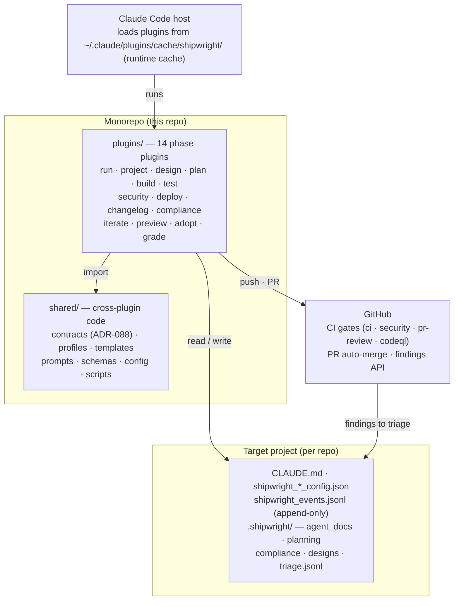

# Architecture — shipwright
<!-- shipwright:architecture v=2 last-sync=932e0d221ea1 -->

## System Overview

```mermaid
flowchart TB
  CC["Claude Code host<br/>loads plugins from ~/.claude/plugins/cache/shipwright/ (runtime cache)"]

  subgraph "Monorepo (this repo)"
    plugins["plugins/ — 14 phase plugins<br/>run · project · design · plan · build · test<br/>security · deploy · changelog · compliance<br/>iterate · preview · adopt · grade"]
    shared["shared/ — cross-plugin code<br/>contracts (ADR-088) · profiles · templates<br/>prompts · schemas · config · scripts"]
  end

  subgraph "Target project (per repo)"
    artifacts["CLAUDE.md · shipwright_*_config.json<br/>shipwright_events.jsonl (append-only)<br/>.shipwright/ — agent_docs · planning<br/>compliance · designs · triage.jsonl"]
  end

  gh["GitHub<br/>CI gates (ci · security · pr-review · codeql)<br/>PR auto-merge · findings API"]

  CC -->|runs| plugins
  plugins -->|import| shared
  plugins -->|read / write| artifacts
  plugins -->|push · PR| gh
  gh -->|findings to triage| artifacts
```

## Stack

| Layer | Technology | Notes |
|-------|-----------|-------|
| Frontend | — | — |
| Backend | — | — |
| Database | — | — |
| Auth | — | — |
| Runtime | python | — |

## Layers Detected

- **docs**: `docs`
- **infrastructure**: `scripts`
- **tests**: `Spec`, `integration-tests`

## Key Architecture Decisions

See `decision_log.md` for detailed ADRs. Profile-level decisions (stack, auth pattern, DB strategy, folder structure) are defined by the stack profile (`python-plugin-monorepo`).

## Data Flow

Shipwright is a monorepo of Claude Code plugins — one per SDLC phase — that
operate on a **target project** (this monorepo grades itself, so it is also its
own target). Work is never ad-hoc: each phase is a skill, and the phases
coordinate through four shared channels described below. This section documents
the steady-state data flow; per-change history lives in `## Architecture Updates`
and `decision_log.md`, not here.

### Plugins

**Layout.** Every phase is a plugin under `plugins/<phase>/` with the standard
Claude Code layout: `.claude-plugin/plugin.json`, `hooks/hooks.json`,
`skills/<phase>/SKILL.md`, `agents/` (subagent definitions), `scripts/`
(`checks`, `hooks`, `lib`, `tools`), `tests/`, and `pyproject.toml`. Cross-plugin
code lives under `shared/` (`scripts`, `contracts`, `profiles`, `templates`,
`prompts`, `config`, `schemas`).

**Cross-plugin imports.** `shared/contracts/` (ADR-088) is the *only* supported
entry point for one plugin to import another — the re-export facades
(`shared.contracts.compliance`, `shared.contracts.iterate`) shield consumers from
refactors of the underlying internals. Direct deep imports across plugins are a
convention violation.

**How phases communicate.** Four channels, all rooted in the target project:

- **iterate-2026-07-27-no-silent-revert** (2026-07-27): Component — new F11 check `verifiers/silent_revert.py` verifies the INTEGRATION, not just that it happened: per merge the branch made of the default branch, content the merged-in side gained over the common ancestor must still be in the tree, else the run STOPs. Scoped to `<default>..HEAD` (walking all history flagged 889 files on a clean merge); BEHIND is never accused; removal is legal once declared with a reason. → decision_log (Run-ID).
- **iterate-2026-07-27-review-floor-not-chained** (2026-07-27): Component — the external code review stops being chained behind the internal subagent (it fired "iff the internal fired", so one unavailable reviewer excused both) and becomes an independent route; `review_record_check` gains a medium+ FLOOR requiring at least one of `code`/`external_code` to be `completed`, since answering every type was bookkeeping, not review. `not_applicable` on both does not satisfy it. Narrows `close-missing` at medium+ (operator ruling); measured zero impact on 25 historical medium+ runs. → decision_log (Run-ID).
- **iterate-2026-07-27-merge-state-vocabulary** (2026-07-27): Component — the host's merge verdict becomes a CLOSED vocabulary in new `lib/_pr_blocker_causes.py` (split off `pr_blockers` for the 300-line ceiling, re-exported so import sites are unchanged): `DIRTY`/`BEHIND`/`DRAFT`/`BLOCKED`/`UNSTABLE` are named causes, `CLEAN`/`HAS_HOOKS` are fine, and anything else is `unknown` — a state GitHub adds later cannot read as clean. `blocking` is claimed only where the merge is structurally impossible. → decision_log (Run-ID).
- **iterate-2026-07-27-requirement-writeback-loop** (2026-07-27): Component — new shared requirement-impact declaration (`lib/requirement_impact*.py`, `lib/section_file_list.py`, `lib/git_name_status.py` + CLIs `record_requirement_impact` / `check_design_round_declarations` / `check_section_file_attribution`) ports iterate's spec-impact gate to the design feedback round and the build section; evidence is a section's own commit or, for a round with no commit, a per-round baseline under `.shipwright/planning/requirement-impact/`. → decision_log (Run-ID).
- **iterate-2026-07-19-one-discovery-function** (2026-07-19): Component - new shared leaf `lib/planning_discovery.py` is the SINGLE walk over `.shipwright/planning/`; all 15 discovery call sites across 6 import realms delegate to it, each passing the flags (`guard`/`sort`/`include_iterate`/`recursive`/`require`) reproducing its own behaviour, so the divergence is explicit in one place instead of invisible in fifteen. Byte-identical per the S1 golden corpus. `lib/adr_headers.py` split out of `drift_parsers` to hold its ceiling. -> decision_log (Run-ID).
- **`SHIPWRIGHT_SESSION_ID`** — one unified session id across every plugin in a
  run, so hooks and artifacts written by different phases correlate.
- **`shipwright_*_config.json`** — the per-phase config files written into the
  target project root (`shipwright_run_config.json` is authoritative for pipeline
  mode and step state; writes are atomic + path-lock-coordinated via
  `run_config_store.py`).
- **`shipwright_events.jsonl`** — an append-only, **per-tree, PR-committed**
  event log (`phase_started`/`phase_completed`/`phase_failed`, `work_completed`,
  `test_run`, `grade_snapshot`, …). It is the durable spine every producer reads
  from and every derived view (RTM, dashboard, campaign status, WebUI rails)
  reduces over. `resolve_events_path` returns `<project_root>/shipwright_events.jsonl`
  literally; the iterate's own event is recorded in its worktree and ships in the PR.
- **`hooks.json`** — the single source of truth for between-phase actions and
  quality gates. What fires when is documented in `docs/hooks-and-pipeline.md`.

**Pipeline mode.** `single_session` is the sole pipeline mode: one conversation
drives every phase as a subagent (the external per-phase-session engine was
removed). The orchestrator loop resolves each phase, claims it, runs the
phase-runner, and applies the result; `gate_catalog.json` + `lib/gate_policy.py`
decide which gates auto-answer vs. require approval vs. hard-stop.

**Decision & memory trail.** Architecture/convention memory is curated in
`.shipwright/agent_docs/` (`architecture.md`, `conventions.md`, canonical H3 ADRs
in `decision_log.md`). Iterates write run-id-keyed drops to
`.shipwright/agent_docs/decision-drops/`; `aggregate_decisions.py` folds them into
`decision_log.md` with sequential `ADR-NNN` at release. Per-iterate/per-phase
artifacts live under `.shipwright/planning/` and `.shipwright/compliance/`.

**Worktree isolation.** Every `/shipwright-iterate` run executes in its own git
worktree under `.worktrees/<slug>/` on branch `iterate/<slug>`, cut from
freshly-fetched `origin/<default>`. A leak-guard (`check_iterate_isolation.py`)
diffs the main tree against a per-run snapshot and fails closed on any write that
escapes the worktree.

**Runtime plugin cache.** Claude Code loads plugins at runtime from
`~/.claude/plugins/cache/shipwright/`, **not** from this repo. Plugin-side edits
(`plugins/*`, `shared/*`, any `SKILL.md`) reach runtime only after
`scripts/update-marketplace.sh`; `scripts/check_plugin_cache_sync.py` detects
drift. (End users consuming the published plugins do not need this step.)

The cache carries three trees and the check gates **all three**: the versioned
plugin dirs, `shared/` (reached as `{plugin_root}/../../shared`, home of the
F11 verifier every iterate runs), and the cross-plugin mirror
`cache/plugins/<name>/` (behind `{plugin_root}/../../plugins/shipwright-X`,
joined last — P2.29, superseding trg-5005bf57).

**Which version dir the `plugins` tree compares is the sync's answer, not a
second opinion:** both sides read `~/.claude/plugins/installed_plugins.json`,
so a surviving stale dir cannot make the sync report "up to date" while the
check reports drift (P2.06). The check falls back to the highest cached
version when that manifest is unreadable and records which rule it used as
`version_basis`. **The `plugins`/`shared` sides are established differently by
design:** the repo side is `git ls-files`, because the cache is copied from a
`git reset --hard origin/main` clone that holds exactly the tracked files; the
cache side is a filesystem walk minus build artefacts, because the cache is
not a git tree. `scripts/cache_tree_compare.py` holds the primitives and
`scripts/cache_sync_report.py` the rendering.

**The mirror tree has its own basis and verdict semantics** (`scripts/cache_mirror_compare.py`), not a
variant of the `plugins`/`shared` one. It once could not be gated at all:
`ensure_shared_cache` judged the whole mirror from one sentinel file, so a
gate built on it would have inherited that weakness (trg-7d1d8437). Since
`iterate-2026-08-01-cache-heal-per-plugin` the healer compares each mirror's
**file set** against its own repair source — the plugin's newest cached
version dir, never `installed_plugins.json` (the healer doesn't consult it) —
so the check judges the mirror by that same rule, independently of the
`plugins` tree's own version choice. Its `basis` is therefore always the
literal string `"cache"`, never `"git"` nor a `walk (...)` fallback: neither
side was ever a git tree, so unlike the other two trees there is no
git-vs-clone line-ending seam and nothing "degraded" to flag. The healer does
not make the check redundant: the healer detects **absence** (a file-set
diff, no hashing, so a repo checkout's line endings can never enter into it),
the check detects **staleness** (CRLF-normalized content hashes) — the same
hash function as the other two trees, reused for the drift-detection
contract, not because a mismatch between two cache-side copies is expected.

A zero is never read as agreement, on any of the three trees — neither an
empty `ls-files` listing nor a listing none of whose files can be read, nor an
empty/absent mirror source — and the verdict names which trees it covers
(`verified`), which it does not (`ungated` — empty now that all three are
gated, kept in the schema for stability), and how each was established
(`basis`).

**Secrets.** Secrets live exclusively in `<project_root>/.env.local`, scaffolded
by `/shipwright-adopt` (ADR-021) and read by
`shared/scripts/lib/env.py::load_shipwright_env` — the framework external-review
keys (`OPENROUTER_API_KEY`, `OPENAI_API_KEY`) plus the active
profile's `required_env_vars`. The file is git-ignored before write; a
`.gitignore` enforcement failure aborts the scaffold.

### GitHub

GitHub is both a **gate** (CI must be green to merge) and a **findings source**
(alerts and failed runs flow back into the local backlog). Both directions are
wired into the pipeline.

**CI gates (`.github/workflows/`).** The Required Checks that gate merge to
`main`:

- `ci.yml` — the hard lint gate (`uvx ruff@0.15.15 check .`, no `|| true`) + the
  Python test suites + the **diff-coverage gate** (`.github/actions/diff-coverage-gate`;
  <80% of changed lines vs `origin/main` fails closed).
- `security.yml` — the scanner chain (Semgrep/Trivy/gitleaks) → `findings.json`
  + SARIF; the critical-gate fails **closed** on a degraded or critical scan.
- `pr-review.yml` — the Tier-3 external-LLM PR review; it is the 6th Required
  Check in the auto-merge (B4.5) design and runs only for external-contributor,
  sensitive-path (`plugins/*/{hooks,skills,agents}/`, `.github/workflows/`), or
  `needs-review`-labelled PRs (Tier 1/2 stay green via a skipped `needs:` job).
- `codeql.yml` (code scanning), `bloat-check.yml` (anti-ratchet file-size
  regression), `grade-empirical.yml` (Control-Grade projector suite).

**Findings → Triage Inbox.** A single throttled `SessionStart` hook
(`import_github_findings.py`, registered once in shipwright-iterate) pulls three
GitHub sources via the `gh` CLI and emits them as `source="github"` triage
action-units (dedup-keyed, auto-resolve scoped so a failed fetch never
mass-resolves):

- code-scanning / Dependabot / secret-scanning alerts + the latest failed
  default-branch CI run per workflow (`github_api.py`, `github_triage/`). A CI
  unit is emitted only for a workflow the repo still has: the runs feed reports
  what a workflow *did*, never what it *is*, so the lifecycle state is read per
  failing workflow from `actions/workflows/{id}` (`github_workflow_api.py`) and
  a `deleted` one is dropped. An unestablished state keeps the finding —
  over-filtering here would hide real CI breakage.
- `gh-security:{owner}/{repo}` — when GHAS Code Scanning is unavailable (typical
  on private repos), it falls back to the `security.yml` `security-scan-results`
  artifact (freshness-gated), parsing `findings.json`/SARIF directly.
- `gh-pr-ci:{pr}` — failed hard-gates on an **open** PR, so an armed auto-merge
  can't sit waiting on a red PR unnoticed (`github_pr_api.py`).

**Findings sink.** All producers append to `<project_root>/.shipwright/triage.jsonl`
(git-tracked, per-tree, append-only) via
`triage.py::append_triage_item_idempotent`. A gitignored per-tree **outbox** +
sweep-to-PR-branch mechanism ensures appends made off the main tree still reach
origin. Consumers regenerate `triage_inbox.md` and the Command Center WebUI
Triage tab; `refresh_ci_security.py` folds the latest `security.yml` findings into
a tracked `.shipwright/compliance/ci-security.json` that lights the compliance
dashboard's CI-Security section and the Control-Grade Security dimension.

**Delivery.** With all Required Checks green (and GHAS review threads resolved), iterate
F11 brings the branch current through `integrate_main` and hands the PR to
`deliver_pr.py`, the capability ladder: it confirms the PR is this run's, arms
`gh pr merge --auto --squash`, and — where the host structurally *cannot* arm, i.e. the
base branch is unprotected — waits for green, refreshes, verifies the head that will
merge and merges it pinned to that commit. "Delivered" means merged + green either way (no
shoot-and-forget). `watch_pr_delivery.py` remains the read-only diagnostic.

## See also

_Existing user-facing documentation discovered by /shipwright-adopt._

- [`README.md`](../../README.md)
- [`docs/guide.md`](../../docs/guide.md)

## Architecture Updates

> **One line per change** — always-loaded Layer-1 context, so every line costs tokens on every future iterate. Format: `- **<run_id|ADR-NNN>** (YYYY-MM-DD): <Impact> — <one sentence: what + key surface>. → decision_log (Run-ID/ADR)`. **Budget ≤ 600 chars; detail goes in the ADR / `.shipwright/planning/adr/`, not here.** Enforced repo-agnostically (incl. adopted repos) by the F11 verifier + `shared/scripts/tools/check_agent_doc_budget.py` (SSoT `lib.agent_doc_budget`); see `references/F2.md`. Bullet **shape** (a `run_id`|`ADR-NNN` anchor, an `<Impact> —` lead, and a `→` pointer — no `Campaign`/`sub_iterate`/free-text) is enforced from 2026-06-28 by `check_agent_doc_shape` (SSoT `lib.agent_doc_shape`); the release aggregator writes no duplicate `ADR-NNN` bullet — the run_id line is the single canonical entry. Full verbatim prose for compacted entries lives in [`../planning/adr/_archive-agent-doc-updates.md`](../planning/adr/_archive-agent-doc-updates.md). Routing (`lib.architecture_doc.IMPACT_TARGETS`): `convention`-impact → [`conventions.md`](conventions.md) `## Convention Updates`; only `component` / `data-flow` live here.
- **iterate-2026-08-09-timing-coverage** (2026-08-09): Data-flow — iterate throughput derives wall time from the durable scope→F5b boundary, reports instrumented coverage separately, and retains implausible agent intervals as unavailable evidence excluded from rollups. → decision_log (Run-ID).
- **iterate-2026-08-08-triage-amend-event** (2026-08-08): Data-flow — the triage store gains a third append-only event kind, `amend` (corrects `title`/`detail`/`severity`/`kind` in place, folded into `read_all_items`'s existing `(ts, file-order)` pass), which every store consumer must now recognize: `triage_integrity`, `triage_validate`+`triage_gc_core`, `sweep_quarantine`, `sweep_drift_events`, `triage_cli`. → decision_log (Run-ID).
- **iterate-2026-08-08-track-decision-drops** (2026-08-08): Data-flow — `.shipwright/agent_docs/decision-drops/` is now git-tracked (not gitignored) across this repo, its shared gitignore template, and shipwright-webui; the write path redirects from the main repo's disk to the calling iterate's own worktree (supersedes ADR-050), with a legacy-drop quarantine (`lib/decision_drop_legacy.py`, keyed on file mtime) moving pre-cutoff drops aside rather than aggregating them. → decision_log (Run-ID).
- **iterate-2026-08-07-events-context-backfill-keys** (2026-08-07): Data-flow — `event_context_index.build_index()` gains git history as a new read surface: `shared/scripts/lib/commit_trailers.py` backfills empty `commit`/`changed_files` from a commit's `Run-ID:` trailer (two `git log` walks, cache re-validated against a re-resolved base-ref sha), replacing `extraction` with per-field `derived`/`declared`/`unavailable` provenance + a `coverage` envelope. → decision_log (Run-ID).
- **iterate-2026-08-07-run-id-lifecycle-fixes** (2026-08-08): Component — new `lib/run_pointer_retirement.py` (F11 unlinks a matched-`run_id` pointer on delivered/closed) and new `lib/phase_quality/_staleness.py` + `_worktree_identity.py` (stale-verdict re-audit + gitdir-chain worktree identity, redirecting the Stop hook's audit root via a verified pointer). → decision_log (Run-ID).
- **iterate-2026-08-07-agent-model-tiers** (2026-08-07): Data-flow — iterate and build now read a new optional `shipwright_model_config.json` (schema `model_config.schema.json`) at Planned-Run-Summary/§G time via `resolve_model_tier.py`, resolving per-role (`review`/`finalization`/`execution`) model tiers passed to the 6 in-scope Agent-tool spawns; unset stays bit-identical to today (no `model` param). → decision_log (Run-ID).
- **iterate-2026-08-08-coverage-envelope-split** (2026-08-08): Data-flow — `event_context_index.build_index()`'s `coverage.fields.<key>` envelope splits `unavailable` into `not_applicable`/`missing` (data-derived eligibility, new `lib/event_context_coverage.py`), adding `coverage.missing_work_completed`; `INDEX_SCHEMA_VERSION` 2→3. → decision_log (Run-ID).
- **iterate-2026-08-07-context-cost-meter** (2026-08-07): Component — new Stop hook `track_context_cost.py` (shared, registered on shipwright-build) recomputes each session transcript into priced, phase-tagged cost (`context_cost_core.py` + `model_pricing.py`, dedup by requestId), overwriting a new per-session file `.shipwright/compliance/context-cost/<session_id>.json`; folded into `work_completed` at F5b, offered as opt-in `estimate_context_pressure.py --source context-cost`. → decision_log (Run-ID).
- **iterate-2026-08-06-triage-backlog-outbox-routing** (2026-08-06): Component — `tools/ensure_current.py` becomes a WRITER of the tracked triage store: new `_absorb_dirty_triage_log` commits a dirty `.shipwright/triage.jsonl` (path-scoped, never `-A`) before EVERY merge attempt including the already-current path, so a background producer's uncommitted append can no longer make `git merge` refuse outright. Guarded by `lib.main_tree_guards.op_in_progress`, content-validated before staging, index reset on commit failure. → decision_log (Run-ID).
- **iterate-2026-08-06-gc-decode-parity** (2026-08-06): Component — `lib/git_base` gains `run_git_bytes_soft` (raw bytes, sharing `run_git`'s new `_popen_git` core so the timeout kill/reap is one implementation), and `lib/sweep_text.decode_store_text` becomes the triage store's single decode rule for BOTH sides of the blob-vs-file seam. The three readers (`sweep_gc`, `sweep_drift`, `reconcile_triage`) take bytes and apply it; `run_git`'s own `errors="replace"` is unchanged for its other callers. Closes trg-94d3cb73. → decision_log (Run-ID).
- **iterate-2026-08-06-triage-store-write-path** (2026-08-06): Component — the tracked triage store's write path stops disabling delivery silently: new shared leaves `triage_dedup` (a same-id append drops only on a matching `originalTs`, else both are kept), `triage_gc_core` + `triage_gc_publish` (durable writes, a divergence warning, a guarded `--commit`), `main_tree_guards`, `reconcile_rollback`, and `sweep_drift_restore`, which renames the live log aside into a new gitignored `.shipwright/triage.jsonl.salvage-*` before `git checkout` recreates it. → decision_log (Run-ID).
- **iterate-2026-08-06-resolve-run-id-seam** (2026-08-06): Data-flow — the Stop-time audits' `run_id` gains a priority-0 source, the per-session iterate run pointer `.shipwright/iterate_active/<session_id>.json`, read from the MAIN tree by new `shared/scripts/lib/phase_quality/_run_id.py` (`resolve_run_id` moved off `_resolution.py` at its 300-LOC cap, re-exported). Honoured only on payload-session match + live worktree + non-sentinel id; any bad pointer falls through to the old chain. Audits become run-attributable. → decision_log (Run-ID).
- **iterate-2026-08-06-parallel-global-state-tests** (2026-08-06): Component — the SessionStart cache-repair barrier stops reading "no second observer within `_FANOUT_PROBE_SECONDS` (0.1s)" as "no fan-out exists"; `await_fanout_observers` now waits while peers are still ARRIVING (grace 1.0 / idle 1.0 / entry-anchored ceiling 3.0, clamped polling, identity-tracked progress). Under load the owner published at 0.106s with 1/12 observed and eleven stragglers re-elected via `.next`, each repeating the full cache scan. → decision_log (Run-ID).
- **iterate-2026-08-06-write-lock-primitives** (2026-08-06): Component — the shared write/lock primitives split their platform halves into new leaves `lib/durable_publish.py` (POSIX mode carried onto the temp fd before its fsync; Windows sharing-violation codes) and `lib/file_lock_registry.py` (pid-guarded lock ownership in a `sys.modules`-anchored state, giving `FileLock` a bounded wait + same-thread reentrancy). `shared_lib_loader`'s fallback now loads into a private PACKAGE, so a lib module may hold intra-package imports. → decision_log (Run-ID).
- **iterate-2026-08-06-p2-19c-corruption-absence** (2026-08-06): Component — the triage store reader gains two leaves, `lib/triage_integrity` (record predicate + corruption) and the pure-stdlib `lib/triage_delivery` (has a decision reached a branch); record-boundary recovery is now bidirectional but gated on a caller predicate and fails closed without one. → decision_log (Run-ID).
- **iterate-2026-08-05-inline-suppression-ratchet** (2026-08-05): Component — inline `# nosemgrep` suppressions get their own anti-ratchet instead of an accepted-risk register `target`: new shared leaf trio `inline_suppression_scan` / `inline_suppression_baseline` / `inline_suppressions` over repo-root `shipwright_inline_suppressions.json` (per-rule `max_sites` + `rationale_ref`), bound by a `shared/tests` live guard and rendered by `lib/inline_suppression_view.py`. A reconciler would have to mirror Semgrep and drift; a count degrades safely. → decision_log (Run-ID).
- **iterate-2026-08-05-wire-local-guard-scripts** (2026-08-05): Component — two built-but-uninvoked checkers gain callers: `scripts/verify_local.py` becomes an F0 step (marker-guarded, both shells), and `check_required_checks.py` becomes a throttled SessionStart producer via new `shared/scripts/hooks/check_required_checks_hook.py` + `required_checks_state.py` (new write-surface `.shipwright/required_checks_state.json`, tracking outcome apart from attempt). → decision_log (Run-ID).
- **iterate-2026-08-05-llm-review-gateway-route** (2026-08-05): Component — new `shared/scripts/lib/external_review_gateway.py` adds a 4th, operator-owned `gateway` route to `lib/llm_review.py`, alongside openrouter/direct/none, config under `SHIPWRIGHT_REVIEW_GATEWAY_*`. Fail-closed and exclusive once configured; no model-identity lock, no ZDR check by design. New `model-1`/`model-2` pair registered in `review_verdict.GATEWAY_REVIEWERS`. Scoped to Adopt's Layer-3 review + `review_assistant_ui_plan.py`; `external_review.py` untouched. → decision_log (Run-ID).
- **iterate-2026-08-05-mirror-tree-drift-basis** (2026-08-05): Component — `check_plugin_cache_sync` gates the cross-plugin mirror `cache/plugins/<name>/` (P2.29, supersedes trg-5005bf57) now that `ensure_shared_cache` validates each mirror against its repair source. New leaf `scripts/cache_mirror_compare.py`: basis is always `"cache"`, source is each plugin's newest cached version, never `installed_plugins.json` — the healer doesn't consult it either. `ungated` is now empty; healer detects ABSENCE (file sets), this detects STALENESS (CRLF-hashes). → decision_log (Run-ID).
- **iterate-2026-08-05-risk-recheck-recording-integrity** (2026-08-05): Component — new per-run artifact `risk_recheck.json` (beside `ci_supplychain_ack.json`) where Step 3.4 persists its computed `effective_complexity`, plus F11 verifier `check_risk_recheck_recorded` (registered in `run_all_checks`), FAILing when the F5c-recorded complexity is outranked by it. Campaign-only by absence (SKIP). Closes the gap where nothing checked F5c honored what Step 3.4 computed. → decision_log (Run-ID).
- **iterate-2026-08-03-p2-33-deepseek-zdr-review** (2026-08-04): Data-flow — external review binds DeepSeek V4 Pro to a fail-closed configurable US/EU ZDR allowlist while GPT stays fixed; current writers use DeepSeek/OpenAI and readers retain historical Gemini/OpenAI compatibility. → decision_log.md (ADR via Run-ID: iterate-2026-08-03-p2-33-deepseek-zdr-review)
- **iterate-2026-08-04-p1-15-events-context** (2026-08-04): Data-flow — Iterate now queries bounded untrusted event bundles after Repo Scout through one cross-phase area catalog and a disposable raw-log index; compact is normal, shadow diagnostic, and full explicit. → decision_log.md (ADR via Run-ID: iterate-2026-08-04-p1-15-events-context)
- **iterate-2026-08-02-ensure-shared-cache-fanout** (2026-08-02): Data-flow — each plugin has one SessionStart wrapper that joins the 12-process healer election, runs all targets in order under one reader lease, and emits one JSON context. This removes the standalone/guard identity gap for repeated payloads. Claim, completion, and lock descriptors are single-link/path-identity checked before use; foreign restore sources cannot publish readiness. → decision_log.md (ADR via Run-ID: iterate-2026-08-02-ensure-shared-cache-fanout)
- **iterate-2026-08-03-preserve-test-evidence** (2026-08-03): Data-flow — F5c installs exact current-run test-result bytes before its compact summary, while F11 requires the run-named artifact in the commit and the mutable root stays excluded. → decision_log (Run-ID).
- **iterate-2026-08-01-triage-defer-lifecycle** (2026-08-03): Data-flow — triage park events gain mandatory revisit dates; the resolved tracked+outbox view derives UTC expiry and exposes contract v2 consistently to CLI, Markdown, and downstream WebUI consumers. → decision_log.md (ADR via Run-ID: iterate-2026-08-01-triage-defer-lifecycle)
- **iterate-2026-08-01-llm-review-truncation-guard** (2026-08-01): Historical data-flow — the former Gemini/OpenAI paths shared a 16000-token output budget, a Gemini-only reasoning cap, a 240s timeout, and the same finish-reason classifier. P2.33 later removed the Gemini arm and its direct-call cap while preserving the provider-neutral truncation/degraded classifier. → decision_log (Run-ID).
- **iterate-2026-08-01-ci-card-deleted-workflow** (2026-08-02): Data-flow — latest failed CI runs are enriched from `actions/workflows/{id}`; only authoritative `deleted` states are filtered, unknown states remain fail-open, and lookups cap at 20. → decision_log (Run-ID).
- **iterate-2026-08-01-cache-heal-per-plugin** (2026-08-01): Component — the SessionStart cache healer stops judging a tree by one sentinel file: `ensure_shared_cache` compares each tree's delivered FILE SET against its repair source via a tri-state, copytree-equivalent walk sharing copytree's own ignore callable, so a partial reap is repaired, not read as healthy. `_plugins_healthy` and the combined early return are gone; only the same-name clone judges completeness; a symlinked mirror is never written through. Presence, never content. Re-vendored to 12 plugins. → decision_log (Run-ID).
- **iterate-2026-07-31-review-record-spec-promotion** (2026-08-01): Component — `spec` becomes an ordinary sixth `reviews` key now the webui renders unknown types (`ce21323e`), retiring the `gates` seam as a WRITE destination; new `lib/review_record_legacy.py` owns the permanent READ fallback (`reviews` → `gates`) and supersedes a still-pending legacy row, so 65 immutable records stay valid. `SCHEMA_VERSION` stays 1. The Stage-1 guard re-keys off "`spec` absent from BOTH sections" — on `gates` it would have died silently. → decision_log (Run-ID).
- **iterate-2026-08-01-cache-contract-single-source** (2026-08-01): Component — the cache check stops resolving the plugin version dir independently of the sync: both now read `installed_plugins.json`, so a surviving stale dir can no longer make `update-marketplace.sh` report "up to date" while `--strict` reports every file missing (P2.06). New leaf `scripts/cache_install_resolve.py`; records `version_basis` per plugin and names a fallback on BOTH the ok and drift lines. → decision_log (Run-ID).
- **iterate-2026-08-01-cache-sync-shared-tree** (2026-08-01): Component — `check_plugin_cache_sync` gains the cached `shared/` tree (1005 files, incl. the F11 verifier modules) and stops guessing what belongs in a tree: the repo side is `git ls-files` (the cache is a clone of exactly the tracked files), the cache side keeps the walk. New leaves `scripts/cache_tree_compare.py` + `scripts/cache_sync_report.py`; the verdict carries `verified`/`ungated`/`basis` and never reads a zero as agreement. Mirror stays ungated (trg-7d1d8437). → decision_log (Run-ID).
- **iterate-2026-07-31-it1-s2-expected-status** (2026-07-31): Component — `triage.mark_status` gains keyword-only `expected_status`, checked against the resolved status INSIDE the lock it already held, so a background producer cannot overwrite a decision a person recorded between its unlocked read and its write (trg-93ceb2b0); a mismatch raises new public `StatusPreconditionError` having written nothing, and the call now RETURNS the status it replaced. All nine automatic flip sites and both operator-CLI ones pass it and report a miss as kept, never resolved. → decision_log (Run-ID).
- **iterate-2026-07-31-derived-docs-at-release** (2026-07-31): Data-flow — the seven `.shipwright/compliance/` documents stop being frozen on the default branch: the release stages them (changelog Step 5.5, explicit pathspec, verified from the COMMIT not the index) and `/shipwright-compliance --refresh-pr` opens a documents-only PR in between — no credential with write access anywhere. New `lib/compliance_refresh.py` (declared per-path classification, unclassified fails a test) + four `tools/compliance_*` modules; `source_state` gains `base=`/`release=`. → decision_log (Run-ID).
- **iterate-2026-07-31-triage-store-failsafe** (2026-07-31): Component — the triage store's git calls route through new `lib/git_base.run_git_soft` (timeout REPORTED as rc 124, not raised), so each call under the canonical lock takes a per-site fail-safe direction instead of killing git and stranding `.git/index.lock` — in `reconcile_triage`/`sweep_drift`, the operator's MAIN tree. New leaves `lib/ci_env.py` (ONE `$CI` predicate, was four; CI routes cards to the TRACKED store) and `lib/sweep_drift_events.py`. GC survivors come from a RE-READ after the commit window. → decision_log (Run-ID).
- **iterate-2026-07-31-f11-delivery-truth** (2026-07-31): Component — F11's delivery becomes a capability ladder over one bar (`MERGED` + every check green): new `lib/pr_readiness.py` (five states; an unrecognised merge state is never green), `lib/pr_delivery.py` (arm classification from `allow_auto_merge` + the base's `protected`, identity, exit codes 6/7), `lib/pr_delivery_host.py` (one `Host` bundle, every child timed out), `lib/pr_self_merge.py` (wait → refresh → verify → pinned merge) and `tools/deliver_pr.py`. Self-merge only on an UNPROTECTED base. → decision_log (Run-ID).
- **iterate-2026-07-28-f11-verifies-own-run** (2026-07-28): Component — every F11 reader of `iterate_latest` asks whose run wrote it via new `verifiers/_iterate_latest.py` (typed `current|foreign|unattributed|malformed|missing`), since the F11 integration rewinds that derived snapshot to HEAD; the durable home is the per-run F5c entry. Stage 1 gains a row in a sibling `gates` object — not a sixth `reviews` key, which the pinned webui reader rejects. New `silent_revert_declarations.py` + `review_record_floor.py`; `churn_merge.is_derived_churn` is the one "derived". → decision_log (Run-ID).
- **iterate-2026-07-28-ci-ack-per-run-home** (2026-07-29): Component — the CI supply-chain ack moves off the derived `shipwright_test_results.json` to `.shipwright/planning/iterate/<run_id>/ci_supplychain_ack.json` (F6 stages the dir), ending a deadlock between two ERROR gates; new `verifiers/ci_supplychain_ack_store.py` (location + source precedence, first PRESENT source terminal) and `verifiers/git_blob_read.py` (blob-OID reads, absent-vs-broken, byte fingerprint) — the latter closing a measured false-green where a non-ASCII CI filename voided the content binding. → decision_log (Run-ID)
- **iterate-2026-07-28-grade-snapshot-honest-subject** (2026-07-28): Data-flow — `grade_snapshot` attribution stops lying about its own subject: a NAMED non-default branch is `lineage=branch` by name, ancestry only decides a detached HEAD (a worktree at the fork point emitted at F5b was stamped `main` over an uncommitted change set). `record_event`'s `event_amended --fields` now refuses the attribution keys — `apply_amendments`' blind merge was an open assertion channel. Consumer contract restated: a branch snapshot is not a point on the default branch's trend. → decision_log (Run-ID).
- **iterate-2026-07-28-grade-snapshot-lineage** (2026-07-28): Data-flow — `grade_snapshot` gains `lineage` (`main|branch|unknown`) + `branch` + `base` (merge-base with the default branch), so union-merged snapshots from many worktrees stop reading as one trend; new top-level `scripts/tree_lineage.py` (git facts, ADR-045 seam) + `scripts/grade_snapshot_shape.py` (ONE wire-shape owner for the compliance emitter and the `record_event` CLI, ratcheting it 769→767). Attribution is derived, never assertable; an ABSENT `lineage` means pre-attribution. → decision_log (Run-ID).
- **iterate-2026-07-27-changelog-aggregator-idempotency** (2026-07-27): Component — the two changelog writers stop carrying separate section predicates: new top-level `shared/scripts/changelog_sections.py` + `changelog_splice.py` (insert/replace/refuse), outside `lib/` per ADR-045, reached by the plugin writer via a lazy path-load so a missing `shared/` breaks only the splice. The release aggregator gains same-version replace — only when the recorded body is what the drops render and the heading carries no marking a re-render would erase; else it refuses untouched. → decision_log (Run-ID).
- **iterate-2026-07-27-security-coverage-manifest** (2026-07-27): Component — a scan writes an additive `coverage` row per weakness class (`covered|degraded|not_requested|not_available`) into `findings.json` + `latest.json`, DERIVED (never backend-populated) by new security `lib/scan_coverage.py`, so a machine missing a scanner can no longer report clean for a class nothing examined; an absent manifest renders `coverage not reported`, kept distinct from `incomplete`. A file-sourced manifest is UNTRUSTED: `lib/coverage_sanitize.py` normalizes it at the boundary. → decision_log (Run-ID)
- **iterate-2026-07-27-run-unit-parallel-race** (2026-07-27): Component — `os.replace` is atomic on Windows only when it SUCCEEDS, so a concurrent reader cost a writer its write and a concurrent writer cost a reader its read (delete-pending). `lib/atomic_write.py` gains a bounded sharing-violation retry on both sides — new `durable_read_text` alongside `durable_atomic_write`, wired into the three run-config readers — with a SHORT write budget (a patient writer can publish stale data) and a LONGER read budget (a patient reader only costs latency). → decision_log (Run-ID).
- **iterate-2026-07-27-c3-phase-content-key** (2026-07-27): Component — the phase-canon C3 twin joins its F11 sibling in `verifiers/handoff_freshness.py` and stops reading mtime: it asks whether the handoff's canon marker names the run being verified. Keyed on the RUN, not the marker's phase — `verify_phase --phase all` gives eight dispatchers one handoff, so a phase key would warn on seven; `C3_CANON_PHASES` skips the three phases with no producer, and `run_canon_checks` gains the run id. → decision_log (Run-ID).
- **iterate-2026-07-27-name-the-blocker** (2026-07-27): Component — three finalization checks stop reporting less than they hold. New `lib/pr_blockers.py` names why a PR will not merge, from `mergeStateStatus` (fetched but never read), review threads and branch rules — an unreadable source stays explicit, never clean. New `lib/canon_frontmatter.py` is the ONE parser the Stop hook and new `verifiers/handoff_freshness.py` share: freshness means "names this run", not mtime. New `verifiers/_layer_coverage_ac.py` reads criteria from git, making a FOLDED criterion visible. → decision_log (Run-ID).
- **iterate-2026-07-27-disclose-audit-last-run** (2026-07-27): Data-flow — the detective audit records its completed run into the tracked `shipwright_compliance_config.json` (`last_audit` + `last_full_audit`, atomic RMW, fail-soft); new `lib/audit_disclosure.py` (the fact; absent/valid/invalid + full-vs-partial) + `lib/_audit_disclosure_render.py` (header note + the AR-03 section, off the gitignored transient) light one collect-once `ComplianceData.audit_freshness_note` rendered by all five evidence documents, which the compliance phase now regenerates. → decision_log (Run-ID).
- **iterate-2026-07-27-rollback-uses-target-ref** (2026-07-27): Data-flow — deploy profiles become a RUNTIME input, not declarative reference only: new shared `deploy_profile.py` (bare-imported per ADR-045) is the ONE reader of `smoke_test.poll_interval_seconds`/`max_wait_seconds` (the liveness check now polls to the target's own deadline instead of asking once) and of `rollback.data_rollback_strategy` (which the new stored-data gate names when it refuses); Jelastic rollback pins the ref via `vcs/editproject` + read-back around `vcs/update`. → decision_log (Run-ID).
- **iterate-2026-07-27-f0-race-triage** (2026-07-27): Component — the F0 suite runner became a triage PRODUCER: a unit red in parallel and GREEN on its authoritative alone re-run is written to the tracked `.shipwright/triage.jsonl` (`source=f0-suite`, `f0-race:<unit-id>`, never auto-closed) by new `tools/suite_race_triage.py`, with all operator text — console block AND card — composed in new `tools/suite_report.py` so the two cannot drift; an observed race that could not be recorded exits 3. → decision_log (Run-ID).
- **iterate-2026-07-27-security-scope-and-parity** (2026-07-28): Component — three consumers now DECIDE from Part 1's coverage manifest: the local secret scan EXTENDS a project's own `.gitleaks.toml` instead of substituting a generated one (new `lib/gitleaks_config.py`, which forces `secrets` `degraded` when that file brings no rules), new `lib/scan_compare.py` + `tools/compare_scans.py` derive resolved/new/persisting ONLY over classes both runs covered, and new `lib/security_card.py` emits one `security-scan:{repo}` card feeding a mandatory SKILL Step 2.5 scope gate. → decision_log (Run-ID).
- **iterate-2026-07-27-artifact-state-stamping** (2026-07-27): Component — new shared `scripts/source_state.py` (top-level per ADR-045) owns ONE artifact-state stamp shape (run id primary — a commit SHA cannot exist pre-F6 — plus supplementary commit/dirty), used by two producers: new `tools/stamp_test_results.py` writes a top-level `source_state` block into the test-results record, and compliance's new `lib/_provenance.py` gives the 5 evidence renderers a `Source-State:` line, off ONE work event. Group E normalises it away, so it discloses without gating. → decision_log (Run-ID).
- **iterate-2026-07-27-triage-defer-review-followup** (2026-07-27): Component — every `triage_cli.py list` row now declares its kind with an `[open]`/`[deferred]` token at a FIXED position (a searched-for marker was forgeable by `source`/`dedupKey`, both host-supplied), one-line fields in both blocks clip at 120 like the sibling renderer, and new `tty_sanitize.is_visually_empty` decides the `(no reason recorded)` fallback by Unicode property instead of truthiness — a zero-width or whitespace-only reason rendered blank. → decision_log (Run-ID).
- **iterate-2026-07-27-triage-defer-ci-cap** (2026-07-27): Component — the third triage decision reaches the terminal: `triage_cli.py defer` dispatches through the same `triage_promote` helper the Command Center is pinned against (new `_decide_from_triage` backs both dismiss and defer), the listing gains a deferred section while `list --json` stays open-only, and rendering moves to new `lib/triage_render.py` whose scalar fields use a new inline sanitizer so a stored newline cannot forge a row; `mappers.ci_action_unit` gains its siblings' 1024-char detail cap. → decision_log (Run-ID).
- **iterate-2026-07-27-project-granularity-basis** (2026-07-27): Component — new advisory Group I check `I6` (FR with no acceptance criteria) reads the converged AC shapes both generators emit via new pure `audit/group_i_criteria.py`, judged per spec file so a shared id cannot mask a gap; the row scanner moves to `audit/group_i_rows.py` (pure move, re-exported, corpus registry repointed). `fr-authoring.md` gains §3a requirement-granularity, and `Basis: assumed` now obliges naming what would settle it — as a criterion, never in the cell. → decision_log (Run-ID).
- **iterate-2026-07-23-tests-skipped-tracking** (2026-07-23): Component — new shared SSOT `shared/scripts/tests_block.py` (`validate_tests_block`/`skip_suffix`/`progression_result`, top-level per ADR-045) gives the record_event write-guard, the D4 detective, the test-evidence renderer and the build dashboard one `isinstance(int)` skip predicate + `total-passed-skipped` failure arithmetic; work_completed events gain a first-class `tests.skipped` and D4 is re-enabled (bloat exception ADR-111). → decision_log (Run-ID).
- **iterate-2026-07-20-converge-table-shape** (2026-07-20): Data-flow — both FR-table producers emit ONE shape `| ID | Area | Name | Priority | Description | Basis | Layers |` from `lib/fr_table_shape.py`, which also owns the `(inferred)` marker the compliance parser imports (one grammar, both directions); `Basis` (closed vocabulary `lib/fr_basis.py`, enforced by new Group I5) replaces the `Source` path, `Area` renders from the id's group digit and is never stored, and machine-emitted `Layers` cells are marked so provenance stays advisory. → decision_log (Run-ID).
- **iterate-2026-07-20-namespace-from-requirement-id** (2026-07-20): Data-flow — the traceability manifest (schema 2→3) keys requirements by a namespace DERIVED from the FR id (`01::FR-01.03`) instead of the spec's directory (`01-adopted::FR-01.03`), so a split rename no longer rewrites every key; `Requirement.namespace` is a read-only property, and two ACTIVE rows claiming one key fail regeneration closed (a tombstone is exempt and never displaces the live node). → decision_log (Run-ID).
- **iterate-2026-07-18-fr-fold-map-resolution** (2026-07-18): Component — new shared contract `lib/fr_fold_map.py` (+ `_fr_fold_map_parse`) parses a spec's `## FR-Fold-Map` alias table and resolves a tagged FR id to its surviving capability FR; consumed by BOTH the compliance `test_links` collector (via `_test_links_fold`) and the shared backfill engine, so a granular `@covers` tag survives a taxonomy fold instead of orphaning. Resolution is fallback-only; retirement beats folding; broken edges fail closed into the manifest's new optional `fold_map`/`fold_defects`. → decision_log (Run-ID).
- **iterate-2026-07-17-arch-doc-refresh-harden** (2026-07-17): Component — new `lib/agent_doc_shape.py` SSoT + repo-agnostic CLI/F11 verifier `check_agent_doc_shape` enforce the canonical changelog-bullet grammar (`run_id|ADR-NNN` anchor + `<Impact> —` + `→ decision_log`) on the two `…Updates` sections; the release aggregator stops appending a dup `ADR-NNN` bullet when the F2 run_id bullet exists (section-scoped `run_id_documented_for_impact`); `_append_architecture_update` canonicalized; System-Overview mermaid + Data-Flow (Plugins/GitHub) refreshed. → decision_log (Run-ID)
- **iterate-2026-07-15-shared-backfill-engine** (2026-07-16): Component — new shared retrofit engine `tools/backfill_test_links.py` (+ `_lib` legs `backfill_scan/signals/write/llm`) that maps a repo's existing tests to FRs deterministic-first (path-token/unique-split/introducing-commit), LLM-assisted-second (opt-in, advisory-only, R4-bounded payload). Auto-writes only a deterministic single-FR match; lists proposals; surfaces `confirmed`/`possible`/`unmapped` orphans, never auto-deleting. Its `@FR` tags feed the TT1 manifest; shared by adopt (TT7) + retrofit (TT8). → decision_log (Run-ID).
- **iterate-2026-07-15-removal-crosslayer-gates** (2026-07-16): Component — two ENFORCING F11 traceability gates in shared `tools/verifiers` (`run_all_checks`): `removal_coverage` (a removed FR's base-linked tests must be deleted/retargeted, else HARD) and `cross_layer_coverage` (a behaviour-changed FR needs an executed-passing test at each required_layer). Both REGENERATE base+head manifests + the evidence index from staged reports (R3, never the committed artifact); + shared emit-side `lib/evidence_drop.py`. → decision_log (Run-ID).
- **iterate-2026-07-15-layer-aware-rtm-and-gates** (2026-07-16): Component — the RTM renders per-FR `Unit | Integration | E2E` coverage from the TT1 manifest; Group-D gains `D-orphan` (a test tagged with a removed/absent FR) + `D-layer` (an active FR missing an executed-passing test at a required layer; explicit FAIL / legacy advisory, fan-out fail-closed) in new `_group_d_traceability.py`; D1 hardened (a tested event AND, for explicit FRs, a real manifest link). New `_rtm_layer_columns.py` sibling keeps the capped rtm_generator/group_d net-neutral. → decision_log (Run-ID).
- **iterate-2026-07-15-contracts-and-harness** (2026-07-15): Component — froze the requirement→test traceability contracts (P1 prereq, DORMANT until a collector/gate wires them): new compliance `lib/traceability_schema.json` (manifest v2 Draft 2020-12, structurally enforcing skipped≠covered + removed⟹orphan + required-layer coverage) + shared `lib/requirement_model.py` + `lib/fr_tag_grammar.py` (@FR tag reference parser) + a panel-verified answer-key fixture package under compliance `tests/fixtures/traceability/`. → decision_log (Run-ID).
- **iterate-2026-07-14-remove-multi-session** (2026-07-14): Component — `single_session` is the SOLE pipeline mode; the external per-phase-session engine is DELETED (the `phase_session_start`/`_stop`/`phase_user_prompt_validate` trio + 3 helpers, deregistered from all 8 phase plugins, emptying their `UserPromptSubmit`). The master drives each phase as a subagent, so the pipeline runs on every surface. Invariant: drivable IFF the explicit `mode` literal, enforced at every advancing entry point but never in the read path; `gate_policy.INERT_MODE` is the new sentinel. → decision_log (Run-ID).
- **iterate-2026-07-14-webui-render-contract** (2026-07-14): Component — grade's `ReportModel` (`--format json`) + adopt's `snapshot.json` are VERSIONED cross-repo contracts for the Command Center WebUI: both carry `schema_version` (major=breaking → consumer refuses to render; minor=additive). New shared `lib/contract_skeleton.py` (JSON wire-shape diff; nullable container = breaking) + `lib/contract_baseline.py` (baseline = `origin/main`, unrewritable by a PR) back a per-producer bump gate. New frozen read-surface: `<plugin>/tests/contracts/<stem>-<ver>.json`. → decision_log (Run-ID).
- **iterate-2026-07-11-iterate-phase-timing** (2026-07-11): Data-flow — iterate finalize folds per-phase durations into its `work_completed` event as `phase_timings[{phase,started,duration_ms}]` (M-Pre-1 iterate half, pipeline-PhaseRail counterpart); the SKILL marks the 5 Iterate-Rail groups (`scope build review test finalize`) via new `iterate_phase_timing.py` into a gitignored `<run_id>.phase_timings.jsonl` sidecar (new write/read surface), aggregated by new `lib/iterate_phase_groups.py`. Additive; no sidecar → event unchanged. → decision_log (Run-ID).
- **iterate-2026-07-11-phase-completed-per-split** (2026-07-11): Data-flow — phase events in `shipwright_events.jsonl` gain a top-level `splitId`; `phase_completed` dedups on `(phase, splitId)` not phase-only, so a multi-split phase (build/plan) records one end per split (per-phase span = min `phase_started`..max `phase_completed`; per-split bars). `record_event` `--split-id` + 3 emitters forward it; 4 phase-count/latest-`ts` consumers de-duped by phase; WebUI PhaseRail follow-up (trg-941d870b). → decision_log (Run-ID).
- **iterate-2026-07-10-adopt-brief-plainbank** (2026-07-11): Data-flow — /shipwright-adopt now accepts a WebUI wizard brief (`--brief`); `brief_intake.py` is promoted to `shared/scripts/lib/` (one helper for run + adopt) and a new `adopt_brief_intake.py` maps the brief onto Step C (description → product_description pre-filled; profile + scope stay scan-gated), reusing it via the ADR-045-safe `spec_from_file_location` loader. → decision_log (Run-ID).
- **iterate-2026-07-10-emit-phase-started** (2026-07-11): Data-flow — the durable event log now pairs a `phase_started` at each PIPELINE phase entry with the existing `phase_completed`/`phase_failed` end, in both run modes (multi_session SessionStart/Stop hooks; single_session `single-session-next`/`-apply` via `orchestrator_pkg.events` + shared `lib/phase_event_emit.py`), so the WebUI PhaseRail derives per-phase durations from the tracked log alone (M-Pre-1). Best-effort/additive; `phase_task_lifecycle` stays pure (ADR-045). → decision_log (Run-ID).
- **iterate-2026-07-08-ss6-external-review-fix** (2026-07-08): Data-flow — the external LLM review gate (`external_review.py`) now fails loud when keys are present but 0 reviews succeed: new `scripts/lib/external_review_degraded.py::finalize_review_output` sets `success:false` + `degraded:true` + non-zero exit + stderr banner (was a hardcoded `success:true` that let callers silently self-review); also fixes the direct-OpenAI `max_tokens`→`max_completion_tokens` param (gpt-5.x) in external_review.py + `lib/llm_review.py`. → decision_log (Run-ID).
- **iterate-2026-07-08-ss5-resumability** (2026-07-08): Component — single-session pipeline SS5: resumability/recovery + observability. New `single_session/observability.py` (append-only `.shipwright/run_loop_events.jsonl`, 7 event types, best-effort) + `orchestrator_pkg/single_session_recovery.py` (`resume_run` read-only card/`--confirm`, `mark_human_gate`, `recover_single_session`) + CLI `single-session-resume`/`-gate`/`-recover`, all mode+runId gated. `multi_session` untouched (back-compat suite). → decision_log (Run-ID).
- **iterate-2026-07-07-ss3-orchestrator-loop** (2026-07-07): Component — single-session pipeline SS3: the orchestrator LOOP (`single_session_loop.py` + `single_session_cli.py`; CLI `single-session-next`/`single-session-apply`) drives every phase under `mode==single_session` from ONE conversation — resolve → claim → phase-runner subagent → apply. Reuses `phase_task_lifecycle` (no bespoke completion path; run_config read-only in the loop); freezes splits after design (serial fan-out); strict-stops via `mark_phase_failed`. `multi_session` default unchanged. → decision_log (Run-ID).
- **iterate-2026-07-07-phase-gate-mode** (2026-07-07): Component — single-session pipeline SS2: new `gate_catalog.json` (SSoT, ~47 project/design/plan/build/deploy gates → `auto-default|orchestrator-approve|hard-stop`) + `lib/gate_policy.py` (validating loader/resolver/doc-gen) + `resolve_gate_policy.py` CLI. Additive/inert unless `run_config.mode==single_session`; constitution-locked gates never auto-answer. The 5 phase skills honor it via a block → `shared/prompts/single-session-gate-discipline.md`; `docs/gate-catalog.md` generated. → decision_log (Run-ID).
- **iterate-2026-07-07-single-session-mode-scaffold** (2026-07-07): Data-flow — single-session pipeline SS1 scaffold: run_config gains an additive optional `mode` (multi_session default | single_session; legacy→multi_session via `config_io.run_mode`) + `write-config --mode`; new `single_session/` package defines the phase-runner result contract + `.shipwright/run_loop_state.json` loop-state (pointers-only, reuses phase_task_lifecycle, never mutates run_config). No phase execution yet. → decision_log (Run-ID).
- **iterate-2026-07-06-grade-g6-projector-calibration** (2026-07-06): Component — shipwright-grade G6: projector recalibrated so well-run OSS repos no longer grade F (scorer UNCHANGED). Test-health keys on the CI-system app slug + merge-OR-PR-head rollup + a `has_test_infra` low-vs-n/a gate; new `lib/provenance_signal.py` gives change-traceability from the network PR-association ratio (git-log fallback); projector drops self-referential routes. Empirical gate asserts WELL-RUN > DEPRECATED (adds superpowers + agent-skills). → decision_log (Run-ID).
- **iterate-2026-07-06-diff-coverage-gate-hardening** (2026-07-06): Component — diff-coverage Phase-4 hardening: the warn-only CI gate DECISION moved from inline ci.yml shell into a TESTED entrypoint `measure_diff_coverage.py --fail-under` (new pure `lib/diff_coverage_gate.py::decide_gate`); it prints the report + exits FAIL(<80) / PASS / ERROR (no report → fail-closed, so a diff-cover crash can't green the gate). diff-cover pinned 10.3.0 + migrated to non-deprecated `--format`; real fail-path proven by a synthetic-repo integration test. Still warn-only. → decision_log (Run-ID).
- **iterate-2026-07-04-diff-coverage-grade-input-warn** (2026-07-04): Data-flow — diff-coverage Phase 3: the `diff_coverage.json` transient now feeds the Control-Grade **Test-Health** dim (not just the Phase-1 INFO line). New optional `GradeInputs.diff_coverage_percent` (default None → grade-neutral for the repo-agnostic grader); below 80% → ×0.85 penalty floored at imported `_grade_gate._BROKEN_BELOW` so it WARNs but never F-collapses (hard gate is Phase 4). Monorepo adapter only; grader unaffected. → decision_log (Run-ID).
- **iterate-2026-07-04-grade-report-audience-copy** (2026-07-04): Component — shipwright-grade HTML report reworked into a plain-language marketing instrument for non-experts: new render-only `lib/report_copy.py` (per-dimension plain question + concrete-scenario expandable + honest 'With Shipwright' upside, engine untouched); escape seam extracted to `lib/_html_dom.py`; cards show 'In your repo'/n-a reframe with the open-standard anchor + provenance moved into the expandable `
`; two-CTA funnel (Masterclass + adopt); honesty hedges pinned by tests. → decision_log (Run-ID).
- **iterate-2026-07-04-diff-coverage-rollout-combine** (2026-07-04): Data-flow — diff-coverage Phase 2: per-tier coverage (each plugin `scripts/` + `shared` + `integration`) is folded into one repo-relative `coverage.xml` by new `combine_coverage.py` (per-plugin `[paths]` remap). `record_coverage_total.py` writes the tracked repo-wide `coverage.total`=80.2%, lighting the dormant **W4** verifier green vs a new `shipwright_test_config.json.coverage.min`=70 anti-ratchet baseline. Non-gating (Phases 3–4). → decision_log (Run-ID).
- **iterate-2026-07-04-grade-g4-plugin-polish** (2026-07-04): Component — shipwright-grade G4: authoritative wiring (a healthy `.shipwright/` grades via `collect_all`→`build_grade_inputs`→the same `compute_grade` so grader-grade == dashboard-grade; corrupt/partial/stale/oversize → heuristic) + URL clone-and-grade behind `open_target()` on the `resolve_target` seam (scheme allowlist, shallow/no-submodule, ext/file transports off, non-interactive git, crash-safe tempdir; new read-surface: a cloned remote) + plugin registration at v0.29.1. → decision_log (Run-ID).
- **iterate-2026-07-04-grade-g3-html-report** (2026-07-04): Component — shipwright-grade G3: self-contained HTML report renderer (`lib/html_report.py` + `lib/_html_styles.py`) off the typed `report_model`, wired as `--format html`. Escape-by-default `el`/`_Raw` element builder + restrictive meta CSP + zero inline-JS/external-request surface + control/bidi stripping render UNTRUSTED repo strings inert; deterministic (timestamp-only footer), snapshot + parser-inertness tested. → decision_log (Run-ID).
- **iterate-2026-07-31-it7a-pr-review-stale-verdict** (2026-07-31): Component — new WRITE surface: the Tier-3 PR reviewer dismisses its OWN superseded `CHANGES_REQUESTED` reviews on a passing verdict (`PUT …/reviews/{id}/dismissals`), since a later `COMMENTED` does not retract one and a dead verdict kept PRs `BLOCKED` with every check green. Policy in new `scripts/lib/pr_review_dismiss.py`, calls in `pr_review_gh.py`. Ownership is proven by a per-run nonce + `Bot` + login, and nothing clears unless reviewed commit == head == the review's `commit_id`. → decision_log (Run-ID).
- **iterate-2026-07-04-pr-review-exclude-generated-diff** (2026-07-04): Component — the Tier-3 PR-review gate (`plugins/shipwright-security/scripts/tools/pr_review.py`) now filters producer-generated file-sections out of the `gh pr diff` BEFORE the truncation check via new `scripts/lib/pr_review_diff_filter.py` (`filter_generated_paths`); a section is dropped only when EVERY path it touches is generated (rename-safe), and the excluded list is disclosed in the PR meta + comment. Stops medium+ iterates from tripping the size cap and losing their review. → decision_log (Run-ID).
- **iterate-2026-07-04-grade-g2-signals** (2026-07-04): Component — shipwright-grade G2 (campaign 2026-07-03-shipwright-grade): new signal modules light the maintainability, dependency, security + 3-tier test-health dims; the compliance engine gains one additive `GradeInputs.oversize_file_ratio` field + a dim-6 branch, byte-identical for existing inputs. Network enrichment (code-scanning SARIF / CI JUnit / Scorecard rollup) is behind `--allow-network`; untrusted CI JUnit XML is `defusedxml`-hardened. → decision_log (Run-ID).
- **iterate-2026-07-03-diff-coverage-measure-one-tier** (2026-07-03): Component — diff-coverage Phase 1: new `shared/scripts/tools/measure_diff_coverage.py` + a non-gating CI `diff-cover` step write % of CHANGED lines covered (vs origin/main, shared tier) to a gitignored transient `.shipwright/coverage/diff_coverage.json`; new read-surface consumed by `plugins/shipwright-compliance/scripts/lib/_diff_coverage_block.py` → a grade-neutral Test-Health INFO line. Tracked `coverage.total` + W4 deferred to Phase 2. → decision_log (Run-ID).
- **iterate-2026-07-03-grade-g1-projector** (2026-07-03): Component — new read-only plugin `plugins/shipwright-grade/` (campaign 2026-07-03-shipwright-grade, G1): projects a LOCAL git repo into `GradeInputs` and reuses `compute_grade` UNCHANGED (cross-plugin via `engine_bridge`, ADR-045-safe) to emit a deterministic A–F card; underivable dims render honest n/a. Reuses adopt detectors (audited read-only); hardened `git_exec` git seam; local-only, untrusted-input hardened. New read surface: a target repo's history + files. → decision_log (Run-ID).
- **iterate-2026-07-01-grade-composition-neutral** (2026-07-01): Component — Control Grade made composition-neutral: removed the self-relative FR-tag-decline penalty + verdict cap from `lib/_grade_gate.py` (and the now-dead `fr_tag_*` `GradeInputs` fields) so the feature-vs-maintenance work mix no longer caps or lowers the grade; the verdict caps only on dark-expected or broken pillars, and the `Recent changes traced to an FR` row is informational (INFO, never WARN). Traceability control = coverage + reconciliation + the write-time FR-gate. → decision_log (Run-ID).
- **iterate-2026-06-30-control-grade-honesty** (2026-06-30): Component — Goodhart-resistant Control Grade: new `lib/_grade_gate.py` (honesty layer) applies a self-relative FR-tag-decline penalty + a weakest-link verdict gate (decline / dark-expected-control / F-collapse caps) so the headline can't read "A — full control" while a load-bearing pillar decays; value model split to `lib/_grade_types.py`; anchors pivoted off DO-178C/IEC 62304 to single open SE/NIST standards (29148/12207/SSDF); new `.github/workflows/scorecard.yml` runs the native OpenSSF action. → decision_log (Run-ID).
- **iterate-2026-06-28-sbom-honesty** (2026-06-28): Data-flow — AR-04 SBOM honesty: the inventory resolves Python versions from each manifest's sibling `uv.lock` (+ a project-wide union fallback) and dedupes by installed version (duplicate `openai` row gone); licenses resolve across ALL `.venv`s so a stale per-manifest venv no longer drops a row to `-`. New read-surface `uv.lock`; new `collectors/_uv_lock.py`, `collectors/_venv_scan.py`, `sbom_render.py`; the ASCII verdict counts every package and never claims "all permissive" while any license is unresolved. → decision_log (Run-ID).
- **iterate-2026-06-28-ci-security-dashboard** (2026-06-28): Component + data-flow — AR-10: new producer `tools/refresh_ci_security.py` pulls the latest `security.yml` `findings.json` (via `github_api`) into a tracked, public-safe `.shipwright/compliance/ci-security.json`; new `lib/ci_security.py` renders the CI Security dashboard section + lights the Control-Grade Security dimension n/a→live (open high/critical; n/a — never a false CRITICAL — when un-ingested); `compliance_report` aux sections split to `lib/_dashboard_sections.py`. → decision_log (Run-ID).
- **iterate-2026-06-28-cc2-bp2-impact-producer** (2026-06-28): Component + data-flow — `work_completed` events gain an optional per-FR `fr_impact` map (`{FR-id: add|modify|remove|none}`) written by `record_event` + `finalize_iterate` (validated via shared `fr_classification.normalize_fr_impact`, read tolerantly by `WorkEvent`); new `plugins/shipwright-compliance/scripts/lib/_reconciliation.py` (SSoT for the grade + cc3 RTM) lights the Control-Grade change-reconciliation dimension n/a→live (touched-without-re-verify, age-neutral). → decision_log (Run-ID).
- **iterate-2026-06-28-cc1-bp1-fr-mapping** (2026-06-28): Component — new shared SSoT `shared/scripts/lib/fr_classification.py` (`is_traced`/`is_satisfied_no_fr`/`is_behavior_affecting`), shared by the `record_event` FR-gate and the compliance Control-Grade adapter + new `lib/_traceability.py`; WorkEvent gains `change_type`/`none_reason`/`spec_impact`; the gate blocks behavior-affecting no-FR changes and D1 uses all-time coverage. → decision_log (Run-ID).
- **iterate-2026-06-14-agent-doc-entry-budget-gate** (2026-06-14): Component — new SSoT `shared/scripts/lib/agent_doc_budget.py` + repo-agnostic CLI `tools/check_agent_doc_budget.py` + F11 verifier `check_agent_doc_budget` enforce the ≤600-char one-line agent-doc entry rule in EVERY repo (incl. adopted, via the plugin cache), closing the run-id-slug date hole that exempted the bold Learnings form; also fixes the `_append_architecture_update` blank-line writer. → decision_log (Run-ID).
- **iterate-2026-06-13-atomic-write-fsync-durability** (2026-06-13): Component — new shared durability primitive `shared/scripts/lib/atomic_write.py::durable_atomic_write` (tmp + `fsync` + `os.replace` + best-effort POSIX dir-fsync); ~20 atomic-write helpers across `shared/{lib,tools,hooks}`, `dev_server`, and 4 plugins delegate to it, closing the *lost-write* gap WP2 left open. Byte-identical output; fsync is the only behavioral change. External-review follow-up to `iterate-2026-06-13-runconfig-atomic-writes`. → decision_log (Run-ID).
- **iterate-2026-06-13-runconfig-atomic-writes** (2026-06-13): Component — new `run_config_store.py` centralizes atomic (tmp+os.replace) + path-coordinated-lock writes to `shipwright_run_config.json`; the orchestrator (`save_run_config`/`update_step`), `phase_task_lifecycle`, and `append_phase_history` writer families now coordinate by the canonical `*.json.lock` path (audit 2026-06-10 WP2: F11 unlocked/stale RMW, F12 torn read, F13 nested 30s timeout → outer 60s). → decision_log (Run-ID).
- **iterate-2026-06-10-phase-hook-lifecycle** (2026-06-13): Component — new shared `hook_session.py` resolves phase-hook identity (project_root + session_id) from the Claude-Code **stdin payload** (+`resolve_project_root()` fallback), not env vars no launcher sets (F1), so the v2 lifecycle engages from a bare launch card instead of no-op'ing. `record_event` gains `append_event_idempotent` (dedup scan + append in ONE `_FileLock`, F14) + first-class `phase_failed`/`stale_stop_rejected` event types (F15). (PR #224)
- **iterate-2026-06-12-cross-component-gate** (2026-06-12): Component — new `cross_component` risk flag (`CROSS_COMPONENT_FILE_PATTERNS`: merge/churn/event-log resolver, hooks + hook fan-out, pipeline validators, campaign drain) forces an INTEGRATION test (`category:"integration"` in the Ledger) at medium+. NON-dodgeable: F11 verifier `check_integration_coverage` recomputes the flag from the diff, not an agent-report, and STOPs without it. Closes the composition gap (empirical machinery was depth+breadth, not composition). (PR pending)
- **iterate-2026-06-12-delivery-watch** (2026-06-12): Component — new `shared/scripts/tools/watch_pr_delivery.py`: F11's final gate polls `gh pr view` until the PR is MERGED+green (delivered), a Required Check fails (STOP, exit 1), is closed, or times out — kills "shoot and forget" (armed ≠ done; #213 was reported done while CI was red). Pure `classify_delivery` + thin gh poll loop; companion F2 rule runs the iterate-plugin agent-doc budget lint (outside the `shared/tests` F0) before push. (PR pending)
- **iterate-2026-06-12-union-curated-agent-docs** (2026-06-12): Component — `merge=union` extended to the two curated agent-docs (architecture.md + conventions.md) via a distinct `CURATED_DOC_UNION_PATHS` category (`ALL_UNION_PATHS = UNION_PATHS + CURATED`; `UNION_PATHS` still the JSONL pin). Closes the curated-prose half of the cascade the regenerate resolver can't touch: union keeps both prepended bullets, honored server-side, so `integrate_main` no longer blocks on a curated-doc-only conflict. Self-heal path split to `gitattributes_selfheal.py` (bloat). (PR #213)
- **iterate-2026-06-12-arch-drift-test-scope** (2026-06-12): Data-flow — the two whole-set arch-drift checkers (Group-F **F5** detective + the `test_architecture_md_reflects_arch_impact` drift test) scope to drops event-owned by this tree (`events_log.finalized_run_ids` reads this tree's committed `shipwright_events.jsonl`; `architecture_doc.records_in_run_set` filters), failing open when no event log exists, so cross-branch campaign sibling drops in the shared main-rooted `decision-drops` dir no longer false-fail a later branch. The F11 gate was already single-run_id scoped. (PR #207)
- **iterate-2026-06-06-arch-drift-detector** (2026-06-06): Convention — architecture-drift is enforced by content reconciliation, not history-diffing: the Group-F **F5** detective + new F11 gate `check_architecture_documented` require every `architecture_impact` drop's run_id to appear in its target doc, sharing one oracle `shared/scripts/lib/architecture_doc.py`. → archive
- **iterate-2026-06-05-scanner-degraded-marker** (2026-06-05): Data-flow — a degraded scanner leg (fatal/empty/truncated `_run_tool` None-branch) now propagates via an OSSBackend `scan_errors` control-plane side-channel → `findings.json.degraded` → `scan.py` exit 2 → the monorepo `security.yml` critical-gate fails closed, instead of returning `[]` that was indistinguishable from a clean scan and passed green. The findings list stays pure (no synthetic critical finding; control-plane signal kept off the data-plane). (PR #157)
- **iterate-2026-06-05-fr-linkage-lifecycle** (2026-06-05): Convention — the FR-gate is enforced on the finalize write-path: `finalize_iterate._record_event` now calls the same `record_event._fr_or_change_type_gate_error` before `append_event` (after the idempotency early-return), fail-closed via `FinalizeGateError`; and Group-D **D3** counts a same-event `new_frs`+`affected_frs` as delivered (`ts >= promised_ts`, was strictly `>`). (commit 2b0fb66c, campaign C3)
- **iterate-2026-06-05-bloat-marker-worktree-aware** (2026-06-05): Convention — `bloat_baseline.strip_worktree_prefix()` lets `check_file_size` and the Stop-hook bloat gate strip the `.worktrees/<slug>/` prefix for the baseline membership/ceiling lookup, so a worktree iterate that bumped a baseline is no longer falsely blocked; the stored marker path keeps the prefix so the Stop gate can still re-measure the actual worktree file. (PR #150)
- **iterate-2026-06-05-b7-exclude-nonfunctional** (2026-06-05): Convention — `git_log_scan` Rule E excludes commits whose Conventional-Commit type is non-functional (`build`/`chore`/`ci`/`docs`/`style`/`test`) from the B7 "every commit has a matching event" detective; functional types (`feat`/`fix`/`perf`/`refactor`) are never excluded. Configurable via `b7_exclusions.exclude_nonfunctional_types` (default true) + `nonfunctional_types`. Supersedes the narrower Rule D. (PR #151)
- **iterate-2026-06-05-a5-gate-behavioral-probe** (2026-06-05): Component — compliance check **A5.8** extracts the deployed security gate's `run:` body and EXECUTES it against fixture scan output, asserting the ratified policy (critical→block, empty/invalid→fail-closed, clean→pass). Flavor-agnostic: each scenario stages BOTH `sarif/*.sarif` AND `findings.json`, so the probe is correct whether the gate reads SARIF (adopted repos) or `findings.json` (this monorepo). (PR #152)
- **Campaign `2026-06-05-track-triage-jsonl`** (2026-06-05): git-track `.shipwright/triage.jsonl` (anchor `trg-2fb7d3bc`) — sub-iterates iterate-2026-06-05-sbom-cluster-stable-identity, iterate-2026-06-05-triage-dismissed-gc (new `shared/scripts/tools/triage_gc.py`), iterate-2026-06-05-triage-track-c1-gitignore (gitignore negation + scaffolder self-heal), iterate-2026-06-07-triage-main-tree-reconcile (`reconcile_triage.py` folds main-tree drift into one B7-exempt `chore(triage)`). → archive
- **iterate-2026-06-03-campaign-status-field** (2026-06-03): Data-flow — producer-owned campaign lifecycle: `status.json` + `campaign.md` frontmatter gain a `draft→active→complete` `status` field (`campaign_progress.LIFECYCLE_STATUSES`); optional, legacy-fallback to derived `done<total`. New write-surface: the `status` key. Anchor `trg-f06f04e3`. → archive
- **iterate-2026-06-10-status-projection** (2026-06-10): Data-flow — new pure lib `shared/scripts/lib/campaign_status.py` projects a campaign's `status.json` from the tracked event log (`campaign.md` skeleton authoritative; never-downgrade merge over committed status). Campaign `2026-06-07-tracked-campaign-status` S2. Read-surface: `shipwright_events.jsonl`. → archive
- **iterate-2026-06-10-finalize-resolver** (2026-06-10): Data-flow + component — a campaign's `status.json` becomes durable/tracked/per-tree: F5b re-projects + writes it (F6 stages it → ships in the PR); the churn resolver re-projects ONLY conflicted campaigns. New lib `shared/scripts/lib/campaign_status_io.py`. Campaign `2026-06-07-tracked-campaign-status` S3. → archive
- **iterate-2026-06-02-sessionstart-dedup-guard** (2026-06-02): Convention — new shared primitive `shared/scripts/lib/event_once.py::claim_once` (atomic O_EXCL first-wins, TTL-armed, fail-open) lets one of the N per-plugin SessionStart invocations do an expensive once-per-event action; applied to the Phase-Quality Tier-1 FAIL injection (was emitting ~12×). Interim fix before campaign `2026-06-02-hook-consolidation`. → archive
- **ADR-021** (2026-05-03): Adopt scaffolds .env.local with profile + framework keys (Layer-3 SSoT)
- **iterate-2026-05-30-gitignore-canon-propagation** (2026-05-30): Convention — the canonical `.shipwright/` artifact-ignore block has one SSoT `shared/templates/shipwright-gitignore.template`; new `shared/scripts/lib/gitignore_canon.py` line-merges missing rules into a target `.gitignore` (adopt Step E.6 + project `--status complete`). Template↔framework congruence pinned by `test_gitignore_template_congruent.py`. → archive
- **ADR-024** (2026-05-03): Boundary Tests Foundation — `touches_io_boundary` risk flag + Boundary Probe sub-step in iterate Build TDD (Sub-Iterate A of campaign iterate-skill-hardening). New helper `is_io_boundary_change(changed_files)` in `plugins/shipwright-iterate/scripts/lib/classify_complexity.py`; new reference docs `references/boundary-probes.md` (8 edge-case categories) and `references/round-trip-tests.md` (producer→file→consumer test pattern). 7th Self-Review item ("Affected Boundaries") added.
- **ADR-032** (2026-05-05): Adopt writes shipwright_iterate_config.json with documented opt-out schema
- **ADR-034** (2026-05-06): load_review_config deep-merges per-project override; cascade helper added
- **iterate-2026-05-16-fix-events-worktree-aware** (2026-05-16): Data-flow — new SSoT `shared/scripts/lib/events_log.py::resolve_events_path` resolves `shipwright_events.jsonl` via `git rev-parse --git-common-dir` (superseded for the per-tree model by iterate-2026-05-29-events-jsonl-worktree-commit). Drift-pinned by `test_events_log_ssot.py`. → archive
- **iterate-2026-05-19-github-triage-importer** (2026-05-19): Component — new throttled SessionStart hook `import_github_findings.py` + `github_api.py` + `github_triage.py` import code-scanning / Dependabot / secret-scanning alerts + failed CI as `source=github` triage items. New write-surface `.shipwright/github_import_state.json`. Un-defers the ADR-047 CI producer (pull-based). → archive
- **iterate-2026-05-20-escape-md-cells** (2026-05-20): Component — new helper `shared/scripts/markdown_table.py::escape_cell` (top-level, NOT under `lib/`, per ADR-045) escapes `\`/`|`/newline in every event-derived markdown table cell the framework renders. Drift-pinned by `test_markdown_table.py` + a real-renderer round-trip. → archive
- **iterate-2026-05-23-security-adopt-compliance-snapshots** (2026-05-23): Component — extends the `Run-ID:`-snapshot producer set: adopt Step H (`adopt-<date>-<repo>` trailer), security Step 7.5 (`security-<scan_id>` refresh commit), and `update_compliance.PHASE_REPORTS` gains `adopt`+`security`. Convention: a new snapshot producer adds both the `Run-ID:` trailer and a `PHASE_REPORTS` entry. → archive
- **iterate-2026-05-23-compliance-md-single-producer** (2026-05-23): Component + data-flow — the 5 tracked compliance MDs are produced EXCLUSIVELY by iterate-finalize (Stop-hook auto-regen deleted); `audit_staleness.py` Group E becomes snapshot-provenance (latest `Run-ID:`-trailer commit touching `.shipwright/compliance/` vs on-disk) → zero E1-E5 false positives between iterates. → archive
- **iterate-2026-05-20-triage-launch-surface** (2026-05-20): Component — Triage Inbox redesigned as a launch-surface: per-repo/per-workflow **action-units** (not finding-mirrors), each with a `launchPayload`; new dedup prefixes `gh-security`/`gh-secrets`/`gh-ci`; new CLI `shared/scripts/tools/triage_cli.py`; `github_api.owner_repo()` local-first remote parse. ADR-057. → archive
- **iterate-2026-05-21-b1-compliance-dashboard-mode-aware** (2026-05-21): Mode-aware compliance dashboard. Detect adopted runs via `run_config.adoption` (corrects the plan's scope-based check). Adopted projects render pipeline phases as `n/a (adopted) INFO`; hide build-section and sections-reviewed rows for adopted. Add Why-warn 4th column to the compliance dashboard. Triage-open indicator surfaces open triage cards inline. See decision-drop `iterate-2026-05-21-b1-compliance-dashboard-mode-aware_001.json`.
- **iterate-2026-05-21-b2-sbom-polish** (2026-05-21): SBOM undeclared-license triage producer (per workspace). `emit_undeclared_triage()` in `sbom_generator.py` emits one `source='sbom'`, `kind='compliance'`, `severity='low'` item per manifest with undeclared packages; dedup-key `sbom:undeclared:<manifest-rel-path>`. See decision-drop `iterate-2026-05-21-b2-sbom-polish_001.json`.
- **iterate-2026-05-21-b3-test-evidence-layer-and-triage** (2026-05-21): Per-layer FAIL triage + Layer column + `record_event` layers schema. `emit_test_failure_triage()` emits one `source='test-evidence'` item per failing layer from the latest `test_run` event; dedup `test-fail:<layer>`; severity high for e2e/integration/pgtap, low for unit. New convention: `test_run` events carry first-class `integration` and `pgtap` keys alongside `unit` / `e2e` with optional `failed` counts. See decision-drop `iterate-2026-05-21-b3-test-evidence-layer-and-triage_001.json`.
- **iterate-2026-05-21-b4-rtm-deep-link-and-coverage** (2026-05-21): RTM consumes `frId` cross-link + actionable Coverage subsections. Requirements-coverage Status cell renders `FAIL → [trg-XXX](...#trg-XXX)` per open triage item with matching `frId` (overrides COVERED). Coverage Summary section gains three actionable subsections. See decision-drop `iterate-2026-05-21-b4-rtm-deep-link-and-coverage_001.json`.
- **iterate-2026-05-21-c1-fr-gate-finalize** (2026-05-21): Hard-enforce FR-or-change-type at iterate finalize (forward-only). New gate `_fr_or_change_type_gate_error` in `record_event.py` fires for every `work_completed`+`source=iterate` event. Pass conditions: `affected_frs`/`new_frs` non-empty OR `change_type ∈ {docs, tooling, compliance, infra}`. Convention: every iterate event must link to an FR or declare why it doesn't. See decision-drop `iterate-2026-05-21-c1-fr-gate-finalize_001.json` (ADR-059).
- **iterate-2026-05-21-c2-architecture-and-adr-drift-detector** (2026-05-21): F4–F7 detective-only documentation hygiene checks. Added F4 (ADR > 60 lines without `spec_ref`), F5 (architecture marker vs arch-impact drops via `git log`), F6 (`CLAUDE.md` > 200 lines), F7 (`CLAUDE.md` Iterate-annotation count > 5) to `group_f.py`. All four are detective-only — Phase-Quality can't see them, only a holistic scan can. See decision-drop `iterate-2026-05-21-c2-architecture-and-adr-drift-detector_001.json`.
- **iterate-2026-05-21-c3-plugin-cache-sync-check** (2026-05-21): Detective-only plugin-cache vs repo drift check. New standalone Python script `scripts/check_plugin_cache_sync.py` walks `plugins/shipwright-*` in the repo and compares each against the lexically-latest version dir under `~/.claude/plugins/cache/shipwright/`. Convention: after every plugin-side edit + `git push`, operators MUST run `bash scripts/update-marketplace.sh`; this script is the drift detector. See decision-drop `iterate-2026-05-21-c3-plugin-cache-sync-check_001.json`.
- **iterate-2026-05-21-triage-producer-contract** (2026-05-21): Triage producer contract — schema + RTM-link fields + inbox polish. New wire SSoT `shared/schemas/triage_item.schema.json`; optional `frId`/`suiteId`/`eventId` append-event keys for RTM deep-link; `aggregate_triage.py` emits HTML anchors per card. New convention: every producer that appends a triage item must validate against the schema. See decision-drop `iterate-2026-05-21-triage-producer-contract_001.json`.
- **iterate-2026-05-22-deterministic-render-timestamps** (2026-05-22): Data-flow — new `shared/scripts/lib/events_log.latest_event_dt()` returns `max(event.ts)`; every framework-rendered banner consumes it instead of `datetime.now()`, so re-renders against the same event log are byte-identical. ADR-070. → archive
- **iterate-2026-05-23-iterate-f7-tracked-event-log-commit** (2026-05-23): Component — new F7b step `shared/scripts/tools/commit_event_followup.py` seals a tracked-dirty `shipwright_events.jsonl` after F7 (worktree-aware, idempotent) so a later `git reset --hard` can't wipe the event. Legacy/out-of-band only under the per-tree model. ADR-073. → archive
- **iterate-2026-05-23-verifier-multi-commit-aware** (2026-05-23): Component — the F11 verifier resolves the F7 event by `run_id` (`_find_work_event_by_run_id`), not HEAD commit, since `commit_hash` drifts across multi-commit iterates/rebases; the substring search stays a back-compat fallback. ADR-076. → archive
- **iterate-2026-05-23-verifier-drift-remediation** (2026-05-23): Convention — new `shared/tests/test_architecture_md_reflects_arch_impact.py` enforces that every `architecture_impact ∈ {component,data-flow,convention}` drop's run_id appears in its target doc; RED→GREEN backfilled 11 missing entries. F2's coupling is now structural. ADR-075. → archive
- **sub_iterate-20260525-211635-B8** (2026-05-26): Component — new `shared/contracts/` cross-plugin facade: `shared.contracts.compliance` + `shared.contracts.iterate` re-export the supported entry points (sys.path bootstrap once); adopt + test consumers use them instead of subprocess/ancestor-walk. Future splits MUST keep the re-exported names importable. ADR-088. → archive
- **iterate-2026-05-24-sbom-triage-cluster-collapse** (2026-05-24): Convention — the SBOM undeclared-license triage producer collapses N≥2 workspaces sharing a `(sorted_undeclared_names, manifest_type)` signature into ONE cluster action-unit `sbom:undeclared-cluster:<sha256>` (membership-encoded key auto-dismisses on drift). ADR-082. → archive
- **ADR-055** (2026-05-19): GitHub findings triage producer (un-defers the CI producer)
- **ADR-068** (2026-05-21): Artifact-based GitHub security producer for Triage Inbox
- **ADR-078** (2026-05-26): Split dev_server.py 997 LOC into 10-file package; preserve shim for uv run callers
- **ADR-088** (2026-05-26): shared/contracts/* — cross-plugin contract surface introduced for compliance + iterate
- **iterate-2026-05-25-bloat-defense** (2026-05-25): Component (ADR-083) — Campaign A defense-in-depth: local pre-commit anti-ratchet (`scripts/hooks/pre-commit` + `install-hooks.{sh,ps1}`), PR-time `bloat-check.yml`, shared `anti_ratchet.py`, the bloat-exception ADR template, and the `shared/glossary.md` registry. Constitution §21 extended with the anti-ratchet rule. → archive
- **iterate-2026-05-25-bloat-review** (2026-05-25): Component (ADR-085) — Campaign A closure: the Bloat Checklist appended verbatim to both reviewer prompts (byte-parity pinned by `test_reviewer_bloat_checklist_parity.py`); new compliance audit **Group H** (`group_h.py`, 7 checks H0-H6) reusing the producer-side `bloat_baseline.scan`. → archive
- **iterate-2026-05-30-reviewer-stack** (2026-05-30): Component (ADR-102) — `/shipwright-build` Step 6 gains a 3-stage cascade `spec-reviewer` (HARD-GATE) → `code-reviewer` → conditional `doubt-reviewer`; orchestration in `references/code-review.md`, the Kern carries a pointer; reviewers stay internal. Drift: `test_reviewer_orchestration.py`. → archive
- **Campaign B1 — SKILL.md modular references** (2026-05-26): Component (ADR-074) — 7 oversize SKILL.md files split to a ≤300-LOC Kern + per-topic `references/*.md`; test-locked anchors (Risk Taxonomy, Override Classes, Phase Matrix, named Steps) stay inline. New convention: Kern ≤300 LOC, deep dives offloaded to `references/`. → archive
- **Campaign B2 — collectors/ package** (2026-05-26): Component — `plugins/shipwright-compliance/scripts/lib/data_collector.py` (1559 LOC) split into per-domain `collectors/` modules + a 41-LOC re-export shim; all 5 compliance MDs regenerate byte-identical. → archive
- **Campaign B3 — phase_quality/ package** (2026-05-26): Component — `shared/scripts/lib/phase_quality.py` (1108 LOC) split into 9 thematic submodules (re-export `__init__`); sibling diff added the Group-H bloat column to the Compliance Dashboard. → archive
- **Campaign B5 — orchestrator_pkg/** (2026-05-26): Component — `plugins/shipwright-run/scripts/lib/orchestrator.py` (983 LOC) split into `orchestrator_pkg/` (12 submodules) + a 41-LOC shim preserving the `mocker.patch` targets and the `write-config|get-next-step|update-step` CLI. → archive
- **Campaign B6 — github_triage/ package** (2026-05-26): Component — `shared/scripts/github_triage.py` (929 LOC) replaced by the `github_triage/` package (every submodule ≤300 LOC); the public import surface (12 names + `SOURCE`) preserved exactly. → archive
- **iterate-2026-05-27-tracked-artifacts-single-producer-and-finalize-sandbox** (2026-05-27): Component + data-flow (ADR-089/090) — extends single-producer to the agent-doc trio (`session_handoff`/`build_dashboard`/`triage_inbox`): Stop hooks write live state to gitignored `.shipwright/agent_docs/runtime/`, iterate-finalize is the sole tracked producer; finalize hard-gated when the session→worktree pointer is None. → archive
- **iterate-2026-05-27-guide-readme-refresh** (2026-05-27): Convention — docs-only refresh of `docs/guide.md` + `README.md` to the post-v0.22.0 state (8 audit groups, 300/400-LOC budgets, runtime/snapshot split, merge-not-rebase, ADR spec folder). No new convention introduced. → archive
- **iterate-2026-05-29-events-jsonl-worktree-commit** (2026-05-29): Data-flow + component (ADR-094) — `shipwright_events.jsonl` is now a per-tree, PR-committed artifact: `resolve_events_path` returns `project_root/EVENT_FILE` literally; the `work_completed` event is recorded in the worktree's own log at F5b, staged by F6, ships in the PR. F6.5/F7/F7b skipped in the worktree flow. → archive
- **iterate-2026-05-29-skill-bootstrap-pack** (2026-05-29): Component (ADR-097) — Skill Bootstrap Pack: SessionStart `session_start_using_shipwright.py` injects `using-shipwright.md`; a PostToolUse→Stop wave (`mark_plugin_edit.py` + `plugin_sync_reminder_on_stop.py`) surfaces plugin-cache drift as `source=plugin-sync` triage. Hooks registered across all 12 plugins (forward/reverse meta-test). → archive
- **iterate-2026-05-31-ci-gate-guard** (2026-05-31): Component (ADR-108) — new `check_ci_gate_coverage.py` (+ `ci_gate_scan.py` / `ci_gate_allowlist.py`) gates `ci.yml`: fails on an unreferenced test dir, an undocumented loose gate (`|| true` / `continue-on-error`), or a non-fail-closed security critical-gate. Allowlist has both-direction drift protection. → archive
- **ADR-115** (2026-05-31): plugin-sync Stop-hook triage item targets the durable main-repo log
- **ADR-121** (2026-06-03): Producer-owned campaign lifecycle status (draft -> active -> complete)
- **ADR-124** (2026-06-05): A5.8 behaviorally probes the deployed critical-gate
- **ADR-131** (2026-06-05): Degraded scanner legs propagate via a scan_errors side-channel, not synthetic findings
- **ADR-133** (2026-06-05): Machine-churn-only triage GC tool
- **ADR-139** (2026-06-08): Gitignored per-tree triage outbox + union reader
- **ADR-140** (2026-06-08): Sweep triage outbox into PR branch; GC only origin-delivered lines
- **iterate-2026-06-10-triage-dedup-keep-last-append** (2026-06-10): Data-flow — `churn_merge.dedup_triage_lines` collapses same-id `append` events keeping the LAST (mirrors the append-log reader reduction), so a re-appended updated finding no longer wedges the outbox sweep as a `duplicate append`. Campaign `2026-06-08-triage-outbox-delivery` follow-up. → archive
- **iterate-2026-06-12-triage-status-idle-main-outbox** (2026-06-12): Data-flow — `triage.mark_status` routes an idle-main status flip (dismiss/snooze/promote) to the outbox (`should_route_to_outbox`), symmetric with `append_triage_item`; elsewhere residence-derived (TRACKED-PREFERRED). Completes campaign `2026-06-08-triage-outbox-delivery` D1. ADR-100 file. → archive
- **iterate-2026-06-12-automerge-serial-integrate** (2026-06-12): Component — new `shared/scripts/tools/ensure_current.py` (thin wrapper over `integrate_main`) is the F11 / campaign "refresh-if-behind" guard fixing the auto-merge churn cascade (Option A): GitHub's server-side 3-way merge can't run the regenerate-at-merge resolver, so a behind branch merges stale or stalls DIRTY on regenerated snapshots. F11 brings the branch current THROUGH `integrate_main` before arming `gh pr merge --auto`; campaigns set `SHIPWRIGHT_ITERATE_AUTOMERGE=0` to drain PRs serially. → decision_log (Run-ID).
- **iterate-2026-06-13-code-simplify-skill** (2026-06-13): Component — new `plugins/shipwright-iterate/scripts/lib/behavior_snapshot.py` (snapshot/verify gate) records the green test-state (collected node-id set + counts + exit + source LOC) at the gitignored `.shipwright/runs/<run_id>/behavior_snapshot.json` and STOPs a simplify on behavior drift or removed coverage; new SIMPLIFY sub-mode of CHANGE (classify_intent `mode`) routes through `references/F-simplify.md` (OS1). → decision_log (Run-ID).
- **iterate-2026-06-13-unify-simplify-reducibility** (2026-06-13): Component — RELOCATED the behavior_snapshot gate to **`shared/scripts/tools/behavior_snapshot.py`** (SSoT; supersedes the OS1 entry's `plugins/.../scripts/lib/` path) so the shared reducibility catalog can cite it without an inverted plugin→shared dep. Unifies the simplify gate + bloat catalog: F-simplify adopts the D·A·X·C·S·M·P·T vocabulary; the catalog cites it as the mechanical G3 ("keeps-tests-green") proof on exec surfaces (CI Tier-3 exempt). → decision_log (Run-ID).
- **iterate-2026-07-10-persist-session-plan** (2026-07-10): Data-flow — `classify_complexity.main() --run-id` additively persists a session plan (`session_plan.build_session_plan` → `{run_id,complexity,risk_flags,phases,skips}`) to the GITIGNORED `.shipwright/agent_docs/iterates/<run_id>.plan.json` for the WebUI scoped Plan-Card; stdout stays byte-identical, persist is fail-soft, and `complexity_history.load_history_prior` now skips `*.plan.json` so the co-tenant plan never counts as a finalized history entry. → decision_log (Run-ID).
- **ADR-151** (2026-06-07): Reconcile-and-commit main-tree triage.jsonl drift in tooling
- **ADR-160** (2026-06-10): Per-tree campaign status.json: finalize wiring + scoped churn resolver
- **ADR-161** (2026-06-10): Project campaign status from the event log (never-downgrade)
- **ADR-163** (2026-06-10): Triage dedup collapses same-id appends keep-last (reader parity)
- **ADR-166** (2026-06-11): gh-pr-ci producer: failed hard-gates on open PRs -> triage
- **ADR-173** (2026-06-12): Event-ownership scoping for whole-set arch-drift checkers
- **ADR-174** (2026-06-12): Serial integrate_main merge for campaign/parallel iterates (auto-merge churn fix, Option A)
- **ADR-181** (2026-06-12): cross_component risk flag forces integration coverage (non-dodgeable)
- **ADR-182** (2026-06-12): Delivery-Watch: delivered = merged + green (no shoot-and-forget)
- **ADR-189** (2026-06-12): mark_status routes idle-main status flips to the outbox (completes D1)
- **ADR-191** (2026-06-12): merge=union for curated agent-docs (close the structural gap)
- **ADR-197** (2026-06-13): Phase hooks resolve identity from stdin payload; atomic event dedup; failure event types
- **ADR-199** (2026-06-13): Shared durable_atomic_write primitive for all atomic writers
- **ADR-204** (2026-06-13): Atomic + path-coordinated run_config writes
- **ADR-212** (2026-06-13): Behavior-preserving SIMPLIFY sub-mode + snapshot/verify gate
- **ADR-217** (2026-06-13): Unify simplify <-> reducibility around one shared tool + one catalog
- **ADR-221** (2026-06-14): Repo-agnostic agent-doc entry-budget gate + cleanup
- **iterate-2026-07-10-grade-snapshot-events** (2026-07-11): Data-flow — grade_snapshot appended to the durable tracked shipwright_events.jsonl at each compliance grade regen (record_event new --type + emit_grade_snapshot), giving the WebUI Ship's-Log grade trend + per-run delta (M-Pre-3). → decision_log (Run-ID).
- **iterate-2026-07-10-run-brief-intake** (2026-07-11): Data-flow — /shipwright-run accepts a WebUI-wizard brief (file/payload) via a tested brief_intake helper that maps persistence→profile + run-location→deploy/env and asks only the still-missing questions; no brief → legacy interview unchanged (K2c). → decision_log (Run-ID).
- **iterate-2026-07-14-sweep-drift-dismiss-loss** (2026-07-14): Component — the D2 outbox sweep gains a main-tree drift repair (`sweep_drift.py`; leaf `sweep_text.py`; reporting `sweep_result.py`). New write surface: the sweep writes MAIN's tracked `.shipwright/triage.jsonl` — it adopts append-only drift there into the outbox so appends that reached no branch ride the iterate PR, and `decide()` gains a `known_append_ids` universe so a legitimate status is never quarantined. → decision_log (Run-ID).
- **iterate-2026-07-15-tag-convention-and-manifest** (2026-07-15): Data-flow — new `test_links` compliance collector emits `.shipwright/compliance/test-traceability.json` (schema v2), the backward test→FR link + per-layer join built from `@FR` tags across pytest/Playwright/Vitest; wired into `update_compliance` PHASE_REPORTS. Consumed next by the layer-aware RTM (TT2). → decision_log (Run-ID).
- **iterate-2026-07-15-execution-evidence** (2026-07-16): Component + data-flow — per-test execution-evidence reader as the R1 coverage source. → decision_log (Run-ID)
- **iterate-2026-07-18-outbox-newline-corruption** (2026-07-18): Component — record-boundary integrity for the append-only triage log. New neutral leaf `lib/jsonl_records.py` owns where a record ends (writer newline probe + partial recovery of concatenated records); `lib/triage_header.py` takes header bootstrap out of `triage.py`. New `tools/triage_repair.py` CLI repairs corrupted lines on disk (quarantine-before-replace, `--writers-quiesced`, minimal rewrite preserving EOL). The reader no longer drops a whole line, so an operator dismissal is not silently lost. → decision_log (Run-ID).
- **iterate-2026-07-18-events-jsonl-record-boundary** (2026-07-18): Component — extends the `lib/jsonl_records.py` record-boundary contract from the triage log to the AUDIT TRAIL: `record_event.append_event(_idempotent)` probe the newline before appending, `lib/config.read_events` recovers concatenated records instead of dropping the line, and the lock-free adopt `event_seeder` carries a documented duplicate probe (ADR-045 blocks importing the leaf). `merge=union` makes concatenation reachable by an ordinary merge, so recovery is the load-bearing half. → decision_log (Run-ID).
- **iterate-2026-07-20-one-header-driven-parser** (2026-07-20): Component — ONE header-driven FR-table reader (`lib/fr_table_reader.py` + neutral leaf `lib/_fr_table_cells.py`) replaces five parsers; each caller keeps only its return TYPE as a projection. Revises ADR-031 (premise falsified) and flips FV-1/3/4/5; detail in ADR-107. → decision_log (Run-ID).
- **iterate-2026-07-19-requirements-merge-catalog** (2026-07-19): Component — ONE requirements catalog: change history leaves the requirement (417→286 lines, same 15 ids) and becomes an event-log query; each requirement emits an EXPLICIT `` anchor because the RTM links `#fr-0101` and the viewer matches exactly. New neutral module `audit/_group_d_link_proof.py`. Flips FV-2; I4 dedup goes global. Detail in ADR-109. → decision_log (Run-ID).
- **iterate-2026-07-27-test-phase-record-honesty** (2026-07-27): Data-flow — `shipwright_known_failures.json` gains a second consumer, so the accepted-baseline parse moves to ONE shared reader (`shared/scripts/known_failures.py`) the compliance collector delegates to; audit-vs-test-phase agreement is parity-tested. Two new test-phase triage producers: `test-warning` (warning-only layer failures + retry-passes) and `journey-coverage` (untested planned journey, brownfield only), both deduping on the finding not the commit. → decision_log (Run-ID).
- **iterate-2026-07-27-phase-gate-override-evidence** (2026-07-27): Component + data-flow — new `orchestrator_pkg/validation_record.py` (v1 gate always runs; new tracked write surface `run_config.validation_overrides[]`) and new read surface `shared/scripts/lib/handoff_pipeline.py` rendering `## Pipeline Phases` from `phase_tasks[]` + `run_loop_state.json`. Detail in ADR-113. → decision_log (Run-ID).
- **iterate-2026-07-27-review-gate-failclosed-fork** (2026-07-27): Component — Tier-3 PR review splits into two workflows and the required `PR Review` context moves off a job onto a commit status posted by stage 2, the sole producer. New read surface: the GitHub statuses API. Same split ships to adopted repos (E.15 + E.15a). → decision_log (Run-ID).
- **iterate-2026-07-27-adopt-derived-catalogue** (2026-07-27): Component — onboarding's requirements catalogue now says it was DERIVED and confirmed by nobody. New write surface `.shipwright/adopt/derived-catalogue.json` + a prose provenance block in spec.md, both from ONE summarize pass through the new `lib/spec_document.write_spec`; `lib/derived_catalogue*` own the model and its fail-closed reader (`confirmed` must EQUAL `basis in CONFIRMED_BASES`), which Step H and validate_adoption both go through. → decision_log (Run-ID).
- **iterate-2026-07-27-plan-verdict-record** (2026-07-27): Data-flow — both external reviewers' verdicts now survive to the marker: `external_review_state.json` (schema 2) carries per-reviewer `verdicts` + a DERIVED `contradiction`, and `lib/review_marker.evaluate_review_state` is the one authority compliance `W5` and the plan resume gate both read, RECOMPUTING the disagreement rather than trusting the stored block. A contradiction, an unreadable verdict or a single answering reviewer blocks until an operator resolution is recorded. → decision_log (Run-ID).
- **iterate-2026-07-27-adopt-inherited-baseline** (2026-07-27): Component — new Step E.18 `record_inherited_baseline.py` writes `shipwright_known_failures.json`, the accepted-baseline register the shared `known_failures` reader has parsed since #453 but nothing WROTE; `lib/inherited_baseline` keeps inherited coverage gaps beside the failures, never inside the count that excuses a red run, and `lib/catalogue_followup` holds the card the step files. → decision_log (Run-ID).
- **iterate-2026-07-27-handoff-tally-and-gate-honesty** (2026-07-27): Component — phase-task status classification extracted to `shared/scripts/lib/handoff_phase_status.py` (one bucketed map is the sole source of every status set, so adding a status IS classifying it); the handoff tally now denominates against `pipeline` + split expansion + off-pipeline phases; `gate_result` gains `not_checked`. Detail in ADR-114. → decision_log (Run-ID).
- **iterate-2026-07-27-pr-review-diff-cap** (2026-07-27): Component — the Tier-3 review size cap stops being a byte count. `MAX_DIFF_CHARS` 200_000 → 1_000_000 characters, and truncation moves onto the `diff --git` boundary via `_split_sections`, now the ONE definition of a file boundary shared with `filter_generated_paths`. `truncate_diff` returns a `ReviewedDiff` whose `incomplete` flag is set by construction, not derived from the path lists, so a diff with no parseable header still fails closed. → decision_log (Run-ID).
- **iterate-2026-07-27-c3-phase-history-join** (2026-07-28): Component + data-flow — Canon C3 drops its caller-supplied run id and joins the canon marker against the phase's own completion record, routed by the new `lib/phase_history.py::COMPLETION_PRODUCER` (`phase_history`, or the F5c ledger for `iterate` — a second consumed record). New write surface: `append_phase_history.py` stamps `at` + `event_at`. Verdict splits into `verifiers/handoff_phase_canon.py` + `handoff_marker.py`; marker policy joins the format in `lib/canon_frontmatter.py`. → decision_log (Run-ID).
- **iterate-2026-07-28-silent-revert-false-positives** (2026-07-28): Component — the no-silent-revert check stops accusing edits and the default branch's own deletions: new `verifiers/silent_revert_filters.py` holds three PROOFS (whole-file agreement; superseded-on-default AND followed; rewritten in place, paired inside one `-U0 -w` hunk and excluding the merge base and the branch's pre-merge side) over new `verifiers/silent_revert_reading.py`, which also resolves `origin/<default>` when the local ref lags and tells absence apart from an unreadable read. → decision_log (Run-ID).
- **iterate-2026-07-27-pr-review-forged-boundary** (2026-07-28): Component — the Tier-3 reviewer now ends a diff line where git does. Bytes fetch in new `lib/pr_review_gh.py`, LF-anchored `_split_sections`, `_section_paths` stopping at the first `@@`, a one-pass template fill, and `count_sections` as the fail-closed gate. Membership policy splits to `lib/pr_review_generated.py` (lockfiles + authored agent-docs leave the exclusion set); rendering to `lib/pr_review_render.py`, transport to `lib/pr_review_openrouter.py`. → decision_log (Run-ID).
- **iterate-2026-07-28-hygiene-sweep** (2026-07-28): Component + data-flow — two read-surfaces stop pointing at the wrong artifact. The PreToolUse release gate `check_security_scan` moves off the RTM's review-findings row onto `.shipwright/compliance/ci-security.json`, decision in new `lib/security_gate.py` (fail-closed on every broken state, fail-open only on an absent summary); the event-derived rows leave `rtm_generator`. F5b now records the run's test totals on `work_completed` via new `lib/iterate_tests_block.py`, `run_id`-guarded against a stale snapshot. → decision_log (Run-ID).
- **iterate-2026-07-28-review-subagents-standing-request** (2026-07-28): Convention — the review-subagent grant becomes a project convention in `CLAUDE.md`, from ONE constant (`claude_md_renderer.STANDING_REQUEST_SECTION`) shared by all three carriers and pinned by carrier EQUALITY plus a negative assertion. New write behaviour on an existing surface: `write_claude_md` APPENDS it to a preserved load-bearing `CLAUDE.md` (idempotent by heading, original bytes intact); the render previously reached only a side-file no harness loads. → decision_log (Run-ID).
- **iterate-2026-07-28-it0-followup-anchor-prose** (2026-07-28): Data-flow — the second completion producer joins the clock: `append_iterate_entry.py` (F5c) stamps `event_at` from `lib/events_log.latest_event_dt`, the same function the canon marker is stamped from, so Canon C3's same-phase clock branch now runs for `iterate` and not only for the seven `phase_history` phases. `finalize_bundle_lib` widens `_ITERATE_ENTRY_FORBIDDEN` to match. → decision_log (Run-ID).
- **iterate-2026-07-28-main-self-heal** (2026-07-28): Component + read-surface — the shared branch stops going quietly red: `lib/main_health*` decide (only push-to-main runs count; first bad = OLDEST red after the last green; three named refusals), `tools/main_health*` hold the host calls and assemble one JSON on exit 0/2/3/4/5. New read surfaces: `gh run list/view`, the commit→PR association, the refs listing. `lib/assertion_weakening.py` + a base-revision CI step refuse a repair that removes coverage. FR-01.19. → decision_log (Run-ID).
- **iterate-2026-07-30-derived-restore-run-written** (2026-07-30): Component — `shipwright_test_results.json` leaves `restore_derived_to_head` (a RUN writes it, so the reset destroyed the F5 ledger) and is CARRIED across the integration merge by new `lib/run_written_ledger.py`; the write-back sits in a `finally` because `git merge --abort` refuses on the same unstaged-vs-index condition the merge does. `integrate_main` splits three ways on what a failure may do: `integrate_merge` (abortable — every abort now verified) and `integrate_regenerate` (post-commit). → decision_log (Run-ID).
- **iterate-2026-07-31-it5-classification-calibration** (2026-07-31): Data-flow — the F5c iterate entry gains optional `prior_source` (`keyword|history|default`, declared on `IterateEntry`), so the ladder records WHY a tier was chosen, not only what. `complexity_history` caps the fall-through prior at `small` — it may lower a tier, never raise it into one carrying an approval gate — and does not yet filter on the new field (zero back-filled entries would yield no prior). Quick Scout gains the diff-driven detector step. → decision_log (Run-ID).
- **iterate-2026-07-30-derived-gate-sees-the-pr** (2026-07-31): Component — every F11 gate that asks "what did this branch change?" reads `git_helpers._iterate_changed_paths` (merge-base…HEAD), not one commit: F11 integrates BEFORE verifying, so `--commit HEAD` can be the merge, whose path set omits what the iterate commit carried (#493: 5 paths/0 forbidden vs 46/11; 5 of main's last 40 slipped past a live gate). The base SCORES candidates and keeps the narrowest — a stale `origin/master` resolves fine. An empty answer is `None`, never clean. → decision_log (Run-ID).
- **iterate-2026-07-31-adr-index-producer** (2026-07-31): Component — the ADR-index render leaves `aggregate_decisions` for new `lib/adr_index.py`, so the drop PRODUCER no longer imports the aggregator that CONSUMES its drops (old name re-exported). `INDEX.md` gains two producers — iterate F3 and every non-dry-run release pass — plus new `tools/rebuild_adr_index.py` as the one regen command and a byte-equality drift guard. Row labels move from the filename slug to each ADR's own `#` heading. Detail in ADR-116. → decision_log (Run-ID).
- **iterate-2026-07-31-adr-index-churn-register** (2026-07-31): Component — `.shipwright/planning/adr/INDEX.md` joins `CHURN_ALLOWLIST`, so a merge conflict on it auto-resolves (`--theirs`) instead of aborting `ensure_current`; it is then re-derived from the MERGED folder listing in `integrate_regenerate.regenerate_after_merge` — outside the `only`-scoped `regenerate_tracked_snapshots` (the real caller passes `only=set()`) and after both the derived restore and the rollback return. Detail in ADR-118. → decision_log (Run-ID).
- **iterate-2026-08-01-campaign-diff-driven-risk-recheck** (2026-08-01): Component — new `lib/diff_risk_recheck.py` (decision) + `lib/diff_change_set.py` (git) give the diff-driven detectors their first production caller; contract Step 3.4 runs them after Build over `base` → WORKING TREE (F6 commits later, so a committed range is empty) unioned with untracked, `--no-renames` so a workflow moved OUT of the CI boundary is still seen, complexity and Stage-1 flags ratcheting upward only and a CI hit returning `escalated` until an ack for that run id exists. → decision_log (Run-ID).
- **iterate-2026-08-01-f0-diff-coverage-gate** (2026-08-01): Component — F0 gains the diff-coverage gate that existed only in CI: units measure into per-unit `.cov-data/.coverage.<label>` files (`suite_units.instrument_for_coverage`), `combine_coverage.py` stays the ONE combiner, and new `tools/suite_coverage_rules.py` (pure verdict/argv) + `tools/suite_coverage.py` (reset, branch, orchestration) run pinned `uvx diff-cover` at 80%, exit 4. `--include-untracked` diverges from the CI action deliberately: F0 runs before F6, so added files are otherwise invisible. → decision_log (Run-ID).
- **iterate-2026-08-01-grade-snapshot-dirty-capture** (2026-08-02): Data-flow — grade-snapshot producers capture tracked-tree dirtiness at entry and inherit it across subprocesses through run/worktree-bound environment slots before durable event shaping. → decision_log (Run-ID).
- **iterate-2026-08-03-f0-host-resource-lease** (2026-08-03): Data-flow — F0 coordinates repository-keyed weighted CPU and exclusive uv leases through private OS-locked host state while retaining each worktree's coverage lock. → decision_log.md (ADR via Run-ID: iterate-2026-08-03-f0-host-resource-lease)
- **iterate-2026-08-04-f0-fleet-throughput** (2026-08-04): Data-flow — F0 uses a bounded per-run fleet grant, an owned cross-platform process-tree supervisor, and redacted run-scoped failure evidence in the canonical main repository's ignored run store while preserving JUnit classification and serial authoritative retries. → decision_log.md (ADR via Run-ID: iterate-2026-08-04-f0-fleet-throughput)
- **iterate-2026-08-04-iterate-timing-attribution** (2026-08-05): Data-flow — producer/agent-emitted iterate-timing spans (F0 queue/active, external review, delivery ladder) flow through a gitignored per-run sidecar into `work_completed.iterate_timings` at F5b and a derived `.shipwright/compliance/performance/iterate-throughput.md` report; measurement-only. → decision_log.md (ADR via Run-ID: iterate-2026-08-04-iterate-timing-attribution)
- **iterate-2026-08-06-architecture-review-pass** (2026-08-06): Convention — the external review step makes a SECOND call, `external_review.py --mode architecture`, over a short architecture brief instead of the plan, asking whether a change should be built at all; mode→input binding and single-pass placeholder rendering move to `shared/scripts/lib/external_review_modes.py`. → decision_log.md (ADR via Run-ID: iterate-2026-08-06-architecture-review-pass)
- **iterate-2026-08-05-adopt-derived-evidence-rollout** (2026-08-06): Component — onboarding becomes the THIRD delivery point for the derived compliance evidence, beside the release and the on-demand documents PR: `--stamp-adopted` stamps the five markdown documents at adopt Step H with the commit onboarding read. It never resolves HEAD (the base is supplied, since only the caller knows which commit was read) and completeness gates ahead of the base. → decision_log.md (ADR via Run-ID: iterate-2026-08-05-adopt-derived-evidence-rollout)
- **iterate-2026-08-07-test-phase-attribution** (2026-08-07): Data-flow — F0's timing spans become per-attempt and per-unit: `record_producer_span_counted` (`iterate_timings.py`) resolves `attempt` from the run's own sidecar under one lock, `f0_queue` persists its `stage`, and `canonical_f0_active` emits one nested `f0_unit_result` per test unit off a real `UnitResult.started_utc`. → decision_log.md (ADR via Run-ID: iterate-2026-08-07-test-phase-attribution)
- **iterate-2026-08-07-decision-log-drops-index** (2026-08-07): Component — decision_log.md and the gitignored decision-drops directory each gain a generated index (`lib/decision_log_index.py`, `lib/decision_drops_index.py`), extending the ADR spec folder's INDEX.md producer pattern; the decision-log index is committed and churn-allowlisted, the drops index stays local-only. → decision_log.md (ADR via Run-ID: iterate-2026-08-07-decision-log-drops-index)
- **iterate-2026-08-08-plan-reviewer-configurable** (2026-08-08): Data-flow — the model-tier mechanism gains a fourth role, `plan_review` (resolved the same way as `review`/`finalization`/`execution`), covering the `opus-plan-reviewer` Agent-spawn in both `/shipwright-plan` Step 5-int and `/shipwright-iterate`'s own mini-plan review; `reviews.json`'s `REVIEW_TYPES` gains `plan_internal` for that arm's own row. → decision_log.md (ADR via Run-ID: iterate-2026-08-08-plan-reviewer-configurable)
- **iterate-2026-08-09-p2-56-amend-delivery-signal** (2026-08-09): Data-flow — the triage JSON contract exposes valid outbox-only amendments independently of append and status delivery. → decision_log.md (ADR via Run-ID: iterate-2026-08-09-p2-56-amend-delivery-signal)
