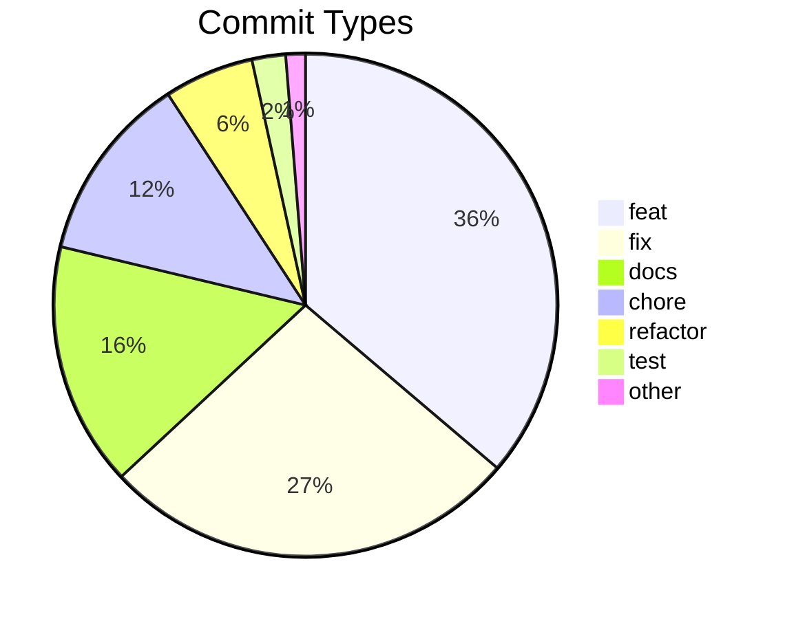

# Commit Change Log

Generated: 2026-05-03T17:39:33Z
Total commits: 555

## Commit Distribution

## Changes by Type

### Features (feat) — 201 commits

| Date | Scope | Description | Commit |
|------|-------|-------------|--------|
| 2026-05-03 | adopt | scaffold .env.local with profile + framework keys (ADR-021) | 995300862e93 |
| 2026-05-02 | adopt | expand CLAUDE.md "Ongoing Changes" with iterate-workflow bullets | 8da26f338b05 |
| 2026-05-01 | compliance | add Group A5 — CI security workflow integrity audit | 66fc9ac1ed9d |
| 2026-05-01 | compliance | wire Group E + G + tuning (plan v7 Steps 7+8+13) | 423f7021bb4c |
| 2026-05-01 | compliance | wire Group B (config + event-log coherence) (plan v7 Step 5) | 0eb62a062f87 |
| 2026-05-01 | adopt | scaffold dormant security workflow into adopted repos | 3eff53b82dcc |
| 2026-05-01 | shared | add dormant security-workflow template + drift test | d7a413cc4f9c |
| 2026-05-01 | shared | add security-workflow convention lock module + pyyaml deps | d7958b43e264 |
| 2026-05-01 | compliance | wire Group A + Group D detective audits (plan v7 Step 4) | 40c1807218e0 |
| 2026-05-01 | test | add performance budgets (lighthouse + bundle-size) | 05dc2c09e72b |
| 2026-04-30 | adopt | visual-guidelines schema alignment + harvest existing knowledge | e273104f6c2b |
| 2026-04-26 | shared | artifact-relocation drift safety net (Sub-Iterate A of 7) | ad62e15c507f |
| 2026-04-26 | deploy | post-apply migration verification + two-phase pattern | e9433e5c0980 |
| 2026-04-26 | adopt | visual frontend documentation (Tier 5, new scope) | 76b669457993 |
| 2026-04-26 | templates,build,adopt | Vite DX templates for generated apps | 02e2d111cb0d |
| 2026-04-26 | security,ci | SARIF translator + dormant CI hardening (Iterate 2 of 2) | 4e679247707e |
| 2026-04-25 | security,run | persist reports + iterate handoff + decouple orchestrator | 8b06dc2a312f |
| 2026-04-25 | shared,build,iterate | add --mode code to external_review.py (Iterate B of A→B) | b386bbea203e |
| 2026-04-25 | run | F6 — integration tests, ADR-001, and docs for multi-session pipeline | 1bdf76c13661 |
| 2026-04-25 | run | F5 — Step 0 phase-session context recovery preamble in 8 phase skills | 5f9988abbb59 |
| 2026-04-25 | run | F4 — master skill rewrite to spec-and-stop coordinator | e0dad2694fe5 |
| 2026-04-25 | run | F3b — wire phase-session hooks live in all 9 plugins | 812e625230dd |
| 2026-04-25 | run | F3a — phase-session hook infrastructure (gated, not yet wired) | e63f435fc952 |
| 2026-04-25 | run | F2 — phase-task lifecycle subcommands with CAS + ownership | 2a89d1490209 |
| 2026-04-25 | run | F1 — v2 schema + phase state machine for multi-session pipeline | b58069a8fe55 |
| 2026-04-25 | adopt | multi-service dev-server support — v0.5.0 | aa228db59595 |
| 2026-04-24 | shared | list_iterate_branches — git-based classifier for iterate/* branches | 8e4f612d4839 |
| 2026-04-24 | webui,project | cross-repo contract versioning for run-config + actions + profiles | 879777263e6c |
| 2026-04-23 | iterate+changelog | iterate_history file-per-iterate + CHANGELOG-unreleased.d drop pattern | 1ff0bdf32046 |
| 2026-04-23 | webui | task-list-unified — VS Code-style task list for TodoWrite + TaskCreate + TaskUpdate | f057d459a81a |
| 2026-04-23 | webui | port-env-support — PORT/VITE_PORT for parallel dev-server stacks | 76f38a60b831 |
| 2026-04-23 | plugins | parallel-worktree-conventions — embed in iterate/build/changelog SKILLs + docs | 9bb88a2e6b84 |
| 2026-04-23 | webui | chat-rendering-polish — align BubbleTranscript with bubble-states.html mockup (6 ACs) | dceb98c8c874 |
| 2026-04-23 | webui | adopt-phase — expose /shipwright-adopt via New Task dropdown | 36b0cef9399a |
| 2026-04-22 | webui | iterate 3 — design overhaul, project-task wiring, configurable actions, 3-pane TaskDetail | 3306c37c65c9 |
| 2026-04-21 | build,iterate | make Browser Verify mandatory on frontend diff | e1b4f5093779 |
| 2026-04-20 | phase-quality | monorepo auto-descent guard for audit + injection | ddf75526d587 |
| 2026-04-20 | webui | iterate 2.3 — TaskBoard + Inbox UX + coverage gaps | 202aeceac8ba |
| 2026-04-20 | shared | Phase-Quality integration for adopt + Playwright route crawler | e5e92af3043d |
| 2026-04-20 | adopt | scaffold shipwright-adopt plugin for brownfield onboarding | acb793e2cf18 |
| 2026-04-19 | webui | iterate 2.2b — bubble layout + virtualization + auto-scroll | d4dc787c7095 |
| 2026-04-19 | webui | iterate 2.2a — markdown rendering + parser hardening | ef4c87e43b54 |
| 2026-04-19 | webui | iterate 2.1 — launch-command --name flag + title rename | 6741cb03c893 |
| 2026-04-19 | compliance | Steps 9 + 10 — audit report rendering + SKILL.md content swap | b60b90b8e533 |
| 2026-04-19 | compliance | Step 6 Groups C + F (preventive re-runs) + path-collision fix | ed4a2639594b |
| 2026-04-19 | compliance | Step 3 detective-audit skeleton + version gate | c4532b8e771b |
| 2026-04-19 | compliance | Step 2 staleness infrastructure (audit_staleness + --check) | d86bd0cf8308 |
| 2026-04-19 | webui | external-launch pivot (Plan D'' variant a, Sub-iterates 0-2) | 043d6415f78e |
| 2026-04-19 | phase-quality | flip SessionStart-Injection default ON, cap 3→5 | 3689d0b379f1 |
| 2026-04-18 | phase-quality | Spec-checks S1-S10 + SessionStart-Inject + Orchestrator-Gate (PR 4/4) | acec516c30be |
| 2026-04-18 | phase-quality | Infrastructure/Traceability/Quality validators I1-I4/T1-T2/Q1-Q2 (PR 3/4) | 6a5caf5d0670 |
| 2026-04-18 | phase-quality | Workflow-category validators W1-W7/Sec1-Sec2/Cmp1-Cmp2/D1-D2 (PR 2/4) | af103d33687e |
| 2026-04-18 | phase-quality | Stop-hook audit infrastructure + Canon C1-C5 (PR 1/4) | c9516f8fd327 |
| 2026-04-18 | webui/chat | sub-iterate B — AUQ as first-class tool UI + stall instrumentation | e6435af8ba61 |
| 2026-04-18 | webui/chat-rendering | sub-iterate 0 — contract foundation | 3bfdc14b12b7 |
| 2026-04-17 | iterate14.12 | mid-task model switching + settings.defaultMode wins over localStorage | 3fdecb329618 |
| 2026-04-16 | iterate14.11 | task detail header pause indicator + resume button | fbcb224ae97a |
| 2026-04-16 | iterate14.9 | bug fixes + opus 7 + auto mode | cfea7550b2fc |
| 2026-04-16 | autonomous-loops | phase 2 complete — iterate campaign mode | bff4c1907e44 |
| 2026-04-16 | autonomous-loops | phase 1 complete — build section loop | ee710ce09aa8 |
| 2026-04-16 | iterate14.8,shared | auto-finalization + subdirectory root fix + canon C2 | 3f4f25c3cb0e |
| 2026-04-16 | iterate14.8.3 | chat composer stop + modelselector redesign + rest hydration | c974bdeed7fb |
| 2026-04-16 | iterate14.8.2 | settings defaults + project color + deep-link | e444aa560bc7 |
| 2026-04-15 | iterate14.7.2 | multi-project kanban with colored strips + filter chip | c551c157bc75 |
| 2026-04-15 | iterate14.7.1 | P1 UX polish bundle — model selector sync + paste buttons + inbox nav + mode badge + constitution rule | eba231434236 |
| 2026-04-15 | iterate14.6 | playwright e2e suite + dynamic model label | 36d8cbbe0bdf |
| 2026-04-15 | iterate14.5 | red flag banner for non-blocked AskUserQuestion | b3c97f980c42 |
| 2026-04-15 | iterate14.4 | create menu + pipeline modal + linear-style shortcuts | 7663a0e04a9a |
| 2026-04-15 | iterate14.3 | constitution AskUserQuestion stop rule + project intro gate | 7dc5ecab67e5 |
| 2026-04-15 | iterate14.2 | multi-question inbox with parts[] schema | 4a8e7b254833 |
| 2026-04-15 | iterate14.1 | preview button + profile-loader + run plugin profile field | 5b6d05d2b144 |
| 2026-04-15 | iterate14.0 | phase dropdown cleanup + iterate auto-detection | 4727c631a935 |
| 2026-04-14 | test,changelog,deploy,shared | iterate 12.4 — release-axis canon + changelog Sonder-Checks | f04dccf0d4ae |
| 2026-04-14 | build,shared | iterate 12.3 — build canon hybrid + check-plan B3/B6 imports | 2dcc118e2049 |
| 2026-04-14 | design,plan,shared | iterate 12.2 — design + plan canon + preventive FR/section checks | 2bac75b8203d |
| 2026-04-14 | project,shared | iterate 12.1 — project plugin canon + stop-hook run-aware skip | d06a0694b3d7 |
| 2026-04-14 | shared,run | iterate 12.0 — modular verifier package + Canon foundation | a90ca90c6db2 |
| 2026-04-14 | webui,iterate13 | flip to unified render, delete band-aids, remove env flag | 09c68c4011ac |
| 2026-04-14 | webui,iterate13 | expand useSSE with chat:message ChatMessage handler | 97558f3ed96a |
| 2026-04-14 | webui,iterate13 | add Zustand turnStatusStore + useTurnStatus selector | d6eb4646f992 |
| 2026-04-14 | webui,iterate13 | add mergeCommitted pure helper with id dedupe and timestamp sort | d340c36618ba |
| 2026-04-14 | webui,iterate13 | Phase 0 — broadcast extracted ChatMessages over SSE | 891c946c07ef |
| 2026-04-14 | plan,iterate,compliance | mandatory external LLM review with interactive opt-out | 4191309a65ec |
| 2026-04-13 | webui | probe claude CLI and show missing-CLI banner | efc339ef8b8c |
| 2026-04-13 | hooks | content-aware CLAUDE.md drift detection | 6ce3be9f1f05 |
| 2026-04-13 | webui | mid-task permission mode switching + autonomy sync to run_config | b79d7f171774 |
| 2026-04-13 | webui | phase detection for task creation | 5edc10a76870 |
| 2026-04-12 | security | add scan CLI, prompt injection scanner, and PR-mode report | af58b4887126 |
| 2026-04-12 | webui | port companion markdown + left-align user msg + image upload | 569b7fab0807 |
| 2026-04-12 | webui | chat rendering — persist all NDJSON types, real-time streaming, tool/thinking components | 07a196a0295b |
| 2026-04-12 | webui | edit task modal, show description popover, guide install docs | 14c7718cca9a |
| 2026-04-11 | — | add auto-triggering, standalone mode, and phase router for all skills | 8940370d84ba |
| 2026-04-11 | pipeline | add self-healing for missing prerequisite artifacts | 4d82e01be879 |
| 2026-04-11 | client | add intent detection hint in chat input | a5b14ef1245b |
| 2026-04-11 | client | implement Projects, Inbox, and Settings pages | ae548aaa3bc4 |
| 2026-04-11 | client | add card enrichment with classify and start task actions | 20f261e8f895 |
| 2026-04-11 | client | implement 4-step project wizard with stack profiles | 19d0cd8c5b45 |
| 2026-04-11 | client | implement file explorer with directory tree and git status | 28876a3ec419 |
| 2026-04-11 | client | implement all viewer renderers — code, HTML, JSON, overlays | 9cbac581fa1c |
| 2026-04-11 | client | implement Smart Viewer with tab management and Markdown renderer | 10606046bdb3 |
| 2026-04-11 | client | implement phase-to-status mapping with per-project overrides | 917f66f8d495 |
| 2026-04-11 | client | implement chat engine with messages, tools, and input toolbar | 87408fd20794 |
| 2026-04-11 | client | implement Task Detail page with resizable two-panel layout | 47e5d7239b6a |
| 2026-04-11 | client | add filter bar, view toggle, and sortable list view | ed065ba2e0ef |
| 2026-04-11 | client | add New Issue modal with background auto-classification | f5ff0366242a |
| 2026-04-11 | client | implement Kanban board with columns, cards, and project tabs | bb048341077d |
| 2026-04-11 | client | add TanStack Query hooks, SSE integration, and API layer | c7e4a28cc647 |
| 2026-04-11 | client | add app shell with sidebar navigation and routing | 8b1538c08e69 |
| 2026-04-11 | api | implement all REST API routes and wire up server entry point | b10c5aa610a1 |
| 2026-04-11 | sse | implement SSE manager with broadcast and route handler | 01b4440d9b37 |
| 2026-04-11 | inbox | implement inbox manager and chat store | 4286127b4317 |
| 2026-04-11 | registry | implement project manager, config reader, and file watcher | 926dfb6dd169 |
| 2026-04-11 | governor | implement process governor with concurrency semaphore and heartbeat | d266940c02f5 |
| 2026-04-11 | adapter | implement Claude CLI adapter with NDJSON stream parser | acd8a80c3c1c |
| 2026-04-11 | tasks | implement task manager with Kanban status derivation | 21363f5516a9 |
| 2026-04-11 | events | implement event reader, writer, and in-memory event store | 59b20df33fe5 |
| 2026-04-11 | types | add shared TypeScript type definitions | a1ef8b2890ca |
| 2026-04-10 | server | scaffold Hono server with health endpoint, CORS, and error handling | 6904060d81fd |
| 2026-04-09 | iterate | add F12 release prompt after finalization | fdad687ddbad |
| 2026-04-09 | events | add event emission to test, deploy, and changelog plugins | f1791a2a60f6 |
| 2026-04-09 | testing | add cross-page UI consistency check to test and iterate plugins | c94ddbdf8317 |
| 2026-04-09 | reflection | add learnings capture protocol to build, test, deploy, iterate | f8f9d3e22601 |
| 2026-04-09 | templates | add 7 production-tested patterns from AI Portal fixes | 9b811f70d034 |
| 2026-04-09 | testing | add integration test layer + aggressive E2E across all plugins | 62c29ac72445 |
| 2026-04-08 | iterate | add structured debugging protocol and fresh verification gate | 7bdc20aa32e9 |
| 2026-04-08 | migrations | close push gap — Build/Iterate apply migrations before tests | ee5d7b0dbf60 |
| 2026-04-08 | iterate | add feedback parsing protocol and harden TDD instructions | 5118cb53f104 |
| 2026-04-06 | iterate | add session resume detection and Stop hook | 132417d30cae |
| 2026-04-06 | — | add mandatory context loading to all pipeline plugins | d36a9bead808 |
| 2026-04-06 | iterate | add events.jsonl to Layer 1 context loading | f404cdeb0fda |
| 2026-04-06 | security | add pluggable scanner backend with OSS support | 1449d32d6aba |
| 2026-04-06 | iterate | add mandatory context loading step B2 + expand Layer 1 | 12840114ae67 |
| 2026-04-06 | iterate | add interview phase, approval gate, and inline spec template | 6611ae7d9a07 |
| 2026-04-05 | build,test | refactor visual comparison — root-cause grouping in build, regressions-only in test | c379816c3add |
| 2026-04-05 | iterate | upgrade to v0.3.0 — complexity-adaptive pipeline phases | e239f981fd11 |
| 2026-04-05 | build,iterate | add design fidelity bridge for mockup-to-code accuracy | b135cf9716cf |
| 2026-04-04 | — | add 5-axis review framework, anti-rationalization tables, and reference docs | 42cd1e9d43cf |
| 2026-04-04 | — | add unified event log (shipwright_events.jsonl) for all reporting | 0b95c2ae1990 |
| 2026-04-04 | — | add marketplace update mechanism + bump all plugins to v0.2.0 | 533900c4dda7 |
| 2026-04-04 | — | improve /shipwright-iterate auto-recognition + expand CLAUDE.md template | 6a13c511d016 |
| 2026-04-03 | — | add /shipwright-iterate plugin for lightweight continuous SDLC | 7293a5f33074 |
| 2026-04-03 | design | add chrome definition for cross-screen UI consistency | 423364691da3 |
| 2026-04-03 | test | add auth support to visual_compare.py | 8cad194cdc34 |
| 2026-04-03 | test | add visual fix loop with root-cause grouping | fce435bd87bd |
| 2026-04-03 | test | add visual comparison layer — mockup vs live screenshots | 9017f3062ef3 |
| 2026-04-03 | preview | add /shipwright-preview plugin for local browser preview | 896686adca1c |
| 2026-04-02 | test | grouped E2E retry strategy — per root-cause group instead of global limit | fd9351331cb1 |
| 2026-04-02 | test | add E2E results verification step and Playwright report links | 11d72c4b49ff |
| 2026-04-02 | — | integrate visual guidelines into build and test pipeline | 585cb0ca68dd |
| 2026-04-02 | — | improve test pipeline — outcome validation, E2E coverage, dashboard overhaul | fd6c7948fa75 |
| 2026-04-02 | project | enable auto-delete branch on GitHub repos during scaffolding | be57c28c564e |
| 2026-04-02 | test | auto-generate E2E specs from plan before Playwright execution | 428e548d6ddb |
| 2026-04-02 | docs | constitution, prompt caching, code examples, and context guidance | 97edadbc5ded |
| 2026-04-02 | pipeline | phase validation gates, dashboard fixes, and hooks documentation | e83a7aeab96e |
| 2026-04-01 | pipeline | multi-split loop with test results archiving | 78705a630504 |
| 2026-04-01 | compliance | end-to-end requirement traceability with linked reports | 678ed22c6d26 |
| 2026-03-31 | build,run | automated split archiving to prevent RTM data loss | aba8b1586077 |
| 2026-03-31 | run,build,test | autonomous context management via subagent delegation | a26ce95539ff |
| 2026-03-30 | run,build | multi-split awareness for dashboard and orchestrator | 21614d0d7dea |
| 2026-03-30 | build | derive branch prefix from project name in run config | 31e97f543890 |
| 2026-03-30 | run,compliance | pipeline dashboard, phase-complete triggers, compliance fixes | 97b4f16123e1 |
| 2026-03-30 | build,compliance | compact ADR format and sprint updates | 62aa60208a4a |
| 2026-03-30 | changelog | auto-merge PR in autonomous mode | 6c29a683c737 |
| 2026-03-30 | changelog | autonomous mode skips version and changelog confirmation | 96b94e1f7ffc |
| 2026-03-30 | build,run,test | autonomous build with dashboard, context pressure, and auto-fix | 888aeb105798 |
| 2026-03-30 | build | auto-generate .env.local template via --init flag | 2ae53b4b6f67 |
| 2026-03-30 | build,test | add structured debugging, verification gates, and self-review | f3ef017440b3 |
| 2026-03-28 | design | add snippet assembly system and review viewer with feedback loop | 7b0b717cd88f |
| 2026-03-28 | — | add shared Stop hook for automatic session handoff generation | 91d2d6be1948 |
| 2026-03-28 | design | add 3-stage brand discovery with website extraction and preview validation | 7805156c5c94 |
| 2026-03-28 | — | add design system flavors, decision logging, and deploy flavors | 5012323805e0 |
| 2026-03-28 | — | add env var validation before build and deploy | cf7bb01ad11c |
| 2026-03-28 | — | auto-trigger compliance update on every phase completion | cecd0072e8fe |
| 2026-03-28 | — | add conditional security scan to pipeline | 8550e8605fb1 |
| 2026-03-28 | — | update direct API model defaults to gemini-3.1-pro and gpt-5.4 | b3bcb2f6ec31 |
| 2026-03-27 | — | add .env support for API keys and update default OpenRouter models | 847a8814fefc |
| 2026-03-26 | — | add shipwright-security plugin with Aikido API integration | 8dca5db164aa |
| 2026-03-26 | — | add secret scanning, file size guard, and drift detection hooks | bf40a0f68f60 |
| 2026-03-23 | — | integrate Claude Architect Certification best practices | 8aac61df8c01 |
| 2026-03-21 | — | add sync_check.py and fix 6 out-of-sync plugin references | c6236fa28aeb |
| 2026-03-21 | — | add visual guidelines generation to shipwright-design | 4346f5710179 |
| 2026-03-21 | — | integrate compliance into orchestrator + design visual guidelines | fad9b836bbb5 |
| 2026-03-21 | — | Playwright browser testing + browser-fixer agent + compliance plugin | 23d00d75bae8 |
| 2026-03-21 | — | shipwright-design plugin — UI mockups from IREB specs | 18da15a255b9 |
| 2026-03-21 | — | add marketplace.json for Claude Code plugin discovery | d537a32321af |
| 2026-03-21 | — | Setup Guide, install scripts, and OpenRouter support | 5c3645a07a34 |
| 2026-03-21 | — | Task 17 — Orchestrator E2E integration tests | 2fdd8a372aed |
| 2026-03-21 | — | Task 14+15+16 — shipwright-run orchestrator | bde02874cfe2 |
| 2026-03-21 | — | Task 13 — DevOps integration tests | 80f2089dd6f1 |
| 2026-03-21 | — | Task 12 — shipwright-deploy with Jelastic (Infomaniak) + rollback | 432661af93c6 |
| 2026-03-21 | — | Task 11 — shipwright-test plugin + shared smoke test | 4f3d61d9bc69 |
| 2026-03-21 | — | Task 10 — shipwright-changelog plugin | be75de7958a9 |
| 2026-03-21 | — | Task 09 — Core Trilogy integration tests | f186c5627a5e |
| 2026-03-21 | — | IREB-aligned spec.md template for shipwright-project | 8bb40cdf2f80 |
| 2026-03-21 | — | Task 07+08 — shipwright-build fork with enhancements | 79f1fc99f190 |
| 2026-03-21 | — | shipwright-project supports chat and inline input modes | 1bae73e94f67 |
| 2026-03-21 | — | Task 06 — shipwright-plan fork with E2E test plan and sprint tracking | 0fa020872bda |
| 2026-03-21 | — | Task 04+05 — shipwright-project fork with profile integration | db16a76a3e51 |
| 2026-03-20 | — | Task 03 — shared utilities (config, state, handoff, hooks) | abe67928deed |
| 2026-03-20 | — | Task 02 — project templates (CLAUDE.md, agent_docs, CI) | c3a6d2f53bd3 |
| 2026-03-20 | — | Task 01 — monorepo scaffolding + supabase-nextjs stack profile | 990a138a4690 |

### Fixes (fix) — 149 commits

| Date | Scope | Description | Commit |
|------|-------|-------------|--------|
| 2026-05-03 | env | strip UTF-8 BOM in parse_env_file (Windows Notepad scenario, ADR-021) | 71c47c350763 |
| 2026-05-03 | hooks | quote ${CLAUDE_PLUGIN_ROOT} in plugins/*/hooks/hooks.json | 6ca369d948c0 |
| 2026-05-03 | env | strip inline `# comment` from parse_env_file values (latent bug, ADR-021) | 1a9c7f48079f |
| 2026-05-03 | adopt | quote suggest_iterate hook path + upgrade legacy entries (Shape + command) in place | b24f804b1d89 |
| 2026-05-02 | adopt | write canonical matcher-group shape for UserPromptSubmit hook | 1ddf9ae549c2 |
| 2026-05-02 | adopt | drift detection, test-fixture filter, compliance fallback (Iterate 2 of 2) | cffe191e793c |
| 2026-05-02 | adopt | brownfield ADR numbering + H3 canon for parser round-trip | 63352ff7e3ff |
| 2026-05-01 | ci | add canonical id to Critical-Findings step in security.yml | ca77b64b0736 |
| 2026-05-01 | tests | close 3 pre-existing canon-lint + assertion gaps from e273104 | b889c380cb94 |
| 2026-05-01 | iterate | close spec/architecture skip loophole for additive features | 5979d9d97ff4 |
| 2026-04-30 | crawler | page-isolation + smart API mock + locator timeouts | 631592956571 |
| 2026-04-30 | crawler | SPA-aware route discovery + screenshot stability | 2d65401b6a41 |
| 2026-04-30 | scripts | file-copy fallback when plugin mirror is a real dir (Windows) | 2d7a4758ac74 |
| 2026-04-30 | compliance-tests | use canonical .shipwright/compliance/ in fixture + assertion | 93fa8205df3c |
| 2026-04-28 | integration-tests | resolve sys.modules['lib'] collision in compliance test | 7e8c387742db |
| 2026-04-27 | plan | defensively validate planning_dir shape in generate-batch-tasks | 342143466686 |
| 2026-04-26 | adopt,shared | route_crawler spec path must use forward slashes | f5fd75042737 |
| 2026-04-26 | docs,templates,deploy | close 14 review findings from Replit-cascade | 48b1e56c49da |
| 2026-04-26 | adopt,shared | external-review fixes + realistic e2e verification | eb224df1e37a |
| 2026-04-26 | adopt | honest awareness — gitignore + additive merge + enrichment guards | fd0888553d19 |
| 2026-04-26 | adopt | never silently destroy load-bearing user files | 95b0df6ffeba |
| 2026-04-26 | adopt,shared | crawler robustness + failure observability | 675247ed3b82 |
| 2026-04-26 | adopt,shared | repair Windows + multi-service crawl pipeline | 48a7ca51a15c |
| 2026-04-26 | security,ci | grant actions:read for upload-sarif@v3 | 290a91c2d112 |
| 2026-04-25 | adopt | broaden Step B.5 crawl gate to admit profile + multi-service signals | f4642ae88181 |
| 2026-04-25 | run | post-merge banner + security-default polish for multi-session | a9396e113b7f |
| 2026-04-25 | run | code-review follow-ups for F4-F6 (internal + external review) | 086cdbda3634 |
| 2026-04-24 | webui | hono server — loud bind errors via formatBindError | d6136dc1f7e7 |
| 2026-04-24 | webui | dev-restart — computeKillTargets helper, drop hardcoded 5177 | 817a2cb4352a |
| 2026-04-24 | webui | tasklist-card-width — drop max-w-[90%] so it matches ToolCard | c3696e9a1d7c |
| 2026-04-24 | webui | hide last-prompt events from chat — pure noise | 864c9e7f521c |
| 2026-04-24 | webui | align changelog entry with v0.3.0 drop-pattern convention | efd020751a52 |
| 2026-04-24 | webui | system-pill-filter — hide custom-title/agent-name/permission-mode by default | b2dcc3cb5b49 |
| 2026-04-24 | webui | chat-bubble-padding — widen horizontal inset from 22px to 40px | 593cc2362bcd |
| 2026-04-24 | webui | status-stuck-on-awaiting-launch — re-launch flips back to active | 26f999f812e4 |
| 2026-04-23 | webui | tasklist-light-theme — switch TaskListCard from dark to light bg | 07850845b849 |
| 2026-04-23 | webui | skillcard-and-code-bg — unwrap array content + anthracite code | 6ae940bda7d6 |
| 2026-04-23 | webui | mermaid-render-loop-fix — stabilize ReactMarkdown config identity (real cause was poll-driven remount) | 23008e95b824 |
| 2026-04-23 | compliance | reference audit report path in Group C iterate suggestion | 74800735b621 |
| 2026-04-23 | webui | mermaid-flicker-fix — move content-hash memo to DOM dataset for StrictMode resilience | 478212e37eeb |
| 2026-04-23 | webui | resume-cwd-prefix — extend cd prefix to legacy buildCopyCommands (Resume/Fork parity with Launch) | b76ab77a7938 |
| 2026-04-23 | webui | mermaid-in-markdown — render language-mermaid fences as SVG diagrams | 8ea55e563f98 |
| 2026-04-23 | security | force UTF-8 subprocess IO so Semgrep SAST runs on Windows | 40c7164b6338 |
| 2026-04-23 | security | default scanner exclusions so OSS backend does not time out on node_modules/.venv (#10) | 7eeef2a234f3 |
| 2026-04-23 | webui | launch-cwd-prefix — shell-aware cd injection so pasted commands run in project root | a524ed207a35 |
| 2026-04-23 | webui | cli-flag-fix — command template used --project-root, not a real Claude CLI flag | 41e0d888d37a |
| 2026-04-23 | webui | shell-line-continuations — flatten copy command for PowerShell/cmd | 00b2bb828435 |
| 2026-04-23 | webui | launch-command-wiring — route copied stub command, phase not persisted | 1b65b2c057b8 |
| 2026-04-20 | webui | omit --session-id on plain resume (CLI 2.1+ rejects the combo) | 1ae0aaffea63 |
| 2026-04-18 | webui/chat | AskUserCard multi-select + notBlocked banner + switch timeout | 1058c73f1c05 |
| 2026-04-18 | webui/chat | UAT round 2 — new-task model, ghost bubble, resume UX, 409 retry | e742e79f0239 |
| 2026-04-18 | webui/chat | mid-task model switch UX + spawn indicator + empty-prompt guard | df364fa647a9 |
| 2026-04-18 | webui/e2e | correct TaskDetailPage URL in sub-iterate A spec | a752083636de |
| 2026-04-18 | webui/chat-settings | sub-iterate C — unify model state to concrete CLI ids | 9bd97d46964d |
| 2026-04-18 | iterate | ensure external review runs on Resume for medium+ iterates | ae42d6fcb1d5 |
| 2026-04-17 | iterate14.14 | post-14.13 bug sweep (4 bugs) | 2736734344f7 |
| 2026-04-17 | iterate14.13 | send concrete model id + spawn/switch UX indicators | 5452fb634438 |
| 2026-04-16 | iterate14.10 | opus 4.7 correct id + auto mode CLI mapping + askusercard pause resume | 1ff459c7d6ad |
| 2026-04-16 | iterate14.8.1 | filterbar phase drift + priority removal + modebadge inline | 611c079396c1 |
| 2026-04-16 | iterate14.8.0 | kanban phase mapping wire-through + sensible defaults | 901f860a59e1 |
| 2026-04-15 | iterate14.7.0 | task persistence + all-projects view + reload state | 722f96251c4f |
| 2026-04-14 | webui,shared | iterate 12.0b — zombie-task reconciliation | 444935ef844b |
| 2026-04-14 | webui,plugins | revert inbox filter to latest-pending + expand phase dropdown | 10c43bb51532 |
| 2026-04-14 | webui | drop /think slash prefixes — Claude CLI 2.1.1 removed them | 9f1080b77401 |
| 2026-04-14 | webui,iterate13.1 | suppress markdown fallback after resolved AskUserQuestion | 2a2d4cc9a404 |
| 2026-04-14 | webui,iterate | iterate 11.3 — first-pending inbox + replay timestamps + iterate-aware handoff | b41f68a582de |
| 2026-04-13 | webui | inbox shows latest pending per task (revert iterate 11.1 zombie filter) | d02a8ff72c8e |
| 2026-04-13 | webui | inbox dedupe by normalized question + zombie-task filter (ADR-024) | 527662c116f4 |
| 2026-04-13 | webui | revert iterate-7 tool_result stdin + inbox filter + model selector + finalization verifier | d3c57aad7ba5 |
| 2026-04-13 | webui | lock concurrent JSON writes (projects, pids, inbox, settings) | 81b5a12ad81e |
| 2026-04-13 | hooks | filter shipwright runtime-artifact dirs from drift check | 24cf717e06f7 |
| 2026-04-13 | webui | inbox projectId + chat-history replay + collapse AskUserQuestion noise + model/effort wire-through | 72512480cb46 |
| 2026-04-13 | webui | persist task_cancelled/work_completed/task_updated to events.jsonl | 3bc9f85ea557 |
| 2026-04-13 | webui | inbox answers send tool_result block + immediate Thinking + plugin scope + ADR budget | b589aaf4e7ae |
| 2026-04-13 | webui | TaskHeader redirects to kanban board after Close/Delete | 6366e7cd8ccd |
| 2026-04-13 | webui | fatal startup errors (EADDRINUSE) must exit for tsx watch to retry | 8f36d400bb90 |
| 2026-04-13 | webui | reset displayContent per turn + inbox id=toolUseId + dev-restart helper | ac5784772dc1 |
| 2026-04-13 | webui | correct AskUserQuestion schema + orange accent + thinking label + restart note | 314e8689d863 |
| 2026-04-13 | webui | kill chat duplication at the root + AskUserCard redesign + classifier tiebreak | ceb72a0bdedb |
| 2026-04-13 | webui | AskUserQuestion card renders schema + dedupe double-render | 5e27b1ef1cce |
| 2026-04-13 | webui | tool call cards transition Running→Done in place | 8502a0830a4d |
| 2026-04-13 | webui | phase dropdown now authoritative in both start paths | 37e7d1a978cb |
| 2026-04-12 | hooks | post-test iterate fallback + broken classify import path | 8611c5ce23e0 |
| 2026-04-12 | webui | compact task header + tighter chat top padding | 646475164d01 |
| 2026-04-12 | webui | permission popover closes on select, user bubble darker | 004ce3527a49 |
| 2026-04-12 | webui | white claude cards, grey user bubble, VS Code permission modes | 5a6bf4d942c7 |
| 2026-04-12 | webui | persistent Claude process via --input-format stream-json | ff4158a9f48d |
| 2026-04-12 | webui | flat chat, markdown tables, earlier streaming indicator | 09a5f92348cf |
| 2026-04-12 | webui | chat rendering matches mockup 11 — avatars, tool tiles, no horizontal scroll | ad24a33e2bd5 |
| 2026-04-12 | webui | interactive chat via re-spawn with --resume | b85830a8bc55 |
| 2026-04-12 | webui | task lifecycle events — start transitions kanban status, exit completes task | 5e9355e1c200 |
| 2026-04-12 | webui | kanban columns scroll vertically when tasks overflow | 032bc2e60524 |
| 2026-04-12 | webui | add min-h-0 to enable scroll on kanban board container | 6a7226922695 |
| 2026-04-12 | webui | enable page scrolling when tasks overflow viewport | c057ed40f142 |
| 2026-04-12 | webui | bridge hardening — cross-platform stability | 238437cfe98a |
| 2026-04-12 | webui | bridge working — Claude CLI spawns, responds, files created | 7eebcdde063b |
| 2026-04-12 | webui | CLI prompt sends title+desc, server crash fix, Windows auto-start | f61972b85a8f |
| 2026-04-12 | webui | test phase — title/desc split, autonomy refactor, model display, start button | 4c05570c3b36 |
| 2026-04-11 | webui | PATCH URL, card menu Close+Delete, chat error handling | ed1aa43d94b6 |
| 2026-04-11 | webui | task creation ENOENT fix + project delete button | f18d6e120a82 |
| 2026-04-11 | webui | task creation works, project dir initialized, keyboard shortcut fixed | 82917adf40ea |
| 2026-04-11 | webui | task creation resilience + install.sh + guide + CRUD tests | 23c78e799575 |
| 2026-04-11 | webui | UI test findings — logo, naming, wizard, shadows, dropdown, shortcuts | 4a468d094cd7 |
| 2026-04-11 | e2e | use precise locators and handle backend-absent state | 55f34e63a0d6 |
| 2026-04-11 | webui | resolve visual mockup deviations and 10 dead-write persistence gaps | 00798cb9dd7d |
| 2026-04-11 | — | visual_compare parsing, pipeline order, compliance logging, preview hints | 7d436c53fdba |
| 2026-04-11 | build | derive branch name from session-id instead of section name | a642df423493 |
| 2026-04-11 | iterate | add design mockup references to early pipeline steps | 3ad1881b00fc |
| 2026-04-11 | iterate | add design mockup references to early pipeline steps | c8c792fd9d3d |
| 2026-04-11 | server | replace __dirname with ESM-compatible import.meta.url | 7cb6436fbc81 |
| 2026-04-11 | plan | add Design Reference blocks to section specs and batch generator | a335bc649152 |
| 2026-04-11 | build | section-aware event dedup and dashboard config fallback | e64e1bdb8cdb |
| 2026-04-10 | — | cross-plugin symlinks in cache + iterate compliance path | 1451bb06a389 |
| 2026-04-10 | — | cross-plugin symlinks in cache + iterate compliance path | b49460fb64ec |
| 2026-04-10 | — | sync shared/ directory to plugin cache in marketplace update | 495626be6af9 |
| 2026-04-10 | pipeline | add consistency fixes for Project, Plan, Design phases | cec3137fb485 |
| 2026-04-10 | design | make review viewer localStorage keys project-specific | d1d94c2dac95 |
| 2026-04-09 | compliance | add baseline failure support to test evidence report | eaa466ac893b |
| 2026-04-08 | i18n | replace German text with English in all user-facing files | 6adf34864402 |
| 2026-04-06 | compliance,dashboard | stale test status, evidence order, baseline failures | e80214fb1319 |
| 2026-04-05 | iterate | add CHANGELOG, build dashboard, auto-merge, and verification gate to finalization | e167d1fd0d31 |
| 2026-04-05 | scripts | update-marketplace.sh uses full file sync instead of version check | 67f0fe4d7c34 |
| 2026-04-04 | — | test evidence Playwright section after Full Suite Runs + config JSONL skip | 1d38cd05e414 |
| 2026-04-04 | — | add HTTPS fallback to update-marketplace.sh for SSH failures | 1359f8e5092c |
| 2026-04-04 | — | revert skill dir rename, keep install.sh security+preview fix | 105209a7e151 |
| 2026-04-04 | — | rename skill dirs to full plugin name for clean slash-command display | 8d90e9aa64d9 |
| 2026-04-03 | — | migrate all hooks.json to new Claude Code format + rename skill dirs | 1683eba7ae94 |
| 2026-04-02 | readme | remove hallucinated URL from constitution attribution | 082a4daf5664 |
| 2026-04-02 | shared | tag archived sections with split name for dashboard grouping | e71771442bf5 |
| 2026-04-02 | shared | use run_config as authoritative source for phase and split state | 519107f1746a |
| 2026-04-02 | docs | correct hook filenames, add missing security plugin and session configs | a91f437bfb4c |
| 2026-04-02 | hooks | only track tool calls in Shipwright projects | e8788174ebc7 |
| 2026-04-02 | supabase | fix migration push failures and add setup guardrails | 195f06a49a53 |
| 2026-04-01 | pipeline | stale artifacts, pipeline order, and pipeline constants | ac464712c73b |
| 2026-04-01 | plugins | add --project flag to uv run for correct dependency resolution | 025a04feb557 |
| 2026-04-01 | hooks | set SHIPWRIGHT_PROJECT_ROOT in session hooks, add test phase detection | a592b30b8448 |
| 2026-03-31 | pipeline | test completion gate, counter reset, and pipeline constants | e9b68e0dae23 |
| 2026-03-31 | pipeline | stale artifacts, pipeline order, and toolcall counter path | 0322a77d866c |
| 2026-03-30 | build,compliance | persist test results and read all splits in compliance | dca957000529 |
| 2026-03-30 | compliance | fix dashboard links, remove traceability flow and cost summary | b37b9f59c12f |
| 2026-03-30 | env | ensure .env.local is gitignored before creation | eb30a6554d80 |
| 2026-03-28 | — | unignore plugins/shipwright-build/skills/build/ directory | 39899c7ada95 |
| 2026-03-28 | compliance | read pipeline phases dynamically from run config | 45d9483ce6c6 |
| 2026-03-28 | — | add missing design phase to orchestrator pipeline in SKILL.md | d020dfe87328 |
| 2026-03-21 | — | use descriptive skill folder names to avoid slash command stuttering | 9a55e863cac8 |
| 2026-03-21 | — | revert skill folders to skills/shipwright-{name}/ (matching upstream) | a01be3c8bb13 |
| 2026-03-21 | — | use short skill names in SKILL.md frontmatter | f02346755760 |
| 2026-03-21 | — | rename skill folders for clean slash commands | 5a8d77658fab |
| 2026-03-20 | — | update README attribution to svenroth.ai | dd5de7f7d6ab |

### Documentation (docs) — 87 commits

| Date | Scope | Description | Commit |
|------|-------|-------------|--------|
| 2026-05-02 | changelog | add Added/Changed/Fixed fragments for self-adoption iterate | 38f35c9285df |
| 2026-05-02 | changelog | add Fixed fragments for adopt brownfield ADR + H3 canon | 3f52f7938741 |
| 2026-05-01 | changelog | record compliance Sub-Iterate C drop (F4 backfill) | 12814ea67cf6 |
| 2026-05-01 | changelog | record adopt-security-scaffolding iterate | fa830e3b4c40 |
| 2026-05-01 | security | promote ci-integration to docs/security-ci-setup.md | d3fb84a26020 |
| 2026-05-01 | changelog | backfill 19 unreleased drops for v0.10.1..b889c38 | be72132b181b |
| 2026-04-30 | deploy | extract universal rollback discipline from Jelastic implementation | c68eea0384cd |
| 2026-04-30 | guide | align persona section with live website | 25c893305d33 |
| 2026-04-30 | — | add plain-language index for industry terminology | 3fdf24bbbeb1 |
| 2026-04-30 | — | add harness/discipline-layer positioning and persona descriptor | 4245748ad394 |
| 2026-04-30 | run | clarify run as pipeline initializer, reserve orchestration for pipeline concept | 5b38eddc9476 |
| 2026-04-30 | security | document CI-only security target operating model | b9f2dbf6c3d7 |
| 2026-04-30 | migration-ref | refresh commit hashes after email-rewrite | e3df871838c7 |
| 2026-04-29 | changelog | record config-jsons deferral + toolcall-counter rename | a9a4be9caebe |
| 2026-04-29 | migration-ref | defer shipwright_*_config.json migration with trigger list | bb98f9f35e5a |
| 2026-04-29 | changelog | drop for bare-token Claude-instruction leak fixes | 9fbae6d143a1 |
| 2026-04-29 | plugins | fix bare-token Claude-instruction leaks from planning + agent_docs migrations | 3636b24b925c |
| 2026-04-29 | migration-ref | cleanup stale candidate list + add migration awareness for user-projects | 66ded1cb1484 |
| 2026-04-29 | changelog | record compliance/ -> .shipwright/compliance/ migration | d6b282867590 |
| 2026-04-29 | migration-ref | add Lesson 30 + Pre-G belt-and-suspenders trace | 3595786ed476 |
| 2026-04-29 | migration-ref | add compliance migration to artifact-migration reference | ffaa0b49b816 |
| 2026-04-29 | migration | add user-facing compliance relocation guide | 6398642896ef |
| 2026-04-29 | — | migrate compliance/ to .shipwright/compliance/ in user-docs | 8e8596176090 |
| 2026-04-29 | plugins | migrate compliance/ to .shipwright/compliance/ in plugin SKILLs | 335b1d9580f3 |
| 2026-04-28 | security | per-scanner exclusion contract — Pfad B' Doku-Sync (H.B' + H.C) | 4b348ad7bd9d |
| 2026-04-28 | migration-ref | document agent_docs relocation in artifact-migration reference | 8ad450a1b1d7 |
| 2026-04-28 | migration | add user-facing agent_docs relocation guide | 1744bff19434 |
| 2026-04-28 | — | migrate agent_docs templates + public docs to .shipwright/agent_docs | e0dd9bc4b0c4 |
| 2026-04-28 | plugins | migrate agent_docs prose to .shipwright/agent_docs | 9dc880db634c |
| 2026-04-27 | migration-ref | document designs relocation in artifact-migration reference | 28547188f83a |
| 2026-04-27 | plugins | migrate designs/ -> .shipwright/designs/ in plugin prose | 32388fd18602 |
| 2026-04-27 | changelog | tag drops with [iterate-name] prefixes for grouping | 1172a938739f |
| 2026-04-27 | changelog | drops for the two newly-merged branches | 9722576e9a6b |
| 2026-04-27 | changelog | planning relocation drops (Sub-Iterates A-G) | ad4b92c1bc92 |
| 2026-04-27 | migrations | artifact-migration reference doc + chain-helper allowlist (Sub-Iterate G of 7) | 2466b002bcc4 |
| 2026-04-27 | — | sync guide and hooks reference with current pipeline shape | a1b23c871989 |
| 2026-04-26 | guide | add reading-order chapter for external devs | d4778329d433 |
| 2026-04-26 | — | refresh Command Center section in guide and README | e8d1d52b7e7e |
| 2026-04-25 | guide | document --mode code external review + cascade wiring | ea297d2f7f31 |
| 2026-04-24 | iterate | replace B1a prose with list_iterate_branches helper | e15c6c084b38 |
| 2026-04-24 | readme | surface parallel-worktree workflow in Command Center setup | 2758a7b1fc8c |
| 2026-04-24 | webui, guide | honest parallel-worktree language + cache-drift pitfall | 110c5f9cec66 |
| 2026-04-24 | webui | changelog drop for tasklist-card-width hotfix | 2e8d5d9503a6 |
| 2026-04-24 | webui | changelog drop for last-prompt hotfix | 88a0725d6f18 |
| 2026-04-24 | webui | ADR-058 — three-fix bundle (status, padding, system pills) | ab649584b042 |
| 2026-04-23 | changelog | consolidate hotfix chains in [Unreleased] | 321d1d51840b |
| 2026-04-20 | — | refresh README + guide.md intro for post-pivot Command Center | 2f20c748de60 |
| 2026-04-20 | webui | iterate 2.4 — sync CLAUDE.md + ADR-035 | 3b02b0fd5efa |
| 2026-04-20 | adopt | new chapter 3.5, Appendix B entry, hooks registry, marketplace | 34bad22d85e8 |
| 2026-04-19 | compliance | finish plan v7 doc sweep (mermaid, phase-gate, Appendix B) | 77219038afb2 |
| 2026-04-19 | compliance | plan v7 Option Z — guide + hooks-and-pipeline + orphan deletion | daae228bb062 |
| 2026-04-17 | iterate14.13,changelog | concrete model id + spawn UX entry | 00a72f200d14 |
| 2026-04-17 | iterate14.12,changelog | mid-task model switching + defaultMode hydration entry | b9750001f4fb |
| 2026-04-16 | iterate14.11,changelog | task detail header pause indicator entry | 7c2d03fbc3cd |
| 2026-04-16 | iterate14.10,changelog | iterate 14.10 hotfix entry | 6111cd6a037f |
| 2026-04-16 | iterate14.9,changelog | iterate 14.9 omnibus entry | d96688e49503 |
| 2026-04-16 | iterate14.8,changelog | iterate 14.8 omnibus entry | f592aba9f13a |
| 2026-04-15 | iterate14.7,changelog | iterate 14.7 omnibus entry | 1b7c832a21a2 |
| 2026-04-15 | iterate14,changelog | iterate 14 omnibus entry + project plugin uv.lock | 41f10c96c438 |
| 2026-04-15 | shared,test,changelog | iterate 12.6 — canon coverage matrix + guide updates + test drift fix | f2e5229c34ec |
| 2026-04-14 | iterate13 | ADR-026 — chat protocol fix + turn lifecycle store | a63b3995ce51 |
| 2026-04-13 | guide | fix What to Expect and remove phantom /shipwright-sync | 374d34472d72 |
| 2026-04-13 | readme | credit superpowers and agent-skills as inspiration | 350f8e78d3c5 |
| 2026-04-13 | — | refresh README, guide, CLAUDE.md for Early Access first impression | 6c7e7ae4ab7f |
| 2026-04-13 | iterate | reorder finalization so F6 no longer needs an amend | fa0cb7a09555 |
| 2026-04-11 | constitution | clarify test case generation in self-healing rule | f20d4677c5ba |
| 2026-04-11 | — | track agent_docs, planning, designs, and configs in git | 5bf0e0cfb3f2 |
| 2026-04-05 | — | strengthen guide intro, add integrated learnings, add visual testing | 90a5357ee06e |
| 2026-04-05 | — | update guide.md for shipwright-iterate v0.3.0 | d127733836ca |
| 2026-04-04 | — | add Integrated Learnings section to README | eaa92dec278a |
| 2026-04-03 | readme | add shipwright-preview to skills table | a8c640a7dde2 |
| 2026-04-02 | — | replace verbose README and setup-guide with lean README linking to docs/guide.md | 5a8a48bff3e1 |
| 2026-04-02 | readme | credit Claude Code source code leak for constitution learnings | 08ce2c57f8eb |
| 2026-04-02 | constitution | add agent reliability rules from Claude Code leak learnings | c3e753b2fc4c |
| 2026-04-02 | — | clarify context reset options in troubleshooting | 7063119a8683 |
| 2026-03-30 | build | add instructions for capturing test counts and review findings | 43f1e1699f4f |
| 2026-03-29 | test | replace security placeholder with reference to shipwright-security | de674190b430 |
| 2026-03-28 | — | widen pipeline diagram boxes to prevent line wrapping | c91df0a4f1f0 |
| 2026-03-28 | — | add design phase section with snippet system and review workflow to README | 1aa1db584ba4 |
| 2026-03-28 | — | fix Mermaid extension author in setup guide | 5da73f73e0fd |
| 2026-03-28 | — | update setup guide for .env-based API key configuration | 3b8d925efbd4 |
| 2026-03-27 | — | add shipwright-security to README pipeline, skills table, and architecture | 3bbc452d6129 |
| 2026-03-21 | — | fix ASCII pipeline diagram alignment in README | 1c0212221382 |
| 2026-03-21 | — | update setup guide with marketplace installation for VSCode Extension | f98be14e5434 |
| 2026-03-21 | — | update guide with update instructions + dev workflow | 32935577650e |
| 2026-03-21 | — | expand README with pipeline diagram, architecture, and quality gates | 377dc2141b3d |
| 2026-03-20 | — | add README.md for GitHub repo | 853c8f930132 |

### Chores (chore) — 67 commits

| Date | Scope | Description | Commit |
|------|-------|-------------|--------|
| 2026-05-03 | release | v0.15.0 | 7b144fa52871 |
| 2026-05-03 | post-merge | regenerate compliance + dashboard + handoff for merged state | 566260f0a899 |
| 2026-05-03 | iterate-hooks-json | post-F6 housekeeping (F7 event for ADR-022) | 3476ce2245be |
| 2026-05-03 | iterate-env-local | F4 + F7 for inline-comment fix | 3409c601c597 |
| 2026-05-03 | iterate-env-local | post-F6 housekeeping (F7 event for ADR-021 + post-merge handoff regenerate) | 95e6f2ca921b |
| 2026-05-03 | iterate-quoted-path | post-F6 housekeeping (F7 event for ADR-020) | d93ea0ac547e |
| 2026-05-03 | compliance | refresh artifacts post-rebase + record event for ADR-019 | 449aacfd1ab5 |
| 2026-05-02 | iterate-2 | post-F6 housekeeping (F7 event + ADR-018 conventions append) | eefae4699231 |
| 2026-05-02 | compliance | refresh dashboard timestamps + change-history after v0.14.0 | 87dbf72a8614 |
| 2026-05-02 | release | v0.14.0 | 57bc7928765d |
| 2026-05-02 | shipwright | adopt repository into Shipwright SDLC | bf59b217f576 |
| 2026-05-02 | adopt | prepare shipwright monorepo for self-adoption | 2116996e34bf |
| 2026-05-01 | release | v0.13.0 | 0811f2818b88 |
| 2026-05-01 | release | v0.12.0 | be8521ee7480 |
| 2026-05-01 | release | v0.11.0 | 4e8e8e3ce79a |
| 2026-04-29 | release | v0.10.1 | daaddffc30e3 |
| 2026-04-29 | release | v0.10.0 | 3f32dcb3ff0f |
| 2026-04-29 | migration | flip compliance to status=migrated | f5372f33b2cf |
| 2026-04-29 | migration | retain compliance/ in .gitignore with legacy comment block | b20956641061 |
| 2026-04-29 | migration | activate compliance migration (status=in_progress) + agent_docs allowlist hot-fix | 61728f03fb5a |
| 2026-04-28 | release | v0.9.1 | 803f45767c29 |
| 2026-04-28 | release | v0.9.0 | 0ed24a87b3a9 |
| 2026-04-28 | migration | flip agent_docs to status=migrated | 1bf4af637f58 |
| 2026-04-28 | migration | retain agent_docs/ in .gitignore with legacy comment | 95d2c5cef9ce |
| 2026-04-27 | migration | activate agent_docs artifact migration (status=in_progress) | 81cef64e9810 |
| 2026-04-27 | release | v0.8.0 | 3f9c95daf4e4 |
| 2026-04-27 | migration | hard-cutover designs to .shipwright/designs (status=migrated) | af64a2689e11 |
| 2026-04-27 | migration | activate designs artifact migration (status=in_progress) | 01b493a4ac2a |
| 2026-04-27 | release | v0.7.0 | ae3ef063a9ca |
| 2026-04-26 | release | v0.6.0 | e6a38f02fc00 |
| 2026-04-25 | changelog | add unreleased drop for adopt crawl-gate fix | b6ea9d2bcdc7 |
| 2026-04-25 | release | v0.5.0 | 3aa67435b90d |
| 2026-04-25 | changelog | add unreleased drop for code-review-mode iterate | b1f0a333d809 |
| 2026-04-25 | — | untrack agent_docs/iterates/*.json (gitignore mismatch) | 240c853acdcc |
| 2026-04-25 | docs | remove ADR-001 from repo, keep only as local agent_docs entry | ca890b2d4a09 |
| 2026-04-24 | — | persist CHANGELOG-unreleased.d/ category dirs via .gitkeep | eae63b59abf4 |
| 2026-04-24 | release | v0.3.2 — parallel-worktree safety + stale-branch automation | 6564e674c6e5 |
| 2026-04-24 | release | changelog drops + iterate entry for stale-branch-filter | 81cd17faa772 |
| 2026-04-24 | — | changelog drops + iterate entry for test-and-doc-gaps | 7195a9e76f83 |
| 2026-04-24 | release | changelog drops + iterate entry for worktree-hardening | 6f9296ebd515 |
| 2026-04-24 | release | v0.3.1 — WebUI live-test improvements | adf511648f82 |
| 2026-04-24 | webui | finalize iterate webui-status-padding-pills | 62e75f991c62 |
| 2026-04-24 | release | v0.3.0 + fix: aggregator respects [Unreleased] top-of-stack | 4a286225be49 |
| 2026-04-23 | release | v0.2.2 | 705cef17d94b |
| 2026-04-23 | release | v0.2.1 | 2891ee836fad |
| 2026-04-23 | release | v0.2.0 | 604246f55fb8 |
| 2026-04-22 | — | commit stragglers — plugin uv.locks + assistant-ui review tool | 70c487009097 |
| 2026-04-20 | marketplace | register shipwright-adopt in marketplace.json | 7e583b0253c9 |
| 2026-04-19 | webui | server sweep + docs (Plan D'' Sub-iterate 3) | daccc7d9012a |
| 2026-04-18 | webui/chat | re-remove deprecated components accidentally restored in a752083 | b3b7fd52b96a |
| 2026-04-13 | webui | untrack shipwright_test_results.json | 7b993f877b77 |
| 2026-04-13 | webui | block pipeline artifacts and untrack e2e-results | 63103672685a |
| 2026-04-13 | — | bump shipwright-run lock to 0.2.0, tweak TaskHeader spacing | 89eba82f9fba |
| 2026-04-12 | webui | retroactive iterate backfill for v0.1 triage (3 themes) | a1b3f28d9f2d |
| 2026-04-12 | repo | early-access readiness — community files, dormant CI, dependabot | 4107a6b70bb9 |
| 2026-04-12 | release | v0.1.1 — v0.1 triage (task lifecycle, interactive chat, chat rendering) | b475a78f725f |
| 2026-04-12 | release | v0.1.0 | ebe91b0905d0 |
| 2026-04-11 | — | add generated test/cache directories to .gitignore | 020f4a067678 |
| 2026-04-11 | test | add missing test prerequisites and design artifacts | 3c6148820a18 |
| 2026-04-11 | client | scaffold Vite 6 + React 19 project with TailwindCSS 4 | 6b9319b6d14a |
| 2026-04-09 | — | update uv.lock files and gitignore .claude/ | 2674a42ae4bc |
| 2026-04-06 | — | sync versions across all plugins and add preview pyproject.toml | 20f1ff31dbe2 |
| 2026-03-31 | — | add .shipwright_toolcall_count to .gitignore | 539b0ab25114 |
| 2026-03-30 | build | track uv.lock for dependency reproducibility | f925121dc6c7 |
| 2026-03-29 | — | add Spec/ to .gitignore | 77c2b1dc7fd6 |
| 2026-03-28 | — | add shipwright-run uv.lock | ef1cc1ad180c |
| 2026-03-20 | — | initial commit with spec and task list | 07ca9c1de51c |

### Refactoring (refactor) — 32 commits

| Date | Scope | Description | Commit |
|------|-------|-------------|--------|
| 2026-05-02 | repo | post-adoption framework cleanup (Sub-1A through 1D) | 3db485b24305 |
| 2026-04-29 | toolcall-counter | rename .shipwright_toolcall_count to .shipwright/toolcall_count | 1b2d6f0ab9b7 |
| 2026-04-29 | shared | add compliance to drift_parsers HIDDEN_DIR_DEFAULTS marker | 57c11809fd67 |
| 2026-04-29 | plugins | migrate compliance/ to .shipwright/compliance/ across plugins | 5a9ba0ecdc31 |
| 2026-04-29 | shared | migrate compliance/ to .shipwright/compliance/ in shared/ python | f6be00663dfc |
| 2026-04-28 | security | add .worktrees to scanner exclusion list (H.D.5 benchmark fix) | 530b2f72fe8f |
| 2026-04-28 | security | per-scanner exclude lists, drop blanket _DEFAULT_EXCLUDES | 972470b41ef0 |
| 2026-04-28 | shared | mark agent_docs in drift_parsers HIDDEN_DIR_DEFAULTS | 10e1f6527368 |
| 2026-04-28 | plugins | migrate agent_docs paths to .shipwright/agent_docs | c009a0add4e2 |
| 2026-04-27 | shared | migrate agent_docs paths to .shipwright/agent_docs | ca0fd19ea6e4 |
| 2026-04-27 | templates,docs,tests | migrate designs/ -> .shipwright/designs/ (E) | bbd56d4a2cd1 |
| 2026-04-27 | plugins | migrate designs/ -> .shipwright/designs/ in plugin scripts + tests | b39407f02a7b |
| 2026-04-27 | shared | migrate designs/ -> .shipwright/designs/ in shared verifiers + tests | 80e40be009d3 |
| 2026-04-27 | shared,docs | planning -> .shipwright/planning hard cutover (Sub-Iterate F of 7) | cf193f9b8d11 |
| 2026-04-27 | templates,docs,integration-tests | migrate planning/ -> .shipwright/planning/ in templates + docs (Sub-Iterate E of 7) | 6b1418bac071 |
| 2026-04-27 | plugins | migrate planning/ -> .shipwright/planning/ in plugin prose (Sub-Iterate D of 7) | 7b33dc2168d3 |
| 2026-04-26 | plugins | migrate planning/ -> .shipwright/planning/ in plugins (Sub-Iterate C of 7) | 3c64a7117f87 |
| 2026-04-26 | shared | migrate planning/ -> .shipwright/planning/ in shared/ (Sub-Iterate B of 7) | a056d41b9a70 |
| 2026-04-26 | security | move report dir to .shipwright/securityreports/ | b8fc2436d1ea |
| 2026-04-25 | shared,plan,iterate | extract external review machinery to shared/ | a7ec22c7e4bf |
| 2026-04-24 | webui | profile-loader 3-tier cascade + bundled profiles snapshot | 4775a8816048 |
| 2026-04-23 | webui | chat-livetest-2 — 4 follow-ups to ADR-055 live-test | da464b46e5c3 |
| 2026-04-23 | webui | chat-followups — 4 follow-ups to ADR-054 chat-rendering-polish | 11aaba3b8970 |
| 2026-04-19 | run | remove compliance from PIPELINE_STEPS + loud-fail + legacy migration | 1d0303b964aa |
| 2026-04-18 | webui/chat | sub-iterate A — assistant-ui renderer foundation | 7d7d7cf2175b |
| 2026-04-16 | hooks,run | consolidate capture_session_id + remove deprecated run-iterate scope | f2a69630d826 |
| 2026-04-15 | build,docs | iterate 12 followups — handoff consolidation + two-histories doc | bcd3841d90c6 |
| 2026-04-14 | webui | remove effort/thinking-depth UI and wire-through entirely | 5278170c7dab |
| 2026-04-11 | — | replace screenshot-based visual comparison with code-based design fidelity analysis | 9bfc656df8a2 |
| 2026-03-30 | env | load all env vars from project .env.local instead of plugin root | d65db6d7ad30 |
| 2026-03-30 | env | consolidate plugin env vars into single .env.local | 4a9267b522fb |
| 2026-03-28 | — | unify decision log to shared ADR format across all phases | 2851babbbcfa |

### Tests (test) — 12 commits

| Date | Scope | Description | Commit |
|------|-------|-------------|--------|
| 2026-04-30 | adopt | tighten 3 confidence gaps from self-review | 230f3d28abcb |
| 2026-04-29 | plugins | migrate compliance/rtm.md mock fixture to canonical path | 50d1d866b113 |
| 2026-04-28 | security | tighten smoke-test skip semantics + clarify gitignore-snippet scope (H.E review-fix) | eb43c26f82e4 |
| 2026-04-28 | security | real-scanner smoke tests for per-scanner exclude contract (H.D) | a4d6b861f6a3 |
| 2026-04-28 | shared | Layer 6 constants-vs-manifest cross-validation | 95686c76ca7d |
| 2026-04-25 | run | hook-chain integration test (SessionStart → UserPromptSubmit → Stop) | 2a793254c1ae |
| 2026-04-24 | shared | unit + slow integration coverage for list_iterate_branches | eba99eb7d59c |
| 2026-04-24 | shared | vite config HMR pinning + companion invariants tripwire | e2d2f2d51447 |
| 2026-04-24 | — | concurrency regression guards for iterate/phase writers (slow) | 1df780b4fd7a |
| 2026-04-20 | webui | iterate 2.5 — bump spec 33 + 37c tolerances for full-suite | 71bdc564d077 |
| 2026-04-11 | — | complete test phase — 299 unit tests, 5 E2E tests, smoke PASS | e843d458942d |
| 2026-04-11 | e2e | set up Playwright with E2E specs and smoke test results | cba0fd6e9012 |

### Other (other) — 7 commits

| Date | Scope | Description | Commit |
|------|-------|-------------|--------|
| 2026-04-24 | — | feat!: extract WebUI into own repo (shipwright-webui) — v0.4.0 | 47cacebb2a24 |
| 2026-04-23 | — | iterate 3.9 — E2E spec backlog cleanup + TaskCard menu-bubbling fix (#9) | 514ec0b55a92 |
| 2026-04-22 | — | iterate 3.8 — post-iterate-3 cleanup (E2E + scrollbar gutter) (#8) | 8a1950a50ee1 |
| 2026-04-17 | — | poc: assistant-ui migration probe (branch poc/assistant-ui-migration) | 742468d29706 |
| 2026-04-04 | — | Revert "docs: add Integrated Learnings section to README" | 9ede83209202 |
| 2026-04-04 | — | Revert "fix: rename skill dirs to full plugin name for clean slash-command display" | 1545b4b2c522 |
| 2026-03-21 | — | revert: restore full skill names in SKILL.md frontmatter | 05c0d5ce7566 |

## AI Attribution

| Metric | Value |
|--------|-------|
| Total commits | 555 |
| AI-assisted commits | 0 |
| Human-authored commits | 555 |

