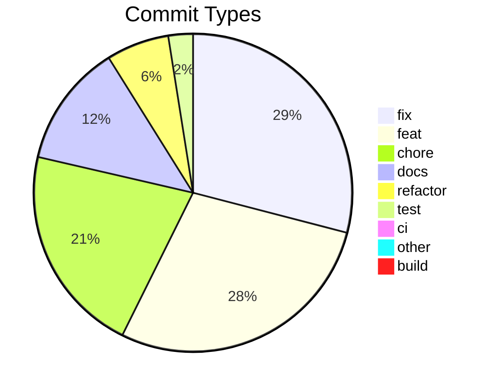

# Commit Change Log

Generated: 2026-07-20T21:42:23.996908+00:00
Total commits: 1181

## Commit Distribution

## Changes by Type

### Fixes (fix) — 337 commits

| Date | Scope | Description | Commit |
|------|-------|-------------|--------|
| 2026-07-19 | events | recover concatenated records across the audit read path (#409) | 1fceca45a7e3 |
| 2026-07-19 | events | recover concatenated records on the append-only event log (#405) | 94d0332831d5 |
| 2026-07-18 | triage | enforce record termination and recover concatenated records (#399) | 7a34d1adc132 |
| 2026-07-18 | fr-gate | reject declared requirement ids that exist in no spec (#398) | cad7dd0152be |
| 2026-07-18 | churn | admit test-traceability.json to the merge-conflict allowlist (#394) | 7b771b962d41 |
| 2026-07-17 | churn | stage ci-security.json in the regenerate follow-up commit (#389) | fe29df0b7683 |
| 2026-07-15 | iterate | pin finalize_iterate.py stdio to UTF-8 (cp1252 Windows crash aborted the finalize bundle) (#376) | c25d681a72ce |
| 2026-07-15 | churn | admit ci-security.json to the merge allowlist so iterate merges don't abort (#375) | fc3e48c3de7f |
| 2026-07-15 | test | stop the perf-check integration test leaking triage into tracked fixtures (#373) | af0187a9a981 |
| 2026-07-14 | sweep | stop the triage sweep silently destroying operator dismisses (#370) | 0d4a2026b925 |
| 2026-07-14 | sweep | drop the Python 3.13-only read_text(newline=) that broke every iterate on 3.11/3.12 (#367) | 88b520208cab |
| 2026-07-11 | run | record phase_completed per split for accurate multi-split durations (#362) | 70652aef7ed4 |
| 2026-07-08 | review | external-review gate fails loud on degradation + gpt-5.x param (#351) | 515d65086ccc |
| 2026-07-08 | iterate | remove stale hardcoded version from intro banner (#350) | f36a656208b5 |
| 2026-07-08 | scripts | update-marketplace.sh installs registered-but-missing plugins (#347) | 9ae9551f16f0 |
| 2026-07-07 | grade | change_traceability is n/a in local-only mode (no more false F) (#344) | 5357ad26a74f |
| 2026-07-07 | hooks | guard phase_session_start + self-heal the plugins/ cross-link cache (#341) | 458b4aa78751 |
| 2026-07-07 | security | drop accepted-risk GH-owned action-tags at the SARIF artifact producer (#336) | ab114c8c5cce |
| 2026-07-07 | run | surface-aware hand-off banner (CLAUDE_CODE_ENTRYPOINT) (#334) | 3f81def08667 |
| 2026-07-06 | grade | cap cold-repo Control Grade at B — A is authoritative-only (#333) | ea0e58a72ee6 |
| 2026-07-06 | compliance | diff-coverage is a graded/gated control, not "informational" on the dashboard (#332) | 5ce743a110a5 |
| 2026-07-06 | grade | calibrate the cold-repo projector so well-run OSS repos no longer grade F (G6) (#331) | 5c20a269b710 |
| 2026-07-06 | hooks | self-heal the shared/ plugin cache on marketplace installs (#326) | 130df1e1922d |
| 2026-07-06 | grade,adopt | strip surrounding quotes from path/URL input seams (#325) | c1280089588f |
| 2026-07-05 | grade | mode-aware honest-ceiling note; drop BP-2 codename (#323) | 79819b0afc30 |
| 2026-07-04 | grade | CTA explains adopt + next step, one hardened link (drop "certify") (#317) | 17afe47ffa25 |
| 2026-07-04 | security | prompt-scan matches code, not string/comment token text (#316) | 354cca7e0669 |
| 2026-07-04 | security | pr_review excludes generated artifacts from the diff before truncation (#314) | 913261ff68cd |
| 2026-07-04 | grade | tighten test-health tier-2 + URL-encode ref + stronger golden (G2 review follow-up) (#313) | fbc9bdce9e8f |
| 2026-07-03 | triage | route GitHub-triage appends to the outbox on idle main (#308) | e04a61d2a5d6 |
| 2026-07-02 | triage | surface prompt-injection regardless of Code Scanning + scan main on push (#306) | 01f43bfcbcfd |
| 2026-07-01 | compliance | make the Control Grade composition-neutral (drop the FR-tag-decline gate) (#304) | 9597c9b8ba80 |
| 2026-07-01 | triage | drop inline-suppressed SARIF results at the ingest layer (#302) | d2be654546c0 |
| 2026-06-30 | triage | quarantine orphan-status in the outbox sweep instead of hard-blocking (#303) | 33234ef43c90 |
| 2026-06-30 | security | strip zero-width Unicode (U+200B) from a planning note flagged by the prompt-injection scan (#300) | e04991c66e81 |
| 2026-06-30 | ci | pin ossf/scorecard-action by tag so publish stops failing (#297) | efca5737b380 |
| 2026-06-30 | compliance | UTC-normalize the RTM Verification Timeline Date column (#295) | 64f89aa45cb7 |
| 2026-06-29 | compliance | exempt items no longer flagged as deficits (bloat/tests/audit) (#292) | e8a9e53c1a75 |
| 2026-06-28 | compliance | maintainability grade anchor describes the check, not the label (#290) | e96a989ab04c |
| 2026-06-28 | compliance | SBOM dedup by installed version + honest license verdict (AR-04) (#286) | f4498bb30ccc |
| 2026-06-28 | compliance | fail-open + robust invocation for PreToolUse Bash gates (#278) | 01059128d910 |
| 2026-06-27 | security | remediate CodeQL findings + tailor the query suite to this repo (#276) | 6e7d956f1297 |
| 2026-06-22 | security | bump cryptography + ws to clear 3 high-severity dependency CVEs (#272) | d7cd255c7214 |
| 2026-06-20 | bloat | dedup bloat-gate Stop block across the plugin fan-out (#269) | 05992f878e7c |
| 2026-06-17 | bloat | anti-ratchet gate fails closed on a corrupt baseline (#264) | 045962260896 |
| 2026-06-17 | security | Tier-3 PR review fails closed on a truncated diff (#263) | 84aa059dbd1c |
| 2026-06-17 | compliance | clean Type column, skip-aware status, dashboard links (#258) | dab9c2fd7ea7 |
| 2026-06-15 | hooks | filter sentinel-run FAILs at the SessionStart phase-quality read path (#253) | e379c8cb1712 |
| 2026-06-14 | compliance | exclude degenerate sentinel-run snapshots from phase-quality rollups (#251) | 33cf8da31ef7 |
| 2026-06-13 | verifiers | pin CLI stdout to UTF-8 so reports don't crash on Windows cp1252 (#244) | 0dfae42697ea |
| 2026-06-13 | audit-3 | low-risk hardening — event-commit, report-escape, CI pipefail, test-discipline (WP11b) (#236) | 172e39d9ec5b |
| 2026-06-13 | bloat | marker writer keys delta off the worktree baseline, SSoT with the Stop gate (trg-537334f1) (#237) | 517ae21b73ab |
| 2026-06-13 | atomic-writes | fsync before os.replace in a shared durable-write primitive (#234) | 2c183c3b3c90 |
| 2026-06-13 | run | read run-config standalone flag without the unlocked legacy migration (#233) | ea51ffe55982 |
| 2026-06-13 | hooks | deliver block reason on the channel the event reads (WP4) (#229) | 7940d67bfd8b |
| 2026-06-13 | pipeline | atomic + lock-coordinated run_config writes; Stop-fallback timeout headroom (WP2) (#226) | de2df18ab60f |
| 2026-06-13 | pipeline | phase hooks resolve identity from stdin payload; atomic event dedup; failure event types (WP1) (#224) | a683d75bb779 |
| 2026-06-12 | compliance | coerce explicit-null affected_frs/new_frs in WorkEvent.from_dict (#220) | 332b64728fa1 |
| 2026-06-12 | compliance | W2 SKIPs on unresolvable run_id, mirroring the S2/S3 guard (#217) | 768c2a9c625a |
| 2026-06-12 | install | test-run python3 probe so Windows MS Store stub doesn't abort marketplace sync (#216) | 2da047b7c24a |
| 2026-06-12 | merge | merge=union for curated agent-docs (close the structural gap) (#213) | 9d2239c6b033 |
| 2026-06-12 | triage | union-residence GC recompute + source-derived drift meta-test (a1-6/F19 follow-up) (#208) | 6a3b4b0ea343 |
| 2026-06-12 | compliance | scope arch-drift checkers to event-owned drops (#207) | 2d983794d565 |
| 2026-06-12 | config | BOM-tolerant read_config + integrate_main commit-failure tests (#210) | 1cbc1ff0163e |
| 2026-06-12 | iterate | serial integrate_main merge for campaign/parallel iterates (auto-merge churn fix, Option A) (#212) | 49cef1b1bd4f |
| 2026-06-12 | utf8 | pin UTF-8 on git-reading subprocess decodes (deep-audit WP7) (#202) | 9e39bfb2b89d |
| 2026-06-12 | hooks | canonical project-root/worktree resolvers + drift project guard (deep-audit WP5) (#200) | 99fd75ef3bc8 |
| 2026-06-12 | iterate | UTF-8 config readers + errors=replace on F0.5 runner decode (deep-audit WP8) (#203) | d74530ffa79e |
| 2026-06-12 | churn | UTF-8-strict git I/O + structured commit-failure handling (deep-audit WP6) (#201) | 1752b9f985ea |
| 2026-06-12 | installer | POSIX shell-script fixes — set -e counters, uv PATH, alias, python resolver, dotenv parse (deep-audit WP10) (#205) | 1fd0c2e759f9 |
| 2026-06-12 | triage | harden GC tokens/TOCTOU, control-char sanitizer, outbox CLI (deep-audit WP9) (#204) | 312e2429176f |
| 2026-06-12 | compliance | make Group H + S4 FR-preservation gates fire (deep-audit WP3) (#199) | 6b16e8f42715 |
| 2026-06-12 | triage | route idle-main status flips to the outbox in mark_status (#198) | 57ee522ea55c |
| 2026-06-11 | security | tolerate markdown-fenced JSON in pr_review parser (#196) | e3b965569017 |
| 2026-06-11 | compliance | security-scan gate ignores trigger keywords in quoted args | 42c32a3159bf |
| 2026-06-11 | iterate | repo-relative campaign spec_path (N1, trg-196f4aa6) | 8f551bc25db8 |
| 2026-06-11 | iterate | bloat Stop-gate reads a file's ceiling from the worktree baseline it measures, not main | e1e555dc72cb |
| 2026-06-11 | iterate | tolerate markdown emphasis in campaign skeleton; backfill verify (campaign S4) | 20feee5b2c09 |
| 2026-06-10 | triage | pin triage_cli list stdout to UTF-8 — cp1252 console crash on non-ASCII items | 2d53d3960957 |
| 2026-06-10 | tests | exempt full generated agent-doc cache trio from canon lint | 3544da31e17d |
| 2026-06-10 | tests | gate D2V evidence write behind an opt-in env var | ef70f5cce30c |
| 2026-06-10 | triage | dedup_triage_lines collapses same-id appends keep-last | 6f8d0fc70482 |
| 2026-06-09 | gitignore | re-exclude transient external-review markers under planning/iterate/ | 1d0d67e70e9e |
| 2026-06-09 | compliance | relocate detective-audit JSON under .shipwright/compliance/ so the gitignore canon covers it | 79fcde8c865f |
| 2026-06-09 | infra | idle-main artifact hygiene — complete ADR-089 for two stragglers | 1f7f0ceff292 |
| 2026-06-08 | test | unset $CI for sweep/D2V suites so the real sweep runs in CI | 40cdf6f0e828 |
| 2026-06-08 | triage | D3 review cascade — seam test, fail-soft decode, sweep-skip observability | 45ce44900ed9 |
| 2026-06-08 | triage | harden D2 sweep/GC (LF outbox, GC-by-id, exactly-once proof, staged-diff gate) | b8fcf8ae0342 |
| 2026-06-08 | triage | residence-derived mark_status + reroute idle-main appenders (D1 review cascade) | 8b36e7dcecdb |
| 2026-06-08 | test | make the self-heal rollback hook executable for Linux CI | ec40d4adce90 |
| 2026-06-07 | triage | reconcile-and-commit main-tree triage.jsonl drift before FF/pull | 73eed9d41449 |
| 2026-06-07 | security | allowlist cafebabe:deadbeef in generated gitleaks config (GAP-3) | 22f78c572c80 |
| 2026-06-07 | compliance | distinguish SBOM 'not installed' from 'no declared license' | 1e09b96e2917 |
| 2026-06-07 | iterate | harden finalization/verification tooling (3 fixes from the prior run) (#165) | 4718f6c13921 |
| 2026-06-07 | adopt | scaffold .gitleaks.toml allowlist + harden security.yml.template | 418a81658f31 |
| 2026-06-07 | triage-gc | GC machine-churn complianceRefreshed backlog dismissals | 1338052864a7 |
| 2026-06-06 | compliance | F5 architecture-drift uses content reconciliation + canon F11 gate | c58e7aa02310 |
| 2026-06-05 | triage | C1 preservation tests assert no-reflow, not byte-level CRLF | c22ac1c3c06f |
| 2026-06-05 | triage | scaffolder self-heal preserves content + line endings (external review, C1) | 71c5577ff383 |
| 2026-06-05 | evidence | record A's unit suite as 617/617, not 617/627 (external review) | de77c5fc7e44 |
| 2026-06-05 | triage | two-pass triage validator — order-independent (external review, C2) | bad7d909325f |
| 2026-06-05 | triage | reword GC machine-set comment to satisfy artifact-path-canon (B) | 76b067bc9606 |
| 2026-06-05 | triage | scaffolder fallback also ignores triage.jsonl.bak (C1, Codex LOW) | 39ddc7c35410 |
| 2026-06-05 | triage | address Codex code-review findings on triage_gc (B) | 6334d902012f |
| 2026-06-05 | triage | address Codex code-review findings on the churn resolver (C2) | b7559a2ec639 |
| 2026-06-05 | security | fail closed on a degraded scanner leg via scan_errors marker | 4ec64a29fa47 |
| 2026-06-05 | compliance | SBOM cluster dedup-key = signature + manifest_type only | 53ccf300c5b2 |
| 2026-06-05 | compliance | B7 excludes non-functional commit types (Rule E) | a611fc8dd9fc |
| 2026-06-05 | hooks | make the bloat marker + Stop gate worktree-aware (trg-305e2aab) | 9282ef267871 |
| 2026-06-05 | security | read gitleaks report from a file, not stdout | 4a27c374ed3c |
| 2026-06-05 | iterate | enforce FR-gate on finalize write-path + same-event D3 (C3) | 2b0fb66cf115 |
| 2026-06-04 | hooks | scope bloat recorder to the project root (no cross-repo marker leak) | e1ce915dddf9 |
| 2026-06-04 | adopt | security-gate counts criticals by rule-level SARIF severity + blocks secrets, fail-closed | 41372faa7c63 |
| 2026-06-03 | compliance | B7 recognizes chore(release) as tracked-phase output (sub-iterate B) | 2fa549541b62 |
| 2026-06-03 | compliance | realign detective audit with Run-ID/release model + A5 invocation (C1+C2) | f688c391bcdb |
| 2026-06-02 | hooks | dedup SessionStart Phase-Quality injection to once-per-event (#140) | f75a03901ddc |
| 2026-06-01 | compliance | detective audit honors event_amended corrections | 470404c809a4 |
| 2026-06-01 | iterate | deterministic integrate merge + CI-robust integrate tests | 2f1687c1ec3b |
| 2026-06-01 | canon | drop legacy-path token from resolver docstring | 0ef2b7f0a195 |
| 2026-06-01 | iterate | auto-reconcile churn-artifact merge conflicts (events=union + resolver) | 7bbb6b57721a |
| 2026-06-01 | compliance | D5 change_type exemption + per-project disabled_checks gate | 7522a7081c2f |
| 2026-06-01 | security | diff-mode prompt-injection scan honors self-reference/skip excludes | 6c523b575a42 |
| 2026-06-01 | iterate | write plugin-sync Stop-hook triage item to durable main-repo log (#130) | 0c15e9a6df64 |
| 2026-05-31 | canon | mark triage_bundle.py compliance-word literals as non-path | 4c77369fa004 |
| 2026-05-31 | deploy | reject Windows absolute client.entrypoint on any host OS | ea0db8d24483 |
| 2026-05-31 | shared-tests | make shared/tests CI-green on Linux (cross_plugin marker + Windows-only skip) | 4d14ac96201d |
| 2026-05-31 | compliance | collapse compliance triage into one rolling backlog action-unit | 448b0580cdb7 |
| 2026-05-31 | shared-tests | unmask os.name-fake crashes on non-native CI + portable spawn flag | 2742e46a9350 |
| 2026-05-31 | ci | make arch-impact sanity test CI-aware (skip on clean checkout) | 81d840769752 |
| 2026-05-31 | compliance | render unengaged phases as SKIP on the phase-quality dashboard | 19cc2ca8ad1e |
| 2026-05-31 | compliance | collapse phase-quality triage into one rolling backlog action-unit | 527fc4b718f9 |
| 2026-05-31 | iterate | record spec_impact_justification on the work_completed event | b3ab00273b26 |
| 2026-05-31 | canon | resolve compliance + planning artifact-path-canon failures on main | 658198fbe220 |
| 2026-05-31 | iterate | point iterate-history adr field at the run_id so F11 resolves the decision-drop | 2ef5e0abcd6b |
| 2026-05-30 | iterate | use run_id as decision-drop ADR identity in iterate entry | 5fc34c27b756 |
| 2026-05-30 | compliance | resolve versioned CLAUDE_PLUGIN_ROOT so phase-keyed Stop hooks fire | b919f7db81de |
| 2026-05-30 | adopt,project | propagate canonical .shipwright gitignore block to consuming projects | 60120fbb1f30 |
| 2026-05-30 | compliance | RTM status from latest tested event; untested 0/0 events neutral | 76a3b12b4f9f |
| 2026-05-29 | hooks | suggest_iterate UserPromptSubmit output must set hookEventName | 6f79d47b9e9e |
| 2026-05-29 | hooks | clear bloat anti-ratchet at baseline current, not raw limit | 4adfd4441725 |
| 2026-05-29 | hooks | key bloat marker off stdin-payload session_id, not env | a447fc625b71 |
| 2026-05-29 | iterate | ship work_completed event in the PR via per-tree events.jsonl | 4eb6b1a90528 |
| 2026-05-29 | meta | refresh artifact-path-canon ALLOWLIST for Campaign A/B aftermath | 9d9b1e57c247 |
| 2026-05-27 | iterate | correct iterate_history adr field to run-id form | 36375a6408d3 |
| 2026-05-27 | iterate | runtime/snapshot split for agent-doc trio + hard-gated finalize repair | 54ecb17512c2 |
| 2026-05-25 | hooks | drop invalid hookSpecificOutput wrapper from Stop hook (#87) | f6bca09d9b57 |
| 2026-05-25 | bloat | skip tests/fixtures/ and __fixtures__/ in scan walker | ea2f6110eb12 |
| 2026-05-23 | compliance | pin SBOM Python-license resolver to per-manifest .venv METADATA | fc1a7a86cffb |
| 2026-05-23 | meta | resolve architecture.md merge-conflict + allowlist security helper | 9e26a9c5e41b |
| 2026-05-23 | architecture.md | forward-reference upcoming security-adopt follow-up | 93c0fcb75561 |
| 2026-05-23 | compliance | snapshot audit must walk worktree branch lineage | e178b7c657c1 |
| 2026-05-23 | verifier | F11 verifier multi-commit-aware via run_id lookup (#74) | 6fcffc01570d |
| 2026-05-23 | iterate | F7b seals tracked event-log appends to prevent silent reset wipe (#71) | e758ea876105 |
| 2026-05-22 | security | inline nosemgrep on shell=True line (semgrep flags kwarg, not call) | 69319684056a |
| 2026-05-22 | security | place nosemgrep directly adjacent to flagged line | eeab07c9d2e5 |
| 2026-05-22 | security | hoist github context to env in security workflow (semgrep run-shell-injection) | 81fdc7c0c687 |
| 2026-05-21 | meta | deterministic render timestamps from max(event.ts) (#66) | 8382ff90bbb2 |
| 2026-05-21 | triage | gate gh-security action-unit emit on artifact stub in test fixture (#54) | f4a1ff11636e |
| 2026-05-21 | build | section-builder.md JSON examples conform to result schema (#51) | 823225e0942c |
| 2026-05-21 | meta | post-#43 hygiene — promote escape-cell drift test + allowlist test_results.json (#45) | 3b34fcaeb502 |
| 2026-05-21 | shared | escape pipe and newline in markdown table cells (#43) | 46b9ac47da28 |
| 2026-05-19 | iterate | resolve decision-drop directory against the main repo (worktree-aware) | 0d4d3d61e3c0 |
| 2026-05-19 | hooks | make file-size guard a non-blocking crossing-only nudge | c76c9bec8451 |
| 2026-05-18 | verifiers | recognise drop-dir changelog, adopted spec path, iterate/adopt completion evidence | 40599dee30bf |
| 2026-05-18 | ci | harden activated workflows — scanners, CI-aware test, CodeQL guard | d85210f9cc36 |
| 2026-05-18 | hooks | resolve a real Python interpreter + fix 17 launch-blocker test failures | 21cef22325f6 |
| 2026-05-16 | triage | canonical drift dedup keys + drift/F0.5 auto-resolve | 2f6794b8af53 |
| 2026-05-16 | adopt | seed External Review on; drop dead plan-config key | 3f5777d8b94f |
| 2026-05-16 | iterate | worktree-aware event-log resolution | 34a79879a54d |
| 2026-05-15 | compliance | worktree-aware RTM data collection | ea24bf4284d2 |
| 2026-05-11 | triage | path-canon allowlist + use _AGENT_DOCS_DIRNAME constant | 734bba94d211 |
| 2026-05-11 | triage | address external code review HIGH + MED findings | 0229b4c3b9f2 |
| 2026-05-11 | test-hygiene | lazy pytest import so CLI runs without pytest installed | 905bbde7788c |
| 2026-05-10 | hooks | Stop and SubagentStop hooks emit schema-compliant stdout | 9c8f9aa16770 |
| 2026-05-09 | adopt | scanner requires comment-context; remove dead save_session_config | f8d44da5da28 |
| 2026-05-07 | plugins | convert PreToolUse/PostToolUse matcher to string form for Claude Code 2.1.132+ schema | 99fc87bdb26f |
| 2026-05-07 | plugins | wrap hooks.json under top-level hooks key for Claude Code 2.1.132+ schema | 276e8f650a40 |
| 2026-05-06 | test | hooks-consistency parser handles quoted-path commands | c5e6cb30c428 |
| 2026-05-06 | canon | post-migration cleanup — 9 canon tests now green | 7383c185a35c |
| 2026-05-06 | loader | external_review_config deep-merges per-project iterate config | 49eca252153b |
| 2026-05-05 | verifier | accept drop-directory entries and dashboard short-SHAs | f1f04478d613 |
| 2026-05-05 | adopt | write shipwright_iterate_config.json during onboarding | f4f7229a5d37 |
| 2026-05-05 | compliance | FR-table parser accepts 5-col adopt format (ADR-031) | 656f96f2fe0e |
| 2026-05-05 | iterate | suggest_iterate hook is plugin-owned, retire hook_installer (ADR-030) | a05ff22ccc6b |
| 2026-05-04 | iterate | runner contract mandates self-review + calibration (extends ADR-029) | fb466b0aeafa |
| 2026-05-04 | test | scan_specs comment uses canonical .shipwright/planning path | 932d7bd17ec5 |
| 2026-05-04 | iterate | review-driven hardening (ADR-028) | 5415ed68584d |
| 2026-05-03 | changelog | detect Git-Bash MSYS path-mangling in drop bullets (ADR-023) | a13fd64294f3 |
| 2026-05-03 | env | strip UTF-8 BOM in parse_env_file (Windows Notepad scenario, ADR-021) | 71c47c350763 |
| 2026-05-03 | hooks | quote ${CLAUDE_PLUGIN_ROOT} in plugins/*/hooks/hooks.json | 6ca369d948c0 |
| 2026-05-03 | env | strip inline `# comment` from parse_env_file values (latent bug, ADR-021) | 1a9c7f48079f |
| 2026-05-03 | adopt | quote suggest_iterate hook path + upgrade legacy entries (Shape + command) in place | b24f804b1d89 |
| 2026-05-02 | adopt | write canonical matcher-group shape for UserPromptSubmit hook | 1ddf9ae549c2 |
| 2026-05-02 | adopt | drift detection, test-fixture filter, compliance fallback (Iterate 2 of 2) | cffe191e793c |
| 2026-05-02 | adopt | brownfield ADR numbering + H3 canon for parser round-trip | 63352ff7e3ff |
| 2026-05-01 | ci | add canonical id to Critical-Findings step in security.yml | ca77b64b0736 |
| 2026-05-01 | tests | close 3 pre-existing canon-lint + assertion gaps from e273104 | b889c380cb94 |
| 2026-05-01 | iterate | close spec/architecture skip loophole for additive features | 5979d9d97ff4 |
| 2026-04-30 | crawler | page-isolation + smart API mock + locator timeouts | 631592956571 |
| 2026-04-30 | crawler | SPA-aware route discovery + screenshot stability | 2d65401b6a41 |
| 2026-04-30 | scripts | file-copy fallback when plugin mirror is a real dir (Windows) | 2d7a4758ac74 |
| 2026-04-30 | compliance-tests | use canonical .shipwright/compliance/ in fixture + assertion | 93fa8205df3c |
| 2026-04-28 | integration-tests | resolve sys.modules['lib'] collision in compliance test | 7e8c387742db |
| 2026-04-27 | plan | defensively validate planning_dir shape in generate-batch-tasks | 342143466686 |
| 2026-04-26 | adopt,shared | route_crawler spec path must use forward slashes | f5fd75042737 |
| 2026-04-26 | docs,templates,deploy | close 14 review findings from Replit-cascade | 48b1e56c49da |
| 2026-04-26 | adopt,shared | external-review fixes + realistic e2e verification | eb224df1e37a |
| 2026-04-26 | adopt | honest awareness — gitignore + additive merge + enrichment guards | fd0888553d19 |
| 2026-04-26 | adopt | never silently destroy load-bearing user files | 95b0df6ffeba |
| 2026-04-26 | adopt,shared | crawler robustness + failure observability | 675247ed3b82 |
| 2026-04-26 | adopt,shared | repair Windows + multi-service crawl pipeline | 48a7ca51a15c |
| 2026-04-26 | security,ci | grant actions:read for upload-sarif@v3 | 290a91c2d112 |
| 2026-04-25 | adopt | broaden Step B.5 crawl gate to admit profile + multi-service signals | f4642ae88181 |
| 2026-04-25 | run | post-merge banner + security-default polish for multi-session | a9396e113b7f |
| 2026-04-25 | run | code-review follow-ups for F4-F6 (internal + external review) | 086cdbda3634 |
| 2026-04-24 | webui | hono server — loud bind errors via formatBindError | d6136dc1f7e7 |
| 2026-04-24 | webui | dev-restart — computeKillTargets helper, drop hardcoded 5177 | 817a2cb4352a |
| 2026-04-24 | webui | tasklist-card-width — drop max-w-[90%] so it matches ToolCard | c3696e9a1d7c |
| 2026-04-24 | webui | hide last-prompt events from chat — pure noise | 864c9e7f521c |
| 2026-04-24 | webui | align changelog entry with v0.3.0 drop-pattern convention | efd020751a52 |
| 2026-04-24 | webui | system-pill-filter — hide custom-title/agent-name/permission-mode by default | b2dcc3cb5b49 |
| 2026-04-24 | webui | chat-bubble-padding — widen horizontal inset from 22px to 40px | 593cc2362bcd |
| 2026-04-24 | webui | status-stuck-on-awaiting-launch — re-launch flips back to active | 26f999f812e4 |
| 2026-04-23 | webui | tasklist-light-theme — switch TaskListCard from dark to light bg | 07850845b849 |
| 2026-04-23 | webui | skillcard-and-code-bg — unwrap array content + anthracite code | 6ae940bda7d6 |
| 2026-04-23 | webui | mermaid-render-loop-fix — stabilize ReactMarkdown config identity (real cause was poll-driven remount) | 23008e95b824 |
| 2026-04-23 | compliance | reference audit report path in Group C iterate suggestion | 74800735b621 |
| 2026-04-23 | webui | mermaid-flicker-fix — move content-hash memo to DOM dataset for StrictMode resilience | 478212e37eeb |
| 2026-04-23 | webui | resume-cwd-prefix — extend cd prefix to legacy buildCopyCommands (Resume/Fork parity with Launch) | b76ab77a7938 |
| 2026-04-23 | webui | mermaid-in-markdown — render language-mermaid fences as SVG diagrams | 8ea55e563f98 |
| 2026-04-23 | security | force UTF-8 subprocess IO so Semgrep SAST runs on Windows | 40c7164b6338 |
| 2026-04-23 | security | default scanner exclusions so OSS backend does not time out on node_modules/.venv (#10) | 7eeef2a234f3 |
| 2026-04-23 | webui | launch-cwd-prefix — shell-aware cd injection so pasted commands run in project root | a524ed207a35 |
| 2026-04-23 | webui | cli-flag-fix — command template used --project-root, not a real Claude CLI flag | 41e0d888d37a |
| 2026-04-23 | webui | shell-line-continuations — flatten copy command for PowerShell/cmd | 00b2bb828435 |
| 2026-04-23 | webui | launch-command-wiring — route copied stub command, phase not persisted | 1b65b2c057b8 |
| 2026-04-20 | webui | omit --session-id on plain resume (CLI 2.1+ rejects the combo) | 1ae0aaffea63 |
| 2026-04-18 | webui/chat | AskUserCard multi-select + notBlocked banner + switch timeout | 1058c73f1c05 |
| 2026-04-18 | webui/chat | UAT round 2 — new-task model, ghost bubble, resume UX, 409 retry | e742e79f0239 |
| 2026-04-18 | webui/chat | mid-task model switch UX + spawn indicator + empty-prompt guard | df364fa647a9 |
| 2026-04-18 | webui/e2e | correct TaskDetailPage URL in sub-iterate A spec | a752083636de |
| 2026-04-18 | webui/chat-settings | sub-iterate C — unify model state to concrete CLI ids | 9bd97d46964d |
| 2026-04-18 | iterate | ensure external review runs on Resume for medium+ iterates | ae42d6fcb1d5 |
| 2026-04-17 | iterate14.14 | post-14.13 bug sweep (4 bugs) | 2736734344f7 |
| 2026-04-17 | iterate14.13 | send concrete model id + spawn/switch UX indicators | 5452fb634438 |
| 2026-04-16 | iterate14.10 | opus 4.7 correct id + auto mode CLI mapping + askusercard pause resume | 1ff459c7d6ad |
| 2026-04-16 | iterate14.8.1 | filterbar phase drift + priority removal + modebadge inline | 611c079396c1 |
| 2026-04-16 | iterate14.8.0 | kanban phase mapping wire-through + sensible defaults | 901f860a59e1 |
| 2026-04-15 | iterate14.7.0 | task persistence + all-projects view + reload state | 722f96251c4f |
| 2026-04-14 | webui,shared | iterate 12.0b — zombie-task reconciliation | 444935ef844b |
| 2026-04-14 | webui,plugins | revert inbox filter to latest-pending + expand phase dropdown | 10c43bb51532 |
| 2026-04-14 | webui | drop /think slash prefixes — Claude CLI 2.1.1 removed them | 9f1080b77401 |
| 2026-04-14 | webui,iterate13.1 | suppress markdown fallback after resolved AskUserQuestion | 2a2d4cc9a404 |
| 2026-04-14 | webui,iterate | iterate 11.3 — first-pending inbox + replay timestamps + iterate-aware handoff | b41f68a582de |
| 2026-04-13 | webui | inbox shows latest pending per task (revert iterate 11.1 zombie filter) | d02a8ff72c8e |
| 2026-04-13 | webui | inbox dedupe by normalized question + zombie-task filter (ADR-024) | 527662c116f4 |
| 2026-04-13 | webui | revert iterate-7 tool_result stdin + inbox filter + model selector + finalization verifier | d3c57aad7ba5 |
| 2026-04-13 | webui | lock concurrent JSON writes (projects, pids, inbox, settings) | 81b5a12ad81e |
| 2026-04-13 | hooks | filter shipwright runtime-artifact dirs from drift check | 24cf717e06f7 |
| 2026-04-13 | webui | inbox projectId + chat-history replay + collapse AskUserQuestion noise + model/effort wire-through | 72512480cb46 |
| 2026-04-13 | webui | persist task_cancelled/work_completed/task_updated to events.jsonl | 3bc9f85ea557 |
| 2026-04-13 | webui | inbox answers send tool_result block + immediate Thinking + plugin scope + ADR budget | b589aaf4e7ae |
| 2026-04-13 | webui | TaskHeader redirects to kanban board after Close/Delete | 6366e7cd8ccd |
| 2026-04-13 | webui | fatal startup errors (EADDRINUSE) must exit for tsx watch to retry | 8f36d400bb90 |
| 2026-04-13 | webui | reset displayContent per turn + inbox id=toolUseId + dev-restart helper | ac5784772dc1 |
| 2026-04-13 | webui | correct AskUserQuestion schema + orange accent + thinking label + restart note | 314e8689d863 |
| 2026-04-13 | webui | kill chat duplication at the root + AskUserCard redesign + classifier tiebreak | ceb72a0bdedb |
| 2026-04-13 | webui | AskUserQuestion card renders schema + dedupe double-render | 5e27b1ef1cce |
| 2026-04-13 | webui | tool call cards transition Running→Done in place | 8502a0830a4d |
| 2026-04-13 | webui | phase dropdown now authoritative in both start paths | 37e7d1a978cb |
| 2026-04-12 | hooks | post-test iterate fallback + broken classify import path | 8611c5ce23e0 |
| 2026-04-12 | webui | compact task header + tighter chat top padding | 646475164d01 |
| 2026-04-12 | webui | permission popover closes on select, user bubble darker | 004ce3527a49 |
| 2026-04-12 | webui | white claude cards, grey user bubble, VS Code permission modes | 5a6bf4d942c7 |
| 2026-04-12 | webui | persistent Claude process via --input-format stream-json | ff4158a9f48d |
| 2026-04-12 | webui | flat chat, markdown tables, earlier streaming indicator | 09a5f92348cf |
| 2026-04-12 | webui | chat rendering matches mockup 11 — avatars, tool tiles, no horizontal scroll | ad24a33e2bd5 |
| 2026-04-12 | webui | interactive chat via re-spawn with --resume | b85830a8bc55 |
| 2026-04-12 | webui | task lifecycle events — start transitions kanban status, exit completes task | 5e9355e1c200 |
| 2026-04-12 | webui | kanban columns scroll vertically when tasks overflow | 032bc2e60524 |
| 2026-04-12 | webui | add min-h-0 to enable scroll on kanban board container | 6a7226922695 |
| 2026-04-12 | webui | enable page scrolling when tasks overflow viewport | c057ed40f142 |
| 2026-04-12 | webui | bridge hardening — cross-platform stability | 238437cfe98a |
| 2026-04-12 | webui | bridge working — Claude CLI spawns, responds, files created | 7eebcdde063b |
| 2026-04-12 | webui | CLI prompt sends title+desc, server crash fix, Windows auto-start | f61972b85a8f |
| 2026-04-12 | webui | test phase — title/desc split, autonomy refactor, model display, start button | 4c05570c3b36 |
| 2026-04-11 | webui | PATCH URL, card menu Close+Delete, chat error handling | ed1aa43d94b6 |
| 2026-04-11 | webui | task creation ENOENT fix + project delete button | f18d6e120a82 |
| 2026-04-11 | webui | task creation works, project dir initialized, keyboard shortcut fixed | 82917adf40ea |
| 2026-04-11 | webui | task creation resilience + install.sh + guide + CRUD tests | 23c78e799575 |
| 2026-04-11 | webui | UI test findings — logo, naming, wizard, shadows, dropdown, shortcuts | 4a468d094cd7 |
| 2026-04-11 | e2e | use precise locators and handle backend-absent state | 55f34e63a0d6 |
| 2026-04-11 | webui | resolve visual mockup deviations and 10 dead-write persistence gaps | 00798cb9dd7d |
| 2026-04-11 | — | visual_compare parsing, pipeline order, compliance logging, preview hints | 7d436c53fdba |
| 2026-04-11 | build | derive branch name from session-id instead of section name | a642df423493 |
| 2026-04-11 | iterate | add design mockup references to early pipeline steps | 3ad1881b00fc |
| 2026-04-11 | iterate | add design mockup references to early pipeline steps | c8c792fd9d3d |
| 2026-04-11 | server | replace __dirname with ESM-compatible import.meta.url | 7cb6436fbc81 |
| 2026-04-11 | plan | add Design Reference blocks to section specs and batch generator | a335bc649152 |
| 2026-04-11 | build | section-aware event dedup and dashboard config fallback | e64e1bdb8cdb |
| 2026-04-10 | — | cross-plugin symlinks in cache + iterate compliance path | 1451bb06a389 |
| 2026-04-10 | — | cross-plugin symlinks in cache + iterate compliance path | b49460fb64ec |
| 2026-04-10 | — | sync shared/ directory to plugin cache in marketplace update | 495626be6af9 |
| 2026-04-10 | pipeline | add consistency fixes for Project, Plan, Design phases | cec3137fb485 |
| 2026-04-10 | design | make review viewer localStorage keys project-specific | d1d94c2dac95 |
| 2026-04-09 | compliance | add baseline failure support to test evidence report | eaa466ac893b |
| 2026-04-08 | i18n | replace German text with English in all user-facing files | 6adf34864402 |
| 2026-04-06 | compliance,dashboard | stale test status, evidence order, baseline failures | e80214fb1319 |
| 2026-04-05 | iterate | add CHANGELOG, build dashboard, auto-merge, and verification gate to finalization | e167d1fd0d31 |
| 2026-04-05 | scripts | update-marketplace.sh uses full file sync instead of version check | 67f0fe4d7c34 |
| 2026-04-04 | — | test evidence Playwright section after Full Suite Runs + config JSONL skip | 1d38cd05e414 |
| 2026-04-04 | — | add HTTPS fallback to update-marketplace.sh for SSH failures | 1359f8e5092c |
| 2026-04-04 | — | revert skill dir rename, keep install.sh security+preview fix | 105209a7e151 |
| 2026-04-04 | — | rename skill dirs to full plugin name for clean slash-command display | 8d90e9aa64d9 |
| 2026-04-03 | — | migrate all hooks.json to new Claude Code format + rename skill dirs | 1683eba7ae94 |
| 2026-04-02 | readme | remove hallucinated URL from constitution attribution | 082a4daf5664 |
| 2026-04-02 | shared | tag archived sections with split name for dashboard grouping | e71771442bf5 |
| 2026-04-02 | shared | use run_config as authoritative source for phase and split state | 519107f1746a |
| 2026-04-02 | docs | correct hook filenames, add missing security plugin and session configs | a91f437bfb4c |
| 2026-04-02 | hooks | only track tool calls in Shipwright projects | e8788174ebc7 |
| 2026-04-02 | supabase | fix migration push failures and add setup guardrails | 195f06a49a53 |
| 2026-04-01 | pipeline | stale artifacts, pipeline order, and pipeline constants | ac464712c73b |
| 2026-04-01 | plugins | add --project flag to uv run for correct dependency resolution | 025a04feb557 |
| 2026-04-01 | hooks | set SHIPWRIGHT_PROJECT_ROOT in session hooks, add test phase detection | a592b30b8448 |
| 2026-03-31 | pipeline | test completion gate, counter reset, and pipeline constants | e9b68e0dae23 |
| 2026-03-31 | pipeline | stale artifacts, pipeline order, and toolcall counter path | 0322a77d866c |
| 2026-03-30 | build,compliance | persist test results and read all splits in compliance | dca957000529 |
| 2026-03-30 | compliance | fix dashboard links, remove traceability flow and cost summary | b37b9f59c12f |
| 2026-03-30 | env | ensure .env.local is gitignored before creation | eb30a6554d80 |
| 2026-03-28 | — | unignore plugins/shipwright-build/skills/build/ directory | 39899c7ada95 |
| 2026-03-28 | compliance | read pipeline phases dynamically from run config | 45d9483ce6c6 |
| 2026-03-28 | — | add missing design phase to orchestrator pipeline in SKILL.md | d020dfe87328 |
| 2026-03-21 | — | use descriptive skill folder names to avoid slash command stuttering | 9a55e863cac8 |
| 2026-03-21 | — | revert skill folders to skills/shipwright-{name}/ (matching upstream) | a01be3c8bb13 |
| 2026-03-21 | — | use short skill names in SKILL.md frontmatter | f02346755760 |
| 2026-03-21 | — | rename skill folders for clean slash commands | 5a8d77658fab |
| 2026-03-20 | — | update README attribution to svenroth.ai | dd5de7f7d6ab |

### Features (feat) — 328 commits

| Date | Scope | Description | Commit |
|------|-------|-------------|--------|
| 2026-07-20 | traceability | answer "which changes touched this requirement" from the event log (campaign S7) (#415) | 18905d576514 |
| 2026-07-19 | templates | ship the action-pinning posture RULE to adopters, gated both ways (#407) | e336197ca8e9 |
| 2026-07-19 | compliance | converge accepted risks onto the code-scanning surface (#406) | de9cd073b991 |
| 2026-07-18 | compliance | scanner-agnostic accepted-risk register, gated both directions (#404) | 4a948378b207 |
| 2026-07-18 | iterate | CI supply-chain risk flag with a recorded-acknowledgement gate (#401) | 7c303a8b3410 |
| 2026-07-18 | traceability | resolve tagged FR ids through the spec FR-Fold-Map (#397) | 4fe2d680ae1e |
| 2026-07-18 | fr-authoring | plain-language capability-level FR rules + advisory hygiene audit (#395) | 29d09188e1dd |
| 2026-07-17 | agent-docs | canonical run_id changelog anchor + shape gate; kill aggregator ADR dup (#391) | 00174d952230 |
| 2026-07-17 | traceability | backfill 189 plugin/shared @FR tags + config-aware TT5 gate (STEP 1) (#390) | a419ce461f8c |
| 2026-07-16 | compliance | config-driven test_roots for the test_links collector (#387) | 853a45217dc6 |
| 2026-07-16 | adopt | establish the requirement->test traceability baseline at onboarding (TT7) (#385) | a85c22cdbad6 |
| 2026-07-16 | traceability | shared backfill_test_links engine — map existing tests to FRs (TT6) (#384) | 0edb3dbcab46 |
| 2026-07-16 | iterate | enforcing F11 traceability gates — removal→orphan + change→cross-layer (TT5) (#383) | 0cec0f8e15b8 |
| 2026-07-16 | iterate | TS/JS silent-skip ban + quarantine-with-expiry hygiene gate (traceability TT4) (#382) | 2c70a4ba6653 |
| 2026-07-16 | compliance | layer-aware RTM + D-orphan/D-layer detectives + D1 hardening (traceability TT2) (#381) | 61646d3bd22f |
| 2026-07-16 | traceability | declare required_layers per FR + adopt surface-inference (TT3) (#380) | bbb19a1e7123 |
| 2026-07-16 | compliance | per-test execution-evidence reader -> execution-backed coverage (TT-EV) (#379) | 188af9ad5bbe |
| 2026-07-16 | compliance | test_links collector + test-traceability manifest + @FR tag convention (TT1) (#378) | c8767470fada |
| 2026-07-15 | traceability | freeze requirement->test contracts + panel-verified harness (P1) (#377) | e74d8090758e |
| 2026-07-15 | iterate | bundle the finalize F1/F3/F4/F5c/F5b LLM round-trips (#374) | d36f61dcf464 |
| 2026-07-14 | grade,adopt | version the two artifacts the Command Center renders, and anchor the bump gate in git (#368) | 9def63904619 |
| 2026-07-11 | iterate | fold per-phase durations into work_completed for the WebUI Iterate-Rail (M-Pre-1 iterate half) (#363) | a710b4167114 |
| 2026-07-11 | iterate | adopt brief-intake reuse + plain-language banner bank (B5) (#361) | 64f197ba0015 |
| 2026-07-11 | run | accept a pre-filled WebUI-wizard brief, ask only what's missing (K2c) (#360) | 0e55235aebf0 |
| 2026-07-11 | compliance | grade_snapshot event per Control-Grade regen for the WebUI grade trend (M-Pre-3) (#359) | 16b1da8888bd |
| 2026-07-11 | iterate | persist session plan as gitignored <run_id>.plan.json for the WebUI Plan-Card (#358) | 4c26a0debd2c |
| 2026-07-11 | run | emit phase_started + paired phase_completed at pipeline phase entry/exit (M-Pre-1) (#357) | a087173639e5 |
| 2026-07-10 | iterate | CLAUDE.md keep-it-lean rule + 30-line net-growth gate (#356) | 5b4bd3002805 |
| 2026-07-08 | run | single-session is the default + sole pipeline mode; deprecate multi-session (SS8) (#353) | 78603ae28f50 |
| 2026-07-08 | run | single-session resumability, recovery & observability (SS5) (#349) | abfb485bfb75 |
| 2026-07-07 | grade | public github.com URL defaults to network enrichment (#346) | 53cde056e42c |
| 2026-07-07 | run | phase-runner subagent + guaranteed artifact persistence + section-writer fix (SS4) (#345) | 9f06a01f045e |
| 2026-07-07 | run | single-session orchestrator loop + lifecycle integration + strict-stop (SS3) (#343) | 0e6f5186152d |
| 2026-07-07 | run | non-interactive phase-gate mode + gate catalog (SS2) (#342) | 8a7415384b72 |
| 2026-07-07 | run | scaffold single-session pipeline mode + phase-runner contracts (SS1) (#339) | 1f1ffedfb378 |
| 2026-07-07 | adopt | scaffold a warn-only diff-coverage gate into the vitest CI templates (#335) | 9b06a388e6f5 |
| 2026-07-06 | grade | empirical calibration suite — SHA-pinned real-OSS record/replay launch gate (G5) (#327) | b8d1b9a2eb74 |
| 2026-07-05 | coverage | diff-coverage feeds Control-Grade Test-Health (WARN, Phase 3) (#322) | 0532d4db632f |
| 2026-07-05 | grade | audience-facing plain-language report redesign (#320) | dba3daf56f28 |
| 2026-07-04 | coverage | monorepo diff-coverage combine + light W4 (Phase 2) (#318) | 5e9e502b223e |
| 2026-07-04 | grade | authoritative wiring + URL clone-and-grade + plugin registration (G4) (#319) | 04ae79af8ac5 |
| 2026-07-04 | grade | self-contained HTML report + hardened terminal card (G3) (#315) | 37374361d7d0 |
| 2026-07-04 | grade | security, deps, size + gh test-health signals (G2) (#312) | 440bfd1776f6 |
| 2026-07-04 | compliance | measure diff-coverage on the shared tier (roadmap Phase 1) (#310) | 635c2119f9c3 |
| 2026-07-04 | grade | cold-repo signal projector - shipwright-grade plugin (G1) (#311) | 6b4b60d32e6c |
| 2026-06-30 | compliance | honesty gate for the Control Grade + native Scorecard (#296) | 09b5a59f324a |
| 2026-06-30 | compliance | navigable test-evidence + traceability artifacts; plain-language Event labels (#294) | 7d8c9f6220bb |
| 2026-06-28 | compliance | AR-10 SARIF-ingestion fallback so adopted repos light the Security dimension (#291) | 27e1251be0b8 |
| 2026-06-28 | compliance | plain-language, open-standard-only Control-Grade anchors + dimensions guide (#289) | 9a4dbec16894 |
| 2026-06-28 | compliance | ingest CI security posture into the dashboard + light the Control-Grade Security dimension (AR-10) (#285) | 15a0af09fb55 |
| 2026-06-28 | compliance | RTM "Reconciled?" column + readability reuse the BP-2 grade helper (cc3/AR-05) (#284) | fb95a4765ef0 |
| 2026-06-28 | compliance | per-FR fr_impact map lights the Control-Grade reconciliation dimension (cc2/BP-2) (#283) | 9941383afecf |
| 2026-06-28 | compliance | BP-1 FR-mapping — credit satisfied no-FR, behavior-aware gate, traced-% metric (#280) | eb7bf10bf297 |
| 2026-06-28 | compliance | Control Grade verdict block + latest-full-suite + inline audit (AR-01/02/03) (#277) | fdab00716d26 |
| 2026-06-22 | security | add a Trivy accepted-risk register (.trivyignore.yaml) and accept the OTel medium (#273) | 64aef0de33b7 |
| 2026-06-14 | iterate | repo-agnostic agent-doc entry-budget gate + doc cleanup (#252) | c7ec0a62e892 |
| 2026-06-13 | iterate | behavior-preserving Simplify sub-mode + snapshot/verify gate (OS1/P3.2) (#238) | 561bf5a70640 |
| 2026-06-13 | adopt | scaffold profile-aware CodeQL + AUTOMERGE_SETUP for brownfield automerge-readiness (#227) | 279d7d6da5ef |
| 2026-06-12 | bloat | reducibility reviewer — LOC becomes a router, not the verdict (#222) | 13aa780d02aa |
| 2026-06-12 | iterate | cross_component risk flag + non-dodgeable integration-coverage gate (#218) | bf8cd8dd171f |
| 2026-06-12 | iterate | F11 Delivery-Watch — delivered = merged + green (no shoot-and-forget) (#214) | aeb8932746e2 |
| 2026-06-12 | iterate | compact agent-doc entries + impact-aware routing SSoT (#206) | 7643bad51c5f |
| 2026-06-11 | iterate | arm GitHub-native auto-merge in F11 for iterate/* PRs (B4.5 Phase 3) (#197) | 5beaa92f4b37 |
| 2026-06-11 | security | Tier-3 PR review via OpenRouter (B4.5 Phase 2) (#193) | b61e4011bcad |
| 2026-06-11 | triage | gh-pr-ci producer — failed hard-gates on open PRs → triage (B4.5 loop-closing) (#191) | f9cf3624c49a |
| 2026-06-11 | iterate | per-tree campaign status.json — F5b finalize wiring + scoped churn resolver | 57025c9b5d2a |
| 2026-06-10 | iterate | project campaign status from the event log (campaign S2) | 7d3b48d73ed1 |
| 2026-06-10 | iterate | campaign sub-iterates self-identify via event extras stamp | efa1dcfc3a5e |
| 2026-06-10 | iterate | history-calibrated complexity prior + cross-domain scope vocabulary | 9309f0b03c98 |
| 2026-06-10 | triage | add `triage_cli.py list --json` contract for the WebUI live-view | 2198a496c4f4 |
| 2026-06-08 | triage | propagate outbox gitignore to adopted repos (adopt + iterate self-heal) + docs | 8a0df7927e6d |
| 2026-06-08 | triage | sweep outbox into PR branch + abandoned-branch-safe GC; drop integrate_main reconcile | a728156f713c |
| 2026-06-08 | triage | gitignored per-tree outbox + reroute background producers + union reader | a7a0209395b6 |
| 2026-06-08 | churn | scaffold append-log union merge driver into managed repos | 368a2d7e34c9 |
| 2026-06-07 | compliance | A5.6 a5_phase_b_activated opt-in for deliberate Phase B | b382234c277f |
| 2026-06-07 | iterate | campaign_init --expands-triage / --from-triage (promote a triage item to a campaign anchor) (#162) | 0e924eddcc44 |
| 2026-06-05 | triage | merge-safety + leak-guard exemption for tracked triage.jsonl (C2) | d864828427a6 |
| 2026-06-05 | triage | git-track .shipwright/triage.jsonl — gitignore negation + scaffolder self-heal (C1) | 17af03c0e70b |
| 2026-06-05 | triage | machine-churn-only GC tool for the dismissed pile | bad895af4403 |
| 2026-06-05 | compliance | A5.8 behaviorally probes the deployed critical-gate | 387e1da8bae3 |
| 2026-06-03 | iterate | producer-owned campaign lifecycle status (draft->active->complete) | 3afe1fba71b1 |
| 2026-06-01 | triage | ingest prompt_risks.json as a gh-prompt producer source | fef7f67451ff |
| 2026-05-31 | iterate | add fail-closed Test Completeness Ledger gate | bde2812d0525 |
| 2026-05-30 | build,iterate | spec-reviewer + doubt-reviewer cascade in build Step 6 (trg-7c6137ed) | f93c273cc7ee |
| 2026-05-30 | compliance | auto emit/dismiss compliance triage on Stop with full-coverage gate | 9b31ce2956c2 |
| 2026-05-29 | iterate,project | reintegrate SP3 + OS2 after Campaign B | a4cb2a306fab |
| 2026-05-29 | hooks | add using-shipwright SessionStart bootstrap + plugin-cache Stop wave (P4.1) | e7888704a598 |
| 2026-05-25 | bloat | Campaign A.defense — pre-commit + CI + ADR template + glossary | ac02d7b24cf5 |
| 2026-05-25 | compliance | Campaign A.review — bloat reviewer prompts + Group H audit | 723c8afffa27 |
| 2026-05-25 | bloat | Loop-Gate (Campaign A.foundation — A1+A2+A3) | bfd4e63e4440 |
| 2026-05-24 | compliance | collapse SBOM triage items by common undeclared-signature | 6be7aaebaa60 |
| 2026-05-23 | compliance | extend snapshot producers to adopt + security | 96bbcfef1b77 |
| 2026-05-21 | compliance | empirical-verification follow-ups (B.4 producer + B.3 synthesis + path-canon) (#65) | 46d674542dc4 |
| 2026-05-21 | scripts | plugin-cache vs repo drift check (C.3) (#62) | 02eb08a6fdbb |
| 2026-05-21 | compliance | doc-hygiene audit detectors F4-F7 (C.2) (#61) | 9008cf4b6d0b |
| 2026-05-21 | record_event | hard-enforce FR-or-change-type gate at finalize (C.1) (#60) | 388fa55051b4 |
| 2026-05-21 | compliance | RTM ↔ Triage deep-link + Coverage Summary rewrite (B.4) (#59) | 48024b1684fa |
| 2026-05-21 | compliance | test-evidence Layer column + per-layer FAIL triage (B.3) (#58) | ccb2b987e77b |
| 2026-05-21 | compliance | SBOM undeclared-license triage producer (B.2) (#57) | 47ab03d033de |
| 2026-05-21 | compliance | mode-aware dashboard + Why-warn column + Triage open (B.1) (#53) | c24dd6eeb482 |
| 2026-05-21 | triage | producer contract schema + RTM-link fields + inbox polish (Iterate B0) (#52) | f2aaf89cfea2 |
| 2026-05-21 | handoff | 4-stage session-id fallback chain (Iterate A.4) (#50) | 822f5fae9f45 |
| 2026-05-21 | adr | hard-reject ADR field overflow + spec_ref + INDEX.md (A.3) (#49) | 9addb9a3b404 |
| 2026-05-21 | adopt | Mermaid architecture diagram + drift-sync marker (Iterate A.1) (#48) | 32448078c4cd |
| 2026-05-21 | compliance | SBOM lockfile + importlib.metadata + workspace-aware (Phase 0f) (#47) | 932e0d221ea1 |
| 2026-05-21 | triage | ingest shipwright-security artifact as gh-security action-unit (Iterate C) | 6f5dd5f23a1d |
| 2026-05-20 | triage | redesign Triage Inbox as launch-surface (action-units + launchPayload + CLI) | 7b67acf60d70 |
| 2026-05-19 | triage | import GitHub findings into the triage inbox | ff51a8cc80f1 |
| 2026-05-16 | spec | backfill FR-01.14 (Triage Inbox) + link 7 historical feature events | 805d268a9dc3 |
| 2026-05-16 | iterate | enforce spec-impact classification on every feature/change iterate | 5544ea3b6e38 |
| 2026-05-16 | iterate | unconditional worktree isolation for /shipwright-iterate | 42e65d7e0032 |
| 2026-05-14 | triage | producers iterate 2 — security + performance + F0.5 + drift wiring | aab9bd7dafb7 |
| 2026-05-11 | triage | promote CLI for non-webui repos (AC-7) | 7f131f9d940d |
| 2026-05-11 | triage | adopt-time scaffolder + Step E.16 in adopt skill (AC-6) | 719790d3e777 |
| 2026-05-11 | triage | emit Compliance audit findings to triage + auto-dismiss (AC-5) | d5b26710dfd9 |
| 2026-05-11 | triage | emit Phase-Quality Tier-1 FAILs to triage inbox (AC-4) | e78bb6b1179b |
| 2026-05-11 | triage | wire aggregate_triage Stop-hook (AC-3) | ca3b2b27849c |
| 2026-05-11 | triage | add aggregator + markdown renderer (AC-2) | d4c155162611 |
| 2026-05-11 | triage | add storage API + mapping helpers + drift tests (AC-1, AC-8) | 3a3b9a9edca8 |
| 2026-05-11 | adopt | scaffold profile-aware CI + Claude-Review workflows with cross-platform matrix default | 17feb1c05af4 |
| 2026-05-06 | iterate | add F0.5 surface_verification audit to iterate_checks | 17c8f9f945db |
| 2026-05-06 | iterate | add surface_verification.py F0.5 orchestrator | fb70a460e262 |
| 2026-05-04 | iterate | runner contract mandates reviews (ADR-029) | f6a14fc7fcc7 |
| 2026-05-03 | test | boundary coverage report (ADR-027) | 216f8b3f5f2b |
| 2026-05-03 | iterate | multi-session discipline (ADR-026) | 41cef18d6171 |
| 2026-05-03 | iterate | confidence calibration phase (ADR-025) | f27376626fda |
| 2026-05-03 | iterate | boundary tests foundation (ADR-024) | ba9874506700 |
| 2026-05-03 | adopt | scaffold .env.local with profile + framework keys (ADR-021) | 995300862e93 |
| 2026-05-02 | adopt | expand CLAUDE.md "Ongoing Changes" with iterate-workflow bullets | 8da26f338b05 |
| 2026-05-01 | compliance | add Group A5 — CI security workflow integrity audit | 66fc9ac1ed9d |
| 2026-05-01 | compliance | wire Group E + G + tuning (plan v7 Steps 7+8+13) | 423f7021bb4c |
| 2026-05-01 | compliance | wire Group B (config + event-log coherence) (plan v7 Step 5) | 0eb62a062f87 |
| 2026-05-01 | adopt | scaffold dormant security workflow into adopted repos | 3eff53b82dcc |
| 2026-05-01 | shared | add dormant security-workflow template + drift test | d7a413cc4f9c |
| 2026-05-01 | shared | add security-workflow convention lock module + pyyaml deps | d7958b43e264 |
| 2026-05-01 | compliance | wire Group A + Group D detective audits (plan v7 Step 4) | 40c1807218e0 |
| 2026-05-01 | test | add performance budgets (lighthouse + bundle-size) | 05dc2c09e72b |
| 2026-04-30 | adopt | visual-guidelines schema alignment + harvest existing knowledge | e273104f6c2b |
| 2026-04-26 | shared | artifact-relocation drift safety net (Sub-Iterate A of 7) | ad62e15c507f |
| 2026-04-26 | deploy | post-apply migration verification + two-phase pattern | e9433e5c0980 |
| 2026-04-26 | adopt | visual frontend documentation (Tier 5, new scope) | 76b669457993 |
| 2026-04-26 | templates,build,adopt | Vite DX templates for generated apps | 02e2d111cb0d |
| 2026-04-26 | security,ci | SARIF translator + dormant CI hardening (Iterate 2 of 2) | 4e679247707e |
| 2026-04-25 | security,run | persist reports + iterate handoff + decouple orchestrator | 8b06dc2a312f |
| 2026-04-25 | shared,build,iterate | add --mode code to external_review.py (Iterate B of A→B) | b386bbea203e |
| 2026-04-25 | run | F6 — integration tests, ADR-001, and docs for multi-session pipeline | 1bdf76c13661 |
| 2026-04-25 | run | F5 — Step 0 phase-session context recovery preamble in 8 phase skills | 5f9988abbb59 |
| 2026-04-25 | run | F4 — master skill rewrite to spec-and-stop coordinator | e0dad2694fe5 |
| 2026-04-25 | run | F3b — wire phase-session hooks live in all 9 plugins | 812e625230dd |
| 2026-04-25 | run | F3a — phase-session hook infrastructure (gated, not yet wired) | e63f435fc952 |
| 2026-04-25 | run | F2 — phase-task lifecycle subcommands with CAS + ownership | 2a89d1490209 |
| 2026-04-25 | run | F1 — v2 schema + phase state machine for multi-session pipeline | b58069a8fe55 |
| 2026-04-25 | adopt | multi-service dev-server support — v0.5.0 | aa228db59595 |
| 2026-04-24 | shared | list_iterate_branches — git-based classifier for iterate/* branches | 8e4f612d4839 |
| 2026-04-24 | webui,project | cross-repo contract versioning for run-config + actions + profiles | 879777263e6c |
| 2026-04-23 | iterate+changelog | iterate_history file-per-iterate + CHANGELOG-unreleased.d drop pattern | 1ff0bdf32046 |
| 2026-04-23 | webui | task-list-unified — VS Code-style task list for TodoWrite + TaskCreate + TaskUpdate | f057d459a81a |
| 2026-04-23 | webui | port-env-support — PORT/VITE_PORT for parallel dev-server stacks | 76f38a60b831 |
| 2026-04-23 | plugins | parallel-worktree-conventions — embed in iterate/build/changelog SKILLs + docs | 9bb88a2e6b84 |
| 2026-04-23 | webui | chat-rendering-polish — align BubbleTranscript with bubble-states.html mockup (6 ACs) | dceb98c8c874 |
| 2026-04-23 | webui | adopt-phase — expose /shipwright-adopt via New Task dropdown | 36b0cef9399a |
| 2026-04-22 | webui | iterate 3 — design overhaul, project-task wiring, configurable actions, 3-pane TaskDetail | 3306c37c65c9 |
| 2026-04-21 | build,iterate | make Browser Verify mandatory on frontend diff | e1b4f5093779 |
| 2026-04-20 | phase-quality | monorepo auto-descent guard for audit + injection | ddf75526d587 |
| 2026-04-20 | webui | iterate 2.3 — TaskBoard + Inbox UX + coverage gaps | 202aeceac8ba |
| 2026-04-20 | shared | Phase-Quality integration for adopt + Playwright route crawler | e5e92af3043d |
| 2026-04-20 | adopt | scaffold shipwright-adopt plugin for brownfield onboarding | acb793e2cf18 |
| 2026-04-19 | webui | iterate 2.2b — bubble layout + virtualization + auto-scroll | d4dc787c7095 |
| 2026-04-19 | webui | iterate 2.2a — markdown rendering + parser hardening | ef4c87e43b54 |
| 2026-04-19 | webui | iterate 2.1 — launch-command --name flag + title rename | 6741cb03c893 |
| 2026-04-19 | compliance | Steps 9 + 10 — audit report rendering + SKILL.md content swap | b60b90b8e533 |
| 2026-04-19 | compliance | Step 6 Groups C + F (preventive re-runs) + path-collision fix | ed4a2639594b |
| 2026-04-19 | compliance | Step 3 detective-audit skeleton + version gate | c4532b8e771b |
| 2026-04-19 | compliance | Step 2 staleness infrastructure (audit_staleness + --check) | d86bd0cf8308 |
| 2026-04-19 | webui | external-launch pivot (Plan D'' variant a, Sub-iterates 0-2) | 043d6415f78e |
| 2026-04-19 | phase-quality | flip SessionStart-Injection default ON, cap 3→5 | 3689d0b379f1 |
| 2026-04-18 | phase-quality | Spec-checks S1-S10 + SessionStart-Inject + Orchestrator-Gate (PR 4/4) | acec516c30be |
| 2026-04-18 | phase-quality | Infrastructure/Traceability/Quality validators I1-I4/T1-T2/Q1-Q2 (PR 3/4) | 6a5caf5d0670 |
| 2026-04-18 | phase-quality | Workflow-category validators W1-W7/Sec1-Sec2/Cmp1-Cmp2/D1-D2 (PR 2/4) | af103d33687e |
| 2026-04-18 | phase-quality | Stop-hook audit infrastructure + Canon C1-C5 (PR 1/4) | c9516f8fd327 |
| 2026-04-18 | webui/chat | sub-iterate B — AUQ as first-class tool UI + stall instrumentation | e6435af8ba61 |
| 2026-04-18 | webui/chat-rendering | sub-iterate 0 — contract foundation | 3bfdc14b12b7 |
| 2026-04-17 | iterate14.12 | mid-task model switching + settings.defaultMode wins over localStorage | 3fdecb329618 |
| 2026-04-16 | iterate14.11 | task detail header pause indicator + resume button | fbcb224ae97a |
| 2026-04-16 | iterate14.9 | bug fixes + opus 7 + auto mode | cfea7550b2fc |
| 2026-04-16 | autonomous-loops | phase 2 complete — iterate campaign mode | bff4c1907e44 |
| 2026-04-16 | autonomous-loops | phase 1 complete — build section loop | ee710ce09aa8 |
| 2026-04-16 | iterate14.8,shared | auto-finalization + subdirectory root fix + canon C2 | 3f4f25c3cb0e |
| 2026-04-16 | iterate14.8.3 | chat composer stop + modelselector redesign + rest hydration | c974bdeed7fb |
| 2026-04-16 | iterate14.8.2 | settings defaults + project color + deep-link | e444aa560bc7 |
| 2026-04-15 | iterate14.7.2 | multi-project kanban with colored strips + filter chip | c551c157bc75 |
| 2026-04-15 | iterate14.7.1 | P1 UX polish bundle — model selector sync + paste buttons + inbox nav + mode badge + constitution rule | eba231434236 |
| 2026-04-15 | iterate14.6 | playwright e2e suite + dynamic model label | 36d8cbbe0bdf |
| 2026-04-15 | iterate14.5 | red flag banner for non-blocked AskUserQuestion | b3c97f980c42 |
| 2026-04-15 | iterate14.4 | create menu + pipeline modal + linear-style shortcuts | 7663a0e04a9a |
| 2026-04-15 | iterate14.3 | constitution AskUserQuestion stop rule + project intro gate | 7dc5ecab67e5 |
| 2026-04-15 | iterate14.2 | multi-question inbox with parts[] schema | 4a8e7b254833 |
| 2026-04-15 | iterate14.1 | preview button + profile-loader + run plugin profile field | 5b6d05d2b144 |
| 2026-04-15 | iterate14.0 | phase dropdown cleanup + iterate auto-detection | 4727c631a935 |
| 2026-04-14 | test,changelog,deploy,shared | iterate 12.4 — release-axis canon + changelog Sonder-Checks | f04dccf0d4ae |
| 2026-04-14 | build,shared | iterate 12.3 — build canon hybrid + check-plan B3/B6 imports | 2dcc118e2049 |
| 2026-04-14 | design,plan,shared | iterate 12.2 — design + plan canon + preventive FR/section checks | 2bac75b8203d |
| 2026-04-14 | project,shared | iterate 12.1 — project plugin canon + stop-hook run-aware skip | d06a0694b3d7 |
| 2026-04-14 | shared,run | iterate 12.0 — modular verifier package + Canon foundation | a90ca90c6db2 |
| 2026-04-14 | webui,iterate13 | flip to unified render, delete band-aids, remove env flag | 09c68c4011ac |
| 2026-04-14 | webui,iterate13 | expand useSSE with chat:message ChatMessage handler | 97558f3ed96a |
| 2026-04-14 | webui,iterate13 | add Zustand turnStatusStore + useTurnStatus selector | d6eb4646f992 |
| 2026-04-14 | webui,iterate13 | add mergeCommitted pure helper with id dedupe and timestamp sort | d340c36618ba |
| 2026-04-14 | webui,iterate13 | Phase 0 — broadcast extracted ChatMessages over SSE | 891c946c07ef |
| 2026-04-14 | plan,iterate,compliance | mandatory external LLM review with interactive opt-out | 4191309a65ec |
| 2026-04-13 | webui | probe claude CLI and show missing-CLI banner | efc339ef8b8c |
| 2026-04-13 | hooks | content-aware CLAUDE.md drift detection | 6ce3be9f1f05 |
| 2026-04-13 | webui | mid-task permission mode switching + autonomy sync to run_config | b79d7f171774 |
| 2026-04-13 | webui | phase detection for task creation | 5edc10a76870 |
| 2026-04-12 | security | add scan CLI, prompt injection scanner, and PR-mode report | af58b4887126 |
| 2026-04-12 | webui | port companion markdown + left-align user msg + image upload | 569b7fab0807 |
| 2026-04-12 | webui | chat rendering — persist all NDJSON types, real-time streaming, tool/thinking components | 07a196a0295b |
| 2026-04-12 | webui | edit task modal, show description popover, guide install docs | 14c7718cca9a |
| 2026-04-11 | — | add auto-triggering, standalone mode, and phase router for all skills | 8940370d84ba |
| 2026-04-11 | pipeline | add self-healing for missing prerequisite artifacts | 4d82e01be879 |
| 2026-04-11 | client | add intent detection hint in chat input | a5b14ef1245b |
| 2026-04-11 | client | implement Projects, Inbox, and Settings pages | ae548aaa3bc4 |
| 2026-04-11 | client | add card enrichment with classify and start task actions | 20f261e8f895 |
| 2026-04-11 | client | implement 4-step project wizard with stack profiles | 19d0cd8c5b45 |
| 2026-04-11 | client | implement file explorer with directory tree and git status | 28876a3ec419 |
| 2026-04-11 | client | implement all viewer renderers — code, HTML, JSON, overlays | 9cbac581fa1c |
| 2026-04-11 | client | implement Smart Viewer with tab management and Markdown renderer | 10606046bdb3 |
| 2026-04-11 | client | implement phase-to-status mapping with per-project overrides | 917f66f8d495 |
| 2026-04-11 | client | implement chat engine with messages, tools, and input toolbar | 87408fd20794 |
| 2026-04-11 | client | implement Task Detail page with resizable two-panel layout | 47e5d7239b6a |
| 2026-04-11 | client | add filter bar, view toggle, and sortable list view | ed065ba2e0ef |
| 2026-04-11 | client | add New Issue modal with background auto-classification | f5ff0366242a |
| 2026-04-11 | client | implement Kanban board with columns, cards, and project tabs | bb048341077d |
| 2026-04-11 | client | add TanStack Query hooks, SSE integration, and API layer | c7e4a28cc647 |
| 2026-04-11 | client | add app shell with sidebar navigation and routing | 8b1538c08e69 |
| 2026-04-11 | api | implement all REST API routes and wire up server entry point | b10c5aa610a1 |
| 2026-04-11 | sse | implement SSE manager with broadcast and route handler | 01b4440d9b37 |
| 2026-04-11 | inbox | implement inbox manager and chat store | 4286127b4317 |
| 2026-04-11 | registry | implement project manager, config reader, and file watcher | 926dfb6dd169 |
| 2026-04-11 | governor | implement process governor with concurrency semaphore and heartbeat | d266940c02f5 |
| 2026-04-11 | adapter | implement Claude CLI adapter with NDJSON stream parser | acd8a80c3c1c |
| 2026-04-11 | tasks | implement task manager with Kanban status derivation | 21363f5516a9 |
| 2026-04-11 | events | implement event reader, writer, and in-memory event store | 59b20df33fe5 |
| 2026-04-11 | types | add shared TypeScript type definitions | a1ef8b2890ca |
| 2026-04-10 | server | scaffold Hono server with health endpoint, CORS, and error handling | 6904060d81fd |
| 2026-04-09 | iterate | add F12 release prompt after finalization | fdad687ddbad |
| 2026-04-09 | events | add event emission to test, deploy, and changelog plugins | f1791a2a60f6 |
| 2026-04-09 | testing | add cross-page UI consistency check to test and iterate plugins | c94ddbdf8317 |
| 2026-04-09 | reflection | add learnings capture protocol to build, test, deploy, iterate | f8f9d3e22601 |
| 2026-04-09 | templates | add 7 production-tested patterns from AI Portal fixes | 9b811f70d034 |
| 2026-04-09 | testing | add integration test layer + aggressive E2E across all plugins | 62c29ac72445 |
| 2026-04-08 | iterate | add structured debugging protocol and fresh verification gate | 7bdc20aa32e9 |
| 2026-04-08 | migrations | close push gap — Build/Iterate apply migrations before tests | ee5d7b0dbf60 |
| 2026-04-08 | iterate | add feedback parsing protocol and harden TDD instructions | 5118cb53f104 |
| 2026-04-06 | iterate | add session resume detection and Stop hook | 132417d30cae |
| 2026-04-06 | — | add mandatory context loading to all pipeline plugins | d36a9bead808 |
| 2026-04-06 | iterate | add events.jsonl to Layer 1 context loading | f404cdeb0fda |
| 2026-04-06 | security | add pluggable scanner backend with OSS support | 1449d32d6aba |
| 2026-04-06 | iterate | add mandatory context loading step B2 + expand Layer 1 | 12840114ae67 |
| 2026-04-06 | iterate | add interview phase, approval gate, and inline spec template | 6611ae7d9a07 |
| 2026-04-05 | build,test | refactor visual comparison — root-cause grouping in build, regressions-only in test | c379816c3add |
| 2026-04-05 | iterate | upgrade to v0.3.0 — complexity-adaptive pipeline phases | e239f981fd11 |
| 2026-04-05 | build,iterate | add design fidelity bridge for mockup-to-code accuracy | b135cf9716cf |
| 2026-04-04 | — | add 5-axis review framework, anti-rationalization tables, and reference docs | 42cd1e9d43cf |
| 2026-04-04 | — | add unified event log (shipwright_events.jsonl) for all reporting | 0b95c2ae1990 |
| 2026-04-04 | — | add marketplace update mechanism + bump all plugins to v0.2.0 | 533900c4dda7 |
| 2026-04-04 | — | improve /shipwright-iterate auto-recognition + expand CLAUDE.md template | 6a13c511d016 |
| 2026-04-03 | — | add /shipwright-iterate plugin for lightweight continuous SDLC | 7293a5f33074 |
| 2026-04-03 | design | add chrome definition for cross-screen UI consistency | 423364691da3 |
| 2026-04-03 | test | add auth support to visual_compare.py | 8cad194cdc34 |
| 2026-04-03 | test | add visual fix loop with root-cause grouping | fce435bd87bd |
| 2026-04-03 | test | add visual comparison layer — mockup vs live screenshots | 9017f3062ef3 |
| 2026-04-03 | preview | add /shipwright-preview plugin for local browser preview | 896686adca1c |
| 2026-04-02 | test | grouped E2E retry strategy — per root-cause group instead of global limit | fd9351331cb1 |
| 2026-04-02 | test | add E2E results verification step and Playwright report links | 11d72c4b49ff |
| 2026-04-02 | — | integrate visual guidelines into build and test pipeline | 585cb0ca68dd |
| 2026-04-02 | — | improve test pipeline — outcome validation, E2E coverage, dashboard overhaul | fd6c7948fa75 |
| 2026-04-02 | project | enable auto-delete branch on GitHub repos during scaffolding | be57c28c564e |
| 2026-04-02 | test | auto-generate E2E specs from plan before Playwright execution | 428e548d6ddb |
| 2026-04-02 | docs | constitution, prompt caching, code examples, and context guidance | 97edadbc5ded |
| 2026-04-02 | pipeline | phase validation gates, dashboard fixes, and hooks documentation | e83a7aeab96e |
| 2026-04-01 | pipeline | multi-split loop with test results archiving | 78705a630504 |
| 2026-04-01 | compliance | end-to-end requirement traceability with linked reports | 678ed22c6d26 |
| 2026-03-31 | build,run | automated split archiving to prevent RTM data loss | aba8b1586077 |
| 2026-03-31 | run,build,test | autonomous context management via subagent delegation | a26ce95539ff |
| 2026-03-30 | run,build | multi-split awareness for dashboard and orchestrator | 21614d0d7dea |
| 2026-03-30 | build | derive branch prefix from project name in run config | 31e97f543890 |
| 2026-03-30 | run,compliance | pipeline dashboard, phase-complete triggers, compliance fixes | 97b4f16123e1 |
| 2026-03-30 | build,compliance | compact ADR format and sprint updates | 62aa60208a4a |
| 2026-03-30 | changelog | auto-merge PR in autonomous mode | 6c29a683c737 |
| 2026-03-30 | changelog | autonomous mode skips version and changelog confirmation | 96b94e1f7ffc |
| 2026-03-30 | build,run,test | autonomous build with dashboard, context pressure, and auto-fix | 888aeb105798 |
| 2026-03-30 | build | auto-generate .env.local template via --init flag | 2ae53b4b6f67 |
| 2026-03-30 | build,test | add structured debugging, verification gates, and self-review | f3ef017440b3 |
| 2026-03-28 | design | add snippet assembly system and review viewer with feedback loop | 7b0b717cd88f |
| 2026-03-28 | — | add shared Stop hook for automatic session handoff generation | 91d2d6be1948 |
| 2026-03-28 | design | add 3-stage brand discovery with website extraction and preview validation | 7805156c5c94 |
| 2026-03-28 | — | add design system flavors, decision logging, and deploy flavors | 5012323805e0 |
| 2026-03-28 | — | add env var validation before build and deploy | cf7bb01ad11c |
| 2026-03-28 | — | auto-trigger compliance update on every phase completion | cecd0072e8fe |
| 2026-03-28 | — | add conditional security scan to pipeline | 8550e8605fb1 |
| 2026-03-28 | — | update direct API model defaults to gemini-3.1-pro and gpt-5.4 | b3bcb2f6ec31 |
| 2026-03-27 | — | add .env support for API keys and update default OpenRouter models | 847a8814fefc |
| 2026-03-26 | — | add shipwright-security plugin with Aikido API integration | 8dca5db164aa |
| 2026-03-26 | — | add secret scanning, file size guard, and drift detection hooks | bf40a0f68f60 |
| 2026-03-23 | — | integrate Claude Architect Certification best practices | 8aac61df8c01 |
| 2026-03-21 | — | add sync_check.py and fix 6 out-of-sync plugin references | c6236fa28aeb |
| 2026-03-21 | — | add visual guidelines generation to shipwright-design | 4346f5710179 |
| 2026-03-21 | — | integrate compliance into orchestrator + design visual guidelines | fad9b836bbb5 |
| 2026-03-21 | — | Playwright browser testing + browser-fixer agent + compliance plugin | 23d00d75bae8 |
| 2026-03-21 | — | shipwright-design plugin — UI mockups from IREB specs | 18da15a255b9 |
| 2026-03-21 | — | add marketplace.json for Claude Code plugin discovery | d537a32321af |
| 2026-03-21 | — | Setup Guide, install scripts, and OpenRouter support | 5c3645a07a34 |
| 2026-03-21 | — | Task 17 — Orchestrator E2E integration tests | 2fdd8a372aed |
| 2026-03-21 | — | Task 14+15+16 — shipwright-run orchestrator | bde02874cfe2 |
| 2026-03-21 | — | Task 13 — DevOps integration tests | 80f2089dd6f1 |
| 2026-03-21 | — | Task 12 — shipwright-deploy with Jelastic (Infomaniak) + rollback | 432661af93c6 |
| 2026-03-21 | — | Task 11 — shipwright-test plugin + shared smoke test | 4f3d61d9bc69 |
| 2026-03-21 | — | Task 10 — shipwright-changelog plugin | be75de7958a9 |
| 2026-03-21 | — | Task 09 — Core Trilogy integration tests | f186c5627a5e |
| 2026-03-21 | — | IREB-aligned spec.md template for shipwright-project | 8bb40cdf2f80 |
| 2026-03-21 | — | Task 07+08 — shipwright-build fork with enhancements | 79f1fc99f190 |
| 2026-03-21 | — | shipwright-project supports chat and inline input modes | 1bae73e94f67 |
| 2026-03-21 | — | Task 06 — shipwright-plan fork with E2E test plan and sprint tracking | 0fa020872bda |
| 2026-03-21 | — | Task 04+05 — shipwright-project fork with profile integration | db16a76a3e51 |
| 2026-03-20 | — | Task 03 — shared utilities (config, state, handoff, hooks) | abe67928deed |
| 2026-03-20 | — | Task 02 — project templates (CLAUDE.md, agent_docs, CI) | c3a6d2f53bd3 |
| 2026-03-20 | — | Task 01 — monorepo scaffolding + supabase-nextjs stack profile | 990a138a4690 |

### Chores (chore) — 247 commits

| Date | Scope | Description | Commit |
|------|-------|-------------|--------|
| 2026-07-19 | compliance | register four size crossings, ratchet nine entries, record the missing convention (#408) | 37fe1346b5df |
| 2026-07-18 | triage | deliver 3 orphaned records from the merged iterate worktree (#402) | 56ee1c0e2387 |
| 2026-07-18 | security | by-design nosemgrep suppression for the layer-coverage loader (#396) | 6cfd0e84655a |
| 2026-07-18 | test-hygiene | resolve 51 pre-existing skipped-test findings (STEP 2) (#393) | 490a624e39f8 |
| 2026-07-18 | traceability | dismiss STEP 3 FR-unmapped review card + record accepted-state policy (#392) | 9bff5d72718b |
| 2026-07-17 | compliance | mark shared-lib loader import_module as by-design (semgrep FP) (#388) | fc6957724db1 |
| 2026-07-16 | traceability | retrofit monorepo tests with @FR tags + webui handoff brief (TT8) (#386) | 2c85758ee6bc |
| 2026-07-12 | review | default external-review GPT model to gpt-5.6-terra-pro (#366) | 4b71eec6aaa4 |
| 2026-07-12 | release | bump root pyproject.toml to v0.31.0 (#365) | 1b4a471e075d |
| 2026-07-12 | release | v0.31.0 (#364) | db6c3d3f3fa2 |
| 2026-07-10 | design | gitignore transient design-feedback rounds; document single-session review-viewer hosting (#355) | c51e9fe78ab8 |
| 2026-07-08 | release | v0.30.0 (#348) | 023701b57bb2 |
| 2026-07-03 | security | tailor accepted-risk Semgrep rules at the producer (#309) | c465c81c0ac9 |
| 2026-07-02 | triage | reconcile + dismiss stranded gh-prompt items (#307) | 49502d056de7 |
| 2026-06-30 | compliance | re-tag mis-filed compliance/security work to FR-01.10/FR-01.07 (honesty-gate fix) (#301) | 636fcc435dbf |
| 2026-06-30 | ci | remove native OpenSSF Scorecard workflow (wrong anchor for AI-first) (#298) | 0962051d7704 |
| 2026-06-29 | bloat | tighten baseline floors to on-disk LOC (Group H2) (#293) | 4594948315b5 |
| 2026-06-28 | compliance | refresh CI-security summary to the clean post-#272 scan (A100) (#288) | dac886347e26 |
| 2026-06-28 | security | exclude test fixtures from CodeQL + make intentional string-concat explicit (#279) | 6f1f35076dfa |
| 2026-06-22 | release | v0.29.1 (#271) | af7a3fc04fae |
| 2026-06-17 | — | align root pyproject.toml to 0.29.0 + de-PII a source comment (#262) | 6c0c1ea626c4 |
| 2026-06-17 | release | v0.29.0 (#261) | 392152b988ec |
| 2026-06-17 | — | scrub machine-local paths and PII from tracked files (#260) | 32840c3fc45a |
| 2026-06-17 | — | unify plugin versions to 0.29.0 and relabel maturity to Beta (#259) | ae41b4521e67 |
| 2026-06-15 | release | v0.28.0 (#255) | a41273a671a6 |
| 2026-06-15 | compliance | tighten bloat baseline for iterate_checks.py to actual LOC (#254) | 244471c0a964 |
| 2026-06-14 | release | v0.27.0 (#249) | cacfa87f2529 |
| 2026-06-14 | compliance | tighten bloat baseline for autonomous_loop.py (440 to 436) (#248) | 8cf799228041 |
| 2026-06-14 | triage | fold 6 main-tree background append(s) | 82ab46c464d2 |
| 2026-06-13 | bloat | tighten baseline to actual LOC after consolidation (clear Group H2) (#245) | f2f185be4c0f |
| 2026-06-13 | release | v0.26.0 (#235) | c19153359c1d |
| 2026-06-12 | release | v0.25.0 (#223) | 60481718653b |
| 2026-06-12 | bloat | clear Group H1/H2 — tighten 51 baseline entries + grandfather 8 (reducibility-catalog dogfood) (#219) | 0e8932f4976f |
| 2026-06-11 | triage | drop three stale internal anchor items | 9d74de9db766 |
| 2026-06-11 | gitignore | keep campaign planning dirs local-only | dd4806d2ba91 |
| 2026-06-11 | triage | sweep 3 outbox append(s) into branch | 26ea4a5f0586 |
| 2026-06-11 | triage | sweep 1 outbox append(s) into branch | ae5a8a9b7de6 |
| 2026-06-11 | churn | regenerate derived snapshots after main merge | da1d90d4b6b8 |
| 2026-06-11 | triage | sweep 3 outbox append(s) into branch | 93a82fa02ece |
| 2026-06-11 | triage | sweep 3 outbox append(s) into branch | 3e66a0cccec9 |
| 2026-06-10 | triage | sweep 2 outbox append(s) into branch | 4da151cd30f7 |
| 2026-06-10 | triage | sweep 5 outbox append(s) into branch | 9adeaf8ee20c |
| 2026-06-10 | triage | fold 2 main-tree background append(s) | b3434c90f809 |
| 2026-06-10 | churn | regenerate derived snapshots after main merge | 95ad625f5096 |
| 2026-06-10 | triage | commit session producer append(s) | 8d24820ed7da |
| 2026-06-10 | churn | regenerate derived snapshots after main merge | 739b2e26a9df |
| 2026-06-10 | churn | regenerate derived snapshots after main merge | 7e150f8c895d |
| 2026-06-10 | triage | commit session producer append(s) | 5a07044a23cf |
| 2026-06-10 | triage | sweep 3 outbox append(s) into branch | 41826b299ccd |
| 2026-06-10 | triage | commit session producer append(s) | c03412ea9016 |
| 2026-06-10 | triage | sweep 2 outbox append(s) into branch | efdb0cfc1555 |
| 2026-06-10 | campaign | tracked-campaign-status active, S1 complete (efa1dcfc) | 3821e293be5f |
| 2026-06-10 | docs | backfill architecture bullets for merged PRs #177/#178 | de8de4b5e611 |
| 2026-06-10 | triage | sweep 3 outbox append(s) into branch | 5898f86ce135 |
| 2026-06-10 | triage | sweep 5 outbox append(s) into branch | 09994d984fb8 |
| 2026-06-10 | triage | sweep 5 outbox append(s) into branch | 865d37577cf7 |
| 2026-06-10 | triage | dismiss trg-60ef91fb (resolved by #175) | 7c9a08828bed |
| 2026-06-10 | triage | sweep 3 outbox append(s) into branch | b142fe6c7184 |
| 2026-06-09 | triage | sweep 2 outbox append(s) into branch | 0a1b4c334d29 |
| 2026-06-09 | planning | idle-main housekeeping — gitignore audit report, commit campaign docs, drop consumed scratch | ca0df889a915 |
| 2026-06-09 | triage | fold 3 main-tree background append(s) | 1e900f5a41c7 |
| 2026-06-09 | iterate | F11 bookkeeping — adr ref + architecture.md note | 67a8daa667c5 |
| 2026-06-08 | triage | fold 3 main-tree background append(s) | 7df9da1e8b62 |
| 2026-06-08 | triage | fold 3 main-tree background append(s) | 91a516977159 |
| 2026-06-07 | triage | fold 1 main-tree background append(s) | b8f6ce407935 |
| 2026-06-07 | churn | regenerate derived snapshots after main merge | ba85daa31274 |
| 2026-06-07 | triage | fold 8 main-tree background append(s) | 199f94206d6a |
| 2026-06-07 | campaign | track status.json for detective-realign + track-triage-jsonl | 011595113866 |
| 2026-06-07 | churn | regenerate derived snapshots after main merge | ab155a10a1c0 |
| 2026-06-07 | triage | record rolling compliance backlog item (churn) | e07c262977a9 |
| 2026-06-07 | triage | auto-dismiss trg-e1c91f13 (sbomResolved) post-integrate | f69a71726744 |
| 2026-06-07 | churn | regenerate derived snapshots after main merge | 66836a989a8f |
| 2026-06-07 | iterate | F11 finalization bookkeeping for SBOM not-installed iterate | 92a497b816c6 |
| 2026-06-07 | churn | regenerate derived snapshots after main merge | 2f8e0d50a628 |
| 2026-06-07 | iterate | F11 finalization — ADR linkage + architecture.md bullet | 640e0bd4bcf4 |
| 2026-06-07 | triage | dismiss trg-9403a648 (by-design) + trg-2fb7d3bc (campaign done) | 7984dee727af |
| 2026-06-07 | release | v0.24.0 | d5764ab72038 |
| 2026-06-06 | churn | regenerate derived snapshots after main merge | e047b8b54f98 |
| 2026-06-05 | churn | regenerate derived snapshots after main merge | 55e50da74d8d |
| 2026-06-05 | churn | regenerate derived snapshots after main merge | 1ad6cd3ae78f |
| 2026-06-05 | churn | regenerate derived snapshots after main merge | c0b3685ffcfc |
| 2026-06-05 | iterate | record spec_impact=none + adr ref on finalization | c1376cb0ff6b |
| 2026-06-05 | churn | regenerate derived snapshots after main merge | 10cc1e661386 |
| 2026-06-05 | iterate | stamp adr ref + spec_impact_justification on A5.8 finalization | f70e2674faf8 |
| 2026-06-05 | churn | regenerate derived snapshots after main merge | fa051a6abd76 |
| 2026-06-05 | churn | regenerate derived snapshots after main merge | faa552ad0fef |
| 2026-06-05 | churn | regenerate derived snapshots after main merge | aab4bd7f64e7 |
| 2026-06-05 | iterate | correct finalization metadata (adr key + spec_impact_justification) | 3a571d8435d1 |
| 2026-06-02 | release | v0.23.1 | a0aa1e624070 |
| 2026-06-01 | release | v0.23.0 | f67f3122236a |
| 2026-06-01 | churn | regenerate derived snapshots after main merge | 638ba80d68fa |
| 2026-05-31 | iterate | record adr=run_id in iterate entry for F11 verifier | b5d4683626e1 |
| 2026-05-31 | iterate | record ADR reference in iterate_history entry | 2fd362c71aff |
| 2026-05-31 | ci | gate Python lint on a curated bug-focused ruff ruleset | 953d263c070e |
| 2026-05-30 | iterate | record spec-impact justification + ADR ref for finalization | bbda6576b07a |
| 2026-05-29 | events | backfill orphaned work_completed events for #110 + #112 | fa186cce8046 |
| 2026-05-29 | events | record work_completed for iterate-2026-05-29-fix-path-canon-allowlist | af9190b5a939 |
| 2026-05-27 | events | record work_completed for iterate-2026-05-27-guide-readme-refresh | d5090eff64e7 |
| 2026-05-27 | events | record work_completed for iterate-2026-05-27-guide-readme-refresh | 91dd6832c310 |
| 2026-05-27 | events | record evt-536e20a7 for iterate-2026-05-27-sbom-license-resolve | 204ab4ac5c7a |
| 2026-05-27 | compliance | refresh SBOM after syncing plugin dev extras (#107) | 0469e8511b9c |
| 2026-05-27 | events | record evt-bf6d663c for iterate-2026-05-27-tracked-artifacts-single-producer-and-finalize-sandbox | 6c3c86cce946 |
| 2026-05-27 | events | record evt-5aca940d for iterate-2026-05-27-tracked-artifacts-single-producer-and-finalize-sandbox | 4299012f8d72 |
| 2026-05-26 | release | post-v0.22.0 ADR aggregation polish | 0b67b4bc7d9c |
| 2026-05-26 | release | v0.22.0 | 83dbdb3a90e7 |
| 2026-05-26 | bloat | hygiene cleanup of 3 Group H findings (post Campaign B+C) | fe619edeff2c |
| 2026-05-26 | campaign | mark Campaign B complete (13/13 sub-iterates merged) | ac604a46f427 |
| 2026-05-25 | campaign | kick off Campaign B — Shipwright bloat cleanup | 2d11b77085a2 |
| 2026-05-25 | events | record evt-044dce38 for iterate-2026-05-25-bloat-defense | 71d5bf9df579 |
| 2026-05-25 | bloat | allowlist sub-iterate-runner.md after Bloat Checklist append | c81e4b7438b2 |
| 2026-05-25 | events | record evt-96086624 for iterate-2026-05-25-bloat-review | 8967df942269 |
| 2026-05-25 | agent-docs | refresh post phase-0 baseline | 4ace732d0348 |
| 2026-05-25 | events | record evt-eaf513ff for phase-0-baseline | 42bf9d8042bd |
| 2026-05-25 | bloat | Phase 0 baseline inventory (Campaign A prerequisite) | 66ec453dd7ec |
| 2026-05-25 | events | record evt-1e014ebd for iterate-2026-05-25-bloat-foundation | 033fd5f4effb |
| 2026-05-25 | bloat | prep Campaign A with external-frameworks references | 6c27b3214668 |
| 2026-05-24 | events | record evt-f355399c for iterate-2026-05-24-sbom-triage-cluster-collapse | 2b5118437bd7 |
| 2026-05-24 | planning | add three bloat-cleanup campaign files (A/B/C) (#83) | 0336a0d0ffc0 |
| 2026-05-23 | events | record evt-4c363164 for iterate-2026-05-23-sbom-resolver-pin-lockfile | b4393a6dd7e2 |
| 2026-05-23 | release | v0.21.0 | 9a219a378932 |
| 2026-05-23 | events | record evt-0a442005 for iterate-2026-05-23-verifier-drift-remediation (#77) | 22850d57b0df |
| 2026-05-23 | iterate | architecture-md drift protection + 3 discipline lessons (#76) | 2897db66527d |
| 2026-05-23 | events | record evt-c0840121 for iterate-2026-05-23-verifier-multi-commit-aware (#75) | df776df41607 |
| 2026-05-23 | events | record evt-22949141 for iterate-2026-05-23-iterate-f7-tracked-event-log-commit (#73) | cb02afabf606 |
| 2026-05-23 | events | restore 9 lost event-log entries after `git reset --hard` (#70) | c5b3208b205d |
| 2026-05-22 | security | persist remediation results from PR #68 | 6b8e3e8042d7 |
| 2026-05-22 | compliance | reconcile D1 spec-FR coverage in events (#67) | b379a3063a90 |
| 2026-05-22 | security | suppress 9 by-design SAST findings with justifications | d3d30eaee778 |
| 2026-05-22 | security | suppress 4 false-positive Popen Py3.6 compat warnings | 6ecc71fa080a |
| 2026-05-22 | security | bump deps to patch 21 SCA findings (CI run 26195036492) | 2bdf61482c52 |
| 2026-05-21 | canon | allowlist .shipwright/planning/adr/**.md in compliance migration (#55) | 5c067485c5d7 |
| 2026-05-20 | phase-0a | backfill FRs + add change_type schema field (#42) | fd212b23ab58 |
| 2026-05-19 | — | remove gitignore entry for deleted triage handoff doc | 90af09980d93 |
| 2026-05-18 | compliance | regenerate artefacts after launch-blocker fix iterate | a12455cc3128 |
| 2026-05-18 | — | add CODE_OF_CONDUCT and activate CI workflows for public launch | 2671c69b9155 |
| 2026-05-18 | — | scrub local identifiers for public release | b9d1d8564074 |
| 2026-05-18 | — | track triage inbox, preview lockfile, and agent-doc updates | 1e4df72ef6cb |
| 2026-05-18 | release | v0.20.0 | ddaedc76b157 |
| 2026-05-16 | — | catch up event log + command-center screenshot | b97086672e9e |
| 2026-05-16 | triage | refresh finalization artifacts after rebase onto #31 | cd957a013b00 |
| 2026-05-16 | iterate | record F7 work_completed event for 34a7987 | 2a2c6fd182c8 |
| 2026-05-16 | release | v0.19.0 | 333baab12f49 |
| 2026-05-15 | compliance | record F7 work_completed event for ea24bf4 | fd68dd347db7 |
| 2026-05-14 | triage | post-F7 refresh of build_dashboard + compliance + handoff | 9f17372f5889 |
| 2026-05-14 | triage | append F7 work_completed event for iterate-2 commit | 2f55b21975f6 |
| 2026-05-14 | triage | finalize ADR-047 commit SHA after F6 commit | f7b5d84da9b2 |
| 2026-05-11 | release | v0.18.0 | cbfce82d5e64 |
| 2026-05-11 | triage | append F7 work_completed event for rebased commit | 4eca545906f1 |
| 2026-05-11 | triage | finalize iterate 1a (ADR-045, architecture, compliance, handoff) | f6389086f00d |
| 2026-05-11 | security | bump codeql-action to v4 + continue-on-error on private repos | 33097b807982 |
| 2026-05-09 | iterate | unstage stray skill-compliance/* files from finalize commit | d228b9bbaff1 |
| 2026-05-09 | iterate | finalize iterate-2026-05-09-known-issues-self-detection-and-cleanup | 9f21af37c21f |
| 2026-05-07 | changelog | aggregate 0.17.1 — hooks.json schema migration (ADR-039 + ADR-040) | 8249a742392a |
| 2026-05-07 | iterate | finalize iterate-2026-05-07-hooks-json-matcher-string-form (ADR-040) | 1ec1c452f75f |
| 2026-05-07 | iterate | finalize iterate-2026-05-07-hooks-json-claude-2-1-132-schema (ADR-039) | f1023705d15e |
| 2026-05-06 | release | v0.17.0 | 4d6134b14312 |
| 2026-05-06 | iterate | finalize iterate-2026-05-06-e2e-gate-empirical-tests (ADR-038) | 0df63f2a78b6 |
| 2026-05-06 | iterate | finalize iterate-2026-05-06-e2e-verification-gate (ADR-037) | 88f339868636 |
| 2026-05-06 | release | v0.16.2 | b41eb32192c3 |
| 2026-05-06 | iterate | refresh dashboard + handoff post-F7 (ADR-036) | 078351b10b70 |
| 2026-05-06 | iterate | F7 event for ADR-036 hooks-consistency parser | a7e80915fae1 |
| 2026-05-06 | iterate | refresh dashboard + handoff post-F7 (ADR-035) | 0e33f0e605ec |
| 2026-05-06 | iterate | F7 event for ADR-035 canon cleanup | 50b7127df018 |
| 2026-05-06 | iterate | refresh dashboard + handoff post-F7 (ADR-034) | 50067e125513 |
| 2026-05-06 | iterate | F7 event for ADR-034 loader deep-merge | 6338989246c9 |
| 2026-05-05 | iterate | refresh dashboard + handoff post-F7 (ADR-033) | 6d0ff0128861 |
| 2026-05-05 | iterate | F7 event for ADR-033 verifier drop-dir | a8af83c4a04a |
| 2026-05-05 | iterate | refresh dashboard + handoff post-F7 (ADR-032) | 2b5a885e7d24 |
| 2026-05-05 | iterate | F7 event for ADR-032 adopt iterate-config | 1d34d7ee60ec |
| 2026-05-05 | release | post-tag canon completion for v0.16.1 | 389266ea332f |
| 2026-05-05 | release | v0.16.1 | 337113d59411 |
| 2026-05-05 | iterate | post-F7 housekeeping + AC-13 P5 fix (active install path) | afb3b6361a01 |
| 2026-05-04 | release | post-tag canon completion for v0.16.0 | 34ce8dc1d631 |
| 2026-05-04 | release | v0.16.0 | e18f58aac468 |
| 2026-05-04 | campaign | finalize iterate-skill-hardening F (post-F7 housekeeping) | a657921952b2 |
| 2026-05-04 | campaign | extend iterate-skill-hardening with E + F specs | 07d4ab7e7fe2 |
| 2026-05-03 | campaign | finalize iterate-skill-hardening status + event log | ed61254a65aa |
| 2026-05-03 | campaign | init iterate-skill-hardening | 70682f99cd3c |
| 2026-05-03 | iterate-msys-linter | post-F6 housekeeping (F7 event for ADR-023) | dd100c05b830 |
| 2026-05-03 | release | post-tag canon completion for v0.15.0 | ed4b076571b4 |
| 2026-05-03 | release | v0.15.0 | 7b144fa52871 |
| 2026-05-03 | post-merge | regenerate compliance + dashboard + handoff for merged state | 566260f0a899 |
| 2026-05-03 | iterate-hooks-json | post-F6 housekeeping (F7 event for ADR-022) | 3476ce2245be |
| 2026-05-03 | iterate-env-local | F4 + F7 for inline-comment fix | 3409c601c597 |
| 2026-05-03 | iterate-env-local | post-F6 housekeeping (F7 event for ADR-021 + post-merge handoff regenerate) | 95e6f2ca921b |
| 2026-05-03 | iterate-quoted-path | post-F6 housekeeping (F7 event for ADR-020) | d93ea0ac547e |
| 2026-05-03 | compliance | refresh artifacts post-rebase + record event for ADR-019 | 449aacfd1ab5 |
| 2026-05-02 | iterate-2 | post-F6 housekeeping (F7 event + ADR-018 conventions append) | eefae4699231 |
| 2026-05-02 | compliance | refresh dashboard timestamps + change-history after v0.14.0 | 87dbf72a8614 |
| 2026-05-02 | release | v0.14.0 | 57bc7928765d |
| 2026-05-02 | shipwright | adopt repository into Shipwright SDLC | bf59b217f576 |
| 2026-05-02 | adopt | prepare shipwright monorepo for self-adoption | 2116996e34bf |
| 2026-05-01 | release | v0.13.0 | 0811f2818b88 |
| 2026-05-01 | release | v0.12.0 | be8521ee7480 |
| 2026-05-01 | release | v0.11.0 | 4e8e8e3ce79a |
| 2026-04-29 | release | v0.10.1 | daaddffc30e3 |
| 2026-04-29 | release | v0.10.0 | 3f32dcb3ff0f |
| 2026-04-29 | migration | flip compliance to status=migrated | f5372f33b2cf |
| 2026-04-29 | migration | retain compliance/ in .gitignore with legacy comment block | b20956641061 |
| 2026-04-29 | migration | activate compliance migration (status=in_progress) + agent_docs allowlist hot-fix | 61728f03fb5a |
| 2026-04-28 | release | v0.9.1 | 803f45767c29 |
| 2026-04-28 | release | v0.9.0 | 0ed24a87b3a9 |
| 2026-04-28 | migration | flip agent_docs to status=migrated | 1bf4af637f58 |
| 2026-04-28 | migration | retain agent_docs/ in .gitignore with legacy comment | 95d2c5cef9ce |
| 2026-04-27 | migration | activate agent_docs artifact migration (status=in_progress) | 81cef64e9810 |
| 2026-04-27 | release | v0.8.0 | 3f9c95daf4e4 |
| 2026-04-27 | migration | hard-cutover designs to .shipwright/designs (status=migrated) | af64a2689e11 |
| 2026-04-27 | migration | activate designs artifact migration (status=in_progress) | 01b493a4ac2a |
| 2026-04-27 | release | v0.7.0 | ae3ef063a9ca |
| 2026-04-26 | release | v0.6.0 | e6a38f02fc00 |
| 2026-04-25 | changelog | add unreleased drop for adopt crawl-gate fix | b6ea9d2bcdc7 |
| 2026-04-25 | release | v0.5.0 | 3aa67435b90d |
| 2026-04-25 | changelog | add unreleased drop for code-review-mode iterate | b1f0a333d809 |
| 2026-04-25 | — | untrack agent_docs/iterates/*.json (gitignore mismatch) | 240c853acdcc |
| 2026-04-25 | docs | remove ADR-001 from repo, keep only as local agent_docs entry | ca890b2d4a09 |
| 2026-04-24 | — | persist CHANGELOG-unreleased.d/ category dirs via .gitkeep | eae63b59abf4 |
| 2026-04-24 | release | v0.3.2 — parallel-worktree safety + stale-branch automation | 6564e674c6e5 |
| 2026-04-24 | release | changelog drops + iterate entry for stale-branch-filter | 81cd17faa772 |
| 2026-04-24 | — | changelog drops + iterate entry for test-and-doc-gaps | 7195a9e76f83 |
| 2026-04-24 | release | changelog drops + iterate entry for worktree-hardening | 6f9296ebd515 |
| 2026-04-24 | release | v0.3.1 — WebUI live-test improvements | adf511648f82 |
| 2026-04-24 | webui | finalize iterate webui-status-padding-pills | 62e75f991c62 |
| 2026-04-24 | release | v0.3.0 + fix: aggregator respects [Unreleased] top-of-stack | 4a286225be49 |
| 2026-04-23 | release | v0.2.2 | 705cef17d94b |
| 2026-04-23 | release | v0.2.1 | 2891ee836fad |
| 2026-04-23 | release | v0.2.0 | 604246f55fb8 |
| 2026-04-22 | — | commit stragglers — plugin uv.locks + assistant-ui review tool | 70c487009097 |
| 2026-04-20 | marketplace | register shipwright-adopt in marketplace.json | 7e583b0253c9 |
| 2026-04-19 | webui | server sweep + docs (Plan D'' Sub-iterate 3) | daccc7d9012a |
| 2026-04-18 | webui/chat | re-remove deprecated components accidentally restored in a752083 | b3b7fd52b96a |
| 2026-04-13 | webui | untrack shipwright_test_results.json | 7b993f877b77 |
| 2026-04-13 | webui | block pipeline artifacts and untrack e2e-results | 63103672685a |
| 2026-04-13 | — | bump shipwright-run lock to 0.2.0, tweak TaskHeader spacing | 89eba82f9fba |
| 2026-04-12 | webui | retroactive iterate backfill for v0.1 triage (3 themes) | a1b3f28d9f2d |
| 2026-04-12 | repo | early-access readiness — community files, dormant CI, dependabot | 4107a6b70bb9 |
| 2026-04-12 | release | v0.1.1 — v0.1 triage (task lifecycle, interactive chat, chat rendering) | b475a78f725f |
| 2026-04-12 | release | v0.1.0 | ebe91b0905d0 |
| 2026-04-11 | — | add generated test/cache directories to .gitignore | 020f4a067678 |
| 2026-04-11 | test | add missing test prerequisites and design artifacts | 3c6148820a18 |
| 2026-04-11 | client | scaffold Vite 6 + React 19 project with TailwindCSS 4 | 6b9319b6d14a |
| 2026-04-09 | — | update uv.lock files and gitignore .claude/ | 2674a42ae4bc |
| 2026-04-06 | — | sync versions across all plugins and add preview pyproject.toml | 20f1ff31dbe2 |
| 2026-03-31 | — | add .shipwright_toolcall_count to .gitignore | 539b0ab25114 |
| 2026-03-30 | build | track uv.lock for dependency reproducibility | f925121dc6c7 |
| 2026-03-29 | — | add Spec/ to .gitignore | 77c2b1dc7fd6 |
| 2026-03-28 | — | add shipwright-run uv.lock | ef1cc1ad180c |
| 2026-03-20 | — | initial commit with spec and task list | 07ca9c1de51c |

### Documentation (docs) — 145 commits

| Date | Scope | Description | Commit |
|------|-------|-------------|--------|
| 2026-07-09 | constitution | require plain-language questions to the user (#354) | f879a73a4903 |
| 2026-07-09 | claude-md | guide plain-language phrasing for questions to the user | 4daaa7d44b49 |
| 2026-07-02 | planning | phased diff/patch-coverage roadmap (trg-8fdebda3) (#305) | 892001e73858 |
| 2026-06-28 | lib | fix events_log lazy-import rationale (load_shared_lib isolation, not removed cycle) (#282) | faa96b699135 |
| 2026-06-24 | images | update command-center board screenshot (#275) | 4cfb9d2dc9e3 |
| 2026-06-21 | — | tighten the README hero and show what one iterate produces | 7cf1f4c6dadd |
| 2026-06-21 | guide | replace prose em-dashes with colons, periods, and commas | 3e7480ca3c09 |
| 2026-06-21 | readme | replace em-dashes with colons, periods, and commas | beed2062df8e |
| 2026-06-21 | — | trim em-dashes in the README and guide opening | 259ac75b9053 |
| 2026-06-21 | — | lead README and guide with the "keep context true" USP | 5ab1edb6556b |
| 2026-06-19 | readme | add "Who is it for?" personas and elevate the dogfooding proof (#268) | 5c40b22ba451 |
| 2026-06-19 | readme | move the iterate block to follow Initial Pipeline (#267) | 6a3b8c6c2bc3 |
| 2026-06-19 | — | drop "run it in your own terminal" as a second path (#266) | 31f212c81c2e |
| 2026-06-18 | readme | add /shipwright-iterate subsection, refresh Command Center caption (#265) | fbe825a1e6e0 |
| 2026-06-16 | — | lead README and guide openings with the brand tagline (#257) | f15b00bd432b |
| 2026-06-16 | guide | remove development-provenance references (#256) | b6b5e8a4c8de |
| 2026-06-14 | iterate | document interleaved-serial campaign run-model in guide (#247) | 767473d8ad21 |
| 2026-06-13 | hooks-and-pipeline | reconcile hooks.json format, registry & outbox matrix to shipped reality (audit-3 WP11a) (#232) | 8fe2d61eccfb |
| 2026-06-13 | skills | sync 6 stale SKILL.md/code/config items to the corrected guide (#231) | c2b6a2aa27c8 |
| 2026-06-13 | guide | correct 21 drifted claims via full code/ADR audit (#230) | c3ee79be6d31 |
| 2026-06-13 | install | end-to-end Get-Started + GitHub/auto-merge guide; sync plugin catalog (#228) | c35088825704 |
| 2026-06-13 | adopt | note CodeQL + AUTOMERGE_SETUP scaffolding in guide.md Chapter 3.5 | feebb2552c88 |
| 2026-06-11 | — | drop GPG/SSH commit-signing guidance (keyless workflow) (#192) | 489c615c385c |
| 2026-06-11 | triage | surface the git-tracked sensitivity rule at the add-triage CLI | 7b7b49c6d45e |
| 2026-06-11 | constitution | never put sensitive detail in git-tracked triage/campaign artifacts | bc7cd4f026ce |
| 2026-06-11 | triage | note force to_outbox=True for one-shot planning helpers | c3634c841fbe |
| 2026-06-07 | triage | document tracked triage.jsonl SSoT + commit canonical pile (campaign E) | e52985bc611e |
| 2026-06-06 | adopt | triage.jsonl is tracked, not gitignored (campaign D) | 7da2535718ef |
| 2026-06-05 | triage | reconcile B spec with the 8+8 machine-set (external review) | 3d78dcfbb726 |
| 2026-06-05 | campaign | normalize C1/C2 status to `complete`; C3 in review (#147) | 3593093e0851 |
| 2026-06-05 | compliance | document merged C1/C2 detective-audit realign + mark campaign rows done | 5b61555b6c9a |
| 2026-06-01 | claude-md | document gating ruff lint step in Development section (#133) | 74a3e0b241f4 |
| 2026-05-31 | iterate | fold Linux-CI discovery + cross-platform fixes into iterate artifacts | ef089eb6a64f |
| 2026-05-31 | conventions | record CI-coverage trap (shared/tests not run by CI) | afa728c11447 |
| 2026-05-29 | agent-docs | add guide-readme-refresh to architecture baseline | c78fd143ade3 |
| 2026-05-29 | agent-docs | refresh architecture.md + ADR INDEX for Campaign B baseline | 0241d58d3255 |
| 2026-05-27 | guide,readme | refresh for Campaign A+B + ADRs 060/061/062/089/090 | 25fd98826faf |
| 2026-05-27 | adr | mark ADR-090 split as permanent exception after re-evaluation | 7a77b290cef1 |
| 2026-05-26 | governance | public-launch hardening — Karpathy principles + Superpowers anti-slop PR template (P1.1, shipwright leg) | 396c56a768e3 |
| 2026-05-25 | constitution | extend §21 with anti-ratchet CI rule + exception ADR path | a8d498989ddd |
| 2026-05-23 | security | add suppression-syntax reference + link from SKILL.md | eb2fa64719b8 |
| 2026-05-21 | campaign | empirical-verification handover for B.2→C.3 (#64) | 376c870345c3 |
| 2026-05-21 | campaign | finalize artifact-polish state file (B.2→C.3 complete) (#63) | d27a8894f52e |
| 2026-05-21 | campaign | handover + state file for B.2→C.3 completion (#56) | 6e465a8793a5 |
| 2026-05-21 | test-status | record Phase 0d FAIL-row dismissals (shipwright) (#46) | f2a180edf5b7 |
| 2026-05-21 | spec | append FR-01.14 acceptance criteria for the artifact ingestion path | 861c0fd83d1d |
| 2026-05-16 | iterate | fix SKILL.md run_id format + stale F11 events.jsonl grep | 70f52f49f207 |
| 2026-05-16 | — | align ASCII pipeline diagrams with profile-driven deploy | bd5a0b955ef1 |
| 2026-05-16 | — | document performance budgets + honest deploy-target framing | c9a442e0c28e |
| 2026-05-16 | — | document the python-plugin-monorepo stack profile | 2e1f1fcec211 |
| 2026-05-16 | — | sync guide/README/CLAUDE.md — embedded terminal + recent commits | deab17166c93 |
| 2026-05-11 | triage | 1-pager + guide.md ch4.11 + hooks-and-pipeline registration (AC-9) | 3088691237f7 |
| 2026-05-11 | triage | plan iterate 1a (spec + mini-plan + external review) | 70bf312eabf7 |
| 2026-05-07 | guide | modernize Chapter 2 install section — marketplace CLI first, fresh-machine baseline per platform, restart-Claude-Code hint | c1ad0d2005c3 |
| 2026-05-06 | — | sync hooks-and-pipeline + guide + browser-fixer with F0.5 | e2e4a7517887 |
| 2026-05-06 | iterate | add F0.5 AC-shape rules to iteration-planning + conventions | 79e6de10f347 |
| 2026-05-06 | iterate | tighten SKILL.md around F0.5 (Phase Matrix, Step 9/11, template) | 8bca6d227c7c |
| 2026-05-06 | iterate | land F0.5 End-to-End Verification Gate spec | 3112e5b41ad4 |
| 2026-05-02 | changelog | add Added/Changed/Fixed fragments for self-adoption iterate | 38f35c9285df |
| 2026-05-02 | changelog | add Fixed fragments for adopt brownfield ADR + H3 canon | 3f52f7938741 |
| 2026-05-01 | changelog | record compliance Sub-Iterate C drop (F4 backfill) | 12814ea67cf6 |
| 2026-05-01 | changelog | record adopt-security-scaffolding iterate | fa830e3b4c40 |
| 2026-05-01 | security | promote ci-integration to docs/security-ci-setup.md | d3fb84a26020 |
| 2026-05-01 | changelog | backfill 19 unreleased drops for v0.10.1..b889c38 | be72132b181b |
| 2026-04-30 | deploy | extract universal rollback discipline from Jelastic implementation | c68eea0384cd |
| 2026-04-30 | guide | align persona section with live website | 25c893305d33 |
| 2026-04-30 | — | add plain-language index for industry terminology | 3fdf24bbbeb1 |
| 2026-04-30 | — | add harness/discipline-layer positioning and persona descriptor | 4245748ad394 |
| 2026-04-30 | run | clarify run as pipeline initializer, reserve orchestration for pipeline concept | 5b38eddc9476 |
| 2026-04-30 | security | document CI-only security target operating model | b9f2dbf6c3d7 |
| 2026-04-30 | migration-ref | refresh commit hashes after email-rewrite | e3df871838c7 |
| 2026-04-29 | changelog | record config-jsons deferral + toolcall-counter rename | a9a4be9caebe |
| 2026-04-29 | migration-ref | defer shipwright_*_config.json migration with trigger list | bb98f9f35e5a |
| 2026-04-29 | changelog | drop for bare-token Claude-instruction leak fixes | 9fbae6d143a1 |
| 2026-04-29 | plugins | fix bare-token Claude-instruction leaks from planning + agent_docs migrations | 3636b24b925c |
| 2026-04-29 | migration-ref | cleanup stale candidate list + add migration awareness for user-projects | 66ded1cb1484 |
| 2026-04-29 | changelog | record compliance/ -> .shipwright/compliance/ migration | d6b282867590 |
| 2026-04-29 | migration-ref | add Lesson 30 + Pre-G belt-and-suspenders trace | 3595786ed476 |
| 2026-04-29 | migration-ref | add compliance migration to artifact-migration reference | ffaa0b49b816 |
| 2026-04-29 | migration | add user-facing compliance relocation guide | 6398642896ef |
| 2026-04-29 | — | migrate compliance/ to .shipwright/compliance/ in user-docs | 8e8596176090 |
| 2026-04-29 | plugins | migrate compliance/ to .shipwright/compliance/ in plugin SKILLs | 335b1d9580f3 |
| 2026-04-28 | security | per-scanner exclusion contract — Pfad B' Doku-Sync (H.B' + H.C) | 4b348ad7bd9d |
| 2026-04-28 | migration-ref | document agent_docs relocation in artifact-migration reference | 8ad450a1b1d7 |
| 2026-04-28 | migration | add user-facing agent_docs relocation guide | 1744bff19434 |
| 2026-04-28 | — | migrate agent_docs templates + public docs to .shipwright/agent_docs | e0dd9bc4b0c4 |
| 2026-04-28 | plugins | migrate agent_docs prose to .shipwright/agent_docs | 9dc880db634c |
| 2026-04-27 | migration-ref | document designs relocation in artifact-migration reference | 28547188f83a |
| 2026-04-27 | plugins | migrate designs/ -> .shipwright/designs/ in plugin prose | 32388fd18602 |
| 2026-04-27 | changelog | tag drops with [iterate-name] prefixes for grouping | 1172a938739f |
| 2026-04-27 | changelog | drops for the two newly-merged branches | 9722576e9a6b |
| 2026-04-27 | changelog | planning relocation drops (Sub-Iterates A-G) | ad4b92c1bc92 |
| 2026-04-27 | migrations | artifact-migration reference doc + chain-helper allowlist (Sub-Iterate G of 7) | 2466b002bcc4 |
| 2026-04-27 | — | sync guide and hooks reference with current pipeline shape | a1b23c871989 |
| 2026-04-26 | guide | add reading-order chapter for external devs | d4778329d433 |
| 2026-04-26 | — | refresh Command Center section in guide and README | e8d1d52b7e7e |
| 2026-04-25 | guide | document --mode code external review + cascade wiring | ea297d2f7f31 |
| 2026-04-24 | iterate | replace B1a prose with list_iterate_branches helper | e15c6c084b38 |
| 2026-04-24 | readme | surface parallel-worktree workflow in Command Center setup | 2758a7b1fc8c |
| 2026-04-24 | webui, guide | honest parallel-worktree language + cache-drift pitfall | 110c5f9cec66 |
| 2026-04-24 | webui | changelog drop for tasklist-card-width hotfix | 2e8d5d9503a6 |
| 2026-04-24 | webui | changelog drop for last-prompt hotfix | 88a0725d6f18 |
| 2026-04-24 | webui | ADR-058 — three-fix bundle (status, padding, system pills) | ab649584b042 |
| 2026-04-23 | changelog | consolidate hotfix chains in [Unreleased] | 321d1d51840b |
| 2026-04-20 | — | refresh README + guide.md intro for post-pivot Command Center | 2f20c748de60 |
| 2026-04-20 | webui | iterate 2.4 — sync CLAUDE.md + ADR-035 | 3b02b0fd5efa |
| 2026-04-20 | adopt | new chapter 3.5, Appendix B entry, hooks registry, marketplace | 34bad22d85e8 |
| 2026-04-19 | compliance | finish plan v7 doc sweep (mermaid, phase-gate, Appendix B) | 77219038afb2 |
| 2026-04-19 | compliance | plan v7 Option Z — guide + hooks-and-pipeline + orphan deletion | daae228bb062 |
| 2026-04-17 | iterate14.13,changelog | concrete model id + spawn UX entry | 00a72f200d14 |
| 2026-04-17 | iterate14.12,changelog | mid-task model switching + defaultMode hydration entry | b9750001f4fb |
| 2026-04-16 | iterate14.11,changelog | task detail header pause indicator entry | 7c2d03fbc3cd |
| 2026-04-16 | iterate14.10,changelog | iterate 14.10 hotfix entry | 6111cd6a037f |
| 2026-04-16 | iterate14.9,changelog | iterate 14.9 omnibus entry | d96688e49503 |
| 2026-04-16 | iterate14.8,changelog | iterate 14.8 omnibus entry | f592aba9f13a |
| 2026-04-15 | iterate14.7,changelog | iterate 14.7 omnibus entry | 1b7c832a21a2 |
| 2026-04-15 | iterate14,changelog | iterate 14 omnibus entry + project plugin uv.lock | 41f10c96c438 |
| 2026-04-15 | shared,test,changelog | iterate 12.6 — canon coverage matrix + guide updates + test drift fix | f2e5229c34ec |
| 2026-04-14 | iterate13 | ADR-026 — chat protocol fix + turn lifecycle store | a63b3995ce51 |
| 2026-04-13 | guide | fix What to Expect and remove phantom /shipwright-sync | 374d34472d72 |
| 2026-04-13 | readme | credit superpowers and agent-skills as inspiration | 350f8e78d3c5 |
| 2026-04-13 | — | refresh README, guide, CLAUDE.md for Early Access first impression | 6c7e7ae4ab7f |
| 2026-04-13 | iterate | reorder finalization so F6 no longer needs an amend | fa0cb7a09555 |
| 2026-04-11 | constitution | clarify test case generation in self-healing rule | f20d4677c5ba |
| 2026-04-11 | — | track agent_docs, planning, designs, and configs in git | 5bf0e0cfb3f2 |
| 2026-04-05 | — | strengthen guide intro, add integrated learnings, add visual testing | 90a5357ee06e |
| 2026-04-05 | — | update guide.md for shipwright-iterate v0.3.0 | d127733836ca |
| 2026-04-04 | — | add Integrated Learnings section to README | eaa92dec278a |
| 2026-04-03 | readme | add shipwright-preview to skills table | a8c640a7dde2 |
| 2026-04-02 | — | replace verbose README and setup-guide with lean README linking to docs/guide.md | 5a8a48bff3e1 |
| 2026-04-02 | readme | credit Claude Code source code leak for constitution learnings | 08ce2c57f8eb |
| 2026-04-02 | constitution | add agent reliability rules from Claude Code leak learnings | c3e753b2fc4c |
| 2026-04-02 | — | clarify context reset options in troubleshooting | 7063119a8683 |
| 2026-03-30 | build | add instructions for capturing test counts and review findings | 43f1e1699f4f |
| 2026-03-29 | test | replace security placeholder with reference to shipwright-security | de674190b430 |
| 2026-03-28 | — | widen pipeline diagram boxes to prevent line wrapping | c91df0a4f1f0 |
| 2026-03-28 | — | add design phase section with snippet system and review workflow to README | 1aa1db584ba4 |
| 2026-03-28 | — | fix Mermaid extension author in setup guide | 5da73f73e0fd |
| 2026-03-28 | — | update setup guide for .env-based API key configuration | 3b8d925efbd4 |
| 2026-03-27 | — | add shipwright-security to README pipeline, skills table, and architecture | 3bbc452d6129 |
| 2026-03-21 | — | fix ASCII pipeline diagram alignment in README | 1c0212221382 |
| 2026-03-21 | — | update setup guide with marketplace installation for VSCode Extension | f98be14e5434 |
| 2026-03-21 | — | update guide with update instructions + dev workflow | 32935577650e |
| 2026-03-21 | — | expand README with pipeline diagram, architecture, and quality gates | 377dc2141b3d |
| 2026-03-20 | — | add README.md for GitHub repo | 853c8f930132 |

### Refactoring (refactor) — 74 commits

| Date | Scope | Description | Commit |
|------|-------|-------------|--------|
| 2026-07-20 | requirements | one catalog, stated once in plain language (campaign S6) (#414) | be2561caccd3 |
| 2026-07-20 | requirements | one FR-table shape from both generators (campaign S5) (#413) | 5eef5076242c |
| 2026-07-20 | shared | one header-driven FR-table reader replaces five parsers (#412) | 227a525e4549 |
| 2026-07-20 | compliance | derive the traceability namespace from the FR id (schema 2 to 3) (#411) | 121d850e81e5 |
| 2026-07-19 | shared | one parameterized planning-discovery walk for all 15 call sites (#410) | 11d79f561eb3 |
| 2026-07-18 | tests | split test_triage_repair.py under the 300-LOC gate (#400) | c741f46bcf80 |
| 2026-07-15 | iterate | parallelise the F0 verification gate without weakening it (#371) | 0befc7d075be |
| 2026-07-07 | coverage | route the monorepo's own diff-coverage gate through the shared action (Stage 3) (#340) | 863dd8aec9cb |
| 2026-07-07 | coverage | extract the diff-coverage gate into a shared composite action (Stage 1) (#338) | 546ae678f711 |
| 2026-07-07 | security | route GH-owned action-tag checks through the shared predicate (#337) | 3b511e0578bc |
| 2026-06-28 | hooks | drop mtime timestamp-drift detector from check_drift.py (#287) | 9cde2be5e20c |
| 2026-06-28 | codeql | break 3 import cycles via neutral leaf modules + fix 2 mixed-returns (#281) | 07eb0841c26d |
| 2026-06-20 | triage | dedup aggregate_triage Stop regen across the plugin fan-out (#270) | 019778a14927 |
| 2026-06-14 | hooks | consolidate fan-out via once-per-event guard + session-state phase resolver (#250) | e6e5e4b91764 |
| 2026-06-14 | iterate | interleaved-serial as the single campaign default (retire end-stage drain) (#246) | 2ec6e2be8bfa |
| 2026-06-13 | triage | stop the iterate pipeline from filing triage about current-run work (#243) | 0f85ff5b892f |
| 2026-06-13 | verifiers | fold spec_checks git wrappers into git_helpers (campaign C) (#242) | 9f7e48cebe3e |
| 2026-06-13 | iterate | unify simplify gate with the reducibility catalog (one shared tool + vocabulary) (#241) | c7389dfa699c |
| 2026-06-13 | events | dedup read_events into a single lib.config SSOT (#240) | 2d5aad4c753e |
| 2026-06-13 | shared | extract duplicated _FileLock into lib/file_lock.py (campaign A) (#239) | b8050b57b2c9 |
| 2026-06-13 | bloat | extract risk detectors + integration-coverage verifier into dedicated modules (#225) | 3c18fc6d9efd |
| 2026-06-12 | lib | relocate resolve_main_repo_root to lib/repo_root.py with back-compat re-export (#221) | 23dbc8403825 |
| 2026-06-12 | agent-docs | compact backlog to one-line pointers + retire convention-routing fallback (#211) | 16138390ad5f |
| 2026-06-12 | hooks | consolidate project detection onto one canonical predicate (#209) | 62eb99264b7f |
| 2026-05-26 | run | split orchestrator.py (983 LOC) into orchestrator_pkg/ (Campaign B5) (#102) | 46031f3a9ab9 |
| 2026-05-26 | shared | split dev_server.py (997 LOC) into 10-file package (Campaign B B4) (#101) | fd6c5585e97c |
| 2026-05-26 | shared | split phase_quality.py (1108 LOC) + add bloat column to Compliance Dashboard (Campaign B B3) (#99) | 14b24e9346dd |
| 2026-05-26 | triage | split github_triage.py (929 LOC) into a 7-file package (#98) | 74d4cf0441ed |
| 2026-05-26 | compliance | split data_collector.py (1559 LOC) into collectors/ package (#97) | 238966c1d483 |
| 2026-05-26 | shared | introduce shared/contracts/* cross-plugin contract surface (Campaign B B8) (#96) | 347821e21256 |
| 2026-05-26 | plan | split SKILL.md 581->300 LOC + 5 references (Campaign B B1.plan) (#95) | 54f6267e68bf |
| 2026-05-26 | project | split SKILL.md 612->229 LOC + 9 references (#94) | 5404a57e73ac |
| 2026-05-26 | design | split SKILL.md 695->297 LOC + 12 references (#93) | 872648464148 |
| 2026-05-26 | adopt | split SKILL.md 848->264 LOC + 14 references (#92) | a49774eb58ea |
| 2026-05-26 | test | split SKILL.md 986->253 LOC + 20 references (Campaign B B1.test) (#91) | af84f57920a3 |
| 2026-05-26 | build | split SKILL.md 1162->291 LOC + 8 references (#90) | 21496630a572 |
| 2026-05-26 | iterate | split SKILL.md 1709->295 LOC + 26 references (Campaign B B1.iterate) (#89) | 7c96e0924e5b |
| 2026-05-23 | verifier | design checks skip on scope=library projects | c7b1b29e5778 |
| 2026-05-23 | compliance | single-producer + snapshot-provenance audit | 2e4048bc11cf |
| 2026-05-22 | security | replace 4 dynamic __import__ calls with normal imports | d67b6f02d3bf |
| 2026-05-11 | tests | centralize CI-discipline helpers + Self-Review § 8 probe | 16618252250b |
| 2026-05-11 | tests | hard-fail silent skips in CI + add Step 6 governance rules | 20c2e48e7bea |
| 2026-05-02 | repo | post-adoption framework cleanup (Sub-1A through 1D) | 3db485b24305 |
| 2026-04-29 | toolcall-counter | rename .shipwright_toolcall_count to .shipwright/toolcall_count | 1b2d6f0ab9b7 |
| 2026-04-29 | shared | add compliance to drift_parsers HIDDEN_DIR_DEFAULTS marker | 57c11809fd67 |
| 2026-04-29 | plugins | migrate compliance/ to .shipwright/compliance/ across plugins | 5a9ba0ecdc31 |
| 2026-04-29 | shared | migrate compliance/ to .shipwright/compliance/ in shared/ python | f6be00663dfc |
| 2026-04-28 | security | add .worktrees to scanner exclusion list (H.D.5 benchmark fix) | 530b2f72fe8f |
| 2026-04-28 | security | per-scanner exclude lists, drop blanket _DEFAULT_EXCLUDES | 972470b41ef0 |
| 2026-04-28 | shared | mark agent_docs in drift_parsers HIDDEN_DIR_DEFAULTS | 10e1f6527368 |
| 2026-04-28 | plugins | migrate agent_docs paths to .shipwright/agent_docs | c009a0add4e2 |
| 2026-04-27 | shared | migrate agent_docs paths to .shipwright/agent_docs | ca0fd19ea6e4 |
| 2026-04-27 | templates,docs,tests | migrate designs/ -> .shipwright/designs/ (E) | bbd56d4a2cd1 |
| 2026-04-27 | plugins | migrate designs/ -> .shipwright/designs/ in plugin scripts + tests | b39407f02a7b |
| 2026-04-27 | shared | migrate designs/ -> .shipwright/designs/ in shared verifiers + tests | 80e40be009d3 |
| 2026-04-27 | shared,docs | planning -> .shipwright/planning hard cutover (Sub-Iterate F of 7) | cf193f9b8d11 |
| 2026-04-27 | templates,docs,integration-tests | migrate planning/ -> .shipwright/planning/ in templates + docs (Sub-Iterate E of 7) | 6b1418bac071 |
| 2026-04-27 | plugins | migrate planning/ -> .shipwright/planning/ in plugin prose (Sub-Iterate D of 7) | 7b33dc2168d3 |
| 2026-04-26 | plugins | migrate planning/ -> .shipwright/planning/ in plugins (Sub-Iterate C of 7) | 3c64a7117f87 |
| 2026-04-26 | shared | migrate planning/ -> .shipwright/planning/ in shared/ (Sub-Iterate B of 7) | a056d41b9a70 |
| 2026-04-26 | security | move report dir to .shipwright/securityreports/ | b8fc2436d1ea |
| 2026-04-25 | shared,plan,iterate | extract external review machinery to shared/ | a7ec22c7e4bf |
| 2026-04-24 | webui | profile-loader 3-tier cascade + bundled profiles snapshot | 4775a8816048 |
| 2026-04-23 | webui | chat-livetest-2 — 4 follow-ups to ADR-055 live-test | da464b46e5c3 |
| 2026-04-23 | webui | chat-followups — 4 follow-ups to ADR-054 chat-rendering-polish | 11aaba3b8970 |
| 2026-04-19 | run | remove compliance from PIPELINE_STEPS + loud-fail + legacy migration | 1d0303b964aa |
| 2026-04-18 | webui/chat | sub-iterate A — assistant-ui renderer foundation | 7d7d7cf2175b |
| 2026-04-16 | hooks,run | consolidate capture_session_id + remove deprecated run-iterate scope | f2a69630d826 |
| 2026-04-15 | build,docs | iterate 12 followups — handoff consolidation + two-histories doc | bcd3841d90c6 |
| 2026-04-14 | webui | remove effort/thinking-depth UI and wire-through entirely | 5278170c7dab |
| 2026-04-11 | — | replace screenshot-based visual comparison with code-based design fidelity analysis | 9bfc656df8a2 |
| 2026-03-30 | env | load all env vars from project .env.local instead of plugin root | d65db6d7ad30 |
| 2026-03-30 | env | consolidate plugin env vars into single .env.local | 4a9267b522fb |
| 2026-03-28 | — | unify decision log to shared ADR format across all phases | 2851babbbcfa |

### Tests (test) — 29 commits

| Date | Scope | Description | Commit |
|------|-------|-------------|--------|
| 2026-07-19 | requirements | golden corpus freezing discovery + parser behaviour, bugs included (#403) | 76d97ec06fe6 |
| 2026-07-08 | run | single-session E2E integration + cross-surface capstone (SS7) (#352) | aa385b3dcd02 |
| 2026-07-06 | coverage | replay the diff-coverage gate against the last 5 real monorepo PRs (#329) | ccb22388bb9b |
| 2026-07-05 | grade | import engine_bridge normally in authoritative tests (#321) | 4d21fdc9ba1a |
| 2026-06-22 | security | enforce scoped + time-bounded accept-discipline for .trivyignore.yaml (#274) | 5f16590eb98d |
| 2026-06-12 | merge | end-to-end parallel-merge cascade integration test (#215) | 5321dfaf2b46 |
| 2026-06-11 | campaign | drop tracked-campaign guard now that campaigns are local-only | a8abe956570e |
| 2026-06-08 | triage | empirical verification gate for outbox sweep/GC (>=200 real concurrency trials) | 41127433617a |
| 2026-06-01 | — | assert upload-sarif on the real uses: line, not a stale comment | 2219ccea8729 |
| 2026-05-31 | ci | move integration-gate guard into a CI-run dir (integration-tests/) | f8ab94fd1d85 |
| 2026-05-31 | ci | pin integration-step no-swallow invariant; correct completeness ledger | 21e2f810dab7 |
| 2026-05-31 | iterate | pin type-robustness edges of the completeness gate (asymptote probe) | 3dfffc8791d2 |
| 2026-05-30 | compliance | record integration-tests pass (136) for the framework-wide resolver change | 1d876b09301f |
| 2026-05-30 | shared | align stale record_event tests to the C.1 FR-gate | d954c492cd64 |
| 2026-05-18 | security | make test_explicit_name_not_in_registry hermetic | 77bcc9803039 |
| 2026-05-07 | hooks | unwrap top-level hooks key in tests that read plugin hooks.json | c58e112027cd |
| 2026-05-06 | iterate | backfill F0.5 empirical-test coverage (plan §V follow-up) | 531171c61fad |
| 2026-04-30 | adopt | tighten 3 confidence gaps from self-review | 230f3d28abcb |
| 2026-04-29 | plugins | migrate compliance/rtm.md mock fixture to canonical path | 50d1d866b113 |
| 2026-04-28 | security | tighten smoke-test skip semantics + clarify gitignore-snippet scope (H.E review-fix) | eb43c26f82e4 |
| 2026-04-28 | security | real-scanner smoke tests for per-scanner exclude contract (H.D) | a4d6b861f6a3 |
| 2026-04-28 | shared | Layer 6 constants-vs-manifest cross-validation | 95686c76ca7d |
| 2026-04-25 | run | hook-chain integration test (SessionStart → UserPromptSubmit → Stop) | 2a793254c1ae |
| 2026-04-24 | shared | unit + slow integration coverage for list_iterate_branches | eba99eb7d59c |
| 2026-04-24 | shared | vite config HMR pinning + companion invariants tripwire | e2d2f2d51447 |
| 2026-04-24 | — | concurrency regression guards for iterate/phase writers (slow) | 1df780b4fd7a |
| 2026-04-20 | webui | iterate 2.5 — bump spec 33 + 37c tolerances for full-suite | 71bdc564d077 |
| 2026-04-11 | — | complete test phase — 299 unit tests, 5 E2E tests, smoke PASS | e843d458942d |
| 2026-04-11 | e2e | set up Playwright with E2E specs and smoke test results | cba0fd6e9012 |

### CI/CD (ci) — 11 commits

| Date | Scope | Description | Commit |
|------|-------|-------------|--------|
| 2026-07-06 | coverage | flip the diff-coverage gate to hard-block (< 80% changed-line coverage blocks merge) (#330) | d22111eac8c6 |
| 2026-07-06 | coverage | prove the diff-coverage gate bites via a tested --fail-under entrypoint (Phase-4 hardening) (#328) | ec73bfffb9de |
| 2026-07-06 | coverage | diff-coverage warn-only --fail-under=80 gate (Phase 4) (#324) | 881b1281e866 |
| 2026-07-01 | security | least-privilege GITHUB_TOKEN permissions per workflow (#299) | be0d1e7774c0 |
| 2026-06-05 | security | scope self-scan to shipped code (exclude tests/) | b49fa41db2ae |
| 2026-06-05 | security-template | checkout at fetch-depth 1 (no scanner reads git history) | f6dd93918acf |
| 2026-06-01 | — | pin third-party actions to SHA and verify gitleaks download integrity | 32bc15a5aa01 |
| 2026-05-31 | — | descope shared-tests to non-gating tracked-debt (Linux-portability) | e1d016e0e848 |
| 2026-05-31 | — | add CI gate-coverage guard and harden workflow gates | ae35cd199c99 |
| 2026-05-31 | — | run shared/ test suites in CI via per-dir invocations | eb68b567899d |
| 2026-05-31 | integration | gate integration-tests step on failure; fix F821 in events-log test | 83d68709d125 |

### Other (other) — 9 commits

| Date | Scope | Description | Commit |
|------|-------|-------------|--------|
| 2026-07-15 | — | fix(phases)!: detect invocation mode from the dispatch token, not the never-advanced v1 current_step (#372) | d76970e82cf4 |
| 2026-07-14 | — | refactor(run)!: single_session is the sole pipeline mode; remove the external per-phase-session engine (#369) | aef19f2c1668 |
| 2026-04-24 | — | feat!: extract WebUI into own repo (shipwright-webui) — v0.4.0 | 47cacebb2a24 |
| 2026-04-23 | — | iterate 3.9 — E2E spec backlog cleanup + TaskCard menu-bubbling fix (#9) | 514ec0b55a92 |
| 2026-04-22 | — | iterate 3.8 — post-iterate-3 cleanup (E2E + scrollbar gutter) (#8) | 8a1950a50ee1 |
| 2026-04-17 | — | poc: assistant-ui migration probe (branch poc/assistant-ui-migration) | 742468d29706 |
| 2026-04-04 | — | Revert "docs: add Integrated Learnings section to README" | 9ede83209202 |
| 2026-04-04 | — | Revert "fix: rename skill dirs to full plugin name for clean slash-command display" | 1545b4b2c522 |
| 2026-03-21 | — | revert: restore full skill names in SKILL.md frontmatter | 05c0d5ce7566 |

### Build (build) — 1 commits

| Date | Scope | Description | Commit |
|------|-------|-------------|--------|
| 2026-05-18 | gitignore | .shipwright artefact whitelist for public launch | f732c4969b55 |

## AI Attribution

| Metric | Value |
|--------|-------|
| Total commits | 1181 |
| AI-assisted commits | 0 |
| Human-authored commits | 1181 |

