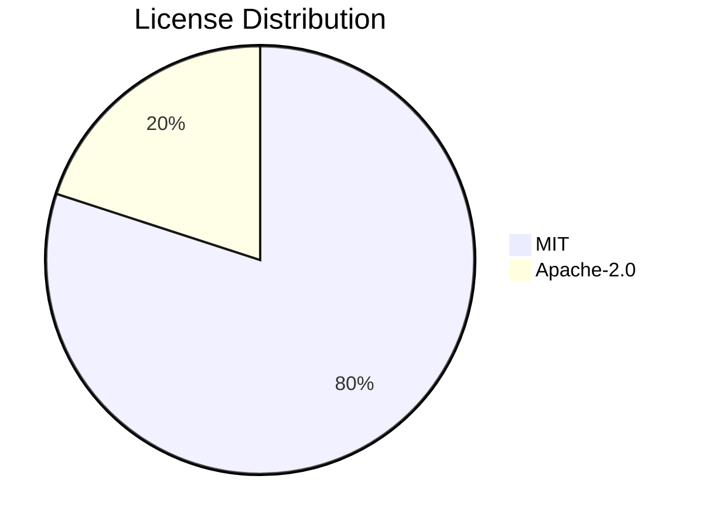

# Software Bill of Materials (SBOM)

Generated: 2026-06-12T19:25:19.401409+00:00

## Summary

| Metric | Value |
|--------|-------|
| Runtime dependencies | 6 |
| Dev dependencies | 2 |
| Total packages | 8 |
| Unique licenses | 2 (Apache-2.0, MIT) |
| Copyleft licenses | 0 |

## License Distribution

## Runtime Dependencies

| Package | Version | License |
|---------|---------|---------|
| google-genai | 1.0.0 | - |
| jsonschema | 4.18 | MIT |
| openai | 2.30.0 | Apache-2.0 |
| openai | 1.0.0 | - |
| pyyaml | 6.0 | MIT |
| requests | 2.31.0 | - |

## Dev Dependencies

| Package | Version | License |
|---------|---------|---------|
| pytest | 8.0.0 | MIT |
| pytest-mock | 3.12.0 | MIT |

## License Compliance

No license concerns: all resolved dependencies are permissively licensed.

