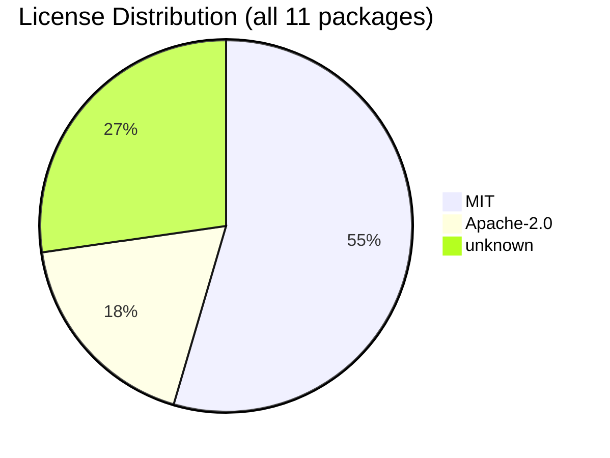

# Software Bill of Materials (SBOM)

Generated: 2026-07-21T22:41:30.570002+00:00 (dependency versions resolved from uv.lock)

## Summary

| Metric | Value |
|--------|-------|
| Runtime dependencies | 6 (deduplicated) |
| Dev dependencies | 5 |
| Total packages | 11 |
| Licenses resolved | 8 / 11 |
| Unique licenses | 2 (Apache-2.0, MIT) |
| Copyleft licenses | 0 |

## License Distribution

## Runtime Dependencies

| Package | Version | License |
|---------|---------|---------|
| defusedxml | 0.7.1 | - |
| google-genai | 1.68.0 | - |
| jsonschema | 4.26.0 | MIT |
| openai | 2.30.0 | Apache-2.0 |
| pyyaml | 6.0.3 | MIT |
| requests | 2.33.0 | - |

## Dev Dependencies

| Package | Version | License |
|---------|---------|---------|
| diff-cover | 10.3.0 | Apache-2.0 |
| pytest | 9.0.3 | MIT |
| pytest | 9.1.1 | MIT |
| pytest-cov | 7.1.0 | MIT |
| pytest-mock | 3.15.1 | MIT |

## License Compliance

**3 dependency(ies) could not be resolved in this scan** - license unverified; verify before distribution.

