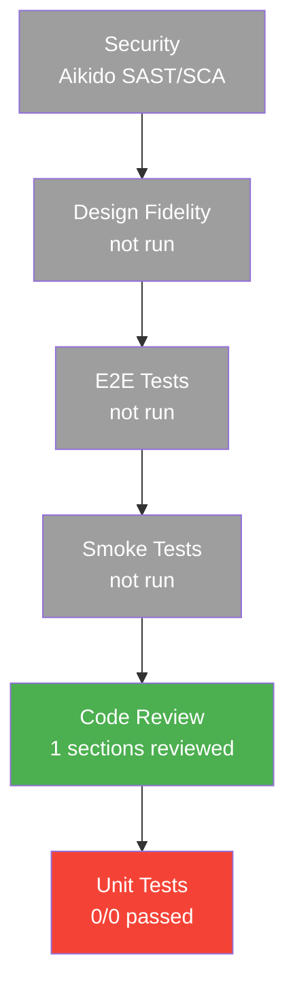

# Test Evidence Report

Generated: 2026-05-02T18:42:43Z

## Summary

| Metric | Value |
|--------|-------|
| Total sections tested | 1 |
| Unit tests passed | 0 |
| Unit tests failed | 0 |
| Code review sections | 1/1 |
| Review findings total | 0 |
| Review findings fixed | 0 |

## Test Execution Summary

| Layer | Status | Passed | Total | Duration | Details |
|-------|--------|--------|-------|----------|---------|
| Unit | SKIP | 0 | 0 | 0s | Vitest |
| Integration | — | 0 | 0 | — | not configured |
| Smoke | — | — | — | — | — |
| E2E | — | 0 | 0 | — | Playwright |

## Test Pyramid

## Per-Split Results

### Split: 01-adopted

| Layer | Passed | Total | Status |
|-------|--------|-------|--------|
| Unit | 0 | 0 | — |
| E2E | — | — | — |

Sections: 0/1 complete | Review: — (0 findings)

## Code Review Evidence

| Section | Review Type | Findings | Fixed | Deferred | Status |
|---------|-------------|----------|-------|----------|--------|
| adopted-baseline | Unknown | 0 | 0 | 0 | PASS |

