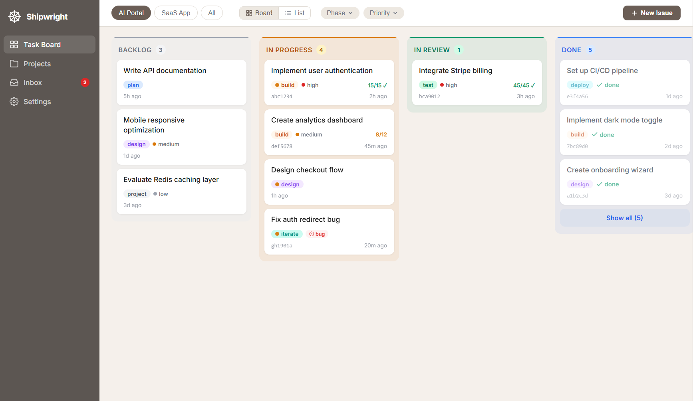
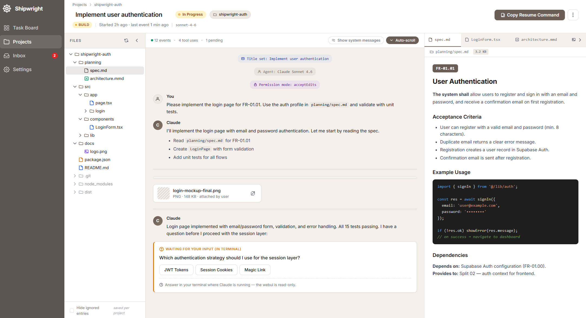

# Shipwright SDLC


**Shipwright is a structured SDLC framework for Claude Code.** From one-line description to deployed, tested, secured app — via a cleanly orchestrated pipeline of skills that also work on their own. Use it from the **Claude Code VSCode Extension or CLI terminal** — or, for multi-project work, through the **Shipwright Command Center** web UI: one kanban board across every Shipwright task, so you stop juggling windows and VS Code sessions to see where things stand. Built for daily iteration, not one-shot generation. **Ships audit-ready compliance artifacts as a byproduct — no extra work.**

```
/shipwright-run "A SaaS time tracking app with Supabase and Next.js"
```

> **Early Access Beta:** Shipwright is currently in Early Access. Expect rough edges. Please [report issues](https://github.com/svenroth-ai/shipwright/issues/new/choose) — but do not use it for production-critical workflows without thorough evaluation.

## Shipwright Command Center

<table>
<tr>
<td width="50%"></td>
<td width="50%"></td>
</tr>
<tr>
<td><em>Kanban board across every Shipwright project — Backlog, In Progress, In Review, Done. One place to see where everything stands.</em></td>
<td><em>Task detail — live transcript with messages, tool calls, diffs, and IREB acceptance criteria side by side.</em></td>
</tr>
</table>

The Command Center is the browser surface for the same skills you run in the terminal or VS Code Extension. Instead of keeping 4 terminal windows or VS Code sessions open for 4 projects, you get one kanban board, one inbox for agent questions, and one place to launch a new pipeline or iterate. Claude still runs in your own terminal or VS Code Extension — the Command Center generates a ready-to-paste command when you launch, then follows the session live. Installs automatically with `scripts/install.sh` — see [Getting Started](#getting-started).

## Why Shipwright?

- **Structure over vibes.** IREB-aligned specs, TDD with acceptance criteria, mechanical hooks — not advisory prose.
- **Flexible, not linear.** Run the full pipeline with `/shipwright-run`, iterate daily with `/shipwright-iterate`, or invoke any single skill on its own.
- **Compliance without the overhead.** Traceability matrix, test evidence, change history, SBOM, and a dashboard — all generated automatically from an append-only event log. The audit paperwork that normally costs weeks of manual work ships as a byproduct of building the software.
- **Mechanical quality gates.** Hooks block dangerous actions deterministically (exit code 2), so quality doesn't depend on the agent remembering the rules.

## Initial Pipeline

Run once via `/shipwright-run` for a new project — or invoke any single skill on its own at any time.

```
User Description
  │
  ▼
┌────────────────────────────┐
│ shipwright-run             │  Infer scope, profile, autonomy → dispatch
└─────────────┬──────────────┘
              ▼
┌────────────────────────────┐
│ shipwright-project         │  Interview → Split → IREB Specs → CLAUDE.md + .shipwright/agent_docs
└─────────────┬──────────────┘
              ▼
┌────────────────────────────┐
│ shipwright-design          │  Specs → Interview → HTML Mockups → Review Viewer → Feedback Loop
└─────────────┬──────────────┘
              ▼  (per split)
┌────────────────────────────┐
│ shipwright-plan            │  Research → Interview → Plan → External LLM Review → Sections
└─────────────┬──────────────┘
              ▼  (per section)
┌────────────────────────────┐
│ shipwright-build           │  TDD → Code Review → Conventional Commit → Feature Branch
└─────────────┬──────────────┘
              ▼
┌────────────────────────────┐
│ shipwright-test            │  Unit (Vitest) → Smoke → Playwright E2E
└─────────────┬──────────────┘
              ▼
┌────────────────────────────┐
│ shipwright-security        │  Scanner Chain → Classify → Remediation Loop → Report
└─────────────┬──────────────┘
              ▼
┌────────────────────────────┐
│ shipwright-deploy          │  Jelastic (Infomaniak) → Smoke Test → Rollback on Failure
└─────────────┬──────────────┘
              ▼
┌────────────────────────────┐
│ shipwright-changelog       │  Parse Commits → Changelog → Version Tag → PR
└─────────────┬──────────────┘
              ▼
┌────────────────────────────┐
│ shipwright-compliance      │  Traceability → Test Evidence → Change History → SBOM → Dashboard
└────────────────────────────┘
```

After the initial build, day-to-day changes run through `/shipwright-iterate` — complexity-adaptive, keeps every artifact in sync.

## Using Shipwright

**From the Claude Code VSCode Extension or CLI terminal**

```
/shipwright-run "Build a SaaS time tracker with Supabase and Next.js"   # Full application
/shipwright-run "Add team management with invite flow"                   # Extension to existing project
/shipwright-iterate "Add dark mode toggle"                               # Daily iteration
/shipwright-plan @sections/01-auth.md                                    # Single skill, standalone
```

**From the Shipwright Command Center**

Multi-project kanban across every Shipwright task you touch. Click a task for its live transcript; click **Launch** to start a new pipeline or iterate. The Command Center hands you the exact `claude` command to paste in your terminal or VS Code Extension — Claude runs there, the Command Center follows along. Same skills, same events, same compliance artifacts as running directly. What you gain is the overview: 3+ projects, 8+ tasks, one board instead of a pile of windows and VS Code sessions.

**Standalone skills on any project**

`/shipwright-test`, `/shipwright-plan`, `/shipwright-security`, and every other skill also work on projects that never went through the full pipeline. Point them at a repository and they run.

## Skills

| Skill | Purpose |
|-------|---------|
| `shipwright-run` | Pipeline Initializer & Phase Coordinator — inference engine, scope detection, pipeline state machine |
| `shipwright-iterate` | Daily iteration — intent classification, complexity assessment, adaptive pipeline |
| `shipwright-project` | Requirements — IREB-aligned specs, scope detection, chat + file + inline input |
| `shipwright-design` | UI Design — snippet-assembled HTML mockups, review viewer, design system flavors |
| `shipwright-plan` | Planning — external LLM review, section-writer subagent, E2E test plan |
| `shipwright-build` | Implementation — TDD loop, code-reviewer subagent, Conventional Commits |
| `shipwright-test` | Testing — profile-aware (Vitest/Playwright), smoke test, `--fix` auto-repair |
| `shipwright-security` | Security — scanner chain, finding classification, remediation loop |
| `shipwright-deploy` | Deployment — deployment flavors, DEV auto / PROD manual, clone-based rollback |
| `shipwright-changelog` | Release — Keep-a-Changelog format, semver bump suggestion, PR creation |
| `shipwright-compliance` | Compliance — IREB traceability, RTM, SBOM, test evidence, change history, dashboard |
| `shipwright-preview` | Preview — local dev server, browser URL, profile-driven (available after first build split) |
| `shipwright-adopt` | Brownfield onboarding — analyze existing repo, generate CLAUDE.md + .shipwright/agent_docs + configs + E2E baseline |

## Stack Profiles

Profiles define the entire stack: versions, folder structure, deploy target, test strategy, linting, CI, UX patterns, and architecture rules.

| Profile | Stack | Deploy |
|---------|-------|--------|
| `supabase-nextjs` | Next.js 16 · Supabase · Tailwind 4 · shadcn/ui · Zustand · Vitest · Playwright | Jelastic (Infomaniak) |

**Custom profiles.** Drop a new JSON file into `shared/profiles/` to define your own stack — versions, folder layout, deploy target, test strategy, linting, CI, and architecture rules. Shipwright picks it up automatically and `/shipwright-run` can infer it from your project description.

## Getting Started

### Requirements

- [Claude Code](https://docs.anthropic.com/en/docs/claude-code) (Pro or Max) — VSCode Extension or CLI
- Python 3.11+ via [uv](https://docs.astral.sh/uv/)
- Git
- Node.js 20+ *(optional — needed for the Command Center WebUI, which now lives at [shipwright-webui](https://github.com/svenroth-ai/shipwright-webui))*

### Install (recommended)

```bash
git clone https://github.com/svenroth-ai/shipwright.git ~/shipwright
cd ~/shipwright
./scripts/install.sh
```

`install.sh` handles everything in one step:

- Checks prerequisites (Claude Code, Python 3.11+, uv, git, Node.js)
- Installs Python dependencies via `uv sync`
- Creates a `shipwright` shell alias that loads all plugins
- Runs `scripts/verify-setup.sh` to confirm the install

Afterwards, type `shipwright` in any terminal and go.

### Start the Command Center

The Command Center lives in its own repository:
**[shipwright-webui](https://github.com/svenroth-ai/shipwright-webui)**.

```bash
git clone https://github.com/svenroth-ai/shipwright-webui.git ~/shipwright-webui
cd ~/shipwright-webui && make install
make dev-server    # Terminal 1 — backend on :3847
make dev-client    # Terminal 2 — frontend on :5173
```

The Command Center observes your running Claude sessions via their JSONL
transcripts — it spawns no Claude process itself. Full install,
parallel-worktree tips, Windows autostart, and custom actions for your
own slash skills are documented in the WebUI repo's
**[docs/guide.md](https://github.com/svenroth-ai/shipwright-webui/blob/main/docs/guide.md)**.

### Install via Marketplace (VSCode Extension alternative)

If you prefer the Claude Code plugin marketplace instead of a shell alias, add this to `~/.claude/settings.json`:

```json
{
  "extraKnownMarketplaces": {
    "shipwright": { "source": { "source": "github", "repo": "svenroth-ai/shipwright" } }
  },
  "enabledPlugins": {
    "shipwright-run@shipwright": true,
    "shipwright-project@shipwright": true,
    "shipwright-design@shipwright": true,
    "shipwright-plan@shipwright": true,
    "shipwright-build@shipwright": true,
    "shipwright-test@shipwright": true,
    "shipwright-security@shipwright": true,
    "shipwright-deploy@shipwright": true,
    "shipwright-changelog@shipwright": true,
    "shipwright-compliance@shipwright": true,
    "shipwright-iterate@shipwright": true,
    "shipwright-preview@shipwright": true,
    "shipwright-adopt@shipwright": true
  }
}
```

Then clone the repo and run `uv sync`. For the Command Center WebUI, see [shipwright-webui](https://github.com/svenroth-ai/shipwright-webui).

For the full setup guide (troubleshooting, deployment targets, external LLM review, platform notes), see **[docs/guide.md](docs/guide.md)**.

## Architecture

```
shipwright/
├── plugins/                          # Claude Code plugins (one per SDLC phase)
│   ├── shipwright-run/               # Pipeline Initializer
│   ├── shipwright-project/           # Requirements decomposition (IREB)
│   ├── shipwright-design/            # UI mockups (HTML)
│   ├── shipwright-plan/              # Deep planning + external LLM review
│   ├── shipwright-build/             # TDD implementation
│   ├── shipwright-test/              # Test runner (unit/smoke/E2E)
│   ├── shipwright-security/          # Scanners + remediation
│   ├── shipwright-deploy/            # Deployment (extensible flavors)
│   ├── shipwright-changelog/         # Changelog + PR
│   ├── shipwright-compliance/        # Traceability, RTM, SBOM, dashboard
│   ├── shipwright-iterate/           # Daily iteration (complexity-adaptive)
│   ├── shipwright-preview/           # Local browser preview
│   └── shipwright-adopt/             # Brownfield onboarding (analyze existing repos)
# Command Center WebUI: github.com/svenroth-ai/shipwright-webui (separate repo)
├── shared/                           # Shared across plugins
│   ├── profiles/                     # Stack profile definitions (JSON)
│   ├── templates/                    # CLAUDE.md, .shipwright/agent_docs, CI/CD, rules templates
│   └── scripts/                      # Shared Python utilities
├── scripts/
│   ├── install.sh                    # All-in-one installer
│   └── verify-setup.sh               # Post-install verification
├── docs/
│   ├── guide.md                      # Canonical user guide
│   └── hooks-and-pipeline.md         # Hooks registry + context loading
└── integration-tests/                # Cross-plugin integration tests
```

Each plugin follows the [Claude Code plugin structure](https://docs.anthropic.com/en/docs/claude-code):

```
plugins/shipwright-{name}/
├── .claude-plugin/plugin.json        # Plugin metadata
├── hooks/hooks.json                  # Claude Code hooks
├── agents/                           # Subagent definitions
├── skills/{name}/
│   ├── SKILL.md                      # Main skill definition
│   └── references/                   # Lazy-loaded protocol docs
├── scripts/                          # Python scripts
├── tests/                            # Plugin-specific tests
└── pyproject.toml
```

## Design Principles

1. **Describe, don't configure** — user describes what they want, agent infers settings
2. **DEV auto, PROD manual** — fast feedback loop, safe production
3. **Every skill works standalone** — `shipwright-run` orchestrates, but each skill works independently
4. **Test-first** — TDD with IREB acceptance criteria → testable specs from day one
5. **Initial build is the exception, iteration is the rule** — `/shipwright-iterate` is the daily workflow after the first deploy
6. **Resume anywhere** — file-based state allows interrupting and resuming at any point
7. **Migration safety** — destructive SQL changes always require confirmation
8. **Linters over instructions** — mechanical enforcement (hooks) beats advisory prose (CLAUDE.md rules)
9. **Progressive disclosure** — CLAUDE.md stays lean (~200 lines), details live in `@.shipwright/agent_docs/`

## Documentation

**→ [docs/guide.md](docs/guide.md) is the canonical guide.** It covers every phase, the constitution, quality gates, profiles, troubleshooting, and the full command reference.

Inheriting a Shipwright-generated repository or reviewing one without going through the pipeline yourself? Start with **[Reading a Shipwright Project from Outside](docs/guide.md#reading-a-shipwright-project-from-outside)** in the guide — explains where each kind of fact lives so you do not have to read every file to find one answer.

Other references:

- [docs/hooks-and-pipeline.md](docs/hooks-and-pipeline.md) — hooks registry, context loading matrix, between-phase actions
- [shipwright-webui/docs/guide.md](https://github.com/svenroth-ai/shipwright-webui/blob/main/docs/guide.md) — Command Center user guide (install, daily workflow, custom actions, autostart)
- [CONTRIBUTING.md](CONTRIBUTING.md) — contribution workflow and security model
- [SECURITY.md](SECURITY.md) — vulnerability disclosure

## Security

Shipwright uses its own `shipwright-security` plugin to scan every change to this repository. **Starting with the Early Access release, every commit on `main` passes the full scanner chain:**

- **Semgrep** — Static Application Security Testing (SAST)
- **Trivy** — Software Composition Analysis (SCA, CVE detection)
- **Gitleaks** — Secret detection in code and git history
- **Shipwright Prompt Injection Scanner** — Custom scanner for malicious patterns in skill definitions, hooks, and agent files (Claude Code specific)
- **CodeQL** — GitHub's SAST engine

We dogfood our own security tooling — the same plugin that ships with Shipwright protects Shipwright itself.

### Running the scanners locally

```bash
# Semgrep + Trivy + Gitleaks
uv run plugins/shipwright-security/scripts/tools/scan.py \
  --path . --output findings.json

# Shipwright Prompt Injection Scanner
uv run plugins/shipwright-security/scripts/tools/prompt_injection_scan.py \
  --full --path . --output prompt_risks.json

# Combined Markdown report
uv run plugins/shipwright-security/scripts/tools/generate_security_report.py \
  --input findings.json --prompt-risks prompt_risks.json \
  --output security_report.md
```

### Reporting vulnerabilities

See [SECURITY.md](SECURITY.md) for our vulnerability disclosure policy. Do not file public issues for security problems — use [GitHub Security Advisories](https://github.com/svenroth-ai/shipwright/security/advisories/new).

## Quality & Safety

Shipwright enforces quality through mechanical hooks — not advisory prose. Hooks fire on Claude Code events and block dangerous actions deterministically.

| Hook | What it prevents |
|------|-----------------|
| Dangerous Command Guard | `git push --force` to main, `rm -rf /`, `DROP DATABASE` |
| Secret Scanning | API keys, tokens, passwords, PEM keys in source code |
| Destructive Migration Scan | `DROP TABLE` / `DROP COLUMN` without rollback SQL |
| File Size Guard | Source files exceeding 300 lines |
| Drift Detection | Stale CLAUDE.md when source files changed |

All hooks use exit code 2 (soft-block): you can override, but the override is logged. See **[docs/guide.md](docs/guide.md)** for details on the constitution, TDD workflow, code review, and migration safety.

## Contributing

Contributions are welcome! Please read [CONTRIBUTING.md](CONTRIBUTING.md) before opening a PR. Note that changes to skills, hooks, or agents require a preceding GitHub issue for discussion — this is part of our security model.

## Development

```bash
# Install dependencies
uv sync

# Run tests for a specific plugin
uv run pytest plugins/shipwright-project/tests/ -v

# Run all integration tests
uv run pytest integration-tests/ -v
```

---

*Early versions were forked from Pierce Lamb's [deep-project](https://github.com/piercelamb/deep-project), [deep-plan](https://github.com/piercelamb/deep-plan), and [deep-implement](https://github.com/piercelamb/deep-implement); current code has diverged substantially.*

*Additional inspiration and industry best practices adopted from [obra/superpowers](https://github.com/obra/superpowers) (MIT) and [addyosmani/agent-skills](https://github.com/addyosmani/agent-skills) (MIT) — thanks to their authors.*

## License

[MIT](LICENSE)

Built by [svenroth.ai](https://github.com/svenroth-ai). Powered by Claude Code.
