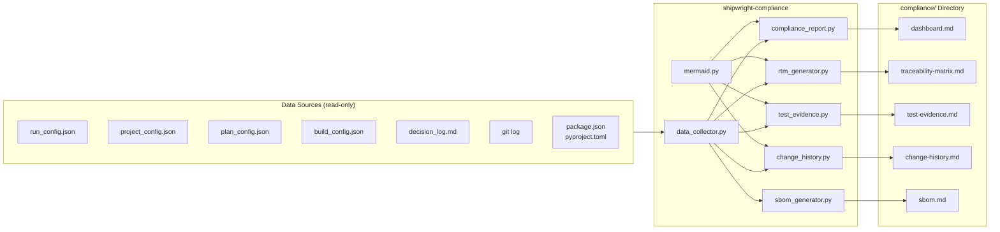
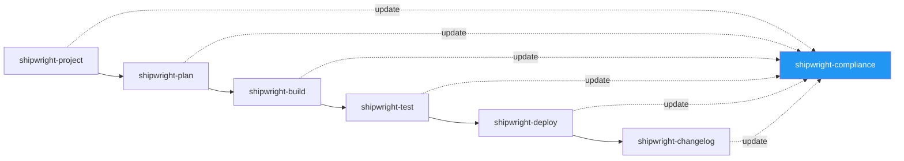
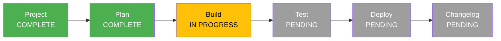
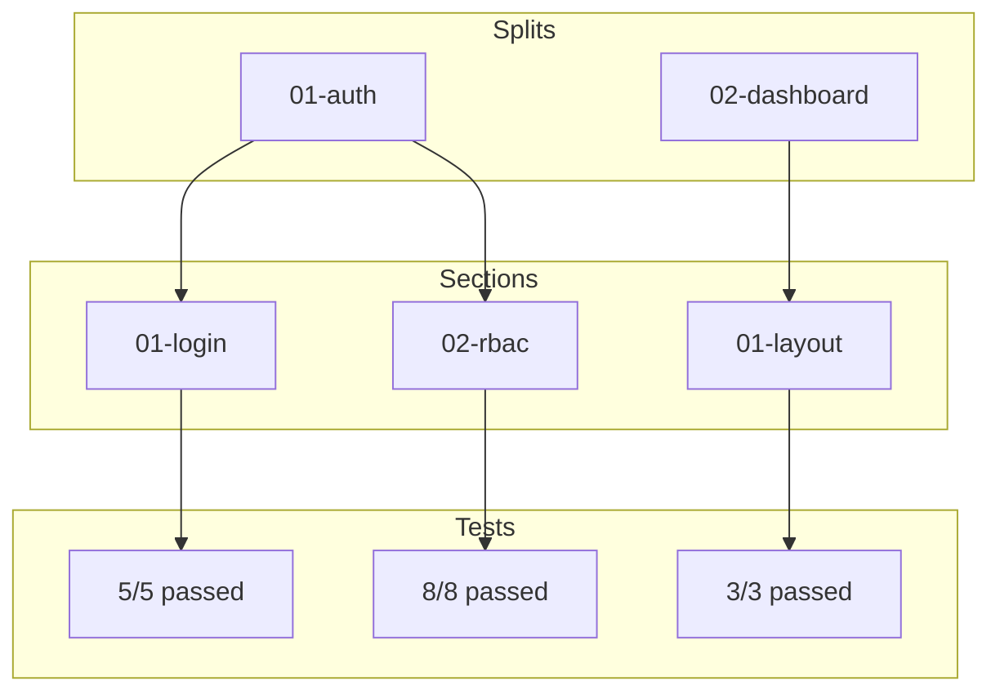
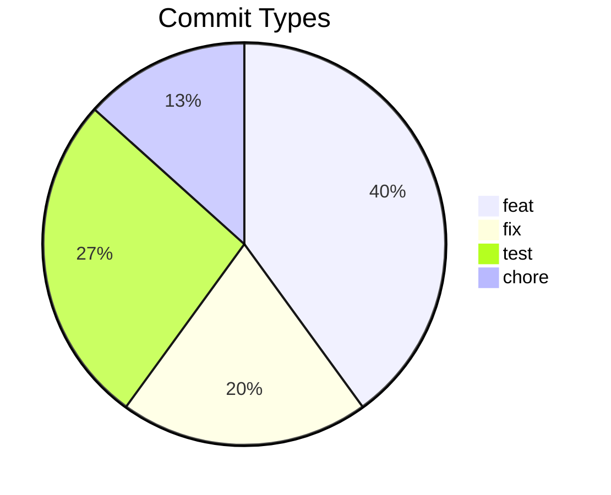
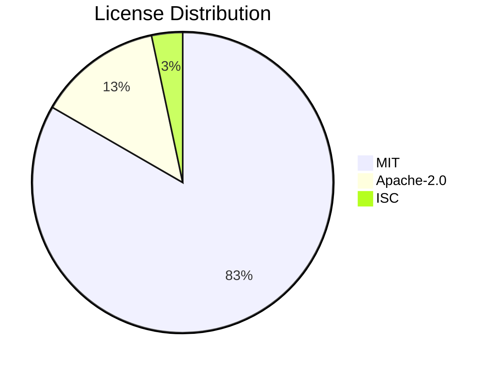

# Shipwright Compliance -- Specification

> **Version**: 1.0
> **Date**: 2026-03-21
> **Status**: Design Complete
> **Parent**: `shipwright-sdlc-spec.md` v3.3
> **Purpose**: Audit-ready compliance documentation aggregated from all Shipwright pipeline phases

---

## 1. Motivation

### 1.1 The Problem

Shipwright already produces rich structured data at every SDLC phase -- config JSONs, decision logs, conventional commits, test results, deployment records. But this data lives scattered across files and git history. An auditor (or the team itself) cannot answer basic compliance questions without manually piecing together information:

- "Which requirement led to this code change?"
- "What tests prove this feature works?"
- "Who made which decisions and why?"
- "What open-source libraries are we shipping?"

### 1.2 The Solution

A new plugin `shipwright-compliance` that **reads** (never writes to) the data produced by all other plugins and **aggregates** it into audit-ready Markdown reports with Mermaid diagrams. It runs incrementally after each SDLC phase and on-demand via `/shipwright-compliance`.

### 1.3 Compliance Standards Context

The artifacts are designed to satisfy evidence requirements from:

| Standard | Domain | Key Requirements Addressed |
|----------|--------|---------------------------|
| **ISO 27001** (A.8.25) | Information Security | Secure development policy, change management, testing evidence |
| **SOC 2 Type II** (CC8) | Service Organizations | Change authorization, commit-to-deploy trail, test records |
| **IEC 62304** | Medical Device Software | Requirements traceability, design history, SBOM |
| **General Best Practice** | All | Decision records, audit trail, license compliance |

The plugin does not enforce compliance -- it generates evidence. Enforcement is the responsibility of the existing Shipwright plugins (hooks, quality gates, code review).

---

## 2. Architecture

### 2.1 Design Principle: Read-Only Aggregator

```
shipwright-compliance does NOT:
  ✗ Write to other plugins' config files
  ✗ Modify decision_log.md
  ✗ Create git commits
  ✗ Block the pipeline

shipwright-compliance DOES:
  ✓ Read all shipwright_*_config.json files
  ✓ Parse agent_docs/decision_log.md
  ✓ Run git log to analyze commit history
  ✓ Read dependency manifests (package.json, pyproject.toml)
  ✓ Write reports to compliance/ directory
  ✓ Write its own shipwright_compliance_config.json
```

### 2.2 Data Flow



### 2.3 Two Execution Modes

| Mode | Trigger | What It Does |
|------|---------|-------------|
| **Incremental** | Orchestrator calls `update_compliance.py --phase {name}` after each pipeline step | Regenerates only the reports affected by the completed phase |
| **On-demand** | User invokes `/shipwright-compliance` | Generates all reports from scratch |

### 2.4 Plugin Position in Pipeline



The compliance plugin is a **cross-cutting observer** -- it watches all phases but never blocks them.

---

## 3. Data Sources

### 3.1 Source-to-Artifact Mapping

| Source | Produced By | Used In |
|--------|------------|---------|
| `shipwright_run_config.json` | shipwright-run | Dashboard (pipeline config) |
| `shipwright_project_config.json` | shipwright-project | RTM (splits list), Dashboard |
| `shipwright_plan_config.json` | shipwright-plan | RTM (sections list), Dashboard |
| `shipwright_build_config.json` | shipwright-build | RTM (commits, tests), Test Evidence, Dashboard |
| `agent_docs/decision_log.md` | shipwright-build, -deploy | Dashboard (decision count) |
| `git log` | git | Change History, RTM (commit details) |
| `planning/project-manifest.md` | shipwright-project | RTM (split structure, dependencies) |
| `planning/*/spec.md` | shipwright-project | RTM (requirement descriptions) |
| `planning/sections/*.md` | shipwright-plan | RTM (section descriptions) |
| `CHANGELOG.md` | shipwright-changelog | Change History (version mapping) |
| `package.json` / `package-lock.json` | target project | SBOM |
| `pyproject.toml` / `uv.lock` | target project | SBOM |
| `requirements.txt` | target project | SBOM |

### 3.2 Decision Log Format (Existing)

The decision log is written by `write_decision_log.py` in shipwright-build:

```markdown
## section-name (2026-03-21 14:30 UTC)

- **Use React Query for data fetching** [architecture]
  - Reason: Built-in caching and optimistic updates match our UX requirements
- **Choose Zod over Yup for validation** [library]
  - Reason: Better TypeScript inference, smaller bundle
```

The compliance plugin parses this with regex: `## (.+) \((.+)\)` for sections and `- \*\*(.+)\*\* \[(.+)\]` for decisions.

### 3.3 Build Config Section Format (Existing)

```json
{
  "sections": [
    {
      "name": "01-auth",
      "status": "complete",
      "commit": "abc123def456",
      "tests_passed": 5,
      "tests_total": 5,
      "estimated_tokens_used": 45000,
      "estimated_api_calls": 12,
      "code_review_findings": [
        {"finding": "Missing input validation", "status": "fixed"}
      ]
    }
  ]
}
```

---

## 4. Compliance Artifacts

### 4.1 Dashboard (`compliance/dashboard.md`)

The single-page overview. An auditor reads this first.

**Content:**

```markdown
# Compliance Dashboard

Generated: 2026-03-21T14:30:00Z
Session: {SHIPWRIGHT_SESSION_ID}
Profile: supabase-nextjs
Scope: Full Application

## Pipeline Status

{Mermaid flowchart: phases with color-coded status}

## Quality Indicators

| Indicator | Value | Status |
|-----------|-------|--------|
| Splits completed | 3/3 | PASS |
| Sections completed | 8/8 | PASS |
| Tests passing | 42/42 | PASS |
| Code review coverage | 8/8 sections | PASS |
| Decision log entries | 15 | INFO |
| Open-source packages | 23 | INFO |
| Copyleft licenses | 0 | PASS |
| Security scans | Aikido configured | PASS |

## Compliance Artifacts

| Document | Path | Last Updated |
|----------|------|-------------|
| Traceability Matrix | [traceability-matrix.md](traceability-matrix.md) | 2026-03-21 |
| Test Evidence | [test-evidence.md](test-evidence.md) | 2026-03-21 |
| Change History | [change-history.md](change-history.md) | 2026-03-21 |
| Decision Log | [../agent_docs/decision_log.md](../agent_docs/decision_log.md) | 2026-03-21 |
| SBOM | [sbom.md](sbom.md) | 2026-03-21 |

## Traceability Overview

{Mermaid flowchart: Requirements → Splits → Sections → Tests}

## Cost Summary

| Metric | Value |
|--------|-------|
| Total estimated tokens | 360,000 |
| Total estimated API calls | 96 |
| Sections built | 8 |
| Avg tokens/section | 45,000 |
```

**Mermaid Diagrams:**

1. **Pipeline Status** -- flowchart LR with green (complete), yellow (in-progress), gray (pending) nodes
2. **Traceability Overview** -- flowchart TD showing the full chain from splits through tests

### 4.2 Requirements Traceability Matrix (`compliance/traceability-matrix.md`)

Maps every requirement through the entire delivery chain.

**Content:**

```markdown
# Requirements Traceability Matrix

Generated: 2026-03-21T14:30:00Z

## Traceability Flow

{Mermaid flowchart: REQ → SPLIT → SECTION → COMMIT → TEST}

## Matrix

| Split | Section | Description | Commit | Tests Passed | Tests Total | Review Findings | Status |
|-------|---------|-------------|--------|-------------|-------------|-----------------|--------|
| 01-auth | 01-login | Magic link authentication | abc1234 | 5 | 5 | 1 (fixed) | PASS |
| 01-auth | 02-rbac | Role-based access control | def5678 | 8 | 8 | 0 | PASS |
| 02-dashboard | 01-layout | Dashboard grid layout | ghi9012 | 3 | 3 | 2 (fixed) | PASS |

## Summary

| Metric | Value |
|--------|-------|
| Total splits | 3 |
| Total sections | 8 |
| Sections with commits | 8 |
| Sections with passing tests | 8 |
| Sections with review findings | 3 |
| Unresolved findings | 0 |
| Traceability coverage | 100% |
```

**Traceability Logic:**
- Splits come from `shipwright_project_config.json`
- Sections come from `shipwright_plan_config.json` + `shipwright_build_config.json`
- Commits, test counts, and review findings come from `shipwright_build_config.json`
- If no explicit REQ-NNN IDs exist, splits serve as requirement groups

### 4.3 Test Evidence Report (`compliance/test-evidence.md`)

Proves that every section was tested.

**Content:**

```markdown
# Test Evidence Report

Generated: 2026-03-21T14:30:00Z

## Summary

| Metric | Value |
|--------|-------|
| Total sections tested | 8 |
| Unit tests passed | 42 |
| Unit tests failed | 0 |
| Code review sections | 8/8 |
| Review findings total | 3 |
| Review findings fixed | 3 |
| E2E tests | configured / not configured |
| Smoke tests | PASS / N/A |
| Security scans | Aikido / not configured |

## Per-Section Results

### Split: 01-auth

| Section | Tests Passed | Tests Total | Review Findings | Status |
|---------|-------------|-------------|-----------------|--------|
| 01-login | 5 | 5 | 1 (all fixed) | PASS |
| 02-rbac | 8 | 8 | 0 | PASS |

### Split: 02-dashboard

| Section | Tests Passed | Tests Total | Review Findings | Status |
|---------|-------------|-------------|-----------------|--------|
| 01-layout | 3 | 3 | 2 (all fixed) | PASS |

## Test Pyramid Coverage

{Mermaid diagram: test layers}

## Code Review Evidence

| Section | Findings | Fixed | Deferred | Status |
|---------|----------|-------|----------|--------|
| 01-login | 1 | 1 | 0 | PASS |
| 02-rbac | 0 | 0 | 0 | PASS |
| 01-layout | 2 | 2 | 0 | PASS |
```

### 4.4 Change History Report (`compliance/change-history.md`)

Every code change with its type, scope, and author.

**Content:**

```markdown
# Change History Report

Generated: 2026-03-21T14:30:00Z
Total commits: 15

## Commit Distribution

{Mermaid pie chart: commit types}

## Changes by Type

### Features (feat) — 6 commits

| Date | Scope | Description | Commit |
|------|-------|-------------|--------|
| 2026-03-20 | auth | implement magic link authentication | abc1234 |
| 2026-03-20 | auth | add role-based access control | def5678 |

### Fixes (fix) — 3 commits

| Date | Scope | Description | Commit |
|------|-------|-------------|--------|
| 2026-03-21 | auth | handle expired tokens gracefully | jkl3456 |

### Tests (test) — 4 commits
...

### Chores (chore) — 2 commits
...

## AI Attribution

All commits include `Co-Authored-By: Claude <noreply@anthropic.com>`.

| Metric | Value |
|--------|-------|
| AI-assisted commits | 15/15 (100%) |
| Human-authored commits | 0 |
```

**Parsing Logic:**
- Regex: `^(feat|fix|refactor|docs|test|chore|style|perf|ci|build)(\(([^)]+)\))?: (.+)$`
- Grouping: by type first, then chronological
- Author: from `git log --format="%an"`

### 4.5 SBOM — Software Bill of Materials (`compliance/sbom.md`)

Every open-source library shipped with the project.

**Content:**

```markdown
# Software Bill of Materials (SBOM)

Generated: 2026-03-21T14:30:00Z

## Summary

| Metric | Value |
|--------|-------|
| Runtime dependencies | 18 |
| Dev dependencies | 12 |
| Total packages | 30 |
| Unique licenses | 3 (MIT, Apache-2.0, ISC) |
| Copyleft licenses | 0 |

## License Distribution

{Mermaid pie chart: license types}

## Runtime Dependencies

| Package | Version | License | Notes |
|---------|---------|---------|-------|
| next | 16.2.0 | MIT | |
| react | 19.2.0 | MIT | |
| @supabase/supabase-js | 2.45.0 | MIT | |
| zod | 3.23.0 | MIT | |

## Dev Dependencies

| Package | Version | License | Notes |
|---------|---------|---------|-------|
| vitest | 3.1.0 | MIT | |
| @playwright/test | 1.50.0 | Apache-2.0 | |
| typescript | 5.8.0 | Apache-2.0 | |

## License Compliance

| License | Count | Commercial Use | Copyleft | Action Required |
|---------|-------|----------------|----------|----------------|
| MIT | 25 | Allowed | No | None |
| Apache-2.0 | 4 | Allowed | No | Include NOTICE file |
| ISC | 1 | Allowed | No | None |
```

**Detection Logic:**
1. **npm projects**: Read `package.json` for dependency names + versions. For licenses: read `node_modules/{pkg}/package.json` → `license` field (if `node_modules` exists), otherwise mark as "unknown"
2. **Python projects**: Read `pyproject.toml` `[project.dependencies]` and `[project.optional-dependencies]`. For licenses: parse `uv.lock` or run `uv pip show {pkg}` if available
3. **Copyleft warning**: Flag GPL, LGPL, AGPL, MPL-2.0 with note about commercial use implications

---

## 5. Plugin Structure

```
plugins/shipwright-compliance/
  .claude-plugin/
    plugin.json                       # Plugin metadata
  hooks/
    hooks.json                        # SessionStart hook
  skills/
    compliance/
      SKILL.md                        # /shipwright-compliance slash command
  scripts/
    hooks/
      capture-session-id.py           # Standard session hook
    checks/
      setup_compliance.py             # Validate project state
    lib/
      __init__.py
      data_collector.py               # Central data aggregator
      mermaid.py                      # Mermaid diagram string builders
      rtm_generator.py               # Requirements Traceability Matrix
      test_evidence.py               # Test Evidence Report
      change_history.py              # Change History Report
      compliance_report.py           # Dashboard generator
      sbom_generator.py              # Software Bill of Materials
    tools/
      __init__.py
      update_compliance.py           # Incremental update (called by orchestrator)
      generate_full_report.py        # Full report (called by SKILL.md)
  tests/
    __init__.py
    conftest.py
    fixtures/                         # Sample configs, decision logs, package.json
      sample_build_config.json
      sample_project_config.json
      sample_plan_config.json
      sample_run_config.json
      sample_decision_log.md
      sample_package.json
    test_data_collector.py
    test_mermaid.py
    test_rtm_generator.py
    test_test_evidence.py
    test_change_history.py
    test_compliance_report.py
    test_sbom_generator.py
  pyproject.toml
```

---

## 6. Script Specifications

### 6.1 `data_collector.py` — Central Data Aggregator

Single entry point to read all Shipwright data from a project.

**Dataclasses:**

```python
@dataclass
class SplitInfo:
    name: str
    status: str  # "complete" | "in_progress" | "pending"
    spec_path: str | None

@dataclass
class SectionInfo:
    name: str
    split: str
    status: str
    commit: str | None
    tests_passed: int
    tests_total: int
    review_findings: int
    review_findings_fixed: int
    estimated_tokens: int
    estimated_api_calls: int

@dataclass
class DecisionEntry:
    section: str
    timestamp: str
    decisions: list[dict]  # [{decision, reason, category}]

@dataclass
class CommitEntry:
    hash: str
    type: str         # feat, fix, test, etc.
    scope: str | None
    description: str
    date: str         # ISO 8601
    author: str

@dataclass
class DependencyInfo:
    name: str
    version: str
    dep_type: str     # "runtime" | "dev"
    license: str      # "MIT", "Apache-2.0", "unknown"

@dataclass
class ComplianceData:
    project_root: Path
    configs: dict[str, dict]
    splits: list[SplitInfo]
    sections: list[SectionInfo]
    decisions: list[DecisionEntry]
    commits: list[CommitEntry]
    dependencies: list[DependencyInfo]
    timestamp: str  # ISO 8601
```

**Functions:**

```python
def collect_all(project_root: Path) -> ComplianceData
def collect_configs(project_root: Path) -> dict[str, dict]
def collect_splits(project_root: Path) -> list[SplitInfo]
def collect_sections(project_root: Path) -> list[SectionInfo]
def collect_decision_log(project_root: Path) -> list[DecisionEntry]
def collect_git_history(project_root: Path) -> list[CommitEntry]
def collect_dependencies(project_root: Path) -> list[DependencyInfo]
```

All functions return empty lists (not errors) when data is missing.

### 6.2 `mermaid.py` — Diagram Builders

```python
def pipeline_status_diagram(configs: dict[str, dict]) -> str
    """flowchart LR with green/yellow/gray nodes per phase."""

def traceability_flow_diagram(splits: list, sections: list) -> str
    """flowchart TD: Splits → Sections → Tests with counts."""

def commit_type_pie(commits: list[CommitEntry]) -> str
    """pie chart of commit type distribution."""

def license_pie(dependencies: list[DependencyInfo]) -> str
    """pie chart of license distribution."""

def test_pyramid_diagram(sections: list[SectionInfo]) -> str
    """Layered test pyramid showing unit/review/e2e/smoke/security."""
```

All functions return complete Mermaid code blocks (with ` ```mermaid ` fences).

### 6.3 Report Generators

Each generator follows the same pattern:

```python
def generate(data: ComplianceData) -> str:
    """Generate the report as a Markdown string."""

def generate_file(project_root: Path, data: ComplianceData | None = None) -> Path:
    """Collect data (if not provided), generate report, write to compliance/ dir."""
```

| Generator | Output File | Primary Data Sources |
|-----------|------------|---------------------|
| `rtm_generator.py` | `compliance/traceability-matrix.md` | project_config, plan_config, build_config |
| `test_evidence.py` | `compliance/test-evidence.md` | build_config (sections with test counts) |
| `change_history.py` | `compliance/change-history.md` | git log |
| `compliance_report.py` | `compliance/dashboard.md` | All configs + all other reports |
| `sbom_generator.py` | `compliance/sbom.md` | package.json, pyproject.toml, lockfiles |

### 6.4 `setup_compliance.py` — Validation Check

```
Usage: uv run setup_compliance.py --project-root <path> --plugin-root <path> --session-id <id>

Output (JSON):
{
  "success": true,
  "phase": "build",           // current pipeline phase
  "available_data": {
    "run_config": true,
    "project_config": true,
    "plan_config": true,
    "build_config": true,
    "decision_log": true,
    "git_history": true,
    "package_json": true
  },
  "existing_reports": {
    "dashboard": false,
    "rtm": false,
    "test_evidence": false,
    "change_history": false,
    "sbom": false
  },
  "mode": "new"               // "new" | "update"
}
```

### 6.5 `generate_full_report.py` — Full Generation Tool

```
Usage: uv run generate_full_report.py --project-root <path> [--include-sbom]

Output (JSON):
{
  "success": true,
  "artifacts": {
    "dashboard": "compliance/dashboard.md",
    "rtm": "compliance/traceability-matrix.md",
    "test_evidence": "compliance/test-evidence.md",
    "change_history": "compliance/change-history.md",
    "sbom": "compliance/sbom.md"
  },
  "summary": {
    "splits": 3,
    "sections": 8,
    "tests_passed": 42,
    "tests_total": 42,
    "commits": 15,
    "decisions": 15,
    "packages": 30
  }
}
```

### 6.6 `update_compliance.py` — Incremental Update Tool

```
Usage: uv run update_compliance.py --project-root <path> --phase <name>

Phase-to-report mapping:
  project  → RTM, Dashboard
  plan     → RTM, Dashboard
  build    → RTM, Test Evidence, Change History, Dashboard
  test     → Test Evidence, Dashboard
  deploy   → Dashboard
  changelog → Change History, Dashboard
```

Idempotent: always regenerates from source data, never patches existing Markdown.

---

## 7. Integration Strategy

### 7.1 Orchestrator Integration

The orchestrator (`shipwright-run`) calls `update_compliance.py` after each phase.

**Modification to `plugins/shipwright-run/skills/orchestrate/SKILL.md` Step 5:**

Add after each skill invocation:
```
After {skill} completes:
  uv run {compliance_plugin_root}/scripts/tools/update_compliance.py \
    --project-root "$(pwd)" --phase "{phase_name}"
```

**Modification to Step 6 (Completion Banner):**

Add to artifacts list:
```
  - compliance/ (dashboard, RTM, test evidence, change history, SBOM)
```

### 7.2 Config Registration

**Modification to `shared/scripts/lib/config.py`:**

Add to `CONFIG_FILES` dict:
```python
CONFIG_FILES = {
    "run": "shipwright_run_config.json",
    "project": "shipwright_project_config.json",
    "plan": "shipwright_plan_config.json",
    "build": "shipwright_build_config.json",
    "compliance": "shipwright_compliance_config.json",  # NEW
}
```

### 7.3 Compliance Config Schema

```json
{
  "status": "complete",
  "last_full_generation": "2026-03-21T14:30:00Z",
  "artifacts": {
    "dashboard": {
      "path": "compliance/dashboard.md",
      "last_updated": "2026-03-21T14:30:00Z"
    },
    "rtm": {
      "path": "compliance/traceability-matrix.md",
      "last_updated": "2026-03-21T14:30:00Z",
      "requirements_count": 3,
      "sections_count": 8,
      "traced_count": 8
    },
    "test_evidence": {
      "path": "compliance/test-evidence.md",
      "last_updated": "2026-03-21T14:30:00Z",
      "tests_total": 42,
      "tests_passed": 42
    },
    "change_history": {
      "path": "compliance/change-history.md",
      "last_updated": "2026-03-21T14:30:00Z",
      "commits_analyzed": 15
    },
    "sbom": {
      "path": "compliance/sbom.md",
      "last_updated": "2026-03-21T14:30:00Z",
      "packages_count": 30,
      "copyleft_count": 0
    }
  },
  "phases_covered": ["project", "plan", "build", "test", "deploy", "changelog"]
}
```

---

## 8. Mermaid Diagram Specifications

VS Code renders Mermaid in Markdown Preview with extension `bierner.markdown-mermaid` (Ctrl+Shift+V).

### 8.1 Pipeline Status Diagram



Color mapping: `#4CAF50` (green) = complete, `#FFC107` (yellow) = in_progress, `#9E9E9E` (gray) = pending.

### 8.2 Traceability Flow Diagram



### 8.3 Commit Distribution Pie



### 8.4 License Distribution Pie



---

## 9. Implementation Phases

### Phase 1: Foundation (Steps 1-4)

| Step | Deliverable | Description |
|------|------------|-------------|
| 1 | Plugin scaffolding | plugin.json, hooks.json, pyproject.toml, __init__.py files |
| 2 | SKILL.md | `/shipwright-compliance` slash command definition |
| 3 | `data_collector.py` + tests | Central data reader with all dataclasses |
| 4 | `mermaid.py` + tests | All diagram builder functions |

### Phase 2: Core Reports (Steps 5-8)

| Step | Deliverable | Description |
|------|------------|-------------|
| 5 | `rtm_generator.py` + tests | Traceability Matrix with Mermaid diagram |
| 6 | `test_evidence.py` + tests | Test results per section |
| 7 | `change_history.py` + tests | Conventional Commits parser + report |
| 8 | `compliance_report.py` + tests | Dashboard aggregating all reports |

### Phase 3: Tools & Integration (Steps 9-11)

| Step | Deliverable | Description |
|------|------------|-------------|
| 9 | `setup_compliance.py` | Project state validation |
| 10 | `generate_full_report.py` + `update_compliance.py` | CLI tools for full + incremental generation |
| 11 | Orchestrator integration | Modify shipwright-run + shared config |

### Phase 4: SBOM (Step 12)

| Step | Deliverable | Description |
|------|------------|-------------|
| 12 | `sbom_generator.py` + tests | Dependency scanner with license detection |

---

## 10. Testing Strategy

### 10.1 Unit Tests

Every script gets a test file using pytest fixtures with sample data:

```python
# fixtures/sample_build_config.json — realistic build config with 3 sections
# fixtures/sample_decision_log.md — 5 decision entries across 2 sections
# fixtures/sample_package.json — 10 dependencies with mixed licenses

def test_rtm_generates_table_for_complete_project(tmp_path, sample_data):
    """RTM produces markdown table with all sections mapped."""

def test_rtm_handles_missing_build_config(tmp_path):
    """RTM shows 'pending' for sections without commits."""

def test_sbom_detects_copyleft_licenses(tmp_path, sample_package_json):
    """SBOM flags GPL packages in compliance warnings."""
```

### 10.2 Integration Test

Run against a real Shipwright-built project with existing configs:

```bash
# From shipwright root
uv run pytest integration-tests/test_compliance.py -v
```

### 10.3 Visual Verification

Open `compliance/dashboard.md` in VS Code → Ctrl+Shift+V → verify Mermaid diagrams render correctly.

---

## 11. Edge Cases & Robustness

| Scenario | Behavior |
|----------|---------|
| No configs exist yet | Dashboard shows "No pipeline data available" |
| Only project phase complete | RTM shows splits, sections show "pending" |
| Build in progress (some sections done) | RTM shows mix of complete/pending sections |
| No git history | Change History shows "No commits found" |
| No package.json or pyproject.toml | SBOM shows "No dependency manifests found" |
| node_modules missing | SBOM lists packages but license = "unknown" |
| Decision log empty | Dashboard shows 0 decisions |
| Compliance run twice | Idempotent — same output both times |

---

## 12. Future Extensions (Out of Scope for v1.0)

- **Risk Register**: Structured risk assessment linked to requirements
- **Approval Workflows**: Formal sign-off gates with timestamps
- **PDF Export**: Compliance report as PDF for distribution
- **Compliance Standard Selection**: Choose ISO 27001 / SOC 2 / IEC 62304 and auto-apply specific checks
- **SBOM in CycloneDX/SPDX format**: Machine-readable SBOM for toolchain integration
- **Dependency vulnerability scanning**: CVE lookup for listed packages
