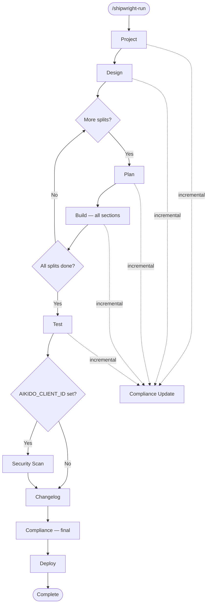

# Hooks & Pipeline Reference

> Single source of truth for understanding what fires when and the impact of pipeline changes.
> **Rule:** When modifying hooks, pipeline phases, validators, or between-phase actions, update this document.
>
> **See also:** `shared/constitution.md` — declarative ALWAYS / ASK FIRST / NEVER boundary rules.
> Hooks enforce a programmatic subset; the constitution covers the complete set.

## Pipeline Flow



### Pipeline Constants

**File:** `plugins/shipwright-run/scripts/lib/orchestrator.py`

```python
PIPELINE_STEPS = ["project", "design", "plan", "build", "test", "changelog", "compliance", "deploy"]
CONDITIONAL_STEPS = {"security": {"env_var": "AIKIDO_CLIENT_ID", "after": "test"}}
```

**Dashboard display order:** `shared/scripts/tools/update_build_dashboard.py`
```python
PIPELINE_PHASES = ["project", "design", "plan", "build", "test", "changelog", "deploy", "compliance"]
```
Dashboard uses `PIPELINE_PHASES` as canonical order, merging dynamic steps (e.g., "security") from `run_config["pipeline"]`.
After build completes: shows split summary table. After test completes: shows test layer results (unit/integration/pgtap/smoke/e2e/design_fidelity).

---

## hooks.json Format

> **Breaking change (April 2025):** Claude Code now requires the new hooks format.
> Plugins with old-format hooks are **skipped entirely** (not just the invalid settings).

**New format** — event types at top level, no `{"hooks": {...}}` wrapper:

```json
{
  "EventName": [
    {
      "matcher": {"tools": ["Bash"]},
      "hooks": [
        {"type": "command", "command": "path/to/script.sh"}
      ]
    }
  ]
}
```

| Matcher type | Format | Used by |
|-------------|--------|---------|
| Single tool | `"matcher": {"tools": ["Bash"]}` | PreToolUse, PostToolUse |
| Multi tool | `"matcher": {"tools": ["Write", "Edit"]}` | PostToolUse |
| Subagent name | `"matcher": "agent-name"` (plain string) | SubagentStop |
| No filter | Omit `matcher` field entirely | SessionStart, Stop |

Tool names use short form: `Bash`, `Write`, `Edit`, `Read`, `Glob`, `Grep`.

**Old format (removed):** `{"hooks": {"EventName": [{"matcher": "Bash", ...}]}}` — wrapper + string matchers.

---

## Hooks Registry

### Shared Hook: capture_session_id.py

**Script:** `shared/scripts/hooks/capture_session_id.py` — the canonical
SessionStart hook used by **every** plugin via
`${CLAUDE_PLUGIN_ROOT}/../../shared/scripts/hooks/capture_session_id.py`.

Injects into Claude's session context:
- `SHIPWRIGHT_SESSION_ID` — current session id
- `SHIPWRIGHT_PLUGIN_ROOT` — active plugin directory
- `SHIPWRIGHT_PROJECT_ROOT` — resolved via `resolve_project_root()`
  (subdirectory-safe for monorepo layouts; falls back to `cwd`)
- `SHIPWRIGHT_ROOT_SESSION_ID`, `SHIPWRIGHT_LOOP_ID`,
  `SHIPWRIGHT_LOOP_UNIT_ID` — only emitted when parent runner set them
  (autonomous-loop propagation, iterate 14.8+)

Also appends `export SHIPWRIGHT_SESSION_ID=...` to `CLAUDE_ENV_FILE`
(if provided) so bash subprocesses inherit the session id —
`additionalContext` alone does not reach child processes spawned by
Claude's Bash tool. Idempotent: never duplicates the export line.

This single hook replaced 8 per-plugin duplicates that used to live
under `plugins/*/scripts/hooks/capture-session-id.py` (iterate 14.9).

### Shared Hook: audit_phase_quality_on_stop.py

**Script:** `shared/scripts/hooks/audit_phase_quality_on_stop.py` —
consolidated Stop-event entry point for the Phase-Quality audit.
Wired into every plugin that has a Stop hook (10 plugins; `run` and
`preview` have no Stop hook).

**Contract:**
- Non-blocking. Always exits 0 even on internal errors.
- Idempotent via `(phase, run_id, session_id)` triple.
- Silent no-op for greenfield / non-Shipwright projects.
- Gated off when `SHIPWRIGHT_PHASE_QUALITY=0`.

**Categories (complete — epic PR 1-4):**
- `canon` — C1-C5 Minimum Phase Completion Canon via
  `shared/scripts/tools/verifiers/common.py` helpers. Covers the
  standalone-Canon gap that was not enforced before (previously only
  the orchestrator's `update_step` ran Canon).
- `workflow` (PR 2) — phase-specific skill-step checks. Each phase has
  a thin wrapper module in
  `shared/scripts/tools/verifiers/<phase>_compliance.py` that returns
  finding dicts; `run_workflow_checks` dispatches on phase name and is
  resilient to broken wrappers (never crashes the Stop chain).
- `infrastructure`, `traceability`, `quality` (PR 3) — cross-phase
  modules at `shared/scripts/tools/verifiers/{infrastructure,
  traceability,quality}_checks.py` that expose a single
  `run(phase, project_root)` entry point. The phase_quality dispatcher
  lazy-imports each module and applies the plugin-coverage gate (plan
  § 5.1). Broken modules surface as one error finding — same resilience
  contract as the workflow dispatcher.
- `spec` (PR 4) — cross-phase spec category at
  `shared/scripts/tools/verifiers/spec_checks.py`. Runs S1-S10 against
  the top-level spec (agent_docs/spec.md), per-iterate spec files,
  CLAUDE.md, README.md, FR coherence, and git-based doc-freshness
  heuristics. Uses `lib/spec_parser.py` for FR heading parsing.

**Check catalog (PR 2-3 — plan § 3):**

Each check emits a finding with `id`, `status` (PASS/FAIL/WARN/SKIP),
`evidence`, optional `remediation`, and `tier`=2 for heuristic
(never-enforcement) checks. Marker-based PASSes carry
`provenance: unverified_marker` so the dashboard flags spoof-susceptible
evidence (plan § 4.5).

**Workflow category (PR 2):**

| ID | Phase | Default on Missing | Tier | Evidence Source |
|---|---|---|---|---|
| W1 | build | SKIP (never FAIL — R8) | 2 | `shipwright_events.jsonl`: `test_run` timestamp ≤ latest `work_completed` |
| W2 | iterate | FAIL | 1 | `planning/iterate/{run_id}-external-review.json` OR `external_review_state.json` newer than spec |
| W3 | iterate | FAIL | 1 | `work_completed` event (source=iterate) + `compliance/test-evidence.md` mtime <24h |
| W4 | test | FAIL | 1 | `shipwright_test_results.json.coverage.total` ≥ `shipwright_test_config.json.coverage.min` (default 70) |
| W5 | plan | FAIL | 1 | `planning/external_review_state.json` status=`completed` OR `skipped_*` with non-empty reason |
| W6 | changelog | FAIL | 1 | Wrapper around `changelog_checks.check_git_tag_exists` |
| W7 | deploy | FAIL | 1 | `shipwright_deploy_config.json.smoke_test_status` OR `test_results.smoke.status` OR latest `test_run` event layer `smoke.status == "pass"` |
| Sec1 | security | FAIL | 1 | `compliance/security-scan-report.md` mtime ≥ latest `phase_started[security]` |
| Sec2 | security | FAIL | 1 | No pipe-table row containing both `CRITICAL` and `UNRESOLVED`/`OPEN`/`FAIL` — or active override line in `compliance/compliance_overrides.log` |
| Cmp1 | compliance | WARN | 2 | `compliance/dashboard.md` mentions every `run_config.completed_steps` phase (Tier-2, redundant with C2) |
| Cmp2 | compliance | FAIL | 1 | `traceability-matrix.md` coverage ≥ `shipwright_compliance_config.json.enforcement.rtm_coverage_min` (default 80%) |
| D1 | design | FAIL | 1 | ≥1 artifact: `designs/mockups/*.html` OR `agent_docs/screens.md` OR `agent_docs/user-flow.md` |
| D2 | design | WARN | 2 | Both `agent_docs/screens.md` and `agent_docs/user-flow.md` present + non-empty |

**Infrastructure category (PR 3):** `shared/scripts/tools/verifiers/infrastructure_checks.py`

| ID | Phase(s) | Default on Missing | Tier | Evidence Source |
|---|---|---|---|---|
| I1 | build, iterate | FAIL | 1 | `compliance/traceability-matrix.md` mtime ≥ latest `phase_completed[phase]` (10s tolerance). SKIP if no event (R11). |
| I2 | build, test, iterate | FAIL | 1 | `compliance/test-evidence.md` mtime ≥ latest `phase_started[phase]`. SKIP if no event. |
| I3 | build, iterate, changelog | FAIL | 1 | `compliance/change-history.md` mtime ≥ latest `phase_started[phase]`. SKIP if no event. |
| I4 | build, iterate | WARN (never FAIL — Tier-2) | 2 | `compliance/sbom.md` freshness — only surfaces when `pyproject.toml` / `package.json` / `requirements.txt` mtime > SBOM mtime. SKIP on clean runs. |

**Traceability category (PR 3):** `shared/scripts/tools/verifiers/traceability_checks.py`

| ID | Phase(s) | Default on Missing | Tier | Evidence Source |
|---|---|---|---|---|
| T1 | project, iterate | FAIL | 1 | Every FR from `planning/*/spec.md` (via `drift_parsers.collect_requirements_from_planning`) appears in `compliance/traceability-matrix.md`. |
| T2 | project, iterate | WARN (never FAIL — R12) | 2 | No FR id referenced in RTM missing from every spec. Tier-2 — FR renames produce legitimate FPs. |

**Quality category (PR 3):** `shared/scripts/tools/verifiers/quality_checks.py`

| ID | Phase(s) | Default on Missing | Tier | Evidence Source |
|---|---|---|---|---|
| Q1 | project, plan, build, iterate | WARN (never FAIL — R13) | 2 | Latest ADR in `agent_docs/decision_log.md` has Context ≥50, Decision ≥30, Consequences ≥30 chars. Uses `lib/adr_parser.py` (handles both bullet-form and section-form). |
| Q2 | build | FAIL | 1 | Every section in `shipwright_plan_snapshot.json` (falls back to `planning/sections/*.md` / `planning/<split>/sections/*.md`) has status ∈ {complete, completed, done} in `shipwright_build_config.json.sections`. SKIP when no plan material. |

**Spec category (PR 4):** `shared/scripts/tools/verifiers/spec_checks.py`

| ID | Phase(s) | Default on Missing | Tier | Evidence Source |
|---|---|---|---|---|
| S1 | project | FAIL | 1 | `agent_docs/spec.md` exists, non-empty, ≥1 `## FR-...` heading (via `lib/spec_parser.count_fr_headings`). |
| S2 | iterate (medium+) | FAIL | 1 | `planning/iterate/<*run_id*>.md` present when `iterate_history[run_id].complexity` ∈ {medium, large}. SKIPs for trivial/small (R15). |
| S3 | iterate (medium+) | WARN (never FAIL — R17) | 2 | `planning/iterate/<*run_id*>-miniplan.md` present when complexity ≥ medium. SKIPs below medium. |
| S4 | iterate | WARN (never FAIL — R16) | 2 | Git-diff of `agent_docs/spec.md` over last 10 commits: removed FR ids must retain `status: deprecated`. SKIPs without git history. |
| S5 | project, iterate | WARN (never FAIL) | 2 | Every FR heading across `agent_docs/spec.md`, `planning/*/spec.md`, and `planning/iterate/*.md` has Description + Acceptance sections (via `lib/spec_parser.compute_fr_coherence`). |
| S6 | project | FAIL | 1 | `CLAUDE.md` exists at project root, non-empty. |
| S7 | project | WARN (never FAIL) | 2 | `CLAUDE.md` has a `## Structure` fenced code block (via `lib/drift_parsers.extract_structure_block`). |
| S8 | project | FAIL | 1 | `README.md` exists, non-empty. |
| S9 | iterate (type=feature + UI-facing diff) | WARN (never FAIL — R17) | 2 | `README.md` touched within last 10 commits AND recent diff includes `webui/client/`, `frontend/`, `client/`, `web/`, `src/components/`, or `mobile/` path. SKIPs otherwise. |
| S10 | iterate (type ∈ {feature, bug, bugfix}) | WARN (never FAIL — R17) | 2 | `CLAUDE.md` touched recently when new top-level directories appear in last 10 commits that aren't listed in the CLAUDE.md Structure block. SKIPs otherwise. |

Tier-2 checks (W1, I4, T2, Q1, S3-S5, S7, S9, S10, Cmp1, D2) are
permanently excluded from enforcement rollout — they land in the
dashboard as heuristic signal only (plan § 3, § 9.2).

**Artifacts written (deterministically regenerated):**
| File | Purpose | Retention |
|---|---|---|
| `compliance/skill-compliance/<phase>-<run_id>-<session_id>.json` | Per-run Finding JSON (atomic write) | GC → `archive/` after 90d |
| `compliance/skill-compliance-report.md` | Last 10 runs, markdown | cap 10 |
| `agent_docs/skill-compliance-findings.md` | Last 5 runs, SessionStart-Injection source (PR 4 wires the injection) | cap 5 |
| `compliance/skill-compliance-dashboard.md` | Phase × category status matrix | overwritten each run |

Aggregate rewrites serialise through
`.shipwright/locks/phase-quality.lock` so concurrent Stop events from
multiple sessions don't lost-update the summaries.

**Hook order per plugin (plan § 5.1):**
- 9 plugins (project, design, plan, build, test, security, deploy,
  changelog, compliance): `audit_phase_quality_on_stop` runs
  **before** `generate_handoff_on_stop` so the finding JSON lands
  before handoff summarises session state.
- `iterate` Sonderfall: `iterate_stop_finalize` →
  `audit_phase_quality_on_stop` → `write_terminal_marker`. Audit runs
  **after** finalize so F5a/F5b/F7/F11 evidence is on disk when C1-C5
  are evaluated.

**Enforcement flags (all default OFF in code; PR 2-4 wire the effects):**
| Flag | Default | Effect |
|---|---|---|
| `SHIPWRIGHT_PHASE_QUALITY` | `1` (on) | Set to `0` to disable the hook entirely — the documented rollback lever |
| `SHIPWRIGHT_PHASE_QUALITY_MODE` | `audit_inject` (on) | Set to `audit_only` to opt out of SessionStart-Injection and keep findings dashboard-only. Default injects ≤5 Tier-1 FAILs. |
| `SHIPWRIGHT_ENFORCE_CRITICAL_GATES` | `0` | Orchestrator blocks on W5/W6/W7 FAIL (PR 4) |
| `SHIPWRIGHT_ENFORCE_ALL_FAILS` | `0` | Orchestrator blocks on any FAIL (PR 4) |
| `SHIPWRIGHT_SKIP_QUALITY_CHECK` | — | Comma-separated check ids to mark as SKIP (e.g. `C4,S9`) |
| `SHIPWRIGHT_AUDIT_OVERRIDE_REASON` | — | Required justification logged alongside a SKIP |

The `phase_quality` library (`shared/scripts/lib/phase_quality.py`)
exposes the finding schema, plugin→phase mapping, and the six
category runners used by the hook. All finding fields are stable
across PR 1-4.

**SessionStart-Injection flow (PR 4):**

The canonical SessionStart hook `shared/scripts/hooks/capture_session_id.py`
reads `agent_docs/skill-compliance-findings.md` at session start and
injects up to **5 Tier-1 FAILs** as `additionalContext` unless the user
has opted out via `SHIPWRIGHT_PHASE_QUALITY_MODE=audit_only`. Injection
is the default since the Phase-Quality epic completed — rollout
calculus shifted from "wait + opt in" to "ship signal + opt out on
noise" for small/solo setups. Only Tier-1 FAILs are injected; Tier-2
ids (`W1`, `I4`, `T2`, `Q1`, `S3-S5`, `S7`, `S9`, `S10`, `Cmp1`, `D2`)
are filtered out.

```
Session ends → Stop hook writes finding JSON + regenerates
                agent_docs/skill-compliance-findings.md
                    ↓
Next session starts → capture_session_id.py reads summary file
                        ↓
  SHIPWRIGHT_PHASE_QUALITY_MODE == audit_only?
      │
      yes → no injection (explicit opt-out)
      no  → parse ≤ 5 Tier-1 FAILs → append to additionalContext (default)
```

**Orchestrator-Gate flow (PR 4):**

`plugins/shipwright-run/scripts/lib/orchestrator.py::update_step`
reads the most-recent per-phase Phase-Quality finding JSON and
promotes any `W5`/`W6`/`W7` FAIL into an ask-level validation issue
when `SHIPWRIGHT_ENFORCE_CRITICAL_GATES=1`. Default OFF — rollout
week 6 flips the flag (plan § 9.2).

```
update_step(step, status=complete)
    ↓
not force AND not standalone?
    ↓
validate_phase() → base validator issues
    ↓
SHIPWRIGHT_ENFORCE_CRITICAL_GATES == 1?
    │
    yes → load compliance/skill-compliance/<step>-*.json (newest)
          for each workflow finding with id ∈ {W5, W6, W7} AND status=FAIL
            AND tier != 2:
              append ask-level validation_issue with evidence+remediation
    no  → skip critical gate
    ↓
ask-level issues present?
    │
    yes → config.status = needs_validation, save, return (user-blocking)
    no  → mark step complete, advance pipeline
```

Only `W5`/`W6`/`W7` are in the critical-gate allowlist by design
(plan § 9.2) — plan external-review, changelog tag, and deploy
smoke-test are the three "must-not-ship-without" evidence points.
Other FAILs remain audit-only forever (or until an explicit
follow-up adds them to the allowlist). Tier-2 findings are never
promoted, even if their id hypothetically coincides with a gate id.

### shipwright-run

| Event | Matcher | Script | What It Does |
|-------|---------|--------|--------------|
| SessionStart | — | `capture_session_id.py` (shared) | See Shared Hook section above |
| Stop | — | `generate-handoff.py` | Writes `agent_docs/session_handoff.md` for resume |

### shipwright-project

| Event | Matcher | Script | What It Does |
|-------|---------|--------|--------------|
| SessionStart | — | `capture_session_id.py` (shared) | See Shared Hook section above |
| Stop | — | `audit_phase_quality_on_stop.py` (shared) | Phase-quality audit (canon C1-C5 + T1/T2 traceability + Q1 ADR substance Tier-2 + S1 spec-has-FR, S5 FR-coherence Tier-2, S6 CLAUDE.md, S7 Structure-block Tier-2, S8 README) |
| Stop | — | `generate-handoff.py` | Session handoff |

### shipwright-design

| Event | Matcher | Script | What It Does |
|-------|---------|--------|--------------|
| SessionStart | — | `capture_session_id.py` (shared) | See Shared Hook section above |
| Stop | — | `audit_phase_quality_on_stop.py` (shared) | Phase-quality audit (canon C1-C5 + D1/D2 workflow) |
| Stop | — | `generate-handoff.py` | Session handoff |

### shipwright-plan

| Event | Matcher | Script | What It Does |
|-------|---------|--------|--------------|
| SessionStart | — | `capture_session_id.py` (shared) | See Shared Hook section above |
| SubagentStop | `shipwright-plan:section-writer` | `write-section-on-stop.py` | Persists section files from subagent output to disk |
| Stop | — | `audit_phase_quality_on_stop.py` (shared) | Phase-quality audit (canon C1-C5 + W5 external-review marker + Q1 ADR substance, Tier-2) |
| Stop | — | `generate-handoff.py` | Session handoff |

### shipwright-build

| Event | Matcher | Script | What It Does |
|-------|---------|--------|--------------|
| SessionStart | — | `capture_session_id.py` (shared) | See Shared Hook section above |
| SessionStart | — | `check_drift.py` | Timestamp drift + content drift (Structure block vs filesystem, Development `npm run` vs package.json) |
| PreToolUse | `{"tools": ["Bash"]}` | `validate_command.sh` | Blocks dangerous shell commands (rm -rf, force push, etc.) |
| PostToolUse | `{"tools": ["Write", "Edit"]}` | `check_destructive_migration.sh` | Warns on DROP/DELETE in .sql files without down.sql |
| PostToolUse | `{"tools": ["Write", "Edit"]}` | `check_secrets.sh` | Scans written files for API keys, tokens, passwords |
| PostToolUse | `{"tools": ["Write", "Edit"]}` | `check_file_size.sh` | Warns if file exceeds size limit |
| PostToolUse | — (catch-all) | `track_tool_calls.py` | Increments tool call counter for context pressure detection |
| Stop | — | `audit_phase_quality_on_stop.py` (shared) | Phase-quality audit (canon C1-C5 + W1 TDD-order Tier-2 + I1-I4 infrastructure freshness + Q1/Q2 quality) |
| Stop | — | `generate-handoff.py` | Session handoff (namespaced to `planning/handoffs/<loop_id>/` when `SHIPWRIGHT_LOOP_ID` set) |
| Stop | — | `check_documentation.py` | Verifies documentation artifacts are up to date |
| Stop | — | `write_terminal_marker.py` | Writes `.shipwright/runs/<loop_id>/<unit_id>/DONE` (no-op without loop env vars) |

### shipwright-test

| Event | Matcher | Script | What It Does |
|-------|---------|--------|--------------|
| SessionStart | — | `capture_session_id.py` (shared) | See Shared Hook section above |
| Stop | — | `audit_phase_quality_on_stop.py` (shared) | Phase-quality audit (canon C1-C5 + W4 coverage threshold + I2 test-evidence freshness) |
| Stop | — | `generate-handoff.py` | Session handoff |

### shipwright-iterate

| Event | Matcher | Script | What It Does |
|-------|---------|--------|--------------|
| SessionStart | — | `capture_session_id.py` (shared) | See Shared Hook section above |
| SessionStart | — | `check_drift.py` | Timestamp + content drift (catches Shipwright-repo self-drift when iterating on Shipwright itself) |
| Stop | — | `iterate_stop_finalize.py` | Shared handoff + fallback `finalize_iterate.py` (compliance, dashboard, handoff). Freshness-gated: skips if `finalize_iterate.py` already ran. |
| Stop | — | `audit_phase_quality_on_stop.py` (shared) | Phase-quality audit (canon C1-C5 + W2/W3 iterate workflow + I1-I4 infrastructure + T1/T2 traceability + Q1 ADR substance + S2 iterate-spec for medium+ + S3 miniplan Tier-2 + S4 FR-preservation Tier-2 + S5 FR-coherence Tier-2 + S9 README-freshness Tier-2 + S10 CLAUDE.md-sync Tier-2) — runs **after** finalize so F5a/F5b/F7/F11 evidence is on disk |
| Stop | — | `write_terminal_marker.py` | Writes `.shipwright/runs/<loop_id>/<unit_id>/DONE` (no-op without loop env vars) |

### shipwright-changelog

| Event | Matcher | Script | What It Does |
|-------|---------|--------|--------------|
| SessionStart | — | `capture_session_id.py` (shared) | See Shared Hook section above |
| Stop | — | `audit_phase_quality_on_stop.py` (shared) | Phase-quality audit (canon C1-C5 + W6 git-tag existence + I3 change-history freshness) |
| Stop | — | `generate-handoff.py` | Session handoff |

### shipwright-deploy

| Event | Matcher | Script | What It Does |
|-------|---------|--------|--------------|
| Stop | — | `audit_phase_quality_on_stop.py` (shared) | Phase-quality audit (canon C1-C5 + W7 smoke-test status) |
| Stop | — | `generate-handoff.py` | Session handoff |

### shipwright-security

| Event | Matcher | Script | What It Does |
|-------|---------|--------|--------------|
| SessionStart | — | `capture_session_id.py` (shared) | See Shared Hook section above |
| SessionStart | — | `check_drift.py` | Timestamp drift + content drift (Structure block vs filesystem, Development `npm run` vs package.json) |
| Stop | — | `audit_phase_quality_on_stop.py` (shared) | Phase-quality audit (canon C1-C5 + Sec1 report freshness + Sec2 unresolved CRITICAL check) |
| Stop | — | `generate-handoff.py` | Session handoff |

### shipwright-compliance

| Event | Matcher | Script | What It Does |
|-------|---------|--------|--------------|
| SessionStart | — | `capture_session_id.py` (shared) | See Shared Hook section above |
| PreToolUse | `{"tools": ["Bash"]}` | `check_rtm_coverage.py` | Soft-blocks if RTM coverage < 80% threshold |
| PreToolUse | `{"tools": ["Bash"]}` | `check_security_scan.py` | Checks security scan completion status |
| Stop | — | `audit_phase_quality_on_stop.py` (shared) | Phase-quality audit (canon C1-C5 + Cmp1 dashboard-per-phase Tier-2, Cmp2 RTM coverage) |
| Stop | — | `generate-handoff.py` | Session handoff |

### Project-installed (not a plugin hook)

`shared/scripts/hooks/suggest_iterate.py` is installed into the **target project's** `.claude/settings.json` by `/shipwright-project`, `/shipwright-run`, and every phase skill (auto-install, idempotent). It fires on `UserPromptSubmit` inside any directory containing `shipwright_run_config.json`.

| Event | Matcher | Script | What It Does |
|-------|---------|--------|--------------|
| UserPromptSubmit | — | `suggest_iterate.py` | Multilingual (en/de) phase router: maps free-text prompts to the right Shipwright phase, falls back to `/shipwright-iterate` for post-test code changes |

**Routing logic** (`shared/scripts/hooks/suggest_iterate.py`):

1. **Guards** — exit silently if: no `shipwright_run_config.json` in cwd, config unreadable, prompt starts with `/`, or prompt shorter than 10 characters.
2. **`status == "complete"`** → `handle_completed_pipeline`:
   - Phase-keyword match (test / deploy / compliance / changelog / design / plan) → emit suggestion pointing at the matching slash command.
   - No phase match → delegate to `classify_for_iterate` (wraps `plugins/shipwright-iterate/scripts/lib/classify_intent.py`), which classifies FEATURE / BUGFIX / REFACTOR and emits an `/shipwright-iterate --type` hint.
3. **`status == "in_progress"`** → `handle_in_progress_pipeline`:
   - Phase-keyword match and phase != `current_step` → intent-mismatch warning (suggests standalone slash command or `/shipwright-run`).
   - **Post-test fallback:** no phase-keyword match and `test ∈ completed_steps` → delegate to `classify_for_iterate`. This prevents the "stale limbo" where post-test code-change prompts get silently dropped while `changelog`/`deploy`/`compliance` are still pending.
   - Otherwise → silent.
4. **Any other status** → silent.

**Pattern registry** (`PHASE_PATTERNS`): multilingual regex per phase (en/de today, extensible for fr/it). Keys: `test`, `deploy`, `compliance`, `changelog`, `design`, `plan`. Maintenance rule: when adding a new phase or a new language, update both `PHASE_PATTERNS` and `shared/tests/test_suggest_iterate.py`.

---

## Phase Validators

**File:** `plugins/shipwright-run/scripts/lib/phase_validators.py`

Called by `orchestrator.py:update_step()` before marking a phase complete. Returns issues with severity `ask` or `inform`.

| Phase | Severity | Validation Check |
|-------|----------|-----------------|
| project | ASK | Config exists, splits defined, spec.md per split |
| design | ASK | Mockup HTML files exist (may be intentionally skipped) |
| plan | ASK | Sections defined in build config, section .md files exist |
| build | ASK | All current-split sections complete, all have tests_total > 0 |
| test | ASK | `shipwright_test_results.json` exists; all layers have results or valid skip reason; unit/smoke must pass (outcomes checked); E2E failures logged as inform-level warnings |
| changelog | ASK | `CHANGELOG.md` exists |
| deploy | PASS | Always passes |
| compliance | INFORM | Lists which of 5 compliance artifacts are present (non-blocking) |

**Override mechanism:** `--force` flag on `update-step` skips validation (user approved via AskUserQuestion).

**Flow:** `update-step --status complete` → validator runs → if ASK issues found → returns `status: "needs_validation"` → SKILL.md asks user → user says "continue" → `update-step --status complete --force` → phase completes.

---

## Subagent Timing & Data Flow

### section-builder (Build Phase)

```
section-builder subagent
  → writes code, runs tests
  → calls update_section_state.py (updates shipwright_build_config.json)
  → returns JSON result to orchestrator
orchestrator autopilot loop
  → checks get-build-progress → split_done?
  → only after ALL sections done: update-step --step build --status complete
  → validate_build() fires (checks current split sections only)
```

### test-runner (Test Phase)

```
test-runner subagent
  → runs unit tests (vitest)
  → runs smoke test (HTTP health check)
  → Step 3.5: checks e2e/ for .spec.ts files
    → if missing: reads planning/*/claude-plan-e2e.md
    → generates e2e/flows/*.spec.ts + e2e/pages/*.page.ts
  → runs Playwright E2E (against dev server)
  → writes shipwright_test_results.json to project root
  → returns JSON result to orchestrator
orchestrator
  → parses result (unit/smoke/e2e with real counts)
  → if E2E plans exist but E2E skipped: AskUserQuestion
  → calls update-step --step test --status complete
  → validate_test() fires (checks results file exists, all layers have results)
  → update_build_dashboard.py with "X/Y unit, A/B E2E"
  → update_compliance.py --phase test (reads test results for evidence)
```

### section-writer (Plan Phase)

```
section-writer subagent
  → generates section spec content
  → SubagentStop hook fires write-section-on-stop.py
  → section .md files written to disk
plan SKILL completes
  → update-step --step plan --status complete
  → validate_plan() fires (checks sections exist in config + files on disk)
```

---

## Config File Data Flow

| Config File | Written By | Read By |
|-------------|-----------|---------|
| `shipwright_run_config.json` | orchestrator.py | All phases (resume), dashboard, validators |
| `shipwright_project_config.json` | /shipwright-project | Orchestrator (splits), compliance (requirements), validators |
| `shipwright_build_config.json` | /shipwright-build, update_section_state.py | Orchestrator (progress), dashboard, compliance, validators |
| `shipwright_test_results.json` | test-runner subagent | Compliance (test evidence), validators |
| `shipwright_compliance_config.json` | update_compliance.py | Compliance (phases_covered) |
| `shipwright_plan_config.json` | /shipwright-plan | Build (section references) |
| `shipwright_project_session.json` | /shipwright-project | /shipwright-project (session resume state) |
| `shipwright_plan_session.json` | /shipwright-plan | /shipwright-plan (session resume state) |
| `external_review_state.json` | /shipwright-plan Step 5, /shipwright-iterate (medium+) | /shipwright-plan Step 6 resume gate, compliance evidence collector |
| `shipwright_security_config.json` | /shipwright-security | /shipwright-security, compliance (scan results) |

---

## Context Loading by Phase

Each plugin reads project context at startup to ensure consistency. This table shows what each phase loads before its main work begins.

### Artifact Read Matrix

| Artifact | project | design | plan | build | test | deploy | iterate | compliance |
|----------|---------|--------|------|-------|------|--------|---------|------------|
| constitution.md | read | read | read | read | read | read | read | read |
| CLAUDE.md | ext | C2 | C2 | C2 | — | — | B2 | — |
| conventions.md | ext | — | C2 | C2 | — | — | B2 | — |
| decision_log.md | ext | — | C2 | C2 | — | — | B2 | read |
| architecture.md | ext | C2 | C2 | C2 | B2 | — | B2 | — |
| sync_config.json | ext | — | — | — | — | — | B2 | — |
| spec.md (all splits) | ext | Step 1 | own | own section | — | — | B2 | read |
| git log | ext | — | C2 | C2 | — | — | B2 | read |
| test_results.json | — | — | — | — | B2 | B3 gate | B2 | read |
| visual-guidelines.md | — | creates | — | build | 3.6 | — | design ref | — |
| events.jsonl | — | — | — | — | — | — | B2 | read |
| run_config.json | — | — | — | — | — | — | B2 | read |
| project_config.json | — | Step 1 | — | — | B | B2 | — | read |
| build_config.json | — | — | — | D (read+write) | — | — | — | read |

**Key:** `read` = loaded at startup, `ext` = Extension scope only, `C2`/`B2`/`B3` = specific step name,
`own` = only its own spec/section, `gate` = must-pass check before proceeding, `creates` = generated by that phase (consumed by later phases), `read+write` = step reads existing state, mutates it, writes back, `—` = not loaded.

### Artifact Write Matrix

| Artifact | Created By | Updated By |
|----------|-----------|-----------|
| `CLAUDE.md` | project | — |
| `conventions.md` | project | write_decision_log.py (convention impact), reflection protocol (build, test, deploy, iterate) |
| `decision_log.md` | project (init) | plan, build, deploy, iterate (via write_decision_log.py) |
| `architecture.md` | project | write_decision_log.py (architecture impact) |
| `build_dashboard.md` | update_build_dashboard.py | build, test, changelog, deploy, iterate, **Stop hook** (all plugins) |
| `session_handoff.md` | generate_handoff_on_stop.py | all plugins (Stop hook), **finalize_iterate.py** (iterate) |
| `events.jsonl` | record_event.py | build, iterate, test, deploy, changelog, orchestrator (append-only) |
| `test_results.json` | test, iterate | test, iterate |
| `compliance/*` | compliance plugin | update_compliance.py (all phases trigger), **Stop hook** (all plugins, best-effort), **finalize_iterate.py** (iterate) |
| `sync_config.json` | project | iterate (FR mappings) |
| `{migrations.dir}` (profile) | build, iterate (create + apply DEV, serialized) | deploy (PROD apply only) |

---

## Between-Phase Actions

Executed by the orchestrator between each skill invocation (orchestrate SKILL.md):

1. **Phase Validation & Completion** — `update-step --status complete` triggers `phase_validators.py`. If ASK issues found, asks user before proceeding.
2. **Record Phase Event** — `record_event.py --type phase_completed --phase {phase}` appends to `shipwright_events.jsonl`.
3. **Upstream Success Check** — Reads `shipwright_run_config.json`, verifies previous phase is in `completed_steps`. Prevents cascading failures.
4. **Incremental Compliance Update** — `update_compliance.py --phase {phase}` (non-blocking subprocess, errors swallowed).
5. **Dashboard Update** — `update_build_dashboard.py --phase {phase}` refreshes `agent_docs/build_dashboard.md`.
6. **Tool Counter Reset** — `reset_tool_counter.py` prevents stale counts from triggering false context pressure.
7. **Context Pressure Check** — `estimate_context_pressure.py --threshold 120`. If `recommend_checkpoint` is true, generates handoff and stops.

### Split-Loop (Build Phase)

After build completes for a split:
- `update_step()` calls `get_build_progress()`
- If `all_done == false`: removes `plan` and `build` from `completed_steps`, sets `current_step = "plan"`
- Records `split_completed` event via `record_event.py --type split_completed --split {name}`
- Test/changelog/deploy/compliance only run after `all_done == true`

---

## Event Emission Points

The unified event log (`shipwright_events.jsonl`) is written to by these components:

| Emitter | Event Type | When | Detail |
|---------|-----------|------|--------|
| WebUI / Iterate SKILL.md | `task_created` | User creates task or iterate starts | description, intent?, priority? |
| Project SKILL.md (Step 8) | `phase_completed` (phase=project) | Scaffolding + specs validated | Split count via `--detail` |
| Design review-loop.md (finalize) | `phase_completed` (phase=design) | Design finalized | Screen/flow count via `--detail` |
| Plan SKILL.md (Step 9) | `phase_completed` (phase=plan) | Sections validated | Section count via `--detail` |
| Orchestrator (between phases) | `phase_started` | Phase begins | — |
| Orchestrator (between phases) | `phase_completed` | Phase validated + complete | — (deduplicated by record_event.py) |
| Orchestrator (split loop) | `split_completed` | All sections of a split done | — |
| Build SKILL.md (Step 10) | `work_completed` (source=build) | Section committed | — |
| Iterate SKILL.md (F3.5) | `work_completed` (source=iterate) | Iterate change committed | — |
| Test SKILL.md (Step 5) | `test_run` | Full test suite executed | unit/e2e/smoke layer counts |
| Deploy SKILL.md (Step 5) | `phase_completed` (phase=deploy) | Deploy smoke test passed | Deploy URL via `--detail` |
| Changelog SKILL.md (Step 7) | `phase_completed` (phase=changelog) | PR created or tag pushed | Version + PR URL via `--detail` |

All events share common fields: `v` (schema version), `id` (UUID-based), `ts` (ISO timestamp), `type`, and optional `session`.

---

## Architecture Impact Tracking

When writing decision log entries, the `--architecture-impact` flag on `write_decision_log.py` automatically appends update notes:

| Impact Type | Target File | Section Added |
|-------------|-------------|---------------|
| `component` | `agent_docs/architecture.md` | `## Architecture Updates` |
| `data-flow` | `agent_docs/architecture.md` | `## Architecture Updates` |
| `convention` | `agent_docs/conventions.md` | `## Convention Updates` |
| `none` | — | No update |

Format: `- **ADR-NNN** (YYYY-MM-DD): Short description`

### Reflection Protocol

In addition to ADR-driven architecture impact, the **reflection protocol** (`references/reflection.md` in each plugin) updates `conventions.md` at the end of build (Step 10a), test, deploy, and iterate (F3a) phases. Two mechanisms:

| Learning Type | Mechanism | Target |
|---------------|-----------|--------|
| Decisions (pattern chosen, convention corrected) | `write_decision_log.py --architecture-impact convention` | `conventions.md` → `## Convention Updates` (with ADR ref) |
| Observations (gotchas, framework quirks) | Direct append | `conventions.md` → `## Learnings` (no ADR) |
| Cross-project insights | Claude Code Memory (main conversation only) | `.claude/` memory system |

---

## GitHub Repo Hygiene

During `/shipwright-project` Step 7 (Scaffolding), if the project has a GitHub remote:

| Setting | Value | Why |
|---------|-------|-----|
| `delete_branch_on_merge` | `true` | Prevents stale feature branches after PR merges (CLI or UI) |

This complements `gh pr merge --merge --delete-branch` in `/shipwright-changelog` Step 7, which only fires on CLI merges.

---

## Self-Healing Artifacts

When a phase detects missing prerequisite artifacts, it should attempt to derive them from available project context before skipping. This is a **constitution rule** (ALWAYS section).

### Derivation Chain

| Missing Artifact | Derived From | Used By |
|---|---|---|
| `designs/visual-guidelines.md` | CSS `:root` variables in `designs/screens/*.html` | Build (Browser Verify), Test (Consistency) |
| `designs/screen-routes.json` | Mockup filenames + router config (`src/router.tsx`) | Test (Design Fidelity), Build (Design Fidelity) |
| `planning/claude-plan-e2e.md` | `screen-routes.json` + `architecture.md` | Test (E2E Spec Generation) |
| `dev_url` in build config | `CLAUDE.md` (`PORT=`), `package.json` scripts (`--port`) | Test (Smoke, E2E), Build (Browser Verify) |
| `playwright.config.ts` | Template + `dev_url` port substitution | Test (E2E), Build (Browser Verify) |

### Which Phases Auto-Generate

| Phase | Can Auto-Generate |
|---|---|
| **Build** (Step 4.5) | `visual-guidelines.md`, `dev_url` detection |
| **Test** (Step B3) | `visual-guidelines.md`, `screen-routes.json`, `claude-plan-e2e.md`, `dev_url`, `playwright.config.ts` |
| **Plan** (Step 8) | `claude-plan-e2e.md` (if UI project, default enabled) |

### Scripts Supporting Self-Healing

| Script | Self-Healing | Details |
|---|---|---|
| `dev_server.py` | Reads `shipwright_build_config.json` for `dev_url` when profile is unknown | Fallback for custom profiles |
| `playwright_setup.py` | Substitutes port from build config into template | Prevents hardcoded port 3000 |

---

## Minimum Phase Completion Canon (C1–C5)

Iterate 12.0 introduces the **Minimum Phase Completion Canon** —
a five-step finalization checklist that every decision-taking Shipwright
phase should satisfy so cross-artifact sync invariants stay aligned.

The canon is enforced by `shared/scripts/tools/verifiers/*_checks.py`
(one module per phase) and dispatched through
`shared/scripts/tools/verify_phase.py`. Iterate 12.0 shipped the
infrastructure (verifier package, helper scripts, canon definition) and
the **iterate** module (migrated from `verify_iterate_finalization.py`
with identical behaviour). Iterate 12.0b wired runtime zombie-task
reconciliation; 12.1 added project + stop-hook conditional skip; 12.2
added design + plan; 12.3 added build (canon hybrid per section / phase);
12.4 added test, changelog and deploy. Iterate 12.6 closed the campaign
with the Canon Coverage matrix below. **Iterate 12.5 (compliance) was
struck** — compliance is future detective-only via shipwright-check,
not a canon target.

### Canon Steps

| Step | Requirement | Tool | Severity |
|---|---|---|---|
| **C1** | `phase_completed` event recorded in `shipwright_events.jsonl` | `shared/scripts/tools/record_event.py --type phase_completed --source <phase>` | **ERROR** |
| **C2** | `agent_docs/build_dashboard.md` reflects the phase | `shared/scripts/tools/update_build_dashboard.py --phase <phase>` | **WARNING** |
| **C3** | `agent_docs/session_handoff.md` regenerated with phase-specific reason | `shared/scripts/tools/generate_session_handoff.py --reason "<phase>: …"` | **WARNING** |
| **C4** | `agent_docs/decision_log.md` has a new ADR referencing the phase | `shared/scripts/tools/write_decision_log.py --title …` | **ERROR** (only for decision-taking phases) |
| **C5** | `CHANGELOG.md [Unreleased]` has a bullet under the right Keep-a-Changelog category | `shared/scripts/tools/append_changelog_entry.py --category <Added\|Changed\|Fixed\|…> --entry "…"` | **ERROR** (only for user-facing phases) |

### C4 Skip Criteria — Who Gets an ADR

ADRs are for **actual architectural decisions**, not routine phase
events. C4 applies to:

- `iterate` — the canonical source of architectural decisions
- `project` — initial architecture choices and constraint capture
- `plan` — planning decisions that constrain build
- `build` — per-section decisions (existing behaviour)

C4 is **skipped** for:

- `design` — transformation of an existing spec, not a new decision
- `test` — execution, not a decision
- `changelog` — a release event, not a decision
- `deploy` — an operational event, not a decision
- `compliance` — derived from other phases (detective, not productive)

### C5 Skip Criteria — User-Facing vs. Operational

C5 applies to phases whose output is visible in a product release:

- `iterate` (existing behaviour)
- `project` — category **Added**: "Project initialized: …"
- `design` — category **Added**: "UI mockups: N screens, M flows"
- `build` — category **Added**/**Changed**/**Fixed** per section,
  appended at phase-completion (not per-section)
- `deploy` — category **Changed**: "Deployed to <env>" (user visible)

C5 is **skipped** for:

- `plan` — internal, not user-visible
- `test` — execution status lives in `shipwright_test_results.json`
- `changelog` — this phase *owns* CHANGELOG prepends; writing to
  [Unreleased] would collide with the release tagging flow
- `compliance` — derived artifact, not a user-facing change

### Helper Scripts

Iterate 12.0 introduces two write helpers so every Canon caller goes
through a deterministic, lock-serialised write path:

- **`shared/scripts/tools/append_changelog_entry.py`** — atomic
  Keep-a-Changelog writer with dedupe and cross-platform file-lock
  (`CHANGELOG.md.lock`).
- **`shared/scripts/tools/append_phase_history.py`** — atomic
  read-modify-write on `shipwright_run_config.json::phase_history[<phase>]`,
  with 50-entry retention per phase and file-lock
  (`shipwright_run_config.json.lock`).

Both helpers use `shared/scripts/lib/file_lock.py`, which wraps
`fcntl.flock` on POSIX and `msvcrt.locking` on Windows with a hard
5-second timeout (no silent retry).

### `phase_history` Schema

A new top-level field in `shipwright_run_config.json` parallel to
`iterate_history`:

```json
{
  "phase_history": {
    "project": [{"run_id": "…", "date": "…", "outcome": "…", "splits": N}],
    "design":  [{"run_id": "…", "date": "…", "screens": N, "flows": M}],
    "build":   [{"run_id": "…", "date": "…", "split": "…", "sections": N}]
  }
}
```

- Retention: last 50 entries per phase.
- `iterate` keeps writing to `iterate_history` (richer schema —
  branch, spec path, tests_passed); it is NOT mirrored into
  `phase_history`.
- Phase modules fill `phase_history` starting in iterate 12.1.

#### Why two histories

Shipwright intentionally keeps `iterate_history` and `phase_history`
as separate top-level arrays in `shipwright_run_config.json`. They
track different classes of work: iterate entries are user-invoked
change sessions with a feature branch, PR, iterate spec file, and
test results; phase entries are pipeline-internal execution units
with a `phase_completed` event, canon-marker handoff, and dashboard
update. Unifying the two schemas would either drop iterate-specific
fields (branch, spec path, tests_passed) or force every phase entry
to carry null columns for iterate-only attributes. Consumers that
need a merged view should read both arrays and sort by date — the
asymmetry is the schema, not tech-debt waiting for a migration.

### Verifier Package Layout

```
shared/scripts/tools/
  verify_phase.py                  # Unified CLI: --phase <phase>|all
  verify_iterate_finalization.py   # Thin wrapper, same CLI as before (backwards compat)
  append_changelog_entry.py        # Canon C5 write path
  append_phase_history.py          # phase_history write path
  verifiers/
    __init__.py
    common.py                      # CheckResult, readers, generic C1–C5, ADR F1/F2/F3
    iterate_checks.py              # 5 existing iterate checks (migrated 1:1)    — 12.0
    runtime_checks.py              # Zombie-task replay check                     — 12.0b
    project_checks.py              # Project phase-own + canon + phase_history   — 12.1
    design_checks.py               # Design phase-own + canon (skip C4)          — 12.2
    plan_checks.py                 # Plan phase-own + canon (skip C5) + check-plan C2/C3/C4 imports — 12.2
    build_checks.py                # Build phase-own + canon hybrid + check-plan B3/B6 imports      — 12.3
    test_checks.py                 # Test phase-own + canon (skip C4+C5)         — 12.4
    changelog_checks.py            # Changelog canon + git-tag/version Sonder-Checks — 12.4
    deploy_checks.py               # Deploy phase-own + canon (skip C4+C5)       — 12.4

shared/scripts/lib/
  drift_parsers.py                 # Structure/dev-block/FR/ADR pure parsers
  file_lock.py                     # Cross-platform advisory lock
```

### Canon Coverage — Iterate 12 Final State

Matrix is **code-level coverage**, not runtime status on any given project.
Every cell is derived from a grep audit of `plugins/shipwright-<phase>/skills/<phase>/SKILL.md`
(tool call present in finalization step), `shared/scripts/tools/verifiers/<phase>_checks.py`
(check function present), and `plugins/shipwright-run/scripts/lib/phase_validators.py::_validate_<phase>`
(wired through `_run_canon_checks`).

Legend: ✅ present · ⏭ skip by policy · n/a not applicable

| Phase | C1 event | C2 dashboard | C3 handoff | C4 ADR | C5 CHANGELOG | phase_history | Verifier module | Phase validator |
|---|---|---|---|---|---|---|---|---|
| **iterate** | ✅ F7 | ✅ F5 (`check_build_dashboard_has_run_id`, implemented 14.8) | ✅ F5/F11 | ✅ F3 | ✅ F4 | ✅ `iterate_history` | `iterate_checks.py` + cross-artifact warnings (compliance, architecture, conventions) | `verify_iterate_finalization.py` |
| **runtime** | n/a | n/a | n/a | n/a | n/a | n/a | `runtime_checks.py` (zombie replay) | — |
| **project** | ✅ | ✅ | ✅ (canon-marker) | ✅ (Step 7) | ✅ | ✅ | `project_checks.py` | `_validate_project` |
| **design** | ✅ | ✅ | ✅ (canon-marker) | ⏭ transformation | ✅ | ✅ | `design_checks.py` + FR coverage (check-plan C1 import) | `_validate_design` |
| **plan** | ✅ | ✅ | ✅ (canon-marker) | ✅ (Step 2/5) | ⏭ internal | ✅ | `plan_checks.py` + section-manifest/FR-orphan/section-id (check-plan C2/C3/C4 imports) | `_validate_plan` |
| **build** | ✅ per section | ✅ per section | ✅ phase-level | ✅ per section | ✅ phase-level (one bullet per section) | ✅ with `sections[]` sub-array | `build_checks.py` + B3 test-files + B6 commit-sha (check-plan imports) | `_validate_build` |
| **test** | ✅ (`phase_completed` alongside `test_run`) | ✅ | ✅ (canon-marker) | ⏭ events, not decisions | ⏭ results in `shipwright_test_results.json` | ✅ | `test_checks.py` + `check_test_results_file_fresh` | `_validate_test` |
| **changelog** | ✅ | ✅ | ✅ (canon-marker) | ⏭ process management | n/a (plugin owns prepend) | ✅ | `changelog_checks.py` + `check_git_tag_exists` + `check_changelog_version_matches_tag` Sonder-Checks | `_validate_changelog` |
| **deploy** | ✅ | ✅ | ✅ (canon-marker) | ⏭ execution | ⏭ operational history | ✅ | `deploy_checks.py` + `check_test_gate_passed` phase-own | `_validate_deploy` |
| **compliance** | n/a | n/a | n/a | n/a | n/a | n/a | (none) | (trivial pass) |

**Compliance is intentionally NOT canon-wired** (canon-level enforcement).
Iterate 12.5 was struck from the campaign — compliance is a future
**detective** checker via shipwright-audit, not a productive phase.
However, as of iterate 14.8, compliance is updated **best-effort** by:
1. The shared Stop hook (`generate_handoff_on_stop.py`) for all plugins
2. `finalize_iterate.py` (primary path for iterate)
3. `orchestrator.run_compliance_update()` (between-phase action for `/shipwright-run`)

Non-canon advisory checks (`check_compliance_reflects_run_id`,
`check_architecture_reviewed`, `check_conventions_reviewed`) detect
stale cross-artifacts at WARNING level via `iterate_checks.run_cross_artifact_checks()`.
The explicit `/shipwright-compliance` SKILL is deprecated pending refactor.
See [Spec/shipwright-check-plan.md](../Spec/shipwright-check-plan.md) and
the `project_compliance_rebuild.md` memory entry for the rebuild trigger.

**F-block ADR integrity (F1/F2/F3)** runs out of `common.py` for every
phase verifier automatically. F1 (sequential ids), F2 (valid status),
F3 (supersession targets exist) are shared preventive checks ported
from the shipwright-check plan.

### Stop-Hook Conditional Skip (iterate 12.1)

The `generate_handoff_on_stop.py` PostStop hook previously regenerated
`session_handoff.md` at every turn end, overwriting any canon-marker
handoff that a phase finalization step had just written. Iterate 12.1
fixes this with a pure run-id match:

1. `generate_session_handoff.py --canon-marker --phase <phase>` writes
   YAML frontmatter containing `canon_generated: true` and
   `run_id: <SHIPWRIGHT_RUN_ID>` at the top of `session_handoff.md`.
2. `generate_handoff_on_stop.py` parses that frontmatter. If it exists
   **and** the `run_id` matches the current `SHIPWRIGHT_RUN_ID` env var,
   it skips regeneration entirely — no mtime heuristic, no clock skew
   risk, no restart race.
3. Non-canon handoffs regenerate as before. Handoffs with stale canon
   frontmatter (different run_id) also regenerate.
4. **Safe degrade:** `--canon-marker` without `SHIPWRIGHT_RUN_ID` logs
   a warning to stderr and writes the handoff WITHOUT frontmatter, so
   the Stop hook falls through to normal regeneration.

### Audit Targets for the Verifier

The canon verifier runs against **Shipwright-managed consumer projects**
(those with `shipwright_run_config.json` at project root), not against
the Shipwright monorepo itself. The monorepo root is plugin development
and intentionally has no `shipwright_*_config.json`, `agent_docs/`, or
`build_dashboard.md`; running `verify_phase.py --project-root . --phase all`
against it will report many phase-own failures by design. The authoritative
audit is code-level (the Coverage Matrix above), plus a runtime smoke
test on `webui/` (which **is** a Shipwright-managed child project) —
ERRORs there reflect historical drift from before the canon rollout and
are not in scope for 12.6.

### Writer Audit (iterate 12.0 gate)

Every writer of `shipwright_run_config.json` uses the read-modify-write
pattern (`load_run_config` → mutate → `save_run_config`), so unknown
top-level fields like `phase_history` are preserved automatically.
Authoritative writers:

- `plugins/shipwright-run/scripts/lib/orchestrator.py` — `save_run_config`,
  called by `create_config` (initialises `phase_history: {}` on fresh
  creation) and `update_step`.

No other plugin writes this file directly.
