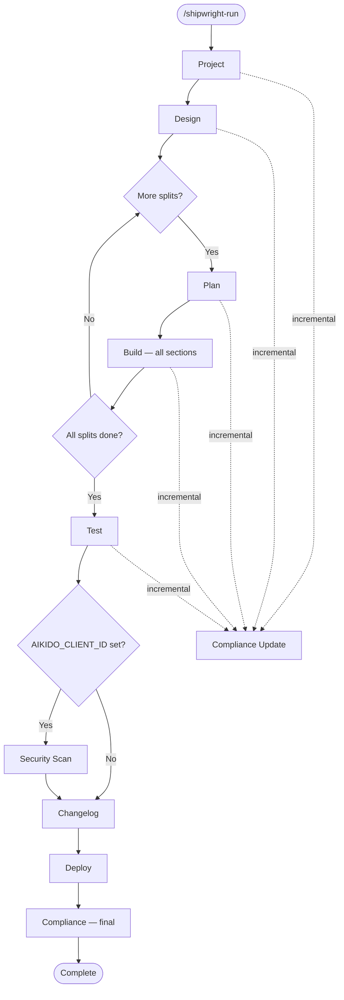

# Hooks & Pipeline Reference

> Single source of truth for understanding what fires when and the impact of pipeline changes.
> **Rule:** When modifying hooks, pipeline phases, validators, or between-phase actions, update this document.
>
> **See also:** `shared/constitution.md` — declarative ALWAYS / ASK FIRST / NEVER boundary rules.
> Hooks enforce a programmatic subset; the constitution covers the complete set.

## Pipeline Flow



### Pipeline Constants

**File:** `plugins/shipwright-run/scripts/lib/orchestrator.py`

```python
PIPELINE_STEPS = ["project", "design", "plan", "build", "test", "changelog", "deploy", "compliance"]
CONDITIONAL_STEPS = {"security": {"env_var": "AIKIDO_CLIENT_ID", "after": "test"}}
```

**Dashboard display order:** `shared/scripts/tools/update_build_dashboard.py`
```python
PIPELINE_PHASES = ["project", "design", "plan", "build", "test", "changelog", "deploy", "compliance"]
```
Dashboard uses `PIPELINE_PHASES` as canonical order, merging dynamic steps (e.g., "security") from `run_config["pipeline"]`.
After build completes: shows split summary table. After test completes: shows test layer results (unit/integration/pgtap/smoke/e2e/visual).

---

## hooks.json Format

> **Breaking change (April 2025):** Claude Code now requires the new hooks format.
> Plugins with old-format hooks are **skipped entirely** (not just the invalid settings).

**New format** — event types at top level, no `{"hooks": {...}}` wrapper:

```json
{
  "EventName": [
    {
      "matcher": {"tools": ["Bash"]},
      "hooks": [
        {"type": "command", "command": "path/to/script.sh"}
      ]
    }
  ]
}
```

| Matcher type | Format | Used by |
|-------------|--------|---------|
| Single tool | `"matcher": {"tools": ["Bash"]}` | PreToolUse, PostToolUse |
| Multi tool | `"matcher": {"tools": ["Write", "Edit"]}` | PostToolUse |
| Subagent name | `"matcher": "agent-name"` (plain string) | SubagentStop |
| No filter | Omit `matcher` field entirely | SessionStart, Stop |

Tool names use short form: `Bash`, `Write`, `Edit`, `Read`, `Glob`, `Grep`.

**Old format (removed):** `{"hooks": {"EventName": [{"matcher": "Bash", ...}]}}` — wrapper + string matchers.

---

## Hooks Registry

### shipwright-run

| Event | Matcher | Script | What It Does |
|-------|---------|--------|--------------|
| SessionStart | — | `capture-session-id.py` | Injects `SHIPWRIGHT_SESSION_ID`, `PLUGIN_ROOT`, `PROJECT_ROOT` into context |
| Stop | — | `generate-handoff.py` | Writes `agent_docs/session_handoff.md` for resume |

### shipwright-project

| Event | Matcher | Script | What It Does |
|-------|---------|--------|--------------|
| SessionStart | — | `capture-session-id.py` | Session ID injection |
| Stop | — | `generate-handoff.py` | Session handoff |

### shipwright-design

| Event | Matcher | Script | What It Does |
|-------|---------|--------|--------------|
| SessionStart | — | `capture-session-id.py` | Session ID injection |
| Stop | — | `generate-handoff.py` | Session handoff |

### shipwright-plan

| Event | Matcher | Script | What It Does |
|-------|---------|--------|--------------|
| SessionStart | — | `capture-session-id.py` | Session ID injection |
| SubagentStop | `shipwright-plan:section-writer` | `write-section-on-stop.py` | Persists section files from subagent output to disk |
| Stop | — | `generate-handoff.py` | Session handoff |

### shipwright-build

| Event | Matcher | Script | What It Does |
|-------|---------|--------|--------------|
| SessionStart | — | `capture-session-id.py` | Session ID injection |
| SessionStart | — | `check_drift.py` | Detects code drift (uncommitted changes from prior sessions) |
| PreToolUse | `{"tools": ["Bash"]}` | `validate_command.sh` | Blocks dangerous shell commands (rm -rf, force push, etc.) |
| PostToolUse | `{"tools": ["Write", "Edit"]}` | `check_destructive_migration.sh` | Warns on DROP/DELETE in .sql files without down.sql |
| PostToolUse | `{"tools": ["Write", "Edit"]}` | `check_secrets.sh` | Scans written files for API keys, tokens, passwords |
| PostToolUse | `{"tools": ["Write", "Edit"]}` | `check_file_size.sh` | Warns if file exceeds size limit |
| PostToolUse | — (catch-all) | `track_tool_calls.py` | Increments tool call counter for context pressure detection |
| Stop | — | `generate-handoff.py` | Session handoff |
| Stop | — | `check_documentation.py` | Verifies documentation artifacts are up to date |

### shipwright-test

| Event | Matcher | Script | What It Does |
|-------|---------|--------|--------------|
| Stop | — | `generate-handoff.py` | Session handoff |

### shipwright-iterate

| Event | Matcher | Script | What It Does |
|-------|---------|--------|--------------|
| SessionStart | — | `capture-session-id.py` | Session ID injection |
| Stop | — | `generate_handoff_on_stop.py` | Session handoff (enables resume via Step B1) |

### shipwright-changelog

| Event | Matcher | Script | What It Does |
|-------|---------|--------|--------------|
| SessionStart | — | `capture-session-id.py` | Session ID injection |
| Stop | — | `generate-handoff.py` | Session handoff |

### shipwright-deploy

| Event | Matcher | Script | What It Does |
|-------|---------|--------|--------------|
| SessionStart | — | `capture-session-id.py` | Session ID injection |
| Stop | — | `generate-handoff.py` | Session handoff |

### shipwright-security

| Event | Matcher | Script | What It Does |
|-------|---------|--------|--------------|
| SessionStart | — | `capture_session_id.py` | Session ID injection |
| SessionStart | — | `check_drift.py` | Detects code drift (uncommitted changes from prior sessions) |
| Stop | — | `generate-handoff.py` | Session handoff |

### shipwright-compliance

| Event | Matcher | Script | What It Does |
|-------|---------|--------|--------------|
| SessionStart | — | `capture-session-id.py` | Session ID injection |
| PreToolUse | `{"tools": ["Bash"]}` | `check_rtm_coverage.py` | Soft-blocks if RTM coverage < 80% threshold |
| PreToolUse | `{"tools": ["Bash"]}` | `check_security_scan.py` | Checks security scan completion status |

---

## Phase Validators

**File:** `plugins/shipwright-run/scripts/lib/phase_validators.py`

Called by `orchestrator.py:update_step()` before marking a phase complete. Returns issues with severity `ask` or `inform`.

| Phase | Severity | Validation Check |
|-------|----------|-----------------|
| project | ASK | Config exists, splits defined, spec.md per split |
| design | ASK | Mockup HTML files exist (may be intentionally skipped) |
| plan | ASK | Sections defined in build config, section .md files exist |
| build | ASK | All current-split sections complete, all have tests_total > 0 |
| test | ASK | `shipwright_test_results.json` exists; all layers have results or valid skip reason; unit/smoke must pass (outcomes checked); E2E failures logged as inform-level warnings |
| changelog | ASK | `CHANGELOG.md` exists |
| deploy | PASS | Always passes |
| compliance | INFORM | Lists which of 5 compliance artifacts are present (non-blocking) |

**Override mechanism:** `--force` flag on `update-step` skips validation (user approved via AskUserQuestion).

**Flow:** `update-step --status complete` → validator runs → if ASK issues found → returns `status: "needs_validation"` → SKILL.md asks user → user says "continue" → `update-step --status complete --force` → phase completes.

---

## Subagent Timing & Data Flow

### section-builder (Build Phase)

```
section-builder subagent
  → writes code, runs tests
  → calls update_section_state.py (updates shipwright_build_config.json)
  → returns JSON result to orchestrator
orchestrator autopilot loop
  → checks get-build-progress → split_done?
  → only after ALL sections done: update-step --step build --status complete
  → validate_build() fires (checks current split sections only)
```

### test-runner (Test Phase)

```
test-runner subagent
  → runs unit tests (vitest)
  → runs smoke test (HTTP health check)
  → Step 3.5: checks e2e/ for .spec.ts files
    → if missing: reads planning/*/claude-plan-e2e.md
    → generates e2e/flows/*.spec.ts + e2e/pages/*.page.ts
  → runs Playwright E2E (against dev server)
  → writes shipwright_test_results.json to project root
  → returns JSON result to orchestrator
orchestrator
  → parses result (unit/smoke/e2e with real counts)
  → if E2E plans exist but E2E skipped: AskUserQuestion
  → calls update-step --step test --status complete
  → validate_test() fires (checks results file exists, all layers have results)
  → update_build_dashboard.py with "X/Y unit, A/B E2E"
  → update_compliance.py --phase test (reads test results for evidence)
```

### section-writer (Plan Phase)

```
section-writer subagent
  → generates section spec content
  → SubagentStop hook fires write-section-on-stop.py
  → section .md files written to disk
plan SKILL completes
  → update-step --step plan --status complete
  → validate_plan() fires (checks sections exist in config + files on disk)
```

---

## Config File Data Flow

| Config File | Written By | Read By |
|-------------|-----------|---------|
| `shipwright_run_config.json` | orchestrator.py | All phases (resume), dashboard, validators |
| `shipwright_project_config.json` | /shipwright-project | Orchestrator (splits), compliance (requirements), validators |
| `shipwright_build_config.json` | /shipwright-build, update_section_state.py | Orchestrator (progress), dashboard, compliance, validators |
| `shipwright_test_results.json` | test-runner subagent | Compliance (test evidence), validators |
| `shipwright_compliance_config.json` | update_compliance.py | Compliance (phases_covered) |
| `shipwright_plan_config.json` | /shipwright-plan | Build (section references) |
| `shipwright_project_session.json` | /shipwright-project | /shipwright-project (session resume state) |
| `shipwright_plan_session.json` | /shipwright-plan | /shipwright-plan (session resume state) |
| `shipwright_security_config.json` | /shipwright-security | /shipwright-security, compliance (scan results) |

---

## Context Loading by Phase

Each plugin reads project context at startup to ensure consistency. This table shows what each phase loads before its main work begins.

### Artifact Read Matrix

| Artifact | project | design | plan | build | test | deploy | iterate | compliance |
|----------|---------|--------|------|-------|------|--------|---------|------------|
| constitution.md | read | read | read | read | read | read | read | read |
| CLAUDE.md | ext | C2 | C2 | C2 | — | — | B2 | — |
| conventions.md | ext | — | C2 | C2 | — | — | B2 | — |
| decision_log.md | ext | — | C2 | C2 | — | — | B2 | read |
| architecture.md | ext | C2 | C2 | C2 | B2 | — | B2 | — |
| sync_config.json | ext | — | — | — | — | — | B2 | — |
| spec.md (all splits) | ext | Step 1 | own | own section | — | — | B2 | read |
| git log | ext | — | C2 | C2 | — | — | B2 | read |
| test_results.json | — | — | — | — | B2 | B3 gate | B2 | read |
| visual-guidelines.md | — | design | — | build | 3.6 | — | design ref | — |
| events.jsonl | — | — | — | — | — | — | B2 | read |
| run_config.json | — | — | — | — | — | — | B2 | read |
| project_config.json | — | Step 1 | — | — | B | B2 | — | read |
| build_config.json | — | — | — | D | — | — | — | read |

**Key:** `read` = loaded at startup, `ext` = Extension scope only, `C2`/`B2`/`B3` = specific step name,
`own` = only its own spec/section, `gate` = must-pass check before proceeding, `—` = not loaded.

### Artifact Write Matrix

| Artifact | Created By | Updated By |
|----------|-----------|-----------|
| `CLAUDE.md` | project | — |
| `conventions.md` | project | write_decision_log.py (convention impact), reflection protocol (build, test, deploy, iterate) |
| `decision_log.md` | project (init) | plan, build, deploy, iterate (via write_decision_log.py) |
| `architecture.md` | project | write_decision_log.py (architecture impact) |
| `build_dashboard.md` | update_build_dashboard.py | build, test, changelog, deploy, iterate |
| `session_handoff.md` | generate_handoff_on_stop.py | all plugins (Stop hook) |
| `events.jsonl` | record_event.py | build, iterate, test, deploy, changelog, orchestrator (append-only) |
| `test_results.json` | test, iterate | test, iterate |
| `compliance/*` | compliance plugin | update_compliance.py (all phases trigger) |
| `sync_config.json` | project | iterate (FR mappings) |
| `{migrations.dir}` (profile) | build, iterate (create + apply DEV, serialized) | deploy (PROD apply only) |

---

## Between-Phase Actions

Executed by the orchestrator between each skill invocation (orchestrate SKILL.md):

1. **Phase Validation & Completion** — `update-step --status complete` triggers `phase_validators.py`. If ASK issues found, asks user before proceeding.
2. **Record Phase Event** — `record_event.py --type phase_completed --phase {phase}` appends to `shipwright_events.jsonl`.
3. **Upstream Success Check** — Reads `shipwright_run_config.json`, verifies previous phase is in `completed_steps`. Prevents cascading failures.
4. **Incremental Compliance Update** — `update_compliance.py --phase {phase}` (non-blocking subprocess, errors swallowed).
5. **Dashboard Update** — `update_build_dashboard.py --phase {phase}` refreshes `agent_docs/build_dashboard.md`.
6. **Tool Counter Reset** — `reset_tool_counter.py` prevents stale counts from triggering false context pressure.
7. **Context Pressure Check** — `estimate_context_pressure.py --threshold 120`. If `recommend_checkpoint` is true, generates handoff and stops.

### Split-Loop (Build Phase)

After build completes for a split:
- `update_step()` calls `get_build_progress()`
- If `all_done == false`: removes `plan` and `build` from `completed_steps`, sets `current_step = "plan"`
- Records `split_completed` event via `record_event.py --type split_completed --split {name}`
- Test/changelog/deploy/compliance only run after `all_done == true`

---

## Event Emission Points

The unified event log (`shipwright_events.jsonl`) is written to by these components:

| Emitter | Event Type | When | Detail |
|---------|-----------|------|--------|
| WebUI / Iterate SKILL.md | `task_created` | User creates task or iterate starts | description, intent?, priority? |
| Project SKILL.md (Step 8) | `phase_completed` (phase=project) | Scaffolding + specs validated | Split count via `--detail` |
| Design review-loop.md (finalize) | `phase_completed` (phase=design) | Design finalized | Screen/flow count via `--detail` |
| Plan SKILL.md (Step 9) | `phase_completed` (phase=plan) | Sections validated | Section count via `--detail` |
| Orchestrator (between phases) | `phase_started` | Phase begins | — |
| Orchestrator (between phases) | `phase_completed` | Phase validated + complete | — (deduplicated by record_event.py) |
| Orchestrator (split loop) | `split_completed` | All sections of a split done | — |
| Build SKILL.md (Step 10) | `work_completed` (source=build) | Section committed | — |
| Iterate SKILL.md (F3.5) | `work_completed` (source=iterate) | Iterate change committed | — |
| Test SKILL.md (Step 5) | `test_run` | Full test suite executed | unit/e2e/smoke layer counts |
| Deploy SKILL.md (Step 5) | `phase_completed` (phase=deploy) | Deploy smoke test passed | Deploy URL via `--detail` |
| Changelog SKILL.md (Step 7) | `phase_completed` (phase=changelog) | PR created or tag pushed | Version + PR URL via `--detail` |

All events share common fields: `v` (schema version), `id` (UUID-based), `ts` (ISO timestamp), `type`, and optional `session`.

---

## Architecture Impact Tracking

When writing decision log entries, the `--architecture-impact` flag on `write_decision_log.py` automatically appends update notes:

| Impact Type | Target File | Section Added |
|-------------|-------------|---------------|
| `component` | `agent_docs/architecture.md` | `## Architecture Updates` |
| `data-flow` | `agent_docs/architecture.md` | `## Architecture Updates` |
| `convention` | `agent_docs/conventions.md` | `## Convention Updates` |
| `none` | — | No update |

Format: `- **ADR-NNN** (YYYY-MM-DD): Short description`

### Reflection Protocol

In addition to ADR-driven architecture impact, the **reflection protocol** (`references/reflection.md` in each plugin) updates `conventions.md` at the end of build (Step 10a), test, deploy, and iterate (F3a) phases. Two mechanisms:

| Learning Type | Mechanism | Target |
|---------------|-----------|--------|
| Decisions (pattern chosen, convention corrected) | `write_decision_log.py --architecture-impact convention` | `conventions.md` → `## Convention Updates` (with ADR ref) |
| Observations (gotchas, framework quirks) | Direct append | `conventions.md` → `## Learnings` (no ADR) |
| Cross-project insights | Claude Code Memory (main conversation only) | `.claude/` memory system |

---

## GitHub Repo Hygiene

During `/shipwright-project` Step 7 (Scaffolding), if the project has a GitHub remote:

| Setting | Value | Why |
|---------|-------|-----|
| `delete_branch_on_merge` | `true` | Prevents stale feature branches after PR merges (CLI or UI) |

This complements `gh pr merge --merge --delete-branch` in `/shipwright-changelog` Step 7, which only fires on CLI merges.

---

## Self-Healing Artifacts

When a phase detects missing prerequisite artifacts, it should attempt to derive them from available project context before skipping. This is a **constitution rule** (ALWAYS section).

### Derivation Chain

| Missing Artifact | Derived From | Used By |
|---|---|---|
| `designs/visual-guidelines.md` | CSS `:root` variables in `designs/screens/*.html` | Build (Browser Verify), Test (Consistency) |
| `designs/screen-routes.json` | Mockup filenames + router config (`src/router.tsx`) | Test (Visual Comparison) |
| `planning/claude-plan-e2e.md` | `screen-routes.json` + `architecture.md` | Test (E2E Spec Generation) |
| `dev_url` in build config | `CLAUDE.md` (`PORT=`), `package.json` scripts (`--port`) | Test (Smoke, E2E), Build (Browser Verify) |
| `playwright.config.ts` | Template + `dev_url` port substitution | Test (E2E), Build (Browser Verify) |

### Which Phases Auto-Generate

| Phase | Can Auto-Generate |
|---|---|
| **Build** (Step 4.5) | `visual-guidelines.md`, `dev_url` detection |
| **Test** (Step B3) | `visual-guidelines.md`, `screen-routes.json`, `claude-plan-e2e.md`, `dev_url`, `playwright.config.ts` |
| **Plan** (Step 8) | `claude-plan-e2e.md` (if UI project, default enabled) |

### Scripts Supporting Self-Healing

| Script | Self-Healing | Details |
|---|---|---|
| `dev_server.py` | Reads `shipwright_build_config.json` for `dev_url` when profile is unknown | Fallback for custom profiles |
| `playwright_setup.py` | Substitutes port from build config into template | Prevents hardcoded port 3000 |
