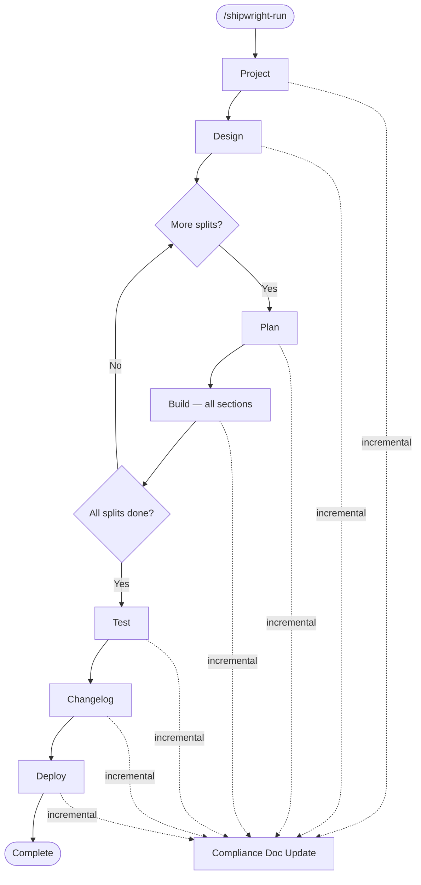

# Hooks & Pipeline Reference

> Single source of truth for understanding what fires when and the impact of pipeline changes.
> **Rule:** When modifying hooks, pipeline phases, validators, or between-phase actions, update this document.
>
> **See also:** `shared/constitution.md` — declarative ALWAYS / ASK FIRST / NEVER boundary rules.
> Hooks enforce a programmatic subset; the constitution covers the complete set.

## Pipeline Flow



### Pipeline Constants

**File:** `plugins/shipwright-run/scripts/lib/orchestrator.py`

```python
PIPELINE_STEPS = ["project", "design", "plan", "build", "test", "changelog", "deploy"]

# Both "compliance" and "security" were previously in PIPELINE_STEPS or
# CONDITIONAL_STEPS but have been removed. Old configs are migrated on load.
_LEGACY_PIPELINE_ENTRIES: frozenset[str] = frozenset({"compliance", "security"})
```

> **Plan v7 (Option Z) — 2026-04-19.** `"compliance"` was removed from
> `PIPELINE_STEPS`. Compliance is no longer an explicit pipeline phase;
> the auto-background doc update (`update_compliance.py --phase <name>`)
> still fires after every completed phase, and the new on-demand
> detective audit runs via `/shipwright-compliance` (`run_audit.py`).
> Legacy projects with `"compliance"` in their `config["pipeline"]` are
> migrated on the next `load_run_config()` call (entry removed from
> `pipeline`, preserved in `completed_steps` as a historical marker,
> logged as a `pipeline_migration` event).

> **Iterate `sec-report-and-orchestrator-decouple` — 2026-04.** Security was
> also removed from the orchestrator. The previous `CONDITIONAL_STEPS` /
> `AIKIDO_CLIENT_ID`-gated insertion mechanism is gone. `/shipwright-security`
> is now a standalone skill — run it manually after `test` or activate
> `.github/workflows/security.yml` triggers. `runConditions.securityEnabled`
> is preserved in schema v2 for diagnostic purposes only and is always
> `false` post-decouple — it does not gate any phase.

**Dashboard display order:** `shared/scripts/tools/update_build_dashboard.py`
```python
PIPELINE_PHASES = ["project", "design", "plan", "build", "test", "changelog", "deploy"]
```
Dashboard uses `PIPELINE_PHASES` as canonical order. The previous
"compliance" column was retired alongside the v7 decouple — compliance
docs are still populated as an auto-background side effect, but the
dashboard no longer renders a phase column for them.
After build completes: shows split summary table. After test completes: shows test layer results (unit/integration/pgtap/smoke/e2e/design_fidelity).

---

## Multi-Session Pipeline Lifecycle (v2)

> **Schema v2 (2026-04-25, ADR-001).** `/shipwright-run` is no longer a
> single-session pipeline driver — it is a *coordinator*. Each phase
> (`project`, `design`, `plan`, `build`, `test`, `changelog`, `deploy` —
> 7 phases since the security decouple) runs in its own external Claude
> CLI session. The master writes the spec, prints a launch card, and
> ends. Phase Stop hooks plan the next phase via `complete-phase-task`
> → `plan_next_phase`.

### Run-Config Schema v2

Every `shipwright_run_config.json` written by `orchestrator.py write-config`
since 2026-04-25 carries `"schemaVersion": 2`. The authoritative state lives
in `phase_tasks[]`:

```json
{
  "schemaVersion": 2,
  "runId": "run-a1b2c3d4",
  "runConditions": {
    "securityEnabled": false,             // always false post-decouple — diagnostic only, does not gate any phase
    "splitMode": "per_split" | "none" | null,
    "aikidoClientIdPresent": false        // diagnostic only, does not gate any phase
  },
  "splits_frozen": ["01-core", "02-ui-shell"],
  "completed_phase_task_ids": ["ptk-9f8e"],
  "phase_tasks": [
    {
      "phaseTaskId": "ptk-9f8e",
      "phase": "project",
      "splitId": null,
      "sessionUuid": "<pre-bound uuid4>",
      "version": 1,
      "status": "awaiting_launch | in_progress | done | failed | skipped",
      "slashCommand": "/shipwright-project",
      "prerequisites": [],
      "claimedBySessionUuid": null,
      "claimAttemptedAt": null,
      "executionCount": 0,
      "result": {"ok": true},
      "errors": []
    }
  ],
  "status": "in_progress | complete | failed | needs_validation",
  "current_step": "...",            // legacy v1-compat field, advisory only
  "completed_steps": [...],         // legacy v1-compat field, advisory only
  "pipeline": [...]                 // legacy v1-compat field, drives banner counts
}
```

**`runConditions` is frozen at run creation.** Mid-run env changes
(`AIKIDO_CLIENT_ID`) do not retroactively change pipeline shape.
**`splits_frozen` is set when the design phase completes** via
`freeze-splits`. Splits are immutable after that point.

v1 configs (no `schemaVersion`) are **hard-fail** rejected by phase-lifecycle
subcommands — the user must rename and re-run `/shipwright-run`. Standalone
phase invocations (no run config at all) keep working.

### State Machine

`plugins/shipwright-run/scripts/lib/phase_state_machine.py` is the pure
single-source-of-truth for "given a completed phase, what is next". The
orchestrator wraps it and materialises new `phase_tasks[]` entries.

| Predecessor (phase, splitId)        | Condition                                 | Next (phase, splitId)              |
|-------------------------------------|-------------------------------------------|------------------------------------|
| _none_ (run init)                   | always                                    | `("project", null)`                |
| `("project", null)`                 | always                                    | `("design", null)`                 |
| `("design", null)`                  | `splitMode == "per_split"` (≥1 split)     | `("plan", splits[0])`              |
| `("design", null)`                  | `splitMode == "none"`                     | `("plan", null)`                   |
| `("plan", split[i])`                | always                                    | `("build", split[i])`              |
| `("plan", null)`                    | always                                    | `("build", null)`                  |
| `("build", split[i])`               | `i+1 < len(splits)`                       | `("plan", split[i+1])`             |
| `("build", split[i])`               | `i+1 == len(splits)` (last split)         | `("test", null)`                   |
| `("build", null)`                   | always (split-less)                       | `("test", null)`                   |
| `("test", null)`                    | always                                    | `("changelog", null)`              |
| `("changelog", null)`               | always                                    | `("deploy", null)`                 |
| `("deploy", null)`                  | always                                    | `None` (pipeline-terminal)         |

> The previous security-conditional branch (`("test", null) → ("security", null) → ("changelog", null)` gated by `runConditions.securityEnabled`) was removed in iterate `sec-report-and-orchestrator-decouple`. Security is now an out-of-band skill — invoke `/shipwright-security` manually after test, or activate `.github/workflows/security.yml`. The state machine no longer plans a security phase task.

**Run-completion invariant:** `run.status = complete` requires (1) deploy
task is `done` AND (2) all other `phase_tasks[]` are terminal (`done` or
`skipped`). When (1) holds but (2) doesn't, `run.status =
"needs_validation"` plus a `pipeline_completion_blocked` event. **Failure
is terminal:** any `failed` task immediately flips `run.status = failed`.

### Phase-Session Lifecycle

```
USER: paste 'claude --session-id <uuid> --add-dir <root> --name <...> /<phase>'
   |
   v
SessionStart hooks (in order):
   1. capture_session_id.py        (sets SHIPWRIGHT_SESSION_ID, ROOT)
   2. phase_session_start.py       (Discovery via sessionUuid match;
                                    on match: claim-phase-task CAS,
                                    write sessionstart-validation.json,
                                    optionally write .block-pending sentinel,
                                    emit SHIPWRIGHT-PIPELINE-CONTEXT additionalContext)
   3. check_artifact_drift.py      (scans project_root for legacy artifact
                                    dirs from active migrations in
                                    shared/scripts/lib/artifact_migrations.py;
                                    in_progress → warn-only stderr +
                                    .shipwright/stale-folders.md, exit 0;
                                    migrated → structured JSON to stdout +
                                    exit 1 (hard-gate))
   |
   v
UserPromptSubmit hook (per prompt; first prompt only matters):
   - phase_user_prompt_validate.py (reads .block-pending sentinel,
                                    if present → decision:"block" + delete marker;
                                    else → no-op)
   |
   v
Skill-Run:
   - Step 0 (NEW): If PIPELINE-CONTEXT block present in context, parse
     phaseTaskId and run get_phase_context.py → read prior artifacts.
     Otherwise standalone-mode and skip.
   - Step 1+ as normal.
   |
   v
Stop hooks (in order — critical):
   1. phase_session_stop.py        (Discovery via sessionUuid;
                                    if design phase: freeze-splits first;
                                    complete-phase-task OR mark-phase-failed
                                    based on result.ok;
                                    plan_next_phase auto-runs from
                                    complete-phase-task)
   2. generate_handoff_on_stop.py  (writes phase-specific handoff under
                                    .shipwright/agent_docs/runs/<runId>/<ptk>/handoff.md)
   3. audit_phase_quality_on_stop.py (existing — unchanged)
```

**Standalone path** (no run config or no `sessionUuid` match): both
phase-session hooks are no-ops. Skills see no `SHIPWRIGHT-PIPELINE-CONTEXT`,
skip Step 0, run as before.

### Crash Recovery

A phase session that crashes (terminal kill, OS crash, `kill -9`) leaves its
`phase_tasks[i].status` at `in_progress` with `claimedBySessionUuid` set.
Pipeline is wedged: `phase_session_start.py` fail-closes any new launch.

**Escape hatch:**

```bash
uv run plugins/shipwright-run/scripts/lib/orchestrator.py recover-phase-task \
  --phase-task-id ptk-9f8e \
  [--force-status awaiting_launch|failed|skipped]
```

Bumps `version`, clears `claimedBySessionUuid`, increments `executionCount`.
The crashed session's later `complete-phase-task` is rejected with exit 2
(stale_version), so it cannot corrupt state after recovery.

---

## hooks.json Format

> **Breaking change (April 2025):** Claude Code now requires the new hooks format.
> Plugins with old-format hooks are **skipped entirely** (not just the invalid settings).

**New format** — event types at top level, no `{"hooks": {...}}` wrapper:

```json
{
  "EventName": [
    {
      "matcher": {"tools": ["Bash"]},
      "hooks": [
        {"type": "command", "command": "path/to/script.sh"}
      ]
    }
  ]
}
```

| Matcher type | Format | Used by |
|-------------|--------|---------|
| Single tool | `"matcher": {"tools": ["Bash"]}` | PreToolUse, PostToolUse |
| Multi tool | `"matcher": {"tools": ["Write", "Edit"]}` | PostToolUse |
| Subagent name | `"matcher": "agent-name"` (plain string) | SubagentStop |
| No filter | Omit `matcher` field entirely | SessionStart, Stop |

Tool names use short form: `Bash`, `Write`, `Edit`, `Read`, `Glob`, `Grep`.

**Old format (removed):** `{"hooks": {"EventName": [{"matcher": "Bash", ...}]}}` — wrapper + string matchers.

---

## Hooks Registry

> **Note (v2, 2026-04-25; updated post-decouple).** The 7 orchestrator
> phase plugins (`project`, `design`, `plan`, `build`, `test`,
> `changelog`, `deploy`) wire the **shared phase-session hooks**:
> `phase_session_start.py` after `capture_session_id.py` on
> `SessionStart`, `phase_user_prompt_validate.py` on `UserPromptSubmit`,
> and `phase_session_stop.py` first on `Stop`. The standalone `security`
> and `compliance` plugins also load these hooks for their own session
> lifecycle but are not orchestrator phases. The per-plugin tables below
> show the unique hooks; see § Shared Phase-Session Hooks (v2) for the
> multi-session trio that every phase plugin inherits.

### Shared Hook: capture_session_id.py

**Script:** `shared/scripts/hooks/capture_session_id.py` — the canonical
SessionStart hook used by **every** plugin via
`${CLAUDE_PLUGIN_ROOT}/../../shared/scripts/hooks/capture_session_id.py`.

Injects into Claude's session context:
- `SHIPWRIGHT_SESSION_ID` — current session id
- `SHIPWRIGHT_PLUGIN_ROOT` — active plugin directory
- `SHIPWRIGHT_PROJECT_ROOT` — resolved via `resolve_project_root()`
  (subdirectory-safe for monorepo layouts; falls back to `cwd`)
- `SHIPWRIGHT_ROOT_SESSION_ID`, `SHIPWRIGHT_LOOP_ID`,
  `SHIPWRIGHT_LOOP_UNIT_ID` — only emitted when parent runner set them
  (autonomous-loop propagation, iterate 14.8+)

Also appends `export SHIPWRIGHT_SESSION_ID=...` to `CLAUDE_ENV_FILE`
(if provided) so bash subprocesses inherit the session id —
`additionalContext` alone does not reach child processes spawned by
Claude's Bash tool. Idempotent: never duplicates the export line.

This single hook replaced 8 per-plugin duplicates that used to live
under `plugins/*/scripts/hooks/capture-session-id.py` (iterate 14.9).

### Shared Hook: check_artifact_drift.py

**Script:** `shared/scripts/hooks/check_artifact_drift.py` — wired
as the third SessionStart hook in **every** plugin (12 hooks.json
files), after `capture_session_id.py` and `phase_session_start.py`.

**What it does:** scans the resolved `SHIPWRIGHT_PROJECT_ROOT` for
any *legacy* top-level artifact directory (e.g. `planning/`) whose <!-- artifact-path-canon: legacy -->
canonical home has been relocated under `.shipwright/` (e.g.
`.shipwright/planning/`). The list of active migrations and their
canonical-vs-legacy paths lives in
`shared/scripts/lib/artifact_migrations.py` (`ARTIFACT_MIGRATIONS`).

**Behavior per migration status:**
- `pending` → not scanned (no-op).
- `in_progress` → **warn-only**. Findings produce a stderr notice and
  a markdown report at `.shipwright/stale-folders.md`. Hook exits 0
  so we don't break our own migration sub-iterates.
- `migrated` → **hard-gate**. Findings produce structured JSON on
  stdout (`{"success": false, "error": "stale_artifact_dirs", ...}`)
  and exit code 1. The AI orchestrator parses this and stops the
  session with a clear `git mv …` remediation list.

**Self-healing:** when no findings exist on a subsequent run, the
report file is *deleted* (`unlink(missing_ok=True)`) instead of
overwritten — the absence of `.shipwright/stale-folders.md` is the
canonical "no drift" signal.

**Streaming + fail-open:** scan stops after 50 sample files per
legacy directory (no full `rglob`+`stat` pass). Any `OSError` during
scan reports the directory as drifted rather than crashing. Any
exception in the hook itself is caught at the top level — drift
detection can never brick a session start.

**Manifest extension:** to gate a new artifact migration, append a
dict to `ARTIFACT_MIGRATIONS` with `{name, canonical, legacy_dirname,
old_path_patterns, ast_check_string, status}`. Status starts at
`pending`, flips to `in_progress` when the rewrite kicks off, and
finally to `migrated` after the cleanup sub-iterate. The companion
test-suite (`shared/tests/test_artifact_path_canon.py` and the four
sister tests) automatically covers the new entry.

**Reference:** `docs/migrations/artifact-migration-reference.md`
(written in Sub-Iterate G of the planning relocation) holds the full
playbook for proposing and executing a new migration.

### Shared Hook: audit_phase_quality_on_stop.py

**Script:** `shared/scripts/hooks/audit_phase_quality_on_stop.py` —
consolidated Stop-event entry point for the Phase-Quality audit.
Wired into every plugin that has a Stop hook (10 plugins; `run` and
`preview` have no Stop hook).

**Contract:**
- Non-blocking. Always exits 0 even on internal errors.
- Idempotent via `(phase, run_id, session_id)` triple.
- Silent no-op for greenfield / non-Shipwright projects.
- Silent no-op when the resolver auto-descended into a managed
  subfolder while the user was actually working at a parent level
  (Monorepo Auto-Descent Guard — see below).
- Gated off when `SHIPWRIGHT_PHASE_QUALITY=0`.

**Monorepo Auto-Descent Guard:** When the Stop-hook fires from a cwd
that is a **strict ancestor** of the resolved `project_root` (i.e.
`resolve_project_root()` found the managed project via auto-descent
into a subdir), the hook silent no-ops. Goal: monorepo-root work does
not pollute the audit trail of a managed subproject.

*Opt-in for cross-dir audit (e.g. CI/automation):*
- `cd <managed-subdir>` — cwd is then `project_root` or a descendant;
  audit fires normally.
- `SHIPWRIGHT_PROJECT_ROOT=<path>` **and** the resolved path matches
  exactly the detected `project_root` — explicit user opt-in.

*No bypass on ambient env:* when `SHIPWRIGHT_PROJECT_ROOT` is set for
unrelated reasons (CI, parent shell) AND does not resolve to the
current `project_root`, the guard still fires. This distinguishes
deliberate opt-in from environment noise.

*Cross-platform:* path comparisons use `.resolve(strict=False)` which
dereferences symlinks and normalises Windows case-insensitivity. On
resolution errors (broken mount, deleted cwd) the guard fails open
with a stderr warning — safer than silently blocking every audit
after one environment hiccup.

The same guard applies to the SessionStart-Injection in
`capture_session_id.py` so injection won't surface Tier-1 FAILs from
off-scope audit runs that might have predated the guard.

**Categories (complete — epic PR 1-4):**
- `canon` — C1-C5 Minimum Phase Completion Canon via
  `shared/scripts/tools/verifiers/common.py` helpers. Covers the
  standalone-Canon gap that was not enforced before (previously only
  the orchestrator's `update_step` ran Canon).
- `workflow` (PR 2) — phase-specific skill-step checks. Each phase has
  a thin wrapper module in
  `shared/scripts/tools/verifiers/<phase>_compliance.py` that returns
  finding dicts; `run_workflow_checks` dispatches on phase name and is
  resilient to broken wrappers (never crashes the Stop chain).
- `infrastructure`, `traceability`, `quality` (PR 3) — cross-phase
  modules at `shared/scripts/tools/verifiers/{infrastructure,
  traceability,quality}_checks.py` that expose a single
  `run(phase, project_root)` entry point. The phase_quality dispatcher
  lazy-imports each module and applies the plugin-coverage gate (plan
  § 5.1). Broken modules surface as one error finding — same resilience
  contract as the workflow dispatcher.
- `spec` (PR 4) — cross-phase spec category at
  `shared/scripts/tools/verifiers/spec_checks.py`. Runs S1-S10 against
  the top-level spec (.shipwright/agent_docs/spec.md), per-iterate spec files,
  CLAUDE.md, README.md, FR coherence, and git-based doc-freshness
  heuristics. Uses `lib/spec_parser.py` for FR heading parsing.

**Check catalog (PR 2-3 — plan § 3):**

Each check emits a finding with `id`, `status` (PASS/FAIL/WARN/SKIP),
`evidence`, optional `remediation`, and `tier`=2 for heuristic
(never-enforcement) checks. Marker-based PASSes carry
`provenance: unverified_marker` so the dashboard flags spoof-susceptible
evidence (plan § 4.5).

**Workflow category (PR 2):**

| ID | Phase | Default on Missing | Tier | Evidence Source |
|---|---|---|---|---|
| W1 | build | SKIP (never FAIL — R8) | 2 | `shipwright_events.jsonl`: `test_run` timestamp ≤ latest `work_completed` |
| W2 | iterate | FAIL | 1 | `.shipwright/planning/iterate/{run_id}-external-review.json` OR `external_review_state.json` newer than spec |
| W3 | iterate | FAIL | 1 | `work_completed` event (source=iterate) + `.shipwright/compliance/test-evidence.md` mtime <24h |
| W4 | test | FAIL | 1 | `shipwright_test_results.json.coverage.total` ≥ `shipwright_test_config.json.coverage.min` (default 70) |
| W5 | plan | FAIL | 1 | `.shipwright/planning/external_review_state.json` status=`completed` OR `skipped_*` with non-empty reason |
| W6 | changelog | FAIL | 1 | Wrapper around `changelog_checks.check_git_tag_exists` |
| W7 | deploy | FAIL | 1 | `shipwright_deploy_config.json.smoke_test_status` OR `test_results.smoke.status` OR latest `test_run` event layer `smoke.status == "pass"` |
| Sec1 | security (out-of-band) | FAIL | 1 | `.shipwright/compliance/security-scan-report.md` mtime ≥ latest `phase_started[security]`. Audits the standalone `/shipwright-security` skill — runs from the security skill's Stop hook, not as a pipeline gate. |
| Sec2 | security (out-of-band) | FAIL | 1 | No pipe-table row containing both `CRITICAL` and `UNRESOLVED`/`OPEN`/`FAIL` — or active override line in `.shipwright/compliance/compliance_overrides.log`. Audits the standalone security skill, not a pipeline phase. |
| Cmp1 | compliance | WARN | 2 | `.shipwright/compliance/dashboard.md` mentions every `run_config.completed_steps` phase (Tier-2, redundant with C2) |
| Cmp2 | compliance | FAIL | 1 | `traceability-matrix.md` coverage ≥ `shipwright_compliance_config.json.enforcement.rtm_coverage_min` (default 80%) |
| D1 | design | FAIL | 1 | ≥1 artifact: `.shipwright/designs/mockups/*.html` OR `.shipwright/agent_docs/screens.md` OR `.shipwright/agent_docs/user-flow.md` |
| D2 | design | WARN | 2 | Both `.shipwright/agent_docs/screens.md` and `.shipwright/agent_docs/user-flow.md` present + non-empty |

**Infrastructure category (PR 3):** `shared/scripts/tools/verifiers/infrastructure_checks.py`

| ID | Phase(s) | Default on Missing | Tier | Evidence Source |
|---|---|---|---|---|
| I1 | build, iterate | FAIL | 1 | `.shipwright/compliance/traceability-matrix.md` mtime ≥ latest `phase_completed[phase]` (10s tolerance). SKIP if no event (R11). |
| I2 | build, test, iterate | FAIL | 1 | `.shipwright/compliance/test-evidence.md` mtime ≥ latest `phase_started[phase]`. SKIP if no event. |
| I3 | build, iterate, changelog | FAIL | 1 | `.shipwright/compliance/change-history.md` mtime ≥ latest `phase_started[phase]`. SKIP if no event. |
| I4 | build, iterate | WARN (never FAIL — Tier-2) | 2 | `.shipwright/compliance/sbom.md` freshness — only surfaces when `pyproject.toml` / `package.json` / `requirements.txt` mtime > SBOM mtime. SKIP on clean runs. |

**Traceability category (PR 3):** `shared/scripts/tools/verifiers/traceability_checks.py`

| ID | Phase(s) | Default on Missing | Tier | Evidence Source |
|---|---|---|---|---|
| T1 | project, iterate | FAIL | 1 | Every FR from `.shipwright/planning/*/spec.md` (via `drift_parsers.collect_requirements_from_planning`) appears in `.shipwright/compliance/traceability-matrix.md`. |
| T2 | project, iterate | WARN (never FAIL — R12) | 2 | No FR id referenced in RTM missing from every spec. Tier-2 — FR renames produce legitimate FPs. |

**Quality category (PR 3):** `shared/scripts/tools/verifiers/quality_checks.py`

| ID | Phase(s) | Default on Missing | Tier | Evidence Source |
|---|---|---|---|---|
| Q1 | project, plan, build, iterate | WARN (never FAIL — R13) | 2 | Latest ADR in `.shipwright/agent_docs/decision_log.md` has Context ≥50, Decision ≥30, Consequences ≥30 chars. Uses `lib/adr_parser.py` (handles both bullet-form and section-form). |
| Q2 | build | FAIL | 1 | Every section in `shipwright_plan_snapshot.json` (falls back to `.shipwright/planning/sections/*.md` / `.shipwright/planning/<split>/sections/*.md`) has status ∈ {complete, completed, done} in `shipwright_build_config.json.sections`. SKIP when no plan material. |

**Spec category (PR 4):** `shared/scripts/tools/verifiers/spec_checks.py`

| ID | Phase(s) | Default on Missing | Tier | Evidence Source |
|---|---|---|---|---|
| S1 | project | FAIL | 1 | `.shipwright/agent_docs/spec.md` exists, non-empty, ≥1 `## FR-...` heading (via `lib/spec_parser.count_fr_headings`). |
| S2 | iterate (medium+) | FAIL | 1 | `.shipwright/planning/iterate/<*run_id*>.md` present when `iterate_history[run_id].complexity` ∈ {medium, large}. SKIPs for trivial/small (R15). |
| S3 | iterate (medium+) | WARN (never FAIL — R17) | 2 | `.shipwright/planning/iterate/<*run_id*>-miniplan.md` present when complexity ≥ medium. SKIPs below medium. |
| S4 | iterate | WARN (never FAIL — R16) | 2 | Git-diff of `.shipwright/agent_docs/spec.md` over last 10 commits: removed FR ids must retain `status: deprecated`. SKIPs without git history. |
| S5 | project, iterate | WARN (never FAIL) | 2 | Every FR heading across `.shipwright/agent_docs/spec.md`, `.shipwright/planning/*/spec.md`, and `.shipwright/planning/iterate/*.md` has Description + Acceptance sections (via `lib/spec_parser.compute_fr_coherence`). |
| S6 | project | FAIL | 1 | `CLAUDE.md` exists at project root, non-empty. |
| S7 | project | WARN (never FAIL) | 2 | `CLAUDE.md` has a `## Structure` fenced code block (via `lib/drift_parsers.extract_structure_block`). |
| S8 | project | FAIL | 1 | `README.md` exists, non-empty. |
| S9 | iterate (type=feature + UI-facing diff) | WARN (never FAIL — R17) | 2 | `README.md` touched within last 10 commits AND recent diff includes `webui/client/`, `frontend/`, `client/`, `web/`, `src/components/`, or `mobile/` path. SKIPs otherwise. |
| S10 | iterate (type ∈ {feature, bug, bugfix}) | WARN (never FAIL — R17) | 2 | `CLAUDE.md` touched recently when new top-level directories appear in last 10 commits that aren't listed in the CLAUDE.md Structure block. SKIPs otherwise. |

Tier-2 checks (W1, I4, T2, Q1, S3-S5, S7, S9, S10, Cmp1, D2) are
permanently excluded from enforcement rollout — they land in the
dashboard as heuristic signal only (plan § 3, § 9.2).

**Artifacts written (deterministically regenerated):**
| File | Purpose | Retention |
|---|---|---|
| `.shipwright/compliance/skill-compliance/<phase>-<run_id>-<session_id>.json` | Per-run Finding JSON (atomic write) | GC → `archive/` after 90d |
| `.shipwright/compliance/skill-compliance-report.md` | Last 10 runs, markdown | cap 10 |
| `.shipwright/agent_docs/skill-compliance-findings.md` | Last 5 runs, SessionStart-Injection source (PR 4 wires the injection) | cap 5 |
| `.shipwright/compliance/skill-compliance-dashboard.md` | Phase × category status matrix | overwritten each run |

Aggregate rewrites serialise through
`.shipwright/locks/phase-quality.lock` so concurrent Stop events from
multiple sessions don't lost-update the summaries.

**Hook order per plugin (plan § 5.1):**
- 9 plugins total (project, design, plan, build, test, security, deploy,
  changelog, compliance): `audit_phase_quality_on_stop` runs
  **before** `generate_handoff_on_stop` so the finding JSON lands
  before handoff summarises session state. Of these, 7 are pipeline
  phases (project/design/plan/build/test/changelog/deploy); security
  and compliance are out-of-band skills that still run the audit hook
  on their own Stop events.
- `iterate` Sonderfall: `iterate_stop_finalize` →
  `audit_phase_quality_on_stop` → `write_terminal_marker`. Audit runs
  **after** finalize so F5a/F5b/F7/F11 evidence is on disk when C1-C5
  are evaluated.

**Enforcement flags (all default OFF in code; PR 2-4 wire the effects):**
| Flag | Default | Effect |
|---|---|---|
| `SHIPWRIGHT_PHASE_QUALITY` | `1` (on) | Set to `0` to disable the hook entirely — the documented rollback lever |
| `SHIPWRIGHT_PHASE_QUALITY_MODE` | `audit_inject` (on) | Set to `audit_only` to opt out of SessionStart-Injection and keep findings dashboard-only. Default injects ≤5 Tier-1 FAILs. |
| `SHIPWRIGHT_ENFORCE_CRITICAL_GATES` | `0` | Orchestrator blocks on W5/W6/W7 FAIL (PR 4) |
| `SHIPWRIGHT_ENFORCE_ALL_FAILS` | `0` | Orchestrator blocks on any FAIL (PR 4) |
| `SHIPWRIGHT_SKIP_QUALITY_CHECK` | — | Comma-separated check ids to mark as SKIP (e.g. `C4,S9`) |
| `SHIPWRIGHT_AUDIT_OVERRIDE_REASON` | — | Required justification logged alongside a SKIP |

The `phase_quality` library (`shared/scripts/lib/phase_quality.py`)
exposes the finding schema, plugin→phase mapping, and the six
category runners used by the hook. All finding fields are stable
across PR 1-4.

**SessionStart-Injection flow (PR 4):**

The canonical SessionStart hook `shared/scripts/hooks/capture_session_id.py`
reads `.shipwright/agent_docs/skill-compliance-findings.md` at session start and
injects up to **5 Tier-1 FAILs** as `additionalContext` unless the user
has opted out via `SHIPWRIGHT_PHASE_QUALITY_MODE=audit_only`. Injection
is the default since the Phase-Quality epic completed — rollout
calculus shifted from "wait + opt in" to "ship signal + opt out on
noise" for small/solo setups. Only Tier-1 FAILs are injected; Tier-2
ids (`W1`, `I4`, `T2`, `Q1`, `S3-S5`, `S7`, `S9`, `S10`, `Cmp1`, `D2`)
are filtered out.

```
Session ends → Stop hook writes finding JSON + regenerates
                .shipwright/agent_docs/skill-compliance-findings.md
                    ↓
Next session starts → capture_session_id.py reads summary file
                        ↓
  SHIPWRIGHT_PHASE_QUALITY_MODE == audit_only?
      │
      yes → no injection (explicit opt-out)
      no  → parse ≤ 5 Tier-1 FAILs → append to additionalContext (default)
```

**Orchestrator-Gate flow (PR 4):**

`plugins/shipwright-run/scripts/lib/orchestrator.py::update_step`
reads the most-recent per-phase Phase-Quality finding JSON and
promotes any `W5`/`W6`/`W7` FAIL into an ask-level validation issue
when `SHIPWRIGHT_ENFORCE_CRITICAL_GATES=1`. Default OFF — rollout
week 6 flips the flag (plan § 9.2).

```
update_step(step, status=complete)
    ↓
not force AND not standalone?
    ↓
validate_phase() → base validator issues
    ↓
SHIPWRIGHT_ENFORCE_CRITICAL_GATES == 1?
    │
    yes → load .shipwright/compliance/skill-compliance/<step>-*.json (newest)
          for each workflow finding with id ∈ {W5, W6, W7} AND status=FAIL
            AND tier != 2:
              append ask-level validation_issue with evidence+remediation
    no  → skip critical gate
    ↓
ask-level issues present?
    │
    yes → config.status = needs_validation, save, return (user-blocking)
    no  → mark step complete, advance pipeline
```

Only `W5`/`W6`/`W7` are in the critical-gate allowlist by design
(plan § 9.2) — plan external-review, changelog tag, and deploy
smoke-test are the three "must-not-ship-without" evidence points.
Other FAILs remain audit-only forever (or until an explicit
follow-up adds them to the allowlist). Tier-2 findings are never
promoted, even if their id hypothetically coincides with a gate id.

### Shared Phase-Session Hooks (v2)

Wired into **every** orchestrator phase plugin (`project`, `design`, `plan`, `build`,
`test`, `changelog`, `deploy` — 7 phases) to make multi-session pipelines
work. The standalone `security` and `compliance` plugins also load these
hooks but are not orchestrator phases since the v7/decouple iterates.
See §Multi-Session Pipeline Lifecycle (v2) for the end-to-end flow.

**`shared/scripts/hooks/phase_session_start.py` — SessionStart, after capture_session_id.**
Discovers whether the launching session is part of an active run by matching
`SHIPWRIGHT_SESSION_ID` against `phase_tasks[].sessionUuid`. On match it
performs a CAS claim (`awaiting_launch → in_progress`), writes
`.shipwright/runs/<runId>/<phaseTaskId>/sessionstart-validation.json`
(persistent diagnostic) and, on validation failure, also writes
`.block-pending` (single-use sentinel for the UserPromptSubmit hook). On
success it emits a `SHIPWRIGHT-PIPELINE-CONTEXT` block via
`hookSpecificOutput.additionalContext` carrying `phaseTaskId`. **No match →
no-op.** Standalone phase invocations are unaffected.

**`shared/scripts/hooks/phase_user_prompt_validate.py` — UserPromptSubmit.**
Reads `.block-pending` if present, returns `decision: "block"` plus exit 2
to abort wrong-skill / duplicate-claim / failed-prereq launches before the
LLM ever runs. After the first read it deletes the marker so follow-up
prompts in the same session pass through. SessionStart cannot block on its
own (verified via F0 spike) — this hook closes the gap.

**`shared/scripts/hooks/phase_session_stop.py` — Stop, before audit/handoff.**
Re-discovers `phaseTaskId` via the `sessionUuid` match, parses `result.ok`
from the phase's local config (`shipwright_<phase>_config.json`). For the
design phase it calls `freeze-splits` first. Then calls **either**
`complete-phase-task` (ok) or `mark-phase-failed` (not-ok) on the
orchestrator. `complete-phase-task` automatically materialises the next
phase task via the state machine.

**Tools used by Step 0 of every phase skill:**
`shared/scripts/tools/get_phase_context.py --phase-task-id <id>` returns
prerequisite paths, prior phase artifacts, and `runConditions` for the
phase to load explicitly.

### shipwright-run

| Event | Matcher | Script | What It Does |
|-------|---------|--------|--------------|
| SessionStart | — | `capture_session_id.py` (shared) | See Shared Hook section above |
| Stop | — | `generate_handoff_on_stop.py` (shared) | Writes `.shipwright/agent_docs/session_handoff.md` for resume |
| Stop | — | `master_stop_check.py` | **Observational** v2 master Stop hook. Prints pipeline status (in_progress / complete / failed) to stderr based on `phase_tasks[]` and `run.status`. **Never** mutates state — final-status responsibility lives in `complete-phase-task` of the last phase. |

### shipwright-project

| Event | Matcher | Script | What It Does |
|-------|---------|--------|--------------|
| SessionStart | — | `capture_session_id.py` (shared) | See Shared Hook section above |
| Stop | — | `audit_phase_quality_on_stop.py` (shared) | Phase-quality audit (canon C1-C5 + T1/T2 traceability + Q1 ADR substance Tier-2 + S1 spec-has-FR, S5 FR-coherence Tier-2, S6 CLAUDE.md, S7 Structure-block Tier-2, S8 README) |
| Stop | — | `generate-handoff.py` | Session handoff |

### shipwright-design

| Event | Matcher | Script | What It Does |
|-------|---------|--------|--------------|
| SessionStart | — | `capture_session_id.py` (shared) | See Shared Hook section above |
| Stop | — | `audit_phase_quality_on_stop.py` (shared) | Phase-quality audit (canon C1-C5 + D1/D2 workflow) |
| Stop | — | `generate-handoff.py` | Session handoff |

### shipwright-plan

| Event | Matcher | Script | What It Does |
|-------|---------|--------|--------------|
| SessionStart | — | `capture_session_id.py` (shared) | See Shared Hook section above |
| SubagentStop | `shipwright-plan:section-writer` | `write-section-on-stop.py` | Persists section files from subagent output to disk |
| Stop | — | `audit_phase_quality_on_stop.py` (shared) | Phase-quality audit (canon C1-C5 + W5 external-review marker + Q1 ADR substance, Tier-2) |
| Stop | — | `generate-handoff.py` | Session handoff |

### shipwright-build

| Event | Matcher | Script | What It Does |
|-------|---------|--------|--------------|
| SessionStart | — | `capture_session_id.py` (shared) | See Shared Hook section above |
| SessionStart | — | `check_drift.py` | Timestamp drift + content drift (Structure block vs filesystem, Development `npm run` vs package.json) |
| PreToolUse | `{"tools": ["Bash"]}` | `validate_command.sh` | Blocks dangerous shell commands (rm -rf, force push, etc.) |
| PostToolUse | `{"tools": ["Write", "Edit"]}` | `check_destructive_migration.sh` | Warns on DROP/DELETE in .sql files without down.sql |
| PostToolUse | `{"tools": ["Write", "Edit"]}` | `check_secrets.sh` | Scans written files for API keys, tokens, passwords |
| PostToolUse | `{"tools": ["Write", "Edit"]}` | `check_file_size.sh` | Warns if file exceeds size limit |
| PostToolUse | — (catch-all) | `track_tool_calls.py` | Increments tool call counter for context pressure detection |
| Stop | — | `audit_phase_quality_on_stop.py` (shared) | Phase-quality audit (canon C1-C5 + W1 TDD-order Tier-2 + I1-I4 infrastructure freshness + Q1/Q2 quality) |
| Stop | — | `generate-handoff.py` | Session handoff (namespaced to `.shipwright/planning/handoffs/<loop_id>/` when `SHIPWRIGHT_LOOP_ID` set) |
| Stop | — | `check_documentation.py` | Verifies documentation artifacts are up to date |
| Stop | — | `write_terminal_marker.py` | Writes `.shipwright/runs/<loop_id>/<unit_id>/DONE` (no-op without loop env vars) |

### shipwright-test

| Event | Matcher | Script | What It Does |
|-------|---------|--------|--------------|
| SessionStart | — | `capture_session_id.py` (shared) | See Shared Hook section above |
| Stop | — | `audit_phase_quality_on_stop.py` (shared) | Phase-quality audit (canon C1-C5 + W4 coverage threshold + I2 test-evidence freshness) |
| Stop | — | `generate-handoff.py` | Session handoff |

### shipwright-iterate

| Event | Matcher | Script | What It Does |
|-------|---------|--------|--------------|
| SessionStart | — | `capture_session_id.py` (shared) | See Shared Hook section above |
| SessionStart | — | `check_drift.py` | Timestamp + content drift (catches Shipwright-repo self-drift when iterating on Shipwright itself) |
| Stop | — | `iterate_stop_finalize.py` | Shared handoff + fallback `finalize_iterate.py` (compliance, dashboard, handoff). Freshness-gated: skips if `finalize_iterate.py` already ran. |
| Stop | — | `audit_phase_quality_on_stop.py` (shared) | Phase-quality audit (canon C1-C5 + W2/W3 iterate workflow + I1-I4 infrastructure + T1/T2 traceability + Q1 ADR substance + S2 iterate-spec for medium+ + S3 miniplan Tier-2 + S4 FR-preservation Tier-2 + S5 FR-coherence Tier-2 + S9 README-freshness Tier-2 + S10 CLAUDE.md-sync Tier-2) — runs **after** finalize so F5a/F5b/F7/F11 evidence is on disk |
| Stop | — | `write_terminal_marker.py` | Writes `.shipwright/runs/<loop_id>/<unit_id>/DONE` (no-op without loop env vars) |

**B1 parallel-iterate detection (2026-04-23):** `/shipwright-iterate` reads git metadata at startup to decide whether to offer the Parallel option:
(1) `git branch --list "iterate/*"` for candidate branches,
(2) `git symbolic-ref refs/remotes/origin/HEAD` for the project's default branch,
(3) `git merge-base --is-ancestor` to filter already-merged stale branches (surface as cleanup hint, not in-progress run),
(4) `git rev-parse --show-toplevel` + worktree-path check to exclude the current branch when running inside a secondary worktree (prevents infinite Parallel-prompt loop).
No new hook is registered; detection runs as part of B1. Corresponding conventions live in SKILL.md B1a. `/shipwright-build` Step E picked up the same default-branch anchor via conditional `git show-ref --quiet` bifurcation (Resume path unchanged).

### shipwright-changelog

| Event | Matcher | Script | What It Does |
|-------|---------|--------|--------------|
| SessionStart | — | `capture_session_id.py` (shared) | See Shared Hook section above |
| Stop | — | `audit_phase_quality_on_stop.py` (shared) | Phase-quality audit (canon C1-C5 + W6 git-tag existence + I3 change-history freshness) |
| Stop | — | `generate-handoff.py` | Session handoff |

### shipwright-deploy

| Event | Matcher | Script | What It Does |
|-------|---------|--------|--------------|
| Stop | — | `audit_phase_quality_on_stop.py` (shared) | Phase-quality audit (canon C1-C5 + W7 smoke-test status) |
| Stop | — | `generate-handoff.py` | Session handoff |

### shipwright-security

> **Out-of-band skill — not part of `PIPELINE_STEPS`.** Removed from the orchestrator in iterate `sec-report-and-orchestrator-decouple` (2026-04). The skill plugin still exists and ships the hooks below, but it is invoked manually after `/shipwright-test` or via `.github/workflows/security.yml`. The previous `CONDITIONAL_STEPS` / `AIKIDO_CLIENT_ID` auto-insertion gate was deleted.

| Event | Matcher | Script | What It Does |
|-------|---------|--------|--------------|
| SessionStart | — | `capture_session_id.py` (shared) | See Shared Hook section above |
| SessionStart | — | `check_drift.py` | Timestamp drift + content drift (Structure block vs filesystem, Development `npm run` vs package.json) |
| Stop | — | `audit_phase_quality_on_stop.py` (shared) | Phase-quality audit (canon C1-C5 + Sec1 report freshness + Sec2 unresolved CRITICAL check) |
| Stop | — | `generate-handoff.py` | Session handoff |

### shipwright-compliance

Two surfaces (plan v7 Option Z, 2026-04-19):

1. **Auto-background doc update** (unchanged): `shipwright-run`'s
   orchestrator calls `scripts/tools/update_compliance.py --phase <name>`
   after every completed pipeline phase. Regenerates the affected
   subset of compliance docs (RTM, test-evidence, change-history,
   dashboard, SBOM). No user interaction. Silent-fail was replaced with
   loud-fail in plan v7 Step 1 — a missing plugin now emits a stderr
   JSON warning and records a `compliance_update_failed` event.
2. **On-demand detective audit** (new in v7): `/shipwright-compliance`
   invokes `scripts/audit/run_audit.py`. Reads specs, plan.md,
   configs, shipwright_events.jsonl, ADRs, and the compliance docs.
   Writes `.shipwright/compliance/audit-report.md` + `shipwright_audit_report.json`.
   Does not modify anything unless `--fix` is passed (Group E per-doc
   regen only).

| Event | Matcher | Script | What It Does |
|-------|---------|--------|--------------|
| SessionStart | — | `capture_session_id.py` (shared) | See Shared Hook section above |
| PreToolUse | `{"tools": ["Bash"]}` | `check_rtm_coverage.py` | Soft-blocks if RTM coverage < 80% threshold |
| PreToolUse | `{"tools": ["Bash"]}` | `check_security_scan.py` | Checks status of the most recent manual `/shipwright-security` scan (security is no longer auto-inserted; this hook now covers manual scans only) |
| Stop | — | `audit_phase_quality_on_stop.py` (shared) | Phase-quality audit (canon C1-C5 + Cmp1 dashboard-per-phase Tier-2, Cmp2 RTM coverage) |
| Stop | — | `generate-handoff.py` | Session handoff |

### shipwright-adopt

Non-pipeline skill — onboards a **brownfield** repo into the Shipwright SDLC. Runs once per repo, not on every pipeline execution, and does **not** appear in `PIPELINE_STEPS`.

Reads: `package.json`, `pyproject.toml`, `go.mod`, `Cargo.toml`, `composer.json`, `Gemfile`, `tsconfig.json`, `.eslintrc*`, `.prettierrc*`, `.editorconfig`, `README.md`, `.github/workflows/`, git log, plus route/page files for AST feature inference; optionally the running dev-server via Playwright BFS crawl.

Writes: `CLAUDE.md`, `.shipwright/agent_docs/{architecture,conventions,decision_log,build_dashboard}.md`, `.shipwright/planning/<split>/spec.md`, all six `shipwright_*_config.json` (run-config LAST), `shipwright_events.jsonl` (one `adopted` event + optional backfill), `e2e/flows/adopted-baseline.spec.ts` when a Playwright crawl succeeded, `.shipwright/adopt/{snapshot,enrichment,routes}.json`, `.shipwright/adopt/review.md`, and seeds the five `.shipwright/compliance/*.md` via the existing compliance generators. The `suggest_iterate` UserPromptSubmit hook is plugin-owned (registered in `plugins/shipwright-iterate/hooks/hooks.json`); no project-level `.claude/settings.json` install is performed.

Phase-Quality integration: registered as phase `adopt` in `PLUGIN_TO_PHASE`, `C4_PHASES`, and `_WORKFLOW_PHASE_DISPATCH`. The verifier module `shared/scripts/tools/verifiers/adopt_compliance.py` runs A1–A5, A7, A8 canon checks on every Stop hook after adoption completes (A6 retired 2026-05-05 per iterate-20260505-plugin-hook-registration — Claude Code itself enforces the plugin-enabled invariant the check used to assert). A4, A5, A8 are Tier-2 (heuristic, non-blocking); A1–A3, A7 are Tier-1 ERROR on FAIL.

| Event | Matcher | Script | What It Does |
|-------|---------|--------|--------------|
| SessionStart | — | `capture_session_id.py` (shared) | See Shared Hook section above |
| Stop | — | `audit_phase_quality_on_stop.py` (shared) | Runs A1–A8 canon via `adopt_compliance.run()` |
| Stop | — | `generate_handoff_on_stop.py` (shared) | Session handoff |

### Plugin-registered (shipwright-iterate)

`shared/scripts/hooks/suggest_iterate.py` is registered in
`plugins/shipwright-iterate/hooks/hooks.json` under `UserPromptSubmit`
(retired the project-level installer model on 2026-05-05 — see
iterate-20260505-plugin-hook-registration). It fires for every
non-slash-command UserPromptSubmit when `shipwright-iterate@shipwright`
is enabled, and short-circuits silently in any directory that does not
contain `shipwright_run_config.json`.

| Event | Matcher | Script | What It Does |
|-------|---------|--------|--------------|
| UserPromptSubmit | — | `suggest_iterate.py` | Multilingual (en/de) phase router: maps free-text prompts to the right Shipwright phase, falls back to `/shipwright-iterate` for post-test code changes |

> **Migration note.** Prior to 2026-05-05 this hook was installed
> per-project into `.claude/settings.json` by `/shipwright-adopt`,
> `/shipwright-project`, and `/shipwright-run` via
> `plugins/shipwright-adopt/scripts/lib/hook_installer.py`. The
> installer wrote `${CLAUDE_PLUGIN_ROOT}/...` into project-level
> settings.json, but Claude Code only expands that variable inside
> plugin-context hooks — so the hook silently failed (then loudly
> failed once Claude Code added an explicit error). Plugin
> registration is the structurally correct distribution channel.
> Adopted projects from before the cutover may still carry the
> legacy entry; see the cleanup note in the iterate
> `/shipwright-run` and `/shipwright-project` SKILL.md files for
> the precise edit.

**Routing logic** (`shared/scripts/hooks/suggest_iterate.py`):

1. **Guards** — exit silently if: no `shipwright_run_config.json` in cwd, config unreadable, prompt starts with `/`, or prompt shorter than 10 characters.
2. **`status == "complete"`** → `handle_completed_pipeline`:
   - Phase-keyword match (test / deploy / compliance / changelog / design / plan) → emit suggestion pointing at the matching slash command.
   - No phase match → delegate to `classify_for_iterate` (wraps `plugins/shipwright-iterate/scripts/lib/classify_intent.py`), which classifies FEATURE / BUGFIX / REFACTOR and emits an `/shipwright-iterate --type` hint.
3. **`status == "in_progress"`** → `handle_in_progress_pipeline`:
   - Phase-keyword match and phase != `current_step` → intent-mismatch warning (suggests standalone slash command or `/shipwright-run`).
   - **Post-test fallback:** no phase-keyword match and `test ∈ completed_steps` → delegate to `classify_for_iterate`. This prevents the "stale limbo" where post-test code-change prompts get silently dropped while `changelog`/`deploy`/`compliance` are still pending.
   - Otherwise → silent.
4. **Any other status** → silent.

**Pattern registry** (`PHASE_PATTERNS`): multilingual regex per phase (en/de today, extensible for fr/it). Keys: `test`, `deploy`, `compliance`, `changelog`, `design`, `plan`. Maintenance rule: when adding a new phase or a new language, update both `PHASE_PATTERNS` and `shared/tests/test_suggest_iterate.py`.

---

## Phase Validators

**File:** `plugins/shipwright-run/scripts/lib/phase_validators.py`

Called by `orchestrator.py:update_step()` before marking a phase complete. Returns issues with severity `ask` or `inform`.

| Phase | Severity | Validation Check |
|-------|----------|-----------------|
| project | ASK | Config exists, splits defined, spec.md per split |
| design | ASK | Mockup HTML files exist (may be intentionally skipped) |
| plan | ASK | Sections defined in build config, section .md files exist |
| build | ASK | All current-split sections complete, all have tests_total > 0 |
| test | ASK | `shipwright_test_results.json` exists; all layers have results or valid skip reason; unit/smoke must pass (outcomes checked); E2E failures logged as inform-level warnings |
| changelog | ASK | `CHANGELOG.md` exists |
| deploy | PASS | Always passes |

> Plan v7 Option Z removed the `compliance` row — compliance is no
> longer a pipeline phase, so it has no `update-step` gate. The
> `_validate_compliance` function is retained only for backwards
> compat with legacy `completed_steps=["...","compliance"]` entries
> that went through the phase before the v7 migration.

**Override mechanism:** `--force` flag on `update-step` skips validation (user approved via AskUserQuestion).

**Flow:** `update-step --status complete` → validator runs → if ASK issues found → returns `status: "needs_validation"` → SKILL.md asks user → user says "continue" → `update-step --status complete --force` → phase completes.

---

## Subagent Timing & Data Flow

### section-builder (Build Phase)

```
section-builder subagent
  → writes code, runs tests
  → calls update_section_state.py (updates shipwright_build_config.json)
  → returns JSON result to orchestrator
orchestrator autopilot loop
  → checks get-build-progress → split_done?
  → only after ALL sections done: update-step --step build --status complete
  → validate_build() fires (checks current split sections only)
```

### test-runner (Test Phase)

```
test-runner subagent
  → runs unit tests (vitest)
  → runs smoke test (HTTP health check)
  → Step 3.5: checks e2e/ for .spec.ts files
    → if missing: reads .shipwright/planning/*/claude-plan-e2e.md
    → generates e2e/flows/*.spec.ts + e2e/pages/*.page.ts
  → runs Playwright E2E (against dev server)
  → writes shipwright_test_results.json to project root
  → returns JSON result to orchestrator
orchestrator
  → parses result (unit/smoke/e2e with real counts)
  → if E2E plans exist but E2E skipped: AskUserQuestion
  → calls update-step --step test --status complete
  → validate_test() fires (checks results file exists, all layers have results)
  → update_build_dashboard.py with "X/Y unit, A/B E2E"
  → update_compliance.py --phase test (reads test results for evidence)
```

### section-writer (Plan Phase)

```
section-writer subagent
  → generates section spec content
  → SubagentStop hook fires write-section-on-stop.py
  → section .md files written to disk
plan SKILL completes
  → update-step --step plan --status complete
  → validate_plan() fires (checks sections exist in config + files on disk)
```

---

## Config File Data Flow

| Config File | Written By | Read By |
|-------------|-----------|---------|
| `shipwright_run_config.json` | orchestrator.py | All phases (resume), dashboard, validators |
| `shipwright_project_config.json` | /shipwright-project | Orchestrator (splits), compliance (requirements), validators |
| `shipwright_build_config.json` | /shipwright-build, update_section_state.py | Orchestrator (progress), dashboard, compliance, validators |
| `shipwright_test_results.json` | test-runner subagent | Compliance (test evidence), validators |
| `shipwright_compliance_config.json` | update_compliance.py | Compliance (phases_covered) |
| `shipwright_plan_config.json` | /shipwright-plan | Build (section references) |
| `shipwright_project_session.json` | /shipwright-project | /shipwright-project (session resume state) |
| `shipwright_plan_session.json` | /shipwright-plan | /shipwright-plan (session resume state) |
| `external_review_state.json` | /shipwright-plan Step 5, /shipwright-iterate (medium+) | /shipwright-plan Step 6 resume gate, compliance evidence collector |
| `shipwright_security_config.json` | /shipwright-security | /shipwright-security, compliance (scan results) |

---

## Context Loading by Phase

Each plugin reads project context at startup to ensure consistency. This table shows what each phase loads before its main work begins.

### Artifact Read Matrix

| Artifact | project | design | plan | build | test | deploy | iterate | compliance |
|----------|---------|--------|------|-------|------|--------|---------|------------|
| constitution.md | read | read | read | read | read | read | read | read |
| CLAUDE.md | ext | C2 | C2 | C2 | — | — | B2 | — |
| conventions.md | ext | — | C2 | C2 | — | — | B2 | — |
| decision_log.md | ext | — | C2 | C2 | — | — | B2 | read |
| architecture.md | ext | C2 | C2 | C2 | B2 | — | B2 | — |
| sync_config.json | ext | — | — | — | — | — | B2 | — |
| spec.md (all splits) | ext | Step 1 | own | own section | — | — | B2 | read |
| git log | ext | — | C2 | C2 | — | — | B2 | read |
| test_results.json | — | — | — | — | B2 | B3 gate | B2 | read |
| visual-guidelines.md | — | creates | — | build | 3.6 | — | design ref | — |
| events.jsonl | — | — | — | — | — | — | B2 | read |
| run_config.json | — | — | — | — | — | — | B2 | read |
| project_config.json | — | Step 1 | — | — | B | B2 | — | read |
| build_config.json | — | — | — | D (read+write) | — | — | — | read |

**Key:** `read` = loaded at startup, `ext` = Extension scope only, `C2`/`B2`/`B3` = specific step name,
`own` = only its own spec/section, `gate` = must-pass check before proceeding, `creates` = generated by that phase (consumed by later phases), `read+write` = step reads existing state, mutates it, writes back, `—` = not loaded.

### Artifact Write Matrix

| Artifact | Created By | Updated By |
|----------|-----------|-----------|
| `CLAUDE.md` | project | — |
| `conventions.md` | project | write_decision_log.py (convention impact), reflection protocol (build, test, deploy, iterate) |
| `decision_log.md` | project (init) | plan, build, deploy, iterate (via write_decision_log.py) |
| `architecture.md` | project | write_decision_log.py (architecture impact) |
| `build_dashboard.md` | update_build_dashboard.py | build, test, changelog, deploy, iterate, **Stop hook** (all plugins) |
| `session_handoff.md` | generate_handoff_on_stop.py | all plugins (Stop hook), **finalize_iterate.py** (iterate) |
| `events.jsonl` | record_event.py | build, iterate, test, deploy, changelog, orchestrator (append-only) |
| `test_results.json` | test, iterate | test, iterate |
| `.shipwright/compliance/*` | compliance plugin | update_compliance.py (all phases trigger), **Stop hook** (all plugins, best-effort), **finalize_iterate.py** (iterate) |
| `sync_config.json` | project | iterate (FR mappings) |
| `{migrations.dir}` (profile) | build, iterate (create + apply DEV, serialized) | deploy (PROD apply only) |

---

## Between-Phase Actions

Executed by the orchestrator between each skill invocation (orchestrate SKILL.md):

1. **Phase Validation & Completion** — `update-step --status complete` triggers `phase_validators.py`. If ASK issues found, asks user before proceeding.
2. **Record Phase Event** — `record_event.py --type phase_completed --phase {phase}` appends to `shipwright_events.jsonl`.
3. **Upstream Success Check** — Reads `shipwright_run_config.json`, verifies previous phase is in `completed_steps`. Prevents cascading failures.
4. **Incremental Compliance Update** — `update_compliance.py --phase {phase}` (non-blocking subprocess, errors swallowed).
5. **Dashboard Update** — `update_build_dashboard.py --phase {phase}` refreshes `.shipwright/agent_docs/build_dashboard.md`.
6. **Tool Counter Reset** — `reset_tool_counter.py` prevents stale counts from triggering false context pressure.
7. **Context Pressure Check** — `estimate_context_pressure.py --threshold 120`. If `recommend_checkpoint` is true, generates handoff and stops.

### Split-Loop (Build Phase)

After build completes for a split:
- `update_step()` calls `get_build_progress()`
- If `all_done == false`: removes `plan` and `build` from `completed_steps`, sets `current_step = "plan"`
- Records `split_completed` event via `record_event.py --type split_completed --split {name}`
- Test/changelog/deploy only run after `all_done == true` (compliance
  docs are updated as a side effect after every completed phase)

---

## Event Emission Points

The unified event log (`shipwright_events.jsonl`) is written to by these components:

| Emitter | Event Type | When | Detail |
|---------|-----------|------|--------|
| WebUI / Iterate SKILL.md | `task_created` | User creates task or iterate starts | description, intent?, priority? |
| Project SKILL.md (Step 8) | `phase_completed` (phase=project) | Scaffolding + specs validated | Split count via `--detail` |
| Design review-loop.md (finalize) | `phase_completed` (phase=design) | Design finalized | Screen/flow count via `--detail` |
| Plan SKILL.md (Step 9) | `phase_completed` (phase=plan) | Sections validated | Section count via `--detail` |
| Orchestrator (between phases) | `phase_started` | Phase begins | — |
| Orchestrator (between phases) | `phase_completed` | Phase validated + complete | — (deduplicated by record_event.py) |
| Orchestrator (split loop) | `split_completed` | All sections of a split done | — |
| Build SKILL.md (Step 10) | `work_completed` (source=build) | Section committed | — |
| Iterate SKILL.md (F3.5) | `work_completed` (source=iterate) | Iterate change committed | — |
| Test SKILL.md (Step 5) | `test_run` | Full test suite executed | unit/e2e/smoke layer counts |
| Deploy SKILL.md (Step 5) | `phase_completed` (phase=deploy) | Deploy smoke test passed | Deploy URL via `--detail` |
| Changelog SKILL.md (Step 7) | `phase_completed` (phase=changelog) | PR created or tag pushed | Version + PR URL via `--detail` |

All events share common fields: `v` (schema version), `id` (UUID-based), `ts` (ISO timestamp), `type`, and optional `session`.

---

## Architecture Impact Tracking

When writing decision log entries, the `--architecture-impact` flag on `write_decision_log.py` automatically appends update notes:

| Impact Type | Target File | Section Added |
|-------------|-------------|---------------|
| `component` | `.shipwright/agent_docs/architecture.md` | `## Architecture Updates` |
| `data-flow` | `.shipwright/agent_docs/architecture.md` | `## Architecture Updates` |
| `convention` | `.shipwright/agent_docs/conventions.md` | `## Convention Updates` |
| `none` | — | No update |

Format: `- **ADR-NNN** (YYYY-MM-DD): Short description`

### Reflection Protocol

In addition to ADR-driven architecture impact, the **reflection protocol** (`references/reflection.md` in each plugin) updates `conventions.md` at the end of build (Step 10a), test, deploy, and iterate (F3a) phases. Two mechanisms:

| Learning Type | Mechanism | Target |
|---------------|-----------|--------|
| Decisions (pattern chosen, convention corrected) | `write_decision_log.py --architecture-impact convention` | `conventions.md` → `## Convention Updates` (with ADR ref) |
| Observations (gotchas, framework quirks) | Direct append | `conventions.md` → `## Learnings` (no ADR) |
| Cross-project insights | Claude Code Memory (main conversation only) | `.claude/` memory system |

---

## GitHub Repo Hygiene

During `/shipwright-project` Step 7 (Scaffolding), if the project has a GitHub remote:

| Setting | Value | Why |
|---------|-------|-----|
| `delete_branch_on_merge` | `true` | Prevents stale feature branches after PR merges (CLI or UI) |

This complements `gh pr merge --merge --delete-branch` in `/shipwright-changelog` Step 7, which only fires on CLI merges.

---

## Self-Healing Artifacts

When a phase detects missing prerequisite artifacts, it should attempt to derive them from available project context before skipping. This is a **constitution rule** (ALWAYS section).

### Derivation Chain

| Missing Artifact | Derived From | Used By |
|---|---|---|
| `.shipwright/designs/visual-guidelines.md` | CSS `:root` variables in `.shipwright/designs/screens/*.html` | Build (Browser Verify), Iterate (F2 Browser Verify), Test (Consistency) |
| `.shipwright/designs/screen-routes.json` | Mockup filenames + router config (`src/router.tsx`) | Test (Design Fidelity), Build (Design Fidelity) |
| `.shipwright/planning/claude-plan-e2e.md` | `screen-routes.json` + `architecture.md` | Test (E2E Spec Generation) |
| `dev_url` in build config | `CLAUDE.md` (`PORT=`), `package.json` scripts (`--port`) | Test (Smoke, E2E), Build (Browser Verify), Iterate (F2 Browser Verify — sub-iterate-runner) |
| `playwright.config.ts` | Template + `dev_url` port substitution | Test (E2E), Build (Browser Verify), Iterate (F2 Browser Verify) |

### Which Phases Auto-Generate

| Phase | Can Auto-Generate |
|---|---|
| **Build** (Step 4.5) | `visual-guidelines.md`, `dev_url` detection |
| **Iterate** (sub-iterate-runner F2) | `dev_url` detection (shared fallback chain with Build Step 4.5) |
| **Test** (Step B3) | `visual-guidelines.md`, `screen-routes.json`, `claude-plan-e2e.md`, `dev_url`, `playwright.config.ts` |
| **Plan** (Step 8) | `claude-plan-e2e.md` (if UI project, default enabled) |

### Browser Verify + End-to-End Verification Gate Semantics (Build Step 8 / 4.5, Iterate Step 9 + F0.5)

Browser Verify is **mandatory** whenever the section/iterate diff touches any
frontend file, regardless of whether the run is a formal section build or a
remediation task. Missing `dev_server` in the profile is a resolution concern
(fall back to `shipwright_build_config.json#dev_url` → `package.json` autodetect
→ escalate), not a skip trigger. Frontend detection is performed by
`shared/scripts/lib/detect_frontend_changes.py` and is the single source of
truth across build and iterate **at trivial / small complexity**.

**At medium+ in iterate, the authoritative gate is F0.5
(End-to-End Verification Gate).** F0.5 is **file-path-agnostic** — the
Phase Matrix marks E2E Verification as `always` at medium+, which subsumes
file-path detection. A backend-only diff that affects user-visible behavior
triggers `surface = web` even when no `client/**` file changed. Step 9
(Browser Verify) at iterate-time is now **early signal** at medium+; the
production-time chokepoint is `shared/scripts/surface_verification.py`,
and the post-commit audit is `check_surface_verification` in
`shared/scripts/tools/verifiers/iterate_checks.py`. Both layers fail-closed
on the same four conditions: missing block, `tests_run == 0`,
`exit_code != 0` after retry cap, `surface == "none"` without justification.

### Scripts Supporting Self-Healing

| Script | Self-Healing | Details |
|---|---|---|
| `dev_server.py` | Reads `shipwright_build_config.json` for `dev_url` when profile is unknown | Fallback for custom profiles |
| `playwright_setup.py` | Substitutes port from build config into template | Prevents hardcoded port 3000 |

---

## Minimum Phase Completion Canon (C1–C5)

Iterate 12.0 introduces the **Minimum Phase Completion Canon** —
a five-step finalization checklist that every decision-taking Shipwright
phase should satisfy so cross-artifact sync invariants stay aligned.

The canon is enforced by `shared/scripts/tools/verifiers/*_checks.py`
(one module per phase) and dispatched through
`shared/scripts/tools/verify_phase.py`. Iterate 12.0 shipped the
infrastructure (verifier package, helper scripts, canon definition) and
the **iterate** module (migrated from `verify_iterate_finalization.py`
with identical behaviour). Iterate 12.0b wired runtime zombie-task
reconciliation; 12.1 added project + stop-hook conditional skip; 12.2
added design + plan; 12.3 added build (canon hybrid per section / phase);
12.4 added test, changelog and deploy. Iterate 12.6 closed the campaign
with the Canon Coverage matrix below. **Iterate 12.5 (compliance) was
struck** — compliance is future detective-only via shipwright-check,
not a canon target.

### Canon Steps

| Step | Requirement | Tool | Severity |
|---|---|---|---|
| **C1** | `phase_completed` event recorded in `shipwright_events.jsonl` | `shared/scripts/tools/record_event.py --type phase_completed --source <phase>` | **ERROR** |
| **C2** | `.shipwright/agent_docs/build_dashboard.md` reflects the phase | `shared/scripts/tools/update_build_dashboard.py --phase <phase>` | **WARNING** |
| **C3** | `.shipwright/agent_docs/session_handoff.md` regenerated with phase-specific reason | `shared/scripts/tools/generate_session_handoff.py --reason "<phase>: …"` | **WARNING** |
| **C4** | `.shipwright/agent_docs/decision_log.md` has a new ADR referencing the phase | `shared/scripts/tools/write_decision_log.py --title …` | **ERROR** (only for decision-taking phases) |
| **C5** | `CHANGELOG.md [Unreleased]` has a bullet under the right Keep-a-Changelog category | `shared/scripts/tools/append_changelog_entry.py --category <Added\|Changed\|Fixed\|…> --entry "…"` | **ERROR** (only for user-facing phases) |

### C4 Skip Criteria — Who Gets an ADR

ADRs are for **actual architectural decisions**, not routine phase
events. C4 applies to:

- `iterate` — the canonical source of architectural decisions
- `project` — initial architecture choices and constraint capture
- `plan` — planning decisions that constrain build
- `build` — per-section decisions (existing behaviour)

C4 is **skipped** for:

- `design` — transformation of an existing spec, not a new decision
- `test` — execution, not a decision
- `changelog` — a release event, not a decision
- `deploy` — an operational event, not a decision
- `compliance` — derived from other phases (detective, not productive)

### C5 Skip Criteria — User-Facing vs. Operational

C5 applies to phases whose output is visible in a product release:

- `iterate` (existing behaviour)
- `project` — category **Added**: "Project initialized: …"
- `design` — category **Added**: "UI mockups: N screens, M flows"
- `build` — category **Added**/**Changed**/**Fixed** per section,
  appended at phase-completion (not per-section)
- `deploy` — category **Changed**: "Deployed to <env>" (user visible)

C5 is **skipped** for:

- `plan` — internal, not user-visible
- `test` — execution status lives in `shipwright_test_results.json`
- `changelog` — this phase *owns* CHANGELOG prepends; writing to
  [Unreleased] would collide with the release tagging flow
- `compliance` — derived artifact, not a user-facing change

### Helper Scripts

Shipwright writes iterate-finalization artifacts through deterministic,
lock-serialised tools so every Canon caller lands in a consistent shape:

- **`shared/scripts/tools/append_iterate_entry.py`** (file-per-iterate
  refactor) — writes one `.shipwright/agent_docs/iterates/<run_id>.json` entry atomically,
  runs legacy-array → dir migration on first touch under a state-machine
  sentinel, applies 50-entry retention, quarantines invalid or duplicate
  legacy rows. Holds `shipwright_run_config.json.lock` for the full
  transaction so same-worktree concurrent finalize calls serialize.
- **`shared/scripts/tools/write_changelog_drop.py`** — writes one
  `CHANGELOG-unreleased.d/<category>/<run_id>_NNN.md` bullet per F4 call.
  Exclusive-create via `O_EXCL` so concurrent calls can't collide on the
  same counter. Replaces the legacy `append_changelog_entry.py` for the
  iterate-F4 path.
- **`shared/scripts/tools/aggregate_changelog.py`** — release-time
  aggregator. Reads the drop directory, renders a Keep-a-Changelog
  versioned section, inserts it at the structural point in `CHANGELOG.md`
  (above the first existing `## [version]` heading, not above the title),
  deletes only the drop files that were actually included in the snapshot.
  Warns loudly if legacy `## [Unreleased]` bullets remain so the operator
  notices split-brain state.
- **`shared/scripts/tools/append_changelog_entry.py`** — still present for
  non-iterate flows that need the legacy `[Unreleased]` append path. Will
  be deprecated once all callers migrate.
- **`shared/scripts/tools/append_phase_history.py`** — atomic
  read-modify-write on `shipwright_run_config.json::phase_history[<phase>]`,
  with 50-entry retention per phase. Handles generic pipeline phases —
  `iterate` no longer flows through this file since F5c was swapped to
  `append_iterate_entry.py`.

All helpers use `shared/scripts/lib/file_lock.py`, which wraps
`fcntl.flock` on POSIX and `msvcrt.locking` on Windows with a hard
timeout (5-second default, 10 seconds for iterate append to cover the
migration path).

### `phase_history` Schema

A new top-level field in `shipwright_run_config.json` parallel to
`iterate_history`:

```json
{
  "phase_history": {
    "project": [{"run_id": "…", "date": "…", "outcome": "…", "splits": N}],
    "design":  [{"run_id": "…", "date": "…", "screens": N, "flows": M}],
    "build":   [{"run_id": "…", "date": "…", "split": "…", "sections": N}]
  }
}
```

- Retention: last 50 entries per phase.
- `iterate` writes to `.shipwright/agent_docs/iterates/<run_id>.json` (file-per-iterate
  refactor — richer schema: branch, spec path, tests_passed, adr). The
  legacy `iterate_history` key is left empty on new projects for
  backward-compat with external readers. Not mirrored into `phase_history`.
- Phase modules fill `phase_history` starting in iterate 12.1.

#### Why two histories

Shipwright intentionally keeps `iterate_history` and `phase_history`
as separate top-level arrays in `shipwright_run_config.json`. They
track different classes of work: iterate entries are user-invoked
change sessions with a feature branch, PR, iterate spec file, and
test results; phase entries are pipeline-internal execution units
with a `phase_completed` event, canon-marker handoff, and dashboard
update. Unifying the two schemas would either drop iterate-specific
fields (branch, spec path, tests_passed) or force every phase entry
to carry null columns for iterate-only attributes. Consumers that
need a merged view should read both arrays and sort by date — the
asymmetry is the schema, not tech-debt waiting for a migration.

### Verifier Package Layout

```
shared/scripts/tools/
  verify_phase.py                  # Unified CLI: --phase <phase>|all
  verify_iterate_finalization.py   # Thin wrapper, same CLI as before (backwards compat)
  append_changelog_entry.py        # Canon C5 write path
  append_phase_history.py          # phase_history write path
  verifiers/
    __init__.py
    common.py                      # CheckResult, readers, generic C1–C5, ADR F1/F2/F3
    iterate_checks.py              # 5 existing iterate checks (migrated 1:1)    — 12.0
    runtime_checks.py              # Zombie-task replay check                     — 12.0b
    project_checks.py              # Project phase-own + canon + phase_history   — 12.1
    design_checks.py               # Design phase-own + canon (skip C4)          — 12.2
    plan_checks.py                 # Plan phase-own + canon (skip C5) + check-plan C2/C3/C4 imports — 12.2
    build_checks.py                # Build phase-own + canon hybrid + check-plan B3/B6 imports      — 12.3
    test_checks.py                 # Test phase-own + canon (skip C4+C5)         — 12.4
    changelog_checks.py            # Changelog canon + git-tag/version Sonder-Checks — 12.4
    deploy_checks.py               # Deploy phase-own + canon (skip C4+C5)       — 12.4

shared/scripts/lib/
  drift_parsers.py                 # Structure/dev-block/FR/ADR pure parsers
  file_lock.py                     # Cross-platform advisory lock
```

### Canon Coverage — Iterate 12 Final State

Matrix is **code-level coverage**, not runtime status on any given project.
Every cell is derived from a grep audit of `plugins/shipwright-<phase>/skills/<phase>/SKILL.md`
(tool call present in finalization step), `shared/scripts/tools/verifiers/<phase>_checks.py`
(check function present), and `plugins/shipwright-run/scripts/lib/phase_validators.py::_validate_<phase>`
(wired through `_run_canon_checks`).

Legend: ✅ present · ⏭ skip by policy · n/a not applicable

| Phase | C1 event | C2 dashboard | C3 handoff | C4 ADR | C5 CHANGELOG | phase_history | Verifier module | Phase validator |
|---|---|---|---|---|---|---|---|---|
| **iterate** | ✅ F7 | ✅ F5 (`check_build_dashboard_has_run_id`, implemented 14.8) | ✅ F5/F11 | ✅ F3 | ✅ F4 | ✅ `iterate_history` | `iterate_checks.py` + cross-artifact warnings (compliance, architecture, conventions) | `verify_iterate_finalization.py` |
| **runtime** | n/a | n/a | n/a | n/a | n/a | n/a | `runtime_checks.py` (zombie replay) | — |
| **project** | ✅ | ✅ | ✅ (canon-marker) | ✅ (Step 7) | ✅ | ✅ | `project_checks.py` | `_validate_project` |
| **design** | ✅ | ✅ | ✅ (canon-marker) | ⏭ transformation | ✅ | ✅ | `design_checks.py` + FR coverage (check-plan C1 import) | `_validate_design` |
| **plan** | ✅ | ✅ | ✅ (canon-marker) | ✅ (Step 2/5) | ⏭ internal | ✅ | `plan_checks.py` + section-manifest/FR-orphan/section-id (check-plan C2/C3/C4 imports) | `_validate_plan` |
| **build** | ✅ per section | ✅ per section | ✅ phase-level | ✅ per section | ✅ phase-level (one bullet per section) | ✅ with `sections[]` sub-array | `build_checks.py` + B3 test-files + B6 commit-sha (check-plan imports) | `_validate_build` |
| **test** | ✅ (`phase_completed` alongside `test_run`) | ✅ | ✅ (canon-marker) | ⏭ events, not decisions | ⏭ results in `shipwright_test_results.json` | ✅ | `test_checks.py` + `check_test_results_file_fresh` | `_validate_test` |
| **changelog** | ✅ | ✅ | ✅ (canon-marker) | ⏭ process management | n/a (plugin owns prepend) | ✅ | `changelog_checks.py` + `check_git_tag_exists` + `check_changelog_version_matches_tag` Sonder-Checks | `_validate_changelog` |
| **deploy** | ✅ | ✅ | ✅ (canon-marker) | ⏭ execution | ⏭ operational history | ✅ | `deploy_checks.py` + `check_test_gate_passed` phase-own | `_validate_deploy` |
| **compliance** | n/a | n/a | n/a | n/a | n/a | n/a | (not wired — detective audit on demand) | (not a pipeline phase since v7) |

**Compliance is intentionally NOT canon-wired** (canon-level enforcement).
Plan v7 Option Z (2026-04-19) removed compliance from `PIPELINE_STEPS`
and shipped `/shipwright-compliance` as a **detective** cross-artifact
audit (`scripts/audit/run_audit.py`) — on-demand only, never blocks.
Iterate 12.5 (earlier campaign plan) was struck for the same reason.
Compliance **docs** are updated **best-effort** by:
1. The shared Stop hook (`generate_handoff_on_stop.py`) for all plugins
2. `finalize_iterate.py` (primary path for iterate)
3. `orchestrator.run_compliance_update()` (between-phase action for `/shipwright-run`)

Non-canon advisory checks (`check_compliance_reflects_run_id`,
`check_architecture_reviewed`, `check_conventions_reviewed`) detect
stale cross-artifacts at WARNING level via `iterate_checks.run_cross_artifact_checks()`.
The `/shipwright-compliance` SKILL is **active** (v7 content replacement).
`skills/compliance/SKILL.md` now invokes `scripts/audit/run_audit.py`
for a detective audit with `--fix` / `--only` / `--format` flags. See
the `project_compliance_rebuild.md` memory entry for the ship state
and follow-up iterates (Groups A/B/D/E/G novel checks).

**F-block ADR integrity (F1/F2/F3)** runs out of `common.py` for every
phase verifier automatically. F1 (sequential ids), F2 (valid status),
F3 (supersession targets exist) are shared preventive checks ported
from the shipwright-check plan.

### Stop-Hook Conditional Skip (iterate 12.1)

The `generate_handoff_on_stop.py` PostStop hook previously regenerated
`session_handoff.md` at every turn end, overwriting any canon-marker
handoff that a phase finalization step had just written. Iterate 12.1
fixes this with a pure run-id match:

1. `generate_session_handoff.py --canon-marker --phase <phase>` writes
   YAML frontmatter containing `canon_generated: true` and
   `run_id: <SHIPWRIGHT_RUN_ID>` at the top of `session_handoff.md`.
2. `generate_handoff_on_stop.py` parses that frontmatter. If it exists
   **and** the `run_id` matches the current `SHIPWRIGHT_RUN_ID` env var,
   it skips regeneration entirely — no mtime heuristic, no clock skew
   risk, no restart race.
3. Non-canon handoffs regenerate as before. Handoffs with stale canon
   frontmatter (different run_id) also regenerate.
4. **Safe degrade:** `--canon-marker` without `SHIPWRIGHT_RUN_ID` logs
   a warning to stderr and writes the handoff WITHOUT frontmatter, so
   the Stop hook falls through to normal regeneration.

### Audit Targets for the Verifier

The canon verifier runs against **Shipwright-managed consumer projects**
(those with `shipwright_run_config.json` at project root), not against
the Shipwright monorepo itself. The monorepo root is plugin development
and intentionally has no `shipwright_*_config.json`, `.shipwright/agent_docs/`, or
`build_dashboard.md`; running `verify_phase.py --project-root . --phase all`
against it will report many phase-own failures by design. The authoritative
audit is code-level (the Coverage Matrix above), plus a runtime smoke
test on `webui/` (which **is** a Shipwright-managed child project) —
ERRORs there reflect historical drift from before the canon rollout and
are not in scope for 12.6.

### Writer Audit (iterate 12.0 gate)

Every writer of `shipwright_run_config.json` uses the read-modify-write
pattern (`load_run_config` → mutate → `save_run_config`), so unknown
top-level fields like `phase_history` are preserved automatically.
Authoritative writers:

- `plugins/shipwright-run/scripts/lib/orchestrator.py` — `save_run_config`,
  called by `create_config` (initialises `phase_history: {}` on fresh
  creation) and `update_step`.

No other plugin writes this file directly.
