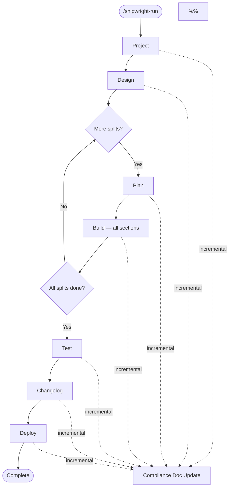

# Hooks & Pipeline Reference

> Single source of truth for understanding what fires when and the impact of pipeline changes.
> **Rule:** When modifying hooks, pipeline phases, validators, or between-phase actions, update this document.
>
> **See also:** `shared/constitution.md` — declarative ALWAYS / ASK FIRST / NEVER boundary rules.
> Hooks enforce a programmatic subset; the constitution covers the complete set.

## Pipeline Flow



> **Iterate 2026-05-23-compliance-md-single-producer — single-producer
> invariant.** `.shipwright/compliance/{rtm,test-evidence,change-history,sbom,dashboard}.md`
> are produced exclusively by `iterate-finalize` (via `finalize_iterate.py`
> at F5b) and the per-phase `update_compliance.py --phase <name>` calls
> baked into the orchestrator's phase-completion path. The previous
> mtime-guarded auto-regen in `generate_handoff_on_stop.py` (lines 283-310
> on origin/main pre-this-iterate) was DELETED — it fired on out-of-band
> commits (security work, manual fixes) using the local-only
> `shipwright_events.jsonl` and produced dirty tracked MDs that didn't
> match the events log used to produce HEAD. The Group E audit
> (`audit_staleness.py`) now uses snapshot-provenance: it compares
> on-disk MDs to the version committed in the last commit that BOTH
> (a) contains a `Run-ID:` trailer and (b) modified
> `.shipwright/compliance/`. Non-iterate commits don't touch
> `.shipwright/compliance/` → snapshot baseline stays stable → no
> E1-E5 false positives between iterates.

> **Iterate 2026-05-23-security-adopt-compliance-snapshots — extends
> the snapshot-producer set.** Three additional producer paths now
> contribute `Run-ID:` snapshot commits that the audit recognises:
>
> - **`/shipwright-adopt`** Step H — single brownfield-onboarding commit
>   with body trailer `Run-ID: adopt-<YYYY-MM-DD>-<repo>`. Message is
>   built by the SSoT helper `plugins/shipwright-adopt/scripts/lib/adopt_commit_template.py`
>   (regex-enforced + date-deterministic via test seam).
> - **`/shipwright-security`** Step 7.5 (pipeline-mode only) — new
>   helper `plugins/shipwright-security/scripts/tools/finalize_security_compliance.py`
>   regenerates compliance MDs via `update_compliance.py --phase security`,
>   stages + commits as `chore(compliance): refresh after security scan`
>   with body trailer `Run-ID: security-<scan_id>`. Idempotent — a re-run
>   with no compliance diff produces no commit. Skipped in standalone
>   mode (Step 8 hands off to iterate), CI, and non-interactive sessions.
> - **`update_compliance.py`** gains two PHASE_REPORTS entries:
>   `adopt` (full 5-doc set — initial baseline) and `security`
>   (4-doc set excluding RTM — security work doesn't change FR coverage).
>
> The `Run-ID:` filter on `find_snapshot_commit` is preserved (per
> Codex sanity-check) — producer-provenance protection still matters.
> The remaining pipeline phase commits (project/design/plan/build/test/deploy)
> still lack `Run-ID:` trailers and are NOT yet snapshot-recognised;
> deferred to a separate iterate if needed (the changelog/release case was
> picked up by C1, below). Greenfield-pipeline users hit
> `snapshot_unavailable=true` until the first iterate (acceptable
> degraded-but-correct state — no false positives).

> **Iterate 2026-06-02-compliance-detective-realign (C1) — release commits
> join the recognised snapshot producers.** `find_snapshot_commit` now OR's
> two `--grep` patterns under `--fixed-strings`: a `Run-ID:` trailer
> (iterate-finalize) OR a `chore(release)` subject. `/shipwright-changelog`
> regenerates the tracked agent-doc/compliance MDs and commits them as
> `chore(release): vX.Y.Z` **without** a `Run-ID:` trailer, so before this
> every clean release re-flagged those MDs as Group-E stale against the older
> iterate-finalize snapshot. A manual `chore(compliance)` regen is deliberately
> **not** recognised — that is the hand-edit case Group E must still catch.
> Companion B7 change (same Run-ID-provenance fix): `group_b._check_b7`
> recognises an event↔commit link via the commit's `Run-ID:` footer ↔ the
> event's `adr_id` (since `work_completed` events ship `commit:""` by design),
> with the `commit`-field SHA match retained as the legacy/out-of-band fallback;
> and `apply_retention_rules` Rule D (`exclude_release_commits`) excludes a
> `chore(release)` commit as the changelog phase's tracked output — never
> generic chore/ci/docs commits, which stay surfaced as real drift.

### Merge reconciliation of churn artifacts (iterate-2026-05-31-churn-merge-resolver)

When `origin/main` advances while an iterate branch is open, a merge collides
**only** on generated/"churn" artifacts (never real source). Reconciliation is
automatic via `shared/scripts/tools/integrate_main.py` (the command an iterate
runs instead of a bare `git merge origin/main`), which delegates conflict
resolution to `shared/scripts/tools/resolve_churn_conflicts.py`. Each churn
artifact has exactly one documented resolution strategy:

| Churn artifact | Strategy on merge |
|---|---|
| `shipwright_events.jsonl` | **union** (`.gitattributes`, now scaffolded into managed repos) + unconditional validate/dedup |
| `.shipwright/triage.jsonl` | **union** (`.gitattributes`, now scaffolded into managed repos) + unconditional `_reconcile_triage` (exact-line dedup, NO id-collision warning — append/status share an id by design — + header/JSON validate) |
| `.shipwright/compliance/dashboard.md` | **regenerate** (from merged tree) |
| `.shipwright/compliance/sbom.md` | **regenerate** |
| `.shipwright/compliance/test-evidence.md` | **regenerate** |
| `.shipwright/compliance/traceability-matrix.md` | **regenerate** |
| `.shipwright/compliance/change-history.md` | **regenerate** |
| `.shipwright/agent_docs/build_dashboard.md` | **regenerate** |
| `.shipwright/agent_docs/session_handoff.md` | **regenerate** |
| `.shipwright/agent_docs/triage_inbox.md` | **regenerate** |
| `shipwright_test_results.json` | **ours** (PR-owned snapshot) |

**`.shipwright/triage.outbox.jsonl` is deliberately NOT a churn artifact** —
it is GITIGNORED and per-tree, so it is never merged and never appears in
`CHURN_ALLOWLIST`. The per-tree transient buffer holds idle-main background
triage appends (campaign 2026-06-08-triage-outbox-delivery / D1): the
compliance audit, drift, phase-quality, and
`triage_add` route there (not the tracked log) only when HEAD is on the default
branch **with an `origin` remote**, so idle main accrues NO tracked-log drift.
`triage.read_all_items` returns the tracked ∪ outbox union so consumers see
background findings immediately; **status flips route the same way** — to the
outbox on idle main (`should_route_to_outbox`), else residence-derived (a flip
follows its append's file), so an idle-main dismiss is never undelivered tracked
drift (2026-06-12); the D2 sweep folds the outbox into the iterate PR branch +
GCs it. `triage_gc` and `_reconcile_triage` operate on the tracked log ONLY.

**Writing one-shot helpers — DO NOT call `should_route_to_outbox()` blindly.**
That function answers "am I on idle default branch?" — it returns `False` on any
non-default branch (`iterate/*`, `chore/*`, `feat/*`, WIP), under the assumption
that the JSONL changes will ship in that branch's PR. A planning-side helper
(e.g. a one-shot script that adds 3 cards from a chore-branch checkout) does
NOT have that intent; using the function would silently commit the JSONL drift
to whatever branch is checked out, where it strands and never reaches `origin/main`.
**Force `to_outbox=True` explicitly** in such helpers — the WebUI reads the
union and the next iterate's D2 sweep folds them in. The `triage_add` CLI is
exempt from this because it IS designed to ship in the calling branch's PR;
direct-`append_triage_item()` callers are not.

This table is the SSoT for `resolve_churn_conflicts.CHURN_ALLOWLIST`
(`shared/tests/test_churn_merge_doc_sync.py` fails on any drift, both
directions). Two load-bearing rules:

- **`.shipwright/agent_docs/architecture.md` is deliberately NOT a churn
  artifact** — it is curated prose, so a conflict on it (or any source file)
  trips the resolver's hard pre-flight gate and reaches a human; the resolver
  touches nothing in that case.
- **Regenerated MDs land in a *separate, non-merge* follow-up commit** carrying
  a `Run-ID:` trailer. This is mandatory: `audit_staleness.find_snapshot_commit`
  uses `git log --diff-filter=AM` which skips merge commits, so the snapshot the
  Group-E audit compares against must be on a regular commit.

**`.shipwright/planning/iterate/campaigns/*/status.json` is a churn artifact
matched by GLOB, not by `CHURN_ALLOWLIST`** (campaign
`2026-06-07-tracked-campaign-status`, S3/S4). The per-tree campaign board is
producer-owned and **projected from the tracked event log**: F5b Step 6
(`campaign_status_io.finalize_campaign_status` → `write_campaign_status`)
regenerates a sub-iterate's `status.json` from its `campaign.md` skeleton +
`shipwright_events.jsonl` (top-level `campaign`/`sub_iterate_id`, never-downgrade)
and F6 ships it in the PR. Because the path is variable, the resolver admits it
via `churn_merge.is_campaign_status` (single-segment `fnmatchcase` on
`campaigns/*/status.json`) — deliberately OUTSIDE the 1:1 table above, so
`test_churn_merge_doc_sync` stays exact. On merge it is in the **regenerate**
bucket but **scoped to the conflicted campaigns only**
(`regenerate_tracked_snapshots(campaign_status_rels=…)`): the projection does not
round-trip a *legacy* `campaign.md` (ids predating the skeleton), so re-projecting
an *untouched* campaign could drop a completed sub — an untouched campaign
self-heals on its own next sub-iterate (never-downgrade). The skeleton parser
strips wrapping markdown emphasis (`**C1**` → `C1`) so a legacy table still
matches the plain committed ids (S4).

**Rollout note:** a long-lived branch created BEFORE the `.gitattributes` commit
must merge that commit (so the attribute is present in its tree) before `union`
applies to its `events.jsonl`. The resolver validates the merged log regardless.

**Target-repo coverage (iterate-2026-06-07-scaffold-churn-merge-machinery).** The
`merge=union` first-line driver is no longer monorepo-only: the same fragment
(`shared/templates/gitattributes-union.template`, SSoT
`shared/scripts/lib/gitattributes_union.py`) is now scaffolded into every managed
repo — at adopt time (Step E.13c, idempotent **merge** into the target's root
`.gitattributes`) and self-healed on the next iterate for already-adopted repos
(`setup_iterate_worktree` → `self_heal_gitattributes`, one guarded `chore` commit
on the iterate branch). `merge=union` is honored by GitHub's **server-side** PR
merge too, so a managed repo's concurrent triage/events appends auto-line-union
even without running `integrate_main.py` locally. The resolver
(`resolve_churn_conflicts.py`, bundled in the marketplace `shared/` and reachable
via `{shared_root}`) remains the monorepo-authored **second-line** authority that
dedups + validates the union'd log; it is incidentally reachable in managed repos
but the union driver alone is the sufficient first-line defense there.

**Auto-merge is safe ONLY for a current single iterate — parallel PRs drain
serially (iterate-2026-06-12-automerge-serial-integrate, Option A).** GitHub's
server-side merge honors `merge=union` for the JSONL logs (above) but CANNOT run
the **regenerate-at-merge** half of the resolver, because regenerating the derived
snapshots (`.shipwright/compliance/*.md`, `.shipwright/agent_docs/*.md`,
`shipwright_test_results.json`) requires executing the producers against the merged
tree — something only a local `integrate_main` run does. So GitHub-native
auto-merge (armed in F11 since PR #197) is correct ONLY for the common case of a
**single iterate whose branch is current** at merge time (committed snapshots ==
merged-tree snapshots → no conflict, no staleness). For **concurrently-open**
iterate branches (independently-launched iterates whose PRs overlap in time) each
branch carries its OWN regenerated snapshots; as they merge serially every
still-open branch either conflicts on those snapshots (`DIRTY` → auto-merge stalls)
or merges stale (Group-E staleness noise). The contract:

- **F11 single iterate** (incl. independently-concurrent iterates) runs
  `shared/scripts/tools/ensure_current.py` (a thin refresh-if-behind guard over
  `integrate_main`) BEFORE arming auto-merge: if the branch is behind
  `origin/<default>` it merges + regenerates first (clean no-op if current), so the
  PR always arms from a current, already-regenerated tree.
- **Autonomous campaign** sets `SHIPWRIGHT_ITERATE_AUTOMERGE=0` so sub-iterate F11
  does NOT arm; the orchestrator runs **interleaved-serial** (campaign-mode.md) —
  build one sub-iterate → PR → CI-green → MERGE → build the next off fresh
  `origin/<default>`. Only ONE campaign PR is open at a time, so the snapshot
  cascade cannot form and no per-PR regenerate-at-merge drain is needed.

This is host-agnostic (the regeneration uses `integrate_main`/git, never a
GitHub-only API), reuses existing machinery, and softens no gate — `audit_staleness`
stays as-is because `main` is kept fresh at each merge. Rejected alternatives:
a GitHub Action post-merge regen (host-specific); untracking the snapshots (breaks
`audit_staleness`). A later host-agnostic watcher/producer (Option B, B4.5
`gh-pr-ci` roadmap) can automate the per-iterate merge but does not replace it.

**Delivery is the MERGED PR, not the armed PR
(iterate-2026-06-12-delivery-watch).** Arming `gh pr merge --auto` and walking
away is "shoot and forget": a Required Check can fail afterward and the PR sits
BLOCKED, un-merged, red. F11's final step runs
`shared/scripts/tools/watch_pr_delivery.py`, which polls
`gh pr view --json state,mergeStateStatus,statusCheckRollup` until the PR is
`merged` (delivered), a Required Check fails (STOP — diagnose/fix/re-push/re-watch),
the PR is closed, or the poll times out while pending (keep watching, not "done").
A `needs:`-skipped Tier-1/2 `PR Review` counts as a pass. Companion F2 rule: the
agent-doc 600-char budget gate (`test_agent_doc_entry_rules`) lives in the
iterate-plugin suite, OUTSIDE the `shared/tests` F0 run, so F2 mandates running it
locally after writing the `## Architecture Updates` / `## Learnings` entry, before
push — otherwise an over-budget entry surfaces only as a red PR check.

**Cross-component changes are forced to prove composition
(iterate-2026-06-12-cross-component-gate).** The empirical machinery is otherwise
boundary-centric (`touches_io_boundary` → round-trip) and app-surface-centric
(F0.5 E2E), so it forces NOTHING for a FRAMEWORK *composition* change — each piece
unit-tested, the interaction unproven (the auto-merge churn cascade is the
motivating class). The new `cross_component` risk flag
(`classify_complexity.CROSS_COMPONENT_FILE_PATTERNS`: merge/churn/event-log
resolver, Claude-Code hooks + hook fan-out, pipeline phase validators, campaign
drain) requires, at medium+, a `category:"integration"` behavior in the Test
Completeness Ledger — a real-scenario integration test proving the pieces compose
(reference `shared/tests/test_parallel_merge_cascade_integration.py`). NON-dodgeable:
the F11 verifier `check_integration_coverage` RECOMPUTES the flag from the diff
(merge-base..HEAD), not an agent-reported value, and STOPs without the behavior.
The verifier keeps a drift-pinned local pattern copy so it never cross-plugin-imports.

**Curated agent-docs use `merge=union`, not regeneration
(iterate-2026-06-12-union-curated-agent-docs).** The serial-integrate fix above
auto-resolves the *regenerated* churn snapshots, but `.shipwright/agent_docs/architecture.md`
and `conventions.md` are **curated prose** (deliberately NOT in `CHURN_ALLOWLIST`,
never regenerated). Parallel iterates each **prepend** a bullet to their
`## …Updates` / `## Learnings` sections (F2 / F3a), so the lines collide at the
same anchor — the last piece of the cascade the resolver left unsolved (PRs
#207/#208/#210/#211 each conflicted on exactly these two files). The fix adds them
to the `merge=union` driver as a **second category** alongside the JSONL logs:
`gitattributes_union.CURATED_DOC_UNION_PATHS` (the union'd fragment is
`ALL_UNION_PATHS = UNION_PATHS + CURATED_DOC_UNION_PATHS`; `UNION_PATHS` stays the
two JSONL logs, still drift-pinned to the churn allowlist + the managed-repo
signal). For the dominant pattern — two bullet-prepends at the same section top —
union keeps **both** bullets, and **GitHub honors `merge=union` server-side**, so
even pure auto-merge resolves it (no `ensure_current` needed for these files; and
`integrate_main` no longer BLOCKS on an architecture.md/conventions.md-only
conflict). **Caveat:** union is line-based + silent — two iterates editing the
*same non-append line* would merge both silently instead of conflicting; in
practice ~all parallel edits are append-section prepends. If that ever bites,
escalate these sections to per-run drop-files (the CHANGELOG-unreleased.d /
decision-drops pattern). The curated docs stay **out** of `CHURN_ALLOWLIST` — they
are union-merged, not regenerated, so the "architecture.md is deliberately NOT a
churn artifact" rule above still holds.

### Main-tree triage drift reconcile (iterate-2026-06-07-triage-main-tree-reconcile)

The churn resolver above covers **committed-vs-committed** merges. It does NOT
cover the other failure mode: `.shipwright/triage.jsonl` is tracked *and*
main-repo-root durable, so per-session **background** producers (compliance
audit, `triage_add`) append to the MAIN working tree and
leave it **uncommitted** — which then blocks `git pull` / `git merge --ff-only
origin/main` in the main tree (hit 2026-06-07 during the post-merge
plugin-cache-sync). C2's leak-guard *exemption* (`_MAIN_TREE_WRITE_EXEMPT`)
silenced the guard but is not a commit path.

`shared/scripts/lib/reconcile_triage.py::reconcile_main_triage(project_root)`
closes this: it resolves the MAIN repo root, validates + exact-line-dedups the
drift, and folds it into ONE `chore(triage)` commit (B7-exempt Rule E) BEFORE any
FF/pull — serialized on the canonical `triage._FileLock` and a **structured
no-op** under every safety guard (not-a-repo / op-in-progress / detached-HEAD /
any-staged-index / missing-log / CI-without-`--allow-ci` / no-drift). It is a
**between-phase action** wired into two call sites:

- `integrate_main.py` — invoked before its `origin/main` merge (every refreshing
  iterate also folds main-tree drift; step `reconciled-main-triage:<status>`).
- `setup_iterate_worktree.py` — invoked before the main-tree snapshot, so the
  background appends are committed (durable, not orphaned by a worktree branching
  off `origin/<default>`) and the snapshot baseline is clean.

The CLI `shared/scripts/tools/reconcile_main_triage.py` is the manual post-merge
sync-path entrypoint (run before `git pull`). New write surface: a single
`chore(triage)` commit on the main tree's default branch (only the
`.shipwright/triage.jsonl` path). See `shared/tests/test_reconcile_triage*.py`.

### Pipeline Constants

**File:** `plugins/shipwright-run/scripts/lib/orchestrator_pkg/constants.py`
(historical entry point `plugins/shipwright-run/scripts/lib/orchestrator.py` is
a thin re-export shim post Campaign B5 split, 2026-05-26 — the literal
constants live in the package now).

```python
PIPELINE_STEPS = ["project", "design", "plan", "build", "test", "changelog", "deploy"]

# Both "compliance" and "security" were previously in PIPELINE_STEPS or
# CONDITIONAL_STEPS but have been removed. Old configs are migrated on load.
_LEGACY_PIPELINE_ENTRIES: frozenset[str] = frozenset({"compliance", "security"})
```

> **Plan v7 (Option Z) — 2026-04-19.** `"compliance"` was removed from
> `PIPELINE_STEPS`. Compliance is no longer an explicit pipeline phase;
> the auto-background doc update (`update_compliance.py --phase <name>`)
> still fires after every completed phase, and the new on-demand
> detective audit runs via `/shipwright-compliance` (`run_audit.py`).
> Legacy projects with `"compliance"` in their `config["pipeline"]` are
> migrated on the next `load_run_config()` call (entry removed from
> `pipeline`, preserved in `completed_steps` as a historical marker,
> logged as a `pipeline_migration` event).

> **Iterate `sec-report-and-orchestrator-decouple` — 2026-04.** Security was
> also removed from the orchestrator. The previous `CONDITIONAL_STEPS` /
> `AIKIDO_CLIENT_ID`-gated insertion mechanism is gone. `/shipwright-security`
> is now a standalone skill — run it manually after `test` or activate
> `.github/workflows/security.yml` triggers. `runConditions.securityEnabled`
> is preserved in schema v2 for diagnostic purposes only and is always
> `false` post-decouple — it does not gate any phase.

**Dashboard display order:** `shared/scripts/tools/update_build_dashboard.py`
```python
PIPELINE_PHASES = ["project", "design", "plan", "build", "test", "changelog", "deploy"]
```
Dashboard uses `PIPELINE_PHASES` as canonical order. The previous
"compliance" column was retired alongside the v7 decouple — compliance
docs are still populated as an auto-background side effect, but the
dashboard no longer renders a phase column for them.
After build completes: shows split summary table. After test completes: shows test layer results (unit/integration/pgtap/smoke/e2e/design_fidelity).

---

## Multi-Session Pipeline Lifecycle (v2)

> **Schema v2 (2026-04-25, ADR-001).** `/shipwright-run` is no longer a
> single-session pipeline driver — it is a *coordinator*. Each phase
> (`project`, `design`, `plan`, `build`, `test`, `changelog`, `deploy` —
> 7 phases since the security decouple) runs in its own external Claude
> CLI session. The master writes the spec, prints a **surface-aware**
> hand-off banner (branched on `CLAUDE_CODE_ENTRYPOINT`: a terminal gets
> the board **Continue** / paste card; the VS Code extension or desktop
> app gets a warning that this chat can't launch a bound phase session),
> and ends. Phase Stop hooks plan the next phase via `complete-phase-task`
> → `plan_next_phase`.
>
> **Surface limitation (honest limits).** The multi-session pipeline needs
> a launcher that can spawn `claude --session-id <uuid>` — i.e. a terminal
> (CLI) or the WebUI Command Center. The Claude Code VS Code extension /
> desktop **chat** cannot, so `/shipwright-run` cannot advance from there
> (`/shipwright-iterate`, single-session, works everywhere).

> **Single-session gate mode (Campaign 2026-07-07, SS2).** When a run sets
> `mode: "single_session"` (additive; default is `multi_session`), each phase
> runs as a phase-runner subagent inside the master's ONE conversation.
> Interactive `AskUserQuestion` gates then follow a per-gate policy from
> `shared/config/gate_catalog.json`: `auto-default` (proceed with a documented
> answer, no END-TURN), `orchestrator-approve` (stop and surface to a human), or
> `hard-stop` (always require a human — PROD deploy, destructive SQL,
> migration-apply failure, rollback; constitution-locked). At startup the five
> phase skills (`project`, `design`, `plan`, `build`, `deploy`) read the policy
> via `shared/scripts/tools/resolve_gate_policy.py`; the full contract is
> `shared/prompts/single-session-gate-discipline.md` and the catalog is
> documented in `docs/gate-catalog.md`. Under `multi_session`/standalone the
> mechanism is inert (every gate resolves to `interactive` — today's behaviour).
> SS2 lands the catalog + resolver + honoring blocks.

> **Single-session orchestrator loop (Campaign 2026-07-07, SS3).** Under
> `mode: "single_session"` the master does NOT print a launch card and step
> aside — it DRIVES the pipeline in ONE conversation, replacing the phase Stop
> hook's between-phase action with an in-conversation loop. Two orchestrator
> subcommands (`orchestrator.py single-session-next` / `single-session-apply`,
> in `orchestrator_pkg/single_session_loop.py` + `single_session_cli.py`)
> alternate with a phase-runner subagent: **next** resolves the frontier phase
> task, claims it (`claim_phase_task`), and records a dispatch in
> `.shipwright/run_loop_state.json`; **apply** validates the phase-runner RESULT
> CONTRACT, freezes splits when a design phase completes (same ordering as
> `phase_session_stop`, so build fans out per split), routes the result through
> `complete_phase_task` (an `ok:false` result strict-stops via
> `mark_phase_failed`, planning NO successor), and advances the loop pointer. The
> loop owns NO bespoke completion path — every phase-task mutation goes through
> `phase_task_lifecycle`, the same helpers the multi-session Stop hook uses;
> loop-state holds no authoritative phase status. Splits are serial in v1. The
> master-side protocol is `plugins/shipwright-run/skills/run/references/single-session-loop.md`.
> Remaining: SS4 (phase-runner subagent + artifact persistence), SS5 (deeper
> resumability / observability).

### Run-Config Schema v2

Every `shipwright_run_config.json` written by `orchestrator.py write-config`
since 2026-04-25 carries `"schemaVersion": 2`. The authoritative state lives
in `phase_tasks[]`:

```json
{
  "schemaVersion": 2,
  "runId": "run-a1b2c3d4",
  "runConditions": {
    "securityEnabled": false,             // always false post-decouple — diagnostic only, does not gate any phase
    "splitMode": "per_split" | "none" | null,
    "aikidoClientIdPresent": false        // diagnostic only, does not gate any phase
  },
  "splits_frozen": ["01-core", "02-ui-shell"],
  "completed_phase_task_ids": ["ptk-9f8e"],
  "phase_tasks": [
    {
      "phaseTaskId": "ptk-9f8e",
      "phase": "project",
      "splitId": null,
      "sessionUuid": "<pre-bound uuid4>",
      "version": 1,
      "status": "awaiting_launch | in_progress | done | failed | skipped",
      "slashCommand": "/shipwright-project",
      "prerequisites": [],
      "claimedBySessionUuid": null,
      "claimAttemptedAt": null,
      "executionCount": 0,
      "result": {"ok": true},
      "errors": []
    }
  ],
  "status": "in_progress | complete | failed | needs_validation",
  "current_step": "...",            // legacy v1-compat field, advisory only
  "completed_steps": [...],         // legacy v1-compat field, advisory only
  "pipeline": [...]                 // legacy v1-compat field, drives banner counts
}
```

**`runConditions` is frozen at run creation.** Mid-run env changes
(`AIKIDO_CLIENT_ID`) do not retroactively change pipeline shape.
**`splits_frozen` is set when the design phase completes** via
`freeze-splits`. Splits are immutable after that point.

v1 configs (no `schemaVersion`) are **hard-fail** rejected by phase-lifecycle
subcommands — the user must rename and re-run `/shipwright-run`. Standalone
phase invocations (no run config at all) keep working.

### State Machine

`plugins/shipwright-run/scripts/lib/phase_state_machine.py` is the pure
single-source-of-truth for "given a completed phase, what is next". The
orchestrator wraps it and materialises new `phase_tasks[]` entries.

| Predecessor (phase, splitId)        | Condition                                 | Next (phase, splitId)              |
|-------------------------------------|-------------------------------------------|------------------------------------|
| _none_ (run init)                   | always                                    | `("project", null)`                |
| `("project", null)`                 | always                                    | `("design", null)`                 |
| `("design", null)`                  | `splitMode == "per_split"` (≥1 split)     | `("plan", splits[0])`              |
| `("design", null)`                  | `splitMode == "none"`                     | `("plan", null)`                   |
| `("plan", split[i])`                | always                                    | `("build", split[i])`              |
| `("plan", null)`                    | always                                    | `("build", null)`                  |
| `("build", split[i])`               | `i+1 < len(splits)`                       | `("plan", split[i+1])`             |
| `("build", split[i])`               | `i+1 == len(splits)` (last split)         | `("test", null)`                   |
| `("build", null)`                   | always (split-less)                       | `("test", null)`                   |
| `("test", null)`                    | always                                    | `("changelog", null)`              |
| `("changelog", null)`               | always                                    | `("deploy", null)`                 |
| `("deploy", null)`                  | always                                    | `None` (pipeline-terminal)         |

> The previous security-conditional branch (`("test", null) → ("security", null) → ("changelog", null)` gated by `runConditions.securityEnabled`) was removed in iterate `sec-report-and-orchestrator-decouple`. Security is now an out-of-band skill — invoke `/shipwright-security` manually after test, or activate `.github/workflows/security.yml`. The state machine no longer plans a security phase task.

**Run-completion invariant:** `run.status = complete` requires (1) deploy
task is `done` AND (2) all other `phase_tasks[]` are terminal (`done` or
`skipped`). When (1) holds but (2) doesn't, `run.status =
"needs_validation"` plus a `pipeline_completion_blocked` event. **Failure
is terminal:** any `failed` task immediately flips `run.status = failed`.

### Phase-Session Lifecycle

```
USER: board Continue (WebUI) — or, in a plain terminal, paste
      'claude --session-id <uuid> --add-dir <root> --name <...> /<phase>'
   |
   v
SessionStart hooks (in order):
   0. ensure_shared_cache.py       (marketplace-install self-heal: if the
                                    ${CLAUDE_PLUGIN_ROOT}/../../shared cache dir
                                    is missing, mirror it from the marketplace
                                    full-clone. stdlib-only + fail-open +
                                    idempotent; plugin-local + vendored so a
                                    plain `claude plugin install` still delivers
                                    it, and runs FIRST so every later
                                    ../../shared/* hook resolves)
   1. capture_session_id.py        (sets SHIPWRIGHT_SESSION_ID, ROOT)
   2. phase_session_start.py       (Discovery via sessionUuid match;
                                    on match: claim-phase-task CAS,
                                    write sessionstart-validation.json,
                                    optionally write .block-pending sentinel,
                                    emit SHIPWRIGHT-PIPELINE-CONTEXT additionalContext)
   3. check_artifact_drift.py      (scans project_root for legacy artifact
                                    dirs from active migrations in
                                    shared/scripts/lib/artifact_migrations.py;
                                    warn-only — SessionStart cannot block, so
                                    always exit 0:
                                    in_progress → stderr notice +
                                    .shipwright/stale-folders.md;
                                    migrated → additionalContext on stdout
                                    (the model-facing channel) + stderr notice)
   |
   v
UserPromptSubmit hook (per prompt; first prompt only matters):
   - phase_user_prompt_validate.py (reads .block-pending sentinel,
                                    if present → decision:"block" + delete marker;
                                    else → no-op)
   |
   v
Skill-Run:
   - Step 0 (NEW): If PIPELINE-CONTEXT block present in context, parse
     phaseTaskId and run get_phase_context.py → read prior artifacts.
     Otherwise standalone-mode and skip.
   - Step 1+ as normal.
   |
   v
Stop hooks (in order — critical):
   1. phase_session_stop.py        (Discovery via sessionUuid;
                                    if design phase: freeze-splits first;
                                    complete-phase-task OR mark-phase-failed
                                    based on result.ok;
                                    plan_next_phase auto-runs from
                                    complete-phase-task)
   2. generate_handoff_on_stop.py  (writes phase-specific handoff under
                                    .shipwright/agent_docs/runs/<runId>/<ptk>/handoff.md)
   3. audit_phase_quality_on_stop.py (existing — unchanged)
```

**Standalone path** (no run config or no `sessionUuid` match): both
phase-session hooks are no-ops. Skills see no `SHIPWRIGHT-PIPELINE-CONTEXT`,
skip Step 0, run as before.

### Crash Recovery

A phase session that crashes (terminal kill, OS crash, `kill -9`) leaves its
`phase_tasks[i].status` at `in_progress` with `claimedBySessionUuid` set.
Pipeline is wedged: `phase_session_start.py` fail-closes any new launch.

**Escape hatch:**

```bash
uv run plugins/shipwright-run/scripts/lib/orchestrator.py recover-phase-task \
  --phase-task-id ptk-9f8e \
  [--force-status awaiting_launch|failed|skipped]
```

Bumps `version`, clears `claimedBySessionUuid`, increments `executionCount`.
The crashed session's later `complete-phase-task` is rejected with exit 2
(stale_version), so it cannot corrupt state after recovery.

---

## hooks.json Format

> **Breaking change (Claude Code 2.1.132+, ADR-039/040, 2026-05-07):** Claude
> Code tightened plugin-schema validation. `plugins/*/hooks/hooks.json` must now
> **(a)** wrap its event-name dict under a top-level `"hooks"` key, and **(b)**
> use **string** matchers for `PreToolUse`/`PostToolUse`. A file with the old
> shape is **skipped entirely** — *no* hooks fire — with `Hook load failed:
> expected record, received undefined at path ["hooks"]` (missing wrapper) or
> `Invalid input: expected string, received object` (object matcher). Pinned by
> `shared/tests/test_hooks_json_wrapper.py` (wrapper + matcher invariants); all
> 12 shipped `hooks.json` use this form.

**Required format** — top-level `{"hooks": {...}}` wrapper + string matchers:

```json
{
  "hooks": {
    "EventName": [
      {
        "matcher": "Bash",
        "hooks": [
          {"type": "command", "command": "path/to/script.sh"}
        ]
      }
    ]
  }
}
```

| Matcher type | Format | Used by |
|-------------|--------|---------|
| Single tool | `"matcher": "Bash"` | PreToolUse, PostToolUse |
| Multi tool | `"matcher": "Write\|Edit"` (regex alternation) | PostToolUse |
| Subagent name | `"matcher": "shipwright-plan:section-writer"` (plain string) | SubagentStop |
| No filter | Omit `matcher` field entirely | SessionStart, Stop, PostToolUse catch-all (e.g. `track_tool_calls.py`) |

Tool names use short form: `Bash`, `Write`, `Edit`, `Read`, `Glob`, `Grep`.

**Old format (removed, pre-2.1.132):** event names at the JSON document root
with **no** `{"hooks": {...}}` wrapper, and/or object-form matchers
`{"tools": ["Bash"]}` — both rejected on plugin load by Claude Code 2.1.132+.

---

## Hooks Registry

> **Note (v2, 2026-04-25; updated post-decouple).** The 7 orchestrator
> phase plugins (`project`, `design`, `plan`, `build`, `test`,
> `changelog`, `deploy`) wire the **shared phase-session hooks**:
> `phase_session_start.py` after `capture_session_id.py` on
> `SessionStart`, `phase_user_prompt_validate.py` on `UserPromptSubmit`,
> and `phase_session_stop.py` first on `Stop`. The standalone `security`
> and `compliance` plugins also load these hooks for their own session
> lifecycle but are not orchestrator phases. The per-plugin tables below
> show the unique hooks; see § Shared Phase-Session Hooks (v2) for the
> multi-session trio that every phase plugin inherits.

### Fan-out consolidation (once-per-event guard)

Claude Code fires every *enabled* plugin's hooks with **no active-plugin
filter**, so a shared hook registered in N plugins runs N× per event
(SessionStart/Stop/PostToolUse ×11–12). The fix (iterate-2026-06-14-hook-fanout-dedup)
is **symmetric — no single controlling plugin**: every shared hook stays
registered in every plugin (preserving the `test_hook_registry_bloat`
"register-everywhere" invariant + robustness across the greenfield pipeline AND
iterate — if one plugin is disabled the hook still fires from another), and the
genuinely-redundant work is wrapped in a fail-open **`event_once.claim_once`**
guard so exactly one invocation does it per `(event, session)`. Claim files live
under the gitignored `.shipwright/.cache/<event>-<sid>.claim`
(`event_once.event_claim_path`, valid for session-unique events only —
SessionStart/Stop, **not** multi-fire PostToolUse). Guarded hooks:

| Hook | Event | Behavior |
|---|---|---|
| `audit_phase_quality_on_stop` | Stop | claim + **session-state phase resolver** (see its section) |
| `generate_handoff_on_stop` | Stop | claim first-wins — 11× identical handoff/dashboard regen → once |
| `check_artifact_drift` | SessionStart | claim around the scan + `additionalContext` emit → once (distinct `sessionstart-drift` claim key from `capture_session_id`'s injection claim) |
| `bloat_gate_on_stop` | Stop | claim (`stop-bloat`) on the **block path only**, after every no-op/pass guard — N× identical Iron-Law block → once; the pass path stays empty + unclaimed (iterate-2026-06-20-bloat-gate-stop-fanout-dedup) |
| `aggregate_triage_on_stop` | Stop | claim (`stop-triage-inbox`) after the `is_shipwright_project` no-op guard — N× redundant `triage_inbox.md` regen (a non-atomic write) → once; a failed winner releases the claim so a sibling retries (iterate-2026-06-20-aggregate-triage-stop-fanout-dedup) |

Hooks already deduped/convergent (left unchanged): `capture_session_id` (claim on
its injection), `check_drift`, `audit_compliance_on_stop`,
`plugin_sync_reminder_on_stop`, and the PostToolUse pair `mark_plugin_edit`
(set-idempotent marker) + `check_file_size` (upsert-by-path marker) — their N×
fan-out converges to **one** net marker entry. (`bloat_gate_on_stop` was
originally placed in this "convergent" list by iterate-2026-06-14-hook-fanout-dedup,
but it is **not** convergent: its *pass* path is empty/invisible, which masked
that the *block* path re-emits the full Iron-Law `reason` once per plugin —
12 identical Stop blocks in one event, observed in webui session `bfd244ca`.
It now carries the `stop-bloat` claim in the table above.) Cross-event
composition is pinned by `integration-tests/test_hook_fanout_consolidation.py`
(exactly-once, phase-from-session-state, fail-open, robust-when-first-plugin-disabled,
parallel-fan-out atomicity, marker convergence) + `integration-tests/test_bloat_gate_fanout.py`
(one block across the 12-plugin fan-out, sequential + parallel, per-session isolation)
+ `integration-tests/test_aggregate_triage_fanout.py` (one regen + 11 dedup-skips
across the fan-out, sequential + parallel, per-session isolation).

### Shared Hook: ensure_shared_cache.py (marketplace-install self-heal)

**Canonical:** `shared/templates/hooks/ensure_shared_cache.py`, **vendored**
byte-identically into every hook-bearing plugin's `scripts/hooks/` and invoked as
the **first** `SessionStart` hook via
`${CLAUDE_PLUGIN_ROOT}/scripts/hooks/ensure_shared_cache.py`.

**Why it exists.** Every other plugin hook reaches shared code through
`${CLAUDE_PLUGIN_ROOT}/../../shared/...`, i.e. a sibling `shared/` two levels
above the plugin root (`.../plugins/cache/shipwright/shared`). But `shared/` is
not a plugin — `.claude-plugin/marketplace.json` lists only the 14 plugins — so a
plain `claude plugin install` never copies it into the cache; only the dev script
`scripts/update-marketplace.sh` creates it. On a fresh end-user install every
`../../shared/*` hook therefore 404s (fail-open, but noisy — the symptom that
prompted this hook was `track_tool_calls.py` "can't find its own path" on a fresh
macOS install). The same gap hits the sibling **`plugins/`** tree: several hooks
import a plugin's lib cross-plugin via `${CLAUDE_PLUGIN_ROOT}/../../plugins/shipwright-X/…`
(e.g. `phase_session_start` → the shipwright-run `phase_task_lifecycle`), and
`cache/shipwright/plugins/` is likewise created only by `update-marketplace.sh` —
so on a fresh install those imports degrade to their `None` fallback (which
`phase_session_start` then called unguarded, crashing SessionStart until its guard
landed alongside this healer).

**What it does.** When the expected `shared/` cache dir is missing, it mirrors it
from the marketplace **full-clone** (`~/.claude/plugins/marketplaces/<name>/shared`,
which a marketplace install *does* carry). When the sibling `plugins/` cross-link
tree is missing, it mirrors each installed plugin
(`cache/<name>/shipwright-X/<version>`) into `cache/<name>/plugins/shipwright-X`
so `../../plugins/shipwright-X` imports resolve — no clone needed for that part.
Properties:

- **plugin-local + vendored** — a plugin-local file is the only thing a
  marketplace install reliably delivers, so the self-heal must not itself live in
  `shared/`. Drift between the canonical and the 12 copies (and their SessionStart
  registration) is gated by `shared/tests/test_ensure_shared_cache_vendored.py`
  (forward + reverse);
- **stdlib-only** — it can never depend on the very `shared/` it repairs;
- **fail-open** — any error (incl. no marketplace clone found → an actionable
  "run `update-marketplace.sh`" stderr note) exits 0, so a session is never blocked;
- **idempotent** — a sentinel check (`shared/scripts/lib/project_root.py`) makes it
  a no-op once healed, and in the `--plugin-dir` dev model (where `shared/` is the
  real repo dir) always.

Composition is pinned by `shared/tests/test_ensure_shared_cache_integration.py`
(heals a simulated marketplace layout — both `shared/` from the clone and
`plugins/` from the installed dirs; `plugins/` heals even with no clone; idempotent
no-op; fail-open; dev-model no-op). The `phase_session_start` guard that tolerates
the degraded cross-plugin import is pinned by
`shared/tests/test_phase_session_hooks.py::test_start_degraded_cross_plugin_import_does_not_crash`.

### Shared Hook: capture_session_id.py

**Script:** `shared/scripts/hooks/capture_session_id.py` — the canonical
SessionStart hook used by **every** plugin via
`${CLAUDE_PLUGIN_ROOT}/../../shared/scripts/hooks/capture_session_id.py`.

Injects into Claude's session context:
- `SHIPWRIGHT_SESSION_ID` — current session id
- `SHIPWRIGHT_PLUGIN_ROOT` — active plugin directory
- `SHIPWRIGHT_PROJECT_ROOT` — resolved via `resolve_project_root()`
  (subdirectory-safe for monorepo layouts; falls back to `cwd`)
- `SHIPWRIGHT_ROOT_SESSION_ID`, `SHIPWRIGHT_LOOP_ID`,
  `SHIPWRIGHT_LOOP_UNIT_ID` — only emitted when parent runner set them
  (autonomous-loop propagation, iterate 14.8+)

Also appends `export SHIPWRIGHT_SESSION_ID=...` to `CLAUDE_ENV_FILE`
(if provided) so bash subprocesses inherit the session id —
`additionalContext` alone does not reach child processes spawned by
Claude's Bash tool. Idempotent: never duplicates the export line.

This single hook replaced 8 per-plugin duplicates that used to live
under `plugins/*/scripts/hooks/capture-session-id.py` (iterate 14.9).

**Session-id fallback chain (Iterate A.4, 2026-05-21).** When the capture
hook hasn't run — startup races, hook failures, manual `uv run …` invocations
— `shared/scripts/tools/generate_session_handoff.py::resolve_session_id`
now goes through a 4-stage fallback instead of emitting the literal string
`"unknown"`:

| Stage | Resolution | Side effects |
|-------|-----------|--------------|
| `env` (primary) | `SHIPWRIGHT_SESSION_ID` env var | No warning. |
| `A` derived | `derived-<run_id>`, with `-2 / -3 / …` collision suffix | `hook_warning` event (`source=session_id_fallback`, `stage=A`). |
| `B` persisted | once-per-process UUID, persisted to `.shipwright/session_fallback.json` | `hook_warning` event (`stage=B`). |
| `C` literal floor | literal `"no-session-id"` | `hook_warning` event (`stage=C`) + WARN banner rendered into the handoff. Reached only when stage-B persistence itself fails (read-only FS, bad `.shipwright/`). |

The fallback file (`session_fallback.json`) is git-ignored by the existing
`.shipwright/*` rule. The handoff's "Session Info" block captions which
stage produced the id whenever a non-env stage fired.

### Shared Hook: check_artifact_drift.py

**Script:** `shared/scripts/hooks/check_artifact_drift.py` — wired
as the third SessionStart hook in **every** plugin (12 hooks.json
files), after `capture_session_id.py` and `phase_session_start.py`.

**What it does:** scans the resolved `SHIPWRIGHT_PROJECT_ROOT` for
any *legacy* top-level artifact directory (e.g. `planning/`) whose <!-- artifact-path-canon: legacy -->
canonical home has been relocated under `.shipwright/` (e.g.
`.shipwright/planning/`). The list of active migrations and their
canonical-vs-legacy paths lives in
`shared/scripts/lib/artifact_migrations.py` (`ARTIFACT_MIGRATIONS`).

**Behavior per migration status:**
- `pending` → not scanned (no-op).
- `in_progress` → **warn-only**. Findings produce a stderr notice and
  a markdown report at `.shipwright/stale-folders.md`. Hook exits 0
  so we don't break our own migration sub-iterates.
- `migrated` → **warn-only** (a SessionStart hook *cannot* block a
  session). Findings produce a schema-valid `additionalContext` payload
  on stdout — the channel SessionStart delivers to the model — carrying
  the drift summary + a `git mv …` remediation list, plus a stderr
  notice and the report. Hook exits 0. (WP4 /
  `iterate-2026-06-13-hook-block-channel`: this was previously documented
  as an `exit 1` "hard-gate" emitting `{"success": false, ...}`, but
  SessionStart exit codes are non-blocking and that JSON shape was never
  read — the gate was inert. A true hard-stop would need a
  `UserPromptSubmit` hook; deferred under YAGNI until an incident
  warrants it.)

**Self-healing:** when no findings exist on a subsequent run, the
report file is *deleted* (`unlink(missing_ok=True)`) instead of
overwritten — the absence of `.shipwright/stale-folders.md` is the
canonical "no drift" signal.

**Streaming + fail-open:** scan stops after 50 sample files per
legacy directory (no full `rglob`+`stat` pass). Any `OSError` during
scan reports the directory as drifted rather than crashing. Any
exception in the hook itself is caught at the top level — drift
detection can never brick a session start.

**Manifest extension:** to gate a new artifact migration, append a
dict to `ARTIFACT_MIGRATIONS` with `{name, canonical, legacy_dirname,
old_path_patterns, ast_check_string, status}`. Status starts at
`pending`, flips to `in_progress` when the rewrite kicks off, and
finally to `migrated` after the cleanup sub-iterate. The companion
test-suite (`shared/tests/test_artifact_path_canon.py` and the four
sister tests) automatically covers the new entry.

**Reference:** `docs/migrations/artifact-migration-reference.md`
(written in Sub-Iterate G of the planning relocation) holds the full
playbook for proposing and executing a new migration.

### Shared Hooks: Skill Bootstrap Pack (SP2 + SP4)

Three hooks added by iterate `iterate-2026-05-29-skill-bootstrap-pack`
(P4.1, external-frameworks SP2 + SP4). Registered in **all 12 hooks-bearing**
plugin `hooks.json` files (`shipwright-preview` has no `hooks/` dir, so it is
excluded — consistent with every other shared hook). Forward/reverse meta-test:
`shared/tests/test_using_shipwright_hook.py`. All fail-open. SP4 is
monorepo-scoped (no-ops unless `scripts/update-marketplace.sh` is present), so
end-user projects never see the sync reminder.

**`shared/scripts/hooks/session_start_using_shipwright.py` — SessionStart
(SP2).** When `shipwright_run_config.json` is present in the project root,
emits `shared/prompts/using-shipwright.md` as
`hookSpecificOutput.additionalContext` so a fresh session knows to route
changes to `/shipwright-iterate`, compliance to `/shipwright-compliance`,
etc. Silent in non-Shipwright projects. Because it fires up to 12× per
session, an atomic O_EXCL sentinel
(`.shipwright/locks/using_shipwright_bootstrap.<sid>`) ensures exactly one
firing injects. Reads `SHIPWRIGHT_SESSION_ID` from env.

**`shared/scripts/hooks/mark_plugin_edit.py` — PostToolUse `Write|Edit`
(SP4).** Records plugin-side edits to
`.shipwright/locks/plugin_edit_pending.<sid>.json` (set-idempotent).
"Plugin-side" = under `plugins/`, under `shared/` (excl. `shared/tests/`),
or any `SKILL.md` — exactly what `update-marketplace.sh` syncs into the
runtime cache. Silent in non-Shipwright projects.

**`shared/scripts/hooks/plugin_sync_reminder_on_stop.py` — Stop (SP4).**
Reads the marker; if plugin-side files were edited this session, surfaces a
once-per-session block-reminder
(`{"decision":"block","reason":...}`) to run `bash scripts/update-marketplace.sh`
+ `uv run scripts/check_plugin_cache_sync.py --strict`. It files **no triage
item** (iterate-2026-06-13-triage-not-current-work): the plugin-cache re-sync is
routine current-run maintenance, not a deferred "later" follow-up, so the
block-once reminder is the whole surface. A `plugin_sync_reminded.<sid>` sentinel
makes it fire exactly once — **block once, never block-until-green** (avoids a
hard loop when edited-but-not-pushed or the cache is absent in CI). This is the
Stop half of a PostToolUse→Stop wave analogous to the bloat gate
(`check_file_size.py` → `bloat_gate_on_stop.py`).

### Shared Hook: audit_compliance_on_stop.py

**Script:** `shared/scripts/hooks/audit_compliance_on_stop.py` —
Stop-event trigger for the **compliance detective-audit triage
emit/dismiss**. Added iterate-2026-05-30. Wired into the
`shipwright-iterate` and `shipwright-changelog` Stop chains only,
ordered **after** finalize + `audit_phase_quality_on_stop` and **before**
`aggregate_triage_on_stop`.

**Why:** `audit_detector.mirror_findings_to_triage` (the path that both
emits new `source=compliance` triage items AND auto-dismisses ones whose
finding has cleared) was previously reachable ONLY via the explicit
`/shipwright-compliance` skill (`run_audit.py`). Every *other* triage
producer has a frequent automatic trigger; the compliance-audit producer
was the lone exception, so F-group / B-group items lingered in
`status=triage` long after the underlying finding was fixed. This hook
closes that gap (Option A1, 2026-05-23 design discussion). It does NOT
touch the #78 snapshot-provenance E-staleness machinery.

**Contract** (mirrors `audit_phase_quality_on_stop.py`):
- Non-blocking. Always exits 0, even on internal error.
- Idempotent per `(HEAD-sha, session_id)` — marker under the gitignored
  `.shipwright/agent_docs/runtime/compliance_audit/` tree.
- Silent no-op for greenfield / non-Shipwright projects and under the
  same Monorepo Auto-Descent Guard as phase_quality.
- Gated off when `SHIPWRIGHT_COMPLIANCE_AUDIT_ON_STOP=0`.

**Full-coverage safety gate (load-bearing):** `mirror_findings_to_triage`
auto-dismisses any currently-`triage` compliance item whose `check_id` is
absent from THIS run's failures, and the dismiss is **groupless** — a
crashed/skipped group's findings vanish and its triage items would be
wrongly dismissed (running only group F would dismiss B7/B2). So the hook
runs the FULL audit (groups A-G) via `register_all()` +
`run_all(emit_to_triage=False)`, verifies `set(groups_run) == {A..G}`
with no `import_gate_error`, and ONLY THEN calls
`mirror_findings_to_triage`. Any partial coverage → skip mirroring
entirely (never a false dismiss) + stderr diagnostic. Strictly safer than
`run_audit.py`'s unconditional emit. Scoped per-group auto-dismiss
(Option A2) and cross-worktree triage sync (Option C) are out of scope.

**Versioned-install resolution fix (same iterate, shared):** wiring this
hook surfaced that `phase_quality.phase_from_plugin_root` only matched the
plugin-root **basename**. Claude Code's `installed_plugins.json` uses
`installPath=.../<plugin>/<version>` (e.g. `shipwright-iterate/0.4.1`), so
the basename is the *version* and the lookup returned `None` — silently
no-opping **every** phase-keyed Stop hook (phase_quality, this hook, the
`capture_session_id` injection guard) under a versioned install. Verified
empirically: the cached `audit_phase_quality_on_stop.py` invoked with the
real versioned `CLAUDE_PLUGIN_ROOT` wrote no finding. The resolver now
falls back to the parent directory (the plugin name), re-enabling all
phase-keyed Stop hooks. (Reactivation initially re-flooded the inbox with one
item per Tier-1 FAIL across every audited phase; iterate-2026-05-31
`phasequality-triage-bundle` replaced that mirror with a single rolling
`phaseQuality:backlog:<sig>` action-unit plus a phase-applicability gate and a
`run_id=unknown` spec-check guard — see the producer side-effect note on the
iterate Stop row below.)

**Invocation carries its own deps (C2, iterate-2026-06-02-compliance-detective-realign):**
both Stop-chain registrations invoke the hook as
`uv run --with pyyaml "${CLAUDE_PLUGIN_ROOT}/../../shared/scripts/hooks/audit_compliance_on_stop.py"`
(`plugins/shipwright-iterate/hooks/hooks.json`,
`plugins/shipwright-changelog/hooks/hooks.json`). The audit imports `group_a5`,
whose A5.2+ workflow checks need PyYAML. A non-Python adopt repo (e.g. the
WebUI) has no root `pyproject.toml` declaring `pyyaml`, so a bare `uv run`
resolved an interpreter without it and the whole A5 group hard-failed as an
"A5.0 setup" FAIL — a phantom compliance finding caused by the invocation env,
not by anything in the target repo. `--with pyyaml` makes the audit
self-contained regardless of the target project's pyproject. Defence-in-depth on
the check side: if `import yaml` still fails, `group_a5.run` emits a single
**A5.0 SKIP** (not FAIL) with an "audit deps unavailable — run with
`uv run --with pyyaml`" reason, so a missing dependency never poisons `any_fail`
or lands in the triage backlog. A *real* A5 violation in a project that does
have yaml is unaffected — only the missing-dependency setup path degrades.

**A5.8 behavioral gate probe (iterate-2026-06-05-a5-gate-behavioral-probe):**
A5.4 confirms the deployed `.github/workflows/security.yml` carries a step with
`id: shipwright-critical-gate` — that it is *present*. A5.8 confirms it *works*:
it extracts the gate's `run:` body and *executes* it against fixture scan output,
asserting the ratified policy (critical → block, empty/invalid → fail closed,
clean → pass). It is flavor-agnostic — each scenario stages BOTH the template's
`sarif/*.sarif` AND the monorepo's `findings.json`/`prompt_risks.json`
consistently, so it is correct whether the deployed gate reads SARIF (adopted
repos, rendered from `security.yml.template`) or findings.json (this monorepo's
own scan). The gate body needs `bash`+`jq` (system binaries, NOT injected by
`--with pyyaml`); where either is absent — or the gate can't pass a clean
fixture, or has no `run:` body — A5.8 emits **SKIP** (never a phantom FAIL),
same posture as the A5.0 PyYAML skip. Operator kill-switch:
`SHIPWRIGHT_A5_GATE_PROBE=0` disables it. Behavior pinned by
`plugins/shipwright-compliance/tests/test_audit_gate_behavior_probe.py`
(bash/jq cases run in CI, skip on Windows-dev per ADR-044) and
`test_gate_probe_orchestration.py` (decision-tree, runs everywhere); the
*template* gate is independently pinned by
`shared/tests/test_security_critical_gate.py`.

### Shared Hook: audit_phase_quality_on_stop.py

**Script:** `shared/scripts/hooks/audit_phase_quality_on_stop.py` —
consolidated Stop-event entry point for the Phase-Quality audit.
Wired into 11 of the 12 plugins that ship a Stop hook — every plugin
*except* `run`, whose 4-hook Stop chain (`generate_handoff_on_stop` →
`master_stop_check` → `bloat_gate_on_stop` → `plugin_sync_reminder_on_stop`)
deliberately omits the phase-quality audit. (`preview` ships no `hooks.json`
at all, so it has no Stop hook.)

**Contract:**
- Non-blocking. Always exits 0 even on internal errors.
- **Once-per-(Stop, session) + session-state phase resolution**
  (iterate-2026-06-14-hook-fanout-dedup): Claude Code fires this hook from all
  11 plugins per Stop (no active-plugin filter). Exactly ONE invocation wins an
  `event_once.claim_once` guard (`.shipwright/.cache/stop-phasequality-<sid>.claim`,
  taken AFTER all no-op guards so a foreign/no-op invocation never consumes it);
  the rest skip. The winner resolves which phase(s) to audit from SESSION STATE
  via `phase_quality.resolve_engaged_phases()` (run config `current_step` /
  `completed_steps` / `status` + `events.jsonl`), **not** from
  `CLAUDE_PLUGIN_ROOT`. The plugin root is now only a recognition gate
  (`phase_from_plugin_root(...) is None` → foreign-plugin no-op). This replaces
  the old "each plugin audits its own plugin-root phase" fan-out, which audited
  11 phases (10 of which never ran) then rewrote them FAIL→SKIP. **Fail-open
  ("never fewer"):** a `claim_once` error → the invocation proceeds (audit N×
  rather than 0×); unreadable/insufficient engagement evidence → ALL canonical
  phases are audited.
- Idempotent per phase via the `(phase, run_id, session_id)` triple
  (`already_audited`) — the per-phase dedup behind the event-level claim, used by
  the claim re-arm path on a later Stop in the same session.
- Silent no-op for greenfield / non-Shipwright projects.
- Silent no-op when the resolver auto-descended into a managed
  subfolder while the user was actually working at a parent level
  (Monorepo Auto-Descent Guard — see below).
- Gated off when `SHIPWRIGHT_PHASE_QUALITY=0`.

**Monorepo Auto-Descent Guard:** When the Stop-hook fires from a cwd
that is a **strict ancestor** of the resolved `project_root` (i.e.
`resolve_project_root()` found the managed project via auto-descent
into a subdir), the hook silent no-ops. Goal: monorepo-root work does
not pollute the audit trail of a managed subproject.

*Opt-in for cross-dir audit (e.g. CI/automation):*
- `cd <managed-subdir>` — cwd is then `project_root` or a descendant;
  audit fires normally.
- `SHIPWRIGHT_PROJECT_ROOT=<path>` **and** the resolved path matches
  exactly the detected `project_root` — explicit user opt-in.

*No bypass on ambient env:* when `SHIPWRIGHT_PROJECT_ROOT` is set for
unrelated reasons (CI, parent shell) AND does not resolve to the
current `project_root`, the guard still fires. This distinguishes
deliberate opt-in from environment noise.

*Cross-platform:* path comparisons use `.resolve(strict=False)` which
dereferences symlinks and normalises Windows case-insensitivity. On
resolution errors (broken mount, deleted cwd) the guard fails open
with a stderr warning — safer than silently blocking every audit
after one environment hiccup.

The same guard applies to the SessionStart-Injection in
`capture_session_id.py` so injection won't surface Tier-1 FAILs from
off-scope audit runs that might have predated the guard.

**Categories (complete — epic PR 1-4):**
- `canon` — C1-C5 Minimum Phase Completion Canon via
  `shared/scripts/tools/verifiers/common.py` helpers. Covers the
  standalone-Canon gap that was not enforced before (previously only
  the orchestrator's `update_step` ran Canon).
- `workflow` (PR 2) — phase-specific skill-step checks. Each phase has
  a thin wrapper module in
  `shared/scripts/tools/verifiers/<phase>_compliance.py` that returns
  finding dicts; `run_workflow_checks` dispatches on phase name and is
  resilient to broken wrappers (never crashes the Stop chain).
- `infrastructure`, `traceability`, `quality` (PR 3) — cross-phase
  modules at `shared/scripts/tools/verifiers/{infrastructure,
  traceability,quality}_checks.py` that expose a single
  `run(phase, project_root)` entry point. The phase_quality dispatcher
  lazy-imports each module and applies the plugin-coverage gate (plan
  § 5.1). Broken modules surface as one error finding — same resilience
  contract as the workflow dispatcher.
- `spec` (PR 4) — cross-phase spec category at
  `shared/scripts/tools/verifiers/spec_checks.py`. Runs S1-S10 against
  the top-level spec (.shipwright/agent_docs/spec.md), per-iterate spec files,
  CLAUDE.md, README.md, FR coherence, and git-based doc-freshness
  heuristics. Uses `lib/spec_parser.py` for FR heading parsing.

**Check catalog (PR 2-3 — plan § 3):**

Each check emits a finding with `id`, `status` (PASS/FAIL/WARN/SKIP),
`evidence`, optional `remediation`, and `tier`=2 for heuristic
(never-enforcement) checks. Marker-based PASSes carry
`provenance: unverified_marker` so the dashboard flags spoof-susceptible
evidence (plan § 4.5).

**Workflow category (PR 2):**

| ID | Phase | Default on Missing | Tier | Evidence Source |
|---|---|---|---|---|
| W1 | build | SKIP (never FAIL — R8) | 2 | `shipwright_events.jsonl`: `test_run` timestamp ≤ latest `work_completed` |
| W2 | iterate | FAIL · SKIP if small or `run_id` unresolvable (audit ctx, mirrors S2/S3) | 1 | `.shipwright/planning/iterate/{run_id}-external-review.json` OR `external_review_state.json` newer than spec |
| W3 | iterate | FAIL | 1 | `work_completed` event (source=iterate) + `.shipwright/compliance/test-evidence.md` mtime <24h |
| W4 | test | FAIL | 1 | `shipwright_test_results.json.coverage.total` ≥ `shipwright_test_config.json.coverage.min` (default 70) |
| W5 | plan | FAIL | 1 | `.shipwright/planning/external_review_state.json` status=`completed` OR `skipped_*` with non-empty reason |
| W6 | changelog | FAIL | 1 | Wrapper around `changelog_checks.check_git_tag_exists` |
| W7 | deploy | FAIL | 1 | `shipwright_deploy_config.json.smoke_test_status` OR `test_results.smoke.status` OR latest `test_run` event layer `smoke.status == "pass"` |
| Sec1 | security (out-of-band) | FAIL | 1 | `.shipwright/compliance/security-scan-report.md` mtime ≥ latest `phase_started[security]`. Audits the standalone `/shipwright-security` skill — runs from the security skill's Stop hook, not as a pipeline gate. |
| Sec2 | security (out-of-band) | FAIL | 1 | No pipe-table row containing both `CRITICAL` and `UNRESOLVED`/`OPEN`/`FAIL` — or active override line in `.shipwright/compliance/compliance_overrides.log`. Audits the standalone security skill, not a pipeline phase. |
| Cmp1 | compliance | WARN | 2 | `.shipwright/compliance/dashboard.md` mentions every `run_config.completed_steps` phase (Tier-2, redundant with C2) |
| Cmp2 | compliance | FAIL | 1 | `traceability-matrix.md` coverage ≥ `shipwright_compliance_config.json.enforcement.rtm_coverage_min` (default 80%) |
| D1 | design | FAIL | 1 | ≥1 artifact: `.shipwright/designs/mockups/*.html` OR `.shipwright/agent_docs/screens.md` OR `.shipwright/agent_docs/user-flow.md` |
| D2 | design | WARN | 2 | Both `.shipwright/agent_docs/screens.md` and `.shipwright/agent_docs/user-flow.md` present + non-empty |

> **Diff-coverage data flow (roadmap Phase 1–2).**
> Two distinct numbers, two homes:
> - **`coverage.total`** (repo-stable, tracked) — **Phase 2**
>   (`iterate-2026-07-04-diff-coverage-rollout-combine`) now populates
>   `shipwright_test_results.json.coverage.total` with the **combined repo-wide**
>   line-rate, which lights the previously-dormant **W4** verifier (SKIP → PASS
>   against `shipwright_test_config.json.coverage.min`). Every tier is measured
>   into its own `.cov-data/.coverage.<label>` file (plugins run `cd plugins/<name>
>   && --cov=scripts`; `shared`/`integration` run from the repo root), then
>   `shared/scripts/tools/combine_coverage.py` remaps each plugin's
>   CWD-relative `scripts/...` data to `plugins/<name>/scripts/...` and folds all
>   tiers into ONE repo-relative `coverage.xml`.
>   `shared/scripts/tools/record_coverage_total.py` writes the tracked
>   `coverage.total` (preserving `iterate_latest`). W4's `coverage.min` is a
>   documented, calibrated anti-ratchet floor **below** the measured total, not a
>   fudged number.
> - **`coverage.diff`** (PR-local, transient) — **Phase 1**
>   (`iterate-2026-07-03-diff-coverage-measure-one-tier`). CI's
>   **"Diff coverage (gate)"** step runs `diff-cover` over the combined
>   `coverage.xml`, and `shared/scripts/tools/measure_diff_coverage.py` writes the
>   **gitignored transient** `.shipwright/coverage/diff_coverage.json` (never
>   tracked — it is PR-local). The compliance dashboard renders it as a
>   grade-neutral INFO line under Test-Health (`_diff_coverage_block.py` →
>   `_control_block.format_control_block`) — it never enters the Control Grade.
>
> Feeding the grade is Phase 3; the CI `--fail-under` gate is Phase 4. **Phase 4
> is a HARD GATE** — warn-only (`iterate-2026-07-05-diff-coverage-ci-gate`) →
> tested wrapper (`iterate-2026-07-06-diff-coverage-gate-hardening`) → hard flip
> (`iterate-2026-07-06-diff-coverage-hard-flip`). The step runs the tested
> `measure_diff_coverage.py --fail-under 80` wrapper (`80 ==
> control_grade._DIFF_COV_WARN_THRESHOLD`); `continue-on-error` is DROPPED and the
> `ci_gate_allowlist` entry removed, so a PR whose changed lines are < 80% covered
> BLOCKS merge, and the CI-gate guard's reverse-drift + stale-entry checks enforce
> it stays gating. Full design: `.shipwright/planning/diff-coverage-roadmap.md`.

**Infrastructure category (PR 3):** `shared/scripts/tools/verifiers/infrastructure_checks.py`

| ID | Phase(s) | Default on Missing | Tier | Evidence Source |
|---|---|---|---|---|
| I1 | build, iterate | FAIL | 1 | `.shipwright/compliance/traceability-matrix.md` mtime ≥ latest `phase_completed[phase]` (10s tolerance). SKIP if no event (R11). |
| I2 | build, test, iterate | FAIL | 1 | `.shipwright/compliance/test-evidence.md` mtime ≥ latest `phase_started[phase]`. SKIP if no event. |
| I3 | build, iterate, changelog | FAIL | 1 | `.shipwright/compliance/change-history.md` mtime ≥ latest `phase_started[phase]`. SKIP if no event. |
| I4 | build, iterate | WARN (never FAIL — Tier-2) | 2 | `.shipwright/compliance/sbom.md` freshness — only surfaces when `pyproject.toml` / `package.json` / `requirements.txt` mtime > SBOM mtime. SKIP on clean runs. |

**Traceability category (PR 3):** `shared/scripts/tools/verifiers/traceability_checks.py`

| ID | Phase(s) | Default on Missing | Tier | Evidence Source |
|---|---|---|---|---|
| T1 | project, iterate | FAIL | 1 | Every FR from `.shipwright/planning/*/spec.md` (via `drift_parsers.collect_requirements_from_planning`) appears in `.shipwright/compliance/traceability-matrix.md`. |
| T2 | project, iterate | WARN (never FAIL — R12) | 2 | No FR id referenced in RTM missing from every spec. Tier-2 — FR renames produce legitimate FPs. |

**Quality category (PR 3):** `shared/scripts/tools/verifiers/quality_checks.py`

| ID | Phase(s) | Default on Missing | Tier | Evidence Source |
|---|---|---|---|---|
| Q1 | project, plan, build, iterate | WARN (never FAIL — R13) | 2 | Latest ADR in `.shipwright/agent_docs/decision_log.md` has Context ≥50, Decision ≥30, Consequences ≥30 chars. Uses `lib/adr_parser.py` (handles both bullet-form and section-form). |
| Q2 | build | FAIL | 1 | Every section in `shipwright_plan_snapshot.json` (falls back to `.shipwright/planning/sections/*.md` / `.shipwright/planning/<split>/sections/*.md`) has status ∈ {complete, completed, done} in `shipwright_build_config.json.sections`. SKIP when no plan material. |

**Spec category (PR 4):** `shared/scripts/tools/verifiers/spec_checks.py`

| ID | Phase(s) | Default on Missing | Tier | Evidence Source |
|---|---|---|---|---|
| S1 | project | FAIL | 1 | `.shipwright/agent_docs/spec.md` exists, non-empty, ≥1 `## FR-...` heading (via `lib/spec_parser.count_fr_headings`). |
| S2 | iterate (medium+) | FAIL | 1 | `.shipwright/planning/iterate/<*run_id*>.md` present when `iterate_history[run_id].complexity` ∈ {medium, large}. SKIPs for trivial/small (R15). |
| S3 | iterate (medium+) | WARN (never FAIL — R17) | 2 | `.shipwright/planning/iterate/<*run_id*>-miniplan.md` present when complexity ≥ medium. SKIPs below medium. |
| S4 | iterate | WARN (never FAIL — R16) | 2 | Git-diff of `.shipwright/agent_docs/spec.md` over last 10 commits: removed FR ids must retain `status: deprecated`. SKIPs without git history. |
| S5 | project, iterate | WARN (never FAIL) | 2 | Every FR heading across `.shipwright/agent_docs/spec.md`, `.shipwright/planning/*/spec.md`, and `.shipwright/planning/iterate/*.md` has Description + Acceptance sections (via `lib/spec_parser.compute_fr_coherence`). |
| S6 | project | FAIL | 1 | `CLAUDE.md` exists at project root, non-empty. |
| S7 | project | WARN (never FAIL) | 2 | `CLAUDE.md` has a `## Structure` fenced code block (via `lib/drift_parsers.extract_structure_block`). |
| S8 | project | FAIL | 1 | `README.md` exists, non-empty. |
| S9 | iterate (type=feature + UI-facing diff) | WARN (never FAIL — R17) | 2 | `README.md` touched within last 10 commits AND recent diff includes `webui/client/`, `frontend/`, `client/`, `web/`, `src/components/`, or `mobile/` path. SKIPs otherwise. |
| S10 | iterate (type ∈ {feature, bug, bugfix}) | WARN (never FAIL — R17) | 2 | `CLAUDE.md` touched recently when new top-level directories appear in last 10 commits that aren't listed in the CLAUDE.md Structure block. SKIPs otherwise. |

Tier-2 checks (W1, I4, T2, Q1, S3-S5, S7, S9, S10, Cmp1, D2) are
permanently excluded from enforcement rollout — they land in the
dashboard as heuristic signal only (plan § 3, § 9.2).

**Artifacts written (deterministically regenerated).** All four live UNDER the
gitignored `FINDING_DIR` (`.shipwright/compliance/skill-compliance/`). The 3 `.md`
roll-ups are TRANSIENT derived caches of the per-run JSONs — never tracked, not in
`audit_staleness.DOC_REGISTRY` — so a Stop on idle main leaves `git status` clean
(iterate-2026-06-09 completes ADR-089's runtime/snapshot split for this producer;
relocated from the old tracked-eligible `compliance` + `agent_docs` doc homes):
| File | Purpose | Retention |
|---|---|---|
| `…/skill-compliance/<phase>-<run_id>-<session_id>.json` | Per-run Finding JSON (atomic write) | GC → `archive/` after 90d |
| `…/skill-compliance/_report.md` | Last 10 runs, markdown | cap 10 |
| `…/skill-compliance/_findings.md` | Last 5 runs, SessionStart-Injection source (`capture_session_id`) | cap 5 |
| `…/skill-compliance/_dashboard.md` | Phase × category status matrix | overwritten each run |

Aggregate rewrites serialise through
`.shipwright/locks/phase-quality.lock` so concurrent Stop events from
multiple sessions don't lost-update the summaries.

**Sentinel-run exclusion at the rollup layer
(iterate-2026-06-14-phasequality-sentinel-rollup-filter).** A per-run Finding
JSON whose `run_id` is a sentinel (`""` / `"unknown"`) comes from an audit that
ran with NO resolvable run/session context (`resolve_run_id` only yields
`"unknown"` when there is no run-config run_id / `run_started` event / loop var
AND the session id is empty). By the audit-time canon (`unresolvable_run_id_skip`,
`_skip_unengaged_fails`) such findings are "not applicable", but those guards
only fire at WRITE time — so a pre-fix or degenerate sentinel snapshot used to
keep driving the triage backlog action-unit, the SessionStart injection, and
the dashboard. The four rollup consumers (`collect_in_scope_fails`, the three
`_dashboard_render` rewrites) now read **`load_actionable_findings`**, which is
`load_findings` minus sentinel-run snapshots — so a phase whose only snapshot is
sentinel renders no row / no open-FAIL and cannot drive false surfacing. Raw
`load_findings` and `gc_old_findings` are unchanged: the per-run JSONs stay on
disk and GC out at 90d.

**Hook order per plugin (plan § 5.1):**
- 10 plugins total (project, design, plan, build, test, security, deploy,
  changelog, compliance, adopt): `audit_phase_quality_on_stop` runs
  **before** `generate_handoff_on_stop` so the finding JSON lands
  before handoff summarises session state. Of these, 7 are pipeline
  phases (project/design/plan/build/test/changelog/deploy); security,
  compliance, and adopt are out-of-band skills that still run the audit
  hook on their own Stop events.
- `iterate` Sonderfall: `iterate_stop_finalize` →
  `audit_phase_quality_on_stop` → `write_terminal_marker`. Audit runs
  **after** finalize so F5a/F5b/F7/F11 evidence is on disk when C1-C5
  are evaluated.

**Enforcement flags (all default OFF in code; PR 2-4 wire the effects):**
| Flag | Default | Effect |
|---|---|---|
| `SHIPWRIGHT_PHASE_QUALITY` | `1` (on) | Set to `0` to disable the hook entirely — the documented rollback lever |
| `SHIPWRIGHT_PHASE_QUALITY_MODE` | `audit_inject` (on) | Set to `audit_only` to opt out of SessionStart-Injection and keep findings dashboard-only. Default injects ≤5 Tier-1 FAILs. |
| `SHIPWRIGHT_ENFORCE_CRITICAL_GATES` | `0` | Orchestrator blocks on W5/W6/W7 FAIL (PR 4) |
| `SHIPWRIGHT_ENFORCE_ALL_FAILS` | `0` | Orchestrator blocks on any FAIL (PR 4) |
| `SHIPWRIGHT_SKIP_QUALITY_CHECK` | — | Comma-separated check ids to mark as SKIP (e.g. `C4,S9`) |
| `SHIPWRIGHT_AUDIT_OVERRIDE_REASON` | — | Required justification logged alongside a SKIP |

The `phase_quality` library (`shared/scripts/lib/phase_quality.py`)
exposes the finding schema, plugin→phase mapping, and the six
category runners used by the hook. All finding fields are stable
across PR 1-4.

**SessionStart-Injection flow (PR 4):**

The canonical SessionStart hook `shared/scripts/hooks/capture_session_id.py`
reads the transient `…/skill-compliance/_findings.md` digest
(`phase_quality.SUMMARY_PATH`) at session start and
injects up to **5 Tier-1 FAILs** as `additionalContext` unless the user
has opted out via `SHIPWRIGHT_PHASE_QUALITY_MODE=audit_only`. Injection
is the default since the Phase-Quality epic completed — rollout
calculus shifted from "wait + opt in" to "ship signal + opt out on
noise" for small/solo setups. Only Tier-1 FAILs are injected; Tier-2
ids (`W1`, `I4`, `T2`, `Q1`, `S3-S5`, `S7`, `S9`, `S10`, `Cmp1`, `D2`)
are filtered out.

**Once-per-event dedup (iterate-2026-06-02-sessionstart-dedup-guard):**
because the hook is registered in all 12 plugins and Claude Code fires
every registered SessionStart hook (no active-plugin filter), one
SessionStart event ran the injection ~12× with the identical block. The
Phase-Quality block is now gated by
`shared/scripts/lib/event_once.py::claim_once` — a first-wins, TTL-armed
claim keyed on `.shipwright/.cache/sessionstart-<session_id>.claim`, so
exactly one invocation emits per event and a later resume/compact
(TTL-expired) re-emits. **Fail-open:** any guard error emits, so a real
FAIL is never dropped. Only the Phase-Quality block is deduped — the env
context (`SHIPWRIGHT_SESSION_ID`/`PROJECT_ROOT`/loop vars) and the
`CLAUDE_ENV_FILE` write still run per invocation. (The remaining
SessionStart fan-out — drift/using-shipwright/phase-start — is collapsed
later by campaign `2026-06-02-hook-consolidation` B2.)

```
Session ends → Stop hook writes finding JSON + regenerates
                .shipwright/compliance/skill-compliance/_findings.md
                    ↓
Next session starts → capture_session_id.py reads summary file
                        ↓
  SHIPWRIGHT_PHASE_QUALITY_MODE == audit_only?
      │
      yes → no injection (explicit opt-out)
      no  → parse ≤ 5 Tier-1 FAILs → append to additionalContext (default)
```

**Orchestrator-Gate flow (PR 4):**

`plugins/shipwright-run/scripts/lib/orchestrator.py::update_step`
reads the most-recent per-phase Phase-Quality finding JSON and
promotes any `W5`/`W6`/`W7` FAIL into an ask-level validation issue
when `SHIPWRIGHT_ENFORCE_CRITICAL_GATES=1`. Default OFF — rollout
week 6 flips the flag (plan § 9.2).

```
update_step(step, status=complete)
    ↓
not force AND not standalone?
    ↓
validate_phase() → base validator issues
    ↓
SHIPWRIGHT_ENFORCE_CRITICAL_GATES == 1?
    │
    yes → load .shipwright/compliance/skill-compliance/<step>-*.json (newest)
          for each workflow finding with id ∈ {W5, W6, W7} AND status=FAIL
            AND tier != 2:
              append ask-level validation_issue with evidence+remediation
    no  → skip critical gate
    ↓
ask-level issues present?
    │
    yes → config.status = needs_validation, save, return (user-blocking)
    no  → mark step complete, advance pipeline
```

Only `W5`/`W6`/`W7` are in the critical-gate allowlist by design
(plan § 9.2) — plan external-review, changelog tag, and deploy
smoke-test are the three "must-not-ship-without" evidence points.
Other FAILs remain audit-only forever (or until an explicit
follow-up adds them to the allowlist). Tier-2 findings are never
promoted, even if their id hypothetically coincides with a gate id.

### Shared Phase-Session Hooks (v2)

Wired into **every** orchestrator phase plugin (`project`, `design`, `plan`, `build`,
`test`, `changelog`, `deploy` — 7 phases) to make multi-session pipelines
work. The standalone `security` and `compliance` plugins also load these
hooks but are not orchestrator phases since the v7/decouple iterates.
See §Multi-Session Pipeline Lifecycle (v2) for the end-to-end flow.

**`shared/scripts/hooks/phase_session_start.py` — SessionStart, after capture_session_id.**
Discovers whether the launching session is part of an active run by matching
`SHIPWRIGHT_SESSION_ID` against `phase_tasks[].sessionUuid`. On match it
performs a CAS claim (`awaiting_launch → in_progress`), writes
`.shipwright/runs/<runId>/<phaseTaskId>/sessionstart-validation.json`
(persistent diagnostic) and, on validation failure, also writes
`.block-pending` (single-use sentinel for the UserPromptSubmit hook). On
success it emits a `SHIPWRIGHT-PIPELINE-CONTEXT` block via
`hookSpecificOutput.additionalContext` carrying `phaseTaskId`. **No match →
no-op.** Standalone phase invocations are unaffected.

**`shared/scripts/hooks/phase_user_prompt_validate.py` — UserPromptSubmit.**
Reads `.block-pending` if present, returns `decision: "block"` plus exit 2
to abort wrong-skill / duplicate-claim / failed-prereq launches before the
LLM ever runs. After the first read it deletes the marker so follow-up
prompts in the same session pass through. SessionStart cannot block on its
own (verified via F0 spike) — this hook closes the gap.

**`shared/scripts/hooks/phase_session_stop.py` — Stop, before audit/handoff.**
Re-discovers `phaseTaskId` via the `sessionUuid` match, parses `result.ok`
from the phase's local config (`shipwright_<phase>_config.json`). For the
design phase it calls `freeze-splits` first. Then calls **either**
`complete-phase-task` (ok) or `mark-phase-failed` (not-ok) on the
orchestrator. `complete-phase-task` automatically materialises the next
phase task via the state machine.

**Tools used by Step 0 of every phase skill:**
`shared/scripts/tools/get_phase_context.py --phase-task-id <id>` returns
prerequisite paths, prior phase artifacts, and `runConditions` for the
phase to load explicitly.

### shipwright-run

| Event | Matcher | Script | What It Does |
|-------|---------|--------|--------------|
| SessionStart | — | `capture_session_id.py` (shared) | See Shared Hook section above |
| Stop | — | `generate_handoff_on_stop.py` (shared) | Writes `.shipwright/agent_docs/session_handoff.md` for resume |
| Stop | — | `master_stop_check.py` | **Observational** v2 master Stop hook. Prints pipeline status (in_progress / complete / failed) to stderr based on `phase_tasks[]` and `run.status`. **Never** mutates state — final-status responsibility lives in `complete-phase-task` of the last phase. |

### shipwright-project

| Event | Matcher | Script | What It Does |
|-------|---------|--------|--------------|
| SessionStart | — | `capture_session_id.py` (shared) | See Shared Hook section above |
| Stop | — | `audit_phase_quality_on_stop.py` (shared) | Phase-quality audit (canon C1-C5 + T1/T2 traceability + Q1 ADR substance Tier-2 + S1 spec-has-FR, S5 FR-coherence Tier-2, S6 CLAUDE.md, S7 Structure-block Tier-2, S8 README) |
| Stop | — | `generate_handoff_on_stop.py` (shared) | Session handoff |

### shipwright-design

| Event | Matcher | Script | What It Does |
|-------|---------|--------|--------------|
| SessionStart | — | `capture_session_id.py` (shared) | See Shared Hook section above |
| Stop | — | `audit_phase_quality_on_stop.py` (shared) | Phase-quality audit (canon C1-C5 + D1/D2 workflow) |
| Stop | — | `generate_handoff_on_stop.py` (shared) | Session handoff |

### shipwright-plan

| Event | Matcher | Script | What It Does |
|-------|---------|--------|--------------|
| SessionStart | — | `capture_session_id.py` (shared) | See Shared Hook section above |
| SubagentStop | `shipwright-plan:section-writer` | `write-section-on-stop.py` | Persists section files from subagent output to disk |
| Stop | — | `audit_phase_quality_on_stop.py` (shared) | Phase-quality audit (canon C1-C5 + W5 external-review marker + Q1 ADR substance, Tier-2) |
| Stop | — | `generate_handoff_on_stop.py` (shared) | Session handoff |

### shipwright-build

| Event | Matcher | Script | What It Does |
|-------|---------|--------|--------------|
| SessionStart | — | `capture_session_id.py` (shared) | See Shared Hook section above |
| SessionStart | — | `check_drift.py` | CLAUDE.md content drift (Structure block vs filesystem, Development `npm run` vs package.json) |
| PreToolUse | `Bash` | `validate_command.sh` | Blocks dangerous shell commands (rm -rf, force push, etc.) |
| PostToolUse | `Write\|Edit` | `check_destructive_migration.sh` | Warns on DROP/DELETE in .sql files without down.sql |
| PostToolUse | `Write\|Edit` | `check_secrets.sh` | Scans written files for API keys, tokens, passwords |
| PostToolUse | `Write\|Edit` | `check_file_size.py` | Non-blocking nudge + per-session marker writer. Crossings of the 300/400 line guideline (300 source/test, 400 runtime-prompt SKILL.md/CLAUDE.md/agents) emit a stdout nudge AND write `<repo-root>/.shipwright/locks/bloat_pending.<session_id>.json` (atomic tmp+rename). The marker/baseline/re-measure root is resolved via `repo_root.main_repo_root_or(Path.cwd())` (fail-soft adapter over `worktree_isolation.main_repo_root`), **never `Path.cwd()`** — a PostToolUse firing with cwd≠repo-root (sub-package test run, monorepo auto-descent) would otherwise leak the marker to a nested `shared/.shipwright/locks/` the root-anchored gitignore misses (fixed `iterate-2026-06-09-idle-main-artifact-hygiene`; a non-anchored `**/.shipwright/locks/` canon ignore is belt-and-suspenders). The Stop-Gate (`bloat_gate_on_stop.py`) resolves the SAME root + reads that marker. Registered in every plugin's `hooks.json` since Campaign A.foundation. `<session_id>` comes from the hook **stdin payload** (`session_id`), falling back to the `SHIPWRIGHT_SESSION_ID` env var then `"unknown"` — both writer and gate must agree (fixed `iterate-2026-05-29-bloat-gate-session-id`; env-only keying pooled every session into one `unknown` bucket so one session's oversize file blocked another's Stop). The Stop-Gate clears an **anti-ratchet** entry when the file is trimmed back to `<=` its baseline `current` (the grandfathered ceiling) — it blocks only when the live size grew PAST `current`, matching the canonical anti-ratchet rule in `anti_ratchet.py` (same iterate; previously it compared only against the 300 limit, so a correctly-trimmed grandfathered file kept blocking). |
| PostToolUse | — (catch-all) | `track_tool_calls.py` | Increments tool call counter for context pressure detection |
| Stop | — | `bloat_gate_on_stop.py` | Blocks completion when bloat markers indicate anti-ratchet or a new crossing outside the baseline allowlist (`shipwright_bloat_baseline.json`). Session-scoped (reads only the current session's marker, falls back to `unknown` when `SHIPWRIGHT_SESSION_ID` is unset). Re-measures each entry at decision time so a fixed file isn't punished. Pass-silently when no baseline file exists (fresh / pre-adopt repos). Registered in every plugin's `hooks.json` since Campaign A.foundation. |
| Stop | — | `audit_phase_quality_on_stop.py` (shared) | Phase-quality audit (canon C1-C5 + W1 TDD-order Tier-2 + I1-I4 infrastructure freshness + Q1/Q2 quality) |
| Stop | — | `generate_handoff_on_stop.py` (shared) | Session handoff (namespaced to `.shipwright/planning/handoffs/<loop_id>/` when `SHIPWRIGHT_LOOP_ID` set) |
| Stop | — | `check_documentation.py` | Verifies documentation artifacts are up to date |
| Stop | — | `write_terminal_marker.py` | Writes `.shipwright/runs/<loop_id>/<unit_id>/DONE` (no-op without loop env vars) |

### shipwright-test

| Event | Matcher | Script | What It Does |
|-------|---------|--------|--------------|
| SessionStart | — | `capture_session_id.py` (shared) | See Shared Hook section above |
| Stop | — | `audit_phase_quality_on_stop.py` (shared) | Phase-quality audit (canon C1-C5 + W4 coverage threshold + I2 test-evidence freshness) |
| Stop | — | `generate_handoff_on_stop.py` (shared) | Session handoff |

### shipwright-iterate

| Event | Matcher | Script | What It Does |
|-------|---------|--------|--------------|
| SessionStart | — | `capture_session_id.py` (shared) | See Shared Hook section above |
| SessionStart | — | `check_drift.py` | CLAUDE.md content drift (catches Shipwright-repo self-drift when iterating on Shipwright itself) |
| SessionStart | — | `import_github_findings.py` (shared) | **Triage GitHub producer:** throttled (default 6h, configurable) pull-based import of GitHub code-scanning / Dependabot / secret-scanning alerts + failed default-branch CI runs into `.shipwright/triage.jsonl` via `gh api`. As of iterate-2026-05-20 (`triage-launch-surface`), emits **action-units** rather than per-finding items: `gh-security:{owner}/{repo}` (collapses code-scanning + dependabot), `gh-secrets:{owner}/{repo}`, `gh-ci:{workflow_id}` (sha dropped from the dedup key; payload links to the workflow page). Iterate-2026-05-21 (`security-artifact-producer`) added a parallel ingestion path for `gh-security`: when `cs_alerts is None` (no GHAS), the importer downloads the latest fresh `shipwright-security` workflow artifact and emits from `findings.json` — see [security-ci-setup.md](security-ci-setup.md). **Iterate-2026-07-02 (`gh-prompt-ghost-fix`):** the parallel `gh-prompt:{owner}/{repo}` source (prompt-injection, from `prompt_risks.json` in the same artifact) is now evaluated on **every** run, DECOUPLED from `cs_alerts` — prompt-injection findings are never uploaded to Code Scanning/SARIF, so (unlike the SAST `findings.json` path, which stays gated on `cs_alerts is None` to avoid double-counting the SARIF-streamed alerts) they cannot double-count, and gating them on `cs_alerts is None` left the repo BLIND to prompt-injection whenever GHAS was up (root of a recurring gh-prompt ghost). `security.yml` also gained a `push: [main]` trigger so the artifact tracks HEAD (main was previously only re-scanned weekly, re-surfacing an already-fixed finding for up to 7 days); deliberately NOT propagated to the adopt template (adopted repos may be private, where per-push scans cost Actions minutes). Iterate-2026-06-11 (`automerge-gh-pr-ci-producer`, B4.5 loop-closing) added the `gh-pr-ci:{pr_number}` source (fetch layer in `shared/scripts/github_pr_api.py`): one action-unit per **non-draft open PR** carrying ≥1 failing hard-gate check, so an armed-but-waiting auto-merge can't silently stall. Its auto-resolve is differentiated (`prChecksResolved` / `prMerged` / `prClosed`, via `resolve_pr_ci`, NOT the generic `resolve_stale` sweep) and gated by a session-wide symmetry rule — any failed open-PR or per-PR check-runs fetch skips the whole PR-CI source (no emit, no resolve). Each action-unit carries a `launchPayload` field (frozen at first append) with the ready-to-paste slash command + GitHub URL. Per-source-gated auto-resolve (`githubResolved`); one-shot legacy-item migration (`schemaMigration`) — also per-source-gated, never triggered by another source's success (preserves the ADR-052 fail-soft invariant). **Iterate-2026-07-03 (`github-triage-outbox-routing`):** on idle main these action-unit appends route to the per-tree gitignored **outbox** (`triage.outbox.jsonl`, swept into the next iterate PR), not the tracked `triage.jsonl` — consistent with the other background producers (see the outbox-buffer row below). Writing the tracked log on idle main stranded them as main-tree drift that never reached origin (PR-only), so their later dismisses orphan-quarantined and the finding re-surfaced; the resolve path already routed correctly via `mark_status`. Fail-soft — always exit 0. See guide.md § 4.11.1. |
| Stop | — | `iterate_stop_finalize.py` | Shared handoff + fallback `finalize_iterate.py` (compliance, dashboard, handoff). Worktree-aware: resolves the session's active iterate worktree via the run pointer so a fallback finalize never dirties the main tree. Freshness-gated: skips if `finalize_iterate.py` already ran. **FR-gate (iterate-2026-06-05):** the fallback runs `finalize_iterate.run()` without `event_extras`, so the now-enforced FR-gate rejects its (unclassified) `work_completed` write fail-closed — the hook catches the `FinalizeGateError`, logs guidance, and records nothing. A clean iterate must call F5b itself with full metadata. |
| Stop | — | `audit_phase_quality_on_stop.py` (shared) | Phase-quality audit (canon C1-C5 + W2/W3 iterate workflow + I1-I4 infrastructure + T1/T2 traceability + Q1 ADR substance + S2 iterate-spec for medium+ + S3 miniplan Tier-2 + S4 FR-preservation Tier-2 + S5 FR-coherence Tier-2 + S9 README-freshness Tier-2 + S10 CLAUDE.md-sync Tier-2) — runs **after** finalize so F5a/F5b/F7/F11 evidence is on disk. **Producer side-effect (Iterate 2026-05-31 `phasequality-triage-bundle`, supersedes 1a):** instead of mirroring one item per Tier-1 FAIL (`{phase}:{code}`, which flooded the inbox once per phase the Stop fan-out audited), `phase_quality.emit_phase_quality_backlog` keeps **one rolling action-unit** `phaseQuality:backlog:<sig>` (sig = sha256[:12] of the sorted in-scope `phase:code` set; `match_commit=False`, `window=None`). It reads the latest finding per phase project-wide (`load_findings`), filters out phases the project never engaged (Layer 1 `phase_is_engaged` — FAIL-OPEN on unreadable state), dismisses stale-signature backlog items (`phaseQualityRefreshed`), and auto-dismisses everything when the in-scope FAIL set clears (`phaseQualityResolved`). Layer 2: S2/S3 in `spec_checks.py` SKIP when the run_id is a sentinel/no-exact-entry-and-no-file, fixing the `run_id=unknown` unsatisfiable-FAIL. Legacy `{phase}:{code}` items are left untouched (not migrated). **Dashboard consistency (Iterate 2026-05-31 `phasequality-dashboard-skip`):** the hook also rewrites a phase's `FAIL → SKIP` (`provenance="not-engaged"`) in the persisted finding JSON when `phase_is_engaged` is False (FAIL-OPEN; runners untouched), so the skill-compliance dashboard agrees with the inbox and no longer shows red for phases the project never runs. See guide.md § 4.11. |
| Stop | — | `audit_compliance_on_stop.py` (shared) | **Compliance triage emit/dismiss (iterate-2026-05-30).** Runs the FULL detective audit (groups A-G, `emit_to_triage=False`); on verified full coverage calls `audit_detector.mirror_findings_to_triage` → emits new `source=compliance` fails and auto-dismisses (`reason=auditResolved`) ones whose finding cleared. Full-coverage safety gate skips mirroring on any partial/crashed run (no false dismiss). Idempotent per `(HEAD-sha, session_id)`; non-blocking; opt-out `SHIPWRIGHT_COMPLIANCE_AUDIT_ON_STOP=0`. Ordered after phase_quality, before `aggregate_triage_on_stop`. **Iterate-2026-05-31 (compliance-triage-bundle):** `mirror_findings_to_triage` no longer emits one item per failing check — it delegates to `audit/triage_bundle.emit_compliance_backlog`, which keeps a single rolling `compliance:backlog:<sig>` action-unit (severity = max of bundled findings), dismisses it when no check fails (`complianceResolved`), refreshes on a changed set (`complianceRefreshed`), and one-shot-retires legacy per-check items (`supersededByBacklog`). Producers emit action-units, not finding-mirrors. |
| Stop | — | `write_terminal_marker.py` | Writes `.shipwright/runs/<loop_id>/<unit_id>/DONE` (no-op without loop env vars) |
| Stop | — | `aggregate_triage_on_stop.py` (shared) | **Iterate 1a:** Regenerates `.shipwright/agent_docs/triage_inbox.md` from `.shipwright/triage.jsonl`. Schema-compliant Stop output (ADR-042: NO `additionalContext`; aggregator status goes to stderr). Registered **last** in the Stop chain so it observes all producer writes from the same chain. As of iterate-2026-05-20 (`triage-launch-surface`), open items with a non-empty `launchPayload` render the payload inside a fenced markdown code block under the item header — operators copy the fence into a new Claude session as the "Fix now" flow (legacy producers without payload render today's bullet layout unchanged). A source=github item missing `launchPayload` is surfaced as a visible loud-failure placeholder. Greenfield-safe (no-op on non-Shipwright projects). |

**B1a Worktree Isolation (unconditional, 2026-05):** every `/shipwright-iterate`
run executes in its own git worktree + branch + PR — structurally, not by
detection. At skill startup, before any artifact write,
`shared/scripts/tools/setup_iterate_worktree.py` detects main-repo vs.
worktree; from the main repo it runs `git fetch origin` then
`git worktree add .worktrees/<slug> -b iterate/<slug> origin/<default>`,
snapshots the main tree, and writes a per-session run pointer
(`.shipwright/iterate_active/<session-id>.json`). The F0/F11 leak-guard
`shared/scripts/checks/check_iterate_isolation.py` fails closed if the run
is not in a worktree or leaked changes into the main tree (snapshot-diff).
No hook is registered — setup + leak-guard run inline in the skill. The
former canonical/secondary session-role machinery (`session_role.py`,
`check_session_role.py`, `detect_parallel_sessions.py`,
`write_session_role.py`) was deleted: unconditional isolation makes it
unnecessary. B1 still classifies `iterate/*` branches via
`list_iterate_branches.py` (`stale`/`locked`) for the resume menu.

### shipwright-changelog

| Event | Matcher | Script | What It Does |
|-------|---------|--------|--------------|
| SessionStart | — | `capture_session_id.py` (shared) | See Shared Hook section above |
| Stop | — | `audit_phase_quality_on_stop.py` (shared) | Phase-quality audit (canon C1-C5 + W6 git-tag existence + I3 change-history freshness) |
| Stop | — | `audit_compliance_on_stop.py` (shared) | **Compliance triage emit/dismiss (iterate-2026-05-30).** Same hook + full-coverage safety gate as the iterate chain — runs the full A-G audit and mirrors compliance findings into / dismisses them out of `.shipwright/triage.jsonl`. Ordered after phase_quality. Idempotent per `(HEAD-sha, session_id)`; non-blocking; opt-out `SHIPWRIGHT_COMPLIANCE_AUDIT_ON_STOP=0`. |
| Stop | — | `generate_handoff_on_stop.py` (shared) | Session handoff |

### shipwright-deploy

| Event | Matcher | Script | What It Does |
|-------|---------|--------|--------------|
| Stop | — | `audit_phase_quality_on_stop.py` (shared) | Phase-quality audit (canon C1-C5 + W7 smoke-test status) |
| Stop | — | `generate_handoff_on_stop.py` (shared) | Session handoff |

### shipwright-security

> **Out-of-band skill — not part of `PIPELINE_STEPS`.** Removed from the orchestrator in iterate `sec-report-and-orchestrator-decouple` (2026-04). The skill plugin still exists and ships the hooks below, but it is invoked manually after `/shipwright-test` or via `.github/workflows/security.yml`. The previous `CONDITIONAL_STEPS` / `AIKIDO_CLIENT_ID` auto-insertion gate was deleted.

| Event | Matcher | Script | What It Does |
|-------|---------|--------|--------------|
| SessionStart | — | `capture_session_id.py` (shared) | See Shared Hook section above |
| SessionStart | — | `check_drift.py` | CLAUDE.md content drift (Structure block vs filesystem, Development `npm run` vs package.json) |
| Stop | — | `audit_phase_quality_on_stop.py` (shared) | Phase-quality audit (canon C1-C5 + Sec1 report freshness + Sec2 unresolved CRITICAL check) |
| Stop | — | `generate_handoff_on_stop.py` (shared) | Session handoff |

### shipwright-compliance

Two surfaces (plan v7 Option Z, 2026-04-19):

1. **Auto-background doc update** (unchanged): `shipwright-run`'s
   orchestrator calls `scripts/tools/update_compliance.py --phase <name>`
   after every completed pipeline phase. Regenerates the affected
   subset of compliance docs (RTM, test-evidence, change-history,
   dashboard, SBOM). No user interaction. Silent-fail was replaced with
   loud-fail in plan v7 Step 1 — a missing plugin now emits a stderr
   JSON warning and records a `compliance_update_failed` event.
2. **On-demand detective audit** (new in v7): `/shipwright-compliance`
   invokes `scripts/audit/run_audit.py`. Reads specs, plan.md,
   configs, shipwright_events.jsonl, ADRs, and the compliance docs.
   Writes `.shipwright/compliance/audit-report.md` + `.shipwright/compliance/audit-report.json`
   (both transient/gitignored — the `.json` relocated from the repo root in
   iterate-2026-06-09 so the gitignore canon covers it; stdout stays the stable
   JSON contract). Does not modify anything unless `--fix` is passed (Group E
   per-doc regen only).
   **Applicability (iterate-2026-05-31 `compliance-check-context-gate`):** a
   repo-root `audit_config.json` may set `disabled_checks: ["B7","D1",…]` —
   detective checks that are structurally not-applicable to the project type.
   `run_all` rewrites a listed check's finding to `skip` (before the triage
   mirror, so it drops out of `any_fail` + the `compliance:backlog` bundle).
   Explicit, per-project declaration — never auto-detected; default `[]` runs
   every check. The Shipwright framework monorepo disables A5.6/B7/D4/G2 (each
   with a documented reason) as an adopted, multi-component, active-CI repo.
   (BP-1 **re-enabled D1**: now that D1 uses all-time coverage and every FR is
   event-covered, it passes honestly rather than being suppressed.)
   Separately, **D5** now exempts iterate events whose `change_type` ∈
   `{tooling,compliance,infra,docs}` (parity with the `record_event` ADR-C.1
   gate), not just `spec_impact=none`.

| Event | Matcher | Script | What It Does |
|-------|---------|--------|--------------|
| SessionStart | — | `capture_session_id.py` (shared) | See Shared Hook section above |
| PreToolUse | `Bash` | `check_rtm_coverage.py` | Soft-blocks `git commit` if RTM coverage < 80% threshold. Invoked `uv run --no-project` + routed through `lib/hook_failopen.run_failopen` (see note). |
| PreToolUse | `Bash` | `check_security_scan.py` | Soft-blocks **deploy** commands when unresolved findings exceed threshold (security is no longer auto-inserted; manual scans only). Invoked `uv run --no-project` + routed through `lib/hook_failopen.run_failopen` (see note). |

> **Fail-open invocation (both Bash gates).** These two hooks fire on **every**
> Bash tool call (matcher `Bash`), but only act on `git commit` / deploy
> commands — every other call early-returns 0 (allow). Two robustness layers
> ensure a flaky or crashing gate can never hard-block an unrelated Bash call
> (the `iterate-2026-06-27` "No stderr output" fail-close): (1) both are invoked
> with **`uv run --no-project`** so each Bash call skips the per-call project
> sync (whose intermittent failure on Windows surfaced as a block); (2) both
> route their entrypoint through `lib/hook_failopen.run_failopen`, which catches
> any unexpected exception, appends a one-line diagnostic to the gitignored
> `.shipwright/agent_docs/runtime/hook_errors.log`, and returns 0 (ALLOW). The
> deliberate soft-block (`return 2` + the "Continue anyway" override context) is
> a normal return value and is unaffected. Integration coverage:
> `integration-tests/test_compliance_hook_failopen.py`.
| Stop | — | `audit_phase_quality_on_stop.py` (shared) | Phase-quality audit (canon C1-C5 + Cmp1 dashboard-per-phase Tier-2, Cmp2 RTM coverage) |
| Stop | — | `generate_handoff_on_stop.py` (shared) | Session handoff |

### shipwright-adopt

Non-pipeline skill — onboards a **brownfield** repo into the Shipwright SDLC. Runs once per repo, not on every pipeline execution, and does **not** appear in `PIPELINE_STEPS`.

Reads: `package.json`, `pyproject.toml`, `go.mod`, `Cargo.toml`, `composer.json`, `Gemfile`, `tsconfig.json`, `.eslintrc*`, `.prettierrc*`, `.editorconfig`, `README.md`, `.github/workflows/`, git log, plus route/page files for AST feature inference; optionally the running dev-server via Playwright BFS crawl.

Writes: `CLAUDE.md`, `.shipwright/agent_docs/{architecture,conventions,decision_log,build_dashboard}.md`, `.shipwright/planning/<split>/spec.md`, all six `shipwright_*_config.json` (run-config LAST), `shipwright_events.jsonl` (one `adopted` event + optional backfill), `e2e/flows/adopted-baseline.spec.ts` when a Playwright crawl succeeded, `.shipwright/adopt/{snapshot,enrichment,routes}.json`, `.shipwright/adopt/review.md`, four `.github/workflows/*.yml` files (security, profile-specific CI, profile-aware CodeQL, claude-review — each idempotent and never overwritten), the repo-root `AUTOMERGE_SETUP.md` branch-protection / auto-merge guide (written LAST so its Required-Check job-name list is derived from the deployed workflow files), and seeds the five `.shipwright/compliance/*.md` via the existing compliance generators. The `suggest_iterate` UserPromptSubmit hook is plugin-owned (registered in `plugins/shipwright-iterate/hooks/hooks.json`); no project-level `.claude/settings.json` install is performed.

**Workflow + automerge scaffolding (Steps E.13–E.15b):** the scaffolders below write dormant GitHub Actions workflows plus the automerge-readiness doc into adopted target repos. Each is byte-equal idempotent — pre-existing files are preserved. The CodeQL scaffolder additionally **renders** a per-profile language matrix, and the automerge-doc scaffolder runs LAST so it derives Required-Check names from the deployed workflow files.

| Step | Output file | Scaffolder | Template source | Profile-aware? |
|---|---|---|---|---|
| E.13 | `.github/workflows/security.yml` | `plugins/shipwright-adopt/scripts/lib/security_workflow_scaffolder.py` | `shared/templates/github-actions/security.yml.template` | No (single template) |
| E.14 | `.github/workflows/ci.yml` | `plugins/shipwright-adopt/scripts/lib/ci_workflow_scaffolder.py` | profile-mapped via `shared/scripts/lib/ci_workflow.py::TEMPLATE_BY_PROFILE` | **Yes** — picks `ci-supabase-nextjs.yml.template` / `ci-vite-hono.yml.template` / `ci-python-plugin-monorepo.yml.template` based on `snapshot.profile.matched` |
| E.14b | `.github/workflows/codeql.yml` | `plugins/shipwright-adopt/scripts/lib/codeql_workflow_scaffolder.py` | `shared/templates/github-actions/codeql.yml.template` (single template, **rendered**) | **Yes** — `${SHIPWRIGHT_CODEQL_LANGUAGES}` substituted from `shared/scripts/lib/codeql_workflow.py::CODEQL_LANGUAGES_BY_PROFILE` (`python` / `javascript-typescript`) |
| E.15 | `.github/workflows/claude-review.yml` | `plugins/shipwright-adopt/scripts/lib/claude_review_workflow_scaffolder.py` | `shared/templates/github-actions/claude-review.yml.template` | No (single template) |
| E.15b | `AUTOMERGE_SETUP.md` (repo root) | `plugins/shipwright-adopt/scripts/lib/automerge_setup_scaffolder.py` | `shared/templates/AUTOMERGE_SETUP.md.template` (**rendered** from deployed workflows) | **Yes** — `{PROFILE}` + Required-Check table derived by parsing `.github/workflows/*.yml` via `shared/scripts/lib/automerge_readiness.py` |

All three CI templates ship with the **cross-platform OS matrix** (`ubuntu-latest` + `windows-latest`, `fail-fast: false`) as the convention-locked default. Drift test `shared/tests/test_ci_workflow_convention.py` pins every template against the constants in `shared/scripts/lib/ci_workflow.py`. Adding a new profile: register in `TEMPLATE_BY_PROFILE` AND author the template; the drift test fails loudly until both land. CodeQL ships dormant with `continue-on-error` on the analyze step (green Required Check on a private repo without GitHub Advanced Security); the automerge doc instructs the adopter to activate a dormant workflow's `pull_request:` trigger BEFORE requiring its check (a never-reporting check blocks every PR). Drift tests: `shared/tests/test_codeql_workflow_convention.py`, `shared/tests/test_automerge_readiness.py`.

Phase-Quality integration: registered as phase `adopt` in `PLUGIN_TO_PHASE`, `C4_PHASES`, and `_WORKFLOW_PHASE_DISPATCH`. The verifier module `shared/scripts/tools/verifiers/adopt_compliance.py` runs A1–A5, A7, A8 canon checks on every Stop hook after adoption completes (A6 retired 2026-05-05 per iterate-20260505-plugin-hook-registration — Claude Code itself enforces the plugin-enabled invariant the check used to assert). A4, A5, A8 are Tier-2 (heuristic, non-blocking); A1–A3, A7 are Tier-1 ERROR on FAIL.

| Event | Matcher | Script | What It Does |
|-------|---------|--------|--------------|
| SessionStart | — | `capture_session_id.py` (shared) | See Shared Hook section above |
| Stop | — | `audit_phase_quality_on_stop.py` (shared) | Runs A1–A8 canon via `adopt_compliance.run()` |
| Stop | — | `generate_handoff_on_stop.py` (shared) | Session handoff |

### shipwright-grade

> **Out-of-band, read-only tool — not part of `PIPELINE_STEPS`, and it registers
> **no hooks** (no `hooks/` dir, like `shipwright-preview`).** It reads **nothing**
> of *this* project at startup — it inspects a **target** repository (a local path
> or a shallow-cloned URL) and prints/writes a Control Grade report. It never writes
> any Shipwright artifact, so it appears in neither the context-loading matrix nor
> the artifact-write matrix. It reuses the compliance `compute_grade` engine +
> `collect_all`/`build_grade_inputs` adapter cross-plugin (via `engine_bridge` /
> `reuse_bridge`, lazy + cached, ADR-045 mitigations) so a grader-grade of a
> Shipwright repo equals its dashboard grade by construction.

### Plugin-registered (shipwright-iterate)

`shared/scripts/hooks/suggest_iterate.py` is registered in
`plugins/shipwright-iterate/hooks/hooks.json` under `UserPromptSubmit`
(retired the project-level installer model on 2026-05-05 — see
iterate-20260505-plugin-hook-registration). It fires for every
non-slash-command UserPromptSubmit when `shipwright-iterate@shipwright`
is enabled, and short-circuits silently in any directory that does not
contain `shipwright_run_config.json`.

| Event | Matcher | Script | What It Does |
|-------|---------|--------|--------------|
| UserPromptSubmit | — | `suggest_iterate.py` | Multilingual (en/de) phase router: maps free-text prompts to the right Shipwright phase, falls back to `/shipwright-iterate` for post-test code changes |

> **Migration note.** Prior to 2026-05-05 this hook was installed
> per-project into `.claude/settings.json` by `/shipwright-adopt`,
> `/shipwright-project`, and `/shipwright-run` via
> `plugins/shipwright-adopt/scripts/lib/hook_installer.py`. The
> installer wrote `${CLAUDE_PLUGIN_ROOT}/...` into project-level
> settings.json, but Claude Code only expands that variable inside
> plugin-context hooks — so the hook silently failed (then loudly
> failed once Claude Code added an explicit error). Plugin
> registration is the structurally correct distribution channel.
> Adopted projects from before the cutover may still carry the
> legacy entry; see the cleanup note in the iterate
> `/shipwright-run` and `/shipwright-project` SKILL.md files for
> the precise edit.

**Routing logic** (`shared/scripts/hooks/suggest_iterate.py`):

1. **Guards** — exit silently if: no `shipwright_run_config.json` in cwd, config unreadable, prompt starts with `/`, or prompt shorter than 10 characters.
2. **`status == "complete"`** → `handle_completed_pipeline`:
   - Phase-keyword match (test / deploy / compliance / changelog / design / plan) → emit suggestion pointing at the matching slash command.
   - No phase match → delegate to `classify_for_iterate` (wraps `plugins/shipwright-iterate/scripts/lib/classify_intent.py`), which classifies FEATURE / BUGFIX / REFACTOR and emits an `/shipwright-iterate --type` hint.
3. **`status == "in_progress"`** → `handle_in_progress_pipeline`:
   - Phase-keyword match and phase != `current_step` → intent-mismatch warning (suggests standalone slash command or `/shipwright-run`).
   - **Post-test fallback:** no phase-keyword match and `test ∈ completed_steps` → delegate to `classify_for_iterate`. This prevents the "stale limbo" where post-test code-change prompts get silently dropped while `changelog`/`deploy`/`compliance` are still pending.
   - Otherwise → silent.
4. **Any other status** → silent.

**Pattern registry** (`PHASE_PATTERNS`): multilingual regex per phase (en/de today, extensible for fr/it). Keys: `test`, `deploy`, `compliance`, `changelog`, `design`, `plan`. Maintenance rule: when adding a new phase or a new language, update both `PHASE_PATTERNS` and `shared/tests/test_suggest_iterate.py`.

---

## Phase Validators

**File:** `plugins/shipwright-run/scripts/lib/phase_validators.py`

Called by `orchestrator.py:update_step()` before marking a phase complete. Returns issues with severity `ask` or `inform`.

| Phase | Severity | Validation Check |
|-------|----------|-----------------|
| project | ASK | Config exists, splits defined, spec.md per split |
| design | ASK | Mockup HTML files exist (may be intentionally skipped) |
| plan | ASK | Sections defined in build config, section .md files exist |
| build | ASK | All current-split sections complete, all have tests_total > 0 |
| test | ASK | `shipwright_test_results.json` exists; all layers have results or valid skip reason; unit/smoke must pass (outcomes checked); E2E failures logged as inform-level warnings |
| changelog | ASK | `CHANGELOG.md` exists |
| deploy | PASS | Always passes |

> Plan v7 Option Z removed the `compliance` row — compliance is no
> longer a pipeline phase, so it has no `update-step` gate. The
> `_validate_compliance` function is retained only for backwards
> compat with legacy `completed_steps=["...","compliance"]` entries
> that went through the phase before the v7 migration.

**Override mechanism:** `--force` flag on `update-step` skips validation (user approved via AskUserQuestion).

**Flow:** `update-step --status complete` → validator runs → if ASK issues found → returns `status: "needs_validation"` → SKILL.md asks user → user says "continue" → `update-step --status complete --force` → phase completes.

---

## Subagent Timing & Data Flow

### section-builder (Build Phase)

```
section-builder subagent
  → writes code, runs tests
  → calls update_section_state.py (updates shipwright_build_config.json)
  → returns JSON result to orchestrator
orchestrator autopilot loop
  → checks get-build-progress → split_done?
  → only after ALL sections done: update-step --step build --status complete
  → validate_build() fires (checks current split sections only)
```

### test-runner (Test Phase)

```
test-runner subagent
  → runs unit tests (vitest)
  → runs smoke test (HTTP health check)
  → Step 3.5: checks e2e/ for .spec.ts files
    → if missing: reads .shipwright/planning/*/claude-plan-e2e.md
    → generates e2e/flows/*.spec.ts + e2e/pages/*.page.ts
  → runs Playwright E2E (against dev server)
  → writes shipwright_test_results.json to project root
  → returns JSON result to orchestrator
orchestrator
  → parses result (unit/smoke/e2e with real counts)
  → if E2E plans exist but E2E skipped: AskUserQuestion
  → calls update-step --step test --status complete
  → validate_test() fires (checks results file exists, all layers have results)
  → update_build_dashboard.py with "X/Y unit, A/B E2E"
  → update_compliance.py --phase test (reads test results for evidence)
```

### section-writer (Plan Phase)

```
section-writer subagent
  → generates section spec content
  → SubagentStop hook fires write-section-on-stop.py
  → section .md files written to disk
plan SKILL completes
  → update-step --step plan --status complete
  → validate_plan() fires (checks sections exist in config + files on disk)
```

---

## Config File Data Flow

| Config File | Written By | Read By |
|-------------|-----------|---------|
| `shipwright_run_config.json` | orchestrator.py | All phases (resume), dashboard, validators |
| `shipwright_project_config.json` | /shipwright-project | Orchestrator (splits), compliance (requirements), validators |
| `shipwright_build_config.json` | /shipwright-build, update_section_state.py | Orchestrator (progress), dashboard, compliance, validators |
| `shipwright_test_results.json` | test-runner subagent | Compliance (test evidence), validators |
| `shipwright_compliance_config.json` | update_compliance.py | Compliance (phases_covered) |
| `shipwright_plan_config.json` | /shipwright-plan | Build (section references) |
| `shipwright_project_session.json` | /shipwright-project | /shipwright-project (session resume state) |
| `shipwright_plan_session.json` | /shipwright-plan | /shipwright-plan (session resume state) |
| `external_review_state.json` | /shipwright-plan Step 5, /shipwright-iterate (medium+) | /shipwright-plan Step 6 resume gate, compliance evidence collector |
| `shipwright_security_config.json` | /shipwright-security | /shipwright-security, compliance (scan results) |

---

## Context Loading by Phase

Each plugin reads project context at startup to ensure consistency. This table shows what each phase loads before its main work begins.

### Artifact Read Matrix

| Artifact | project | design | plan | build | test | deploy | iterate | compliance |
|----------|---------|--------|------|-------|------|--------|---------|------------|
| constitution.md | read | read | read | read | read | read | read | read |
| CLAUDE.md | ext | C2 | C2 | C2 | — | — | B2 | — |
| conventions.md | ext | — | C2 | C2 | — | — | B2 | — |
| decision_log.md | ext | — | C2 | C2 | — | — | B2 | read |
| architecture.md | ext | C2 | C2 | C2 | B2 | — | B2 | — |
| sync_config.json | ext | — | — | — | — | — | B2 | — |
| spec.md (all splits) | ext | Step 1 | own | own section | — | — | B2 | read |
| git log | ext | — | C2 | C2 | — | — | B2 | read |
| test_results.json | — | — | — | — | B2 | B3 gate | B2 | read |
| visual-guidelines.md | — | creates | — | build | 3.6 | — | design ref | — |
| events.jsonl | — | — | — | — | — | — | B2 | read |
| run_config.json | — | — | — | — | — | — | B2 | read |
| project_config.json | — | Step 1 | — | — | B | B2 | — | read |
| build_config.json | — | — | — | D (read+write) | — | — | — | read |

**Key:** `read` = loaded at startup, `ext` = Extension scope only, `C2`/`B2`/`B3` = specific step name,
`own` = only its own spec/section, `gate` = must-pass check before proceeding, `creates` = generated by that phase (consumed by later phases), `read+write` = step reads existing state, mutates it, writes back, `—` = not loaded.

### Artifact Write Matrix

| Artifact | Created By | Updated By |
|----------|-----------|-----------|
| `CLAUDE.md` | project | — |
| `.gitignore` (canonical `.shipwright/` artifact block) | adopt (Step E.6 CLI `shared/scripts/lib/gitignore_canon.py`), project (`write-project-config.py`, `--status complete`, in-code) | adopt/project re-runs (idempotent back-fill via `shared/scripts/lib/gitignore_canon.merge_canonical_block`). SSoT = `shared/templates/shipwright-gitignore.template`; line-level merge adds only missing rules inside a managed BEGIN/END block (never duplicates). Drift between the template and the framework's own `.gitignore` block is guarded by `shared/tests/test_gitignore_template_congruent.py`; a future ADR adding a gitignored `.shipwright/` dir must edit the template (auto-propagates to all projects). Manual self-heal of an existing project: `uv run shared/scripts/lib/gitignore_canon.py --project-root <path>`. (Adopt runs it as a standalone CLI step — not inside the grandfathered `generate_adoption_artifacts.py` — to respect the bloat baseline. iterate-2026-05-30-gitignore-canon-propagation) **Iterate self-heal (campaign 2026-06-08-triage-outbox-delivery / D3):** `setup_iterate_worktree.py` step 4.6 calls `shared/scripts/lib/gitignore_selfheal.self_heal_gitignore(worktree)` — a guarded `chore` commit on the iterate branch that back-fills the canon block into a managed repo whose plugin cache predates a template revision (sibling of the step-4.5 `.gitattributes` self-heal; merge logic single-sourced in `gitignore_canon.plan_merge`). This re-materializes the block that keeps the per-tree `.shipwright/triage.outbox.jsonl` buffer ignored, shipping the fix in the PR. No-op in the monorepo (block already present). |
| `conventions.md` | project | write_decision_log.py (convention impact), reflection protocol (build, test, deploy, iterate) |
| `decision_log.md` | project (init) | plan, build, deploy (via write_decision_log.py); iterate writes a per-run drop under `.shipwright/agent_docs/decision-drops/` (write_decision_drop.py) → folded into `decision_log.md` at `/shipwright-changelog` via `aggregate_decisions.py`. **Iterate A.3 (2026-05-21)**: per-field length is hard-rejected at write time (500 char budget); overflow goes into `.shipwright/planning/adr/<NNN>-<slug>.md` and is linked via `--spec-ref`. The aggregator rebuilds `.shipwright/planning/adr/INDEX.md` after every release pass. Drop schema: [shared/schemas/decision_drop.schema.json](../shared/schemas/decision_drop.schema.json). |
| `.shipwright/planning/adr/<NNN>-<slug>.md` | operator (during iterate F3) | manual edits; never overwritten by tooling. INDEX.md alongside is auto-regenerated by `aggregate_decisions.rebuild_adr_index` at each `/shipwright-changelog` aggregation. |
| `architecture.md` | project | write_decision_log.py (architecture impact) |
| `build_dashboard.md` | update_build_dashboard.py | build, test, changelog, deploy, iterate, **Stop hook** (all plugins) |
| `session_handoff.md` | generate_handoff_on_stop.py | all plugins (Stop hook), **finalize_iterate.py** (iterate) |
| `events.jsonl` | record_event.py | build, iterate, test, deploy, changelog, orchestrator (append-only). Campaign sub-iterates (autonomous runner Step 4 + manual `--campaign`/`--sub-iterate-id`) stamp `campaign` + `sub_iterate_id` into the `work_completed` event via F5b `--event-extras-json` (S1, 2026-06-10) |
| `test_results.json` | test, iterate | test, iterate |
| `.shipwright/compliance/*` | compliance plugin | update_compliance.py (all phases trigger), **Stop hook** (all plugins, best-effort), **finalize_iterate.py** (iterate). **AR-10 (2026-06-28, ci-security-dashboard)**: when a phase regenerates the dashboard, `update_compliance.py` first runs the fail-soft network producer `plugins/shipwright-compliance/scripts/tools/refresh_ci_security.py`, which pulls the latest `security.yml` run's `findings.json` (via the shared `github_api` artifact helpers) and rewrites the tracked, public-safe `.shipwright/compliance/ci-security.json` (scan date, findings-by-severity, critical-gate verdict, prompt-injection count). The dashboard reads only that committed summary (deterministic, offline), and `_control_block.build_grade_inputs` lights the Control-Grade Security dimension from it (`open_high_critical` → `security_open_high_critical`; n/a — never a false CRITICAL — when un-ingested). gh-unavailable / no-fresh-run / fetch-failed → the existing summary is left untouched (never blocks a regen, never fabricates a green scan). |
| `sync_config.json` | project | iterate (FR mappings) |
| `{migrations.dir}` (profile) | build, iterate (create + apply DEV, serialized) | deploy (PROD apply only) |
| `.shipwright/triage.jsonl` (**git-tracked SSoT** since campaign `2026-06-05-track-triage-jsonl`; producers append **per-tree**, finalize **F6** stages it so deltas ship in the iterate PR, churn resolver `resolve_churn_conflicts._reconcile_triage` unions concurrent worktree appends — only the `.lock` / `.bak` siblings stay ignored) | `shared/scripts/triage.py` (auto-creates header on first append) | **Iterate 1a producers:** `audit_phase_quality_on_stop.py` (Stop hook), `plugins/shipwright-compliance/scripts/audit/audit_detector.py::mirror_findings_to_triage`. **Iterate 2 producers:** `plugins/shipwright-security/scripts/tools/generate_security_report.py::_emit_findings_to_triage`, `plugins/shipwright-test/scripts/lib/performance_check.py::_emit_failures_to_triage`, `shared/scripts/hooks/check_drift.py::_emit_drift_to_triage` (SessionStart hook), `shared/scripts/artifact_sync.py::_emit_drift_to_triage` (F1 drift check). **Iterate B0 (2026-05-21)**: wire format codified at [shared/schemas/triage_item.schema.json](../shared/schemas/triage_item.schema.json); new optional cross-link fields `frId` / `suiteId` / `eventId` let the compliance RTM emit `FAIL → [trg-XXX](triage_inbox.md#trg-XXX)` deep-links (the aggregator stamps an HTML anchor over each card so the link resolves in plain-markdown viewers). See guide.md § 4.11.2. **Iterate B.2 (2026-05-21)**: new producer `plugins/shipwright-compliance/scripts/lib/sbom_generator.py::emit_undeclared_triage` — emits one `source="sbom"`, `severity="low"`, `kind="compliance"` item per workspace whose manifest has packages with unresolved licenses (dedupKey `sbom:undeclared:<manifest-rel-path>`). Body lists top-20 offenders, `launchPayload` carries the `cd <workspace> && npm install / uv sync && regenerate-SBOM` block, and a re-run with a clean workspace auto-dismisses the item with `reason="sbomResolved"`. Invoked by `update_compliance.py` whenever the phase regenerates `sbom.md`. **Iterate B.3 (2026-05-21)**: new producer `plugins/shipwright-compliance/scripts/lib/test_evidence.py::emit_test_failure_triage` — emits one `source="test-evidence"` item per failing layer in the latest test_run event (dedupKey `test-fail:<layer>`; severity `high` for e2e/integration/pgtap, `low` for unit; `eventId` set to the originating test_run id; `launchPayload` opens `/shipwright-iterate --type bug` scoped to the layer). Auto-dismiss when the layer goes green (`reason="testEvidenceResolved"`). Plus `record_event.py` now accepts `--integration-passed/total` and `--pgtap-passed/total`, extending the `test_run` event's `layers` dict so the Test Evidence Full Suite Runs table renders a 4-layer breakdown. **Iterate B.4 (2026-05-21)**: first consumer of `frId` cross-link — `plugins/shipwright-compliance/scripts/lib/rtm_generator.py::_open_triage_by_fr` reads open triage items by FR, and the requirements-coverage Status cell renders `FAIL → [trg-XXX](../agent_docs/triage_inbox.md#trg-XXX)` deep-links per matching FR (overrides COVERED/COVERED-baseline). Coverage Summary gains three operator-actionable subsections (FRs without tests / FRs with stale verification > 14 days / FRs with open triage items). **Iterate C.1 (2026-05-21)**: new hard-enforce gate in `record_event.py::_fr_or_change_type_gate_error` — every `work_completed` event with `source=iterate` must carry either `--affected-frs/--new-frs` OR `--change-type` ∈ `{docs,tooling,compliance,infra}` together with `--none-reason '<one-line>'`. Hard-rejects otherwise (exit 1, nothing written). Applies to ALL iterates incl. BUG (unlike the spec-impact gate which exempts BUG); runs BEFORE spec-impact so the broader requirement surfaces first. **Iterate C.2 (2026-05-21)**: four new detective-only documentation-hygiene checks added to `plugins/shipwright-compliance/scripts/audit/group_f.py` — F4 (ADR-bloat: >60 lines without `spec_ref`), F5 (architecture-drift: `architecture.md` marker vs new `architecture_impact ∈ {component, data-flow}` decision-drops), F6 (CLAUDE.md > 200 lines), F7 (CLAUDE.md inline `Iterate X.Y (ADR-NN)` annotations > 5). Fail findings mirror into `.shipwright/triage.jsonl` as `source="compliance"` items via the existing `audit_detector.mirror_findings_to_triage` path. **Iterate C.3 (2026-05-21)**: new standalone script `scripts/check_plugin_cache_sync.py` detects drift between the local plugin-cache (`~/.claude/plugins/cache/shipwright/<plugin>/<version>/`) and repo HEAD via per-file SHA-256 comparison. Fail-soft WARN by default (exit 0); `--strict` flips to exit 1 for CI use; `--json` emits structured output for programmatic consumers. No-ops cleanly when `~/.claude/` is absent (typical CI). Detective-only — does not emit triage items (a future iterate will wire SessionStart hook integration). **Iterate 2026-05-30 (compliance-audit-on-stop)**: the `audit_detector.mirror_findings_to_triage` producer finally gets a frequent automatic trigger — the new `shared/scripts/hooks/audit_compliance_on_stop.py` Stop hook (wired into the iterate + changelog Stop chains) runs the full A-G audit and mirrors/auto-dismisses `source=compliance` items every Stop, instead of only when `/shipwright-compliance` is run manually. A full-coverage safety gate refuses to mirror on any partial/crashed audit so a missing group can't wrongly auto-dismiss another group's items. Idempotent per `(HEAD-sha, session_id)`; opt-out `SHIPWRIGHT_COMPLIANCE_AUDIT_ON_STOP=0`. |
| `.shipwright/triage.outbox.jsonl` (**per-tree, GITIGNORED** background-triage buffer — campaign `2026-06-08-triage-outbox-delivery`; covered by the canon `/.shipwright/*` whitelist wildcard, pinned explicit by the `/.shipwright/triage.outbox.jsonl` ignore line, NO `!`-re-include) | `shared/scripts/triage.py` (auto-creates header-less buffer on first idle-main append; outbox path SSoT `triage._outbox_path`) | **The same background producers that append to `.shipwright/triage.jsonl` route HERE instead whenever HEAD is on the default branch with an `origin` remote (idle main):** `audit_phase_quality_on_stop.py` (phase-quality Stop hook), `audit_compliance_on_stop.py` / `audit_detector.mirror_findings_to_triage` (compliance audit + triage bundle), `check_drift.py` (SessionStart drift), `import_github_findings.py` / `github_triage.import_findings` (SessionStart GitHub-findings importer — all `gh-*` action-units; iterate-2026-07-03-github-triage-outbox-routing), and direct `triage_add` on idle main. (`plugin_sync_reminder_on_stop.py` no longer appends a triage item at all — iterate-2026-06-13-triage-not-current-work — so it routes nothing here.) Idle main therefore accrues NO tracked-log drift. **The phase-invoked emitters `generate_security_report.py` / `performance_check.py` / `artifact_sync.py` (security / perf / F1) do NOT route here** — they call `append_triage_item_idempotent(..., to_outbox=False)` and append to the tracked `triage.jsonl`. By design: each fires during an active `/shipwright-security`, `/shipwright-test`, or iterate-finalize phase (F1 runs inside the iterate worktree), so their appends ship in that phase's PR branch rather than as idle-main drift; any stray main-resident append is folded by `reconcile_main_triage` before fast-forward. **Swept into the iterate PR branch** by `setup_iterate_worktree.py` (D2 → `shared/scripts/lib/sweep_outbox.sweep_outbox_to_branch`, whole-section triage lock, commit on `iterate/<slug>`), then **GC'd** once the line is origin-delivered (by semantic `id` for appends, normalized text for status flips). **Union-read** for immediacy: `triage.read_all_items` resolves tracked ∪ outbox so consumers see background findings before the sweep. `triage_gc` and `_reconcile_triage` operate on the tracked log ONLY. |

---

## Between-Phase Actions

Executed by the orchestrator between each skill invocation (orchestrate SKILL.md):

1. **Phase Validation & Completion** — `update-step --status complete` triggers `phase_validators.py`. If ASK issues found, asks user before proceeding.
2. **Record Phase Event** — `record_event.py --type phase_completed --phase {phase}` appends to `shipwright_events.jsonl`.
3. **Upstream Success Check** — Reads `shipwright_run_config.json`, verifies previous phase is in `completed_steps`. Prevents cascading failures.
4. **Incremental Compliance Update** — `update_compliance.py --phase {phase}` (non-blocking subprocess, errors swallowed).
5. **Dashboard Update** — `update_build_dashboard.py --phase {phase}` refreshes `.shipwright/agent_docs/build_dashboard.md`.
6. **Tool Counter Reset** — `reset_tool_counter.py` prevents stale counts from triggering false context pressure.
7. **Context Pressure Check** — `estimate_context_pressure.py --threshold 120`. If `recommend_checkpoint` is true, generates handoff and stops.

### Split-Loop (Build Phase)

After build completes for a split:
- `update_step()` calls `get_build_progress()`
- If `all_done == false`: removes `plan` and `build` from `completed_steps`, sets `current_step = "plan"`
- Records `split_completed` event via `record_event.py --type split_completed --split {name}`
- Test/changelog/deploy only run after `all_done == true` (compliance
  docs are updated as a side effect after every completed phase)

---

## Event Emission Points

The unified event log (`shipwright_events.jsonl`) is written to by these components:

| Emitter | Event Type | When | Detail |
|---------|-----------|------|--------|
| WebUI / Iterate SKILL.md | `task_created` | User creates task or iterate starts | description, intent?, priority? |
| Project SKILL.md (Step 8) | `phase_completed` (phase=project) | Scaffolding + specs validated | Split count via `--detail` |
| Design review-loop.md (finalize) | `phase_completed` (phase=design) | Design finalized | Screen/flow count via `--detail` |
| Plan SKILL.md (Step 9) | `phase_completed` (phase=plan) | Sections validated | Section count via `--detail` |
| Orchestrator (between phases) | `phase_started` | Phase begins | — |
| Orchestrator (between phases) | `phase_completed` | Phase validated + complete | — (deduplicated by record_event.py) |
| Orchestrator (split loop) | `split_completed` | All sections of a split done | — |
| Build SKILL.md (Step 10) | `work_completed` (source=build) | Section committed | — |
| Iterate SKILL.md (F3.5) | `work_completed` (source=iterate) | Iterate change committed | — |
| Test SKILL.md (Step 5) | `test_run` | Full test suite executed | unit/e2e/smoke layer counts |
| Deploy SKILL.md (Step 5) | `phase_completed` (phase=deploy) | Deploy smoke test passed | Deploy URL via `--detail` |
| Changelog SKILL.md (Step 7) | `phase_completed` (phase=changelog) | PR created or tag pushed | Version + PR URL via `--detail` |

All events share common fields: `v` (schema version), `id` (UUID-based), `ts` (ISO timestamp), `type`, and optional `session`.

**Where the log is written (per-tree, PR-committed — iterate-2026-05-29-events-jsonl-worktree-commit).**
`shipwright_events.jsonl` is a per-tree, version-controlled artifact. `lib/events_log.py::resolve_events_path` (and the parity-pinned compliance copy `collectors/change_history.py::_resolve_events_path`) return `project_root / shipwright_events.jsonl` **literally** — no `git --git-common-dir` redirect. Under a `/shipwright-iterate` worktree run the event is therefore written to the **worktree's own** copy, and **F6 stages it** so it ships in the iterate PR and merges to `main` (the main tree is never written; AC2). The F11 verifier `check_events_has_commit` fails closed if a *tracked* log's `work_completed` event is not in the commit (AC4). `resolve_main_repo_root` (git-common-dir) no longer locates the event log; as of `iterate-2026-06-12-repo-root-resolver-relocate` its implementation lives in its thematic home `lib/repo_root.py` (beside `main_repo_root_or`) and `lib/events_log.py` re-exports it via a lazy back-compat shim. It serves the decision-drop resolvers (`write_decision_drop.py`, `aggregate_decisions.py` — gitignored staging that `/shipwright-changelog` consumes on `main`), the F11 verifier, the plugin-sync Stop hook, and the compliance Group-F detective. The legacy out-of-band F7 (`record_event.py`) + F7b seal (`commit_event_followup.py`) still target the main tree and are used only for replay / non-worktree phases.

*Operational notes for the per-tree model:* (1) Because the log is an append-only file committed per-branch, two concurrent iterate PRs can conflict at EOF on `shipwright_events.jsonl`; resolve the conflict like any other (keep both event lines). The event readers are corrupt-line-tolerant, so a mishandled merge drops events rather than crashing parsers — recover/validate with `uv run shared/scripts/tools/validate_event_log.py --project-root .`. (2) An **abandoned** iterate's events live only in its (discarded) worktree and never reach `main` — acceptable because `work_completed` denotes completed work.

---

## Architecture Impact Tracking

When writing decision log entries, the `--architecture-impact` flag on `write_decision_log.py` automatically appends update notes:

| Impact Type | Target File | Section Added |
|-------------|-------------|---------------|
| `component` | `.shipwright/agent_docs/architecture.md` | `## Architecture Updates` |
| `data-flow` | `.shipwright/agent_docs/architecture.md` | `## Architecture Updates` |
| `convention` | `.shipwright/agent_docs/conventions.md` | `## Convention Updates` |
| `none` | — | No update |

Routing is the single SSoT `lib.architecture_doc.IMPACT_TARGETS`, consumed by the
producer (`write_decision_log.py`), the iterate skill (`references/F2.md`), AND
the verifier — the F11 gate `check_architecture_documented` + the compliance
Group-F **F5** detective check each arch-impact drop's `run_id` against the doc
its impact routes to (so a `convention` run_id is verified in
`conventions.md ## Convention Updates`, not architecture.md). A transitional
fallback still accepts a `convention` run_id in `## Architecture Updates` for the
pre-routing-fix backlog (iterate-2026-06-12-agent-doc-entry-rules).

The F11 gate scopes to the iterate's own `run_id` (`records_for_run`); the two
*whole-set* checkers — the Group-F **F5** detective and
`shared/tests/test_architecture_md_reflects_arch_impact.py` — instead scope to
drops **owned by this tree's lineage**, i.e. whose `run_id` appears in this
tree's committed `shipwright_events.jsonl` (`events_log.finalized_run_ids`, a new
read for F5). This stops cross-branch campaign sibling drops — which accumulate
in the shared main-rooted `decision-drops` dir but whose target-doc entry lives
only on the sibling's own unmerged branch — from false-flagging drift on a later
branch. Fail-open when no event log exists, so a clean CI checkout (drops dir
absent anyway) keeps whole-set behavior (iterate-2026-06-12-arch-drift-test-scope).

Format: `- **ADR-NNN** (YYYY-MM-DD): Short description` — a one-line "what +
pointer to the ADR". These docs are always-loaded Layer-1 context, so each entry
is forward-budget-capped at 600 chars by
`plugins/shipwright-iterate/tests/test_agent_doc_entry_rules.py` (mirrors the
`decision_log.md` per-field budget); the detail lives in the ADR /
`.shipwright/planning/adr/` spec folder, not the bullet.

### Reflection Protocol

In addition to ADR-driven architecture impact, the **reflection protocol** (`references/reflection.md` in each plugin) updates `conventions.md` at the end of build (Step 10a), test, deploy, and iterate (F3a) phases. Two mechanisms:

| Learning Type | Mechanism | Target |
|---------------|-----------|--------|
| Decisions (pattern chosen, convention corrected) | `write_decision_log.py --architecture-impact convention` | `conventions.md` → `## Convention Updates` (with ADR ref) |
| Observations (gotchas, framework quirks) | Direct append | `conventions.md` → `## Learnings` (no ADR) |
| Cross-project insights | Claude Code Memory (main conversation only) | `.claude/` memory system |

---

## GitHub Repo Hygiene

During `/shipwright-project` Step 7 (Scaffolding), if the project has a GitHub remote:

| Setting | Value | Why |
|---------|-------|-----|
| `delete_branch_on_merge` | `true` | Prevents stale feature branches after PR merges (CLI or UI) |

This complements `gh pr merge --merge --delete-branch` in `/shipwright-changelog` Step 7, which only fires on CLI merges.

---

## Self-Healing Artifacts

When a phase detects missing prerequisite artifacts, it should attempt to derive them from available project context before skipping. This is a **constitution rule** (ALWAYS section).

### Derivation Chain

| Missing Artifact | Derived From | Used By |
|---|---|---|
| `.shipwright/designs/visual-guidelines.md` | CSS `:root` variables in `.shipwright/designs/screens/*.html` | Build (Browser Verify), Iterate (F2 Browser Verify), Test (Consistency) |
| `.shipwright/designs/screen-routes.json` | Mockup filenames + router config (`src/router.tsx`) | Test (Design Fidelity), Build (Design Fidelity) |
| `.shipwright/planning/claude-plan-e2e.md` | `screen-routes.json` + `architecture.md` | Test (E2E Spec Generation) |
| `dev_url` in build config | `CLAUDE.md` (`PORT=`), `package.json` scripts (`--port`) | Test (Smoke, E2E), Build (Browser Verify), Iterate (F2 Browser Verify — sub-iterate-runner) |
| `playwright.config.ts` | Template + `dev_url` port substitution | Test (E2E), Build (Browser Verify), Iterate (F2 Browser Verify) |

### Which Phases Auto-Generate

| Phase | Can Auto-Generate |
|---|---|
| **Build** (Step 4.5) | `visual-guidelines.md`, `dev_url` detection |
| **Iterate** (sub-iterate-runner F2) | `dev_url` detection (shared fallback chain with Build Step 4.5) |
| **Test** (Step B3) | `visual-guidelines.md`, `screen-routes.json`, `claude-plan-e2e.md`, `dev_url`, `playwright.config.ts` |
| **Plan** (Step 8) | `claude-plan-e2e.md` (if UI project, default enabled) |

### Browser Verify + End-to-End Verification Gate Semantics (Build Step 8 / 4.5, Iterate Step 9 + F0.5)

Browser Verify is **mandatory** whenever the section/iterate diff touches any
frontend file, regardless of whether the run is a formal section build or a
remediation task. Missing `dev_server` in the profile is a resolution concern
(fall back to `shipwright_build_config.json#dev_url` → `package.json` autodetect
→ escalate), not a skip trigger. Frontend detection is performed by
`shared/scripts/lib/detect_frontend_changes.py` and is the single source of
truth across build and iterate **at trivial / small complexity**.

**At medium+ in iterate, the authoritative gate is F0.5
(End-to-End Verification Gate).** F0.5 is **file-path-agnostic** — the
Phase Matrix marks E2E Verification as `always` at medium+, which subsumes
file-path detection. A backend-only diff that affects user-visible behavior
triggers `surface = web` even when no `client/**` file changed. Step 9
(Browser Verify) at iterate-time is now **early signal** at medium+; the
production-time chokepoint is `shared/scripts/surface_verification.py`,
and the post-commit audit is `check_surface_verification` in
`shared/scripts/tools/verifiers/iterate_checks.py`. Both layers fail-closed
on the same four conditions: missing block, `tests_run == 0`,
`exit_code != 0` after retry cap, `surface == "none"` without justification.

**Test-completeness gate (iterate).** At small / medium / large complexity
every `/shipwright-iterate` run writes a `test_completeness` ledger into
`shipwright_test_results.json.iterate_latest` at F5 (producer) — every
behavior the diff introduces is `tested` (with evidence) or `untestable`
(closed-vocabulary `reason_code`); the "could-test-but-didn't" disposition
is abolished. The post-commit audit `check_test_completeness_ledger` in
`shared/scripts/tools/verifiers/iterate_checks.py` fails closed (ERROR) when
any behavior is testable-but-untested, an `untestable` row lacks a valid
`reason_code`, or the enumeration is short of the AC count. This is the gate
that makes the operator's pre-merge "did you empirically test everything?"
question structurally self-answering (`iterate-2026-05-30-test-completeness-gate`).
Trivial iterates emit an auto `n/a` line and skip the hard gate.

**Spec-impact gate (iterate).** Every FEATURE/CHANGE `/shipwright-iterate`
run classifies its spec impact at Step 2 as ADD / MODIFY / REMOVE / NONE.
Two layers enforce it: `record_event.py` fails closed (exit 1) at F7 when a
feature/change iterate `work_completed` event names no FR
(`--affected-frs` / `--new-frs` both empty) and records no
`--spec-impact none --spec-impact-justification`; and the post-commit audit
`check_spec_impact_recorded` in `iterate_checks.py` FAILS the F11 verifier
when the commit touched no `.shipwright/planning/**/spec.md` and no
`spec_impact=none` was recorded. The compliance detective audit adds Group D
check **D5** — feature/change events that landed with no FR linkage.
Origin: iterate-2026-05-16-spec-impact-gate.

**Architecture-documentation gate (iterate, F11 canon).**
`check_architecture_documented` in `iterate_checks.py` FAILS the F11 verifier
(ERROR/blocking) when this run's decision-drop declares
`architecture_impact ∈ {component, data-flow, convention}` but its `run_id`
is absent from the doc its impact routes to (the F2 contract / `IMPACT_TARGETS`:
`convention` → `conventions.md ## Convention Updates`; `component` / `data-flow`
→ `architecture.md ## Architecture Updates`; convention keeps a transitional
fallback to architecture.md for the pre-routing-fix backlog). It SKIPs when the
run has no drop yet or `architecture_impact=none`, and FAILs on a
corrupt/unrecognized-impact drop or an undocumented run_id. It shares the
impact-aware reconciliation oracle (`shared/scripts/lib/architecture_doc.py`,
`IMPACT_TARGETS` + `missing_entries`) with the compliance Group F **F5**
detective, so the live gate (prevents new drift) and the detective (surfaces
existing drift) cannot diverge. Decision-drops are
gitignored staging, so F5 `skip`s in a clean CI checkout — the F11 gate is the
authoritative prevention layer. Replaced the dead, mtime-only
`check_architecture_reviewed` + the unreachable `run_cross_artifact_checks`
wrapper. Origin: iterate-2026-06-06-arch-drift-detector.

**Non-FR change classification (Phase 0a prep, Iterate C.1 enforce).**
`record_event.py` accepts two additional optional fields on `work_completed`:
`--change-type {docs|tooling|compliance|infra}` and `--none-reason "..."`.
Use them when an iterate touches no FR (test infra, scanner cleanup,
build-pipeline fix, doc-only). The `build_dashboard.md` FR column renders
the `change_type` tag as a fallback when `affected_frs` is empty, so
non-FR iterates show their classification instead of a blank cell. Today
these fields are read-side only — Iterate C.1 will gate finalize on
"`affected_frs` non-empty OR `change_type+none_reason` set".
Origin: Phase 0a of the artifact-polish plan.

**BP-1 — behavior-affecting changes must be FR-linked.**
`record_event._fr_or_change_type_gate_error` (the gate that runs at the CLI
boundary AND inside `finalize_iterate._record_event`) adds one rule: a
**behavior-affecting** change (`spec_impact` ∈ `add`/`modify`/`remove`) with no
`affected_frs`/`new_frs` is rejected (`fr_gate_behavior_affecting_requires_fr`)
**regardless** of `change_type`/`none_reason` — the no-FR branch is reserved for
behavior-preserving work. Unlike the CLI-only, intent-gated
`_spec_impact_gate_error`, this rule is enforced at finalize too (F5b parity) and
is intent-independent (covers BUG + intent-less events). The classification SSOT
(`shared/scripts/lib/fr_classification.py`) is shared by the gate and the
compliance Control-Grade adapter, so "classified" (gate) and "traced" (grade)
cannot drift. The Control-Grade requirement-traceability dimension's
`events_fr_tagged` input now counts **traced** changes (FR-linked OR satisfied
no-FR), and the dashboard adds an **informational** `Recent changes traced to an
FR` indicator (INFO, never WARN — the feature-vs-maintenance mix is grade-neutral,
not a control signal). The
Group-D **D1** coverage check dropped its spec-update watermark: an FR is covered
when **any** event has ever named it ("a requirement untouched for months is
under control" — re-verification under change is D4/reconciliation, not a D1 gap).

### Scripts Supporting Self-Healing

| Script | Self-Healing | Details |
|---|---|---|
| `dev_server.py` | Reads `shipwright_build_config.json` for `dev_url` when profile is unknown | Fallback for custom profiles |
| `playwright_setup.py` | Substitutes port from build config into template | Prevents hardcoded port 3000 |

---

## Minimum Phase Completion Canon (C1–C5)

Iterate 12.0 introduces the **Minimum Phase Completion Canon** —
a five-step finalization checklist that every decision-taking Shipwright
phase should satisfy so cross-artifact sync invariants stay aligned.

The canon is enforced by `shared/scripts/tools/verifiers/*_checks.py`
(one module per phase) and dispatched through
`shared/scripts/tools/verify_phase.py`. Iterate 12.0 shipped the
infrastructure (verifier package, helper scripts, canon definition) and
the **iterate** module (migrated from `verify_iterate_finalization.py`
with identical behaviour). Iterate 12.0b wired runtime zombie-task
reconciliation; 12.1 added project + stop-hook conditional skip; 12.2
added design + plan; 12.3 added build (canon hybrid per section / phase);
12.4 added test, changelog and deploy. Iterate 12.6 closed the campaign
with the Canon Coverage matrix below. **Iterate 12.5 (compliance) was
struck** — compliance is future detective-only via shipwright-check,
not a canon target.

### Canon Steps

| Step | Requirement | Tool | Severity |
|---|---|---|---|
| **C1** | `phase_completed` event recorded in `shipwright_events.jsonl` | `shared/scripts/tools/record_event.py --type phase_completed --source <phase>` | **ERROR** |
| **C2** | `.shipwright/agent_docs/build_dashboard.md` reflects the phase | `shared/scripts/tools/update_build_dashboard.py --phase <phase>` | **WARNING** |
| **C3** | `.shipwright/agent_docs/session_handoff.md` regenerated with phase-specific reason | `shared/scripts/tools/generate_session_handoff.py --reason "<phase>: …"` | **WARNING** |
| **C4** | `.shipwright/agent_docs/decision_log.md` has a new ADR referencing the phase | `shared/scripts/tools/write_decision_log.py --title …` | **ERROR** (only for decision-taking phases) |
| **C5** | `CHANGELOG.md [Unreleased]` has a bullet under the right Keep-a-Changelog category | `shared/scripts/tools/append_changelog_entry.py --category <Added\|Changed\|Fixed\|…> --entry "…"` | **ERROR** (only for user-facing phases) |

### C1 Evidence Sources — Events, Drops, and `phase_history`

A `phase_completed` event is the canonical C1 signal, but two phases
record completion differently, and `check_c1_phase_event_recorded`
accepts their conventions before failing:

- **`iterate`** emits `work_completed` (per-change), never
  `phase_completed`. A `work_completed` event with `source: iterate`
  satisfies C1. An iterate's ADR also lands as a JSON decision-drop under
  `.shipwright/agent_docs/decision-drops/` until `/shipwright-changelog`
  aggregation — a pending drop equally satisfies C1 (mirrors the C4
  decision-drop special-case).
- **`adopt`** records the phases it onboards in
  `shipwright_run_config.json::phase_history[<phase>]` with a terminal
  `outcome`, not as an event. The `phase_history` fallback is not
  phase-gated — a `phase_history` entry whose `outcome` is terminal
  (`adopted`, `adopted-skipped`, or `tagged`) satisfies C1 for any phase
  — but in practice it only changes the result for adopt-onboarded
  phases and `changelog`: orchestrated phases write a `phase_completed`
  event and pass via the primary path. (`completed` is also accepted, as
  a forward-compatible generic terminal outcome; no phase emits it
  today.) The fallback is reachable even when `shipwright_events.jsonl`
  is empty or absent — the normal state of a freshly-adopted project
  that has run no iterates yet.

### C4 Skip Criteria — Who Gets an ADR

ADRs are for **actual architectural decisions**, not routine phase
events. C4 applies to:

- `iterate` — the canonical source of architectural decisions
- `project` — initial architecture choices and constraint capture
- `plan` — planning decisions that constrain build
- `build` — per-section decisions (existing behaviour)

C4 is **skipped** for:

- `design` — transformation of an existing spec, not a new decision
- `test` — execution, not a decision
- `changelog` — a release event, not a decision
- `deploy` — an operational event, not a decision
- `compliance` — derived from other phases (detective, not productive)

### C5 Skip Criteria — User-Facing vs. Operational

C5 applies to phases whose output is visible in a product release:

- `iterate` (existing behaviour)
- `project` — category **Added**: "Project initialized: …"
- `design` — category **Added**: "UI mockups: N screens, M flows"
- `build` — category **Added**/**Changed**/**Fixed** per section,
  appended at phase-completion (not per-section)
- `deploy` — category **Changed**: "Deployed to <env>" (user visible)

C5 is **skipped** for:

- `plan` — internal, not user-visible
- `test` — execution status lives in `shipwright_test_results.json`
- `changelog` — this phase *owns* CHANGELOG prepends; writing to
  [Unreleased] would collide with the release tagging flow
- `compliance` — derived artifact, not a user-facing change

### C5 Drop-Directory Model

`check_c5_changelog_unreleased_has_phase_entry` first inspects the inline
`## [Unreleased]` → `### <category>` bullets. Projects on the
drop-directory model (`write_changelog_drop.py` / `aggregate_changelog.py`)
keep `[Unreleased]` empty between releases and stage each entry as a
`CHANGELOG-unreleased.d/<category>/<run_id>_NNN.md` file. When the inline
category sub-section is missing or carries no bullets, C5 falls back to
counting staged drop files. The count is **category-agnostic** — any
`*.md` under `CHANGELOG-unreleased.d/` (recursively, `.gitkeep` excluded):
a bug-only iterate stages only a `Fixed/` drop, so requiring a drop in the
caller's nominal category (`Added` for the iterate phase) would
re-introduce the false-negative the fallback exists to remove. `≥ 1` drop
file → PASS.

### Helper Scripts

Shipwright writes iterate-finalization artifacts through deterministic,
lock-serialised tools so every Canon caller lands in a consistent shape:

- **`shared/scripts/tools/append_iterate_entry.py`** (file-per-iterate
  refactor) — writes one `.shipwright/agent_docs/iterates/<run_id>.json` entry atomically,
  runs legacy-array → dir migration on first touch under a state-machine
  sentinel, applies 50-entry retention, quarantines invalid or duplicate
  legacy rows. Holds `shipwright_run_config.json.lock` for the full
  transaction so same-worktree concurrent finalize calls serialize.
- **`shared/scripts/tools/write_changelog_drop.py`** — writes one
  `CHANGELOG-unreleased.d/<category>/<run_id>_NNN.md` bullet per F4 call.
  Exclusive-create via `O_EXCL` so concurrent calls can't collide on the
  same counter. Replaces the legacy `append_changelog_entry.py` for the
  iterate-F4 path.
- **`shared/scripts/tools/aggregate_changelog.py`** — release-time
  aggregator. Reads the drop directory, renders a Keep-a-Changelog
  versioned section, inserts it at the structural point in `CHANGELOG.md`
  (above the first existing `## [version]` heading, not above the title),
  deletes only the drop files that were actually included in the snapshot.
  Warns loudly if legacy `## [Unreleased]` bullets remain so the operator
  notices split-brain state.
- **`shared/scripts/tools/append_changelog_entry.py`** — still present for
  non-iterate flows that need the legacy `[Unreleased]` append path. Will
  be deprecated once all callers migrate.
- **`shared/scripts/tools/append_phase_history.py`** — atomic
  read-modify-write on `shipwright_run_config.json::phase_history[<phase>]`,
  with 50-entry retention per phase. Handles generic pipeline phases —
  `iterate` no longer flows through this file since F5c was swapped to
  `append_iterate_entry.py`.

All helpers use `shared/scripts/lib/file_lock.py`, which wraps
`fcntl.flock` on POSIX and `msvcrt.locking` on Windows with a hard
timeout (5-second default, 10 seconds for iterate append to cover the
migration path).

### `phase_history` Schema

A new top-level field in `shipwright_run_config.json` parallel to
`iterate_history`:

```json
{
  "phase_history": {
    "project": [{"run_id": "…", "date": "…", "outcome": "…", "splits": N}],
    "design":  [{"run_id": "…", "date": "…", "screens": N, "flows": M}],
    "build":   [{"run_id": "…", "date": "…", "split": "…", "sections": N}]
  }
}
```

- Retention: last 50 entries per phase.
- `iterate` writes to `.shipwright/agent_docs/iterates/<run_id>.json` (file-per-iterate
  refactor — richer schema: branch, spec path, tests_passed, adr). The
  legacy `iterate_history` key is left empty on new projects for
  backward-compat with external readers. Not mirrored into `phase_history`.
- Phase modules fill `phase_history` starting in iterate 12.1.

#### Why two histories

Shipwright intentionally keeps `iterate_history` and `phase_history`
as separate top-level arrays in `shipwright_run_config.json`. They
track different classes of work: iterate entries are user-invoked
change sessions with a feature branch, PR, iterate spec file, and
test results; phase entries are pipeline-internal execution units
with a `phase_completed` event, canon-marker handoff, and dashboard
update. Unifying the two schemas would either drop iterate-specific
fields (branch, spec path, tests_passed) or force every phase entry
to carry null columns for iterate-only attributes. Consumers that
need a merged view should read both arrays and sort by date — the
asymmetry is the schema, not tech-debt waiting for a migration.

### Verifier Package Layout

```
shared/scripts/tools/
  verify_phase.py                  # Unified CLI: --phase <phase>|all
  verify_iterate_finalization.py   # Thin wrapper, same CLI as before (backwards compat)
  append_changelog_entry.py        # Canon C5 write path
  append_phase_history.py          # phase_history write path
  verifiers/
    __init__.py
    common.py                      # CheckResult, readers, generic C1–C5, ADR F1/F2/F3
    iterate_checks.py              # iterate finalization checks (5 @12.0 + F0.5 surface + spec-impact gate)
    runtime_checks.py              # Zombie-task replay check                     — 12.0b
    project_checks.py              # Project phase-own + canon + phase_history   — 12.1
    design_checks.py               # Design phase-own + canon (skip C4)          — 12.2
    plan_checks.py                 # Plan phase-own + canon (skip C5) + check-plan C2/C3/C4 imports — 12.2
    build_checks.py                # Build phase-own + canon hybrid + check-plan B3/B6 imports      — 12.3
    test_checks.py                 # Test phase-own + canon (skip C4+C5)         — 12.4
    changelog_checks.py            # Changelog canon + git-tag/version Sonder-Checks — 12.4
    deploy_checks.py               # Deploy phase-own + canon (skip C4+C5)       — 12.4

shared/scripts/lib/
  drift_parsers.py                 # Structure/dev-block/FR/ADR pure parsers
  file_lock.py                     # Cross-platform advisory lock
```

### Canon Coverage — Iterate 12 Final State

Matrix is **code-level coverage**, not runtime status on any given project.
Every cell is derived from a grep audit of `plugins/shipwright-<phase>/skills/<phase>/SKILL.md`
(tool call present in finalization step), `shared/scripts/tools/verifiers/<phase>_checks.py`
(check function present), and `plugins/shipwright-run/scripts/lib/phase_validators.py::_validate_<phase>`
(wired through `_run_canon_checks`).

Legend: ✅ present · ⏭ skip by policy · n/a not applicable

| Phase | C1 event | C2 dashboard | C3 handoff | C4 ADR | C5 CHANGELOG | phase_history | Verifier module | Phase validator |
|---|---|---|---|---|---|---|---|---|
| **iterate** | ✅ F7 | ✅ F5 (`check_build_dashboard_has_run_id`, implemented 14.8) | ✅ F5/F11 | ✅ F3 | ✅ F4 | ✅ `iterate_history` | `iterate_checks.py` + cross-artifact warnings (compliance, architecture, conventions) | `verify_iterate_finalization.py` |
| **runtime** | n/a | n/a | n/a | n/a | n/a | n/a | `runtime_checks.py` (zombie replay) | — |
| **project** | ✅ | ✅ | ✅ (canon-marker) | ✅ (Step 7) | ✅ | ✅ | `project_checks.py` | `_validate_project` |
| **design** | ✅ | ✅ | ✅ (canon-marker) | ⏭ transformation | ✅ | ✅ | `design_checks.py` + FR coverage (check-plan C1 import) | `_validate_design` |
| **plan** | ✅ | ✅ | ✅ (canon-marker) | ✅ (Step 2/5) | ⏭ internal | ✅ | `plan_checks.py` + section-manifest/FR-orphan/section-id (check-plan C2/C3/C4 imports) | `_validate_plan` |
| **build** | ✅ per section | ✅ per section | ✅ phase-level | ✅ per section | ✅ phase-level (one bullet per section) | ✅ with `sections[]` sub-array | `build_checks.py` + B3 test-files + B6 commit-sha (check-plan imports) | `_validate_build` |
| **test** | ✅ (`phase_completed` alongside `test_run`) | ✅ | ✅ (canon-marker) | ⏭ events, not decisions | ⏭ results in `shipwright_test_results.json` | ✅ | `test_checks.py` + `check_test_results_file_fresh` | `_validate_test` |
| **changelog** | ✅ | ✅ | ✅ (canon-marker) | ⏭ process management | n/a (plugin owns prepend) | ✅ | `changelog_checks.py` + `check_git_tag_exists` + `check_changelog_version_matches_tag` Sonder-Checks | `_validate_changelog` |
| **deploy** | ✅ | ✅ | ✅ (canon-marker) | ⏭ execution | ⏭ operational history | ✅ | `deploy_checks.py` + `check_test_gate_passed` phase-own | `_validate_deploy` |
| **compliance** | n/a | n/a | n/a | n/a | n/a | n/a | (not wired — detective audit on demand) | (not a pipeline phase since v7) |

**Compliance is intentionally NOT canon-wired** (canon-level enforcement).
Plan v7 Option Z (2026-04-19) removed compliance from `PIPELINE_STEPS`
and shipped `/shipwright-compliance` as a **detective** cross-artifact
audit (`scripts/audit/run_audit.py`) — on-demand only, never blocks.
Iterate 12.5 (earlier campaign plan) was struck for the same reason.
Compliance **docs** are updated **best-effort** by:
1. The shared Stop hook (`generate_handoff_on_stop.py`) for all plugins
2. `finalize_iterate.py` (primary path for iterate)
3. `orchestrator.run_compliance_update()` (between-phase action for `/shipwright-run`)

Non-canon advisory checks (`check_compliance_reflects_run_id`,
`check_conventions_reviewed`) detect stale cross-artifacts at WARNING level.
(The dead `run_cross_artifact_checks` wrapper and the mtime-only
`check_architecture_reviewed` were removed in
iterate-2026-06-06-arch-drift-detector; architecture-doc enforcement moved to
the **canon F11 gate** `check_architecture_documented` + the **F5** content
detective.)
The `/shipwright-compliance` SKILL is **active** (v7 content replacement).
`skills/compliance/SKILL.md` now invokes `scripts/audit/run_audit.py`
for a detective audit with `--fix` / `--only` / `--format` flags. See
the `project_compliance_rebuild.md` memory entry for the ship state
and follow-up iterates (Groups A/B/D/E/G novel checks).

**F-block ADR integrity (F1/F2/F3)** runs out of `common.py` for every
phase verifier automatically. F1 (sequential ids), F2 (valid status),
F3 (supersession targets exist) are shared preventive checks ported
from the shipwright-check plan.

### Stop-Hook Conditional Skip (iterate 12.1)

The `generate_handoff_on_stop.py` PostStop hook previously regenerated
`session_handoff.md` at every turn end, overwriting any canon-marker
handoff that a phase finalization step had just written. Iterate 12.1
fixes this with a pure run-id match:

1. `generate_session_handoff.py --canon-marker --phase <phase>` writes
   YAML frontmatter containing `canon_generated: true` and
   `run_id: <SHIPWRIGHT_RUN_ID>` at the top of `session_handoff.md`.
2. `generate_handoff_on_stop.py` parses that frontmatter. If it exists
   **and** the `run_id` matches the current `SHIPWRIGHT_RUN_ID` env var,
   it skips regeneration entirely — no mtime heuristic, no clock skew
   risk, no restart race.
3. Non-canon handoffs regenerate as before. Handoffs with stale canon
   frontmatter (different run_id) also regenerate.
4. **Safe degrade:** `--canon-marker` without `SHIPWRIGHT_RUN_ID` logs
   a warning to stderr and writes the handoff WITHOUT frontmatter, so
   the Stop hook falls through to normal regeneration.

### Audit Targets for the Verifier

The canon verifier runs against **Shipwright-managed consumer projects**
(those with `shipwright_run_config.json` at project root), not against
the Shipwright monorepo itself. The monorepo root is plugin development
and intentionally has no `shipwright_*_config.json`, `.shipwright/agent_docs/`, or
`build_dashboard.md`; running `verify_phase.py --project-root . --phase all`
against it will report many phase-own failures by design. The authoritative
audit is code-level (the Coverage Matrix above), plus a runtime smoke
test on `webui/` (which **is** a Shipwright-managed child project) —
ERRORs there reflect historical drift from before the canon rollout and
are not in scope for 12.6.

### Writer Audit (iterate 12.0 gate)

Every writer of `shipwright_run_config.json` uses the read-modify-write
pattern (`load_run_config` → mutate → `save_run_config`), so unknown
top-level fields like `phase_history` are preserved automatically.
Authoritative writers:

- `plugins/shipwright-run/scripts/lib/orchestrator_pkg/config_io.py` —
  `save_run_config`, called by `create_config`
  (`orchestrator_pkg/config_factory.py`, initialises `phase_history: {}`
  on fresh creation) and `update_step` (`orchestrator_pkg/step_planning.py`).
  Re-exported through `orchestrator.py` (post Campaign B5 split, 2026-05-26).

No other plugin writes this file directly.

## Branch integration (Run-ID-bearing branches)

When integrating `main` into a long-lived `iterate/<slug>` branch — or any
branch whose commit history contains a `Run-ID:` trailer — the framework
requires `git merge`, NOT `git rebase`.

```
GOOD:  git merge main          # preserves Run-ID trailer SHAs reachable
BAD:   git rebase main         # re-parents commits, drops trailer SHAs
```

Why this matters: `plugins/shipwright-compliance/scripts/audit/audit_staleness.py`
locates the last single-producer snapshot commit via
`git log --grep=Run-ID: --diff-filter=AM -- .shipwright/compliance/
.shipwright/agent_docs/` against the current branch's history. A rebase
rewrites every Run-ID commit's SHA AND, depending on the rebase strategy,
may drop merge-commit-bearing trailers entirely. The Group E audit then
reports `snapshot_unavailable` (greenfield-shaped) on a branch that had
dozens of legitimate Run-ID commits before the rebase, breaking the
single-producer guarantee from PR #78 and iterate-2026-05-27.

Operational guidance for contributors:

* Pull main into the iterate branch with `git merge --no-ff main` (or a
  plain `git merge main`). The merge commit itself does not need a
  `Run-ID:` trailer — the Run-ID-bearing commits stay reachable through
  it.
* When `gh pr merge` against the iterate branch's PR, prefer `--merge`
  or `--squash` over `--rebase`. `--rebase` on the GitHub side has the
  same trailer-drop semantics as a local rebase.
* Force-pushing a rebased history to a branch with merged Run-ID commits
  is a destructive action; restore the pre-rebase ref via
  `git reflog show iterate/<slug>` if recovery is needed.

The convention is doc-only (codified here + drift-protected by
`shared/tests/test_branch_integration_doc.py`); operators self-discipline.
A future iterate may add a programmatic `pre-rebase` guard if the doc
proves insufficient (deferred from iterate-2026-05-27 per external review
finding OpenAI #12).
