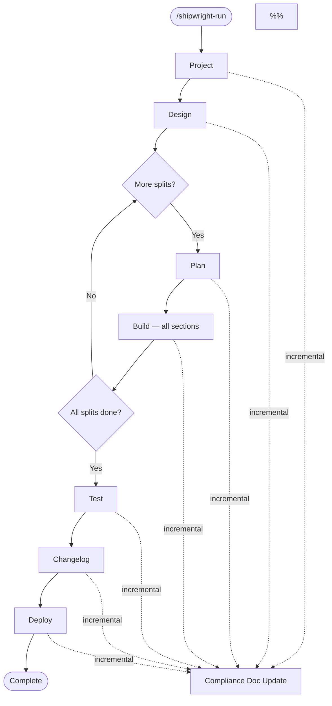

# Hooks & Pipeline Reference

> Single source of truth for understanding what fires when and the impact of pipeline changes.
> **Rule:** When modifying hooks, pipeline phases, validators, or between-phase actions, update this document.
>
> **See also:** `shared/constitution.md` — declarative ALWAYS / ASK FIRST / NEVER boundary rules.
> Hooks enforce a programmatic subset; the constitution covers the complete set.

## Pipeline Flow


```mermaid
flowchart TD
    START([/shipwright-run]) --> PROJECT[Project]
    PROJECT --> DESIGN[Design]
    DESIGN --> PLAN_LOOP{More splits?}

    PLAN_LOOP -->|Yes| PLAN[Plan]
    PLAN --> BUILD[Build — all sections]
    BUILD --> SPLIT_CHECK{All splits done?}
    SPLIT_CHECK -->|No| PLAN_LOOP
    SPLIT_CHECK -->|Yes| TEST[Test]

    TEST --> CHANGELOG[Changelog]
    CHANGELOG --> DEPLOY[Deploy]
    DEPLOY --> DONE([Complete])

    %% Out-of-band skills (NOT part of the orchestrator pipeline since
    %% iterate `sec-report-and-orchestrator-decouple`, 2026-04):
    %%   - /shipwright-security  → manual after test, or .github/workflows/security.yml
    %%   - /shipwright-compliance → on-demand detective audit (run_audit.py)
    %% Both are documented below; neither is auto-inserted by the state machine.

    %% Side-effects (dashed) — auto-background compliance doc update
    %% (plan v7 Option Z: compliance is no longer a pipeline phase; it
    %% fires as a non-blocking side effect after every completed phase.
    %% Detective audit runs on demand via /shipwright-compliance).
    %%
    %% Iterate 2026-05-23 (compliance-md-single-producer): the auto-
    %% background regen from generate_handoff_on_stop.py was REMOVED.
    %% Iterate-finalize remains the sole producer of tracked MDs; the
    %% snapshot-provenance audit (audit_staleness) compares on-disk to
    %% the last iterate-finalize commit (Run-ID: trailer + diff-filter
    %% on .shipwright/compliance/). Pipeline phase-completion hooks
    %% still trigger update_compliance.py for project/design/plan/build/
    %% test/changelog/deploy — those are explicit phase-side regens, not
    %% the Stop-hook drive-by.
    PROJECT -.->|incremental| COMP_INC[Compliance Doc Update]
    DESIGN -.->|incremental| COMP_INC
    PLAN -.->|incremental| COMP_INC
    BUILD -.->|incremental| COMP_INC
    TEST -.->|incremental| COMP_INC
    CHANGELOG -.->|incremental| COMP_INC
    DEPLOY -.->|incremental| COMP_INC
```

> **Iterate 2026-05-23-compliance-md-single-producer — single-producer
> invariant.** `.shipwright/compliance/{rtm,test-evidence,change-history,sbom,dashboard}.md`
> are produced exclusively by `iterate-finalize` (via `finalize_iterate.py`
> at F5b) and the per-phase `update_compliance.py --phase <name>` calls
> baked into the orchestrator's phase-completion path. The previous
> mtime-guarded auto-regen in `generate_handoff_on_stop.py` (lines 283-310
> on origin/main pre-this-iterate) was DELETED — it fired on out-of-band
> commits (security work, manual fixes) using the local-only
> `shipwright_events.jsonl` and produced dirty tracked MDs that didn't
> match the events log used to produce HEAD. The Group E audit
> (`audit_staleness.py`) now uses snapshot-provenance: it compares
> on-disk MDs to the version committed in the last commit that BOTH
> (a) contains a `Run-ID:` trailer and (b) modified
> `.shipwright/compliance/`. Non-iterate commits don't touch
> `.shipwright/compliance/` → snapshot baseline stays stable → no
> E1-E5 false positives between iterates.

> **Iterate 2026-05-23-security-adopt-compliance-snapshots — extends
> the snapshot-producer set.** Three additional producer paths now
> contribute `Run-ID:` snapshot commits that the audit recognises:
>
> - **`/shipwright-adopt`** Step H — single brownfield-onboarding commit
>   with body trailer `Run-ID: adopt-<YYYY-MM-DD>-<repo>`. Message is
>   built by the SSoT helper `plugins/shipwright-adopt/scripts/lib/adopt_commit_template.py`
>   (regex-enforced + date-deterministic via test seam).
> - **`/shipwright-security`** Step 7.5 (pipeline-mode only) — new
>   helper `plugins/shipwright-security/scripts/tools/finalize_security_compliance.py`
>   regenerates compliance MDs via `update_compliance.py --phase security`,
>   stages + commits as `chore(compliance): refresh after security scan`
>   with body trailer `Run-ID: security-<scan_id>`. Idempotent — a re-run
>   with no compliance diff produces no commit. Skipped in standalone
>   mode (Step 8 hands off to iterate), CI, and non-interactive sessions.
> - **`update_compliance.py`** gains two PHASE_REPORTS entries:
>   `adopt` (full 5-doc set — initial baseline) and `security`
>   (4-doc set excluding RTM — security work doesn't change FR coverage).
>
> The `Run-ID:` filter on `find_snapshot_commit` is preserved (per
> Codex sanity-check) — producer-provenance protection still matters.
> The remaining pipeline phase commits (project/design/plan/build/test/deploy)
> still lack `Run-ID:` trailers and are NOT yet snapshot-recognised;
> deferred to a separate iterate if needed (the changelog/release case was
> picked up by C1, below). Greenfield-pipeline users hit
> `snapshot_unavailable=true` until the first iterate (acceptable
> degraded-but-correct state — no false positives).

> **Iterate 2026-06-02-compliance-detective-realign (C1) — release commits
> join the recognised snapshot producers.** `find_snapshot_commit` now OR's
> two `--grep` patterns under `--fixed-strings`: a `Run-ID:` trailer
> (iterate-finalize) OR a `chore(release)` subject. `/shipwright-changelog`
> regenerates the tracked agent-doc/compliance MDs and commits them as
> `chore(release): vX.Y.Z` **without** a `Run-ID:` trailer, so before this
> every clean release re-flagged those MDs as Group-E stale against the older
> iterate-finalize snapshot. A manual `chore(compliance)` regen is deliberately
> **not** recognised — that is the hand-edit case Group E must still catch.
> Companion B7 change (same Run-ID-provenance fix): `group_b._check_b7`
> recognises an event↔commit link via the commit's `Run-ID:` footer ↔ the
> event's `adr_id` (since `work_completed` events ship `commit:""` by design),
> with the `commit`-field SHA match retained as the legacy/out-of-band fallback;
> and `apply_retention_rules` Rule D (`exclude_release_commits`) excludes a
> `chore(release)` commit as the changelog phase's tracked output — never
> generic chore/ci/docs commits, which stay surfaced as real drift.

### Merge reconciliation of churn artifacts (iterate-2026-05-31-churn-merge-resolver)

When `origin/main` advances while an iterate branch is open, a merge collides
**only** on generated/"churn" artifacts (never real source). Reconciliation is
automatic via `shared/scripts/tools/integrate_main.py` (the command an iterate
runs instead of a bare `git merge origin/main`), which delegates conflict
resolution to `shared/scripts/tools/resolve_churn_conflicts.py`. Each churn
artifact has exactly one documented resolution strategy:

| Churn artifact | Strategy on merge |
|---|---|
| `shipwright_events.jsonl` | **union** (`.gitattributes`, now scaffolded into managed repos) + unconditional validate/dedup |
| `.shipwright/triage.jsonl` | **union** (`.gitattributes`, now scaffolded into managed repos) + unconditional `_reconcile_triage` (exact-line dedup, NO id-collision warning — append/status share an id by design — + header/JSON validate) |
| `.shipwright/compliance/dashboard.md` | **regenerate** (from merged tree) |
| `.shipwright/compliance/sbom.md` | **regenerate** |
| `.shipwright/compliance/test-evidence.md` | **regenerate** |
| `.shipwright/compliance/traceability-matrix.md` | **regenerate** |
| `.shipwright/compliance/change-history.md` | **regenerate** |
| `.shipwright/compliance/ci-security.json` | **regenerate** (structured CI-security summary; best-effort refresh from the latest `security.yml` run, else the mainline `--theirs` placeholder stands) |
| `.shipwright/compliance/test-traceability.json` | **regenerate** (structured requirement→test traceability snapshot from the `test_links` collector; re-derived by the same `_update_compliance --phase iterate` producer, else the `--theirs` placeholder stands). **Fold-map resolution (iterate-2026-07-18-fr-fold-map-resolution):** when a spec declares a `## FR-Fold-Map`, a tag on a folded FR id is filed against its surviving FR (link carries `resolved_from`) instead of orphaning, and the manifest additionally carries `fold_map` + `fold_defects`. Those three keys are **omitted entirely** when the repo declares no fold-map, so a project without one regenerates a byte-identical artifact and this row's merge behaviour is unchanged. |
| `.shipwright/agent_docs/build_dashboard.md` | **regenerate** |
| `.shipwright/agent_docs/session_handoff.md` | **regenerate** |
| `.shipwright/agent_docs/triage_inbox.md` | **regenerate** |
| `.shipwright/planning/adr/INDEX.md` | **regenerate** (re-derived from the MERGED ADR folder listing by `lib.adr_index.rebuild_adr_index`, so a row added on each side survives). The one entry here that the BRANCH legitimately carries — iterate F3 refreshes it so its row ships in the same commit as its ADR (iterate-2026-07-31-adr-index-producer), which is exactly what created this conflict class (trg-1acb5304). Re-deriving is correct by construction, not a heuristic: the index is a pure function of the folder, and after the merge the folder holds both sides' ADR files. Deliberately **not** a `DERIVED_SNAPSHOTS` member (that register is for views that are *wrong* when derived on a branch) and **not** `merge=union` (union would concatenate two sorted lists into an unsorted one with a duplicated header). **Scope note:** unlike every other `regenerate` row this one is NOT produced by `regenerate_tracked_snapshots` — it is refreshed by `integrate_regenerate.regenerate_after_merge`, after `restore_derived_to_head`, so the integration path covers it but the manual `resolve_churn_conflicts.py --mode regenerate` escape hatch does not. Refresh that case with `uv run {shared_root}/scripts/tools/rebuild_adr_index.py --project-root .`. |
| `shipwright_test_results.json` | **ours** (PR-owned snapshot) |

> **Since iterate-2026-07-27-derived-snapshots-off-branch the eleven
> `DERIVED_SNAPSHOTS` rows above describe a path an iterate no longer takes.**
> (The `.shipwright/planning/adr/INDEX.md` row is the exception and is *not* one
> of them — an iterate branch deliberately DOES carry the index, which is why it
> needed registering at all.) The strategies above remain the
> documented behaviour of `resolve_churn_conflicts` — a legacy branch, a
> non-worktree flow, or the post-merge refresh producer still uses them — but an
> iterate branch **no longer carries any of them**, so on that path they cannot
> conflict and there is nothing to resolve. `integrate_main` calls
> `regenerate_tracked_snapshots(only=set())` (campaign `status.json` only) and
> `restore_derived_to_head()` **before** the merge, preceded by
> `stash_run_written()` (see the two paragraphs below) — before, because F5a/F5b
> write them mid-run and F6 no longer commits them, so they sit tracked-and-dirty
> and `git merge` refuses outright once mainline touches the same path. Registry:
> `shared/scripts/lib/derived_snapshots.py`. Gate:
> `verifiers/derived_snapshot_gate.check_no_derived_snapshots_committed`.
>
> **That gate's subject is the BRANCH, not the commit at the tip — and it was not,
> for a while.** F11 runs `ensure_current` *before* the verifier and then hands the
> verifier `--commit "$(git rev-parse HEAD)"`. On a branch that was behind, HEAD is
> by then the MERGE the integrate just made, and a merge commit's changed-path set
> does not contain what the iterate's own commit carried. Measured on PR #493: the
> merge showed 5 paths and 0 forbidden ones while the commit below it carried 11.
> Eight of `main`'s last forty commits carry a forbidden derived path; five of those
> landed *after* this gate went live. It is why `shipwright_test_results.json` still
> moves on `main`, which is what falsified the premise behind the run-written
> carve-out above. Every gate asking "what did this branch change?" therefore reads
> `git_helpers._iterate_changed_paths` (merge-base…HEAD), and an EMPTY answer is
> reported **skipped**, never clean — a merge HEAD reports no paths, so "clean"
> cannot be told from "blind".
>
> **Ten of the eleven, not all eleven** (trg-ad29a709). The restore resets
> `RESTORABLE_SNAPSHOTS` — everything a producer can RE-DERIVE.
> `shipwright_test_results.json` is excluded, because the run WRITES it (the F5
> ledger) and nothing can recompute it: resetting a MODIFIED copy is not undoing a
> regeneration, it is deleting this run's evidence, and it did so silently in two
> separate sessions. A *deleted* one is still restored — a deletion has no content
> to lose, and letting it ride would drop a tracked file — so the exclusion is
> about content, not about the path.
>
> **So the path is CARRIED, not left dirty** — a second between-phase step, and it
> is here because leaving it dirty is a pipeline failure mode. `integrate_main`
> calls `stash_run_written()` immediately before the restore (read the bytes,
> `git checkout HEAD --` so git sees a clean path) and `unstash_run_written()` in a
> `finally` around the whole merge (write the bytes back). The file ends dirty
> again, which is correct: it is the run's evidence and no iterate commits it.
> Both live in `shared/scripts/lib/run_written_ledger.py` — `derived_snapshots.py`
> next to it says what must be ABSENT, this one preserves what must be PRESENT, and
> neither raises: each returns the paths it could not handle, because the defect
> being closed here cost whole sessions purely by looking like success.
>
> Both halves are measured rather than argued, because the first draft of this
> section argued the trigger could not fire — on the premise that nothing commits
> `shipwright_test_results.json` any more — and that premise is **false**. `main`
> still tracks the file and its copy still moves: one of `main`'s twelve most recent
> commits on 2026-07-30 (#497) changed it, since the commit gate inspects a single
> commit and a multi-commit PR can carry it past. Leaving the path dirty therefore
> aborts the merge (`Your local changes ... would be overwritten by merge`, exit 2),
> `ensure_current` returns exit 6, and no branch advances.
>
> **Why the write-back is in a `finally` and not a single site after the merge.**
> `git merge --abort` is `git reset --merge`, which ALSO refuses when a path that
> differs between `HEAD` and the index has unstaged changes — so a write-back placed
> before the abort paths breaks them, silently (`error: Entry '<path>' not uptodate`,
> exit 128, `MERGE_HEAD` left standing). The `finally` runs after any abort.
>
> **Write matrix consequence.** No *phase* writes these eleven onto the default
> branch. Seven of them — the compliance directory — are written by the **release**
> and by an **on-demand documents-only PR**; the other four stay frozen by
> classification (see the next block). Freezing was deliberate rather than
> incidental: a branch-local derivation is not merely conflict-prone but wrong,
> reading the branch's git history (pre-squash SHAs) and an event log missing every
> concurrently-merging branch. The Group-E staleness audit reporting them as stale
> was therefore a TRUE signal for that window, not a regression to silence — and it
> is now answered rather than silenced.

### Refreshing the compliance evidence (iterate-2026-07-31-derived-docs-at-release)

> Deliberately its own `###`: the table below is keyed by path like the churn
> table above, and `test_churn_merge_doc_sync` scrapes that section by heading.
> Two path-keyed tables under one heading make the drift guard read this one as
> churn strategies and fail.

**Who refreshes the seven, and when.** Weg B of `.shipwright/planning/iterate/2026-07-30-derived-snapshots-decision.md`:
recompute where a human is already looking, never from a robot holding write access
to the default branch.

| Path | Class | Refreshed by |
|---|---|---|
| the five `.shipwright/compliance/*.md` | `derives_from_tree` | release Step 5.5 · `/shipwright-compliance --refresh-pr` |
| `.shipwright/compliance/test-traceability.json` | `derives_from_tree` | same (side effect of the same `_update_compliance` call) |
| `.shipwright/compliance/ci-security.json` | `derives_from_ci_history` | same, but **not** tree-derived — it carries the latest COMPLETED `security.yml` run, so its freshness is not a property of the commit. Excluded from the fixpoint claim; reported with `stale` + `scan_date`; never blocks a release |
| `.shipwright/agent_docs/build_dashboard.md` | `session_scoped` | nobody — embeds one session's run id, and the default branch has no run |
| `.shipwright/agent_docs/session_handoff.md` | `session_scoped` | nobody — same |
| `.shipwright/agent_docs/triage_inbox.md` | `derives_from_tree` | nobody — refreshable, but outside the compliance directory and not recomputed by the release phase. Excluded by scope pin, not by classification |
| `shipwright_test_results.json` | `run_written` | nobody — a run WRITES it and nothing can recompute it (trg-ad29a709) |

Registry + classification: `shared/scripts/lib/compliance_refresh.py`
(`unclassified()` fails a test on any `DERIVED_SNAPSHOTS` member with no class, so
eligibility is declared and never inferred from a file shape). Producer:
`shared/scripts/tools/compliance_refresh_produce.py` (fixpoint loop, failed-pass
detection, content floor). Delivery: `shared/scripts/tools/refresh_compliance_docs.py`
(`--stage` · `--pr` · `--restore`).

**The release regenerates them twice, and the second one must lose.**
`orchestrator update-step --step changelog --status complete` (Step 8) runs
`run_compliance_update(root, "changelog")`, whose `PHASE_REPORTS["changelog"]`
covers the whole set — *after* the release commit, unstamped, at a different
commit. The changelog skill therefore ends Step 8 with `refresh_compliance_docs.py
--restore`, so the committed stamped copies win and the release does not end with
a permanently dirty tree. Omitting that call reinstates the ordering defect this
change removes, one step later.

**The stamp.** Each markdown document's `Source-State:` banner carries
`base=<commit>` and, for a release delivery, `release=<tag>`. Applied by the
DELIVERER (`stamp_fixed_point`), not by the renderer: a renderer running inside an
ordinary iterate has no release and no base, and inventing one is the failure this
subject exists to remove. Both tokens are absent by default, so every other
producer renders byte-identically to before and the documents do not go
permanently dirty.

**`.shipwright/triage.outbox.jsonl` is deliberately NOT a churn artifact** —
it is GITIGNORED and per-tree, so it is never merged and never appears in
`CHURN_ALLOWLIST`. The per-tree transient buffer holds idle-main background
triage appends (campaign 2026-06-08-triage-outbox-delivery / D1): the
compliance audit, drift, phase-quality, and
`triage_add` route there (not the tracked log) only when HEAD is on the default
branch **with an `origin` remote**, so idle main accrues NO tracked-log drift.
`triage.read_all_items` returns the tracked ∪ outbox union so consumers see
background findings immediately; **status flips route the same way** — to the
outbox on idle main (`should_route_to_outbox`), else residence-derived (a flip
follows its append's file), so an idle-main dismiss is never undelivered tracked
drift (2026-06-12); the D2 sweep folds the outbox into the iterate PR branch +
GCs it. `triage_gc` and `_reconcile_triage` operate on the tracked log ONLY.

**"Idle main accrues NO tracked-log drift" is now ENFORCED, not assumed**
(iterate-2026-07-14-sweep-drift-dismiss-loss). Any producer that bypasses
`should_route_to_outbox` writes an append into the TRACKED log that reaches no
branch, no origin and no worktree — and a `status` for it then looks like an
orphan to the sweep's validator, which quarantined it away and destroyed the
operator's dismiss (reproduced in shipwright-webui, 2026-07-14: an item that
resurrected on the board after every dismiss). The sweep therefore:

* **adopts** append-only drift in main's tracked log into the outbox
  (`shared/scripts/lib/sweep_drift.py`) and restores the tracked log to HEAD via
  `git checkout --`, so the appends ride the iterate PR like any other buffered
  line — **the sweep is now a WRITER of main's tracked `triage.jsonl`**, a file it
  previously never touched (see the artifact-write matrix);
* **plans before it mutates** — the adoption is decided against the log it WOULD
  produce, so an aborting sweep never leaves the operator's data in a gitignored
  buffer while main's `git status` reads clean;
* **widens the orphan universe** — `sweep_quarantine.decide` takes the append ids
  known from main's tracked log; a `status` whose append is known is never an
  orphan and is never quarantined. Unplaceable → fail closed (`invalid`), never
  silently dropped;
* **refuses** (`skipped`, mutating nothing) when main's state is not understood:
  `main_tracked_diverged` (not an append-only prefix of HEAD),
  `main_tracked_index_diverged` (staged delta), `main_tracked_unparseable`,
  `main_tracked_changed_during_adopt`. A state that is understood but unrepairable
  (`main_tracked_no_head_blob`, `main_tracked_headerless_head_blob`) does NOT block
  delivery;
* **reports** — `SweepResult.quarantined` / `.adopted` reach the operator through
  `sweep_warnings()` (`setup_iterate_worktree` stderr + `warnings[]`). A quarantine
  used to look exactly like a clean run, which is why the loss stayed invisible.

**Writing one-shot helpers — DO NOT call `should_route_to_outbox()` blindly.**
That function answers "am I on idle default branch?" — it returns `False` on any
non-default branch (`iterate/*`, `chore/*`, `feat/*`, WIP), under the assumption
that the JSONL changes will ship in that branch's PR. A planning-side helper
(e.g. a one-shot script that adds 3 cards from a chore-branch checkout) does
NOT have that intent; using the function would silently commit the JSONL drift
to whatever branch is checked out, where it strands and never reaches `origin/main`.
**Force `to_outbox=True` explicitly** in such helpers — the WebUI reads the
union and the next iterate's D2 sweep folds them in. The `triage_add` CLI is
exempt from this because it IS designed to ship in the calling branch's PR;
direct-`append_triage_item()` callers are not.

This table is the SSoT for `resolve_churn_conflicts.CHURN_ALLOWLIST`
(`shared/tests/test_churn_merge_doc_sync.py` fails on any drift, both
directions). Two load-bearing rules:

- **`.shipwright/agent_docs/architecture.md` is deliberately NOT a churn
  artifact** — it is curated prose, so a conflict on it (or any source file)
  trips the resolver's hard pre-flight gate and reaches a human; the resolver
  touches nothing in that case.
- **Regenerated MDs land in a *separate, non-merge* follow-up commit** carrying
  a `Run-ID:` trailer. This is mandatory: `audit_staleness.find_snapshot_commit`
  uses `git log --diff-filter=AM` which skips merge commits, so the snapshot the
  Group-E audit compares against must be on a regular commit.

**`.shipwright/planning/iterate/campaigns/*/status.json` is a churn artifact
matched by GLOB, not by `CHURN_ALLOWLIST`** (campaign
`2026-06-07-tracked-campaign-status`, S3/S4). The per-tree campaign board is
producer-owned and **projected from the tracked event log**: F5b Step 6
(`campaign_status_io.finalize_campaign_status` → `write_campaign_status`)
regenerates a sub-iterate's `status.json` from its `campaign.md` skeleton +
`shipwright_events.jsonl` (top-level `campaign`/`sub_iterate_id`, never-downgrade)
and F6 ships it in the PR. Because the path is variable, the resolver admits it
via `churn_merge.is_campaign_status` (single-segment `fnmatchcase` on
`campaigns/*/status.json`) — deliberately OUTSIDE the 1:1 table above, so
`test_churn_merge_doc_sync` stays exact. On merge it is in the **regenerate**
bucket but **scoped to the conflicted campaigns only**
(`regenerate_tracked_snapshots(campaign_status_rels=…)`): the projection does not
round-trip a *legacy* `campaign.md` (ids predating the skeleton), so re-projecting
an *untouched* campaign could drop a completed sub — an untouched campaign
self-heals on its own next sub-iterate (never-downgrade). The skeleton parser
strips wrapping markdown emphasis (`**C1**` → `C1`) so a legacy table still
matches the plain committed ids (S4).

**Rollout note:** a long-lived branch created BEFORE the `.gitattributes` commit
must merge that commit (so the attribute is present in its tree) before `union`
applies to its `events.jsonl`. The resolver validates the merged log regardless.

**Target-repo coverage (iterate-2026-06-07-scaffold-churn-merge-machinery).** The
managed attributes fragment is no longer monorepo-only: its `merge=union`
first-line driver and the immutable test-evidence `-text -diff` rule use the same fragment
(`shared/templates/gitattributes-union.template`, SSoT
`shared/scripts/lib/gitattributes_union.py`) is now scaffolded into every managed
repo — at adopt time (Step E.13c, idempotent **merge** into the target's root
`.gitattributes`) and self-healed on the next iterate for already-adopted repos
(`setup_iterate_worktree` → `self_heal_gitattributes`, one guarded `chore` commit
on the iterate branch). `merge=union` is honored by GitHub's **server-side** PR
merge too, so a managed repo's concurrent triage/events appends auto-line-union
even without running `integrate_main.py` locally. The resolver
(`resolve_churn_conflicts.py`, bundled in the marketplace `shared/` and reachable
via `{shared_root}`) remains the monorepo-authored **second-line** authority that
dedups + validates the union'd log; it is incidentally reachable in managed repos
but the union driver alone is the sufficient first-line defense there.
The `-text -diff` rule separately prevents Git EOL normalization from changing
the exact bytes of `iterates/*.test-results.json` during F6 staging and keeps
byte-preserved CRLF evidence out of text whitespace diagnostics.

**Auto-merge is safe ONLY for a current single iterate — parallel PRs drain
serially (iterate-2026-06-12-automerge-serial-integrate, Option A).** GitHub's
server-side merge honors `merge=union` for the JSONL logs (above) but CANNOT run
the **regenerate-at-merge** half of the resolver, because regenerating the derived
snapshots (`.shipwright/compliance/*.md`, `.shipwright/agent_docs/*.md`,
`shipwright_test_results.json`) requires executing the producers against the merged
tree — something only a local `integrate_main` run does. So GitHub-native
auto-merge (armed in F11 since PR #197) is correct ONLY for the common case of a
**single iterate whose branch is current** at merge time (committed snapshots ==
merged-tree snapshots → no conflict, no staleness). For **concurrently-open**
iterate branches (independently-launched iterates whose PRs overlap in time) each
branch carries its OWN regenerated snapshots; as they merge serially every
still-open branch either conflicts on those snapshots (`DIRTY` → auto-merge stalls)
or merges stale (Group-E staleness noise). The contract:

- **F11 single iterate** (incl. independently-concurrent iterates) runs
  `shared/scripts/tools/ensure_current.py` (a thin refresh-if-behind guard over
  `integrate_main`) BEFORE arming auto-merge: if the branch is behind
  `origin/<default>` it merges + regenerates first (clean no-op if current), so the
  PR always arms from a current, already-regenerated tree.
  **Consequence every later check must respect:** running it first means the
  verifier's `--commit HEAD` can be a MERGE commit rather than the iterate's own, so
  a commit-scoped gate is blind to what the branch actually contributed. Ask
  `git_helpers._iterate_changed_paths`, not `_commit_changed_paths` — see the
  derived-snapshot note in the write-matrix section for the measurement.
  As of 2026-07-30 the `main-protection` ruleset no longer sets
  `strict_required_status_checks_policy`, so being behind is no longer a *merge*
  requirement — `ensure_current` still integrates when it is, which is why the
  ordering consequence stands rather than going away.
- **The integration is verified, not just performed
  (iterate-2026-07-27-no-silent-revert).** Requiring branches to be current is what
  *forces* the integration — it does not make the resolution correct, and a
  resolution taken in favour of one side discards the other's. PR #463 rewrote this
  very file from a stale base (10 insertions, **83 deletions**), silently reverting
  documentation from four already-merged PRs. Every guard let it through for a
  defensible reason: `ensure_current` correctly refuses a **non-churn** conflict and
  hands to a human (that is where the wholesale take happens); the `PR Review` LLM
  gate saw the whole diff and returned **SUCCESS**; `Anti-ratchet` only ever asks
  whether a file GREW; and the squash-merge flattened the branch, leaving no trace
  to audit. The F11 check `verifiers/silent_revert.check_no_silent_revert` now asks
  the decidable question directly: for each merge **this branch** performed of the
  default branch, what did the merged-in side gain over the common ancestor — and is
  any of it missing from the branch's tree? Scoped to `<default>..HEAD`, so a merge
  that landed months ago is not re-litigated (walking the full history flagged 889
  files on a *clean* merge and took ten minutes — measured, not assumed). A branch
  that has not integrated yet is `BEHIND`, not a revert, and is never accused.
  Removal stays legal, it just has to be said out loud:
  `iterate_latest.declared_removals[{path, reason}]` — a reason-less entry does not
  count. **Some answers to that question are not losses, and are filtered out
  before anything is reported (`verifiers/silent_revert_filters.py` +
  `…_reading.py`, iterate-2026-07-28-silent-revert-false-positives).** #477
  shipped without them and the next long-running iterate produced **four**
  findings, every one wrong, every one cleared through `declared_removals` — an
  escape hatch in routine use is a gate on its way to being decoration. Each
  filter can only ever REMOVE a finding, so each is a proof, never a threshold;
  cheapest first: (1) **the two trees already agree about the file** — then
  nothing in it can be a loss, whatever happened in between; (2) **the default
  branch moved past the line itself AND this branch followed** — it deleted the
  line, or replaced it with something this branch carries. The second half
  matters: "the tip no longer has this exact line" is equally true when the
  default branch merely fixed a typo in a line this branch really had reverted;
  (3) **the line was rewritten in place** — the replacement must sit in the same
  minimal (`-U0`, whitespace-insensitive) hunk as the deletion, and be a line
  this branch could only have written *after* seeing theirs (in neither the merge
  base nor its own pre-merge side). Those exclusions are what stop a fake
  witness: a resurrected pre-merge line, or a line the branch already had before
  the content it now vouches for existed. A minimum-token threshold was rejected
  as an undefendable knob. Token containment proves the *words* survive, not the
  meaning — an accepted, bounded trade, pinned by a test rather than implied.
  Because the comparison must be anchored to the ref the branch actually
  integrates (`ensure_current` merges `origin/<default>`), the check resolves
  `origin/<default>` when the local ref is behind it and reports that ref by name
  — a stale local ref made it skip whole merges (measured 6 → 2 → 1 as the ref
  was walked back). A side that cannot be read suppresses nothing: findings are
  reported with the incomplete comparison noted, and with no findings the check
  is a visible SKIP, never a pass.
- **Autonomous campaign** sets `SHIPWRIGHT_ITERATE_AUTOMERGE=0` so sub-iterate F11
  does NOT arm; the orchestrator runs **interleaved-serial** (campaign-mode.md) —
  build one sub-iterate → PR → CI-green → MERGE → build the next off fresh
  `origin/<default>`. Only ONE campaign PR is open at a time, so the snapshot
  cascade cannot form and no per-PR regenerate-at-merge drain is needed.

This is host-agnostic (the regeneration uses `integrate_main`/git, never a
GitHub-only API), reuses existing machinery, and softens no gate — `audit_staleness`
stays as-is because `main` is kept fresh at each merge. Rejected alternatives:
a GitHub Action post-merge regen (host-specific); untracking the snapshots (breaks
`audit_staleness`). A later host-agnostic watcher/producer (Option B, B4.5
`gh-pr-ci` roadmap) can automate the per-iterate merge but does not replace it.

**Delivery is the MERGED PR, not the armed PR
(iterate-2026-06-12-delivery-watch).** Arming `gh pr merge --auto` and walking
away is "shoot and forget": a Required Check can fail afterward and the PR sits
BLOCKED, un-merged, red. F11's final step runs
`shared/scripts/tools/deliver_pr.py`, which polls
`gh pr view --json state,mergeStateStatus,statusCheckRollup,url,baseRefName,headRefOid,headRefName`
until the PR is
`merged` (delivered), a Required Check fails (STOP — diagnose/fix/re-push/re-watch),
the PR is closed, or the poll times out while pending (keep watching, not "done").
A `needs:`-skipped Tier-1/2 `PR Review` counts as a pass.

**Who merges is decided by what the host can do
(iterate-2026-07-31-f11-delivery-truth).** On a base *without* branch protection
`gh pr merge --auto` cannot be armed at all — `Protected branch rules not configured
for this branch`, measured on throwaway PR #501 — and the old watcher then only
watched, so **every** iterate on such a repo ended not-delivered after the
1800-second timeout. A private repo on GitHub Free cannot have rulesets, so it could
never be delivered to. `deliver_pr.py` therefore confirms the PR is this run's (the arm is itself
mutating — it merges and deletes a branch once green), arms, and if the arm is refused
classifies *why* from two facts readable without admin rights: `allow_auto_merge` on
the repository, and `protected` on the base branch (`protected` rather than
`/rules/branches/…`, because that endpoint reports rulesets only and a
classic-protection repo answers `[]` while arming works). `protected: false` ⇒ arming can never succeed ⇒ deliver here: wait for green →
`ensure_current` → **verify the head that will merge** →
`gh pr merge --squash --match-head-commit <verified-sha>` → confirm `MERGED`, and delete
the remote ref separately (gh's `--delete-branch` would check out the default branch
*inside the iterate worktree*). A base that is protected while `allow_auto_merge` is off
is **exit 6**, deliberately: the protection expresses requirements an operator-token
merge may bypass, and the remedy is one repository setting. Anything else — an unreadable fact, a draft, a conflict — stays transient
and keeps watching, so the change only adds outcomes. Self-merge is on by default,
`SHIPWRIGHT_ITERATE_SELF_MERGE=0` disables it (unparseable values fail closed), and a
campaign's `SHIPWRIGHT_ITERATE_AUTOMERGE=0` suppresses both arming and self-merge.
Two invariants the ladder must keep: **what merges is what was verified** (F11 runs
the verifier before the watch, so a mid-wait refresh is re-verified and the merge is
pinned) and **checks do not vanish** (a freshly pushed head's empty rollup must not
read as "green, zero checks"). The pure decisions live in
`shared/scripts/lib/pr_delivery.py`, the host calls in
`shared/scripts/lib/pr_delivery_host.py`; `watch_pr_delivery.py` stays the read-only
diagnostic (`--once`), because a tool a human runs to ask "why is this stuck?" must
not be able to merge.

**A pending verdict names its blockers
(iterate-2026-07-27-name-the-blocker).** "Timed out" is not a cause. PR #439 sat
green for ~25 minutes — ten successful check-runs, `PR Review` successful,
auto-merge armed — while the watcher reported only that it had waited; the actual
blocker was one unresolved review thread, which stops auto-merge on its own. When
the watcher returns `pending` it now attaches a `blockers` block from
`shared/scripts/lib/pr_blockers.py`, built from three sources: `mergeStateStatus`
(already in the payload, previously read by nothing), the PR's review threads
(one `gh api graphql` call), and the base branch's required contexts (`GET
/repos/{o}/{r}/rules/branches/{b}` — readable without admin). The probe runs once
on the way out, not per poll, so a 30-minute watch costs two extra API calls.

**`mergeStateStatus` is a vocabulary, not a flag
(iterate-2026-07-27-merge-state-vocabulary).** The first cut read it as a
boolean — `BLOCKED` or nothing — which dropped every other actionable value.
Using the shipped watcher on a real stuck PR (#462) produced: all required checks
green, no unresolved thread, `mergeStateStatus: DIRTY`, and the verdict "no
blocker found … most likely still queued". `_pr_blocker_causes._MERGE_STATES` is
now a **closed** table — `DIRTY` (conflicts), `BEHIND` (base moved), `DRAFT`,
`BLOCKED`, `UNSTABLE` (a non-required check is red), against `CLEAN`/`HAS_HOOKS`
as fine — and **any value not in it is `unknown`**, so a state GitHub adds later
cannot be read as "nothing is wrong". `blocking` is claimed only where the merge
is structurally impossible (`BLOCKED`/`DIRTY`/`DRAFT`); `BEHIND` and `UNSTABLE`
are named without the claim, since whether they block depends on repository
settings. The operator line reports the state it observed rather than a fixed
phrase — the old wording announced "BLOCKED" for every blocking state, including
a PR that merely had conflicts.

Two properties matter more than the list itself. A source that cannot be read —
an unreadable rules endpoint, a truncated thread page, a repository on classic
branch protection rather than rulesets — lands in `blockers.unknown` with the
reason, **never** in "nothing found"; and `blocking` is asserted only where the
host structurally cannot merge, because an unresolved thread only blocks where
the repository requires conversation resolution. Terminal verdicts and exit codes
(0 merged / 2 checks_failed / 3 closed / 4 pending-timeout) are unchanged — the
probe does not run for them, since they already name their cause. Companion F2 rule: the
agent-doc 600-char budget gate (`test_agent_doc_entry_rules`) lives in the
iterate-plugin suite, OUTSIDE the `shared/tests` F0 run, so F2 mandates running it
locally after writing the `## Architecture Updates` / `## Learnings` entry, before
push — otherwise an over-budget entry surfaces only as a red PR check.

**Cross-component changes are forced to prove composition
(iterate-2026-06-12-cross-component-gate).** The empirical machinery is otherwise
boundary-centric (`touches_io_boundary` → round-trip) and app-surface-centric
(F0.5 E2E), so it forces NOTHING for a FRAMEWORK *composition* change — each piece
unit-tested, the interaction unproven (the auto-merge churn cascade is the
motivating class). The new `cross_component` risk flag
(`classify_complexity.CROSS_COMPONENT_FILE_PATTERNS`: merge/churn/event-log
resolver, Claude-Code hooks + hook fan-out, pipeline phase validators, campaign
drain) requires a `category:"integration"` behavior in the Test Completeness
Ledger — a real-scenario integration test proving the pieces compose
(reference `shared/tests/test_parallel_merge_cascade_integration.py`). NON-dodgeable:
the F11 verifier `check_integration_coverage` RECOMPUTES the flag from the diff
(merge-base..HEAD), not an agent-reported value, and STOPs without the behavior.
The verifier keeps a drift-pinned local pattern copy so it never cross-plugin-imports.

**The gate applies at EVERY complexity
(iterate-2026-08-01-coverage-gate-recompute-order).** It originally ran at medium+
only, which read as harmless because the flag carries `min_complexity: medium` —
a *detected* cross-component change is already escalated to medium, so the gate
fires. But that made the below-medium band reachable only when detection FAILED at
classification time (Stage 1 sees the message, not the diff) and the Stage-2 Quick
Scout detector step did not catch it — i.e. the recompute stood down in exactly the
case it exists to backstop, gated on the self-reported label sitting one field over.
`min_complexity` is now understood strictly as the *classification* escalation
floor; gate enforcement is independent and diff-driven. The same run made
`layer_coverage`'s infra failures (missing `--commit`, unresolvable base ref, git
fault, collector/regen failure) fail closed at every complexity, superseding
MUST-FIX 1's "SKIP below medium" — `check_removal_coverage` documented itself as
running at all complexities while declining to conclude at most of them. Only a
genuine non-git context still skips, in both gates.

**The CI trust boundary needs an acknowledgement, not more review
(iterate-2026-07-18-ci-supplychain-risk-flag, triage `trg-9509c2e8`).** Nothing in
the taxonomy covered `.github/workflows/**` or `.github/dependabot.yml` — the files
deciding *which third-party code runs with repository credentials*. Proven twice
live: webui PR #285 reversed an accepted-risk posture while recording
`risk_flags: []` through a full medium iterate (external plan review, code review,
confidence calibration), and its revert reproduced the same blind spot on the same
7 files. Mandatory review was therefore explicitly REJECTED as the enforcement —
#285 already had more review than it would impose. The `touches_ci_supplychain`
flag (`risk_detectors.CI_SUPPLYCHAIN_FILE_PATTERNS`) instead requires a recorded
acknowledgement naming the posture decision the change is consistent with, written
by `shared/scripts/tools/record_ci_supplychain_ack.py` to
**`.shipwright/planning/iterate/<run_id>/ci_supplychain_ack.json`** — beside
`reviews.json`, staged by F6's directory-level add. It lived in
`iterate_latest.ci_supplychain_ack` inside `shipwright_test_results.json` until
iterate-2026-07-28-ci-ack-per-run-home, which made it impossible to ship: that
file is a DERIVED SNAPSHOT, so committing it tripped
`check_no_derived_snapshots_committed` while omitting it starved this gate — two
ERROR checks no workflow-touching iterate could satisfy at once — and
`restore_derived_to_head` reverted the ack during ordinary finalization hygiene.
An ack still recorded the old way is honoured, under identical run/fingerprint
validation, so in-flight branches do not red-line. NON-dodgeable: the F11 verifier
`check_ci_supplychain_ack` RECOMPUTES the flag from the diff, applies at EVERY
complexity (a complexity floor would be the obvious dodge), fails CLOSED when the
diff is unobtainable, and binds the ack to the run id **plus** a fingerprint of
this diff's CI paths — so a leftover ack cannot license a later change. The
fingerprint deliberately covers only the CI paths, not the whole diff, because the
ack is written before F6 while verification runs against the tree that also carries
the finalization churn. The flag forces the change to be *reasoned about and
recorded*; it must never be read as "pin everything" (GitHub-owned actions stay on
mutable tags by framework decision, third-party stay SHA-pinned).

**Curated agent-docs use `merge=union`, not regeneration
(iterate-2026-06-12-union-curated-agent-docs).** The serial-integrate fix above
auto-resolves the *regenerated* churn snapshots, but `.shipwright/agent_docs/architecture.md`
and `conventions.md` are **curated prose** (deliberately NOT in `CHURN_ALLOWLIST`,
never regenerated). Parallel iterates each **prepend** a bullet to their
`## …Updates` / `## Learnings` sections (F2 / F3a), so the lines collide at the
same anchor — the last piece of the cascade the resolver left unsolved (PRs
#207/#208/#210/#211 each conflicted on exactly these two files). The fix adds them
to the `merge=union` driver as a **second category** alongside the JSONL logs:
`gitattributes_union.CURATED_DOC_UNION_PATHS` (the union'd fragment is
`ALL_UNION_PATHS = UNION_PATHS + CURATED_DOC_UNION_PATHS`; `UNION_PATHS` stays the
two JSONL logs, still drift-pinned to the churn allowlist + the managed-repo
signal). For the dominant pattern — two bullet-prepends at the same section top —
union keeps **both** bullets, and **GitHub honors `merge=union` server-side**, so
even pure auto-merge resolves it (no `ensure_current` needed for these files; and
`integrate_main` no longer BLOCKS on an architecture.md/conventions.md-only
conflict). **Caveat:** union is line-based + silent — two iterates editing the
*same non-append line* would merge both silently instead of conflicting; in
practice ~all parallel edits are append-section prepends. If that ever bites,
escalate these sections to per-run drop-files (the CHANGELOG-unreleased.d /
decision-drops pattern). The curated docs stay **out** of `CHURN_ALLOWLIST` — they
are union-merged, not regenerated, so the "architecture.md is deliberately NOT a
churn artifact" rule above still holds.

### Main-tree triage drift reconcile (iterate-2026-06-07-triage-main-tree-reconcile)

The churn resolver above covers **committed-vs-committed** merges. It does NOT
cover the other failure mode: `.shipwright/triage.jsonl` is tracked *and*
main-repo-root durable, so per-session **background** producers (compliance
audit, `triage_add`) append to the MAIN working tree and
leave it **uncommitted** — which then blocks `git pull` / `git merge --ff-only
origin/main` in the main tree (hit 2026-06-07 during the post-merge
plugin-cache-sync). C2's leak-guard *exemption* (`_MAIN_TREE_WRITE_EXEMPT`)
silenced the guard but is not a commit path.

`shared/scripts/lib/reconcile_triage.py::reconcile_main_triage(project_root)`
closes this: it resolves the MAIN repo root, validates + exact-line-dedups the
drift, and folds it into ONE `chore(triage)` commit (B7-exempt Rule E) BEFORE any
FF/pull — serialized on the canonical `triage._FileLock` and a **structured
no-op** under every safety guard (not-a-repo / op-in-progress / detached-HEAD /
any-staged-index / missing-log / CI-without-`--allow-ci` / no-drift). It is a
**between-phase action** wired into two call sites:

- `integrate_main.py` — invoked before its `origin/main` merge (every refreshing
  iterate also folds main-tree drift; step `reconciled-main-triage:<status>`).
- `setup_iterate_worktree.py` — invoked before the main-tree snapshot, so the
  background appends are committed (durable, not orphaned by a worktree branching
  off `origin/<default>`) and the snapshot baseline is clean.

The CLI `shared/scripts/tools/reconcile_main_triage.py` is the manual post-merge
sync-path entrypoint (run before `git pull`). New write surface: a single
`chore(triage)` commit on the main tree's default branch (only the
`.shipwright/triage.jsonl` path). See `shared/tests/test_reconcile_triage*.py`.

### Pipeline Constants

**File:** `plugins/shipwright-run/scripts/lib/orchestrator_pkg/constants.py`
(historical entry point `plugins/shipwright-run/scripts/lib/orchestrator.py` is
a thin re-export shim post Campaign B5 split, 2026-05-26 — the literal
constants live in the package now).

```python
PIPELINE_STEPS = ["project", "design", "plan", "build", "test", "changelog", "deploy"]

# Both "compliance" and "security" were previously in PIPELINE_STEPS or
# CONDITIONAL_STEPS but have been removed. Old configs are migrated on load.
_LEGACY_PIPELINE_ENTRIES: frozenset[str] = frozenset({"compliance", "security"})
```

> **Plan v7 (Option Z) — 2026-04-19.** `"compliance"` was removed from
> `PIPELINE_STEPS`. Compliance is no longer an explicit pipeline phase;
> the auto-background doc update (`update_compliance.py --phase <name>`)
> still fires after every completed phase, and the new on-demand
> detective audit runs via `/shipwright-compliance` (`run_audit.py`).
> Legacy projects with `"compliance"` in their `config["pipeline"]` are
> migrated on the next `load_run_config()` call (entry removed from
> `pipeline`, preserved in `completed_steps` as a historical marker,
> logged as a `pipeline_migration` event).

> **Iterate `sec-report-and-orchestrator-decouple` — 2026-04.** Security was
> also removed from the orchestrator. The previous `CONDITIONAL_STEPS` /
> `AIKIDO_CLIENT_ID`-gated insertion mechanism is gone. `/shipwright-security`
> is now a standalone skill — run it manually after `test` or activate
> `.github/workflows/security.yml` triggers. `runConditions.securityEnabled`
> is preserved in schema v2 for diagnostic purposes only and is always
> `false` post-decouple — it does not gate any phase.

**Dashboard display order:** `shared/scripts/tools/update_build_dashboard.py`
```python
PIPELINE_PHASES = ["project", "design", "plan", "build", "test", "changelog", "deploy"]
```
Dashboard uses `PIPELINE_PHASES` as canonical order. The previous
"compliance" column was retired alongside the v7 decouple — compliance
docs are still populated as an auto-background side effect, but the
dashboard no longer renders a phase column for them.
After build completes: shows split summary table. After test completes: shows test layer results (unit/integration/pgtap/smoke/e2e/design_fidelity).

---

## Pipeline Lifecycle (v2, single-session)

> **`single_session` is the SOLE pipeline mode** (since
> `iterate-2026-07-14-remove-multi-session`). `/shipwright-run` **drives** the
> pipeline: it writes the spec, then runs every phase
> (`project`, `design`, `plan`, `build`, `test`, `changelog`, `deploy` —
> 7 phases since the security decouple) as a phase-runner **subagent inside its
> own ONE conversation**. Because a phase is a subagent and not a separate
> process, the pipeline advances on **every surface** — CLI, WebUI, VS Code
> extension, desktop app.
>
> **What was removed.** The original v2 model (`mode: multi_session`, ADR-001)
> made the master a *coordinator*: it printed a surface-aware `claude --session-id`
> launch card and stepped aside, and each phase ran as its own external bound
> Claude session that claimed/completed its phase task through a trio of
> SessionStart/UserPromptSubmit/Stop hooks. That engine —
> `phase_session_start.py`, `phase_user_prompt_validate.py`,
> `phase_session_stop.py`, plus their private helpers `phase_context_blocks.py`,
> `lib/hook_session.py` and `lib/phase_event_emit.py` — is **deleted**, and the
> three hooks are deregistered from all 8 phase plugins. It could only advance on
> a surface able to spawn a bound session, so `/shipwright-run` stalled at phase 1
> in the VS Code extension and desktop chat. See
> `docs/migrations/multi-session-to-single-session.md`.
>
> **Drivability is an explicit literal.** A run is a driven pipeline **iff its
> config records `mode: "single_session"`**. A mode-less pre-SS1 config, or one
> still carrying `multi_session`, is refused by **every execution entry point**
> (`write-config`, `single-session-next` / `-apply` / `-resume` / `-recover`) with
> an actionable migration message — *before* any claim, mutation or event. The
> guard deliberately does **not** live in the read path, so historical runs stay
> inspectable (WebUI run history, `.shipwright/runs/**`).

> **Phase-gate policy (Campaign 2026-07-07, SS2).** Each phase runs as a
> phase-runner subagent, so its interactive `AskUserQuestion` gates follow a
> per-gate policy from `shared/config/gate_catalog.json`: `auto-default` (proceed
> with a documented answer, no END-TURN), `orchestrator-approve` (stop and surface
> to a human), or `hard-stop` (always require a human — PROD deploy, destructive
> SQL, migration-apply failure, rollback; constitution-locked). At startup the five
> phase skills (`project`, `design`, `plan`, `build`, `deploy`) read the policy
> via `shared/scripts/tools/resolve_gate_policy.py`; the full contract is
> `shared/prompts/single-session-gate-discipline.md` and the catalog is documented
> in `shared/config/gate_catalog.md`, generated beside its JSON source. The
> mechanism is **inert** — every gate resolves to
> `interactive` — for any config that is not an explicit `single_session` run, so a
> standalone or adopted project keeps its ordinary interactive gates. That
> inertness is keyed on `gate_policy.INERT_MODE` (`"standalone"`), which is a
> *sentinel, not a mode*: it replaced the `multi_session` literal that used to play
> that role, and it is why removing the mode did not silently start auto-answering
> gates in every standalone project.

> **The orchestrator loop (Campaign 2026-07-07, SS3).** The master DRIVES the
> pipeline in ONE conversation. Two orchestrator subcommands
> (`orchestrator.py single-session-next` / `single-session-apply`, in
> `orchestrator_pkg/single_session_loop.py` + `single_session_cli.py`) alternate
> with the `shipwright-run:phase-runner` subagent
> (`plugins/shipwright-run/agents/phase-runner.md`): **next** resolves the frontier
> phase task, claims it (`claim_phase_task`), and records a dispatch in
> `.shipwright/run_loop_state.json`; **apply** validates the phase-runner RESULT
> CONTRACT, **verifies on disk that every artifact an `ok:true` result claims
> exists** (`orchestrator_context.verify_artifacts_exist` — a claimed-but-unwritten
> artifact is rejected `artifacts_missing`, no completion), freezes splits when a
> design phase completes (so build fans out per split), routes the result through
> `complete_phase_task` (an `ok:false` result strict-stops via `mark_phase_failed`,
> planning NO successor), and advances the loop pointer. The phase-runner has a
> **write path** and persists its own outputs to disk (it does NOT rely on a Stop
> hook). On resume the master rebuilds context via the `single-session-reload`
> subcommand (`orchestrator_context.reload_orchestrator_context`) — from run_config
> + compact `phase_tasks[].result` summaries, never a transcript (context-budget
> bound). The loop owns NO bespoke completion path — every phase-task mutation goes
> through `phase_task_lifecycle`. **Those are the same helpers the deleted Stop hook
> called, which is why removing that hook cost the pipeline nothing.** Loop-state
> holds no authoritative phase status. Splits are serial in v1. The master-side
> protocol is `plugins/shipwright-run/skills/run/references/single-session-loop.md`.

> **Resumability / recovery + observability (Campaign 2026-07-07, SS5).** The
> master IS the driver, so a closed/crashed master is simply a paused run:
> re-invoking `/shipwright-run` detects the live loop-state on a non-terminal run
> and resumes via a confirm card. Three orchestrator subcommands back it, all in
> `orchestrator_pkg/single_session_recovery.py` and **mode- + run-identity-gated**
> (a non-single-session or stale-`runId` config is a no-op rejection — nothing
> mutated, no file written): `single-session-resume` (read-only resume decision for
> the card; `--confirm` records the commitment), `single-session-gate --state
> pause|resume` (human-gate state + event), `single-session-recover` (in-loop
> `recover-phase-task` + loop-pointer realign + event). A task left `in_progress`
> is re-dispatched idempotently by `single-session-next`: the phase-runner is a
> subagent of the master, so master death = runner death, and there is no orphaned
> worker to race. (Split-brain WAS a real hazard under `multi_session`, whose phases
> were independent external processes that outlived the master; removing that mode
> removed the hazard.) The loop appends structured telemetry to
> **`.shipwright/run_loop_events.jsonl`** (append-only JSONL, gitignored by the
> `/.shipwright/*` wildcard, distinct from the tracked `shipwright_events.jsonl`;
> event types `dispatch` / `phase_result` / `strict_stop` / `human_gate_pause` /
> `human_gate_resume` / `resume` / `recovery`), best-effort (a write failure warns
> to stderr, never crashes the loop). The durable, tracked `phase_started` /
> `phase_completed` pairs in `shipwright_events.jsonl` are emitted by the loop CLI
> (`single-session-next` → `record_phase_started`, `single-session-apply` →
> `record_phase_end`), one per split; with `phase_session_start` gone the loop is
> their SOLE producer. End-to-end proof:
> `integration-tests/test_single_session_sole_mode.py` (residue guard + survivor
> contract) and `integration-tests/test_single_session_capstone.py`.

### Run-Config Schema v2

Every `shipwright_run_config.json` written by `orchestrator.py write-config`
since 2026-04-25 carries `"schemaVersion": 2`. The authoritative state lives
in `phase_tasks[]`:

```json
{
  "schemaVersion": 2,
  "runId": "run-a1b2c3d4",
  "runConditions": {
    "securityEnabled": false,             // always false post-decouple — diagnostic only, does not gate any phase
    "splitMode": "per_split" | "none" | null,
    "aikidoClientIdPresent": false        // diagnostic only, does not gate any phase
  },
  "splits_frozen": ["01-core", "02-ui-shell"],
  "completed_phase_task_ids": ["ptk-9f8e"],
  "phase_tasks": [
    {
      "phaseTaskId": "ptk-9f8e",
      "phase": "project",
      "splitId": null,
      "sessionUuid": "<pre-bound uuid4>",
      "version": 1,
      "status": "awaiting_launch | in_progress | done | failed | skipped",
      "slashCommand": "/shipwright-project",
      "prerequisites": [],
      "claimedBySessionUuid": null,
      "claimAttemptedAt": null,
      "executionCount": 0,
      "result": {"ok": true},
      "errors": []
    }
  ],
  "status": "in_progress | complete | failed | needs_validation",
  "current_step": "...",            // legacy v1-compat field — NOT ADVANCED, see below
  "completed_steps": [...],         // legacy v1-compat field — NOT ADVANCED, see below
  "pipeline": [...]                 // legacy v1-compat field, drives banner counts
}
```

> **`current_step` / `completed_steps` are WRITE-ONCE, NEVER-ADVANCED in a DRIVEN run.
> Never key logic on them ALONE.** `config_factory` stamps `current_step` at run creation
> (`"project"`) and nothing in the v2 lifecycle moves it: `phase_task_lifecycle` advances
> `phase_tasks[]` + `completed_phase_task_ids` + `status`, and that is the whole authority.
>
> They are NOT dead fields, and the v1 `update_step` path *does* advance them — it is
> merely inert on a driven run (the drivability guard). They are still written by
> `shipwright-project`, by `shipwright-adopt` (which seeds `completed_steps` so an adopted
> repo does not look like it skipped phases), and by that v1 path; and they are still read
> by `compliance/mermaid.py` (dashboard phase strip), `generate_handoff_on_stop`,
> `suggest_iterate`, `update_build_dashboard`, `state.detect_current_phase`,
> `convert_configs_to_events`, and the `design` / `compliance` verifiers.
>
> **The rule for a reader is therefore: consult `phase_tasks[]` first, and fall back to
> the v1 fields — do not read either one alone.** `phase_quality.resolve_source` and
> `phase_quality.phase_is_engaged` were migrated to exactly that shape in
> `iterate-2026-08-01-drop-write-once-step-fields`. They OR the two sources rather than
> replacing v1, because `config_factory` marks a phase completed *standalone* as
> `skipped` in `phase_tasks[]` while still listing it in `completed_steps` — so a
> v2-only read would engage FEWER phases, and phase-quality's contract is "audit MORE,
> never silently fewer". Dropping the fields is a campaign blocked on the readers above,
> not a cleanup — owned by triage `trg-8d52a965` (successor to `trg-be24ff6f`).
>
> The phase skills used to derive "pipeline vs standalone" from
> `status == "in_progress" AND current_step == <my phase>`, which is FALSE for every
> driven phase past the first — so every dispatched phase self-classified as standalone
> and stamped its artifacts `"mode": "standalone"` (which `_validate_test` then rejects,
> deadlocking the run). Fixed in `iterate-2026-07-14-phase-invocation-mode`: the
> invocation mode is now resolved **only** from the dispatch token — see § Invocation
> mode below. A scalar `current_step` could not have answered the question even if it
> *were* maintained: the frontier is split-qualified (`plan/01-core` vs `plan/02-ui` share
> a phase name), so it cannot identify *which* task you are.

**`runConditions` is frozen at run creation.** Mid-run env changes
(`AIKIDO_CLIENT_ID`) do not retroactively change pipeline shape.
**`splits_frozen` is set when the design phase completes** via
`freeze-splits`. Splits are immutable after that point.

v1 configs (no `schemaVersion`) are **hard-fail** rejected by phase-lifecycle
subcommands — the user must rename and re-run `/shipwright-run`. Standalone
phase invocations (no run config at all) keep working.

### State Machine

`plugins/shipwright-run/scripts/lib/phase_state_machine.py` is the pure
single-source-of-truth for "given a completed phase, what is next". The
orchestrator wraps it and materialises new `phase_tasks[]` entries.

| Predecessor (phase, splitId)        | Condition                                 | Next (phase, splitId)              |
|-------------------------------------|-------------------------------------------|------------------------------------|
| _none_ (run init)                   | always                                    | `("project", null)`                |
| `("project", null)`                 | always                                    | `("design", null)`                 |
| `("design", null)`                  | `splitMode == "per_split"` (≥1 split)     | `("plan", splits[0])`              |
| `("design", null)`                  | `splitMode == "none"`                     | `("plan", null)`                   |
| `("plan", split[i])`                | always                                    | `("build", split[i])`              |
| `("plan", null)`                    | always                                    | `("build", null)`                  |
| `("build", split[i])`               | `i+1 < len(splits)`                       | `("plan", split[i+1])`             |
| `("build", split[i])`               | `i+1 == len(splits)` (last split)         | `("test", null)`                   |
| `("build", null)`                   | always (split-less)                       | `("test", null)`                   |
| `("test", null)`                    | always                                    | `("changelog", null)`              |
| `("changelog", null)`               | always                                    | `("deploy", null)`                 |
| `("deploy", null)`                  | always                                    | `None` (pipeline-terminal)         |

> The previous security-conditional branch (`("test", null) → ("security", null) → ("changelog", null)` gated by `runConditions.securityEnabled`) was removed in iterate `sec-report-and-orchestrator-decouple`. Security is now an out-of-band skill — invoke `/shipwright-security` manually after test, or activate `.github/workflows/security.yml`. The state machine no longer plans a security phase task.

**Run-completion invariant:** `run.status = complete` requires (1) deploy
task is `done` AND (2) all other `phase_tasks[]` are terminal (`done` or
`skipped`). When (1) holds but (2) doesn't, `run.status =
"needs_validation"` plus a `pipeline_completion_blocked` event. **Failure
is terminal:** any `failed` task immediately flips `run.status = failed`.

### Phase Lifecycle (in-conversation loop)

Phases are advanced by the master's loop, **not by hooks**. The three phase-session
hooks that used to drive this (`phase_session_start` / `phase_user_prompt_validate` /
`phase_session_stop`) are deleted; there is no per-phase SessionStart/Stop chain left.

```
USER: /shipwright-run   (any surface — CLI, WebUI, VS Code, desktop)
   |
   v
MASTER writes shipwright_run_config.json (mode: single_session), then LOOPS:
   |
   +--> orchestrator.py single-session-next
   |       - resolve the frontier phase task
   |       - claim_phase_task (CAS, by the task's own sessionUuid claim token)
   |       - record dispatch in .shipwright/run_loop_state.json
   |       - record_phase_started -> shipwright_events.jsonl (tracked)
   |
   +--> Task(shipwright-run:phase-runner)   <-- a SUBAGENT, not a new session
   |       - runs the ONE phase skill (dispatch.slashCommand)
   |       - honours gate policy (auto-default / orchestrator-approve / hard-stop)
   |       - WRITES ITS OWN OUTPUTS TO DISK (does not rely on any Stop hook)
   |       - returns the compact RESULT CONTRACT {ok, phase, summary, artifacts[]}
   |
   +--> orchestrator.py single-session-apply
   |       - validate the RESULT CONTRACT
   |       - verify_artifacts_exist  (a claimed-but-unwritten artifact ->
   |                                  artifacts_missing, NO completion)
   |       - freeze_splits when a design phase completes
   |       - complete_phase_task (ok:false -> mark_phase_failed, NO successor)
   |         -> plan_next_phase appends the successor task
   |       - record_phase_end -> shipwright_events.jsonl (tracked)
   |
   +--> loop until terminal: complete | failed | needs_validation
```

Phase plugins keep their ordinary SessionStart behavior (one cache-ready wrapper
runs `ensure_shared_cache`, `capture_session_id`, `check_artifact_drift`, and
`session_start_using_shipwright` in order) and
their ordinary Stop chain (`audit_phase_quality_on_stop`, `generate_handoff_on_stop`,
`bloat_gate_on_stop`, …). What they no longer carry is the phase-claim trio — and, for
all 8 phase plugins, the `UserPromptSubmit` event entirely (`phase_user_prompt_validate`
was its only entry).

**Standalone path** (a phase skill invoked directly, outside a run): unchanged and now
trivially so — with no phase-session hooks there is nothing to no-op. Gate policy is
inert (every gate `interactive`) because the config is not an explicit `single_session`
run.

### Crash Recovery

If the master conversation dies mid-phase, the phase task is left `in_progress` with
`claimedBySessionUuid` set. This is **not** a wedge: the phase-runner was a subagent of
the dead master, so it died with it — there is no orphaned worker to race. Re-invoking
`/shipwright-run` resumes, and `single-session-next` **re-dispatches the task
idempotently** (re-claims by its own `sessionUuid`, `executionCount` not re-bumped);
the artifact persistence-guard still verifies its outputs on apply. In-loop recovery is
`single-session-recover` (same lifecycle mutator + a `recovery` event + loop-pointer
realign).

**Escape hatch** for a genuinely wedged task:

```bash
uv run plugins/shipwright-run/scripts/lib/orchestrator.py recover-phase-task \
  --phase-task-id ptk-9f8e \
  [--force-status awaiting_launch|failed|skipped]
```

Bumps `version`, clears `claimedBySessionUuid`, increments `executionCount`.
The crashed session's later `complete-phase-task` is rejected with exit 2
(stale_version), so it cannot corrupt state after recovery.

---

## hooks.json Format

> **Breaking change (Claude Code 2.1.132+, ADR-039/040, 2026-05-07):** Claude
> Code tightened plugin-schema validation. `plugins/*/hooks/hooks.json` must now
> **(a)** wrap its event-name dict under a top-level `"hooks"` key, and **(b)**
> use **string** matchers for `PreToolUse`/`PostToolUse`. A file with the old
> shape is **skipped entirely** — *no* hooks fire — with `Hook load failed:
> expected record, received undefined at path ["hooks"]` (missing wrapper) or
> `Invalid input: expected string, received object` (object matcher). Pinned by
> `shared/tests/test_hooks_json_wrapper.py` (wrapper + matcher invariants); all
> 12 shipped `hooks.json` use this form.

**Required format** — top-level `{"hooks": {...}}` wrapper + string matchers:

```json
{
  "hooks": {
    "EventName": [
      {
        "matcher": "Bash",
        "hooks": [
          {"type": "command", "command": "path/to/script.sh"}
        ]
      }
    ]
  }
}
```

| Matcher type | Format | Used by |
|-------------|--------|---------|
| Single tool | `"matcher": "Bash"` | PreToolUse, PostToolUse |
| Multi tool | `"matcher": "Write\|Edit"` (regex alternation) | PostToolUse |
| Subagent name | `"matcher": "shipwright-plan:section-writer"` (plain string) | SubagentStop |
| No filter | Omit `matcher` field entirely | SessionStart, Stop, PostToolUse catch-all (e.g. `track_tool_calls.py`) |

Tool names use short form: `Bash`, `Write`, `Edit`, `Read`, `Glob`, `Grep`.

**Old format (removed, pre-2.1.132):** event names at the JSON document root
with **no** `{"hooks": {...}}` wrapper, and/or object-form matchers
`{"tools": ["Bash"]}` — both rejected on plugin load by Claude Code 2.1.132+.

---

## Hooks Registry

> **Note (updated `iterate-2026-07-14-remove-multi-session`).** The 8 phase
> plugins (`project`, `design`, `plan`, `build`, `test`, `security`,
> `changelog`, `deploy`) used to wire a **shared phase-session trio** —
> `phase_session_start.py` on `SessionStart`, `phase_user_prompt_validate.py`
> on `UserPromptSubmit`, `phase_session_stop.py` first on `Stop` — which
> claimed and completed a phase task per external Claude session. That trio is
> **deleted**: phases are now advanced by the master's in-conversation loop.
> The removal also emptied the `UserPromptSubmit` event in all 8 (the validator
> was its only entry), so those plugins no longer register that event at all.
> The per-plugin tables below show each plugin's hooks; the shared chain every
> plugin still inherits is one `run_if_cache_ready` command that performs
> `ensure_shared_cache` and then runs `capture_session_id` →
> `check_artifact_drift` → `session_start_using_shipwright` on `SessionStart`.

### Fan-out consolidation (once-per-event guard)

Claude Code fires every *enabled* plugin's hooks with **no active-plugin
filter**, so a shared hook registered in N plugins runs N× per event
(SessionStart/Stop/PostToolUse ×11–12). The fix (iterate-2026-06-14-hook-fanout-dedup)
is **symmetric — no single controlling plugin**: every shared hook stays
registered in every plugin (preserving the `test_hook_registry_bloat`
"register-everywhere" invariant + robustness across the greenfield pipeline AND
iterate — if one plugin is disabled the hook still fires from another), and the
genuinely-redundant work is wrapped in a fail-open **`event_once.claim_once`**
guard so exactly one invocation does it per `(event, session)`. Claim files live
under the gitignored `.shipwright/.cache/<event>-<sid>.claim`
(`event_once.event_claim_path`, valid for session-unique events only —
SessionStart/Stop, **not** multi-fire PostToolUse). Guarded hooks:

| Hook | Event | Behavior |
|---|---|---|
| `ensure_shared_cache` | SessionStart | stdlib-only O_EXCL election keyed by a digest of the payload session/event generation; one winner scans/heals, 11 losers wait for its token-specific atomic completion sentinel; a plugin-local ready guard skips later cache-dependent hooks if the bounded wait ends without readiness |
| `audit_phase_quality_on_stop` | Stop | claim + **session-state phase resolver** (see its section) |
| `generate_handoff_on_stop` | Stop | claim first-wins — 11× identical handoff/dashboard regen → once |
| `check_artifact_drift` | SessionStart | claim around the scan + `additionalContext` emit → once (distinct `sessionstart-drift` claim key from `capture_session_id`'s injection claim) |
| `bloat_gate_on_stop` | Stop | claim (`stop-bloat`) on the **block path only**, after every no-op/pass guard — N× identical Iron-Law block → once; the pass path stays empty + unclaimed (iterate-2026-06-20-bloat-gate-stop-fanout-dedup) |
| `aggregate_triage_on_stop` | Stop | claim (`stop-triage-inbox`) after the `is_shipwright_project` no-op guard — N× redundant `triage_inbox.md` regen (a non-atomic write) → once; a failed winner releases the claim so a sibling retries (iterate-2026-06-20-aggregate-triage-stop-fanout-dedup) |

Hooks already deduped/convergent (left unchanged): `capture_session_id` (claim on
its injection), `check_drift`, `audit_compliance_on_stop`,
`plugin_sync_reminder_on_stop`, and the PostToolUse pair `mark_plugin_edit`
(set-idempotent marker) + `check_file_size` (upsert-by-path marker) — their N×
fan-out converges to **one** net marker entry. (`bloat_gate_on_stop` was
originally placed in this "convergent" list by iterate-2026-06-14-hook-fanout-dedup,
but it is **not** convergent: its *pass* path is empty/invisible, which masked
that the *block* path re-emits the full Iron-Law `reason` once per plugin —
12 identical Stop blocks in one event, observed in webui session `bfd244ca`.
It now carries the `stop-bloat` claim in the table above.) Cross-event
composition is pinned by `integration-tests/test_hook_fanout_consolidation.py`
(exactly-once, phase-from-session-state, fail-open, robust-when-first-plugin-disabled,
parallel-fan-out atomicity, marker convergence) + `integration-tests/test_bloat_gate_fanout.py`
(one block across the 12-plugin fan-out, sequential + parallel, per-session isolation)
+ `integration-tests/test_aggregate_triage_fanout.py` (one regen + 11 dedup-skips
across the fan-out, sequential + parallel, per-session isolation).

### Shared Hook: ensure_shared_cache.py (marketplace-install self-heal)

**Canonical:** `shared/templates/hooks/ensure_shared_cache.py` plus its
plugin-local stdlib helpers `cache_repair_lock.py` and
`run_if_cache_ready.py`, all **vendored** byte-identically into every
hook-bearing plugin's `scripts/hooks/`. Each plugin registers exactly one
`SessionStart` command: `run_if_cache_ready.py` joins the healer election in
process, waits for the session's completed claim tip, acquires a reader lease,
then runs every former SessionStart target sequentially in its original manifest
order. It merges their schema-valid `additionalContext` strings into one
SessionStart JSON envelope. There is no separate healer/guard process boundary
whose causal relationship must be inferred from an identical payload.

**Why it exists.** Every other plugin hook reaches shared code through
`${CLAUDE_PLUGIN_ROOT}/../../shared/...`, i.e. a sibling `shared/` two levels
above the plugin root (`.../plugins/cache/shipwright/shared`). But `shared/` is
not a plugin — `.claude-plugin/marketplace.json` lists only the 14 plugins — so a
plain `claude plugin install` never copies it into the cache; only the dev script
`scripts/update-marketplace.sh` creates it. On a fresh end-user install every
`../../shared/*` hook therefore 404s (fail-open, but noisy — the symptom that
prompted this hook was `track_tool_calls.py` "can't find its own path" on a fresh
macOS install). The same gap hits the sibling **`plugins/`** tree: several hooks
import a plugin's lib cross-plugin via `${CLAUDE_PLUGIN_ROOT}/../../plugins/shipwright-X/…`,
and `cache/shipwright/plugins/` is likewise created only by `update-marketplace.sh` —
so on a fresh install those imports degrade to their `None` fallback. (The hook that
originally motivated this healer, `phase_session_start`, called that fallback unguarded
and crashed SessionStart; it has since been deleted with the multi-session engine, but
the cross-plugin import gap it exposed is real for any such hook.)

**What it does.** When the cached `shared/` is missing **or incomplete**, it
mirrors it from the marketplace **full-clone**
(`~/.claude/plugins/marketplaces/<name>/shared`, which a marketplace install
*does* carry). Independently, for **each** installed plugin whose mirror is
missing or incomplete, it copies `cache/<name>/shipwright-X/<version>` (the
numerically newest version — `0.10.0` beats `0.2.0`) into
`cache/<name>/plugins/shipwright-X` so `../../plugins/shipwright-X` imports
resolve — no clone needed for that part.

Two source-selection rules apply to `shared/`, not one. **Restore** (the tree is
absent) accepts any marketplace clone carrying the sentinel — a stranger's copy
beats nothing. **Top-up** (the tree is present but short) accepts only the
*same-name* clone `marketplaces/<cache name>/shared`: a foreign clone's extra
files would read as our gaps and its code would be copied in on every session.
An install carrying only a foreign clone therefore gets restore-but-never-top-up.

**Completeness, not liveness (2026-08-01).** Each tree used to be judged from a
single sentinel file: `shared/scripts/lib/project_root.py` for the whole
1013-file `shared/` tree, and shipwright-run's `phase_task_lifecycle.py` for all
14 mirrors. A sentinel answers *"was this tree ever created?"*, never *"is it
whole?"* — so a **partial reap**, the event this hook exists to survive, read as
healthy and was never repaired. ADR-120 measured it: a reap of the 55
`shared/scripts/tools/verifiers/` modules every iterate's F11 imports left the
sentinel standing and F11 died with `ModuleNotFoundError`. Two independent code
paths hid the plugins half — a combined early return, and a `not
_plugins_healthy(...) and _heal_plugins(...)` short-circuit that made the repair
operand unreachable. Both are gone; each tree is now compared **file-set**
against its repair source.

Properties:

- **plugin-local + vendored** — a plugin-local file is the only thing a
  marketplace install reliably delivers, so the self-heal must not itself live in
  `shared/`. Drift between the canonical and the 12 copies (and their SessionStart
  registration) is gated by `shared/tests/test_ensure_shared_cache_vendored.py`
  (forward + reverse);
- **stdlib-only** — it can never depend on the very `shared/` it repairs. That is
  also why its ignore set is a second copy of
  `scripts/cache_tree_compare.SKIP_DIRS`; the copy is pinned by
  `test_ensure_shared_cache_walk.py`;
- **presence, not content** — the clone and the cache differ in line endings (24
  of 1015 files, measured), so a content rule here would re-copy them every
  session. *Is anything gone?* is this hook's question; *is anything stale?* is
  `check_plugin_cache_sync.py`'s, and it CRLF-normalizes before hashing. A file
  that is present but truncated is therefore **not** detected here;
- **fail-open** — any error (incl. no marketplace clone found → an actionable
  "run `update-marketplace.sh`" stderr note) exits 0, so a session is never
  blocked. The walk is **tri-state**: an unreadable tree yields *unknown*, never a
  short file list, because an under-counted source would manufacture exactly the
  false "complete" verdict this change removes. Unknown ⇒ neither claim health
  nor copy;
- **idempotent** — a whole cache is a no-op, and so is the `--plugin-dir` dev
  model (no top-level `shipwright-*` dirs, no marketplace clone). The cache
  manager's own files (`.in_use/<pid>` per-PID refcounts, `.orphaned_at` reap
  markers) are ignored on both sides; counting them reported a phantom gap on all
  14 mirrors and would have turned this hook into a 1464-file copy on every
  session start. Verified against the live cache: complete on all 14 mirrors and
  on `shared/`, i.e. a clean no-op;
- **~200 ms once for the normal cohort, never concurrent** — four `stat` walks (both sides
  of both trees, ~4 400 entries), measured on the live cache. Claude Code still
  fires all 12 vendored wrappers, but an O_EXCL claim under the cache marketplace
  root elects one scanner/healer. The other 11 wait for the winner's
  token-specific completion sentinel, so their ordered SessionStart targets
  cannot import from a tree while it is being copied. If an active repair
  outlives all bounded waits, the healer still exits 0, but the plugin-local
  ready wrapper skips that invocation's cache-dependent targets instead of
  letting them import an unfinished tree. The winning chain runs them normally
  after completion; a later SessionStart retries the skipped fail-open work. A
  bounded SHA-256 digest names the claim, never the raw payload. Its event key
  combines only immutable stdin values: the raw `session_id`, SessionStart `source`,
  and transcript path, serialized as ASCII-escaped canonical JSON before
  hashing. It never stats a payload-controlled path, so all 12
  parallel invocations derive the same key even while the transcript changes.
  A later `resume`/`compact` source gets a distinct verdict. Every generation
  also records immutable, hashed participant-observation markers while a
  generation is still running. The marker's fixed-size digest covers the
  generation filename and participant identity together; raw identity text is
  never placed in the pathname, avoiding Windows path-length amplification. A participant observed before completion belongs
  to that fan-out and skips; one already present, or one first arriving only
  after completion, advances an immutable successor immediately, even inside the
  30-second TTL. Each participant is the plugin's single `plugin:sessionstart`
  wrapper, so no unused per-target authorization can survive into a repeated
  event. The elected owner records itself, probes for a concurrent peer for up
  to 100 ms, and, once a fan-out is observed, waits up to two seconds for the
  active `installed_plugins.json` entries whose selected version actually
  registers a command whose script-token basename is exactly
  `run_if_cache_ready.py` to record the same generation.
  Stale or unregistered cache directories are not peers; an unavailable manifest
  falls back to the bounded probe. The normal
  cohort therefore starts one scan even when process scheduling is uneven;
  isolated/manual invocation keeps the bounded 100 ms probe, while a wrapper
  that was genuinely absent until after completion still advances safely into
  a new generation. Each wrapper
  joins before it trusts readiness, so it cannot open a target on stale
  completion. Each election has a random fencing token so a late old owner
  cannot complete a newer one.

  Claude's payload has no event-unique field, so an arbitrarily delayed member of
  one fan-out is indistinguishable from the first member of a later event with
  byte-identical payload. The protocol resolves that ambiguity toward safety: a
  post-completion arrival may cause a sequential successor scan. The cache-global
  writer lease lives directly under the stable marketplace cache root, outside
  the replaceable claim directory. Replacing that metadata directory therefore
  cannot create a second reader/writer lock domain: concurrent scans/copies stay impossible, and the normal
  co-scheduled 12-process path remains one scan as pinned by the subprocess test.

  Claim generations are immutable; completion is a separate owner-only O_EXCL
  file, never an in-place rewrite. TTL age starts at that completion file's
  mtime, not at the earlier claim election. The healer and ready guard share
  that TTL constant and accept up to one second of negative apparent age from
  filesystem timestamp rounding; a completion farther in the future remains
  expired. A resumed session therefore cannot treat an expired done generation
  as ready while the healer advances its successor. Advancement
  creates a token-derived immutable successor claim only after matching
  completion expires — no shared
  claim pathname is deleted, and a running owner is never declared stale from
  wall time alone. Completion is published only after a second completeness
  scan proves both comparable destinations ready. Existing `shared/` is not
  declared ready without its enumerable same-marketplace authoritative source, and a
  plugin-mirror symlink is ready only when it resolves exactly to the selected
  installed version. A plugin-local stdlib OS file
  lease (`cache_repair_lock.py`) additionally serializes actual scan/copy work
  across *different* session ids and is released automatically on process exit.
  A timed-out claimant recovers the observed token under that global lease: a
  live owner finishes first; a killed owner releases the lease and one peer
  repairs before consumers continue. Lease acquisition itself has a five-second
  monotonic deadline, so a live wedged owner cannot hang all SessionStarts. The
  ready wrapper closes the corresponding consumer side of that timeout. It
  invokes the healer first, then polls for the completed tip for ten seconds
  without holding a reader lease, so a later writer can enter. Once ready, it
  holds a shared reader lease for every target hook's full ordered run; readers
  from the 12 chains remain concurrent, while a
  writer cannot enter between validation and import. If the bounded reader wait
  expires, the guard warns, exits 0, and never opens the cache-dependent target.
  Missing identity or an unsafe/unreadable
  session-claim boundary takes the old fail-open route but still requires the
  global lease. If that lease itself is unavailable, the hook exits 0 with a
  warning and performs no scan or mutation. Target stderr is preserved; valid
  SessionStart contexts are merged and invalid stdout is warned/skipped. The `--plugin-dir` dev model creates
  neither claims nor a lock.

  Claim tokens and completion freshness are read once through nonblocking/no-follow
  descriptors, validated as single-link regular files by descriptor and pathname
  identity; completion age comes from `fstat()` on that descriptor. The global
  lease receives the same descriptor/path validation
  before Windows can size it or either platform can lock it. Symlink, reparse,
  FIFO, hard-link, replacement, and other unsafe boundaries therefore degrade to the
  fail-open/no-mutation path rather than following or blocking on them.

  The tiny claim/done/participant files are cache-lifetime metadata: they are deliberately
  not deleted by a concurrent SessionStart hook, because pathname deletion is
  the ABA race this protocol excludes; cache replacement removes them. The
  protocol becomes active after all hook-bearing plugins are updated. Both the
  repo sync and marketplace update workflow update the full set before session
  restart; restarting midway through a plugin-by-plugin update is unsupported,
  because an already-installed old hook cannot understand a new claim protocol.

Composition is pinned by `shared/tests/test_ensure_shared_cache_integration.py`
(fresh-install delivery: `shared/` from the clone and `plugins/` from the
installed dirs; `plugins/` heals with no clone; idempotent no-op; fail-open;
dev-model no-op) and `shared/tests/test_ensure_shared_cache_partial_reap.py`
(the surviving-sentinel cases, both trees, both former short-circuits, and the
cache-manager-litter no-op). Layout builders are shared via the sibling
`shared/tests/ensure_shared_cache_fixtures.py`. Coordination is pinned by
`shared/tests/test_ensure_shared_cache_fanout.py` (ownership, wait ordering,
token fencing, immutable completed-only successor election, bounded digest,
dead-owner recovery, descriptor/path validation, participant re-arm, and
fail-open boundary paths, including fixed-size observation-marker naming) plus
  `integration-tests/test_ensure_shared_cache_fanout.py` (12 real consolidated wrapper processes,
one repair, immediate guarded shared/mirror consumers, a killed claim owner, two
different sessions contending for one cache-global writer lease, and an
  11-second live writer whose losing chain waits at the ready wrapper rather than
  importing early, a held writer whose incomplete chain is skipped, ordered
  multi-target execution with one merged JSON result, including an
  expired prior completion followed by another partial reap, and a fresh startup
  completion followed by a resume-source reap, plus partial reaps followed by
  the identical payload inside the completion TTL from both a prior and a
  previously absent participant, plus a structurally malformed but valid-JSON
  install manifest falling back to a bounded successful repair; 22 subprocess
  scenarios total). Malformed but
  JSON-decodable target output is warned and omitted without aborting later
  targets; the first non-zero target status is retained after the full chain.

### Shared Hook: capture_session_id.py

**Script:** `shared/scripts/hooks/capture_session_id.py` — the canonical
SessionStart hook used by **every** plugin via
`${CLAUDE_PLUGIN_ROOT}/../../shared/scripts/hooks/capture_session_id.py`.

Injects into Claude's session context:
- `SHIPWRIGHT_SESSION_ID` — current session id
- `SHIPWRIGHT_PLUGIN_ROOT` — active plugin directory
- `SHIPWRIGHT_PROJECT_ROOT` — resolved via `resolve_project_root()`
  (subdirectory-safe for monorepo layouts; falls back to `cwd`)
- `SHIPWRIGHT_ROOT_SESSION_ID`, `SHIPWRIGHT_LOOP_ID`,
  `SHIPWRIGHT_LOOP_UNIT_ID` — only emitted when parent runner set them
  (autonomous-loop propagation, iterate 14.8+)

Also appends `export SHIPWRIGHT_SESSION_ID=...` to `CLAUDE_ENV_FILE`
(if provided) so bash subprocesses inherit the session id —
`additionalContext` alone does not reach child processes spawned by
Claude's Bash tool. Idempotent: never duplicates the export line.

This single hook replaced 8 per-plugin duplicates that used to live
under `plugins/*/scripts/hooks/capture-session-id.py` (iterate 14.9).

**Session-id fallback chain (Iterate A.4, 2026-05-21).** When the capture
hook hasn't run — startup races, hook failures, manual `uv run …` invocations
— `shared/scripts/tools/generate_session_handoff.py::resolve_session_id`
now goes through a 4-stage fallback instead of emitting the literal string
`"unknown"`:

| Stage | Resolution | Side effects |
|-------|-----------|--------------|
| `env` (primary) | `SHIPWRIGHT_SESSION_ID` env var | No warning. |
| `A` derived | `derived-<run_id>`, with `-2 / -3 / …` collision suffix | `hook_warning` event (`source=session_id_fallback`, `stage=A`). |
| `B` persisted | once-per-process UUID, persisted to `.shipwright/session_fallback.json` | `hook_warning` event (`stage=B`). |
| `C` literal floor | literal `"no-session-id"` | `hook_warning` event (`stage=C`) + WARN banner rendered into the handoff. Reached only when stage-B persistence itself fails (read-only FS, bad `.shipwright/`). |

The fallback file (`session_fallback.json`) is git-ignored by the existing
`.shipwright/*` rule. The handoff's "Session Info" block captions which
stage produced the id whenever a non-env stage fired.

### Shared Hook: check_artifact_drift.py

**Script:** `shared/scripts/hooks/check_artifact_drift.py` — wired
as a SessionStart hook in **every** plugin (12 hooks.json files),
after `capture_session_id.py`.

**What it does:** scans the resolved `SHIPWRIGHT_PROJECT_ROOT` for
any *legacy* top-level artifact directory (e.g. `planning/`) whose <!-- artifact-path-canon: legacy -->
canonical home has been relocated under `.shipwright/` (e.g.
`.shipwright/planning/`). The list of active migrations and their
canonical-vs-legacy paths lives in
`shared/scripts/lib/artifact_migrations.py` (`ARTIFACT_MIGRATIONS`).

**Behavior per migration status:**
- `pending` → not scanned (no-op).
- `in_progress` → **warn-only**. Findings produce a stderr notice and
  a markdown report at `.shipwright/stale-folders.md`. Hook exits 0
  so we don't break our own migration sub-iterates.
- `migrated` → **warn-only** (a SessionStart hook *cannot* block a
  session). Findings produce a schema-valid `additionalContext` payload
  on stdout — the channel SessionStart delivers to the model — carrying
  the drift summary + a `git mv …` remediation list, plus a stderr
  notice and the report. Hook exits 0. (WP4 /
  `iterate-2026-06-13-hook-block-channel`: this was previously documented
  as an `exit 1` "hard-gate" emitting `{"success": false, ...}`, but
  SessionStart exit codes are non-blocking and that JSON shape was never
  read — the gate was inert. A true hard-stop would need a
  `UserPromptSubmit` hook; deferred under YAGNI until an incident
  warrants it.)

**Self-healing:** when no findings exist on a subsequent run, the
report file is *deleted* (`unlink(missing_ok=True)`) instead of
overwritten — the absence of `.shipwright/stale-folders.md` is the
canonical "no drift" signal.

**Streaming + fail-open:** scan stops after 50 sample files per
legacy directory (no full `rglob`+`stat` pass). Any `OSError` during
scan reports the directory as drifted rather than crashing. Any
exception in the hook itself is caught at the top level — drift
detection can never brick a session start.

**Manifest extension:** to gate a new artifact migration, append a
dict to `ARTIFACT_MIGRATIONS` with `{name, canonical, legacy_dirname,
old_path_patterns, ast_check_string, status}`. Status starts at
`pending`, flips to `in_progress` when the rewrite kicks off, and
finally to `migrated` after the cleanup sub-iterate. The companion
test-suite (`shared/tests/test_artifact_path_canon.py` and the four
sister tests) automatically covers the new entry.

**Reference:** the module docstring of
`shared/scripts/lib/artifact_migrations.py` holds the four-step pattern.
All four artefact migrations completed in 2026-04/05; their long-form
execution records were removed by `iterate-2026-07-28-docs-placement-rule`
and remain in `git log` should a fifth ever need them.

### Shared Hooks: Skill Bootstrap Pack (SP2 + SP4)

Three hooks added by iterate `iterate-2026-05-29-skill-bootstrap-pack`
(P4.1, external-frameworks SP2 + SP4). Registered in **all 12 hooks-bearing**
plugin `hooks.json` files (`shipwright-preview` has no `hooks/` dir, so it is
excluded — consistent with every other shared hook). Forward/reverse meta-test:
`shared/tests/test_using_shipwright_hook.py`. All fail-open. SP4 is
monorepo-scoped (no-ops unless `scripts/update-marketplace.sh` is present), so
end-user projects never see the sync reminder.

**`shared/scripts/hooks/session_start_using_shipwright.py` — SessionStart
(SP2).** When `shipwright_run_config.json` is present in the project root,
emits `shared/prompts/using-shipwright.md` as
`hookSpecificOutput.additionalContext` so a fresh session knows to route
changes to `/shipwright-iterate`, compliance to `/shipwright-compliance`,
etc. Silent in non-Shipwright projects. Because it fires up to 12× per
session, an atomic O_EXCL sentinel
(`.shipwright/locks/using_shipwright_bootstrap.<sid>`) ensures exactly one
firing injects. Reads `SHIPWRIGHT_SESSION_ID` from env.

**`shared/scripts/hooks/mark_plugin_edit.py` — PostToolUse `Write|Edit`
(SP4).** Records plugin-side edits to
`.shipwright/locks/plugin_edit_pending.<sid>.json` (set-idempotent).
"Plugin-side" = under `plugins/`, under `shared/` (excl. `shared/tests/`),
or any `SKILL.md` — exactly what `update-marketplace.sh` syncs into the
runtime cache. Silent in non-Shipwright projects.

**`shared/scripts/hooks/plugin_sync_reminder_on_stop.py` — Stop (SP4).**
Reads the marker; if plugin-side files were edited this session, surfaces a
once-per-session block-reminder
(`{"decision":"block","reason":...}`) to run `bash scripts/update-marketplace.sh`
+ `uv run scripts/check_plugin_cache_sync.py --strict`. It files **no triage
item** (iterate-2026-06-13-triage-not-current-work): the plugin-cache re-sync is
routine current-run maintenance, not a deferred "later" follow-up, so the
block-once reminder is the whole surface. A `plugin_sync_reminded.<sid>` sentinel
makes it fire exactly once — **block once, never block-until-green** (avoids a
hard loop when edited-but-not-pushed or the cache is absent in CI). This is the
Stop half of a PostToolUse→Stop wave analogous to the bloat gate
(`check_file_size.py` → `bloat_gate_on_stop.py`).

### Shared Hook: audit_compliance_on_stop.py

**Script:** `shared/scripts/hooks/audit_compliance_on_stop.py` —
Stop-event trigger for the **compliance detective-audit triage
emit/dismiss**. Added iterate-2026-05-30. Wired into the
`shipwright-iterate` and `shipwright-changelog` Stop chains only,
ordered **after** finalize + `audit_phase_quality_on_stop` and **before**
`aggregate_triage_on_stop`.

**Why:** `audit_detector.mirror_findings_to_triage` (the path that both
emits new `source=compliance` triage items AND auto-dismisses ones whose
finding has cleared) was previously reachable ONLY via the explicit
`/shipwright-compliance` skill (`run_audit.py`). Every *other* triage
producer has a frequent automatic trigger; the compliance-audit producer
was the lone exception, so F-group / B-group items lingered in
`status=triage` long after the underlying finding was fixed. This hook
closes that gap (Option A1, 2026-05-23 design discussion). It does NOT
touch the #78 snapshot-provenance E-staleness machinery.

**Contract** (mirrors `audit_phase_quality_on_stop.py`):
- Non-blocking. Always exits 0, even on internal error.
- Idempotent per `(HEAD-sha, session_id)` — marker under the gitignored
  `.shipwright/agent_docs/runtime/compliance_audit/` tree.
- Silent no-op for greenfield / non-Shipwright projects and under the
  same Monorepo Auto-Descent Guard as phase_quality.
- Gated off when `SHIPWRIGHT_COMPLIANCE_AUDIT_ON_STOP=0`.

**Full-coverage safety gate (load-bearing):** `mirror_findings_to_triage`
auto-dismisses any currently-`triage` compliance item whose `check_id` is
absent from THIS run's failures, and the dismiss is **groupless** — a
crashed/skipped group's findings vanish and its triage items would be
wrongly dismissed (running only group F would dismiss B7/B2). So the hook
runs the FULL audit (groups A-G) via `register_all()` +
`run_all(emit_to_triage=False)`, verifies `set(groups_run) == {A..G}`
with no `import_gate_error`, and ONLY THEN calls
`mirror_findings_to_triage`. Any partial coverage → skip mirroring
entirely (never a false dismiss) + stderr diagnostic. Strictly safer than
`run_audit.py`'s unconditional emit. Scoped per-group auto-dismiss
(Option A2) and cross-worktree triage sync (Option C) are out of scope.

**Versioned-install resolution fix (same iterate, shared):** wiring this
hook surfaced that `phase_quality.phase_from_plugin_root` only matched the
plugin-root **basename**. Claude Code's `installed_plugins.json` uses
`installPath=.../<plugin>/<version>` (e.g. `shipwright-iterate/0.4.1`), so
the basename is the *version* and the lookup returned `None` — silently
no-opping **every** phase-keyed Stop hook (phase_quality, this hook, the
`capture_session_id` injection guard) under a versioned install. Verified
empirically: the cached `audit_phase_quality_on_stop.py` invoked with the
real versioned `CLAUDE_PLUGIN_ROOT` wrote no finding. The resolver now
falls back to the parent directory (the plugin name), re-enabling all
phase-keyed Stop hooks. (Reactivation initially re-flooded the inbox with one
item per Tier-1 FAIL across every audited phase; iterate-2026-05-31
`phasequality-triage-bundle` replaced that mirror with a single rolling
`phaseQuality:backlog:<sig>` action-unit plus a phase-applicability gate and a
`run_id=unknown` spec-check guard — see the producer side-effect note on the
iterate Stop row below.)

**Invocation carries its own deps (C2, iterate-2026-06-02-compliance-detective-realign):**
both Stop-chain registrations invoke the hook as
`uv run --with pyyaml "${CLAUDE_PLUGIN_ROOT}/../../shared/scripts/hooks/audit_compliance_on_stop.py"`
(`plugins/shipwright-iterate/hooks/hooks.json`,
`plugins/shipwright-changelog/hooks/hooks.json`). The audit imports `group_a5`,
whose A5.2+ workflow checks need PyYAML. A non-Python adopt repo (e.g. the
WebUI) has no root `pyproject.toml` declaring `pyyaml`, so a bare `uv run`
resolved an interpreter without it and the whole A5 group hard-failed as an
"A5.0 setup" FAIL — a phantom compliance finding caused by the invocation env,
not by anything in the target repo. `--with pyyaml` makes the audit
self-contained regardless of the target project's pyproject. Defence-in-depth on
the check side: if `import yaml` still fails, `group_a5.run` emits a single
**A5.0 SKIP** (not FAIL) with an "audit deps unavailable — run with
`uv run --with pyyaml`" reason, so a missing dependency never poisons `any_fail`
or lands in the triage backlog. A *real* A5 violation in a project that does
have yaml is unaffected — only the missing-dependency setup path degrades.

**A5.8 behavioral gate probe (iterate-2026-06-05-a5-gate-behavioral-probe):**
A5.4 confirms the deployed `.github/workflows/security.yml` carries a step with
`id: shipwright-critical-gate` — that it is *present*. A5.8 confirms it *works*:
it extracts the gate's `run:` body and *executes* it against fixture scan output,
asserting the ratified policy (critical → block, empty/invalid → fail closed,
clean → pass). It is flavor-agnostic — each scenario stages BOTH the template's
`sarif/*.sarif` AND the monorepo's `findings.json`/`prompt_risks.json`
consistently, so it is correct whether the deployed gate reads SARIF (adopted
repos, rendered from `security.yml.template`) or findings.json (this monorepo's
own scan). The gate body needs `bash`+`jq` (system binaries, NOT injected by
`--with pyyaml`); where either is absent — or the gate can't pass a clean
fixture, or has no `run:` body — A5.8 emits **SKIP** (never a phantom FAIL),
same posture as the A5.0 PyYAML skip. Operator kill-switch:
`SHIPWRIGHT_A5_GATE_PROBE=0` disables it. Behavior pinned by
`plugins/shipwright-compliance/tests/test_audit_gate_behavior_probe.py`
(bash/jq cases run in CI, skip on Windows-dev per ADR-044) and
`test_gate_probe_orchestration.py` (decision-tree, runs everywhere); the
*template* gate is independently pinned by
`shared/tests/test_security_critical_gate.py`.

### Shared Hook: audit_phase_quality_on_stop.py

**Script:** `shared/scripts/hooks/audit_phase_quality_on_stop.py` —
consolidated Stop-event entry point for the Phase-Quality audit.
Wired into 11 of the 12 plugins that ship a Stop hook — every plugin
*except* `run`, whose 4-hook Stop chain (`generate_handoff_on_stop` →
`master_stop_check` → `bloat_gate_on_stop` → `plugin_sync_reminder_on_stop`)
deliberately omits the phase-quality audit. (`preview` ships no `hooks.json`
at all, so it has no Stop hook.)

**Contract:**
- Non-blocking. Always exits 0 even on internal errors.
- **Once-per-(Stop, session) + session-state phase resolution**
  (iterate-2026-06-14-hook-fanout-dedup): Claude Code fires this hook from all
  11 plugins per Stop (no active-plugin filter). Exactly ONE invocation wins an
  `event_once.claim_once` guard (`.shipwright/.cache/stop-phasequality-<sid>.claim`,
  taken AFTER all no-op guards so a foreign/no-op invocation never consumes it);
  the rest skip. The winner resolves which phase(s) to audit from SESSION STATE
  via `phase_quality.resolve_engaged_phases()` (run config `phase_tasks[]` —
  the v2 authority — OR-ed with the v1 `current_step` / `completed_steps`, plus
  `status` + `events.jsonl`), **not** from
  `CLAUDE_PLUGIN_ROOT`. The plugin root is now only a recognition gate
  (`phase_from_plugin_root(...) is None` → foreign-plugin no-op). This replaces
  the old "each plugin audits its own plugin-root phase" fan-out, which audited
  11 phases (10 of which never ran) then rewrote them FAIL→SKIP. **Fail-open
  ("never fewer"):** a `claim_once` error → the invocation proceeds (audit N×
  rather than 0×); unreadable/insufficient engagement evidence → ALL canonical
  phases are audited.
- Idempotent per phase via the `(phase, run_id, session_id)` triple
  (`already_audited`) — the per-phase dedup behind the event-level claim, used by
  the claim re-arm path on a later Stop in the same session.
- Silent no-op for greenfield / non-Shipwright projects.
- Silent no-op when the resolver auto-descended into a managed
  subfolder while the user was actually working at a parent level
  (Monorepo Auto-Descent Guard — see below).
- Gated off when `SHIPWRIGHT_PHASE_QUALITY=0`.

**Monorepo Auto-Descent Guard:** When the Stop-hook fires from a cwd
that is a **strict ancestor** of the resolved `project_root` (i.e.
`resolve_project_root()` found the managed project via auto-descent
into a subdir), the hook silent no-ops. Goal: monorepo-root work does
not pollute the audit trail of a managed subproject.

*Opt-in for cross-dir audit (e.g. CI/automation):*
- `cd <managed-subdir>` — cwd is then `project_root` or a descendant;
  audit fires normally.
- `SHIPWRIGHT_PROJECT_ROOT=<path>` **and** the resolved path matches
  exactly the detected `project_root` — explicit user opt-in.

*No bypass on ambient env:* when `SHIPWRIGHT_PROJECT_ROOT` is set for
unrelated reasons (CI, parent shell) AND does not resolve to the
current `project_root`, the guard still fires. This distinguishes
deliberate opt-in from environment noise.

*Cross-platform:* path comparisons use `.resolve(strict=False)` which
dereferences symlinks and normalises Windows case-insensitivity. On
resolution errors (broken mount, deleted cwd) the guard fails open
with a stderr warning — safer than silently blocking every audit
after one environment hiccup.

The same guard applies to the SessionStart-Injection in
`capture_session_id.py` so injection won't surface Tier-1 FAILs from
off-scope audit runs that might have predated the guard.

**Categories (complete — epic PR 1-4):**
- `canon` — C1-C5 Minimum Phase Completion Canon via
  `shared/scripts/tools/verifiers/common.py` helpers. Covers the
  standalone-Canon gap that was not enforced before (previously only
  the orchestrator's `update_step` ran Canon).
- `workflow` (PR 2) — phase-specific skill-step checks. Each phase has
  a thin wrapper module in
  `shared/scripts/tools/verifiers/<phase>_compliance.py` that returns
  finding dicts; `run_workflow_checks` dispatches on phase name and is
  resilient to broken wrappers (never crashes the Stop chain).
- `infrastructure`, `traceability`, `quality` (PR 3) — cross-phase
  modules at `shared/scripts/tools/verifiers/{infrastructure,
  traceability,quality}_checks.py` that expose a single
  `run(phase, project_root)` entry point. The phase_quality dispatcher
  lazy-imports each module and applies the plugin-coverage gate (plan
  § 5.1). Broken modules surface as one error finding — same resilience
  contract as the workflow dispatcher.
- `spec` (PR 4) — cross-phase spec category at
  `shared/scripts/tools/verifiers/spec_checks.py`. Runs S1-S10 against
  the top-level spec (.shipwright/agent_docs/spec.md), per-iterate spec files,
  CLAUDE.md, README.md, FR coherence, and git-based doc-freshness
  heuristics. Uses `lib/spec_parser.py` for FR heading parsing.

**Check catalog (PR 2-3 — plan § 3):**

Each check emits a finding with `id`, `status` (PASS/FAIL/WARN/SKIP),
`evidence`, optional `remediation`, and `tier`=2 for heuristic
(never-enforcement) checks. Marker-based PASSes carry
`provenance: unverified_marker` so the dashboard flags spoof-susceptible
evidence (plan § 4.5).

**Workflow category (PR 2):**

| ID | Phase | Default on Missing | Tier | Evidence Source |
|---|---|---|---|---|
| W1 | build | SKIP (never FAIL — R8) | 2 | `shipwright_events.jsonl`: `test_run` timestamp ≤ latest `work_completed` |
| W2 | iterate | FAIL · SKIP if small or `run_id` unresolvable (audit ctx, mirrors S2/S3) | 1 | `.shipwright/planning/iterate/{run_id}-external-review.json` OR `external_review_state.json` newer than spec |
| W3 | iterate | FAIL | 1 | `work_completed` event (source=iterate) + `.shipwright/compliance/test-evidence.md` mtime <24h |
| W4 | test | FAIL | 1 | `shipwright_test_results.json.coverage.total` ≥ `shipwright_test_config.json.coverage.min` (default 70) |
| W5 | plan | FAIL | 1 | `.shipwright/planning/external_review_state.json` status=`completed` OR `skipped_*` with non-empty reason, **and** no unresolved reviewer disagreement (a contradiction, an unreadable verdict, or a single answering reviewer without a `contradiction_resolution`). Judged by `lib.review_marker.evaluate_review_state` — the same function the plan Step-6 gate and the resume gate call; it RECOMPUTES the disagreement from the recorded verdicts rather than trusting the marker's stored block |
| W6 | changelog | FAIL | 1 | Wrapper around `changelog_checks.check_git_tag_exists` |
| W7 | deploy | FAIL | 1 | `shipwright_deploy_config.json.smoke_test_status` OR `test_results.smoke.status` OR latest `test_run` event layer `smoke.status == "pass"` |
| Sec1 | security (out-of-band) | FAIL | 1 | `.shipwright/compliance/security-scan-report.md` mtime ≥ latest `phase_started[security]`. Audits the standalone `/shipwright-security` skill — runs from the security skill's Stop hook, not as a pipeline gate. |
| Sec2 | security (out-of-band) | FAIL | 1 | No pipe-table row containing both `CRITICAL` and `UNRESOLVED`/`OPEN`/`FAIL` — or active override line in `.shipwright/compliance/compliance_overrides.log`. Audits the standalone security skill, not a pipeline phase. |
| Cmp1 | compliance | WARN | 2 | `.shipwright/compliance/dashboard.md` mentions every `run_config.completed_steps` phase (Tier-2, redundant with C2) |
| Cmp2 | compliance | FAIL | 1 | `traceability-matrix.md` coverage ≥ `shipwright_compliance_config.json.enforcement.rtm_coverage_min` (default 80%) |
| D1 | design | FAIL | 1 | ≥1 artifact: `.shipwright/designs/mockups/*.html` OR `.shipwright/agent_docs/screens.md` OR `.shipwright/agent_docs/user-flow.md` |
| D2 | design | WARN | 2 | Both `.shipwright/agent_docs/screens.md` and `.shipwright/agent_docs/user-flow.md` present + non-empty |

> **Diff-coverage data flow (roadmap Phase 1–2).**
> Two distinct numbers, two homes:
> - **`coverage.total`** (repo-stable, tracked) — **Phase 2**
>   (`iterate-2026-07-04-diff-coverage-rollout-combine`) now populates
>   `shipwright_test_results.json.coverage.total` with the **combined repo-wide**
>   line-rate, which lights the previously-dormant **W4** verifier (SKIP → PASS
>   against `shipwright_test_config.json.coverage.min`). Every tier is measured
>   into its own `.cov-data/.coverage.<label>` file (plugins run `cd plugins/<name>
>   && --cov=scripts`; `shared`/`integration` run from the repo root), then
>   `shared/scripts/tools/combine_coverage.py` remaps each plugin's
>   CWD-relative `scripts/...` data to `plugins/<name>/scripts/...` and folds all
>   tiers into ONE repo-relative `coverage.xml`.
>   `shared/scripts/tools/record_coverage_total.py` writes the tracked
>   `coverage.total` (preserving `iterate_latest`). W4's `coverage.min` is a
>   documented, calibrated anti-ratchet floor **below** the measured total, not a
>   fudged number.
> - **`coverage.diff`** (PR-local, transient) — **Phase 1**
>   (`iterate-2026-07-03-diff-coverage-measure-one-tier`). CI's
>   **"Diff coverage (gate)"** step runs `diff-cover` over the combined
>   `coverage.xml`, and `shared/scripts/tools/measure_diff_coverage.py` writes the
>   **gitignored transient** `.shipwright/coverage/diff_coverage.json` (never
>   tracked — it is PR-local). The compliance dashboard renders it as a
>   grade-neutral INFO line under Test-Health (`_diff_coverage_block.py` →
>   `_control_block.format_control_block`) — it never enters the Control Grade.
>
> Feeding the grade is Phase 3; the CI `--fail-under` gate is Phase 4. **Phase 4
> is a HARD GATE** — warn-only (`iterate-2026-07-05-diff-coverage-ci-gate`) →
> tested wrapper (`iterate-2026-07-06-diff-coverage-gate-hardening`) → hard flip
> (`iterate-2026-07-06-diff-coverage-hard-flip`). The step runs the tested
> `measure_diff_coverage.py --fail-under 80` wrapper (`80 ==
> control_grade._DIFF_COV_WARN_THRESHOLD`); `continue-on-error` is DROPPED and the
> `ci_gate_allowlist` entry removed, so a PR whose changed lines are < 80% covered
> BLOCKS merge, and the CI-gate guard's reverse-drift + stale-entry checks enforce
> it stays gating. Full design: `.shipwright/planning/diff-coverage-roadmap.md`.

**Infrastructure category (PR 3):** `shared/scripts/tools/verifiers/infrastructure_checks.py`

| ID | Phase(s) | Default on Missing | Tier | Evidence Source |
|---|---|---|---|---|
| I1 | build, iterate | FAIL | 1 | `.shipwright/compliance/traceability-matrix.md` mtime ≥ latest `phase_completed[phase]` (10s tolerance). SKIP if no event (R11). |
| I2 | build, test, iterate | FAIL | 1 | `.shipwright/compliance/test-evidence.md` mtime ≥ latest `phase_started[phase]`. SKIP if no event. |
| I3 | build, iterate, changelog | FAIL | 1 | `.shipwright/compliance/change-history.md` mtime ≥ latest `phase_started[phase]`. SKIP if no event. |
| I4 | build, iterate | WARN (never FAIL — Tier-2) | 2 | `.shipwright/compliance/sbom.md` freshness — only surfaces when `pyproject.toml` / `package.json` / `requirements.txt` mtime > SBOM mtime. SKIP on clean runs. |

**Traceability category (PR 3):** `shared/scripts/tools/verifiers/traceability_checks.py`

| ID | Phase(s) | Default on Missing | Tier | Evidence Source |
|---|---|---|---|---|
| T1 | project, iterate | FAIL | 1 | Every FR from `.shipwright/planning/*/spec.md` (via `drift_parsers.collect_requirements_from_planning`) appears in `.shipwright/compliance/traceability-matrix.md`. |
| T2 | project, iterate | WARN (never FAIL — R12) | 2 | No FR id referenced in RTM missing from every spec. Tier-2 — FR renames produce legitimate FPs. |

**Quality category (PR 3):** `shared/scripts/tools/verifiers/quality_checks.py`

| ID | Phase(s) | Default on Missing | Tier | Evidence Source |
|---|---|---|---|---|
| Q1 | project, plan, build, iterate | WARN (never FAIL — R13) | 2 | Latest ADR in `.shipwright/agent_docs/decision_log.md` has Context ≥50, Decision ≥30, Consequences ≥30 chars. Uses `lib/adr_parser.py` (handles both bullet-form and section-form). |
| Q2 | build | FAIL | 1 | Every section in `shipwright_plan_snapshot.json` (falls back to `.shipwright/planning/sections/*.md` / `.shipwright/planning/<split>/sections/*.md`) has status ∈ {complete, completed, done} in `shipwright_build_config.json.sections`. SKIP when no plan material. |

**Spec category (PR 4):** `shared/scripts/tools/verifiers/spec_checks.py`

| ID | Phase(s) | Default on Missing | Tier | Evidence Source |
|---|---|---|---|---|
| S1 | project | FAIL | 1 | `.shipwright/agent_docs/spec.md` exists, non-empty, ≥1 `## FR-...` heading (via `lib/spec_parser.count_fr_headings`). |
| S2 | iterate (medium+) | FAIL | 1 | `.shipwright/planning/iterate/<*run_id*>.md` present when `iterate_history[run_id].complexity` ∈ {medium, large}. SKIPs for trivial/small (R15). |
| S3 | iterate (medium+) | WARN (never FAIL — R17) | 2 | `.shipwright/planning/iterate/<*run_id*>-miniplan.md` present when complexity ≥ medium. SKIPs below medium. |
| S4 | iterate | WARN (never FAIL — R16) | 2 | Git-diff of `.shipwright/agent_docs/spec.md` over last 10 commits: removed FR ids must retain `status: deprecated`. SKIPs without git history. |
| S5 | project, iterate | WARN (never FAIL) | 2 | Every FR heading across `.shipwright/agent_docs/spec.md`, `.shipwright/planning/*/spec.md`, and `.shipwright/planning/iterate/*.md` has Description + Acceptance sections (via `lib/spec_parser.compute_fr_coherence`). |
| S6 | project | FAIL | 1 | `CLAUDE.md` exists at project root, non-empty. |
| S7 | project | WARN (never FAIL) | 2 | `CLAUDE.md` has a `## Structure` fenced code block (via `lib/drift_parsers.extract_structure_block`). |
| S8 | project | FAIL | 1 | `README.md` exists, non-empty. |
| S9 | iterate (type=feature + UI-facing diff) | WARN (never FAIL — R17) | 2 | `README.md` touched within last 10 commits AND recent diff includes `webui/client/`, `frontend/`, `client/`, `web/`, `src/components/`, or `mobile/` path. SKIPs otherwise. |
| S10 | iterate (type ∈ {feature, bug, bugfix}) | WARN (never FAIL — R17) | 2 | `CLAUDE.md` touched recently when new top-level directories appear in last 10 commits that aren't listed in the CLAUDE.md Structure block. SKIPs otherwise. |

Tier-2 checks (W1, I4, T2, Q1, S3-S5, S7, S9, S10, Cmp1, D2) are
permanently excluded from enforcement rollout — they land in the
dashboard as heuristic signal only (plan § 3, § 9.2).

**Artifacts written (deterministically regenerated).** All four live UNDER the
gitignored `FINDING_DIR` (`.shipwright/compliance/skill-compliance/`). The 3 `.md`
roll-ups are TRANSIENT derived caches of the per-run JSONs — never tracked, not in
`audit_staleness.DOC_REGISTRY` — so a Stop on idle main leaves `git status` clean
(iterate-2026-06-09 completes ADR-089's runtime/snapshot split for this producer;
relocated from the old tracked-eligible `compliance` + `agent_docs` doc homes):
| File | Purpose | Retention |
|---|---|---|
| `…/skill-compliance/<phase>-<run_id>-<session_id>.json` | Per-run Finding JSON (atomic write) | GC → `archive/` after 90d |
| `…/skill-compliance/_report.md` | Last 10 runs, markdown | cap 10 |
| `…/skill-compliance/_findings.md` | Last 5 runs, SessionStart-Injection source (`capture_session_id`) | cap 5 |
| `…/skill-compliance/_dashboard.md` | Phase × category status matrix | overwritten each run |

Aggregate rewrites serialise through
`.shipwright/locks/phase-quality.lock` so concurrent Stop events from
multiple sessions don't lost-update the summaries.

**Sentinel-run exclusion at the rollup layer
(iterate-2026-06-14-phasequality-sentinel-rollup-filter).** A per-run Finding
JSON whose `run_id` is a sentinel (`""` / `"unknown"`) comes from an audit that
ran with NO resolvable run/session context (`resolve_run_id` only yields
`"unknown"` when there is no run-config run_id / `run_started` event / loop var
AND the session id is empty). By the audit-time canon (`unresolvable_run_id_skip`,
`_skip_unengaged_fails`) such findings are "not applicable", but those guards
only fire at WRITE time — so a pre-fix or degenerate sentinel snapshot used to
keep driving the triage backlog action-unit, the SessionStart injection, and
the dashboard. The four rollup consumers (`collect_in_scope_fails`, the three
`_dashboard_render` rewrites) now read **`load_actionable_findings`**, which is
`load_findings` minus sentinel-run snapshots — so a phase whose only snapshot is
sentinel renders no row / no open-FAIL and cannot drive false surfacing. Raw
`load_findings` and `gc_old_findings` are unchanged: the per-run JSONs stay on
disk and GC out at 90d.

**Hook order per plugin (plan § 5.1):**
- 10 plugins total (project, design, plan, build, test, security, deploy,
  changelog, compliance, adopt): `audit_phase_quality_on_stop` runs
  **before** `generate_handoff_on_stop` so the finding JSON lands
  before handoff summarises session state. Of these, 7 are pipeline
  phases (project/design/plan/build/test/changelog/deploy); security,
  compliance, and adopt are out-of-band skills that still run the audit
  hook on their own Stop events.
- `iterate` Sonderfall: `iterate_stop_finalize` →
  `audit_phase_quality_on_stop` → `write_terminal_marker`. Audit runs
  **after** finalize so F5a/F5b/F7/F11 evidence is on disk when C1-C5
  are evaluated.

**Enforcement flags (all default OFF in code; PR 2-4 wire the effects):**
| Flag | Default | Effect |
|---|---|---|
| `SHIPWRIGHT_PHASE_QUALITY` | `1` (on) | Set to `0` to disable the hook entirely — the documented rollback lever |
| `SHIPWRIGHT_PHASE_QUALITY_MODE` | `audit_inject` (on) | Set to `audit_only` to opt out of SessionStart-Injection and keep findings dashboard-only. Default injects ≤5 Tier-1 FAILs. |
| `SHIPWRIGHT_ENFORCE_CRITICAL_GATES` | `0` | Orchestrator blocks on W5/W6/W7 FAIL (PR 4) |
| `SHIPWRIGHT_ENFORCE_ALL_FAILS` | `0` | Orchestrator blocks on any FAIL (PR 4) |
| `SHIPWRIGHT_SKIP_QUALITY_CHECK` | — | Comma-separated check ids to mark as SKIP (e.g. `C4,S9`) |
| `SHIPWRIGHT_AUDIT_OVERRIDE_REASON` | — | Required justification logged alongside a SKIP |

The `phase_quality` library (`shared/scripts/lib/phase_quality.py`)
exposes the finding schema, plugin→phase mapping, and the six
category runners used by the hook. All finding fields are stable
across PR 1-4.

**SessionStart-Injection flow (PR 4):**

The canonical SessionStart hook `shared/scripts/hooks/capture_session_id.py`
reads the transient `…/skill-compliance/_findings.md` digest
(`phase_quality.SUMMARY_PATH`) at session start and
injects up to **5 Tier-1 FAILs** as `additionalContext` unless the user
has opted out via `SHIPWRIGHT_PHASE_QUALITY_MODE=audit_only`. Injection
is the default since the Phase-Quality epic completed — rollout
calculus shifted from "wait + opt in" to "ship signal + opt out on
noise" for small/solo setups. Only Tier-1 FAILs are injected; Tier-2
ids (`W1`, `I4`, `T2`, `Q1`, `S3-S5`, `S7`, `S9`, `S10`, `Cmp1`, `D2`)
are filtered out.

**Once-per-event dedup (iterate-2026-06-02-sessionstart-dedup-guard):**
because the hook is registered in all 12 plugins and Claude Code fires
every registered SessionStart hook (no active-plugin filter), one
SessionStart event ran the injection ~12× with the identical block. The
Phase-Quality block is now gated by
`shared/scripts/lib/event_once.py::claim_once` — a first-wins, TTL-armed
claim keyed on `.shipwright/.cache/sessionstart-<session_id>.claim`, so
exactly one invocation emits per event and a later resume/compact
(TTL-expired) re-emits. **Fail-open:** any guard error emits, so a real
FAIL is never dropped. Only the Phase-Quality block is deduped — the env
context (`SHIPWRIGHT_SESSION_ID`/`PROJECT_ROOT`/loop vars) and the
`CLAUDE_ENV_FILE` write still run per invocation. (The remaining
SessionStart fan-out — drift/using-shipwright/phase-start — is collapsed
later by campaign `2026-06-02-hook-consolidation` B2.)

```
Session ends → Stop hook writes finding JSON + regenerates
                .shipwright/compliance/skill-compliance/_findings.md
                    ↓
Next session starts → capture_session_id.py reads summary file
                        ↓
  SHIPWRIGHT_PHASE_QUALITY_MODE == audit_only?
      │
      yes → no injection (explicit opt-out)
      no  → parse ≤ 5 Tier-1 FAILs → append to additionalContext (default)
```

**Orchestrator-Gate flow (PR 4):**

`plugins/shipwright-run/scripts/lib/orchestrator.py::update_step`
reads the most-recent per-phase Phase-Quality finding JSON and
promotes any `W5`/`W6`/`W7` FAIL into an ask-level validation issue
when `SHIPWRIGHT_ENFORCE_CRITICAL_GATES=1`. Default OFF — rollout
week 6 flips the flag (plan § 9.2).

```
update_step(step, status=complete)
    ↓
not force AND not standalone?
    ↓
validate_phase() → base validator issues
    ↓
SHIPWRIGHT_ENFORCE_CRITICAL_GATES == 1?
    │
    yes → load .shipwright/compliance/skill-compliance/<step>-*.json (newest)
          for each workflow finding with id ∈ {W5, W6, W7} AND status=FAIL
            AND tier != 2:
              append ask-level validation_issue with evidence+remediation
    no  → skip critical gate
    ↓
ask-level issues present?
    │
    yes → config.status = needs_validation, save, return (user-blocking)
    no  → mark step complete, advance pipeline
```

Only `W5`/`W6`/`W7` are in the critical-gate allowlist by design
(plan § 9.2) — plan external-review, changelog tag, and deploy
smoke-test are the three "must-not-ship-without" evidence points.
Other FAILs remain audit-only forever (or until an explicit
follow-up adds them to the allowlist). Tier-2 findings are never
promoted, even if their id hypothetically coincides with a gate id.

### Shared Phase-Session Hooks (v2) — REMOVED

> **Deleted in `iterate-2026-07-14-remove-multi-session`.** This trio implemented
> the external per-phase-session engine: it was wired into all 8 phase plugins and
> made `mode: multi_session` work by claiming and completing a phase task per bound
> Claude session. With the master now driving every phase as a subagent in ONE
> conversation, none of it can ever fire (a subagent has no bound session id to
> match against `phase_tasks[].sessionUuid`), so it was dead code and is gone.
>
> - `shared/scripts/hooks/phase_session_start.py` — SessionStart. Matched
>   `SHIPWRIGHT_SESSION_ID` against `phase_tasks[].sessionUuid`; on match did the
>   CAS claim (`awaiting_launch → in_progress`), wrote `sessionstart-validation.json`,
>   wrote a `.block-pending` sentinel on validation failure, and emitted a
>   `SHIPWRIGHT-PIPELINE-CONTEXT` block.
> - `shared/scripts/hooks/phase_user_prompt_validate.py` — UserPromptSubmit. Read
>   `.block-pending` and returned `decision: "block"` + exit 2 (SessionStart cannot
>   block on its own), then deleted the marker.
> - `shared/scripts/hooks/phase_session_stop.py` — Stop. Re-discovered the phase task,
>   read `result.ok` from `shipwright_<phase>_config.json`, called `freeze-splits` for
>   the design phase, then `complete-phase-task` / `mark-phase-failed`.
>
> Private helpers deleted with them: `shared/scripts/hooks/phase_context_blocks.py`,
> `shared/scripts/lib/hook_session.py`, `shared/scripts/lib/phase_event_emit.py`.
>
> **What replaced them:** the lifecycle mutators they called
> (`claim_phase_task` / `complete_phase_task` / `mark_phase_failed` / `freeze_splits`
> / `plan_next_phase`, in `plugins/shipwright-run/scripts/lib/phase_task_lifecycle.py`)
> are **unchanged and still load-bearing** — the master's loop calls exactly those,
> which is why deleting the hooks cost the pipeline nothing. See § Phase Lifecycle
> (in-conversation loop). The `phase_started` event these hooks used to emit is now
> emitted by `single-session-next`.

**Tools used by Step 0 of every phase skill:**
`shared/scripts/tools/get_phase_context.py --phase-task-id <id> --phase <phase>` returns
prerequisite paths, prior phase artifacts, and `runConditions` for the
phase to load explicitly.

#### Invocation mode (context loading — what every driven phase skill reads at startup)

The SAME tool is the **sole authority** for "am I a pipeline phase or a hand-invoked
standalone run?". Both the phase-runner's Step 0 and each phase skill's *Detect Invocation
Mode* step consume its `mode`, so the two can never disagree. The mode logic itself lives
in `shared/scripts/lib/phase_invocation_mode.py`.

**The dispatch token is the authority** — a phase skill must NOT read run-config state to
decide its mode (see the `current_step` note under the schema above; a drift test,
`integration-tests/test_phase_skill_invocation_mode_canon.py`, enforces this in both
directions across all 7 driven skills).

| `mode` | Exit | When | Skill behaviour |
|---|---|---|---|
| `pipeline` | 0 | a valid, actionable `phaseTaskId` for THIS phase | Full pipeline integration; artifacts NOT marked standalone |
| `standalone` | 0 | **no token supplied** — the only standalone trigger | Skip pipeline state updates; mark artifacts `"mode": "standalone"`. If `requires_out_of_sequence_warning` is true, a driven run is live at `active_phases` → warn + ASK (gate `<phase>.out-of-sequence-continue`) |
| `error` | 2 | a token WAS supplied but is unresolvable / stale / terminal / wrong-phase / unreadable config | **STOP** and return `ok: false`. Never fall back to standalone — that is what stamps a driven run's artifacts standalone and deadlocks the pipeline |

Validity contract for a token: the task must exist in `phase_tasks[]`, its `phase` must
match the caller's, and its status must be `in_progress` (the orchestrator claims a task
*before* it dispatches, so anything else means the token is stale or replayed).
`phaseTaskId` is a **correlation id, not an authorization capability** — the trust model is
a single local repo whose run config the operator can already read.

Driven phases: `project`, `design`, `plan`, `build`, `test`, `changelog`, `deploy`.
`security` is **not** orchestrator-driven (`phase_state_machine` never materialises a
security phase_task) and detects its mode from the presence of
`shipwright_project_config.json` instead.

### shipwright-run

| Event | Matcher | Script | What It Does |
|-------|---------|--------|--------------|
| SessionStart | — | `capture_session_id.py` (shared) | See Shared Hook section above |
| Stop | — | `generate_handoff_on_stop.py` (shared) | Writes `.shipwright/agent_docs/session_handoff.md` for resume |
| Stop | — | `master_stop_check.py` | **Observational** v2 master Stop hook. Prints pipeline status (in_progress / complete / failed) to stderr based on `phase_tasks[]` and `run.status`. **Never** mutates state — final-status responsibility lives in `complete-phase-task` of the last phase. |

### shipwright-project

| Event | Matcher | Script | What It Does |
|-------|---------|--------|--------------|
| SessionStart | — | `capture_session_id.py` (shared) | See Shared Hook section above |
| Stop | — | `audit_phase_quality_on_stop.py` (shared) | Phase-quality audit (canon C1-C5 + T1/T2 traceability + Q1 ADR substance Tier-2 + S1 spec-has-FR, S5 FR-coherence Tier-2, S6 CLAUDE.md, S7 Structure-block Tier-2, S8 README) |
| Stop | — | `generate_handoff_on_stop.py` (shared) | Session handoff |

### shipwright-design

| Event | Matcher | Script | What It Does |
|-------|---------|--------|--------------|
| SessionStart | — | `capture_session_id.py` (shared) | See Shared Hook section above |
| Stop | — | `audit_phase_quality_on_stop.py` (shared) | Phase-quality audit (canon C1-C5 + D1/D2 workflow) |
| Stop | — | `generate_handoff_on_stop.py` (shared) | Session handoff |

### shipwright-plan

| Event | Matcher | Script | What It Does |
|-------|---------|--------|--------------|
| SessionStart | — | `capture_session_id.py` (shared) | See Shared Hook section above |
| SubagentStop | `shipwright-plan:section-writer` | `write-section-on-stop.py` | **Non-blocking fallback** (SS4): the section-writer persists its own file (it has a Write tool); this hook is a no-op when the file exists, best-effort salvages from the transcript when missing, and NEVER blocks (Step-7 `check-sections.py` gates). Supersedes ADR-042 block-on-failure. |
| Stop | — | `audit_phase_quality_on_stop.py` (shared) | Phase-quality audit (canon C1-C5 + W5 external-review marker + Q1 ADR substance, Tier-2) |
| Stop | — | `generate_handoff_on_stop.py` (shared) | Session handoff |

### shipwright-build

| Event | Matcher | Script | What It Does |
|-------|---------|--------|--------------|
| SessionStart | — | `capture_session_id.py` (shared) | See Shared Hook section above |
| SessionStart | — | `check_drift.py` | CLAUDE.md content drift (Structure block vs filesystem, Development `npm run` vs package.json) |
| PreToolUse | `Bash` | `validate_command.sh` | Blocks dangerous shell commands (rm -rf, force push, etc.) |
| PostToolUse | `Write\|Edit` | `check_destructive_migration.sh` | Warns on DROP/DELETE in .sql files without down.sql |
| PostToolUse | `Write\|Edit` | `check_secrets.sh` | Scans written files for API keys, tokens, passwords |
| PostToolUse | `Write\|Edit` | `check_file_size.py` | Non-blocking nudge + per-session marker writer. Crossings of the 300/400 line guideline (300 source/test, 400 runtime-prompt SKILL.md/CLAUDE.md/agents) emit a stdout nudge AND write `<repo-root>/.shipwright/locks/bloat_pending.<session_id>.json` (atomic tmp+rename). The marker/baseline/re-measure root is resolved via `repo_root.main_repo_root_or(Path.cwd())` (fail-soft adapter over `worktree_isolation.main_repo_root`), **never `Path.cwd()`** — a PostToolUse firing with cwd≠repo-root (sub-package test run, monorepo auto-descent) would otherwise leak the marker to a nested `shared/.shipwright/locks/` the root-anchored gitignore misses (fixed `iterate-2026-06-09-idle-main-artifact-hygiene`; a non-anchored `**/.shipwright/locks/` canon ignore is belt-and-suspenders). The Stop-Gate (`bloat_gate_on_stop.py`) resolves the SAME root + reads that marker. Registered in every plugin's `hooks.json` since Campaign A.foundation. `<session_id>` comes from the hook **stdin payload** (`session_id`), falling back to the `SHIPWRIGHT_SESSION_ID` env var then `"unknown"` — both writer and gate must agree (fixed `iterate-2026-05-29-bloat-gate-session-id`; env-only keying pooled every session into one `unknown` bucket so one session's oversize file blocked another's Stop). The Stop-Gate clears an **anti-ratchet** entry when the file is trimmed back to `<=` its baseline `current` (the grandfathered ceiling) — it blocks only when the live size grew PAST `current`, matching the canonical anti-ratchet rule in `anti_ratchet.py` (same iterate; previously it compared only against the 300 limit, so a correctly-trimmed grandfathered file kept blocking). |
| PostToolUse | — (catch-all) | `track_tool_calls.py` | Increments tool call counter for context pressure detection |
| Stop | — | `bloat_gate_on_stop.py` | Blocks completion when bloat markers indicate anti-ratchet or a new crossing outside the baseline allowlist (`shipwright_bloat_baseline.json`). Session-scoped (reads only the current session's marker, falls back to `unknown` when `SHIPWRIGHT_SESSION_ID` is unset). Re-measures each entry at decision time so a fixed file isn't punished. Pass-silently when no baseline file exists (fresh / pre-adopt repos). Registered in every plugin's `hooks.json` since Campaign A.foundation. |
| Stop | — | `audit_phase_quality_on_stop.py` (shared) | Phase-quality audit (canon C1-C5 + W1 TDD-order Tier-2 + I1-I4 infrastructure freshness + Q1/Q2 quality) |
| Stop | — | `generate_handoff_on_stop.py` (shared) | Session handoff (namespaced to `.shipwright/planning/handoffs/<loop_id>/` when `SHIPWRIGHT_LOOP_ID` set) |
| Stop | — | `check_documentation.py` | Verifies documentation artifacts are up to date |
| Stop | — | `write_terminal_marker.py` | Writes `.shipwright/runs/<loop_id>/<unit_id>/DONE` (no-op without loop env vars) |

### shipwright-test

| Event | Matcher | Script | What It Does |
|-------|---------|--------|--------------|
| SessionStart | — | `capture_session_id.py` (shared) | See Shared Hook section above |
| Stop | — | `audit_phase_quality_on_stop.py` (shared) | Phase-quality audit (canon C1-C5 + W4 coverage threshold + I2 test-evidence freshness) |
| Stop | — | `generate_handoff_on_stop.py` (shared) | Session handoff |

### shipwright-iterate

| Event | Matcher | Script | What It Does |
|-------|---------|--------|--------------|
| SessionStart | — | `capture_session_id.py` (shared) | See Shared Hook section above |
| SessionStart | — | `check_drift.py` | CLAUDE.md content drift (catches Shipwright-repo self-drift when iterating on Shipwright itself) |
| SessionStart | — | `import_github_findings.py` (shared) | **Triage GitHub producer:** throttled (default 6h, configurable) pull-based import of GitHub code-scanning / Dependabot / secret-scanning alerts + failed default-branch CI runs into `.shipwright/triage.jsonl` via `gh api`. As of iterate-2026-05-20 (`triage-launch-surface`), emits **action-units** rather than per-finding items: `gh-security:{owner}/{repo}` (collapses code-scanning + dependabot), `gh-secrets:{owner}/{repo}`, `gh-ci:{workflow_id}` (sha dropped from the dedup key; payload links to the workflow page). Iterate-2026-05-21 (`security-artifact-producer`) added a parallel ingestion path for `gh-security`: when `cs_alerts is None` (no GHAS), the importer downloads the latest fresh `shipwright-security` workflow artifact and emits from `findings.json` — see [security-ci-setup.md](security-ci-setup.md). **Iterate-2026-07-02 (`gh-prompt-ghost-fix`):** the parallel `gh-prompt:{owner}/{repo}` source (prompt-injection, from `prompt_risks.json` in the same artifact) is now evaluated on **every** run, DECOUPLED from `cs_alerts` — prompt-injection findings are never uploaded to Code Scanning/SARIF, so (unlike the SAST `findings.json` path, which stays gated on `cs_alerts is None` to avoid double-counting the SARIF-streamed alerts) they cannot double-count, and gating them on `cs_alerts is None` left the repo BLIND to prompt-injection whenever GHAS was up (root of a recurring gh-prompt ghost). `security.yml` also gained a `push: [main]` trigger so the artifact tracks HEAD (main was previously only re-scanned weekly, re-surfacing an already-fixed finding for up to 7 days); deliberately NOT propagated to the adopt template (adopted repos may be private, where per-push scans cost Actions minutes). Iterate-2026-06-11 (`automerge-gh-pr-ci-producer`, B4.5 loop-closing) added the `gh-pr-ci:{pr_number}` source (fetch layer in `shared/scripts/github_pr_api.py`): one action-unit per **non-draft open PR** carrying ≥1 failing hard-gate check, so an armed-but-waiting auto-merge can't silently stall. Its auto-resolve is differentiated (`prChecksResolved` / `prMerged` / `prClosed`, via `resolve_pr_ci`, NOT the generic `resolve_stale` sweep) and gated by a session-wide symmetry rule — any failed open-PR or per-PR check-runs fetch skips the whole PR-CI source (no emit, no resolve). Each action-unit carries a `launchPayload` field (frozen at first append) with the ready-to-paste slash command + GitHub URL. Per-source-gated auto-resolve (`githubResolved`); one-shot legacy-item migration (`schemaMigration`) — also per-source-gated, never triggered by another source's success (preserves the ADR-052 fail-soft invariant). **Iterate-2026-07-03 (`github-triage-outbox-routing`):** on idle main these action-unit appends route to the per-tree gitignored **outbox** (`triage.outbox.jsonl`, swept into the next iterate PR), not the tracked `triage.jsonl` — consistent with the other background producers (see the outbox-buffer row below). Writing the tracked log on idle main stranded them as main-tree drift that never reached origin (PR-only), so their later dismisses orphan-quarantined and the finding re-surfaced; the resolve path already routed correctly via `mark_status`. Fail-soft — always exit 0. See guide.md § 4.11.1. |
| Stop | — | `iterate_stop_finalize.py` | Shared handoff + fallback `finalize_iterate.py` (compliance, dashboard, handoff). Worktree-aware: resolves the session's active iterate worktree via the run pointer so a fallback finalize never dirties the main tree. Freshness-gated: skips if `finalize_iterate.py` already ran. **FR-gate (iterate-2026-06-05):** the fallback runs `finalize_iterate.run()` without `event_extras`, so the now-enforced FR-gate rejects its (unclassified) `work_completed` write fail-closed — the hook catches the `FinalizeGateError`, logs guidance, and records nothing. A clean iterate must call F5b itself with full metadata. |
| Stop | — | `audit_phase_quality_on_stop.py` (shared) | Phase-quality audit (canon C1-C5 + W2/W3 iterate workflow + I1-I4 infrastructure + T1/T2 traceability + Q1 ADR substance + S2 iterate-spec for medium+ + S3 miniplan Tier-2 + S4 FR-preservation Tier-2 + S5 FR-coherence Tier-2 + S9 README-freshness Tier-2 + S10 CLAUDE.md-sync Tier-2) — runs **after** finalize so F5a/F5b/F7/F11 evidence is on disk. **Producer side-effect (Iterate 2026-05-31 `phasequality-triage-bundle`, supersedes 1a):** instead of mirroring one item per Tier-1 FAIL (`{phase}:{code}`, which flooded the inbox once per phase the Stop fan-out audited), `phase_quality.emit_phase_quality_backlog` keeps **one rolling action-unit** `phaseQuality:backlog:<sig>` (sig = sha256[:12] of the sorted in-scope `phase:code` set; `match_commit=False`, `window=None`). It reads the latest finding per phase project-wide (`load_findings`), filters out phases the project never engaged (Layer 1 `phase_is_engaged` — FAIL-OPEN on unreadable state), dismisses stale-signature backlog items (`phaseQualityRefreshed`), and auto-dismisses everything when the in-scope FAIL set clears (`phaseQualityResolved`). Layer 2: S2/S3 in `spec_checks.py` SKIP when the run_id is a sentinel/no-exact-entry-and-no-file, fixing the `run_id=unknown` unsatisfiable-FAIL. Legacy `{phase}:{code}` items are left untouched (not migrated). **Dashboard consistency (Iterate 2026-05-31 `phasequality-dashboard-skip`):** the hook also rewrites a phase's `FAIL → SKIP` (`provenance="not-engaged"`) in the persisted finding JSON when `phase_is_engaged` is False (FAIL-OPEN; runners untouched), so the skill-compliance dashboard agrees with the inbox and no longer shows red for phases the project never runs. See guide.md § 4.11. |
| Stop | — | `audit_compliance_on_stop.py` (shared) | **Compliance triage emit/dismiss (iterate-2026-05-30).** Runs the FULL detective audit (groups A-G, `emit_to_triage=False`); on verified full coverage calls `audit_detector.mirror_findings_to_triage` → emits new `source=compliance` fails and auto-dismisses (`reason=auditResolved`) ones whose finding cleared. Full-coverage safety gate skips mirroring on any partial/crashed run (no false dismiss). Idempotent per `(HEAD-sha, session_id)`; non-blocking; opt-out `SHIPWRIGHT_COMPLIANCE_AUDIT_ON_STOP=0`. Ordered after phase_quality, before `aggregate_triage_on_stop`. **Iterate-2026-05-31 (compliance-triage-bundle):** `mirror_findings_to_triage` no longer emits one item per failing check — it delegates to `audit/triage_bundle.emit_compliance_backlog`, which keeps a single rolling `compliance:backlog:<sig>` action-unit (severity = max of bundled findings), dismisses it when no check fails (`complianceResolved`), refreshes on a changed set (`complianceRefreshed`), and one-shot-retires legacy per-check items (`supersededByBacklog`). Producers emit action-units, not finding-mirrors. |
| Stop | — | `write_terminal_marker.py` | Writes `.shipwright/runs/<loop_id>/<unit_id>/DONE` (no-op without loop env vars) |
| Stop | — | `aggregate_triage_on_stop.py` (shared) | **Iterate 1a:** Regenerates `.shipwright/agent_docs/triage_inbox.md` from `.shipwright/triage.jsonl`. Schema-compliant Stop output (ADR-042: NO `additionalContext`; aggregator status goes to stderr). Registered **last** in the Stop chain so it observes all producer writes from the same chain. As of iterate-2026-05-20 (`triage-launch-surface`), open items with a non-empty `launchPayload` render the payload inside a fenced markdown code block under the item header — operators copy the fence into a new Claude session as the "Fix now" flow (legacy producers without payload render today's bullet layout unchanged). A source=github item missing `launchPayload` is surfaced as a visible loud-failure placeholder. Greenfield-safe (no-op on non-Shipwright projects). |

**B1a Worktree Isolation (unconditional, 2026-05):** every `/shipwright-iterate`
run executes in its own git worktree + branch + PR — structurally, not by
detection. At skill startup, before any artifact write,
`shared/scripts/tools/setup_iterate_worktree.py` detects main-repo vs.
worktree; from the main repo it runs `git fetch origin` then
`git worktree add .worktrees/<slug> -b iterate/<slug> origin/<default>`,
snapshots the main tree, and writes a per-session run pointer
(`.shipwright/iterate_active/<session-id>.json`). The F0/F11 leak-guard
`shared/scripts/checks/check_iterate_isolation.py` fails closed if the run
is not in a worktree or leaked changes into the main tree (snapshot-diff).
No hook is registered — setup + leak-guard run inline in the skill. The
former canonical/secondary session-role machinery (`session_role.py`,
`check_session_role.py`, `detect_parallel_sessions.py`,
`write_session_role.py`) was deleted: unconditional isolation makes it
unnecessary. B1 still classifies `iterate/*` branches via
`list_iterate_branches.py` (`stale`/`locked`) for the resume menu.

**B1b Shared-Branch Health (2026-07-28, FR-01.19):** immediately after B1a cuts
the worktree — and again at F11 before auto-merge is armed — the skill reads
`shared/scripts/tools/main_health.py`. It is a **read**, not a hook: no hook is
registered, and it writes nothing. On the green path it costs ONE `gh run list`
call; the log / PR-association / claim calls only fire once the branch is red.
Both call sites are prose in the skill (SKILL.md §B1b, `references/F11.md`),
pinned by `plugins/shipwright-iterate/tests/test_main_repair_hooks.py`, and the
repair procedure itself is `references/main-repair.md`.

Two things this adds to the **context-loading** picture for iterate: the run now
reads the *shared branch's CI state* at startup (previously it read only local
artifacts), and it may open a second, separate PR — `iterate/fix-main-<sha12>` —
before doing its own work. That branch name is the atomic claim; the same
grammar gates `.github/workflows/ci.yml`'s "Repair-PR safety" step, which runs
`check_repair_safety.py` **from the pull request's base revision** so a repair
cannot edit the rule it is judged by.

Exit codes: `0` green · `2` red · `3` running · `4` unknown. **`4` is never
treated as `0`** — an unreadable host is reported in the F12 summary, not
silently passed. Only `ci.yml` decides health; `security.yml`, `codeql.yml` and
`bloat-check.yml` are reported and escalate to a triage card, because a scanner
finding is not a merge overlap and must not trigger an automated fix.

### shipwright-changelog

| Event | Matcher | Script | What It Does |
|-------|---------|--------|--------------|
| SessionStart | — | `capture_session_id.py` (shared) | See Shared Hook section above |
| Stop | — | `audit_phase_quality_on_stop.py` (shared) | Phase-quality audit (canon C1-C5 + W6 git-tag existence + I3 change-history freshness) |
| Stop | — | `audit_compliance_on_stop.py` (shared) | **Compliance triage emit/dismiss (iterate-2026-05-30).** Same hook + full-coverage safety gate as the iterate chain — runs the full A-G audit and mirrors compliance findings into / dismisses them out of `.shipwright/triage.jsonl`. Ordered after phase_quality. Idempotent per `(HEAD-sha, session_id)`; non-blocking; opt-out `SHIPWRIGHT_COMPLIANCE_AUDIT_ON_STOP=0`. |
| Stop | — | `generate_handoff_on_stop.py` (shared) | Session handoff |

### shipwright-deploy

| Event | Matcher | Script | What It Does |
|-------|---------|--------|--------------|
| Stop | — | `audit_phase_quality_on_stop.py` (shared) | Phase-quality audit (canon C1-C5 + W7 smoke-test status) |
| Stop | — | `generate_handoff_on_stop.py` (shared) | Session handoff |

### shipwright-security

> **Out-of-band skill — not part of `PIPELINE_STEPS`.** Removed from the orchestrator in iterate `sec-report-and-orchestrator-decouple` (2026-04). The skill plugin still exists and ships the hooks below, but it is invoked manually after `/shipwright-test` or via `.github/workflows/security.yml`. The previous `CONDITIONAL_STEPS` / `AIKIDO_CLIENT_ID` auto-insertion gate was deleted.

| Event | Matcher | Script | What It Does |
|-------|---------|--------|--------------|
| SessionStart | — | `capture_session_id.py` (shared) | See Shared Hook section above |
| SessionStart | — | `check_drift.py` | CLAUDE.md content drift (Structure block vs filesystem, Development `npm run` vs package.json) |
| Stop | — | `audit_phase_quality_on_stop.py` (shared) | Phase-quality audit (canon C1-C5 + Sec1 report freshness + Sec2 unresolved CRITICAL check) |
| Stop | — | `generate_handoff_on_stop.py` (shared) | Session handoff |

### shipwright-compliance

Two surfaces (plan v7 Option Z, 2026-04-19):

1. **Auto-background doc update** (unchanged): `shipwright-run`'s
   orchestrator calls `scripts/tools/update_compliance.py --phase <name>`
   after every completed pipeline phase. Regenerates the affected
   subset of compliance docs (RTM, test-evidence, change-history,
   dashboard, SBOM). No user interaction. Silent-fail was replaced with
   loud-fail in plan v7 Step 1 — a missing plugin now emits a stderr
   JSON warning and records a `compliance_update_failed` event.
2. **On-demand detective audit** (new in v7): `/shipwright-compliance`
   invokes `scripts/audit/run_audit.py`. Reads specs, plan.md,
   configs, shipwright_events.jsonl, ADRs, and the compliance docs.
   Writes `.shipwright/compliance/audit-report.md` + `.shipwright/compliance/audit-report.json`
   (both transient/gitignored — the `.json` relocated from the repo root in
   iterate-2026-06-09 so the gitignore canon covers it; stdout stays the stable
   JSON contract). Also records its own run into
   `shipwright_compliance_config.json` under `last_audit`
   (`ran_at` / `verdict` / `scope` / `checks`) — tracked, unlike the two reports
   above, so every compliance document can disclose when the cross-check last
   happened even on a fresh clone. A `--only` run is recorded as partial. The
   recording is best-effort and never changes the audit's exit code.
   Does not otherwise modify anything unless `--fix` is passed (Group E
   per-doc regen only). The skill then runs `update_compliance.py --phase
   compliance` (Step 2b), which regenerates **all five** evidence documents —
   an audit changes the freshness disclosure every one of them carries, so a
   dashboard-only regen would leave the other four reporting the previous
   answer at the exact moment the operator asked for the check.
   **Applicability (iterate-2026-05-31 `compliance-check-context-gate`):** a
   repo-root `audit_config.json` may set `disabled_checks: ["B7","D1",…]` —
   detective checks that are structurally not-applicable to the project type.
   `run_all` rewrites a listed check's finding to `skip` (before the triage
   mirror, so it drops out of `any_fail` + the `compliance:backlog` bundle).
   Explicit, per-project declaration — never auto-detected; default `[]` runs
   every check. The Shipwright framework monorepo disables A5.6/B7/G2 (each
   with a documented reason) as an adopted, multi-component, active-CI repo.
   (BP-1 **re-enabled D1**: now that D1 uses all-time coverage and every FR is
   event-covered, it passes honestly rather than being suppressed.
   iterate-2026-07-23-tests-skipped-tracking **re-enabled D4**: it now keys on
   genuine failures — `total - passed - skipped` — so a host-gated-skip gap no
   longer reads as a failing build, and D4 passes honestly.)
   Separately, **D5** now exempts iterate events whose `change_type` ∈
   `{tooling,compliance,infra,docs}` (parity with the `record_event` ADR-C.1
   gate), not just `spec_impact=none`.

| Event | Matcher | Script | What It Does |
|-------|---------|--------|--------------|
| SessionStart | — | `capture_session_id.py` (shared) | See Shared Hook section above |
| PreToolUse | `Bash` | `check_rtm_coverage.py` | Soft-blocks `git commit` if RTM coverage < 80% threshold. Invoked `uv run --no-project` + routed through `lib/hook_failopen.run_failopen` (see note). |
| PreToolUse | `Bash` | `check_security_scan.py` | Soft-blocks **deploy** commands from `.shipwright/compliance/ci-security.json`: blocks when open criticals (`by_severity.critical`, else the `critical_gate` verdict) exceed `enforcement.allowed_critical_findings`, when the scan is `degraded`, or when the summary is present-but-unusable. Allows only when the summary is genuinely **absent** (never scanned). Until 2026-07-28 it read the RTM row `Unresolved findings` — code-review findings, not a scan (trg-17f53a39). Invoked `uv run --no-project` + routed through `lib/hook_failopen.run_failopen` (see note). |

> **Fail-open invocation (both Bash gates).** These two hooks fire on **every**
> Bash tool call (matcher `Bash`), but only act on `git commit` / deploy
> commands — every other call early-returns 0 (allow). Two robustness layers
> ensure a flaky or crashing gate can never hard-block an unrelated Bash call
> (the `iterate-2026-06-27` "No stderr output" fail-close): (1) both are invoked
> with **`uv run --no-project`** so each Bash call skips the per-call project
> sync (whose intermittent failure on Windows surfaced as a block); (2) both
> route their entrypoint through `lib/hook_failopen.run_failopen`, which catches
> any unexpected exception, appends a one-line diagnostic to the gitignored
> `.shipwright/agent_docs/runtime/hook_errors.log`, and returns 0 (ALLOW). The
> deliberate soft-block (`return 2` + the "Continue anyway" override context) is
> a normal return value and is unaffected. Integration coverage:
> `integration-tests/test_compliance_hook_failopen.py`.
| Stop | — | `audit_phase_quality_on_stop.py` (shared) | Phase-quality audit (canon C1-C5 + Cmp1 dashboard-per-phase Tier-2, Cmp2 RTM coverage) |
| Stop | — | `generate_handoff_on_stop.py` (shared) | Session handoff |

### shipwright-adopt

Non-pipeline skill — onboards a **brownfield** repo into the Shipwright SDLC. Runs once per repo, not on every pipeline execution, and does **not** appear in `PIPELINE_STEPS`.

Reads: `package.json`, `pyproject.toml`, `go.mod`, `Cargo.toml`, `composer.json`, `Gemfile`, `tsconfig.json`, `.eslintrc*`, `.prettierrc*`, `.editorconfig`, `README.md`, `.github/workflows/`, git log, plus route/page files for AST feature inference; optionally the running dev-server via Playwright BFS crawl.

Writes: `CLAUDE.md`, `.shipwright/agent_docs/{architecture,conventions,decision_log,build_dashboard}.md`, `.shipwright/planning/<split>/spec.md`, all six `shipwright_*_config.json` (run-config LAST), `shipwright_events.jsonl` (one `adopted` event + optional backfill), `e2e/flows/adopted-baseline.spec.ts` when a Playwright crawl succeeded, `.shipwright/adopt/{snapshot,enrichment,routes}.json`, `.shipwright/adopt/derived-catalogue.json` + `shipwright_known_failures.json` (the two **honesty artifacts** — see below), `.shipwright/adopt/review.md`, four `.github/workflows/*.yml` files (security, profile-specific CI, profile-aware CodeQL, claude-review — each idempotent and never overwritten), the repo-root `AUTOMERGE_SETUP.md` branch-protection / auto-merge guide (written LAST so its Required-Check job-name list is derived from the deployed workflow files), and seeds the five `.shipwright/compliance/*.md` via the existing compliance generators. The `suggest_iterate` UserPromptSubmit hook is plugin-owned (registered in `plugins/shipwright-iterate/hooks/hooks.json`); no project-level `.claude/settings.json` install is performed.

**The honesty artifact (Step E, `trg-1aa5a8ab`).** An onboarded project is not
required to arrive perfect, only to arrive honestly described. The requirements
catalogue is DERIVED by reading code and confirmed by nobody, so
`.shipwright/adopt/derived-catalogue.json` (`scripts/lib/derived_catalogue.py`)
records one row per derived requirement (`fr_id`, `name`, `basis`, `confirmed`)
plus `total` / `unconfirmed` / `by_basis`, and the rendered `spec.md` carries the
same facts as a prose block above the FR table. Both come from ONE
`spec_table.effective_features` pass through a single writer
(`scripts/lib/spec_document.write_spec`), so the count reported at handover
cannot describe a different table than the one handed over.
`validate_adoption.py` hard-errors when it is missing, so Step H stops rather
than handing over a catalogue that reads as confirmed.

**The inherited baseline (Step E.18, `trg-1aa5a8ab`).** An onboarded project is
not required to arrive perfect, only to arrive honestly described.
`record_inherited_baseline.py` writes `shipwright_known_failures.json` in the
shape the ONE shared reader `shared/scripts/known_failures.load_accepted_baseline`
parses (the reader both the audit and the test phase go through since #453) —
until now the file was a consumer contract with **no producer**, so every
inherited red test read as this project's own failure. Two blocks, deliberately
apart: `known_failures[]` + `baseline_failure_count` (already-failing tests) and
an additive `inherited_coverage_gaps` (requirements with no `@FR`-tagged test,
plus tests switched off) which **never** contributes to that count — it excuses a
`passed < total` gap in `rtm_generator`, and a missing test must not spend that
forgiveness. `baseline_observed: false` records "no run was made", which is a
different fact from the reader's `present` ("a declaration exists").

Step E.18 is also the sole triage-filing owner here (first step after E.16
scaffolds the Inbox): one idempotent card asking that the derived catalogue be
questioned with a person per `shared/requirement-elicitation.md`
(`adopt-derived-catalogue-confirmation`), and one per non-empty gap class
(`adopt-inherited-gaps::<class>`) — the destination a brownfield
journey-coverage gap routes to instead of blocking a test run.

**Workflow + automerge scaffolding (Steps E.13–E.15b):** the scaffolders below write dormant GitHub Actions workflows plus the automerge-readiness doc into adopted target repos. Each is byte-equal idempotent — pre-existing files are preserved. The CodeQL scaffolder additionally **renders** a per-profile language matrix, and the automerge-doc scaffolder runs LAST so it derives Required-Check names from the deployed workflow files.

| Step | Output file | Scaffolder | Template source | Profile-aware? |
|---|---|---|---|---|
| E.13 | `.github/workflows/security.yml` | `plugins/shipwright-adopt/scripts/lib/security_workflow_scaffolder.py` | `shared/templates/github-actions/security.yml.template` | No (single template) |
| E.14 | `.github/workflows/ci.yml` | `plugins/shipwright-adopt/scripts/lib/ci_workflow_scaffolder.py` | profile-mapped via `shared/scripts/lib/ci_workflow.py::TEMPLATE_BY_PROFILE` | **Yes** — picks `ci-supabase-nextjs.yml.template` / `ci-vite-hono.yml.template` / `ci-python-plugin-monorepo.yml.template` based on `snapshot.profile.matched` |
| E.14b | `.github/workflows/codeql.yml` | `plugins/shipwright-adopt/scripts/lib/codeql_workflow_scaffolder.py` | `shared/templates/github-actions/codeql.yml.template` (single template, **rendered**) | **Yes** — `${SHIPWRIGHT_CODEQL_LANGUAGES}` substituted from `shared/scripts/lib/codeql_workflow.py::CODEQL_LANGUAGES_BY_PROFILE` (`python` / `javascript-typescript`) |
| E.15 | `.github/workflows/claude-review.yml` (review **stage 1**) | `plugins/shipwright-adopt/scripts/lib/claude_review_workflow_scaffolder.py::scaffold_claude_review_workflow` | `shared/templates/github-actions/claude-review.yml.template` | No (single template) |
| E.15a | `.github/workflows/claude-review-run.yml` (review **stage 2**) | `plugins/shipwright-adopt/scripts/lib/claude_review_workflow_scaffolder.py::scaffold_claude_review_run_workflow` | `shared/templates/github-actions/claude-review-run.yml.template` | No (single template) |
| E.15b | `AUTOMERGE_SETUP.md` (repo root) | `plugins/shipwright-adopt/scripts/lib/automerge_setup_scaffolder.py` | `shared/templates/AUTOMERGE_SETUP.md.template` (**rendered** from deployed workflows) | **Yes** — `{PROFILE}` + Required-Check table derived by parsing `.github/workflows/*.yml` via `shared/scripts/lib/automerge_readiness.py` |

All three CI templates ship with the **cross-platform OS matrix** (`ubuntu-latest` + `windows-latest`, `fail-fast: false`) as the convention-locked default. Drift test `shared/tests/test_ci_workflow_convention.py` pins every template against the constants in `shared/scripts/lib/ci_workflow.py`. Adding a new profile: register in `TEMPLATE_BY_PROFILE` AND author the template; the drift test fails loudly until both land. CodeQL ships dormant with `continue-on-error` on the analyze step (green Required Check on a private repo without GitHub Advanced Security); the automerge doc instructs the adopter to activate a dormant workflow's `pull_request:` trigger BEFORE requiring its check (a never-reporting check blocks every PR). Drift tests: `shared/tests/test_codeql_workflow_convention.py`, `shared/tests/test_automerge_readiness.py`.

**The Claude review is two workflows and both must land (E.15 + E.15a, FR-01.17).** Stage 1 fires on `pull_request`, runs on fork PRs, holds **no** credentials, and uploads the diff as the `pr-review-request` artifact. Stage 2 fires on `workflow_run` when stage 1 completes, holds `ANTHROPIC_API_KEY`, reads that artifact strictly as data, and **never checks out the PR head**. The split exists because GitHub withholds secrets from fork-raised `pull_request` runs, so a single-stage reviewer never ran on them at all — and a job skipped for that reason is scored by GitHub as a **passing** required check. Stage 2 is the sole producer of the required `Claude Code Review` context, which it posts as a **commit status** (not a job name): if it never reports, the context is absent, and an absent required context is `pending`, which blocks. Stage 1 alone would prepare a review nothing runs; stage 2 alone would never trigger. `shared/scripts/lib/automerge_readiness.py::POSTED_STATUS_CONTEXTS` teaches the Required-Check derivation that stage 2 contributes a posted status rather than job names, and that its lack of a `pull_request:` trigger is by design rather than dormancy. Drift test: `shared/tests/test_pr_review_fail_closed.py`, which pins the same invariants against the monorepo's own `pr-review.yml` / `pr-review-run.yml`.

Phase-Quality integration: registered as phase `adopt` in `PLUGIN_TO_PHASE`, `C4_PHASES`, and `_WORKFLOW_PHASE_DISPATCH`. The verifier module `shared/scripts/tools/verifiers/adopt_compliance.py` runs A1–A5, A7, A8 canon checks on every Stop hook after adoption completes (A6 retired 2026-05-05 per iterate-20260505-plugin-hook-registration — Claude Code itself enforces the plugin-enabled invariant the check used to assert). A4, A5, A8 are Tier-2 (heuristic, non-blocking); A1–A3, A7 are Tier-1 ERROR on FAIL.

| Event | Matcher | Script | What It Does |
|-------|---------|--------|--------------|
| SessionStart | — | `capture_session_id.py` (shared) | See Shared Hook section above |
| Stop | — | `audit_phase_quality_on_stop.py` (shared) | Runs A1–A8 canon via `adopt_compliance.run()` |
| Stop | — | `generate_handoff_on_stop.py` (shared) | Session handoff |

### shipwright-grade

> **Out-of-band, read-only tool — not part of `PIPELINE_STEPS`, and it registers
> **no hooks** (no `hooks/` dir, like `shipwright-preview`).** It reads **nothing**
> of *this* project at startup — it inspects a **target** repository (a local path
> or a shallow-cloned URL) and prints/writes a Control Grade report. It never writes
> any Shipwright artifact, so it appears in neither the context-loading matrix nor
> the artifact-write matrix. It reuses the compliance `compute_grade` engine +
> `collect_all`/`build_grade_inputs` adapter cross-plugin (via `engine_bridge` /
> `reuse_bridge`, lazy + cached, ADR-045 mitigations) so a grader-grade of a
> Shipwright repo equals its dashboard grade by construction.
>
> **It has an EXTERNAL consumer, though.** The Command Center WebUI renders
> `grade.py --format json` (the `ReportModel` graph) field-for-field, exactly as
> it renders `/shipwright-adopt`'s `.shipwright/adopt/snapshot.json` on its adopt
> screen. Neither artifact is in the matrices above — they are consumed *outside*
> this repo — but both are **versioned contracts** (`schema_version`, `major.minor`),
> and a shape change requires a matching WebUI change. Each producer's SKILL.md
> states the contract ("Cross-repo contract"); the gates
> (`test_report_model_contract.py`, `test_snapshot_contract.py`) diff the emitted
> payload against the fixture published on `origin/main` and fail until the obliged
> bump is performed. Those unit gates pin the shape a producer *would* emit;
> `scripts/verify_contract_surface.py` drives the real command a consumer runs and
> parses the real bytes, catching a wrapper or a changed CLI flag that alters the
> output while every unit gate stays green. It runs in `ci.yml` as `Contract
> surface (gate)` (see "Merge gates in this repo's own CI"). See FR-01.15.

### Plugin-registered (shipwright-iterate)

`shared/scripts/hooks/suggest_iterate.py` is registered in
`plugins/shipwright-iterate/hooks/hooks.json` under `UserPromptSubmit`
(retired the project-level installer model on 2026-05-05 — see
iterate-20260505-plugin-hook-registration). It fires for every
non-slash-command UserPromptSubmit when `shipwright-iterate@shipwright`
is enabled, and short-circuits silently in any directory that does not
contain `shipwright_run_config.json`.

| Event | Matcher | Script | What It Does |
|-------|---------|--------|--------------|
| UserPromptSubmit | — | `suggest_iterate.py` | Multilingual (en/de) phase router: maps free-text prompts to the right Shipwright phase, falls back to `/shipwright-iterate` for post-test code changes |

> **Migration note.** Prior to 2026-05-05 this hook was installed
> per-project into `.claude/settings.json` by `/shipwright-adopt`,
> `/shipwright-project`, and `/shipwright-run` via
> `plugins/shipwright-adopt/scripts/lib/hook_installer.py`. The
> installer wrote `${CLAUDE_PLUGIN_ROOT}/...` into project-level
> settings.json, but Claude Code only expands that variable inside
> plugin-context hooks — so the hook silently failed (then loudly
> failed once Claude Code added an explicit error). Plugin
> registration is the structurally correct distribution channel.
> Adopted projects from before the cutover may still carry the
> legacy entry; see the cleanup note in the iterate
> `/shipwright-run` and `/shipwright-project` SKILL.md files for
> the precise edit.

**Routing logic** (`shared/scripts/hooks/suggest_iterate.py`):

1. **Guards** — exit silently if: no `shipwright_run_config.json` in cwd, config unreadable, prompt starts with `/`, or prompt shorter than 10 characters.
2. **`status == "complete"`** → `handle_completed_pipeline`:
   - Phase-keyword match (test / deploy / compliance / changelog / design / plan) → emit suggestion pointing at the matching slash command.
   - No phase match → delegate to `classify_for_iterate` (wraps `plugins/shipwright-iterate/scripts/lib/classify_intent.py`), which classifies FEATURE / BUGFIX / REFACTOR and emits an `/shipwright-iterate --type` hint.
3. **`status == "in_progress"`** → `handle_in_progress_pipeline`:
   - Phase-keyword match and phase != `current_step` → intent-mismatch warning (suggests standalone slash command or `/shipwright-run`).
   - **Post-test fallback:** no phase-keyword match and `test ∈ completed_steps` → delegate to `classify_for_iterate`. This prevents the "stale limbo" where post-test code-change prompts get silently dropped while `changelog`/`deploy`/`compliance` are still pending.
   - Otherwise → silent.
4. **Any other status** → silent.

**Pattern registry** (`PHASE_PATTERNS`): multilingual regex per phase (en/de today, extensible for fr/it). Keys: `test`, `deploy`, `compliance`, `changelog`, `design`, `plan`. Maintenance rule: when adding a new phase or a new language, update both `PHASE_PATTERNS` and `shared/tests/test_suggest_iterate.py`.

---

## Phase Validators

**File:** `plugins/shipwright-run/scripts/lib/phase_validators.py`

Called by `orchestrator.py:update_step()` before marking a phase complete. Returns issues with severity `ask` or `inform`.

| Phase | Severity | Validation Check |
|-------|----------|-----------------|
| project | ASK | Config exists, splits defined, spec.md per split |
| design | ASK | Mockup HTML files exist (may be intentionally skipped) |
| plan | ASK | Sections defined in build config, section .md files exist |
| build | ASK | All current-split sections complete, all have tests_total > 0 |
| test | ASK | `shipwright_test_results.json` exists; all layers have results or valid skip reason; unit/smoke must pass (outcomes checked); E2E failures logged as inform-level warnings |
| changelog | ASK | `CHANGELOG.md` exists |
| deploy | PASS | Always passes |

> Plan v7 Option Z removed the `compliance` row — compliance is no
> longer a pipeline phase, so it has no `update-step` gate. The
> `_validate_compliance` function is retained only for backwards
> compat with legacy `completed_steps=["...","compliance"]` entries
> that went through the phase before the v7 migration.

**Override mechanism:** `--force` on `update-step` overrides the **verdict**, never the
**check**. The validator runs either way; what `--force` changes is that ask-level
findings no longer pause the run.

A forced **completion** requires `--force-reason "<why>"`: the CLI refuses
`--status complete --force` with a blank or absent reason, and `update_step()`
raises `ValueError` for the same call on a non-standalone run. Two deliberate
narrowings: `--force` on a non-completion status (`in_progress` / `failed`)
overrides nothing and needs no reason; and the library skips the demand for a
**standalone** run, where the gate never runs and nothing is recorded. The CLI is
stricter on that one arm on purpose — a person typing `--force` at a terminal is
making an interactive override whether or not there is anywhere to file it.

Each forced completion of a **non-standalone** step appends one entry to
`shipwright_run_config.json` → `validation_overrides[]` — `{step, at, reason,
waived, gate_result, overridden_issues, inform_count}`, written by
`orchestrator_pkg/validation_record.py` and declared in
`shared/schemas/run_config.v2.schema.json`. A step that completes with a clean gate
and no `--force` writes **no** entry, so the presence of a record is itself the
signal.

`gate_result` has three values: `fail` (ask-level findings were overridden —
`waived: true`), `pass` (a validator ran and found nothing — force was used but
nothing was actually waived), and `not_checked` (**no validator exists for this
step**, e.g. `security`, which has no `_VALIDATORS` entry; recording that as `pass`
would mint a claim that a gate had been satisfied where none exists).

A **standalone** (bare-phase) invocation is excluded from the record: the gate is
skipped and no entry is written, because the gate never ran and so nothing was
overridden. (The CLI still asks for a reason there; see above.)

Retention is capped (`MAX_VALIDATION_OVERRIDES`); an eviction bumps
`validation_overrides_dropped` so truncation is never silent. `validation_notes`
is REPLACED per step rather than appended, so a pause → `--force` retry (which
re-runs the gate) does not duplicate inform notes into the tracked dashboard.

> Before iterate-2026-07-27-phase-gate-override-evidence, `--force` skipped
> `validate_phase` **entirely**: nothing knew what the gate would have said, nothing
> recorded that an override happened, and inform-level notes were dropped on that
> path too. Afterwards `completed_steps` said only "this phase completed" — a phase
> that passed cleanly and one that was waved through left byte-identical state,
> which FR-01.01 requires to be distinguishable.
>
> A validator that *raises* is caught and surfaced as an ask-level `[gate-error]`
> issue rather than propagating: unforced it pauses fail-closed with a readable
> reason; forced it completes with the crash recorded as what was overridden. (Force
> used to be the escape hatch for a broken validator precisely because it skipped it.)

**Flow:** `update-step --status complete` → validator runs → if ASK issues found → returns `status: "needs_validation"` → SKILL.md asks user → user says "continue" → `update-step --status complete --force --force-reason "<why>"` → validator runs again, its findings + the reason land in `validation_overrides[]`, phase completes.

> **`update-step` is INERT in a driven single-session run** (drivability guard,
> iterate-2026-07-14-phase-invocation-mode, `orchestrator_pkg/cli.py`). The flow above is
> the **v1 / standalone / legacy / adopted** path. In a driven run (`mode:
> single_session`) `single-session-apply` owns phase completion — `update-step` makes NO
> run-state write and returns `{driven_run: true, state_mutated: false}`. This is
> mechanical enforcement of the existing canon (`run/SKILL.md`: *"the loop's two
> subcommands are the only way phases advance"*). Without it, a phase skill that resolved
> `pipeline` (see § Invocation mode) would call `update-step` and could write
> `status: "needs_validation"` — the same key `resolve_next_dispatch` reads before the
> phase_tasks frontier — permanently halting a structurally healthy run.

---

## Subagent Timing & Data Flow

### section-builder (Build Phase)

```
section-builder subagent
  → writes code, runs tests
  → calls update_section_state.py (updates shipwright_build_config.json)
  → returns JSON result to orchestrator
orchestrator autopilot loop
  → checks get-build-progress → split_done?
  → only after ALL sections done: update-step --step build --status complete
  → validate_build() fires (checks current split sections only)
```

### test-runner (Test Phase)

```
test-runner subagent
  → runs unit tests (vitest)
  → runs smoke test (HTTP health check)
  → Step 3.5: checks e2e/ for .spec.ts files
    → if missing: reads .shipwright/planning/*/claude-plan-e2e.md
    → generates e2e/flows/*.spec.ts + e2e/pages/*.page.ts
  → runs Playwright E2E (against dev server)
  → writes shipwright_test_results.json to project root
  → returns JSON result to orchestrator
orchestrator
  → parses result (unit/smoke/e2e with real counts)
  → if E2E plans exist but E2E skipped: AskUserQuestion
  → calls update-step --step test --status complete
  → validate_test() fires (checks results file exists, all layers have results)
  → update_build_dashboard.py with "X/Y unit, A/B E2E"
  → update_compliance.py --phase test (reads test results for evidence)
```

### section-writer (Plan Phase)

```
section-writer subagent (has a Write tool — SS4)
  → generates section spec content
  → WRITES {planning_dir}/sections/{NN-name}.md itself (direct persistence)
  → SubagentStop write-section-on-stop.py fires = non-blocking fallback
       (no-op if the file exists; salvages from transcript only if missing)
plan SKILL completes
  → update-step --step plan --status complete
  → validate_plan() fires (checks sections exist in config + files on disk)
```

---

## Config File Data Flow

| Config File | Written By | Read By |
|-------------|-----------|---------|
| `shipwright_run_config.json` | orchestrator.py | All phases (resume), dashboard, validators |
| `shipwright_project_config.json` | /shipwright-project | Orchestrator (splits), compliance (requirements), validators |
| `shipwright_build_config.json` | /shipwright-build, update_section_state.py | Orchestrator (progress), dashboard, compliance, validators |
| `shipwright_test_results.json` | test-runner subagent (full record); `record_coverage_total.py` (`coverage` block only); `stamp_test_results.py` (`source_state` block only — invoked as the last step of test Step 5 and iterate F5) | Compliance (test evidence), validators |
| `.shipwright/agent_docs/iterates/<run_id>.test-results.json` | iterate F5c (`append_iterate_entry.py`): validates `iterate_latest.run_id`, then atomically installs the exact root-snapshot bytes once | F11 immutable-evidence gate; future per-run evidence consumers. Tracked and never summary-retention-pruned; root `shipwright_test_results.json` remains excluded from iterate commits. |
| `shipwright_compliance_config.json` | update_compliance.py, run_audit.py (`last_audit` / `last_full_audit`) | Compliance (phases_covered; the audit record → the `Consistency-audit:` provenance line in every evidence document) |
| `shipwright_plan_config.json` | /shipwright-plan | Build (section references) |
| `shipwright_project_session.json` | /shipwright-project | /shipwright-project (session resume state) |
| `shipwright_plan_session.json` | /shipwright-plan | /shipwright-plan (session resume state) |
| `external_review_state.json` | /shipwright-plan Step 5b, /shipwright-iterate (medium+) — via `mark-review-state.py`, carrying per-reviewer `verdicts` + derived `contradiction`. Current writers emit `marker_schema: 3` with `deepseek`/`openai`; readers also accept historical schema-2 `gemini`/`openai` markers (and older markers without a schema) and fail closed on mixed/triple reviewer sets. The external-review CLI likewise emits `review_schema: 2`; its historical schema 1 was implicit and used `gemini`/`openai`. | /shipwright-plan Step 6 gate (`check-plan-gates.py --gate review`), `setup-planning-session.py` resume gate, compliance `W5`, evidence collector — all three via `evaluate_review_state` |
| `shipwright_security_config.json` | /shipwright-security | /shipwright-security, compliance (scan results) |
| `findings.json` / `.shipwright/securityreports/latest.json` (+ `history/scan-*.json`) | /shipwright-security (`scan.py`, `run_scan_and_report.py`) | `generate_security_report.py`, `security.yml` critical-gate (jq), `shared/scripts/security_findings.py` (artifact ingest). **Iterate-2026-07-27 (`security-coverage-manifest`):** all three gained an additive `coverage` array — one row per weakness class with `status ∈ {covered, degraded, not_requested, not_available}`, derived by `scan_coverage.build_coverage()` from `(capabilities, scan_types, scan_errors)`. It is the counterpart to `scan_errors`: a tool that CRASHES already sets `degraded: true` and fails the run, but a tool that was never installed was invisible, so a one-scanner machine produced a report that read clean for every class. An empty/absent array means "coverage not reported" and renders as unknown, never as a clean pass. `schema_version` stays `1` (additive per the sidecar's own contract). A manifest read back from a caller-supplied file is sanitized at the boundary (`coverage_sanitize`), since its labels reach an operator-facing report. Turning incomplete coverage into a CI verdict is deliberately NOT wired here — that belongs to the workflow step. |
| `.shipwright/triage.jsonl` — `security-scan:{repo}` action unit | /shipwright-security (`security_triage_emit.emit_scan_card`, via `run_scan_and_report.py` + `generate_security_report.py`) | Triage Inbox / Command Center. **Iterate-2026-07-27 (`security-scope-and-parity`):** ONE collapsed card per repo carrying the per-severity counts, the unchecked classes, and a launch payload instructing the executing agent to state those counts and ASK the scope before fixing. Emitted ALONGSIDE the per-finding mirrors (`{tool}:{rule}:{file}:{line}`), which are unchanged. Manifest-derived labels and caller-supplied values are rendered as data, never prose — the payload is read back as instructions. |
| generated gitleaks TOML (temp) | the `gitleaks` CLI | **Iterate-2026-07-27 (`security-scope-and-parity`):** `gitleaks_config.render_config` now EXTENDS a project `.gitleaks.toml` (`[extend] path`) instead of replacing it, so the local secret scan and the host workflow honour the same accepted findings. `extend.useDefault` and `extend.path` are mutually exclusive (gitleaks aborts on both), so extending hands the project file responsibility for the built-in ruleset — a config bringing no rules forces the `secrets` coverage row to `degraded`. |

---

## Context Loading by Phase

Each plugin reads project context at startup to ensure consistency. This table shows what each phase loads before its main work begins.

### Artifact Read Matrix

| Artifact | project | design | plan | build | test | deploy | iterate | compliance |
|----------|---------|--------|------|-------|------|--------|---------|------------|
| constitution.md | read | read | read | read | read | read | read | read |
| CLAUDE.md | ext | C2 | C2 | C2 | — | — | B2 | — |
| conventions.md | ext | — | C2 | C2 | — | — | B2 | — |
| decision_log.md | ext | — | C2 | C2 | — | — | B2 | read |
| architecture.md | ext | C2 | C2 | C2 | B2 | — | B2 | — |
| sync_config.json | ext | — | — | — | — | — | B2 | — |
| spec.md (all splits) | ext | Step 1 | own | own section | — | — | B2 | read |
| git log | ext | — | C2 | C2 | — | — | B2 | read |
| test_results.json | — | — | — | — | B2 | B3 gate | B2 | read |
| visual-guidelines.md | — | creates | — | build | 3.6 | — | design ref | — |
| events.jsonl | — | — | — | — | — | — | B2 | read |
| run_config.json | — | — | — | — | — | — | B2 | read |
| project_config.json | — | Step 1 | — | — | B | B2 | — | read |
| build_config.json | — | — | — | D (read+write) | — | — | — | read |
| known_failures.json | — | — | — | — | 2.5/5 | — | — | read |
| claude-plan-e2e.md | — | — | creates | — | 2.5 | — | — | read |

**Key:** `read` = loaded at startup, `ext` = Extension scope only, `C2`/`B2`/`B3`/`2.5`/`5` = specific step name,
`own` = only its own spec/section, `gate` = must-pass check before proceeding, `creates` = generated by that phase (consumed by later phases), `read+write` = step reads existing state, mutates it, writes back, `—` = not loaded.

### Artifact Write Matrix

| Artifact | Created By | Updated By |
|----------|-----------|-----------|
| `CLAUDE.md` | project | — |
| `.gitignore` (canonical `.shipwright/` artifact block) | adopt (Step E.6 CLI `shared/scripts/lib/gitignore_canon.py`), project (`write-project-config.py`, `--status complete`, in-code) | adopt/project re-runs (idempotent back-fill via `shared/scripts/lib/gitignore_canon.merge_canonical_block`). SSoT = `shared/templates/shipwright-gitignore.template`; line-level merge adds only missing rules inside a managed BEGIN/END block (never duplicates). Drift between the template and the framework's own `.gitignore` block is guarded by `shared/tests/test_gitignore_template_congruent.py`; a future ADR adding a gitignored `.shipwright/` dir must edit the template (auto-propagates to all projects). Manual self-heal of an existing project: `uv run shared/scripts/lib/gitignore_canon.py --project-root <path>`. (Adopt runs it as a standalone CLI step — not inside the grandfathered `generate_adoption_artifacts.py` — to respect the bloat baseline. iterate-2026-05-30-gitignore-canon-propagation) **Iterate self-heal (campaign 2026-06-08-triage-outbox-delivery / D3):** `setup_iterate_worktree.py` step 4.6 calls `shared/scripts/lib/gitignore_selfheal.self_heal_gitignore(worktree)` — a guarded `chore` commit on the iterate branch that back-fills the canon block into a managed repo whose plugin cache predates a template revision (sibling of the step-4.5 `.gitattributes` self-heal; merge logic single-sourced in `gitignore_canon.plan_merge`). This re-materializes the block that keeps the per-tree `.shipwright/triage.outbox.jsonl` buffer ignored, shipping the fix in the PR. No-op in the monorepo (block already present). |
| `conventions.md` | project | write_decision_log.py (convention impact), reflection protocol (build, test, deploy, iterate) |
| `decision_log.md` | project (init) | plan, build, deploy (via write_decision_log.py); iterate writes a per-run drop under `.shipwright/agent_docs/decision-drops/` (write_decision_drop.py) → folded into `decision_log.md` at `/shipwright-changelog` via `aggregate_decisions.py`. **Iterate A.3 (2026-05-21)**: per-field length is hard-rejected at write time (500 char budget); overflow goes into `.shipwright/planning/adr/<NNN>-<slug>.md` and is linked via `--spec-ref`. Drop schema: [shared/schemas/decision_drop.schema.json](../shared/schemas/decision_drop.schema.json). |
| `.shipwright/planning/adr/<NNN>-<slug>.md` | operator (during iterate F3) | manual edits; never overwritten by tooling. The file's first `# ` heading is its `INDEX.md` label (an `ADR-NNN` prefix is stripped; the filename slug is the fallback) — retitle the ADR, never the index. |
| `.shipwright/planning/adr/INDEX.md` | `shared/scripts/lib/adr_index.py` | Derived view of the ADR spec folder, regenerated by **two** producers: `write_decision_drop.py` (iterate F3, so the index row ships in the same commit as the ADR it points at — F6 must `git add` it explicitly) and `aggregate_decisions.py` (every non-dry-run release pass, drops or not). Before iterate-2026-07-31-adr-index-producer the only refresh was a side-effect of *folding drops*, so an ADR an iterate wrote straight into the folder never reached the index. Refresh by hand with `uv run {shared_root}/scripts/tools/rebuild_adr_index.py --project-root .` — never with `aggregate_decisions.py`, which also folds and deletes pending drops. Staleness is caught by the drift guard in `shared/tests/test_adr_index_producers.py`. Deliberately NOT a `DERIVED_SNAPSHOTS` member: that list is for views that are *wrong* when derived on a branch, and a folder listing is correct on a branch. |
| `architecture.md` | project | write_decision_log.py (architecture impact) |
| `build_dashboard.md` | update_build_dashboard.py | build, test, changelog, deploy, iterate, **Stop hook** (all plugins) |
| `session_handoff.md` | generate_handoff_on_stop.py | all plugins (Stop hook), **finalize_iterate.py** (iterate). Section renderers live in `shared/scripts/lib/`: `handoff_iterate.render_iterate_progress` (in-flight ITERATE state) and `handoff_pipeline.render_pipeline_phases` (**`## Pipeline Phases`** — FR-01.01: which phases are finished, which one was interrupted, which failed, and the loop's dispatch pointer). The finished tally denominates against `run_config.pipeline` (falling back to the task count, and taking whichever is larger so splits are not undercounted) — NOT against `len(phase_tasks)`, which is materialised one task at a time and made a run one phase into seven read as "1 of 2". The pointer is only called *dispatched* when the attempt counter is >= 1 or the pointed task is `in_progress`; `advance_pointer` parks the pointer on an undispatched successor with attempt 0 after every completed phase, so pointer-set alone is the normal between-phases state and is rendered as **Next up**. The pipeline block is rendered from state the run already holds — `run_config.phase_tasks[]` (authoritative, mutated only via `phase_task_lifecycle`) plus `.shipwright/run_loop_state.json` — and is **absent entirely** for any config without `phase_tasks[]`, so legacy / standalone / adopted handoffs are unchanged. It sits ABOVE the event-derived `## Recovery` tally (which counts distinct `phase_completed` events) and the legacy checkpoint block, because it is the authoritative view of the two. `shared/` must not import from a plugin, so the loop-state path literal is duplicated; `integration-tests/test_handoff_reads_real_loop_state.py` reads the owner's constant in a subprocess and fails if the two drift. |
| `events.jsonl` | record_event.py | build, iterate, test, deploy, changelog, orchestrator (append-only). Campaign sub-iterates (autonomous runner Step 4 + manual `--campaign`/`--sub-iterate-id`) stamp `campaign` + `sub_iterate_id` into the `work_completed` event via F5b `--event-extras-json` (S1, 2026-06-10) |
| `test_results.json` | test, iterate | test, iterate |
| `.shipwright/compliance/*` | compliance plugin | update_compliance.py (all phases trigger), **Stop hook** (all plugins, best-effort), **finalize_iterate.py** (iterate). **AR-10 (2026-06-28, ci-security-dashboard)**: when a phase regenerates the dashboard, `update_compliance.py` first runs the fail-soft network producer `plugins/shipwright-compliance/scripts/tools/refresh_ci_security.py`, which pulls the latest `security.yml` run's `findings.json` (via the shared `github_api` artifact helpers) and rewrites the tracked, public-safe `.shipwright/compliance/ci-security.json` (scan date, findings-by-severity, critical-gate verdict, prompt-injection count). The dashboard reads only that committed summary (deterministic, offline), and `_control_block.build_grade_inputs` lights the Control-Grade Security dimension from it (`open_high_critical` → `security_open_high_critical`; n/a — never a false CRITICAL — when un-ingested). gh-unavailable / no-fresh-run / fetch-failed → the existing summary is left untouched (never blocks a regen, never fabricates a green scan). |
| `shipwright_accepted_risks.yaml` (repo root, **git-tracked, human-authored**) | operator | Manual edits; never overwritten by tooling. The scanner-agnostic accepted-risk **record**: `target` + scanner-native `rule` + `expires` re-review date + `rationale_ref` (must NAME a recorded decision) + `statement`. It records an acceptance; the wiring that *applies* one stays where it is (`.trivyignore{.yaml,.yml,}` for Trivy, the `SHIPWRIGHT_SEMGREP_*` env vars in `security.yml`). **Read by** `plugins/shipwright-compliance/scripts/lib/accepted_risk_view.py` — the dashboard renders one correlated row per acceptance with its expiry and authority, and renders a suppression that has **no** register entry as drift rather than as an accepted risk. **Enforced in CI by** `shared/tests/test_accepted_risks_register.py` over `shared/scripts/tools/accepted_risks_cli.py`: `check` fails both directions (an unrecorded suppression *and* a stale record), `expire` fails once an acceptance is past due — an expiry nobody enforces is a comment. Since `iterate-2026-07-31-accepted-risk-gate-holes` an **absent** register no longer bypasses `check`: it reconciles as an empty record, so a fresh repo still passes (it suppresses nothing) while deleting the file in a repo that *has* suppressions reports every one as `UNRECORDED`. `check` also mirrors Trivy's own per-entry expiry (`expired_at:` in the YAML form, an `exp:YYYY-MM-DD` field in the flat form; lapsed **from** that date, per `pkg/result/ignore.go`), so a lapsed ignore entry counts as absent and a register entry renewed alone reports `STALE`. The dashboard is the deliberate exception — it keeps listing a lapsed entry, flagged `EXPIRED — re-review`, because that is the row an operator must act on. `github-dismissal` targets are reported UNCHECKED by the offline `check` rather than silently skipped, because their counterpart is live GitHub alert state, not a file; they are resolved by `accepted_risks_cli.py converge` (`shared/scripts/tools/accepted_risks_converge.py` over the pure `alert_convergence` / `alert_match` leaf modules), which matches on `(tool, rule, path)`, stamps `[shipwright-accepted-risk: <id>]` provenance on every dismissal it writes, reopens ONLY its own marked alerts when an acceptance expires or is removed, and never touches a human dismissal. `converge` is **operator-invoked and read-only unless `--apply`**, and is deliberately NOT wired into any workflow — no scheduled job may hold the authority to mass-dismiss security alerts. Hand-written and never regenerated, so it is **not** a churn artifact and needs no `CHURN_ALLOWLIST` entry. Introduced by `iterate-2026-07-18-accepted-risk-register`. |
| `.shipwright/planning/requirement-impact/<run_id>__<phase>__<scope>.json` (**git-tracked**; covered by the canon `!/.shipwright/planning/` re-include, so no gitignore change was needed) | `shared/scripts/tools/record_requirement_impact.py` | **design** (one per feedback round, review-loop.md Option B step 7) and **build** (one per section, SKILL.md Step 10b / section-builder Step 15a). Closes the requirement write-back loop (trg-e9e5188e, FR-01.04 + FR-01.05): the declaration the change workflow already runs — *declare a requirement impact, and refuse to finish unless a requirements file was touched or a one-line reason was given for touching none* — given to the two phases that lacked it. Design previously wrote back **pointers only** (which screen stands for which requirement), never substance, so a round that added an option or reordered a path left the FR describing the older intent. Build had two criteria that made the mockup-vs-section contradiction unsatisfiable either way, so whichever the builder followed won **silently**. **One file per declaration, not a shared append-log** — distinct filenames cannot interleave or conflict, so this artifact needs NO `merge=union` entry and NO `CHURN_ALLOWLIST` entry, identity `(run_id, phase, scope)` lives in the filename so a stale round from an earlier run can never satisfy a later run's gate, and a damaged file is isolated and nameable (`requirement_impact_store.read_declarations` returns records **plus structured problems**, incl. unresolved conflict markers). **Evidence is never the caller's to supply.** A build section uses its OWN commit (`--base-ref HEAD^ --head-ref HEAD`, git-derived via `requirement_impact_git.changed_paths`); passing the branch base instead puts every earlier section in range, and a degenerate range (`base == head`) is refused outright because an empty diff would pass any declaration. A design round has no commit, so it captures a **baseline** (`record_requirement_impact.py --snapshot-baseline`, stored under `requirement-impact/_baselines/`) before it revises anything and is judged against that. This is load-bearing: nothing in the pipeline commits before the build phase, so a plain worktree diff lists every untracked `spec.md` the project phase wrote and **any** `--impact modify` passed on a spec nobody had edited. The baselines double as the round registry the Option-A gate reads — deliberately not the gitignored `design-feedback-round*.md` scratch, whose absence resolved to PASS. The three git outcomes stay apart — `git` (authoritative), `skipped` (no binary/repo → warn + proceed, and `touch_check.source` records that the check did not run), `error` (bad ref → reject). **Read by** `shared/scripts/tools/check_design_round_declarations.py` (design's Option-A *Requirement Write-Back Gate*: every round that snapshotted a baseline under this run must have a declaration — a prose instruction cannot refuse anything, so this exits non-zero) and `shared/scripts/tools/check_section_file_attribution.py`, which verifies every file a section changed — **including deletions** — is either in its `## Files to Create/Modify` block or a recorded `--extra`, and fails a section that recorded no declaration at all. Artifacts the phase itself must write are excluded as a named category (`section_file_list.FRAMEWORK_BOOKKEEPING`), because `git add -A` sweeps the previous section's bookkeeping into the next commit. |
| `.shipwright/adopt/derived-catalogue.json` | adopt Step E (`scripts/lib/derived_catalogue.py`, written by `spec_document.write_spec` alongside the spec) | adopt re-runs (idempotent overwrite). Records which requirements were DERIVED from reading code and how many nobody has confirmed, so traceability / coverage / drift consumers can tell an unconfirmed catalogue from a confirmed one without parsing prose. Read by the Step H handover (`unconfirmed` → the commit body's required `unconfirmed_fr_count` + the banner). Reading it back FAILS CLOSED: `confirmed` must be a real boolean AND must equal `basis in CONFIRMED_BASES`, so a hand-edited document cannot claim a confirmation nobody gave. `trg-1aa5a8ab` |
| `shipwright_known_failures.json` | adopt Step E.18 (`scripts/tools/record_inherited_baseline.py`) | adopt re-runs (idempotent overwrite); hand-edited thereafter. **Read by** the shared SSoT `shared/scripts/known_failures.load_accepted_baseline` — the one reader the audit and the test phase share (#453) — which had no producer until `trg-1aa5a8ab`. `known_failures[]` + `baseline_failure_count` are already-failing tests; the additive `inherited_coverage_gaps` block (untested requirements, disabled tests) NEVER feeds that count, because the count excuses a red run. `baseline_observed: false` is the honest default: onboarding does not run an arbitrary repo's suite, and that is a different fact from the reader's `present`. |
| `sync_config.json` | project | iterate (FR mappings) |
| `{migrations.dir}` (profile) | build, iterate (create + apply DEV, serialized) | deploy (PROD apply only) |
| `.shipwright/triage.jsonl` (**git-tracked SSoT** since campaign `2026-06-05-track-triage-jsonl`; producers append **per-tree**, finalize **F6** stages it so deltas ship in the iterate PR, churn resolver `resolve_churn_conflicts._reconcile_triage` unions concurrent worktree appends — only the `.lock` / `.bak` siblings stay ignored) | `shared/scripts/triage.py` (auto-creates header on first append) | **Iterate 1a producers:** `audit_phase_quality_on_stop.py` (Stop hook), `plugins/shipwright-compliance/scripts/audit/audit_detector.py::mirror_findings_to_triage`. **Iterate 2 producers:** `plugins/shipwright-security/scripts/tools/generate_security_report.py::_emit_findings_to_triage`, `plugins/shipwright-test/scripts/lib/performance_check.py::_emit_failures_to_triage`, `shared/scripts/hooks/check_drift.py::_emit_drift_to_triage` (SessionStart hook), `shared/scripts/artifact_sync.py::_emit_drift_to_triage` (F1 drift check). **Iterate B0 (2026-05-21)**: wire format codified at [shared/schemas/triage_item.schema.json](../shared/schemas/triage_item.schema.json); new optional cross-link fields `frId` / `suiteId` / `eventId` let the compliance RTM emit `FAIL → [trg-XXX](triage_inbox.md#trg-XXX)` deep-links (the aggregator stamps an HTML anchor over each card so the link resolves in plain-markdown viewers). See guide.md § 4.11.2. **Iterate B.2 (2026-05-21)**: new producer `plugins/shipwright-compliance/scripts/lib/sbom_generator.py::emit_undeclared_triage` — emits one `source="sbom"`, `severity="low"`, `kind="compliance"` item per workspace whose manifest has packages with unresolved licenses (dedupKey `sbom:undeclared:<manifest-rel-path>`). Body lists top-20 offenders, `launchPayload` carries the `cd <workspace> && npm install / uv sync && regenerate-SBOM` block, and a re-run with a clean workspace auto-dismisses the item with `reason="sbomResolved"`. Invoked by `update_compliance.py` whenever the phase regenerates `sbom.md`. **Iterate B.3 (2026-05-21)**: new producer `plugins/shipwright-compliance/scripts/lib/test_evidence.py::emit_test_failure_triage` — emits one `source="test-evidence"` item per failing layer in the latest test_run event (dedupKey `test-fail:<layer>`; severity `high` for e2e/integration/pgtap, `low` for unit; `eventId` set to the originating test_run id; `launchPayload` opens `/shipwright-iterate --type bug` scoped to the layer). Auto-dismiss when the layer goes green (`reason="testEvidenceResolved"`). Plus `record_event.py` now accepts `--integration-passed/total` and `--pgtap-passed/total`, extending the `test_run` event's `layers` dict so the Test Evidence Full Suite Runs table renders a 4-layer breakdown. **Iterate B.4 (2026-05-21)**: first consumer of `frId` cross-link — `plugins/shipwright-compliance/scripts/lib/rtm_generator.py::_open_triage_by_fr` reads open triage items by FR, and the requirements-coverage Status cell renders `FAIL → [trg-XXX](../agent_docs/triage_inbox.md#trg-XXX)` deep-links per matching FR (overrides COVERED/COVERED-baseline). Coverage Summary gains three operator-actionable subsections (FRs without tests / FRs with stale verification > 14 days / FRs with open triage items). **Iterate C.1 (2026-05-21)**: new hard-enforce gate in `record_event.py::_fr_or_change_type_gate_error` — every `work_completed` event with `source=iterate` must carry either `--affected-frs/--new-frs` OR `--change-type` ∈ `{docs,tooling,compliance,infra}` together with `--none-reason '<one-line>'`. Hard-rejects otherwise (exit 1, nothing written). Applies to ALL iterates incl. BUG (unlike the spec-impact gate which exempts BUG); runs BEFORE spec-impact so the broader requirement surfaces first. **Iterate C.2 (2026-05-21)**: four new detective-only documentation-hygiene checks added to `plugins/shipwright-compliance/scripts/audit/group_f.py` — F4 (ADR-bloat: >60 lines without `spec_ref`), F5 (architecture-drift: `architecture.md` marker vs new `architecture_impact ∈ {component, data-flow}` decision-drops), F6 (CLAUDE.md > 200 lines), F7 (CLAUDE.md inline `Iterate X.Y (ADR-NN)` annotations > 5). Fail findings mirror into `.shipwright/triage.jsonl` as `source="compliance"` items via the existing `audit_detector.mirror_findings_to_triage` path. **Iterate C.3 (2026-05-21)**: new standalone script `scripts/check_plugin_cache_sync.py` detects drift between the local plugin-cache (`~/.claude/plugins/cache/shipwright/<plugin>/<version>/`) and repo HEAD via per-file SHA-256 comparison. Fail-soft WARN by default (exit 0); `--strict` flips to exit 1 for CI use; `--json` emits structured output for programmatic consumers. No-ops cleanly when `~/.claude/` is absent (typical CI). Detective-only — does not emit triage items (a future iterate will wire SessionStart hook integration). **Iterate 2026-05-30 (compliance-audit-on-stop)**: the `audit_detector.mirror_findings_to_triage` producer finally gets a frequent automatic trigger — the new `shared/scripts/hooks/audit_compliance_on_stop.py` Stop hook (wired into the iterate + changelog Stop chains) runs the full A-G audit and mirrors/auto-dismisses `source=compliance` items every Stop, instead of only when `/shipwright-compliance` is run manually. A full-coverage safety gate refuses to mirror on any partial/crashed audit so a missing group can't wrongly auto-dismiss another group's items. Idempotent per `(HEAD-sha, session_id)`; opt-out `SHIPWRIGHT_COMPLIANCE_AUDIT_ON_STOP=0`. **Iterate-2026-07-14 (`sweep-drift-dismiss-loss`) — NEW WRITER:** the D2 outbox sweep (`setup_iterate_worktree.py` step 5 → `shared/scripts/lib/sweep_drift.py`) now WRITES this file in the MAIN tree. Any append that lands here uncommitted (a producer bypassing `should_route_to_outbox`) reaches no branch and no origin; the sweep ADOPTS such append-only drift into the gitignored outbox and restores the tracked log to HEAD via `git checkout -- `, so it ships in the iterate PR. Guarded: it plans before it mutates (a blocked sweep leaves both files untouched) and REFUSES to touch anything it does not understand — `main_tracked_diverged` (not an append-only prefix of HEAD), `main_tracked_index_diverged` (staged delta), `main_tracked_unparseable`, `main_tracked_changed_during_adopt` — each surfacing as `sweep-outbox skipped: <reason>`. Why it exists: such drift made a `status` for it look like an ORPHAN, and the #303 quarantine then DELETED the operator's dismiss while reporting success, so the item resurrected on the board forever (shipwright-webui, 2026-07-14). **Iterate-2026-07-27 (`f0-race-triage`) — NEW PRODUCER:** `shared/scripts/tools/suite_race_triage.py::emit_race_followups`, invoked by the F0 suite runner's CLI path. Emits one `source="f0-suite"`, `severity="high"`, `kind="bug"` item per test unit that was red while the units ran side by side and GREEN on its authoritative alone re-run (`dedupKey="f0-race:<unit-id>"`, `match_commit=False`, `window_seconds=None`, `suiteId=<unit-id>`; `launchPayload` carries `/shipwright-iterate --type bug` plus the actual re-run commands). It exists because that gate deliberately does NOT stop — the alone-run verdict is authoritative and stopping would false-block — so before this the observation lived only in a console warning and died with the session. **It has no auto-dismiss pass, deliberately:** unlike `test-evidence` (a layer's red/green is deterministic per run) a race is intermittent, so the common case is a clean parallel run, and auto-resolving would close the card one run later — recreating the disappearance it exists to prevent. Only an operator closes it; a dismissed card does not suppress a later re-observation. The card is composed by `suite_report.py` from an allowlist of scalars and never carries captured test output (this log is tracked → public). If an observed race cannot be recorded, the runner exits `3` rather than reporting a green gate. **Iterate-2026-07-27 (`test-phase-record-honesty`) — TWO NEW TEST-PHASE PRODUCERS.** `plugins/shipwright-test/scripts/lib/warning_followups.py::emit_warning_followups` (`source="test-warning"`) closes the gap that only the performance budget did not have: of the four non-blocking layers, browser tests / cross-page consistency / screen-vs-mockup fidelity left nothing behind once the session ended. It reads the finished `shipwright_test_results.json` at Step 5.0 and emits one item per failing spec file (`test-warning:e2e:{file}`), inconsistent category (`test-warning:consistency:{category}`), diverging screen (`test-warning:fidelity:{screen}`), and retry-pass (`test-warning:flaky:{file}::{title}`, severity `low` — still a pass, never blocking); a layer that reports a failure it cannot itemize gets one aggregate `test-warning:{layer}:layer` item that says so rather than claiming a match. `plugins/shipwright-test/scripts/lib/journey_coverage.py` (`source="journey-coverage"`) emits one item per planned user journey with no browser test, on BROWNFIELD projects only (`launchPayload` routes to `/shipwright-adopt`); greenfield gaps block the phase instead of becoming backlog. **Both use `match_commit=False` + `window_seconds=None`** — unlike the per-commit performance producer, a persistently broken suite is ONE issue until somebody fixes it, so commit matching would file a fresh item every commit. Failures declared in `shipwright_known_failures.json` are excluded by identity: they are reported as known-and-accepted, not filed as new work, and a skipped test is never counted as a failure. Both are best-effort — a failed append never changes an exit code, because a warning layer must not become blocking through its own bookkeeping. **Dismissal writer (not a producer):** `shared/scripts/tools/accepted_risks_converge.py` marks OPEN `source="security"` per-finding items dismissed with `statusBy="acceptedRiskConverger"` / `statusReason="acceptedRiskResolved"` when a `github-dismissal` register acceptance covers them — both tokens are registered in `triage_gc.MACHINE_DISMISSERS` / `MACHINE_REASONS` in the same diff, or the new reason escapes the dismissed-pile GC. It appends nothing, and deliberately never touches the repo-wide `gh-security:{owner}/{repo}` action-unit — dismissing an aggregate because one alert was accepted would silence every security finding in the repo. Operator-invoked only (`converge --apply`); no scheduled job holds this authority. |
| `.shipwright/triage.outbox.jsonl` (**per-tree, GITIGNORED** background-triage buffer — campaign `2026-06-08-triage-outbox-delivery`; covered by the canon `/.shipwright/*` whitelist wildcard, pinned explicit by the `/.shipwright/triage.outbox.jsonl` ignore line, NO `!`-re-include) | `shared/scripts/triage.py` (auto-creates header-less buffer on first idle-main append; outbox path SSoT `triage._outbox_path`) | **The same background producers that append to `.shipwright/triage.jsonl` route HERE instead whenever HEAD is on the default branch with an `origin` remote (idle main):** `audit_phase_quality_on_stop.py` (phase-quality Stop hook), `audit_compliance_on_stop.py` / `audit_detector.mirror_findings_to_triage` (compliance audit + triage bundle), `check_drift.py` (SessionStart drift), `import_github_findings.py` / `github_triage.import_findings` (SessionStart GitHub-findings importer — all `gh-*` action-units; iterate-2026-07-03-github-triage-outbox-routing), and direct `triage_add` on idle main. The operator-invoked `shared/scripts/tools/check_required_checks.py` (required-check drift — see "Merge gates in this repo's own CI") also routes here unconditionally (`to_outbox=True`): it needs admin-scoped `gh` auth, so it is run by hand from whatever tree the operator is in, and a `source="required-checks"` item that landed in the tracked log on idle main would strand as main-tree drift. (`plugin_sync_reminder_on_stop.py` no longer appends a triage item at all — iterate-2026-06-13-triage-not-current-work — so it routes nothing here.) Idle main therefore accrues NO tracked-log drift. **The phase-invoked emitters `generate_security_report.py` / `performance_check.py` / `warning_followups.py` / `journey_coverage.py` / `artifact_sync.py` / `suite_race_triage.py` (security / perf / test-warning / journey-coverage / F1 / F0) do NOT route here** — they call `append_triage_item_idempotent(..., to_outbox=False)` and append to the tracked `triage.jsonl`. By design: each fires during an active `/shipwright-security`, `/shipwright-test`, or iterate-finalize phase (F0 and F1 run inside the iterate worktree), so their appends ship in that phase's PR branch rather than as idle-main drift; any stray main-resident append is folded by `reconcile_main_triage` before fast-forward. **Swept into the iterate PR branch** by `setup_iterate_worktree.py` (D2 → `shared/scripts/lib/sweep_outbox.sweep_outbox_to_branch`, whole-section triage lock, commit on `iterate/<slug>`), then **GC'd** once the line is origin-delivered (by semantic `id` for appends, normalized text for status flips). **Union-read** for immediacy: `triage.read_all_items` resolves tracked ∪ outbox so consumers see background findings before the sweep. `triage_gc` and `_reconcile_triage` operate on the tracked log ONLY. |

---

## Between-Phase Actions

Executed by the orchestrator between each skill invocation (orchestrate SKILL.md):

1. **Phase Validation & Completion** — `update-step --status complete` triggers `phase_validators.py`. If ASK issues found, asks user before proceeding.
2. **Record Phase Event** — `record_event.py --type phase_completed --phase {phase}` appends to `shipwright_events.jsonl`.
3. **Upstream Success Check** — Reads `shipwright_run_config.json`, verifies previous phase is in `completed_steps`. Prevents cascading failures.
4. **Incremental Compliance Update** — `update_compliance.py --phase {phase}` (non-blocking subprocess, errors swallowed).
5. **Dashboard Update** — `update_build_dashboard.py --phase {phase}` refreshes `.shipwright/agent_docs/build_dashboard.md`.
6. **Tool Counter Reset** — `reset_tool_counter.py` prevents stale counts from triggering false context pressure.
7. **Context Pressure Check** — `estimate_context_pressure.py --threshold 120`. If `recommend_checkpoint` is true, generates handoff and stops.

### Split-Loop (Build Phase)

After build completes for a split:
- `update_step()` calls `get_build_progress()`
- If `all_done == false`: removes `plan` and `build` from `completed_steps`, sets `current_step = "plan"`
- Records `split_completed` event via `record_event.py --type split_completed --split {name}`
- Test/changelog/deploy only run after `all_done == true` (compliance
  docs are updated as a side effect after every completed phase)

---

## Event Emission Points

The unified event log (`shipwright_events.jsonl`) is written to by these components:

| Emitter | Event Type | When | Detail |
|---------|-----------|------|--------|
| WebUI / Iterate SKILL.md | `task_created` | User creates task or iterate starts | description, intent?, priority? |
| Project SKILL.md (Step 8) | `phase_completed` (phase=project) | Scaffolding + specs validated | Split count via `--detail` |
| Design review-loop.md (finalize) | `phase_completed` (phase=design) | Design finalized | Screen/flow count via `--detail` |
| Plan SKILL.md (Step 9) | `phase_completed` (phase=plan) | Sections validated | Section count via `--detail` |
| Orchestrator (between phases) | `phase_started` | Phase begins | `splitId` (top-level) per split |
| Orchestrator (between phases) | `phase_completed` | Phase validated + complete | `splitId` (top-level); **deduplicated by record_event.py on `(phase, splitId)`** — a multi-split phase records one end per split; the per-phase span derives as min(`phase_started`)..max(`phase_completed`). Single-split phases carry `splitId=null` and dedup by phase alone, as before. (iterate-2026-07-11-phase-completed-per-split) |
| Orchestrator (split loop) | `split_completed` | All sections of a split done | — |
| Build SKILL.md (Step 10) | `work_completed` (source=build) | Section committed | — |
| Iterate SKILL.md (F3.5) | `work_completed` (source=iterate) | Iterate change committed | — |
| Test SKILL.md (Step 5) | `test_run` | Full test suite executed | unit/e2e/smoke layer counts |
| Deploy SKILL.md (Step 5) | `phase_completed` (phase=deploy) | Deploy smoke test passed | Deploy URL via `--detail` |
| Changelog SKILL.md (Step 7) | `phase_completed` (phase=changelog) | PR created or tag pushed | Version + PR URL via `--detail` |
| Compliance `_grade_snapshot.py` | `grade_snapshot` | A Control-Grade dashboard regen that MOVES the grade (M-Pre-3) | `grade` + `score`, plus the tree attribution below (incl. `dirty`, captured before any producer in the run wrote — at `update_compliance` entry, or earlier still at `finalize_iterate` entry, whichever came first). One per regen **that changes the grade** — see the dedup note below |

All events share common fields: `v` (schema version), `id` (UUID-based), `ts` (ISO timestamp), `type`, and optional `session`.

**`grade_snapshot` dedup — a snapshot records a change, not a heartbeat (iterate-2026-08-01-grade-snapshot-dedup).**

The emitter originally appended one snapshot per regen unconditionally, on the documented premise that "a regen is an explicit act (a run finished)", leaving dedup to the WebUI sparkline. Measurement falsified the premise: 234 of 695 events in this repo's log were grade snapshots (34%), and 2026-07-27 alone produced 47 identical `('F', 49.0)` records from 20 different sessions. A regen fires in every worktree, in every session, whether or not anything moved.

A regen now appends only when the grade or score differs from **the most recent snapshot of the same `lineage` class** (`main` / `branch`) — a per-class reverse scan, not the absolute last snapshot, because an alternating `main`/`branch` sequence would otherwise dedup nothing. The scan compares the effective history after `event_amended` overlays, so a corrected predecessor cannot hide a real transition; malformed amendments and unrecoverable JSONL fragments fail open and append. Sameness of tree must be *established*: a `lineage` outside `{main, branch}` (absent on every pre-attribution record, or `"unknown"` when resolution degraded) is non-comparable, so such records always append rather than being treated as one pseudo-tree. The comparison never raises — it runs while holding the append lock over durable, union-merged, amendable data, and a raise there would reach `update_compliance`'s best-effort wrapper and *lose* the snapshot, which is worse than the duplicate it removes.

Dedup is **opt-in** (`append_event_idempotent(..., deduplicate_grade_snapshot=True)`), and only the compliance emitter opts in. The manual/replay `record_event.py --type grade_snapshot` route keeps its unconditional append: the falsified premise is false for an automatic regen and *true* for a hand-run replay.

Two limits, stated rather than implied. `resolve_events_path` is a literal per-tree join, so the lock covers one checkout — a **stale** worktree (whose log predates a snapshot merged elsewhere) or a concurrent one can still append a value already recorded, and union merge keeps both; removing that would need one authoritative log and a shared lock. And the historical lines are **not** compacted: "never destroy an appended line" (`compliance_input_state.py`) outranks a tidier chart.

**`grade_snapshot` attribution — which tree was measured (iterate-2026-07-28-grade-snapshot-lineage).**
A Control Grade is a property of a **tree state**, not of the repository in the abstract. The regen that emits a snapshot runs inside an iterate worktree, on `iterate/<slug>`, *before* its own F6 commit; the event is then committed into the PR and union-merges onto `main` alongside every other branch's snapshots. Without attribution one file holds many subjects, and a consumer ordering them by `ts` plots a mixture as if it were one project's trend (observed on `main`: `A 92.5 → F 49.0 → A 91.5 → B 87.4 → C 79.9` inside five days). Every snapshot therefore carries:

| Field | Meaning |
|---|---|
| `lineage` | `"main"` — the checked-out branch **is** the default branch (or, for a *detached* HEAD only, HEAD is an ancestor of it). `"branch"` — any named non-default branch, **regardless of ancestry**. `"unknown"` — the producer ran and could not tell (no git, not a repo, no commits, no resolvable default branch, or a detached HEAD whose ancestry is unobtainable). |
| `branch` | Short branch name; **absent** when HEAD is detached, unresolvable, longer than 255 chars, or carrying control characters. |
| `base` | Merge-base of HEAD with the default branch. Lowercase hex, **7–64 chars** (not fixed at 40: a SHA-256 repository must keep its attribution, so do not validate for SHA-1 width). **Absent** when unobtainable (shallow clone, unrelated histories). Read rule 3 before using it. |
| `dirty` | Boolean. Whether the tree held **uncommitted tracked changes when the producer that measured it started, before it wrote anything**. Not "when the run began": an iterate is clean at run start and legitimately holds uncommitted source by the time it finalizes, and `dirty` describes the latter. `false` = tracked content did not deviate from the checked-out commit; it does **not** say that `base` is that commit on branch lineage. `true` = tracked content differed from the checked-out commit — the normal, correct value for an iterate's own pre-F6 regen. **Absent** = the event predates the field (everything before `iterate-2026-08-01-grade-snapshot-dirty-capture`) *or* git could not answer; both mean "do not conclude anything". Read rule 5. |

Six rules a consumer must honour:

1. **Absent `lineage` ≠ `lineage: "unknown"`.** *Absent* means the event predates attribution (the ~185 snapshots emitted before it existed); treat it as unknown provenance and exclude it from any lineage-filtered series. An explicit `"unknown"` means the producer tried and failed — a degrading producer stays visible instead of looking like an old event. Legacy events are **not** backfilled: the emitter cannot know retroactively which tree measured what, and a guess wearing a data field's clothes is worse than a gap.
2. **`base` is a common ancestor *reachable from* the default branch — nothing stronger.** It is not promised to sit on the default branch's **first-parent** chain (merge commits and criss-cross history break that). Use general ancestry / topological position, never a first-parent index.
3. **A `lineage: "branch"` snapshot is NOT a point on the default branch's trend — do not plot it there.** It measures `base` *plus an unmerged change set*, so placing it at `base`'s coordinate asserts that its grade describes `base`, which is false; and N concurrent iterates branched from one tip all carry the **same** `base`, so "keep the latest per base" silently discards the rest. Branch snapshots answer a different question — *did this branch move the grade relative to what it forked from* — which is a per-branch delta (`base` vs. this measurement), not a timeline point. Only `lineage: "main"` snapshots belong on the trend.
   **Absence of a branch snapshot is now meaningful, and does not mean "not measured" (iterate-2026-08-01-grade-snapshot-dedup).** The dedup key is the `lineage` *class*, so a branch's snapshot is suppressed when its value equals the most recent **branch-class** measurement already in that tree's log — which may have come from an unrelated branch. Read an absent branch snapshot as *"this tree measured the same grade as the last branch-class measurement it could see"*, not as *"no regen ran"*. The audit question "did a regen run for branch X" is answered by that run's `work_completed` event, never by the presence of a grade snapshot. A consumer that counts branch snapshots to count runs will undercount, and should count `work_completed` instead.
4. **The dedup compares in APPEND order; you must plot in `base` order — they can disagree.** The producer suppresses a snapshot whose value matches the most recent same-class snapshot *in the file*, which is not necessarily the one with the newest `base`. A detached-HEAD regen on an older commit still resolves `lineage: "main"` (`tree_lineage` returns `base = merge-base(HEAD, default) = HEAD` there), so a historical measurement can be appended after a newer one; a later regen at the tip is then compared against that historical tail and may be suppressed even though nothing at the tip's own coordinate was recorded. Consequence for a trend consumer: **an absent point is not a gap in measurement**, and the newest `base` may legitimately have no snapshot of its own — carry the last recorded value forward rather than rendering a hole. Reachable only through manual/backfill regens on detached checkouts, not the automatic pipeline (which is monotone in `base`), but the trend is precisely the series this matters for (iterate-2026-08-01-grade-snapshot-dedup).
5. **Do not order the trend by `ts`.** `ts` is when the measurement was *taken*. For a `"main"` snapshot on a detached checkout of an older commit, `ts` is now while the subject is historical; `base` places it correctly.
6. **`dirty` qualifies the working tree against HEAD, not against `base`.** `grade`/`score` are computed from the **working tree**; `lineage`/`base` can only be derived from **committed** state. `dirty: false` says there were no tracked deviations from the checked-out commit at capture time. Only where `base == HEAD` — for example, HEAD is an ancestor of the default ref — does that also let `base` describe the tracked graded content. For `lineage: "branch"`, `base` is the merge-base and may predate committed branch changes even when `dirty` is false; rule 3 still applies. `dirty: true` says the working tree differed from HEAD, so treat `base` only as the nearby common-ancestor coordinate. **Absent `dirty` is not `false`**; it carries no assurance at all. Untracked files are outside this field by definition.

   **How it is obtained, and why it could not be measured.** The value is **captured at the producer's entry, before it writes anything**, and passed through (`shared/scripts/source_state_capture.py`). Measuring it when the snapshot is emitted is the implementation that was built and **withdrawn before shipping**: every automatic producer writes *tracked* files first — `update_compliance` rewrites six documents, and `finalize_iterate` appends `work_completed` to the tracked event log just before calling it — so the flag read `true` on pristine trees (evidenced on four producers; reproduced with zero uncommitted source) and would have marked every main-lineage point provisional. An exclusion list was rejected too: hanging it off `DERIVED_SNAPSHOTS` is structurally wrong, since that register deliberately keeps the event log and `triage.jsonl` *out* and the two answer different questions. The distinction that fixes it: **a producer's own writes are the output of the measurement, not its input.**

   `capture_dirty` is first-call-wins and bound to a run id **and a tree**, with a readable current-capture mirror in `SHIPWRIGHT_SOURCE_DIRTY` / `SHIPWRIGHT_SOURCE_DIRTY_RUN` / `SHIPWRIGHT_SOURCE_DIRTY_ROOT` and a hashed per-run/per-tree environment slot that preserves earlier roots when one process serves several. Subprocesses inherit both, so `update_compliance` (spawned by `finalize_iterate` with `--run-id`) reads the parent's pre-write answer rather than measuring a tree the parent has since dirtied. An explicit `--run-id` beats the ambient `SHIPWRIGHT_RUN_ID`. **A producer that writes tracked files before spawning the regen owes a `capture_dirty` call at its own entry** — without one, its snapshot reverts to the withdrawn behaviour. Wired today: `finalize_iterate`, `resolve_churn_conflicts.regenerate_tracked_snapshots`, and `update_compliance` itself.

   **Two limits worth knowing before you compare snapshots.** (a) *How far back the value reaches is not recorded.* It describes the tree when the **earliest** capturer in that process tree started — `finalize_iterate` Step 0, `regenerate_tracked_snapshots` entry, or `update_compliance` entry — and the event does not say which, so two snapshots' `dirty` values are not strictly comparable instants. A `converge()` refresh runs several regens off one pass-1 capture, all stamped with it. (b) *It counts any tracked modification, not only source* — a derived artifact written by a **sibling** process counts, which is the known residual `trg-709828ad`: in a pipeline run the phase's own `record_event.py` is a sibling of the later regen, not an ancestor, so its single tracked append can still read as tree dirt. Both limits bias toward `true`, the conservative direction.

`lineage`/`branch`/`base` are **derived** from the tree on disk, and no route can assert them: neither producer takes them as input, and `record_event.py --type event_amended --fields` refuses all four attribution keys (that generic mutator was the door the first producer audit missed — `apply_amendments` overlays fields with a blind merge, so without the refusal an amendment could overlay `lineage`).

**`dirty` is weaker, and the difference matters.** It is the one attribution field a *producer* supplies rather than the shape module resolving it, and that is forced — it is the only one whose honest value cannot be observed at emit time. Closing the amendment door does **not** make it unassertable: exporting `SHIPWRIGHT_SOURCE_DIRTY=0` with a matching `SHIPWRIGHT_SOURCE_DIRTY_RUN` (and `SHIPWRIGHT_SOURCE_DIRTY_ROOT`) stamps `dirty: false` onto the durable log from a filthy tree in one command, with no amendment involved. So `dirty` carries the same "not tamper-evidence" caveat as `grade`/`score` themselves: it is protected against *accidental* laundering by a later mutator, not against a caller who sets out to assert it. Treat it as a producer's honest report, not a proof. Two honest limits: this is not tamper-evidence — arbitrary Python may call `apply_grade_snapshot` and `append_event` with different roots — and **the *measurement* is still caller-supplied**: `--grade`/`--score` are free-text, so a hand-run `record_event.py` on the default branch mints a correctly-attributed point around a grade nobody computed. Resolution is best-effort and never fails a compliance regen: shape + attribution live in the shared SSOT `shared/scripts/grade_snapshot_shape.py` (with `shared/scripts/tree_lineage.py` doing the git work), used by both the compliance emitter and `record_event.py --type grade_snapshot`.

> **Where `main`-lineage snapshots come from.** Every `PHASE_REPORTS` entry in `update_compliance.py` includes `dashboard`, and that branch emits — so **any** compliance regen can produce a snapshot, not only an iterate's (subject to the dedup above: a regen that does not move the grade produces none). In a `/shipwright-run` or adopted project the orchestrator regenerates after each completed phase **on the default branch**, so `lineage: "main"` is the normal case there. In *this* monorepo it is not: every regen happens inside an iterate worktree, and a main-tree append is never committed, so `main`-lineage snapshots are rare-to-absent on `main`. Do not read either situation as universal — filter on the field, do not assume its distribution.

**Where the log is written (per-tree, PR-committed — iterate-2026-05-29-events-jsonl-worktree-commit).**
`shipwright_events.jsonl` is a per-tree, version-controlled artifact. `lib/events_log.py::resolve_events_path` (and the parity-pinned compliance copy `collectors/change_history.py::_resolve_events_path`) return `project_root / shipwright_events.jsonl` **literally** — no `git --git-common-dir` redirect. Under a `/shipwright-iterate` worktree run the event is therefore written to the **worktree's own** copy, and **F6 stages it** so it ships in the iterate PR and merges to `main` (the main tree is never written; AC2). The F11 verifier `check_events_has_commit` fails closed if a *tracked* log's `work_completed` event is not in the commit (AC4). `resolve_main_repo_root` (git-common-dir) no longer locates the event log; as of `iterate-2026-06-12-repo-root-resolver-relocate` its implementation lives in its thematic home `lib/repo_root.py` (beside `main_repo_root_or`) and `lib/events_log.py` re-exports it via a lazy back-compat shim. It serves the decision-drop resolvers (`write_decision_drop.py`, `aggregate_decisions.py` — gitignored staging that `/shipwright-changelog` consumes on `main`), the F11 verifier, the plugin-sync Stop hook, and the compliance Group-F detective. The legacy out-of-band F7 (`record_event.py`) + F7b seal (`commit_event_followup.py`) still target the main tree and are used only for replay / non-worktree phases.

*Operational notes for the per-tree model:* (1) Because the log is an append-only file committed per-branch, two concurrent iterate PRs can conflict at EOF on `shipwright_events.jsonl`; resolve the conflict like any other (keep both event lines). The event readers are corrupt-line-tolerant, so a mishandled merge drops events rather than crashing parsers — recover/validate with `uv run shared/scripts/tools/validate_event_log.py --project-root .`. (2) An **abandoned** iterate's events live only in its (discarded) worktree and never reach `main` — acceptable because `work_completed` denotes completed work.

---

## Architecture Impact Tracking

When writing decision log entries, the `--architecture-impact` flag on `write_decision_log.py` automatically appends update notes:

| Impact Type | Target File | Section Added |
|-------------|-------------|---------------|
| `component` | `.shipwright/agent_docs/architecture.md` | `## Architecture Updates` |
| `data-flow` | `.shipwright/agent_docs/architecture.md` | `## Architecture Updates` |
| `convention` | `.shipwright/agent_docs/conventions.md` | `## Convention Updates` |
| `none` | — | No update |

Routing is the single SSoT `lib.architecture_doc.IMPACT_TARGETS`, consumed by the
producer (`write_decision_log.py`), the iterate skill (`references/F2.md`), AND
the verifier — the F11 gate `check_architecture_documented` + the compliance
Group-F **F5** detective check each arch-impact drop's `run_id` against the doc
its impact routes to (so a `convention` run_id is verified in
`conventions.md ## Convention Updates`, not architecture.md). A transitional
fallback still accepts a `convention` run_id in `## Architecture Updates` for the
pre-routing-fix backlog (iterate-2026-06-12-agent-doc-entry-rules).

The F11 gate scopes to the iterate's own `run_id` (`records_for_run`); the two
*whole-set* checkers — the Group-F **F5** detective and
`shared/tests/test_architecture_md_reflects_arch_impact.py` — instead scope to
drops **owned by this tree's lineage**, i.e. whose `run_id` appears in this
tree's committed `shipwright_events.jsonl` (`events_log.finalized_run_ids`, a new
read for F5). This stops cross-branch campaign sibling drops — which accumulate
in the shared main-rooted `decision-drops` dir but whose target-doc entry lives
only on the sibling's own unmerged branch — from false-flagging drift on a later
branch. Fail-open when no event log exists, so a clean CI checkout (drops dir
absent anyway) keeps whole-set behavior (iterate-2026-06-12-arch-drift-test-scope).

Format: `- **<run_id|ADR-NNN>** (YYYY-MM-DD): <Impact> — <sentence>. → decision_log (Run-ID/ADR)`
— a one-line "what + pointer". A hand-written iterate bullet is anchored by the
iterate's **run_id** (the F2 form); `ADR-NNN` is the anchor only for the direct
build/plan/… `write_decision_log.py` path. These docs are always-loaded Layer-1
context, so each entry is forward-budget-capped at 600 chars by
`plugins/shipwright-iterate/tests/test_agent_doc_entry_rules.py` (mirrors the
`decision_log.md` per-field budget); the detail lives in the ADR /
`.shipwright/planning/adr/` spec folder, not the bullet.

**Bullet SHAPE is gated too (iterate-2026-07-17-arch-doc-refresh-harden).** The
release aggregator (`aggregate_decisions.py`) used to blind-append a *second*
`ADR-NNN` bullet for a change whose F2 run_id bullet already existed, so the same
change appeared twice (run_id + ADR-NNN), which a human then compacted by hand. It
now SKIPS that append when the run_id is already documented in the target section
(`architecture_doc.run_id_documented_for_impact`) — the run_id line is the single
canonical entry — and the direct-path bullet is canonicalized to the same
`<Impact> — <sentence>. →` form. A new forward-only F11 verifier
`check_agent_doc_shape` (via `tools/check_agent_doc_shape.py::find_violations`,
SSoT `lib/agent_doc_shape.py`) enforces that every NEW dated bullet under the two
`…Updates` sections (from 2026-06-28) is
`- **<run_id|ADR-NNN>** (date): <Impact> — <sentence>. → <pointer>` — rejecting
`Campaign`/`sub_iterate`/free-text anchors and a missing Impact separator / arrow
pointer. `## Learnings` (date-first grammar) is out of scope. The monorepo also
full-corpus-checks the real docs in `test_agent_doc_entry_rules.py`.

**CLAUDE.md is budget-gated too (iterate-2026-07-10-claude-md-invariant-index).**
CLAUDE.md is the most-loaded context file of all, but it has no stable entry
grammar to parse, so the F11 verifier `check_agent_doc_budget` (via
`tools/check_agent_doc_budget.py::find_violations`, SSoT
`lib/agent_doc_budget.py`) enforces a **net-growth cap** instead: an iterate
that grows CLAUDE.md by more than `CLAUDE_MD_MAX_NEW_LINES` (30) lines vs the
git base fails the gate. Forward-only and accretion-scoped — checked only when
CLAUDE.md exists both at base and in the worktree (creation/deletion never
blocks); legacy bloat never blocks an iterate that doesn't touch it. Deliberate
exception: `SHIPWRIGHT_CLAUDE_MD_GROWTH_OK=1` skips only the growth rule and is
surfaced as a note on the check's SUCCESS message. Both CLAUDE.md producers
(`shared/templates/claude-md-template.md` greenfield,
`claude_md_renderer.py` brownfield) carry the matching writing rule: one line
per invariant + ADR pointer; rationale lives in the ADR.

### Reflection Protocol

In addition to ADR-driven architecture impact, the **reflection protocol** (`references/reflection.md` in each plugin) updates `conventions.md` at the end of build (Step 10a), test, deploy, and iterate (F3a) phases. Two mechanisms:

| Learning Type | Mechanism | Target |
|---------------|-----------|--------|
| Decisions (pattern chosen, convention corrected) | `write_decision_log.py --architecture-impact convention` | `conventions.md` → `## Convention Updates` (with ADR ref) |
| Observations (gotchas, framework quirks) | Direct append | `conventions.md` → `## Learnings` (no ADR) |
| Cross-project insights | Claude Code Memory (main conversation only) | `.claude/` memory system |

---

## GitHub Repo Hygiene

During `/shipwright-project` Step 7 (Scaffolding), if the project has a GitHub remote:

| Setting | Value | Why |
|---------|-------|-----|
| `delete_branch_on_merge` | `true` | Prevents stale feature branches after PR merges (CLI or UI) |

This complements `gh pr merge --merge --delete-branch` in `/shipwright-changelog` Step 7, which only fires on CLI merges.

---

## Merge gates in this repo's own CI

`ci.yml`'s `Python (lint + test)` job is a Required Check, so every step in it
blocks the merge. Besides lint, the test tiers and the diff-coverage gate, it
runs three guards:

| Step | Script | What it proves |
|---|---|---|
| `Run CI-gate guard` | `shared/scripts/tools/check_ci_gate_coverage.py` | no test dir is unreferenced by CI, no quality gate has gone loose (`\|\| true` / `continue-on-error`) outside the documented `LOOSE_GATE_ALLOWLIST`, and `security.yml`'s critical gate still fails closed |
| `Contract surface (gate)` | `scripts/verify_contract_surface.py` | the bytes `grade.py --format json` and `analyze_codebase.py` actually emit still match the cross-repo contract this repo publishes |
| `Sweep delivery surface (gate)` | `scripts/verify_sweep_delivery_surface.py` | an operator's triage dismiss survives the outbox sweep to origin instead of being quarantined away |

All three are mirrored locally by `scripts/verify_local.py`, so a push does not
have to learn about them from a red CI run:

```bash
uv run scripts/verify_local.py     # runs the three above, before you push
```

It drives each gate as a **subprocess**, with the command `ci.yml` uses verbatim
— never by importing the checker. `check_ci_gate_coverage.py` mutates `sys.path`
and does an eager `from lib.ci_gate_allowlist import …` at module scope, so
importing it would bind `lib` for the whole interpreter and resolve differently
under the plugin-vs-shared root split (ADR-045): green locally, red in CI. A
lazy import only defers *which* `lib` binds; it does not make it safe.

Two of `ci.yml`'s five guards are deliberately **not** mirrored, each recorded
with its reason in `CI_ONLY_GATES`: `Repair-PR safety (gate)` materialises its
checker from the PR's *base* revision precisely so a branch cannot vouch for
itself, and `Diff coverage (gate)` belongs in the F0 suite runner that already
produces coverage (tracked as `trg-392dc923`).
`shared/tests/test_verify_local_ci_drift.py` pins both drift directions across
every workflow and job — a bespoke guard that lands in neither registry fails
there, and a local command that stops matching CI's fails per-gate.

Two limits to keep in view. **A local pass is never a substitute for the host's
re-check** (FR-01.17): CI runs a clean checkout on a pinned interpreter, which
is a different question, and it vets the commit you *push* where this vets your
*working tree* (it prints which, and warns when the tree is dirty). And
**nothing invokes it for you** — no hook, no skill step, no workflow. Whether
something should is `trg-486cb11c`.

The two surface verifiers existed, were correct, and were referenced by no
workflow until iterate-2026-07-27-checks-that-gate-nothing — they ran nowhere
and gated nothing. Two rules follow from wiring them:

- **Confirm a check passes locally before you make it block.** Wiring a red gate
  blocks every PR, starting with the one that wires it.
- **Suffix a blocking step's name with `(gate)`.** `check_ci_gate_coverage.py`
  polices only the steps it recognises as gates, and it recognises them by
  command or by name. A step running a bespoke script matches no known command,
  so without the suffix the guard is blind to it and a later `continue-on-error`
  would loosen the merge gate unnoticed. Both directions are pinned by
  `shared/tests/test_checks_that_gate.py`, whose reverse-drift test fails on the
  next `scripts/verify_*_surface.py` born unwired.

`security.yml`'s `shipwright-critical-gate` step blocks on **critical findings
only** — the deliberate posture, unchanged. What changed is the report: it used
to print a bare `Critical findings: 0` and exit 0 while high findings sat
unmentioned, which reads as a clean bill of health. It now prints
`critical-gate PASS|FAIL — N critical (blocking), N high, N medium, N low`,
writes a severity table to the job summary, and emits a `::warning::` when it
passes with open highs. Nothing is computed that the scan did not already
produce. `test_checks_that_gate.py` pins the honest report AND that the blocking
rule did not move — turning highs into merge blockers is a posture change and
belongs in an ADR, not in a reporting fix.

### Required-check drift (`check_required_checks.py`)

Which checks must be green before merging is configured **outside** the
repository, in a GitHub ruleset or branch-protection rule. Nothing in the repo
can see that, so the two drift silently and in both directions:

- **unenforced** — a workflow declares a check, it runs on every PR, it reports
  a result, and nobody ever added it to the configured set. It gates nothing
  while reading as protection.
- **phantom** — the configured set names a check no workflow produces (renamed
  job, deleted workflow), so the context stays `pending` and every PR blocks
  forever on a result that cannot arrive.

```bash
uv run shared/scripts/tools/check_required_checks.py --project-root .
```

**A producer, not a CI gate:** the Actions token cannot read a repo's protection
configuration, so it runs out-of-band with the operator's own `gh` auth. On
divergence it files ONE triage action-unit (`source="required-checks"`, routed to
the outbox), deduped on `repo@branch` plus the exact divergence so the same drift
does not re-file every run. The comparison itself is pure
(`shared/scripts/lib/required_checks_drift.py`); tests in
`shared/tests/test_required_checks_drift.py` (comparison) and
`shared/tests/test_check_required_checks_cli.py` (host I/O + exit codes).

**Readability is tracked separately from content**, because the two look alike
and mean opposite things:

- A repo that requires **nothing** is read successfully and compared against an
  empty set, so every check it runs is reported `unenforced`. That is the loudest
  finding this tool can produce, and the first draft raised an error on it —
  blind exactly where it mattered most.
- Only a branch on which **neither** mechanism (ruleset or classic branch
  protection) could be consulted exits **2**. "I could not look" must never read
  as "in sync", and it must never read as "protects nothing" either.
- A `404` counts as an answer ("no such policy") **only after** the repo itself
  has been proven readable — `resolve_default_branch` does that first. A typo'd
  slug 404s on every endpoint too, and reading that as "protects nothing" would
  report every check as unenforced.
- `gh` missing or hanging exits 2 with a diagnostic, not a traceback (neither
  raises `CalledProcessError`, so neither was caught in the first draft).

Rulesets are read through `repos/{repo}/rules/branches/{branch}` — the projection
GitHub has already evaluated for that ref — rather than by walking `/rulesets`.
That scopes the answer to one branch (a ruleset restricted to `release/*` cannot
leak its contexts onto `main` and be reported as a phantom) and needs no admin
scope. `--branch` overrides the default branch.

Two derivation landmines it is built around:

- Check names are enumerated from **every** workflow in `.github/workflows/`
  (`all_workflow_check_names`), NOT from `automerge_readiness.KNOWN_WORKFLOWS`.
  That constant is deliberately the five workflows `/shipwright-adopt` scaffolds
  into a target repo — the right scope for the `AUTOMERGE_SETUP.md` table and the
  wrong one for policing a repo's own configuration. Derived from it, the
  producer missed this repo's `bloat-check.yml` and `pr-review-run.yml` and
  reported both correctly-configured contexts as phantoms. A drift producer that
  cries wolf gets muted.
- `ADVISORY_CONTEXTS` is deliberately **empty**. Pre-silencing a check on day one
  is precisely how a gate becomes decorative.

---

## Self-Healing Artifacts

When a phase detects missing prerequisite artifacts, it should attempt to derive them from available project context before skipping. This is a **constitution rule** (ALWAYS section).

### Derivation Chain

| Missing Artifact | Derived From | Used By |
|---|---|---|
| `.shipwright/designs/visual-guidelines.md` | CSS `:root` variables in `.shipwright/designs/screens/*.html` | Build (Browser Verify), Iterate (Browser Verify), Test (Consistency) |
| `.shipwright/designs/screen-routes.json` | Mockup filenames + router config (`src/router.tsx`) | Test (Design Fidelity), Build (Design Fidelity) |
| `.shipwright/planning/claude-plan-e2e.md` | `screen-routes.json` + `architecture.md` | Test (E2E Spec Generation) |
| `dev_url` in build config | `CLAUDE.md` (`PORT=`), `package.json` scripts (`--port`) | Test (Smoke, E2E), Build (Browser Verify), Iterate (Browser Verify — sub-iterate-runner) |
| `playwright.config.ts` | Template + `dev_url` port substitution | Test (E2E), Build (Browser Verify), Iterate (Browser Verify) |

### Which Phases Auto-Generate

| Phase | Can Auto-Generate |
|---|---|
| **Build** (Step 4.5) | `visual-guidelines.md`, `dev_url` detection |
| **Iterate** (sub-iterate-runner Browser Verify) | `dev_url` detection (shared fallback chain with Build Step 4.5) |
| **Test** (Step B3) | `visual-guidelines.md`, `screen-routes.json`, `claude-plan-e2e.md`, `dev_url`, `playwright.config.ts` |
| **Plan** (Step 8) | `claude-plan-e2e.md` (if UI project, default enabled) |

### F0 Fresh Verification Gate — the suite runner (iterate-2026-07-14-f0-parallel-suite)

F0 re-runs the whole suite before every iterate commit. It now has a canonical
runner instead of an improvised, serial command:

```bash
uv run "{shared_root}/scripts/tools/run_test_suite.py" \
  --project-root "{project_root}" --run-id "{run_id}"
```

| Aspect | Rule |
|---|---|
| **Unit selection** | **Discovered**, never hardcoded — the same rule as `ci.yml` (`plugins/*/` with `pyproject.toml` + `tests/`, the three `shared/` test dirs, `integration-tests/`). A new plugin is included automatically. Drift guard: `shared/scripts/tools/tests/test_f0_ci_parity.py` fails if `ci.yml` stops using that rule. |
| **Interpreter** | Every `uv run` the runner makes carries `--python`, pinned once as `suite_units.PYTHON_VERSION` (spread via `UV_RUN` at all three call sites) and mirrored by a tracked `.python-version` at the repo root **and** in each plugin dir — a plugin dir is its own uv project, so the root file never reaches it. Without the pin `uv` resolves per DIRECTORY from ambient state: measured on `main` @ `6d2b2013`, F0 ran the 14 plugin units on 3.13.13/3.12.13 while every workflow ran 3.11.15 — F0 green, CI red, and the parity guard silent because it pinned unit *selection*, never the interpreter. Drift guard: `test_f0_ci_parity.py` fails if the argv pin, any version file, or any workflow's `uv python install` disagrees; `test_suite_units.py` fails if a new `uv`/`uvx` call site bypasses `UV_RUN`. The patch level floats on both sides on purpose. |
| **Parallelism** | Units run as parallel processes (they are already isolated processes — ADR-044). |
| **xdist** | **Per-unit OPT-IN** via `suite.xdist` in `shipwright_test_config.json`. A global `-n auto` is FORBIDDEN. **`shipwright-compliance` must stay off the allowlist** — it is not xdist-safe (shared-state races in `test_test_evidence.py`). |
| **"pytest ran?"** | PROVEN by the JUnit report file, never guessed from output prose (`uv run` also exits 1 when it fails to build the env; pytest pluralises `error`→`errors`, so a fixture-level race would be misread). rc 1 + report = test failure; rc 1 + no report = infra fault. |
| **Safety net** | A unit reporting a genuine pytest *test failure* is re-run **serially, without xdist, alone, after the pool drains, in a clean temp dir**; that verdict is authoritative. Red-in-parallel + green-alone → gate does NOT stop (no false STOP), but warns — it is a race **or** a flake, and the runner does not claim to know which. |
| **The warning is recorded, not just printed** (iterate-2026-07-27-f0-race-triage) | The runner files the follow-up ITSELF via `shared/scripts/tools/suite_race_triage.py` — a console line saying "triage it" dies with the session. One entry per unit in the **tracked** `.shipwright/triage.jsonl` under `--project-root` (`source="f0-suite"`, `dedupKey="f0-race:<unit-id>"`, `severity=high`, `to_outbox=False` like the other phase-invoked emitters), so F6's existing `git add` ships it in the iterate PR. **Never auto-closed** — a race is intermittent, so one clean parallel run is not evidence it is gone; a card an operator already dismissed does not suppress a fresh one. The card carries the real re-run commands and states the cause is undetermined; it never carries captured test output (the log is committed and published). Only the test-failure→green-alone class is filed: a non-reproducing *infra* fault keeps its own note and is deliberately not tracked. Card text is composed in `suite_report.py`, which also renders the console block — one module, so the sentence and the card cannot drift. |
| **Exit codes** | `0` green · `1` a unit is red · `2` the `suite` config or host-resource coordination is unusable · **`3` a race was observed and could NOT be recorded** — an otherwise-green run STOPs rather than passing with nothing written down · **`4` the diff-coverage gate did not pass** (below threshold, or the measurement failed). A run that is already red keeps `1` (it STOPs either way; `3`/`4` would misdescribe it), and an unrecorded race outranks `4` for the same reason — `suite_coverage.final_exit_code` owns that precedence. The append is the authority on whether the record exists; a read-back failure alone never reddens the gate. |
| **Diff coverage** (iterate-2026-08-01-f0-diff-coverage-gate) | F0 now runs the gate CI runs, because `Diff coverage (gate)` existed ONLY in CI and could therefore only fail AFTER a push — 5 of 22 sampled CI failures, each one a PR left hanging plus a next-day re-entry. Each unit is measured into its OWN `.cov-data/.coverage.<label>` (`instrument_for_coverage`; ci.yml can `--cov-append` onto one file because it runs the shared dirs serially, F0 cannot because it runs them concurrently), `combine_coverage.py` folds them into one repo-relative `coverage.xml` — the SAME combiner ci.yml uses, so the plugin `scripts/…` → `plugins/<name>/scripts/…` remap has one owner — and `uvx diff-cover@<pin>` gates the merge-base diff (`--diff-range-notation` defaults to `...`). **One flag diverges from the action on purpose — `--diff-file=<run-owned patch>` — and it makes the line set coherent:** F0 runs BEFORE F6, so its final snapshot spans committed, staged, unstaged and untracked state. diff-cover's default union numbers those hunks against different file revisions; a private temporary index instead starts at the merge base and `git add -A`s the final working tree into one patch, including untracked and excluding ignored files without touching the real index or HEAD. CI needs no patch because its snapshot is already one commit. Disposable local files belong under the repository's ignored `/.scratch/` directory; every other untracked source intentionally participates. **The local gate can be stricter than CI** where a test skips locally (missing `bash`/`npm`/`docker`/`gh`, a platform guard) but runs in CI; the exit-4 message names that as a possible cause, and rc `1` is treated as below threshold only when diff-cover 10.3.0 also emits its pinned failure signature; a launcher rc `1` remains an infrastructure failure (coverage unknown, so "add tests" would be wrong). **`.github/` is untouched:** the gate already lives in `.github/actions/diff-coverage-gate/action.yml`, whose description puts coverage *production* on the caller, and the CI step stays as the backstop for the three things a local run cannot provide (clean checkout, pinned environment, a checker materialised from the PR's base). Drift guards in `test_f0_ci_parity.py`: the local pin, threshold, compare ref and command shape are asserted against that action's declared defaults, and ci.yml must keep running it. Fails CLOSED on everything except one case — `eligible == 0` (no unit had a measurable source root) is `n/a`; a measurement that was attempted and did not arrive is `4`, which is deliberately stricter than ci.yml's `if: hashFiles('coverage.xml') != ''` guard, since that cannot tell the two apart. The compare branch is the action's declared `origin/main`, refreshed with the same `git fetch --no-tags origin main` shape and verified locally before diff-cover starts; a stale ref or differing/dangling `origin/HEAD` cannot make F0 measure a line set CI will not. A failed fetch or unresolved `origin/main` is `4`, never a silent pass; a shallow checkout with no merge base names `git fetch --deepen=100 origin main` as remediation. Green fetches disable terminal prompts and time out after 120 s, while a red suite performs no fetch or diff build. Every gate-owned Git call uses `git -C <absolute-root>` and removes inherited `GIT_DIR`, `GIT_WORK_TREE`, `GIT_COMMON_DIR` and `GIT_INDEX_FILE`; `origin` must be the canonical remote CI uses. An OS-backed lock spans reset → suite → combine → gate so two F0 invocations cannot delete each other's repository-global state; its stable root rendezvous is outside resettable coverage state. Combine and diff-cover use a unique invocation-owned XML until the verdict is known, then atomically publish root `coverage.xml`; a fresh report from another producer is never trusted as this run's evidence. Before an authoritative retry, the failed attempt's base coverage file and exact pytest-cov/xdist suffix family are removed, so only accepted-attempt coverage is combined. Normalized path plus bytes/symlink target of tracked and untracked, non-ignored `.py`/`.pyi` sources and test/coverage/interpreter/dependency config files are SHA-256 fingerprinted before the suite, after suite/fetch/patch, and after diff-cover; a change exits `4`, so coverage and the final diff describe one snapshot. F0 executes the checkout's tests and normal Git filters and therefore belongs only in a trusted repository. All artefacts are gitignored (`.cov-data/`, `.coverage*`, `coverage.xml`), so F0 does not dirty the tree. The measured conservative cost is 6.7 min against a 1.9 min baseline; it was explicitly accepted after a warm diagnostic confirmed the existing 8-worker/C-tracer path is already the faster semantics-preserving option, traded against the 1.18 extra CI cycles per branch measured at a 29 % failure rate. |
| **Faults** | An infra fault is retried ONCE with the **identical command shape** (xdist still on). A deterministic fault (rc 5 nothing-collected, usage error, unprovisionable xdist) reproduces and still FAILS — nothing is laundered. A transient one (uv-cache hardlink race under 18 concurrent processes) recovers. **The retry must never strip xdist.** A hang is capped by `suite.timeout_seconds` (default 1800) and becomes a fault. |
| **Host resources** (iterate-2026-08-03-f0-host-resource-lease) | Outer pool + inner xdist workers share ONE per-run budget. A repository-keyed weighted OS-lock lease caps the sum granted across sibling worktrees at the hardware budget (`cpu_count - 2`); compatible F0s overlap, exhausted capacity waits FIFO with owner/run-id heartbeats, and process death releases capacity without stale-file deletion. Oversized `suite.max_workers` is capped. An exclusive sibling-worktree uv lease wraps only xdist provisioning + warm-up and is released before the CPU lease, so lock order is non-nested. The existing `.coverage.f0.lock` remains per-worktree and still rejects a second F0 in the same checkout. |
| **Long-run visibility** | While units execute, the canonical parent emits an ASCII-safe heartbeat with run id, completed/total units, and elapsed time. During an authoritative serial retry, completed means final unit verdicts and `initial_completed` separately reports returned first attempts. After a proven interruption, exhaustive disjoint file shards of only the affected pytest root are permitted for diagnosis, with one root per process and explicit JUnit/exit evidence. They are never an F0 verdict: the complete canonical runner must still exit zero before F1. |
| **Opt-in** | No `suite` block → the runner refuses with an actionable message and F0 keeps the project's own test command. Adopted projects are unaffected. |

**F0 is an accelerated PRE-gate.** The retries remove false STOPs, but they cannot
prove serial equivalence for units that *passed* — a test passing only *because* of
parallelism would not be caught. **`ci.yml` therefore stays SERIAL by design** and is
the authoritative serial gate before merge; this is enforced, not merely documented
(`test_f0_ci_parity.py::test_ci_stays_SERIAL` fails if CI gains `-n auto` /
`--numprocesses` / `pytest-xdist`). Do not parallelise CI, and do not claim F0's
verdict is provably identical to a serial run. Known limit: retries get a clean temp
dir, but the repo working tree is shared and not reset.
(Measured 2026-07-14: F0 ~9.8 min serial → ~1.9 min; `shared/tests` 297s → 79s and
`integration-tests` 83s → 18s under xdist, both with an identical pass/fail set.)

### Browser Verify + End-to-End Verification Gate Semantics (Build Step 8 / 4.5, Iterate Step 9 + F0.5)

Browser Verify is **mandatory** whenever the section/iterate diff touches any
frontend file, regardless of whether the run is a formal section build or a
remediation task. Missing `dev_server` in the profile is a resolution concern
(fall back to `shipwright_build_config.json#dev_url` → `package.json` autodetect
→ escalate), not a skip trigger. Frontend detection is performed by
`shared/scripts/lib/detect_frontend_changes.py` and is the single source of
truth across build and iterate **at trivial / small complexity**.

**At medium+ in iterate, the authoritative gate is F0.5
(End-to-End Verification Gate).** F0.5 is **file-path-agnostic** — the
Phase Matrix marks E2E Verification as `always` at medium+, which subsumes
file-path detection. A backend-only diff that affects user-visible behavior
triggers `surface = web` even when no `client/**` file changed. Step 9
(Browser Verify) at iterate-time is now **early signal** at medium+; the
production-time chokepoint is `shared/scripts/surface_verification.py`,
and the post-commit audit is `check_surface_verification` in
`shared/scripts/tools/verifiers/iterate_checks.py`. Both layers fail-closed
on the same four conditions: missing block, `tests_run == 0`,
`exit_code != 0` after retry cap, `surface == "none"` without justification.

**Every `iterate_latest` reader must say whose run it is.** Since an iterate no
longer commits `shipwright_test_results.json`, whatever sits at `HEAD` is
`main`'s copy — the PREVIOUS run's evidence, in this run's worktree, shaped
exactly like this run's, and distinguishable from it by nothing but `run_id`.
That is the whole hazard, and it does not depend on how the file got there: a
fresh worktree is checked out at `HEAD` and already holds it before this run
writes a byte, and `restore_derived_to_head` still restores a DELETED ledger.
(It no longer resets a MODIFIED one — see the write-matrix note above — so the
one route that used to *replace* this run's block with main's is closed. The
readers below are unchanged: closing one route is not the same as the file being
trustworthy, and none of these checks were ever safe to derive from it.) Three
F11 checks read that block and none of them used to compare `run_id`: the ledger
gate, the F0.5 audit, and the silent-revert `declared_removals` (the worst
direction — another run's declarations EXCUSING this run's removals). All three
now go through `verifiers/_iterate_latest.read_iterate_latest`, which returns one
of `current` / `foreign` / `unattributed` / `malformed` / `missing` and hands the
block back only in the first. The durable home is the per-run **F5c entry**,
which is not a derived snapshot; the ledger and F0.5 audits read it first
(`trg-81fbf8ed`).

**Test-completeness gate (iterate).** At small / medium / large complexity
every `/shipwright-iterate` run writes a `test_completeness` ledger into
`shipwright_test_results.json.iterate_latest` at F5 (producer) — every
behavior the diff introduces is `tested` (with evidence) or `untestable`
(closed-vocabulary `reason_code`); the "could-test-but-didn't" disposition
is abolished. The post-commit audit `check_test_completeness_ledger` in
`shared/scripts/tools/verifiers/iterate_checks.py` fails closed (ERROR) when
any behavior is testable-but-untested, an `untestable` row lacks a valid
`reason_code`, or the enumeration is short of the AC count. This is the gate
that makes the operator's pre-merge "did you empirically test everything?"
question structurally self-answering (`iterate-2026-05-30-test-completeness-gate`).
Trivial iterates emit an auto `n/a` line and skip the hard gate.

**Review-record gate (iterate).** Every review pass closes its own row in
`.shipwright/planning/iterate/<run_id>/reviews.json`; `check_review_record`
(`verifiers/review_record_check.py`, substance predicates in
`verifiers/review_record_floor.py`) STOPs the run at small+ while any is
`pending`. Three properties beyond "no pending row":

- **The floor demands evidence, not a status** (medium+). A `code` /
  `external_code` row recorded `completed` must carry a non-empty `findings`
  list, a non-blank `provider`, a non-blank `raw_excerpt`, or a non-blank
  `recorded_by` naming an adapter other than `none`. `--status completed` with
  `--from` omitted produces a row with none of them (`trg-51a57370`). Measured
  before shipping: 45 of 45 real records already carry evidence.
- **Stage 1 has its own row and the cascade's order is enforced.** `spec` is an
  ordinary sixth `reviews` key. It lived in a sibling `gates` object while the
  webui consumer rejected an unknown key *and* a bumped `schema_version`,
  rendering an invalid record as a data-integrity fault rather than degrading to
  the markers; that reader now treats the version as a floor and renders review
  types it does not recognise (`shipwright-webui` `ce21323e`), so `spec` was
  promoted. `schema_version` deliberately stays `1`. Records written before the
  promotion keep `spec` under `gates` and are still read from there — they are
  immutable, so the fallback is permanent, not a migration window. A `code` row
  recorded `completed` while `spec` is not `completed` FAILS: Stage 2 cannot
  legitimately have run without its HARD-GATE (`trg-64372769`). The ordering
  check exempts only a record that carries no `spec` row in *either* section —
  keying it on "no `gates` key", as it once did, would have silently stopped
  firing for every record written after the promotion. `external_code` is
  outside the rule by design.
- **A missing F5c entry fails, it does not skip.** The complexity comes from
  that entry, so without it the gate cannot know what to enforce, and "I could
  not tell" must not be reported as "not applicable".

**Spec-impact gate (iterate).** Every FEATURE/CHANGE `/shipwright-iterate`
run classifies its spec impact at Step 2 as ADD / MODIFY / REMOVE / NONE.
Two layers enforce it: `record_event.py` fails closed (exit 1) at F7 when a
feature/change iterate `work_completed` event names no FR
(`--affected-frs` / `--new-frs` both empty) and records no
`--spec-impact none --spec-impact-justification`; and the post-commit audit
`check_spec_impact_recorded` in `iterate_checks.py` FAILS the F11 verifier
when **the iterate's own work** touched no `.shipwright/planning/**/spec.md` and
no `spec_impact=none` was recorded. It resolves that path set with
`git_helpers._iterate_changed_paths`, per the commit-scoped-gate rule above —
the merge-base range where a trunk base can be corroborated, the single commit
otherwise. Until `iterate-2026-08-01-spec-impact-range-resolver` it always read
the single commit, so a run that recorded `add`/`modify`/`remove` and whose HEAD
was an integration merge FAILed even though its own commit had touched a
spec.md. Note the range is anchored on the trunk, so under the `stacked`
campaign strategy a predecessor unit's spec.md counts — see the gate's docstring
and `test_spec_impact_range_limits.py`. The compliance detective audit adds
Group D check **D5** — feature/change events that landed with no FR linkage.
Origin: iterate-2026-05-16-spec-impact-gate.

**Architecture-documentation gate (iterate, F11 canon).**
`check_architecture_documented` in `iterate_checks.py` FAILS the F11 verifier
(ERROR/blocking) when this run's decision-drop declares
`architecture_impact ∈ {component, data-flow, convention}` but its `run_id`
is absent from the doc its impact routes to (the F2 contract / `IMPACT_TARGETS`:
`convention` → `conventions.md ## Convention Updates`; `component` / `data-flow`
→ `architecture.md ## Architecture Updates`; convention keeps a transitional
fallback to architecture.md for the pre-routing-fix backlog). It SKIPs when the
run has no drop yet or `architecture_impact=none`, and FAILs on a
corrupt/unrecognized-impact drop or an undocumented run_id. It shares the
impact-aware reconciliation oracle (`shared/scripts/lib/architecture_doc.py`,
`IMPACT_TARGETS` + `missing_entries`) with the compliance Group F **F5**
detective, so the live gate (prevents new drift) and the detective (surfaces
existing drift) cannot diverge. Decision-drops are
gitignored staging, so F5 `skip`s in a clean CI checkout — the F11 gate is the
authoritative prevention layer. Replaced the dead, mtime-only
`check_architecture_reviewed` + the unreachable `run_cross_artifact_checks`
wrapper. Origin: iterate-2026-06-06-arch-drift-detector.

**No-direct-`decision_log.md` gate (iterate, F11).**
`check_iterate_no_direct_decision_log` in `iterate_checks.py` FAILS the F11
verifier (ERROR) when an iterate's own changes (recomputed from
`merge-base..HEAD`, the same diff view as the `cross_component` gate) modified
`.shipwright/agent_docs/decision_log.md`. An iterate records its ADR as a
decision-DROP (`write_decision_drop.py`, F3); the sequential `ADR-NNN` is
assigned only at `/shipwright-changelog` release time by
`aggregate_decisions.py`. Two parallel iterates each appending to
`decision_log.md` would compute `max(ADR)+1` in their own worktree and silently
collide on the number — the race the drop pattern exists to prevent. The
release-time aggregation write is a changelog commit, not an iterate commit, so
this iterate verifier never runs against it. Paired with a tightened
`check_adr_in_iterate_history`: a run-id ADR identity is now accepted **only**
when the decision-drop actually CARRIES the ADR (parses + `run_id` match +
non-empty `decision`) or a `**Run-ID:**` line for the run is present in
`decision_log.md` — an empty/placeholder drop (a silently-lost ADR) no longer
passes. The `sub-iterate-runner` contract executes F3 + F5c as mandatory steps
and self-runs this verifier before push (F6-verify). Origin:
iterate-2026-07-20-runner-finalization-integrity.

**Non-FR change classification (Phase 0a prep, Iterate C.1 enforce).**
`record_event.py` accepts two additional optional fields on `work_completed`:
`--change-type {docs|tooling|compliance|infra}` and `--none-reason "..."`.
Use them when an iterate touches no FR (test infra, scanner cleanup,
build-pipeline fix, doc-only). The `build_dashboard.md` FR column renders
the `change_type` tag as a fallback when `affected_frs` is empty, so
non-FR iterates show their classification instead of a blank cell. Today
these fields are read-side only — Iterate C.1 will gate finalize on
"`affected_frs` non-empty OR `change_type+none_reason` set".
Origin: Phase 0a of the artifact-polish plan.

**F5b records the run's test totals on `work_completed`
(iterate-2026-07-28-hygiene-sweep).** `finalize_iterate._record_event` folds a
`tests` block in via `lib/iterate_tests_block.fold_into_event`, derived from the
`iterate_latest` block F5 wrote moments earlier — summing the layers that
reported counts (`unit`, `integration`, `e2e`, `smoke`, `pgtap`) and setting
`e2e_run` from the e2e layer. Before this, test totals reached an event ONLY
through `record_event.py --tests-*`, the legacy/out-of-band F7 path the worktree
flow skips, so the log stopped carrying test evidence as worktrees became the
norm (2026-05: 57 events with totals / 27 without → 2026-07: 66 / 96). Group D's
D1 requires `tests.total > 0` to count an FR covered, so the recorder's silence
was being reported as the project's coverage gap.

Three properties matter to callers: an explicit `tests` in F5b's
`--event-extras-json` **wins** and is validated (a corrupt one raises rather
than being written to an append-only log); a `shipwright_test_results.json`
whose `iterate_latest.run_id` is **not** the run being finalized is treated as
absent, because that file is a DERIVED SNAPSHOT a restore can reset to the
previous run (trg-81fbf8ed) and laundering foreign totals would fabricate a
coverage claim; and every other failure mode (absent, unreadable, malformed,
non-int counts, `total == 0`) leaves the event without the key, never aborting
finalize. Shape validated by `shared/scripts/tests_block.validate_tests_block`
— the same contract `record_event.py` enforces, so the two writers cannot drift.

**BP-1 — behavior-affecting changes must be FR-linked.**
`record_event._fr_or_change_type_gate_error` (the gate that runs at the CLI
boundary AND inside `finalize_iterate._record_event`) adds one rule: a
**behavior-affecting** change (`spec_impact` ∈ `add`/`modify`/`remove`) with no
`affected_frs`/`new_frs` is rejected (`fr_gate_behavior_affecting_requires_fr`)
**regardless** of `change_type`/`none_reason` — the no-FR branch is reserved for
behavior-preserving work. Unlike the CLI-only, intent-gated
`_spec_impact_gate_error`, this rule is enforced at finalize too (F5b parity) and
is intent-independent (covers BUG + intent-less events). The classification SSOT
(`shared/scripts/lib/fr_classification.py`) is shared by the gate and the
compliance Control-Grade adapter, so "classified" (gate) and "traced" (grade)
cannot drift. The Control-Grade requirement-traceability dimension's
`events_fr_tagged` input now counts **traced** changes (FR-linked OR satisfied
no-FR), and the dashboard adds an **informational** `Recent changes traced to an
FR` indicator (INFO, never WARN — the feature-vs-maintenance mix is grade-neutral,
not a control signal). The
Group-D **D1** coverage check dropped its spec-update watermark: an FR is covered
when **any** event has ever named it ("a requirement untouched for months is
under control" — re-verification under change is D4/reconciliation, not a D1 gap).

**Iterate-Rail per-phase durations (M-Pre-1 iterate half, trg-8efeb3d7).**
`work_completed` events carry an optional `phase_timings` array
(`[{phase, started, duration_ms}]`, groups `scope build review test finalize` —
the SSoT in `shared/scripts/lib/iterate_phase_groups.py`, pinned to
`session_plan._PHASE_CATALOG`). Producer chain: the iterate SKILL (§6a) calls
`shared/scripts/tools/iterate_phase_timing.py mark <group>` at each of the 5
Iterate-Rail group boundaries, appending a first-wins mark to the **gitignored**
per-run sidecar `.shipwright/agent_docs/iterates/<run_id>.phase_timings.jsonl`
(sibling of `<run_id>.plan.json`). At F5b, `finalize_iterate._record_event`
reads the sidecar, computes per-group durations, and folds `phase_timings`
into the `work_completed` event (via `lib.iterate_phase_groups.fold_into_event`,
validated by the shared `normalize_phase_timings`) — **additive + best-effort**:
no sidecar (or an empty one) leaves the event unchanged, so pre-M-Pre-1 and
partial-mark runs are fine and the WebUI reads the field only when present. This
is the iterate counterpart of the pipeline's paired
`phase_started`/`phase_completed` (B1): the framework produces the timing, the
WebUI Iterate-Rail renders it. Origin: iterate-2026-07-11-iterate-phase-timing.

### Scripts Supporting Self-Healing

| Script | Self-Healing | Details |
|---|---|---|
| `dev_server.py` | Reads `shipwright_build_config.json` for `dev_url` when profile is unknown | Fallback for custom profiles |
| `playwright_setup.py` | Substitutes port from build config into template | Prevents hardcoded port 3000 |

---

## Minimum Phase Completion Canon (C1–C5)

Iterate 12.0 introduces the **Minimum Phase Completion Canon** —
a five-step finalization checklist that every decision-taking Shipwright
phase should satisfy so cross-artifact sync invariants stay aligned.

The canon is enforced by `shared/scripts/tools/verifiers/*_checks.py`
(one module per phase) and dispatched through
`shared/scripts/tools/verify_phase.py`. Iterate 12.0 shipped the
infrastructure (verifier package, helper scripts, canon definition) and
the **iterate** module (migrated from `verify_iterate_finalization.py`
with identical behaviour). Iterate 12.0b wired runtime zombie-task
reconciliation; 12.1 added project + stop-hook conditional skip; 12.2
added design + plan; 12.3 added build (canon hybrid per section / phase);
12.4 added test, changelog and deploy. Iterate 12.6 closed the campaign
with the Canon Coverage matrix below. **Iterate 12.5 (compliance) was
struck** — compliance is future detective-only via shipwright-check,
not a canon target.

### Canon Steps

| Step | Requirement | Tool | Severity |
|---|---|---|---|
| **C1** | `phase_completed` event recorded in `shipwright_events.jsonl` | `shared/scripts/tools/record_event.py --type phase_completed --source <phase>` | **ERROR** |
| **C2** | `.shipwright/agent_docs/build_dashboard.md` reflects the phase | `shared/scripts/tools/update_build_dashboard.py --phase <phase>` | **WARNING** |
| **C3** | `.shipwright/agent_docs/session_handoff.md` carries a canon marker naming THIS phase and its latest recorded completion | `generate_session_handoff.py --canon-marker --phase <phase>` + that phase's completion producer (`append_phase_history.py` for pipeline phases, `append_iterate_entry.py` for `iterate`) | **WARNING** |
| **C4** | `.shipwright/agent_docs/decision_log.md` has a new ADR referencing the phase | `shared/scripts/tools/write_decision_log.py --title …` | **ERROR** (only for decision-taking phases) |
| **C5** | `CHANGELOG.md [Unreleased]` has a bullet under the right Keep-a-Changelog category | `shared/scripts/tools/append_changelog_entry.py --category <Added\|Changed\|Fixed\|…> --entry "…"` | **ERROR** (only for user-facing phases) |

### C1 Evidence Sources — Events, Drops, and `phase_history`

A `phase_completed` event is the canonical C1 signal, but two phases
record completion differently, and `check_c1_phase_event_recorded`
accepts their conventions before failing:

- **`iterate`** emits `work_completed` (per-change), never
  `phase_completed`. A `work_completed` event with `source: iterate`
  satisfies C1. An iterate's ADR also lands as a JSON decision-drop under
  `.shipwright/agent_docs/decision-drops/` until `/shipwright-changelog`
  aggregation — a pending drop equally satisfies C1 (mirrors the C4
  decision-drop special-case).
- **`adopt`** records the phases it onboards in
  `shipwright_run_config.json::phase_history[<phase>]` with a terminal
  `outcome`, not as an event. The `phase_history` fallback is not
  phase-gated — a `phase_history` entry whose `outcome` is terminal
  (`adopted`, `adopted-skipped`, or `tagged`) satisfies C1 for any phase
  — but in practice it only changes the result for adopt-onboarded
  phases and `changelog`: orchestrated phases write a `phase_completed`
  event and pass via the primary path. (`completed` is also accepted, as
  a forward-compatible generic terminal outcome; no phase emits it
  today.) The fallback is reachable even when `shipwright_events.jsonl`
  is empty or absent — the normal state of a freshly-adopted project
  that has run no iterates yet.

### C3 Freshness — Did THIS Phase Leave the Note?

Until iterate-2026-07-27-c3-phase-content-key, C3 compared the handoff's
filesystem mtime against a 600-second budget. That fired on any run that
waited more than ten minutes on CI — on the schedule, not on a defect —
and filesystem mtime is not a content-staleness signal in a git repo
anyway (checkout, branch-switch and worktree creation all reset it; see
`shared/scripts/hooks/check_drift.py:10-16`).

That change replaced the clock with a run id supplied by the caller, and
iterate-2026-07-27-c3-phase-history-join replaced *that*, because a
caller-supplied run id turned out to be unusable in both directions:

- **It passed a phase that wrote nothing.** `SHIPWRIGHT_RUN_ID` is set with
  `: "${SHIPWRIGHT_RUN_ID:=…}"` — assign-only-if-unset — in build, test,
  changelog and the release-target phase, so those inherit an earlier
  phase's id. A run-id comparison therefore matched even when the phase
  skipped its C3 step entirely. Silently weaker than the mtime rule it
  replaced.
- **It warned on every phase of every Stop.** The two callers resolve the
  id differently by construction: `phase_quality.resolve_run_id` walks
  run-config → `run_started` event → loop vars → **session UUID**, while
  `phase_validators._run_canon_checks` reads `SHIPWRIGHT_RUN_ID` from a
  hook-launched subprocess that never inherits the skill's shell export.
  Neither is the id the writer stamped.

**C3 now takes no run id at all.** It joins the canon marker against the
phase's own completion record — both on disk. A check that never consults
the caller's run id cannot be broken by the caller resolving it.

**Which record.** `lib/phase_history.py::COMPLETION_PRODUCER` names one per
phase, because the pipeline keeps two. The seven pipeline phases append to
`shipwright_run_config.json::phase_history[<phase>]`. `iterate` does not and
never has: F5c writes the file-per-run ledger under
`.shipwright/agent_docs/iterates/` (a shared array made two parallel iterates
a guaranteed merge conflict), so reading `phase_history` for it produced a
permanent WARNING whose remediation named a tool iterate had abandoned. A
drift test asserts every phase in `C3_CANON_PHASES` has a producer here, and
that every producer named resolves to a tool that runs.

| Case | Verdict |
|------|---------|
| marker names this phase and its latest recorded run | **PASS** |
| marker names this phase and its latest run, the completion carries an event anchor, and the note's anchor is older than it | WARNING — a later step completed without re-writing it |
| marker names this phase, run id is an older entry | WARNING |
| marker names this phase, run id absent from the record | WARNING (own reason) |
| marker names another phase, **this phase completed after that phase did** | WARNING — it left no note |
| marker names another phase, **this phase completed before that phase did** | SKIP, naming the owner |
| either side's time missing, unparseable, or too coarse to settle the order | WARNING (stated, never inferred) |
| no marker / no completion record / unreadable / missing | WARNING (each its own reason) |

**The marker's `timestamp` is not the time the note was written.**
`generate_session_handoff.py` stamps `latest_event_dt` — the newest `ts` in
`shipwright_events.jsonl` — because wall clock there re-dirtied the tracked
handoff on every regeneration (iterate-2026-05-22-deterministic-render-timestamps).
Everything below follows from that, and getting it wrong is what broke the first
version of this rule.

**So the completion must be read on the same clock.**
`append_phase_history.py` stamps `event_at` from that same function alongside
the wall-clock `at`, and C3 compares against `event_at`. A correct canon block
therefore leaves the two **equal** — the marker and the completion read one clock
moments apart. Comparing the marker against `at` instead made it unconditionally
"older" (the block records the event, writes the marker, *then* appends), so
every phase re-run where `record_event`'s first-wins dedup meant no fresh event
landed was accused of skipping its own C3 step — in the same words as the true
positive, with a remedy that could not clear it, because re-running the C3 step
re-derives the same event time. Ties are therefore **not** "later".

**A matching run id is not by itself evidence of a note.** `build` appends one
completion per split under the sticky id, so split 1 can write the marker and
split 2 pass on the id alone; `iterate`'s F5c can rewrite its single ledger entry
in place. So where the completion carries an anchor, the note must also not
predate it. The gate is the anchor's EXISTENCE, not a count of entries — a count
of one is not evidence a phase completed once (the iterate ledger is one file per
run id, so its count is pinned at one forever), whereas a missing anchor really
does mean the two sides sit on different clocks and must not be compared.

**Ownership is decided by time, not by pipeline order** — and, when another
phase owns the note, by ordering the two phases against **each other** rather
than against the note. A static order cannot separate "a later phase legitimately
superseded this one" from "a stale later-phase marker plus a re-run of this phase
that wrote nothing". Nor can the note's anchor: `record_event` dedups
`phase_completed` on `(phase, splitId)` permanently, so a phase completing a
second time inherits whatever anchor was newest — routinely the note owner's.
Ordered by that the two read as simultaneous, and the phase that ran LATER was
reported as superseded by the EARLIER one. Both completions come from one
producer calling `datetime.now()`, so their wall clocks ARE mutually comparable,
and that is what decides this branch.

**Time is read to the precision the record carries.** Entries written before
iterate-2026-07-27-c3-phase-history-join carry no `event_at`, and some carry only
`date`. A bare `YYYY-MM-DD` pins a DAY, and `lib/phase_history.py` represents it
as one — reading it as midnight UTC, as an earlier draft did, made every same-day
comparison answer confidently and wrongly, which is how a phase that skipped its
C3 step read as legitimately superseded. Across days a bare date still settles
the order; within one, **wherever the clock is consulted at all**, it is a stated
WARNING and never a guess. Where it is not consulted — an anchorless completion
in the same-phase branch — the run id answers alone.

**Known bounds.** Two, both in the same-phase branch — the cross-phase branch
deliberately stops using anchors, which is what closes them there:

1. A completion that records no new event AND does not re-write the marker leaves
   its anchor equal to the note's, and reads as a pass. Nothing on disk
   distinguishes it from a step that legitimately did nothing new.
2. **The strengthening is inert until each phase completes once after the anchor
   ships for it.** `event_at` is what opens the clock check, and only completions
   recorded from then on carry it; an entry without one answers on the run id
   alone rather than across two clocks. On a repo whose latest entry for a phase
   predates the change, that phase falls back exactly as before. It decays
   per-phase, not all at once, and `adopt`'s `config_writer.py` REPLACES the
   whole run config with anchorless entries, so a re-adopt resets it. That is a
   deliberate no-op-until-used design, not an assumption that the gate is already
   active. `--preserve-canon-marker` on F11 widens the window while a phase is
   still anchorless: run A's marker survives into run B until B's own F5b, where
   it used to be deleted (which is the point — see AC-(E) — but it is a longer
   window than before).

`iterate` was a **third** bound until it0-followup-anchor-prose: F5c stamped no
anchor at all, so its clock check could never run and an in-place F5c re-run
without a matching F5b escaped the run-id branch permanently. F5c stamps one now,
so that bound decays with the ledger like every other phase's rather than
standing forever.

**Ordering.** The canon block runs `record_event.py`, then the marker, then the
completion producer, then `orchestrator update-step` (which runs the validators),
so the record is current when C3 reads it and C1 is what gives the marker an
anchor at all. Two exceptions, both real:

- **`build`'s split-level closure contains no `record_event`** — C1 runs per
  SECTION (`section-state.md`), not in the closure. The split's anchor is
  therefore whatever its sections last recorded.
- **`iterate` inverts the order**: `finalize_bundle.py` runs F5c (the ledger)
  BEFORE F5b (the marker). Not observable in the bundled path since both run in
  one call, but F5c and F5b in separate turns — or an F5b abort — leaves the
  ledger a run ahead of the marker, and C3 then correctly reports the note as
  being from an earlier iterate run. The inversion is also why the anchor cannot
  produce a false positive on a correct run: F5c reads the event log before F5b
  records the run's own `work_completed`, so the marker is stamped from a log
  that has moved on and is never OLDER than the ledger entry. An F5c re-run
  *after* F5b is the case that now fails — which is the point.

`test_canon_marker_write_contract.py` guards the FLAGS on every invocation, not
this ordering.

**Applicability.** `security`, `compliance` and `adopt` write no canon
marker, so C3 reports an explicit SKIP for them rather than a permanent
warning — the Stop-hook canon runner invokes C3 for every phase in
`PLUGIN_TO_PHASE`. The producing set is `C3_CANON_PHASES`
(`tools/verifiers/handoff_phase_canon.py`), kept aligned with
`PLUGIN_TO_PHASE` by a two-direction drift test.

**Mid-phase handoffs must not erase the marker.** `build` Step 11 writes a
mid-split handoff to the same tracked path without `--canon-marker`; it
passes `--preserve-canon-marker` so the split-level marker survives.
Preservation fires only for a write that never *asked* for a marker — not
for a degraded `--canon-marker` write whose `SHIPWRIGHT_RUN_ID` was unset,
which would come back carrying the previous run's marker. The preserved
marker also keeps the Stop hook's regeneration skip in force for the rest
of the split; that is intended, since Step 11 rewrote the body itself and
the skip is protecting the fresher of the two files.

### C4 Skip Criteria — Who Gets an ADR

ADRs are for **actual architectural decisions**, not routine phase
events. C4 applies to:

- `iterate` — the canonical source of architectural decisions
- `project` — initial architecture choices and constraint capture
- `plan` — planning decisions that constrain build
- `build` — per-section decisions (existing behaviour)

C4 is **skipped** for:

- `design` — transformation of an existing spec, not a new decision
- `test` — execution, not a decision
- `changelog` — a release event, not a decision
- `deploy` — an operational event, not a decision
- `compliance` — derived from other phases (detective, not productive)

### C5 Skip Criteria — User-Facing vs. Operational

C5 applies to phases whose output is visible in a product release:

- `iterate` (existing behaviour)
- `project` — category **Added**: "Project initialized: …"
- `design` — category **Added**: "UI mockups: N screens, M flows"
- `build` — category **Added**/**Changed**/**Fixed** per section,
  appended at phase-completion (not per-section)
- `deploy` — category **Changed**: "Deployed to <env>" (user visible)

C5 is **skipped** for:

- `plan` — internal, not user-visible
- `test` — execution status lives in `shipwright_test_results.json`
- `changelog` — this phase *owns* CHANGELOG prepends; writing to
  [Unreleased] would collide with the release tagging flow
- `compliance` — derived artifact, not a user-facing change

### C5 Drop-Directory Model

`check_c5_changelog_unreleased_has_phase_entry` first inspects the inline
`## [Unreleased]` → `### <category>` bullets. Projects on the
drop-directory model (`write_changelog_drop.py` / `aggregate_changelog.py`)
keep `[Unreleased]` empty between releases and stage each entry as a
`CHANGELOG-unreleased.d/<category>/<run_id>_NNN.md` file. When the inline
category sub-section is missing or carries no bullets, C5 falls back to
counting staged drop files. The count is **category-agnostic** — any
`*.md` under `CHANGELOG-unreleased.d/` (recursively, `.gitkeep` excluded):
a bug-only iterate stages only a `Fixed/` drop, so requiring a drop in the
caller's nominal category (`Added` for the iterate phase) would
re-introduce the false-negative the fallback exists to remove. `≥ 1` drop
file → PASS.

### Helper Scripts

Shipwright writes iterate-finalization artifacts through deterministic,
lock-serialised tools so every Canon caller lands in a consistent shape:

- **`shared/scripts/tools/append_iterate_entry.py`** (file-per-iterate
  refactor) — writes one `.shipwright/agent_docs/iterates/<run_id>.json` entry atomically,
  runs legacy-array → dir migration on first touch under a state-machine
  sentinel, applies 50-entry retention, quarantines invalid or duplicate
  legacy rows. Holds `shipwright_run_config.json.lock` for the full
  transaction so same-worktree concurrent finalize calls serialize.
- **`shared/scripts/tools/write_changelog_drop.py`** — writes one
  `CHANGELOG-unreleased.d/<category>/<run_id>_NNN.md` bullet per F4 call.
  Exclusive-create via `O_EXCL` so concurrent calls can't collide on the
  same counter. **Idempotent per `(run_id, category, bullet)`**
  (iterate-2026-07-15-finalize-bundle): a re-run with identical bullet content
  returns the existing drop instead of a duplicate `_NNN` — a DIFFERENT bullet
  still gets its own counter, so multi-bullet-per-run is preserved. Same guard
  in `write_decision_drop.py` (keyed on the ADR's semantic fields, ignoring
  volatile date/commit). First-run output is byte-identical; this makes a
  whole-bundle finalize retry safe. Replaces the legacy
  `append_changelog_entry.py` for the iterate-F4 path.
- **`shared/scripts/tools/aggregate_changelog.py`** — release-time
  aggregator. Reads the drop directory, renders a Keep-a-Changelog
  versioned section, inserts it at the structural point in `CHANGELOG.md`
  (above the first existing `## [version]` heading, not above the title),
  deletes only the drop files that were actually included in the snapshot.
  Warns loudly if legacy `## [Unreleased]` bullets remain so the operator
  notices split-brain state. **Re-runnable** (iterate-2026-07-27-changelog-
  aggregator-idempotency): the write lands before the drops are consumed, so
  an interruption in that window leaves the section written AND the drops
  pending. A re-run whose recorded section says what the drops still say
  **replaces** it (one version, exactly once) and consumes them; one that
  disagrees — a partially consumed drop set, a hand edit, or two sections
  already claiming the version — **refuses** with a non-zero exit, touching
  neither the changelog nor the drops. Structure comes from the shared
  `shared/scripts/changelog_sections.py` (top level per ADR-045), the same
  module the plugin-side writer uses.
- **`shared/scripts/tools/append_changelog_entry.py`** — still present for
  non-iterate flows that need the legacy `[Unreleased]` append path. Will
  be deprecated once all callers migrate.
- **`shared/scripts/tools/append_phase_history.py`** — atomic
  read-modify-write on `shipwright_run_config.json::phase_history[<phase>]`,
  with 50-entry retention per phase. Handles generic pipeline phases —
  `iterate` no longer flows through this file since F5c was swapped to
  `append_iterate_entry.py`.
- **`shared/scripts/tools/finalize_bundle.py`** (iterate-2026-07-15) — a
  **pure orchestrator** that drives the LLM-turn-heavy finalize steps
  F1 (`artifact_sync`), F3 (`write_decision_drop`), F4 (`write_changelog_drop`),
  F5c (`append_iterate_entry`), F5b (`finalize_iterate`) in **one** call from a
  single `--payload-file` JSON, in dependency order (F1 first → F5b last),
  aborting with the failed step's name. It writes **no** artifact itself — every
  file is produced by the same unchanged tool — so it only collapses the
  turn-taking, not what gets written. F5 (test-results), F2/F3a (agent-doc
  bullets) and F6 (commit) stay manual. Because the five tools are idempotent
  per `run_id`, a whole-bundle re-run after a fix never duplicates an artifact.
  Full contract: iterate skill `references/F-finalize-bundle.md`.

All helpers use `shared/scripts/lib/file_lock.py`, which wraps
`fcntl.flock` on POSIX and `msvcrt.locking` on Windows with a hard
timeout (5-second default, 10 seconds for iterate append to cover the
migration path).

### `phase_history` Schema

A new top-level field in `shipwright_run_config.json` parallel to
`iterate_history`:

```json
{
  "phase_history": {
    "project": [{"run_id": "…", "at": "…", "event_at": "…", "date": "…", "outcome": "…", "splits": N}],
    "design":  [{"run_id": "…", "at": "…", "event_at": "…", "date": "…", "screens": N, "flows": M}],
    "build":   [{"run_id": "…", "at": "…", "event_at": "…", "date": "…", "split": "…", "sections": N}]
  }
}
```

- Retention: last 50 entries per phase.
- `at` is the completion INSTANT (wall clock, ISO-8601 UTC) and `date` the same
  moment truncated to a day. `event_at` is the newest EVENT time at completion,
  stamped from `latest_event_dt` — the same function that stamps the canon
  marker's `timestamp`, and therefore **the only one of the three that Canon C3
  may compare against the marker** (see "C3 Freshness" above). All three are
  canonical and `--entry-json` may set none of them; `event_at` is omitted, not
  nulled, on a project with no events yet. Entries written before
  iterate-2026-07-27-c3-phase-history-join carry `date` alone; readers must treat
  a bare `YYYY-MM-DD` as a day, not as midnight — the fabricated instant is what
  killed the original time comparison.
- `iterate` writes to `.shipwright/agent_docs/iterates/<run_id>.json` (file-per-iterate
  refactor — richer schema: branch, spec path, tests_passed, adr). It stamps **no**
  `event_at`: the key is reserved so a caller cannot inject a fake anchor, but the
  tool does not produce one, so C3's clock check never runs for `iterate` (known
  bound 2 above). Its `date` is a full instant, unlike `phase_history`'s
  day-precision one, so it still orders correctly against another phase. The
  legacy `iterate_history` key is left empty on new projects for backward-compat
  with external readers. Not mirrored into `phase_history`, so a reader after
  "when did `iterate` last complete" must go through `lib/phase_history.py`,
  which routes each phase to its own producer.
- Phase modules fill `phase_history` starting in iterate 12.1.

#### Why two histories

Shipwright intentionally keeps `iterate_history` and `phase_history`
as separate top-level arrays in `shipwright_run_config.json`. They
track different classes of work: iterate entries are user-invoked
change sessions with a feature branch, PR, iterate spec file, and
test results; phase entries are pipeline-internal execution units
with a `phase_completed` event, canon-marker handoff, and dashboard
update. Unifying the two schemas would either drop iterate-specific
fields (branch, spec path, tests_passed) or force every phase entry
to carry null columns for iterate-only attributes. Consumers that
need a merged view should read both arrays and sort by date — the
asymmetry is the schema, not tech-debt waiting for a migration.

A consumer asking the narrower question "when did phase X last complete"
should NOT hand-roll that merge: `lib/phase_history.py::latest_completion`
routes each phase to its own record via `COMPLETION_PRODUCER` and returns one
shape. Canon C3 hard-coded the `phase_history` bucket instead, which is how
`iterate` came to be checked against a record nothing has ever written for it.

### Verifier Package Layout

```
shared/scripts/tools/
  verify_phase.py                  # Unified CLI: --phase <phase>|all
  verify_iterate_finalization.py   # Thin wrapper, same CLI as before (backwards compat)
  append_changelog_entry.py        # Canon C5 write path
  append_phase_history.py          # phase_history write path
  verifiers/
    __init__.py
    common.py                      # CheckResult, readers, generic C1/C2/C4/C5, ADR F1/F2/F3
    handoff_marker.py              # Reads session_handoff.md + its canon marker. Judges nothing.
    handoff_freshness.py           # The F11 check: does the note name the run finishing NOW
    handoff_phase_canon.py         # Canon C3: did THIS phase leave the note. Takes no run id;
                                   #   joins the marker against the phase's completion record
    iterate_checks.py              # iterate finalization checks (5 @12.0 + F0.5 surface + spec-impact + no-direct-decision_log gates)
    runtime_checks.py              # Zombie-task replay check                     — 12.0b
    project_checks.py              # Project phase-own + canon + phase_history   — 12.1
    design_checks.py               # Design phase-own + canon (skip C4)          — 12.2
    plan_checks.py                 # Plan phase-own + canon (skip C5) + check-plan C2/C3/C4 imports — 12.2
    plan_gate_checks.py            # The four Step-9 gates: dependency order, FR coverage,
                                   #   section->requirement trace, section quality — appended to run_plan_checks
    build_checks.py                # Build phase-own + canon hybrid + check-plan B3/B6 imports      — 12.3
    test_checks.py                 # Test phase-own + canon (skip C4+C5)         — 12.4
    changelog_checks.py            # Changelog canon + git-tag/version Sonder-Checks — 12.4
    deploy_checks.py               # Deploy phase-own + canon (skip C4+C5)       — 12.4

shared/scripts/lib/
  drift_parsers.py                 # Structure/dev-block/FR/ADR pure parsers
  file_lock.py                     # Cross-platform advisory lock
  plan_manifest.py                 # SECTION_MANIFEST parser (names + declared dependencies + order rule)
  plan_section_quality.py          # Section shape + section<->requirement linkage (both directions)
  review_verdict.py                # Reviewer verdict sentinel + deterministic contradiction compare
  review_marker.py                 # external_*review_state.json shape + evaluate_review_state (one authority)
```

### Canon Coverage — Iterate 12 Final State

Matrix is **code-level coverage**, not runtime status on any given project.
Every cell is derived from a grep audit of `plugins/shipwright-<phase>/skills/<phase>/SKILL.md`
(tool call present in finalization step), `shared/scripts/tools/verifiers/<phase>_checks.py`
(check function present), and `plugins/shipwright-run/scripts/lib/phase_validators.py::_validate_<phase>`
(wired through `_run_canon_checks`).

Legend: ✅ present · ⏭ skip by policy · n/a not applicable

| Phase | C1 event | C2 dashboard | C3 handoff | C4 ADR | C5 CHANGELOG | phase_history | Verifier module | Phase validator |
|---|---|---|---|---|---|---|---|---|
| **iterate** | ✅ F7 | ✅ F5 (`check_build_dashboard_has_run_id`, implemented 14.8) | ✅ F5/F11 | ✅ F3 | ✅ F4 | ✅ the F5c ledger, NOT `phase_history` — C3 reads it via `COMPLETION_PRODUCER` | `iterate_checks.py` + cross-artifact warnings (compliance, architecture, conventions) | `verify_iterate_finalization.py` |
| **runtime** | n/a | n/a | n/a | n/a | n/a | n/a | `runtime_checks.py` (zombie replay) | — |
| **project** | ✅ | ✅ | ✅ (canon-marker) | ✅ (Step 7) | ✅ | ✅ | `project_checks.py` | `_validate_project` |
| **design** | ✅ | ✅ | ✅ (canon-marker) | ⏭ transformation | ✅ | ✅ | `design_checks.py` + FR coverage (check-plan C1 import) | `_validate_design` |
| **plan** | ✅ | ✅ | ✅ (canon-marker) | ✅ (Step 2/5) | ⏭ internal | ✅ | `plan_checks.py` + section-manifest/FR-orphan/section-id (check-plan C2/C3/C4 imports) + `plan_gate_checks.py` (dependency order, FR coverage, section trace, section quality) | `_validate_plan` |
| **build** | ✅ per section | ✅ per section | ✅ phase-level | ✅ per section | ✅ phase-level (one bullet per section) | ✅ with `sections[]` sub-array | `build_checks.py` + B3 test-files + B6 commit-sha (check-plan imports) | `_validate_build` |
| **test** | ✅ (`phase_completed` alongside `test_run`) | ✅ | ✅ (canon-marker) | ⏭ events, not decisions | ⏭ results in `shipwright_test_results.json` | ✅ | `test_checks.py` + `check_test_results_file_fresh` | `_validate_test` |
| **changelog** | ✅ | ✅ | ✅ (canon-marker) | ⏭ process management | n/a (plugin owns prepend) | ✅ | `changelog_checks.py` + `check_git_tag_exists` + `check_changelog_version_matches_tag` Sonder-Checks | `_validate_changelog` |
| **deploy** | ✅ | ✅ | ✅ (canon-marker) | ⏭ execution | ⏭ operational history | ✅ | `deploy_checks.py` + `check_test_gate_passed` phase-own | `_validate_deploy` |
| **compliance** | n/a | n/a | n/a | n/a | n/a | n/a | (not wired — detective audit on demand) | (not a pipeline phase since v7) |

**Compliance is intentionally NOT canon-wired** (canon-level enforcement).
Plan v7 Option Z (2026-04-19) removed compliance from `PIPELINE_STEPS`
and shipped `/shipwright-compliance` as a **detective** cross-artifact
audit (`scripts/audit/run_audit.py`) — on-demand only, never blocks.
Iterate 12.5 (earlier campaign plan) was struck for the same reason.
Compliance **docs** are updated **best-effort** by:
1. The shared Stop hook (`generate_handoff_on_stop.py`) for all plugins
2. `finalize_iterate.py` (primary path for iterate)
3. `orchestrator.run_compliance_update()` (between-phase action for `/shipwright-run`)

Non-canon advisory checks (`check_compliance_reflects_run_id`,
`check_conventions_reviewed`) detect stale cross-artifacts at WARNING level.
(The dead `run_cross_artifact_checks` wrapper and the mtime-only
`check_architecture_reviewed` were removed in
iterate-2026-06-06-arch-drift-detector; architecture-doc enforcement moved to
the **canon F11 gate** `check_architecture_documented` + the **F5** content
detective.)
The `/shipwright-compliance` SKILL is **active** (v7 content replacement).
`skills/compliance/SKILL.md` now invokes `scripts/audit/run_audit.py`
for a detective audit with `--fix` / `--only` / `--format` flags. See
the `project_compliance_rebuild.md` memory entry for the ship state
and follow-up iterates (Groups A/B/D/E/G novel checks).

**F-block ADR integrity (F1/F2/F3)** runs out of `common.py` for every
phase verifier automatically. F1 (sequential ids), F2 (valid status),
F3 (supersession targets exist) are shared preventive checks ported
from the shipwright-check plan.

### Stop-Hook Conditional Skip (iterate 12.1)

The `generate_handoff_on_stop.py` PostStop hook previously regenerated
`session_handoff.md` at every turn end, overwriting any canon-marker
handoff that a phase finalization step had just written. Iterate 12.1
fixes this with a pure run-id match:

1. `generate_session_handoff.py --canon-marker --phase <phase>` writes
   YAML frontmatter containing `canon_generated: true` and
   `run_id: <SHIPWRIGHT_RUN_ID>` at the top of `session_handoff.md`.
2. `generate_handoff_on_stop.py` parses that frontmatter. If it exists
   **and** the `run_id` matches the current `SHIPWRIGHT_RUN_ID` env var,
   it skips regeneration entirely — no mtime heuristic, no clock skew
   risk, no restart race.
3. Non-canon handoffs regenerate as before. Handoffs with stale canon
   frontmatter (different run_id) also regenerate.
4. **Safe degrade:** `--canon-marker` without `SHIPWRIGHT_RUN_ID` logs
   a warning to stderr and writes the handoff WITHOUT frontmatter, so
   the Stop hook falls through to normal regeneration.

### Audit Targets for the Verifier

The canon verifier runs against **Shipwright-managed consumer projects**
(those with `shipwright_run_config.json` at project root), not against
the Shipwright monorepo itself. The monorepo root is plugin development
and intentionally has no `shipwright_*_config.json`, `.shipwright/agent_docs/`, or
`build_dashboard.md`; running `verify_phase.py --project-root . --phase all`
against it will report many phase-own failures by design. The authoritative
audit is code-level (the Coverage Matrix above), plus a runtime smoke
test on `webui/` (which **is** a Shipwright-managed child project) —
ERRORs there reflect historical drift from before the canon rollout and
are not in scope for 12.6.

### Writer Audit (iterate 12.0 gate)

Every writer of `shipwright_run_config.json` uses the read-modify-write
pattern (`load_run_config` → mutate → `save_run_config`), so unknown
top-level fields like `phase_history` are preserved automatically.
Authoritative writers:

- `plugins/shipwright-run/scripts/lib/orchestrator_pkg/config_io.py` —
  `save_run_config`, called by `create_config`
  (`orchestrator_pkg/config_factory.py`, initialises `phase_history: {}`
  on fresh creation) and `update_step` (`orchestrator_pkg/step_planning.py`).
  Re-exported through `orchestrator.py` (post Campaign B5 split, 2026-05-26).

No other plugin writes this file directly.

## Branch integration (Run-ID-bearing branches)

When integrating `main` into a long-lived `iterate/<slug>` branch — or any
branch whose commit history contains a `Run-ID:` trailer — the framework
requires `git merge`, NOT `git rebase`.

```
GOOD:  git merge main          # preserves Run-ID trailer SHAs reachable
BAD:   git rebase main         # re-parents commits, drops trailer SHAs
```

Why this matters: `plugins/shipwright-compliance/scripts/audit/audit_staleness.py`
locates the last single-producer snapshot commit via
`git log --grep=Run-ID: --diff-filter=AM -- .shipwright/compliance/
.shipwright/agent_docs/` against the current branch's history. A rebase
rewrites every Run-ID commit's SHA AND, depending on the rebase strategy,
may drop merge-commit-bearing trailers entirely. The Group E audit then
reports `snapshot_unavailable` (greenfield-shaped) on a branch that had
dozens of legitimate Run-ID commits before the rebase, breaking the
single-producer guarantee from PR #78 and iterate-2026-05-27.

Operational guidance for contributors:

* Pull main into the iterate branch with `git merge --no-ff main` (or a
  plain `git merge main`). The merge commit itself does not need a
  `Run-ID:` trailer — the Run-ID-bearing commits stay reachable through
  it.
* When `gh pr merge` against the iterate branch's PR, prefer `--merge`
  or `--squash` over `--rebase`. `--rebase` on the GitHub side has the
  same trailer-drop semantics as a local rebase.
* Force-pushing a rebased history to a branch with merged Run-ID commits
  is a destructive action; restore the pre-rebase ref via
  `git reflog show iterate/<slug>` if recovery is needed.

The convention is doc-only (codified here + drift-protected by
`shared/tests/test_branch_integration_doc.py`); operators self-discipline.
A future iterate may add a programmatic `pre-rebase` guard if the doc
proves insufficient (deferred from iterate-2026-05-27 per external review
finding OpenAI #12).
